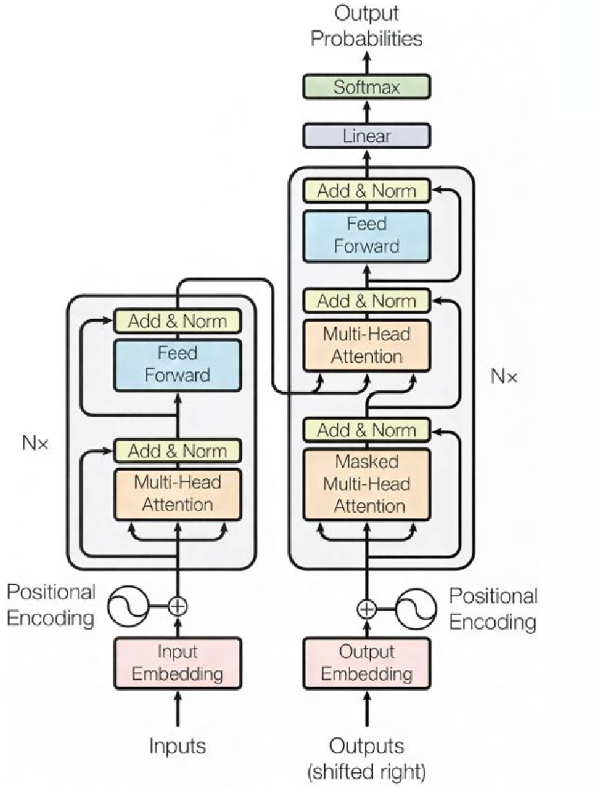
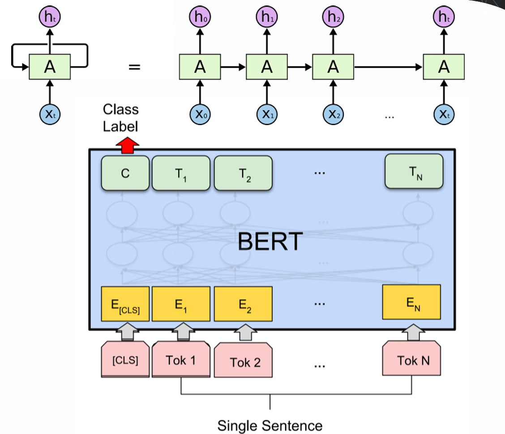
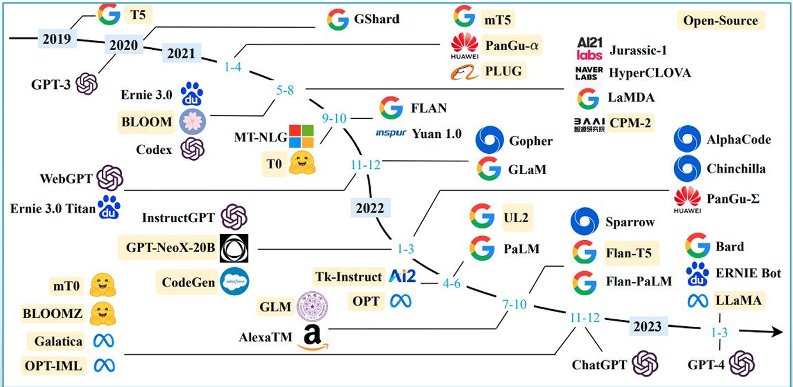
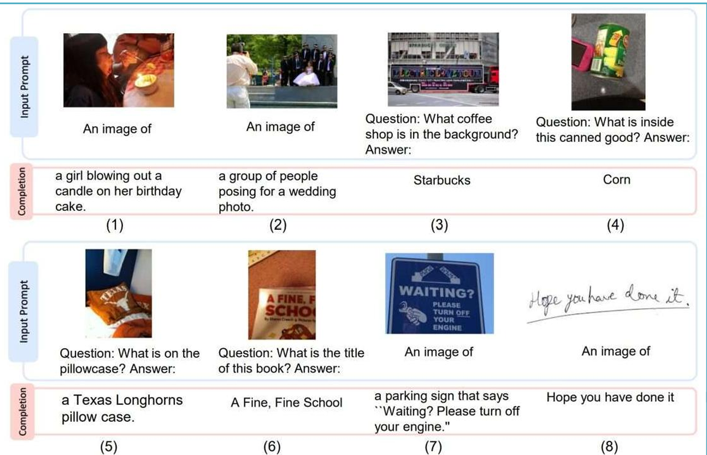

#### * NLP

- 자연어 처리(Natural Language Processing)

  - 컴퓨터가 인간의 언어(자연어)를 이해하고, 해석하고, 생성할 수 있도록 만드는 인공지능의 한 분야

- 자연어

  - Traditional communication tool
    - 인간과 컴퓨터(시스템)의 소통을 돕거나, 인간 간의 소통을 자동화·효율화해 주는 커뮤니케이션 툴
    - Large dataset  (web documents, google books, etc 를 활용해서 학습이 가능)

  - 비정형 데이터(Unstructured data)
    - Syntactic flexibility : 동일한 의미를 전달하더라도 문장 속 단어의 배열이나 구조를 다양하게 바꿀 수 있음

  - Sequential data
    - 자연어는 단어가 모여 문장이 되고, 문장이 모여 문단이 되며, 문단이 모여 하나의 문서가 되는 순서와 계층이 있는 데이터
      - Documents = list of paragraphs
        - **Document** = `[Paragraph_1, Paragraph_2, ..., Paragraph_N]`
      - Paragraphs = list of sentences
        - **Paragraph** = `[Sentence_1, Sentence_2, ..., Sentence_M]`
      - Sentence = list of word
        - **Sentence** = `[Word_1, Word_2, ..., Word_K]`

- 자연어 처리가 쓰이는 기술

  - RNN, LSTM, Transformer, BERT, GPT, Gemini

  - 트랜스포머 아키텍처

    - 단어 간의 관계를 파악하는 'Multi-Head Attention'과 데이터 정규화를 거치는 'Add & Norm' 층의 구조가 시각화

    

  - RNN과 BERT 구조

    - RNN 순반향 전개(상단)
      - 데이터를 순서대로 하나씩 처리하는 전통적인 RNN의 재귀적 구조
    - BERT 모델 구조(하단)
      - 여러 단어 토큰(Tok1, Tok2 등)을 입력받아 양방향 문맥을 동시에 분석하여 문장의 의미를 이해

    

- LLM 진화 계보도

  

- 멀티모달 AI 활용 예시

  - 텍스트와 시각 정보의 결합(이미지를 입력받아 상황을 설명 하거나 질문에 답)

  