### 정보과학을 왜 배워야 하는지

- 미래에 대한 예측과 대비
- 문제 해결 능력 배양 / Computational Thingking
- 알고리즘
- 창의력
- 구현 능력(프로그래밍)
  - ai시대에도 적어도 1개 이상의 프로그래밍 능력이 있어야함
- 근사해, Prior Knowledge 활용
  - TSP(Traveling Salesperson Problem)에서 nearst neighbors가 가장 짧은 싸이클인지 보장할 수 없지만 NN은 optimal과 근접

### Computational Thingking

- 세계 모든 사람들이 사용하는 근본적 기술
  - 다양한 분야에서 복잡한 문제를 체계적으로 해결하는 것
- 문제를 컴퓨터가 효과적으로 해결할 수 있도록 정의하고, 이를 해결하기 위한 사고의 과정
  - 문제를 분해하고 표현, 패턴을 인식, 추상화, 일반화
- 전산학의 기본 개념을 바탕으로 문제를 해결하고 시스템을 설계하며 인간의 행동을 이해
  - 추상화 : 실세계의 복잡한 문제를 간결하고 명확하게 핵심 위주로 단순화시키는 것
- 컴퓨팅 사고는 이미 다른 분야에 영향을 미쳤으며, 컴퓨팅 사고를 가르치는 것이 미래세대가 전산학분야에 오는 것 뿐 아니라 모든 분야의 사람들에게 도움이 될 수 있다
- 컴퓨팅 사고를 이용한 문제 해결 : 교통 앱 개발 (지하철 안내, 버스 안내, 자동차 Navigator)
  - 네비게이터에서 아직 구현되어 있지 않은 것 : Random 배정
    - 네비게이션이 복잡하지 않은 곳(혼잡도 20%)만 배정하게 되면서 다른쪽(혼잡도 80%)이 혼잡도가 내려가는 현상이 반복 - 일관성하지 않은 문제를 Random 배정으로 해결

- core skills for future workers
  1. Analytical Thinking ( 분석적 사고 : 문제해결 능력)
  2. Creative Thinking (창의적 사고)
  3. Resilience, Flexibility and Agility (탄력성, 유연성 및 민첩성)
  4. Motivation and Self - awareness (동기부여 및 자기인식)
  5. Curiosity and Lifelong Learning (호기심과 평생학습)

### 인공지능 경쟁력

- 3가지 요소 : Computing Power, Data, Man Power

- Computing Power
  - Super Computer : 미국(173), 중국(63), 독일(40), 일본(34) ... 한국(13)
  - Cloud : Amazon MS, Google, IBM, Oracle, Alibaba, SAAS, SAP
- Data : 미국 vs 중국
- Man Power (인력)
  - 배출 : 중국(47%), 미국(18%), EU(12%), 인도(5%), 캐나다(2%), 영국(2%), 한국(2%)
  - 보유 : 미국(52%), 중국(12%), 영국(8%), 독일(4%), 프랑스(4%), 캐나다(3%)

## 기억장치(Memory)

### * Bit

- Bit = Binary Digit (이진수)
  - 1 또는 0로 표현되는 수
  - 두 개의 상태 중 하나를 표시
  - 정보 표현의 최소 단위
- 한 Bit가 가지는 다양한 의미
  - 숫자 (1 or 0)
  - 불리안 값(Boolean Value) - 진위(Ture or False)
  - 전압(Voltage) - 높음 or 낮음
- Bit Pattern
  - Bit Pattern은 정보의 표현에 사용
    - 컴퓨터에서 데이터를 표현하는 가장 기초적인 0과 1의 조합
  - 숫자(Numbers), 문자(Text characters), 영상(Images), 소리(Sound), 기타

### * Boolean Operations 

- 부울 연산 : 한 개 이상의 true(1)/false(0)를 다루는 연산

- 주요 연산자

  - AND, OR, XOR(exclusive or), NOT

    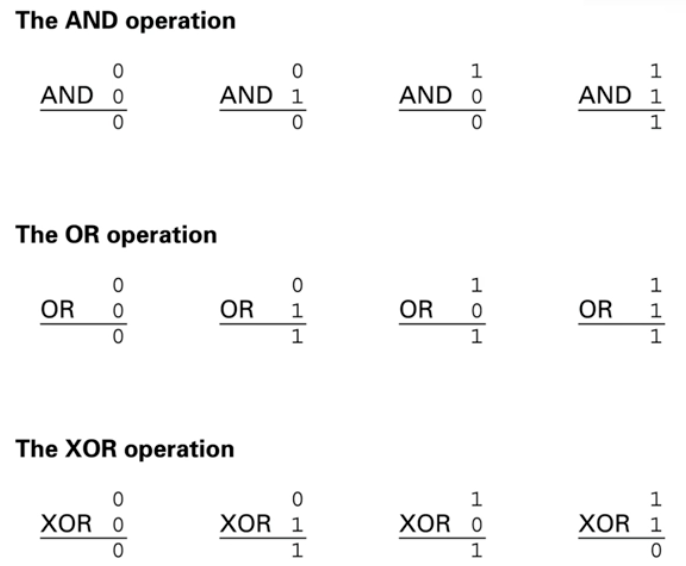

### * Shift 연산

-  logical shift : left/right로 shift
    - SHL 0011 = 0110,  SHR 0011 = 0001
    - shift 된 값은 보통 다른 register에 들어감
    - 언제 쓰나?  serial communication

- arithmetic shift : sign bit를 reserve

    - arith. shift left : * 2 효과     ASL 0010 = 0100
    - arith. shift right : / 2 효과    ASR 1110 = 1111
      						     (-2)     (-1)

- Ex) A3(10100011)를 3bit 오른쪽으로 돌리면? 01110100

  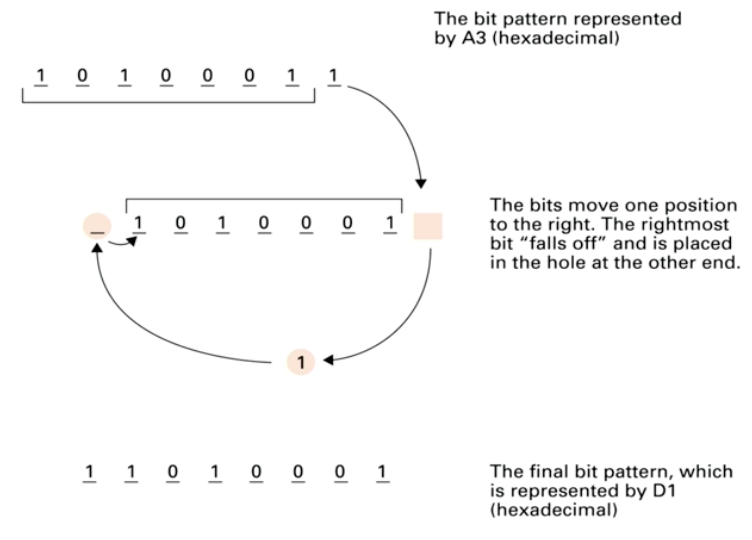

### * Gate

- 주어진 입력(input)과 부울 연산(boolean operation)에 대하여 출력(output)을 내주는 장치

- 전자회로로 구성

- 컴퓨터 구성의 기본 단위로 제공

- Gate 구현은 트랜지스터(transistor)로 가능하다

- AND 게이트

  - F = xy

- OR 게이트

  - F = x + y

- XOR 게이트

  - F = x'y + xy'

- NOT 게이트

  - F = x'

- NAND

  - NOT (A AND B)
  - F = (xy)'

- NOR

  - NOT (A OR B)
  - F = (x + y)'

- AND, OR, XOR(exclusive or), NOT, NAND, NOR gate와 입출력의 그림 표현

  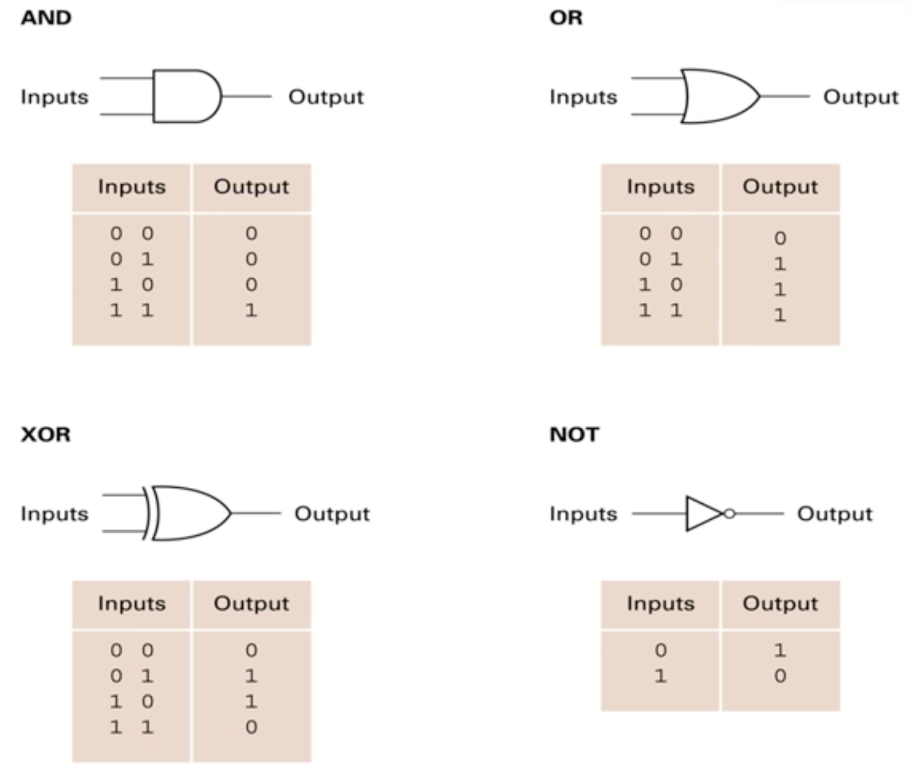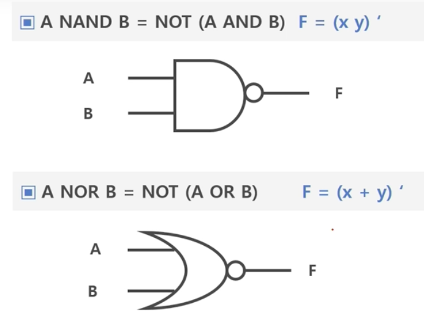

### * Flip-flop

- gate로 만들어진 1bit 정보(0 또는 1)를 저장(기억하는) 장치(논리 회로)

- Set과 Reset은 저장된 값을 1과 0으로 바꿔준다

  - Flip-flop은 원래 이전 상태를 계속 유지하지만, Set/Reset이 들어오면 그 상태를 무시하고 강제로 바꾼다
  - 입력이 끝나도 상태가 유지된다
    - Set → 1로 바뀜 → 입력이 사라져도 계속 1 유지
    - Reset → 0으로 바뀜 → 계속 0 유지
  - Flip-flop은 클럭의 특정 순간(edge - 상승하강 순간)에서 입력을 받아 값을 저장한다
    - Clock : 일정한 간격으로 ON/OFF를 반복하는 신호(언제 동작할지 정해주는 신호)
      - 컴퓨터의 동작 타이밍 기준 (클럭에 따라 컴퓨터가 움직인다)
      - Hz : 1초에 클럭이 몇 번 발생했는지
        - ex : 10 Hz = 1초에 10번 = 0.1(1/10)초 마다 한 번씩 동작
      - 클럭이 크면 더 빠르게 동작이 가능하고 더 많은 연산 수행이 가능

- Set(S) : 저장된 값을 1로 만들어 주는 input line

  - 출력 Q = 1

- Reset(R) : 저장된 값을 0로 만들어주는 input line

  - 출력 Q = 0

- 아무런 input이 없을 경우에는 최근에 저장된 값을 유지

  - Flip-Flop은 원래 값을 기억하는 장치

- SR Flip-Flop 기본 동작표

  | S    | R    | 의미           | 결과             |
  | ---- | ---- | -------------- | ---------------- |
  | 0    | 0    | 아무 입력 없음 | **이전 값 유지** |
  | 1    | 0    | Set            | 1                |
  | 0    | 1    | Reset          | 0                |
  | 1    | 1    | 금지           | ❌(불안정한 상태) |

- ex) 단순한 Flip-flop 회로 

  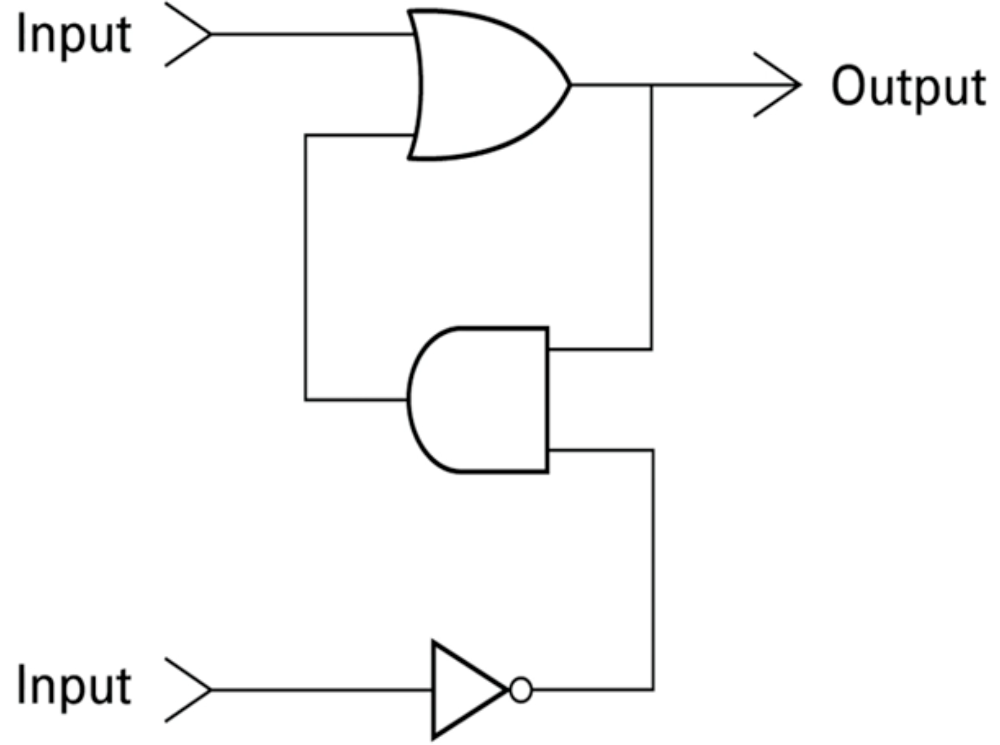

  - Set : 1, Reset : 0

    - Set → 1로 바뀜 → 입력이 사라져도 계속 1 유지

    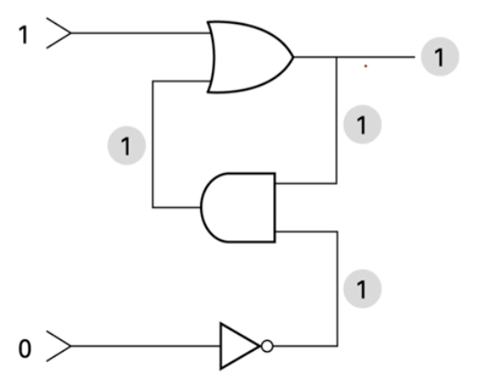

  - Set : 0, Reset : 1

    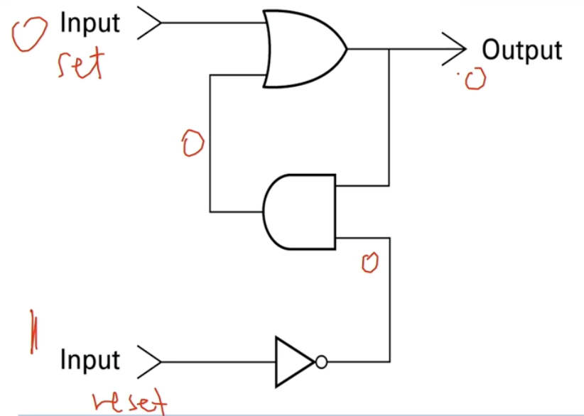

### * 16진법(Hexadecimal)표현

- 긴 2진법을 간략히 표시한 것

- 4비트씩 그룹으로 나누어 표시

  - 각 그룹을 하나의 심볼로 표시
  - Ex) 2진법 10100011는 16진법 A3으로 표현

  | 10진수 | 16진수 | 2진수 (4bit) |
  | ------ | ------ | ------------ |
  | 0      | 0      | 0000         |
  | 1      | 1      | 0001         |
  | 2      | 2      | 0010         |
  | 3      | 3      | 0011         |
  | 4      | 4      | 0100         |
  | 5      | 5      | 0101         |
  | 6      | 6      | 0110         |
  | 7      | 7      | 0111         |
  | 8      | 8      | 1000         |
  | 9      | 9      | 1001         |
  | 10     | A      | 1010         |
  | 11     | B      | 1011         |
  | 12     | C      | 1100         |
  | 13     | D      | 1101         |
  | 14     | E      | 1110         |
  | 15     | F      | 1111         |

### * 주 기억장치(Main memory)

- CPU가 직접 접근해서 데이터를 읽고/쓰는 저장장치

  - 현재 실행 중인 프로그램과 데이터를 저장하는 공간
  - Computer 내부에 있는 수많은 bit들의 저장 장소
  - 필수조건 : 어떠한 주소(address)도 일정 시간 내에 read/wirte되어야 한다.

- RAM (Random Access Memories ) - 가장 대표적인 주기억장치

  - 메모리의 아무 위치나 바로 직접 읽고 쓸 수 있다
    - RAM은 여러 cell들이 엄청 많이 모여있는 구조인데, 특정 cell 하나를 바로 선택해서 접근이 가능하다 (원하는 위치 바로 접근 가능)

- ROM(Read-Only Memory)

  - 절대 고칠 필요가 없는 정보를 저장

- cell : 컴퓨터의 주 기억장치의 단위 (보통 8 bits)

  - cell에는 순서(고유 번호)가 주어진다.
  - 데이터 하나가 들어가는 "칸"

- Byte : 연결된 8 bits

  - 1btye = 8bit
    - 7bit (영문 표현의 최소 개수) + 1bit (error check용 또는 다른 용도)
  - 주 기억장치는 byte 단위로 분할
  - 1KB  = 1024byte, 1MB = 1024MB, 1GB = 1024MB

- High-order end : cell의 왼쪽 부분

  - most significant bit(가장 의미가 많은 비트) : cell의 맨 왼쪽 비트

- Low-order end : cell의 오른쪽 부분

  - Least significant bit(가장 의미가 적은 비트) : cell의 오른쪽 마지막 비트

  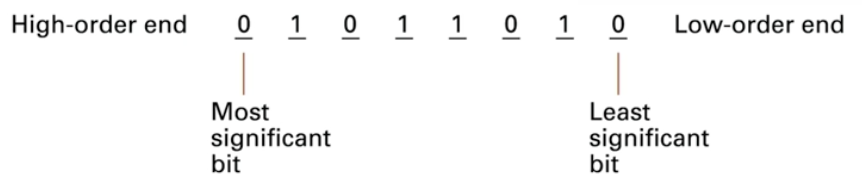

- word : 특정 CPU(중앙처리장치)가 한번에 처리하는 byte 수

  - ex) 32 bit CPU : 1 word = 4 byte = 32bit
    - 32 bit CPU는 word 단위로 read/write 됨 => 4byte 한번에 처리

- 주 기억장치의 주소

  - 주소(Address) : 컴퓨터 주 기억장치의 각 cell에 주어지는 고유 번호
    - 주기억장치의 각 byte에 접근하기 위해서는 각 byte를 구별할 수 있는 고유의 주소가 필요
  - 주소는 처음 cell에 0으로 시작되어 연속적으로 주어진다.
    - 8비트 주소 : 00 ~ FF
    - 16비트 주소 : 0000 ~ FFFF
  - Cell은 순서가 있어 "먼저 cell", "다음cell"이란 표현의 의미를 갖는다

  - 메모리 셀(데이터를 저장하는 칸)들이 주소에 따라 배열되어 있는 모습

    - RAM은 byte의 1차원 배열로 볼 수 있다.

    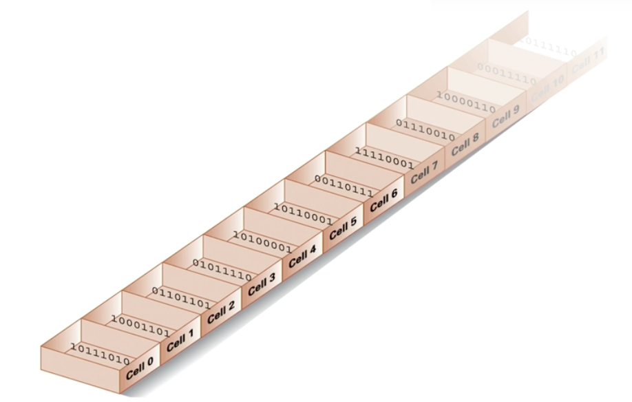

- 주 기억장치에 부가되는 회로

  - 읽기(read) - ex) 주소 700번지에 들어있는 내용은?
    1. CPU가 address를 준다. (CPU -> MEMORY)
    2. MEMORY가 그 내용을 준다. (CPU <- MEMORY)
  - 쓰기(write) - ex) 주소 700번지에 새로운 값 25를 저장
    1. CPU가 address와 byte값을 준다.
    2. MEMORY가 byte값을 바꾼다. (원래 있는 값은 없어짐)

### * 대용량 저장 장치(Mass Storage Systems)

- Non-volatile(비휘발성) : 컴퓨터가 꺼져도 data가 남아있다.
  - 주 기억장치인 Ram은 컴퓨터가 꺼지면 data 사라짐
- 일반적으로 주 기억장치보다 훨씬 크다
- 백업용
- 반대되는 개념인 순차접근(Sequential Access) Storage는 앞에서부터 차례로 읽어야 함
- 보통 회전하는 disk로 Hard disk, floppy disk, CD-ROM가 있다
  - 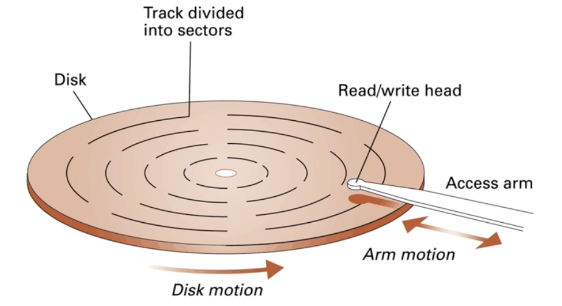
- 주 기억장치보다 접근 속도가 느리다.
  - Data access must wait for seek time(head positioning)
  - Data access must wait for rotational latency
- 보조 기억 장치(secondary memory)
  - Track : 하드 디스크 표면에 있는 동심원 모양의 원형 저장 경로
  - cylinder : set of track - 여러개의 디스크에서 같은 위치의 track들을 세로로 묶은 것
  - Sector : 512 ~1024 byte 단위로 분할
  - Perfomance measure
    - Seek time : head를 해당 track까지 이동하는 시간 (어디에 있는지 찾아서 이동하는 시간)
    - Rotation delay or Latency time : head를 해당 sector까지 기다리는 시간
      - 디스크가 돌아가서 원하는 섹터가 헤드 아래로 올 때까지 기다리는 시간
    - Transfer rate : 자료의 전송 속도
  - Access time : seek time + ratation delay
- Formatting : 저장장치를 사용할 수 있도록 구조를 만드는 작업
  - 디스크를 트랙, 섹터 같은 구조로 나누고 데이터를 저장할 준비를 하는 과정

### * USB(Universal Serial Bus) flash drive

- 컴퓨터와 주변 기기를 연결하는데 쓰이는 입출력 표준의 하나
- Flash Memory : 비 휘발성 기억장치
- 장점 : 읽기 속도가 빠르며 Hard disk보다 충격에 강하다
- 단점 : (NAND flash memory) Block 단위 쓰기 읽기 가능
  - 덮어 쓰거나 지우려면 모든 Block을 지워야함

### 

## 비트 패턴을 이용한 자료의 표현

### * Text의 표현

- 프린트 가능한 모든 철자 (문자, 구두점 등)마다 고유의 bit pattern이 주어짐.

- ASCII(American Standard Code for Information Interchange)

  - 영어에서 사용되는 대부분의 문자 표시로 7bit를 사용하였으나 8bit로 확장
  - ANSI 제정
  - Hello. = 01001000 01100101 01101100 01101100 01101111 00101110

- Unicode

  - 세계 주요 언어에서 사용되는 대부분의 문자표시로 16bit사용
  - 65336 chars  49000 지정(한국어, 중국어, 일본어 ... )

- ISO표준 : 이 세상의 모든 언어로 32bit

-  코드 (Code)

  - 컴퓨터는 2진수만 인식

  - 사람은 숫자, 영문자, 한글, 특수기호 사용

  - 사람이 쓰는 문자들을 컴퓨터에서는 어떤 2진수로 표현할 것인가에 대한 규약

    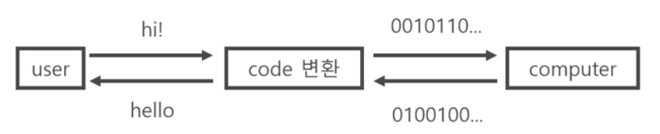

  -  한글 코드

    - 제정 기관 : 한국공업진흥청

    - KS X 1001:2004 : 완성형 한글이 2350자이지만 완전한 한글 표현 불가능

    - Unicode에서의 지원 : 한글 11,172자

    - 현재 조합형 한글코드 KS X 1001 부속서3

### * 숫자의 표현(Representing numeric values)

- 이진 표현 : 이진법에 기반한 bit표현

- 컴퓨터 수치 표현의 한계

  - 넘침(Overflow) : 표현할 수 있는 한계를 넘을 때 발생
  - 버림(Truncation) : 두 연속된 숫자의 사이 숫자를 표현하고자 할 때 발생

- 보통 2진수로 바꾸어 연산

- 이진수 체계(Binary Number System)

  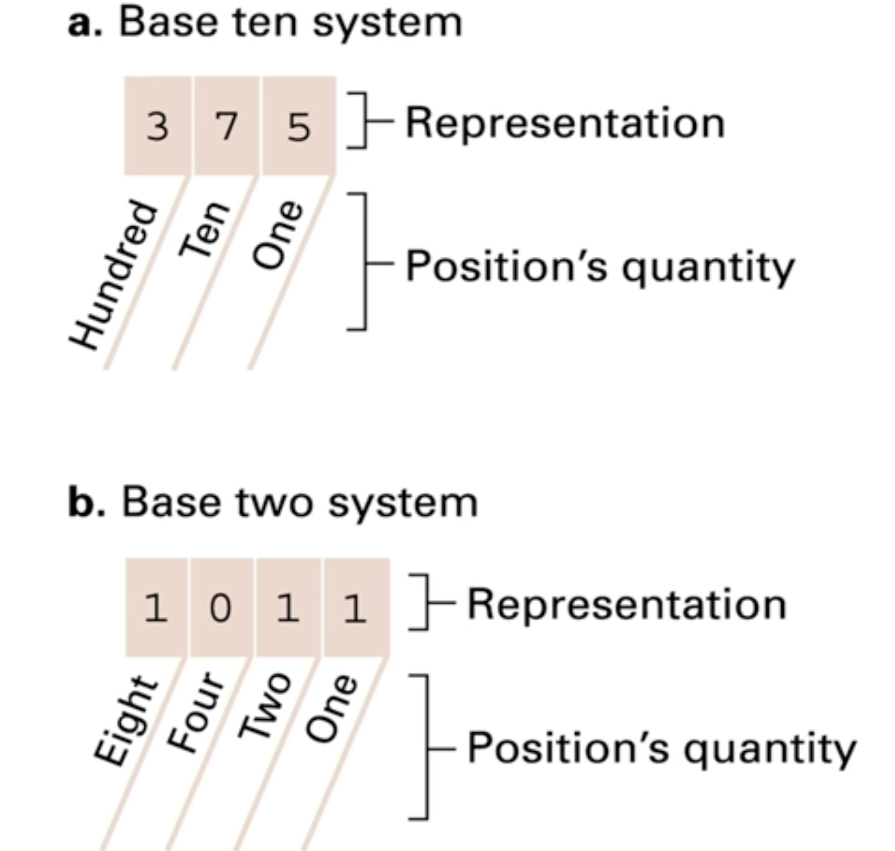

  - 10진수
    - (243)₁₀ = 2 × 10² + 4 × 10¹ + 3 × 10⁰
    - 실수는 정확한 표현 불가능 (1/3 =0.3333333333....)

  - 2진수

    -  (1101)₂ = 1 × 2³ + 1 × 2² + 0 × 2¹ + 1 × 2⁰

    - (1.101)₂ = 1 × 2⁰ + 1 × 2⁻¹ + 0 × 2⁻² + 1 × 2⁻³ = 1 + 5/8 = 1.625

      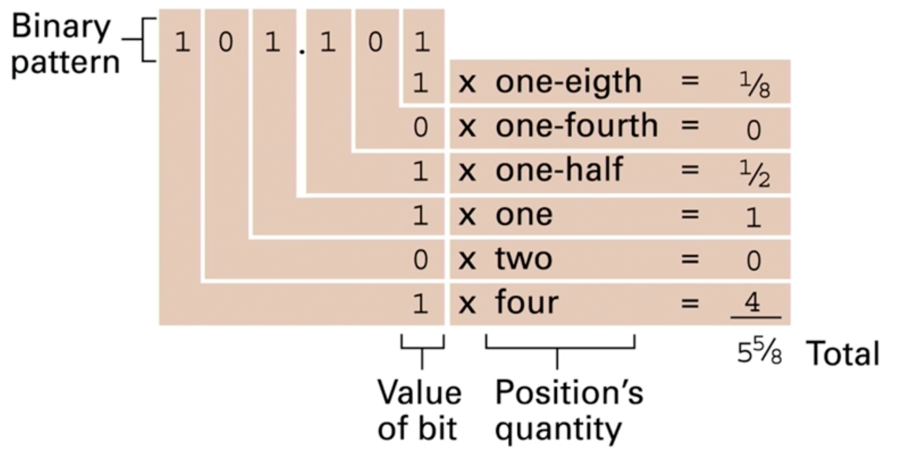

- 정수의 이진표현을 찾는 알고리즘

  1. Divide the value by two and record the remainder.
     값을 2로 나누고 나머지를 기록한다.
  2. As long as the quotient obtained is not zero, continue to divide the newest quotient by two and record the remainder.
     몫이 0이 될 때까지, 새로 얻어진 몫을 계속 2로 나누고 나머지를 기록한다.
  3. Now that a quotient of zero has been obtained, the binary representation of the original value consists of the remainders listed from right to left in the order they were recorded.
     이제 몫이 0이 되었으므로, 원래 값의 2진수 표현은 기록된 나머지들을 오른쪽에서 왼쪽 순서로 나열한 것이다.

### * 영상 소리 등의 표현에 대한 이해

- Image : 픽셀(picture element)들의 2차원 배열

  - bitmap techniques

    - 장점 : 간단
    - 단점 : 임의의 크기로 확대/숙소가 어렵다(픽셀 깨짐 현상)
    - 색상 깊이(Color Depth)
      - 1 bit: 흑/백 (2가지 색)
      - 8 bit: 256색 (팔레트 방식)
      - 24 bit: RGB 각각 8bit → 약 1670만 색
      - 32 bit: RGB + Alpha(투명도)
    - 이미지 용량 계산 방법
      - 가로 픽셀 x 세로 픽셀 × 픽셀당 byte(bit per pixel) = 전체 용량
    - 압축 방법 : GIF, JPEG

    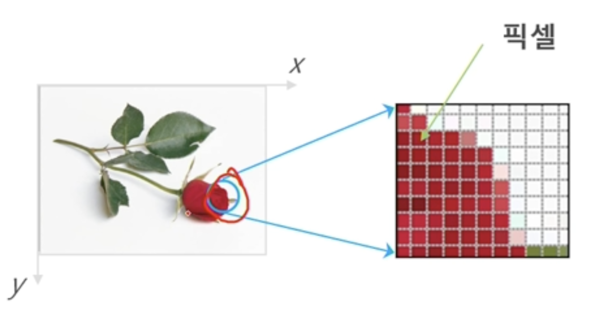

  - 벡터 기법(Vector Techniques)

    - 기본 도형(선, 원호, 곡선 등)의 집합

    - 장점 : 확대 축소가 자유로움

    - 크기 조절 가능(Scalable)

    - 사진 수준의 영상 구현 불가능 (Digital camera가 bitmap을 사용하는 경우)

    - PostScript (Adobe), PDF

      - 어떤 printer에서도 인쇄가능

      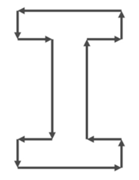

- 소리

  - 음파(Sound wave)의 저장

    - Amplitude를 일정시간 간격으로 sampling하여 정수 값으로 저장(mono:16bit, stereo:32bit)
    - 장거리 전화
      - 발신기는 초당 8000회 정도로 소리를 sampling해서 정수로 표현하여 수신기에 전송
      - 수신기는 정수값을 소리로 재생
    - 음악녹음 시 초당 44,100 sampling 필요

    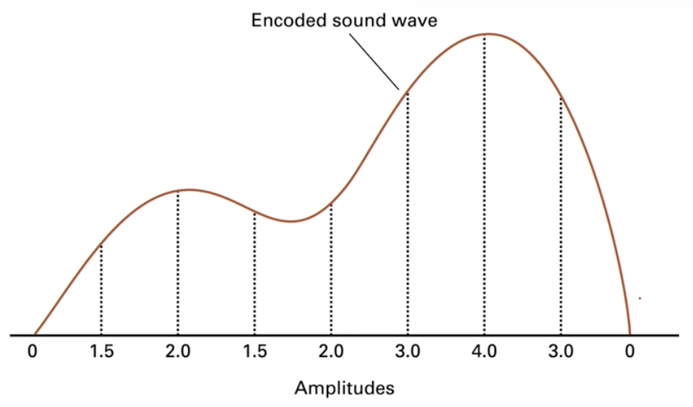

  - MIDI

    - Sound 자체가 아니라 sound를 생성하기 위한 명령만을 기억
    - Clainet: note D for 2sec, MIDI : 3bytes, 44.1K samples : 2M bits

## 자료의 저장

### * 정수 표현(Representing Integers)

- 부호 없는 모든 정수는 이진수로 표현가능

- 정수 = 양의 정수, 0, 음의 정수

- 부호화된 숫자표현(Signed magnitude notation)

  - 음수는 첫 번째 bit를 1로 표현한다
    - ex) 0111 = 7, 010 = 2, 001 = 1, 000 = 0, 100 = -0, 101 = -1, 110 = -2, 1111= -7

- 1의 보수표현(One's complement notation)

  - 0은 1로 1은 0으로 표현
    - Ex) 011 = 3, 100 = -3, 000 = 0, 111=-3, 0111 = 7, 1000 = -7, 0000 = 0, 1111=-0

- 2의 보수표현(Two's complement notation)

  - 2의 보수에서는 MSB가 1이면 음수

  - 양수/음수 구분 없이 그냥 더하면 된다

    - 뺄셈 생각할 필요 없다

  - 곱하기/나누기는 더하기/빼기를 반복하면 된다

  - 모든 비트를 반전(1의 보수표현) + 1을 해준다

    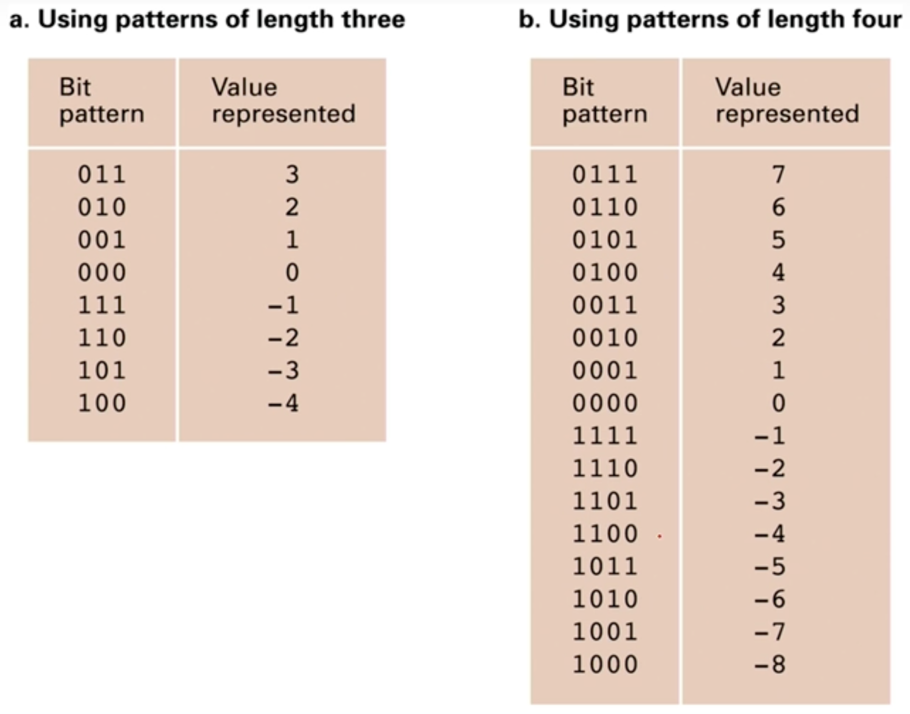

  - 2의 보수표현을 사용한 덧셈 문제 양수든 음수든 더하면 된다.

    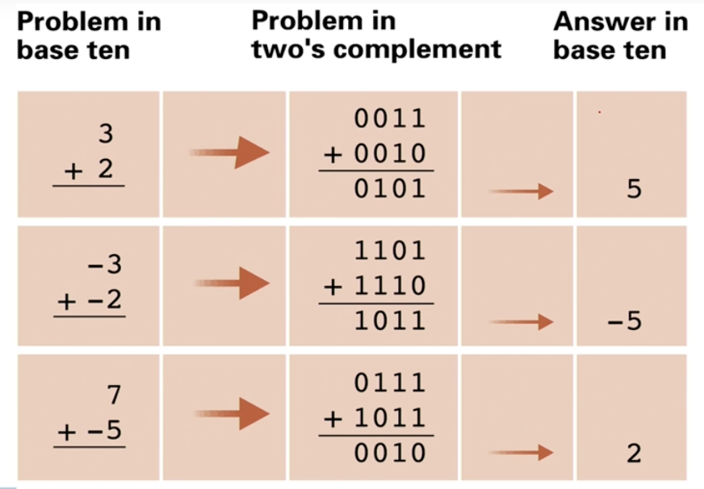

- Overflow 
  - 어떤 데이터 타입이 표현할 수 있는 범위를 넘어서는 계산 결과가 발생하는 현상
  - check 방법 : 계산 결과가 양수여야 하는데 음수로 나온다
  - 4bit로 제한 되어있을 때 표현가능 범위 -2^3 ~ (2^3 - 1)
    - 5 + 4 = 9 => Overflow가 일어나서 0101 + 0100 = 1001 = -7 엉뚱한 수가 나옴
  - 32bit CPU가 나타낼 수 있는 범위는 -2^31 ~ (2^31 - 1)
  - Factorial 계산에서는 쉽게 생김 (팩토리얼은 조금만 커져도 숫자가 범위를 넘어서기 때문)

### * 실수표현

- Excess Notation : 실수 표현시 활용

  - 어떤 값을 저장할 때 일정한 값(Bias, 편향값)을 더해서 표현하는 방법

    - 저장값 = 실제값 + Bias
    - 주어진 10진수에 2⁽ⁿ⁻¹⁾을 더해서 2진수로 변환
    - n bit에서 Bias는 보통 Bias = 2^(n-1)
    - 읽을 때에는 2⁽ⁿ⁻¹⁾을 빼서 10진수로

  - −2⁽ⁿ⁻¹⁾ ~ 2⁽ⁿ⁻¹⁾ − 1까지의 정수를 표현

    - 음수를 직접 저장하지 않고 전체를 Bias만큼 밀어서 표현
    - 0은 가운데가 아닌 Bias 위치에 있다

  - ex) 4bit excess notation

    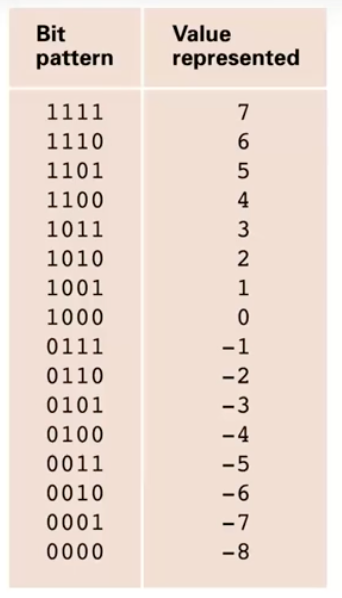

  - Ex) 3bit excess notation

    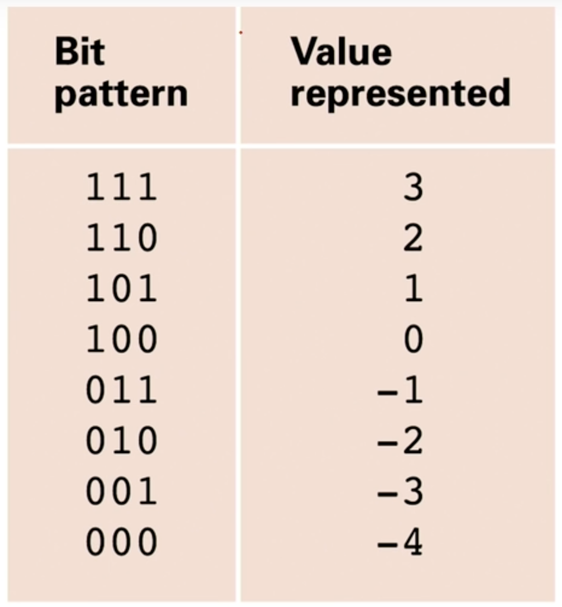

- 실수의 이진수 표현(Floating-point Notation)

  - 컴퓨터에서 floating point 표기법 - (부호 1비트, 지수3비트, 가수 4비트 기준)

    - Sign bit : 부호 (양 : 0 음 : 1)
    - Exponent : 2^n (3-bit excess 표기 사용)
    - Mantissa : 유효 수(normalize된 값)

    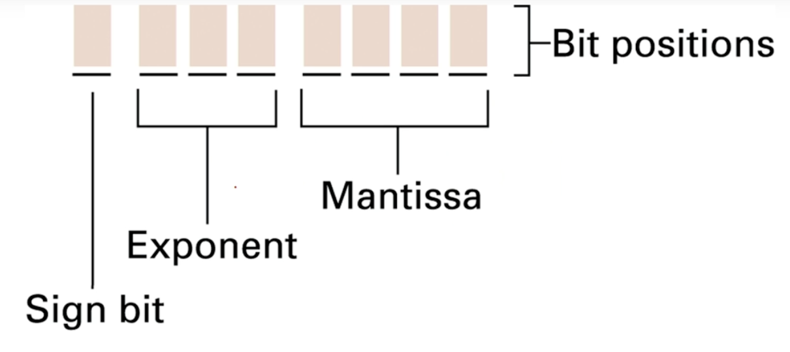

  - 수의 범위

    - 표현 가능한 가장 큰 수
      - 0 111 1111 => 0.1111 * 2³ = 111.1₂ (7.5)
    - 표현 가능한 가장 0에 근접한 수
      - 0 000 0001 (X) 0 000 1000(O) => 0.1000 * 2⁻⁴ = 0.00001 (1/32)
        - 0001이 아니고 1000인 이유 : 1이 소숫점 첫 번째 자리에 오도록하는 표준화

  - 1.625₁₀ = 1.101₂ = 110.1₂ × 2⁻² = 0.1101₂ × 2¹

    - 1.625₁₀ = 1.101₂
      - 소수부분에서 2를 곱하면 다음 이진수 자리(bit)가 정수 부분으로 튀어 나온다
        - 2를 곱해서 나온 값(0, 1)이 이진수 자리에 들어간다
        - = 1×2⁻¹ + 0×2⁻² + 1×2⁻³ = 1/2 + 0 + 1/8 = 0.625
      - 1.625₁₀의 floating point 표기 : 01011101
    - 0.1101₂ × 2¹ 
      - 소수점을 왼쪽으로 1칸 이동 => 지수 1
      - mantissa (가수) : 0.1101
      - exponent (지수) : 1
      - Base (밑) : 2
    - 표준화 (Normalization) : 가수부의 첫 번째 1이 소숫점 다음으로 오도록 함
      - 1이 소숫점 첫 번째 자리에 오도록 하는게 표준화

  - 2½ + ⅛ + ⅛ 와 같은 계산의 오차(Error)를 줄이는 방법

    1. 2½ + ⅛ 을 먼저 계산해버리면 2⅝와 같이 Raw bit pattern을 lost하게 되므로 작은 값들 부터 먼저 더한다 => ⅛ + ⅛
    2. 이 후 작은 값들을 더한 값에 큰 값을 더 한다
       - 2½ + (⅛ + ⅛) = 2¾
       - 2½ + ⅛ + + ⅛ = 2½ 

    - 2⅝의 loating point 표현

      - 2⅝ = 10.101₂ Mantissa 자리에 4bit의 유효숫자 넣기위해 Row bit pattern을 버린다

        - 0 110 1010은 사실상 2.5이므로 2⅝(2.625)를 완벽하게 표현하지 못했다

        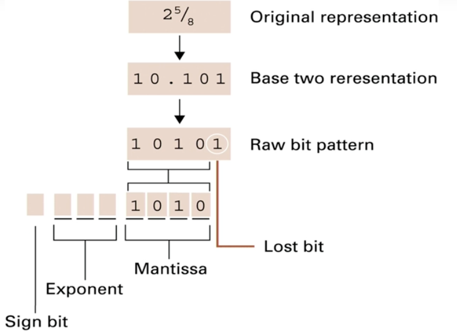

  - 실수 표현 예

    - 10진법 => 2진법

      - -2.5는 2진법으로 - 10.1₂ = - .101 × 2²

        • 11101010 => .1010 × 2² = - 10.1 (-2.5)

      - 0.375는 2진법으로 .011₂ = .11 × 2⁻¹

        • 00111100 =>  .1100 × 2⁻¹ = .011 (3/8)

    - 2진법 => 10진법

      - 11011100 =>  .1100 × 2¹ = 1.1₂ (1.5)
      - 11101110 =>  .1110 × 2² = 11.1₂ (3.5)

## 압축 및 통신 에러 교정

### * 자료 압축(Data Compression)

- 자료를 표현하는 bit 수를 줄이는 방법

- 자료 저장/전송 시 공간, 시간 절약

- 복원이 가능해야한다

- Run-length 코드화(encoding)

  - 같은 값의 연속이 많은 경우 사용
  - (Byte 수 + byte 값)으로 표현
    - 0, 0, 0, 0, 0, 1, 1, 1 => (5,0)(3,1)
  - 실제 사용 예 : 주로 그래픽 영상

- 상대적(Relative) 코드화

  - 바로 앞 자료 와의 차이를 표현
    - ex) 23, 24, 25, 25 => 23, 1, 1 ,0
  - 차이를 표현하는 부분은 bit 몇 개로
  - 실제 사용 예 : audio file

- 빈도의존 (frequency-dependent) 코드화 = Variable-length code

  - 허프만 코드 - 압축하고자 하는 문자열에서 자주 등장하는 문자는 짧은 비트로 표현하고 거의 등장하지 않는 문자는 긴 비트로 표현 (가변 길이 코드, 문자의 빈도수를 이용)
  - 자료의 빈도에 따라 서로 다른 bit 수를 씀
    - Geese -> (e, 0) (g, 10) (s, 11) 10 0 0 11 0
    - Bbbbbbbbbbbaaaaaaaaaaaaaaccccccccccccccc -> (11b)(14a)(15c)

- Quad tree 자료압축

  - 4분할하여 UpperLeft, UpperRight, LowerLeft, LowerRight의 순서로 같으면 하나의 숫자로 표시하고 같지 않으면 다시 4분할하여 계속 진행

  - 11ㅣ11
    11ㅣ11

    ㅡㅡㅡㅡ      =========> 1 1 (1 1 0 0) 0

    00ㅣ11
    00ㅣ00

- Huffman code

  - 압축하고자 하는 문자열에서 자주 등장하는 문자는 짧은 비트로 표현하고 거의 등장하지 않는 문자는 긴 비트로 표현 (가변 길이 코드, 문자의 빈도수를 이용)
  - 발생 빈도가 가장 적은 부호 두 개를 합친다 => 두 개중 발생 빈도가 크거나 같은 것에 0, 작거나 같은 것에 1을 부여한다.
    - A, B, C, D를 표현하는 일반적 방법
      - A : 00, B : 01, C: 10, D: 11 => 한 글자 당 기대되는 bit 수 : 2
    - 나타나는 확률에 따라 bit를 조절 (A : 0.9, B : 0.09, C : 0.005, D: 0.005)
      - A :0, B : 10, C:110, D : 111 => 한 글자 당 기대되는 bit 수 : 1.11
        - 1 * 0.9 + 2 * 0.09 + 3 * 0.005 + 3 * 0.005 =1.11

- Lempel-Ziv 코드화(LZW = Lempel-Ziv-Welch)

  - 적응적 사전(adaptive dictionary) 코드화

    - Dictionary : building blocks
    - 중복된 패턴 발견 시, 그냥 쓰는 대신 패턴에 대한 참고(reference)로 표현

  - 실제 사용 예 : zip file

  - 문자 -> 숫자 -> 고정길이 이진 코드 매핑표

    - 각 문자에 고유한 번호 (0~26)부여하고, 그 번호를 5bit 이진수로 표현한 것

    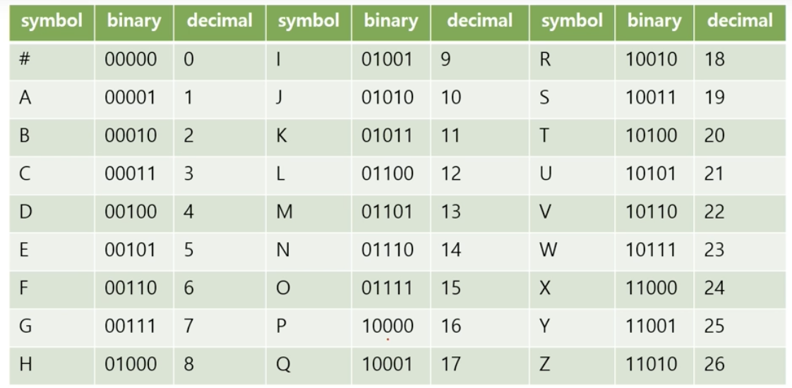

  - Ex) 코드화를 위해 주어진 문자열 "TOBEORNOTTOBEORTOBEORNOT#"

    - Unencoded 상태에 소요되는 bit 수는 25 * 5bit =125비트

    - Encoded 상태에서 소요되는 bit 수는 6code * 5bit/code + 11code* 6bit/code = 96bit

    - LZW code가 약 23% 절약 (29/125)

    - Encoding

      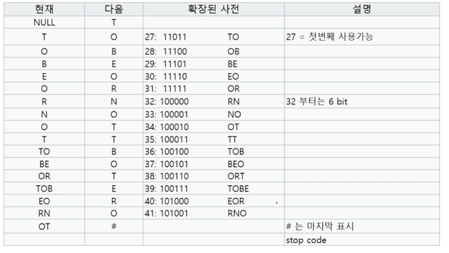

    - Decoding

      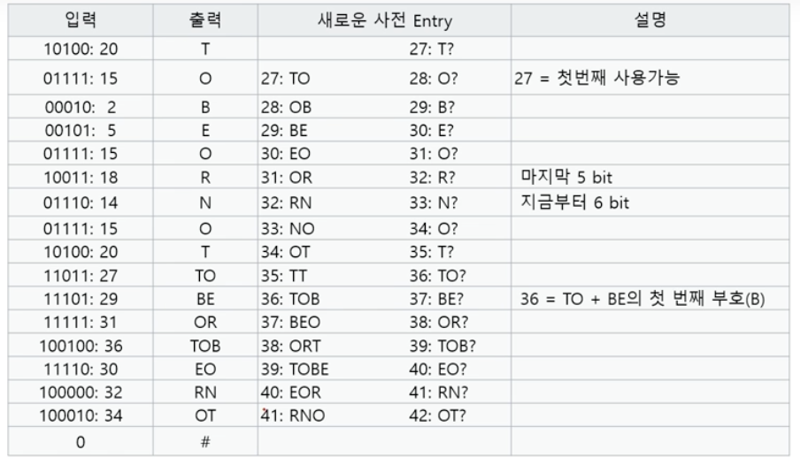

- 영상 압축(Compressing Images)
  - 정지 영상
    - GIF(graphics interchange format) : CompuServe
    - JPEG(joint photographic experts group)
  - 동영상
    - MPEG : motion picture experts group
    - MP-3 : MPEG-1 Audio Layer-3
      - 원래는 MPEG의 audio 재생용
      - 지금은 별도로 audio만을 위해사용
  - 영상 완벽 복원 압축(lossless compression)
    - Data의 손실이 전혀 없음
    - 거의 모든 압축 방법들
  - 영상 일부 손실 압축(lossy compression)
    - 중요하지 않은 data는 손실될 수도 있음
      - 사람의 눈으로 볼 수 없는 시각적 데이터를 제거하고 색상변형을 평균화
      - ex) JPEG - LSBit 들에서 손실가능
      - JPEG는 사진 영상만 다룸
    - 현재로서 최대의 압축 성능

- Parity Bits

  - 자료를 주고 받을 때, 자료의 손상을 검출하기 위한 추가 비트
  - bit 1의 개수를 짝수로 만들지 홀수로 만들지에 따라 짝수 패리티(Even Parity), 홀수 패리티(Odd Parity)가 있다
    - 약속한 패리티(짝수/홀수)와 다르면 오류 발생
  - 사용되는 곳 : main memory, printer 등
  - 점검할 수 있는 방법 : parity bit(1byte 전송 시)
    - 7bit는 data + 1bit는 parity bit(data 내용에 따라 0 또는 1)
    - ex) 0100001
      - Odd parity일 때 1 0100001 (parity bit는 1)
      - Even Pariry일 때 0 0100001 (parity bit는 0)

- 에러교정코드(Error Correcting Code)

  - Hamming code

    - 데이터 전송 시 1bit의 에러를 정정할 수 있는 오류정정부호
    - 패리티 비트를 데이터의 비트 수에 따라 필요한만큼 사용하여 데이터에 추가(Overhead)하고, 패리티 비트를 조합하여 에러 검출 및 교정 수행
      - 패리티 비트는 2의 거듭제곱에 해당하는 순서에 삽입(비트1, 비트2, 비트4 ...)
    - 데이터의 비트 수에 따라 필요한 패리티 비트의 개수 
      - 2^p >= d + p + 1 (p : 패리티 비트 수, d : 데이터 비트 수)
    - Hamming Distance : 두 비트열에서 서로 다른 비트의 개수
      - ex) 데이터가 1011일 때 해밍 코드 적용 P P D P D D D  (총 7비트)

  - Ex) 패턴 010100은 어떤 symbol?

    - 010100는 D를 보낸건데 3번째 자리가 잘 못된 거구나 알 수 있다

    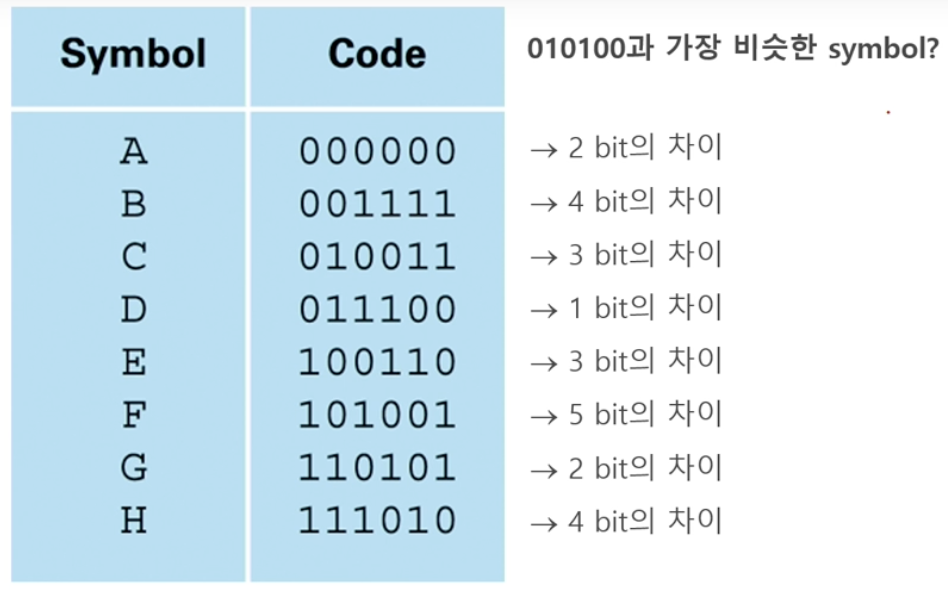

## 자료의 처리

### * 컴퓨터 구조

- 중앙처리장치(Central Processing Unit)

  - 수리/논리(Arithmetic/Logic) Unit

    - 자료 처리를 담당

  - 제어(Control) Unit

    - 컴퓨터 활동을 조정 담당

  - Registers

    - 일반목적 register : 일반적인 data 저장 / 특별목적  register(비교·연산의 기준 - 기준점)

    - CPU 내에서의 자료 저장을 위한 memory

      - 연산이 이루어진다
        - main memory -> register -> arithmetic/logic unit ->register -> main memory

        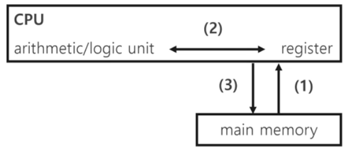

  - Cache Memory

    - memory와 CPU 사이에서 data 저장
    - 거의 register에 가까운 속도
    - main memory가 느려서 쓰임 => Buffer 역할

- Bus

  - CPU와 주 기억장치를 연결하는 한 묶음의 선

  - CPU와 주 기억장치 간의 interface

    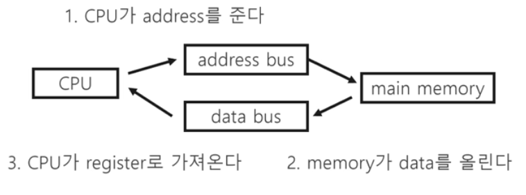

    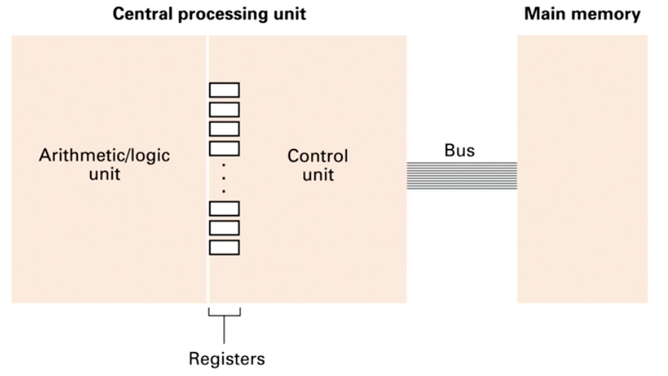

- 본체 기판(Motherboard)

### * 컴퓨터 내의 저장장치

- register, Cache memory, main memory, mass storage

### * 저장된 프로그램(Stored program) 개념

- 프로그램을 특별한 형태의 자료로 취급
  - 주 기억장치에 프로그램도 저장 가능
- 하나의 컴퓨터가 다양한 형태의 프로그램 수행 가능
- 초기의 computer : hard-wired 프로그래밍
  - switch 조작으로 프로그램
  - 자료는 주 기억장치에 저장
- 폰 노이만 (Von Neumann machine) : 현대의 모든 컴퓨터
  - 프로그램(switch 조작)을 data와 동일하게 취급
  - CPU가 프로그램을 읽어와서, 하나씩 실행
  - 특징
    1. CPUR가 프로그램을 읽기 위해서 bus 필요
    2. peripherals : data read/write에 bus 필요
    3. 결과적으로 CPU, 주변 장치 간의 bus쟁탈전
    4. bus의 속도가 컴퓨터 수행 속도에 큰 영향

### * 기계 언어(Machine Language)

- 기계 명령어(Machine instruction)

  - CPU에 의해 바로 이해되는 명령어 코드의 bit pattern

- 기계 언어(Machine language)

  - 주어진 컴퓨터에 의해 이해되는 모든 명령어들의 집합
  - 우리가 쓰는 프로그래밍 언어 (high level)  -(컴파일)-> 기계언어

- 컴퓨터의 속도 측정 단위

  - MIPS : 초당 100만 명령어 (보통 1000MIPS)
  - FLOPS : 초당 floating-point 명령어

- 기계언어의 철학(philosophy)

  - Reduced Instruction Set Computing(RISC)
    - 적은 개수의 단순하고, 효율적이며 빠른 명령어로 구성
    - 많이 쓰이는 소수의 명령어들로만 구성
    - ex) PowerPC from Apple/IBM/Motorola
  - Complex Instruction Set Computing(CISC)
    - 많은 개수의 편리하고 강력한 명령어들로 구성
    - 목적 : 프로그래밍 언어 지원을 쉽게 해준다
      - ex) C의 for(n=0; n <K; n++) 하나의 기계 명령어로 LOOP R, K로
    - Micro-programing, micro-memory
      - CPU내에 프로그램이 들어간 형태(intel x86 series)
    - ex) Pentium from intel
  - RISC vs CISC
    - 명령어 개수 20~30개 vs 200~300개
    - clock 속도 1clock vs 최대 30~50clock
      - 보통은 RISC가 더 빠르다
    - resister 개수는 1000개 vs 20개 (CPU의 남는 공간이 RISC가 더 많아서)
    - 프로그램 길이 : CISC가 더 짧아진다 (복잡한 일을 하나의 명령으로 가능)
  - 명령어 종류(Instruction Repertoire)
    1. 자료 이전 : CPU와 주 기억장치간의 자료 복사
    2. 수리/논리 : 기존의 자료를 이용하여 새로운 자료 생성 (더하기, AND, OR ...)
    3. 제어 : 프로그램 수행의 감독자 역할

- 기계어(Machine Language)

  - Machine Instruction 예

    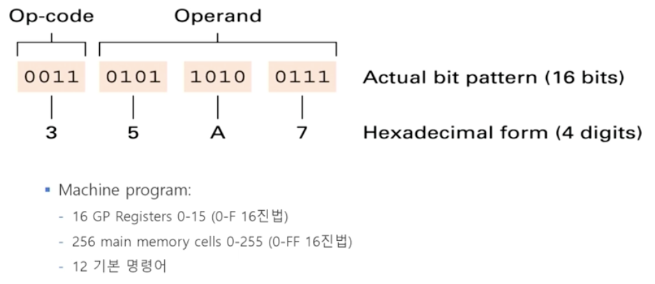

  - 기계어 명령어 : Op-code (명령어) + Operand(피연산자, 명령이 적용되는 데이터 or 주소)

    - Op-code

      - 한 명령어는 한번에 하나의 동작만 수행 (여러 동작을 한 번에 하지 않는다)
      - 덧셈, 뺄셈, 데이터 이동(LOAD, STORE), 비교(CMP)

    - Operand

      - 명령어 마다 Operand의 갯수가 다르다

      - 숫자, 레지스터, 메모리 주소

  - 자료이전 명령어

    - 다른 장소로 자료 이전

      - LOAD : MEMORY -> CPU

      - STORE/SAVE : CPU -> MEMORY

      - MOVE : MEMORY -> MEMORY

        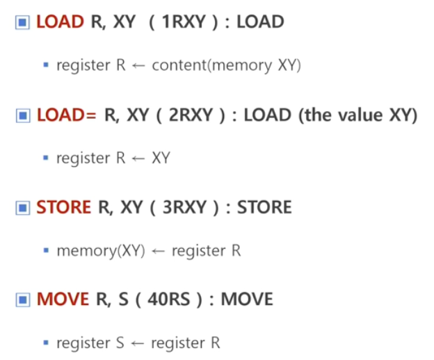

    - Transfer, Move : 정확하지 않은 개념 Copy, Clone : 정확한 개념

    - 입출력 명령어(I/O instructions)

      - 주변 장치와의 통신

  - 수리/논리(Arithmetic/Logic) 명령어

    - AND/OR/XOR : bit pattern 간의 AND/OR/XOR

    - SHIFT/ROTATE

    - ADD/SUB/MULT/DIV : 사칙연산

      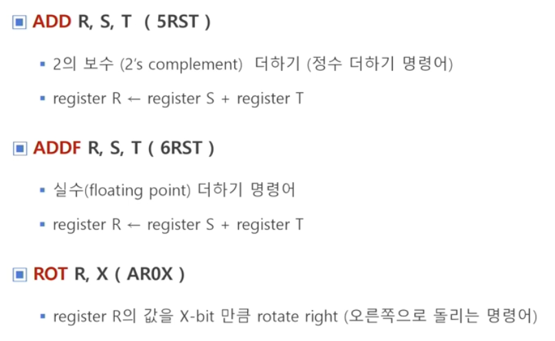

  - 8bit CPU 컴퓨터의 Memory 구조

    - 8bit CPU => 한 번에 처리할 수 있는 데이터 크기가 8bit(1byte)
      - 레지스터나 연산 단위가 기본적으로 8bit
      - 주소 : 2⁸ = 256개

      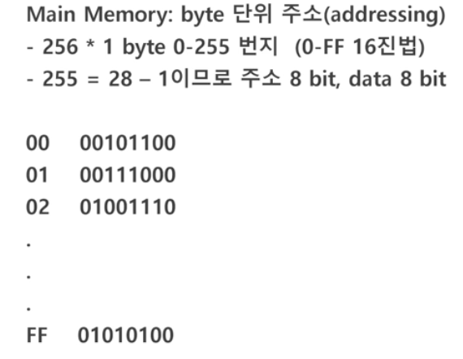

    - | 구분        | 8비트 시스템 | 16비트 시스템 |
      | ----------- | ------------ | :------------ |
      | 주소 크기   | 8비트        | 16비트        |
      | 주소 개수   | 256개        | 65,536개      |
      | 메모리 크기 | 256B         | 64KB          |
      | 주소 범위   | 0~255        | 0~65,535      |

### * 프로그램 수행원리와 예제

- 기계 명령어의 예
  - 명령어는 2byte
    - [ opcode + R ] (1byte) + [ address XY ] (1byte)
  - LOAD R, XY (1RXY) : LOAD - 간접접근
    - register R ← content(memory XY)
    - 메모리 XY번지에 있는 값을 레지스터 R로 가져온다
    - Ex) 1327 명령어 : 3번 레지스터에 메모리27번의 값을 가져온다
  - LOAD= R, XY (2RXY) : LOAD (the value XY) - 즉시값
    - register R ← XY
    - 값 XY 자체를 바로 레지스터에 넣는다 (메모리 안 거침)
    - Ex) 2127 명령어 : 레지스터1에 값 27을 넣는다.
  - STORE R, XY (3RXY) : STORE
    - memory(XY) ← register R
    - 레지스터 값을 메모리에 저장한다
    - Ex) 3333명령어 : 33번 메모리에 레지스터3에 있는 값을 저장한다.
  - MOVE R, S (40RS) : MOVE
    - register S ← register R
    - 레지스터 R 값을 레지스터 S로 복사
  - ADD R, S, T (5RST)
    - 2의 보수 (2's complement) 더하기 (정수 더하기 명령어)
    - register R ← register S + register T
    - Ex) 5412(ADD 4, 1, 2) : 레지스터 4에 레지스터1의 값 + 레지스터2의 값
  - ADDF R, S, T (6RST)
    - 실수 (floating point) 더하기 명령어
    -  register R ← register S + register T
  - ROT R, X (AR0X)
    - register R의 값을 X-bit 만큼 rotate right (오른쪽으로 돌리는 명령어)
    - Ex) resister2(00011000)일 때, A204면 10000001
  - OR R, S, T   (7RST) : bit-wise OR
    - register R ← register S OR register T
  - AND R, S, T   (8RST) : bit-wise AND
    - register R ← register S AND register T
  - XOR R, S, T   (9RST) : bit-wise XOR
    - register R ← register S XOR register T
  - bit-wise operation : bit 단위 (C의 |, &, ^)
  - logical operation : byte 단위 (C의 ||, &&)
  - JUMP R, ADDR ( BRXY ) - 비교 대상 resister0
    - if (register R의 값 = register 0 의 값) -> jump to address XY
    - 무조건(unconditional) jump : ( B0XY )
  - HALT ( C000 )
    - 무조건 실행 중단 (프로그램의 끝을 나타내는 명령어)

- 프로그램의 수행(Execution)

  - CPU의 실행에 관여하는 특수목적 Reister(저장장치)

    - PC(Program Counter) : 8bit
      - 다음에 시행될 주소를 저장 (가르켜줌)
    - IR(Instruction Resgister) : 16bit
      - 현재 시행되는 명령 내용을 저장
    - programmer가 직접 제어할 수 없다
      - 간접적인 제어는 가능(ex: JUMP)

  - 제어명령의 3단계

    - Fetch(끄집어내기) -> Decode(어떤 명령어인지 파악) -> Execute(실제 수행)
    - Fetch
      - PC가 가리키는 주소와 다음주소의 2byte를 읽고, 그 내용은 IR에 저장 PC는 현재 PC내용+2 (다음 명령을 가리킴)
    - decode : IR에 든 내용을 해석
    - execute : IR에 든 내용대로 실행 (JUMP 명령이 있다면 PC의 값을 변경)
    - Fetch/Decode/Execute 단계별로 HW 구현
    - Halt 명령을 만날 때까지 위의 작업을 반복한다

  - Ex) 

    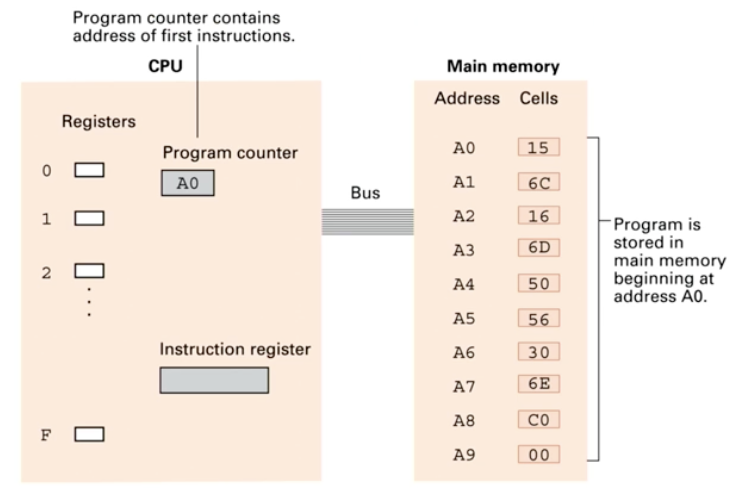

    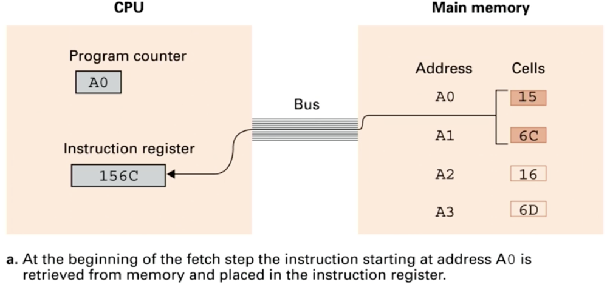

    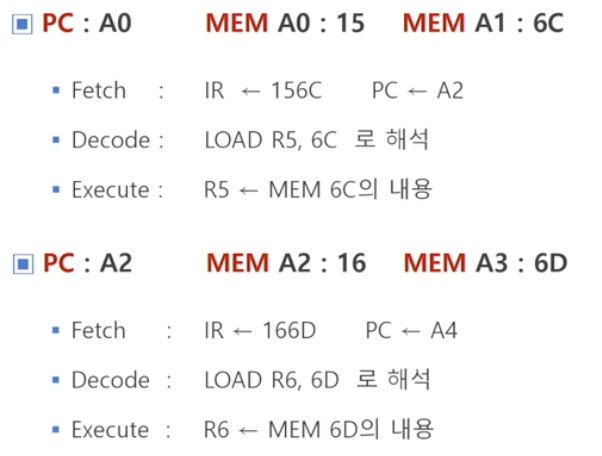

- 폰 노이만 컴퓨터

  - Main Memory
    - 프로그램(명령어)과 데이터가 같은 메모리에 섞여서 저장되어 있음
    - 프로그램을 수행하며 필요한 데이터에 접근
  - CPU입장에서는 program과 데이터 구별 불가능
    - 어떻게 읽느냐에 따라 같은 값이 명령어와 데이터로 해석이 된다
  - CPU가 자신의 프로그램을 고칠 수 있다(사용하지 않는 것이 좋음)

### * 프로그램 예제

1. 7_03 강의 다시보기

   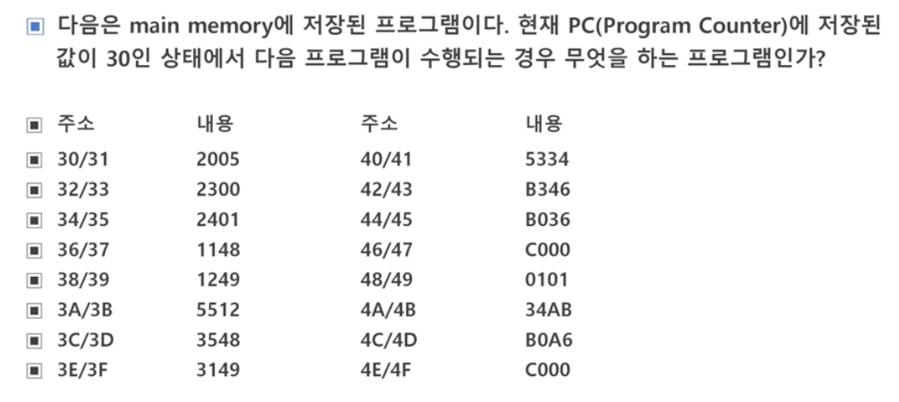

### * CPU와 다른 장치와의 통신

-  주변 장치(peripheral)

  - 컴퓨터의 (주로 입출력을 담당하는)외부 장치들
    - Ex) disk, monitor, keyboard, printer, etc

- Controller

  - CPU-주변장 간의 통신을 담당하는 중간장치

  - PC에서는 보통 별도의 controller card로 제작

    - ex) (hard disk를 위한)hard disk controller

  - 특별한 목적의 소규모 컴퓨터로 구현

    - contoller chip 속에 별도의 CPU가 있음
    - 별도의 메모리도 있음

  - bus에 직접 연결됨

    - IBM-PC : bus위의 slot에 삽입

    - CPU를 거치지 않고 메모리와 직접 통신도 가능

      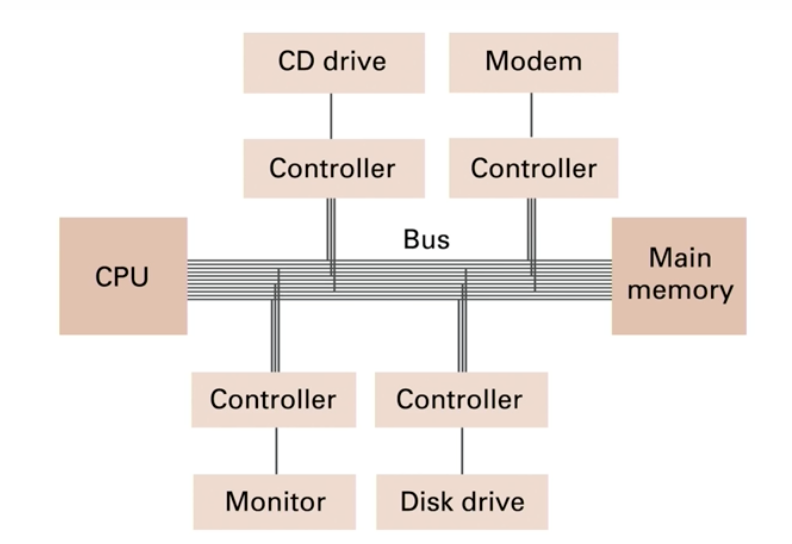

  - 폰 노이만 병목(bottleneck)

    - 충분하지 않은 버스 속도가 성능을 저하시킨다
      - 버스를 CPU만 쓰는게 아니라 주변장치도 쓰다보니 경쟁이 일어나 성능이 저하
    - 폰노이만 특징
      1. CPU가 프로그램을 읽기 위해서 bus 필요
      2. peripherals : data read/write에 bus 필요
      3. 결과적으로 CPU, 주변 장치 간의 bus쟁탈전
      4. bus의 속도가 컴퓨터 수행 속도에 큰 영향

  - 입출력 명령(I/O instructions)

  - 상태 표시어(status word) : Device상태

- Port

  - Device마다 주어지는 주소들의 집합

  - 입출력에 사용되는 특정 address

    - 모든 controller 제어는 포트를 통한다
    - 보통, 입 출력 용의 2개가 쌍으로 이루어진다

  - Memory-mapped I/O

    - 입출력 장치(포트)를 메모리 주소처럼 사용하는 방식

    - CPU가 controller's port 주소를 쓰거나 읽음(CPU가 특정 메모리 주소에 접근하면 그 주소가 I/O 장치에 연결된다)

    - 장점 : 컴퓨터 설계가 간단해짐, 단점 : 주 기억장치 관리가 어려움

    - ex) ARM, MIPS, PowerPC

      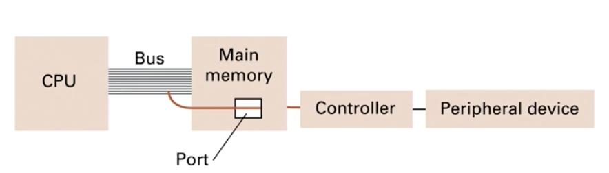

  - isolated I/O

    - 메모리와 I/O포트 주소를 완전히 따로 사용
      - 명령어 IN/ OUT
    - ex) Inel x86 방식

  - Handshaking(악수)

    - CPU가 출력 port로 명령을 보낸 후 , 해당 port에서 응답이 있기를 기다리는 방식

- 저장장치 직접 접근 방법 DMA(Direct memory access)

  - CPU가 bus를 쓰지 않는 동안 컨트롤러(I/O장치)가 메모리와 직접 통신하는 것

    - CPU가 시작만 지시하고 장치와 메모리가 직접 통신한다

      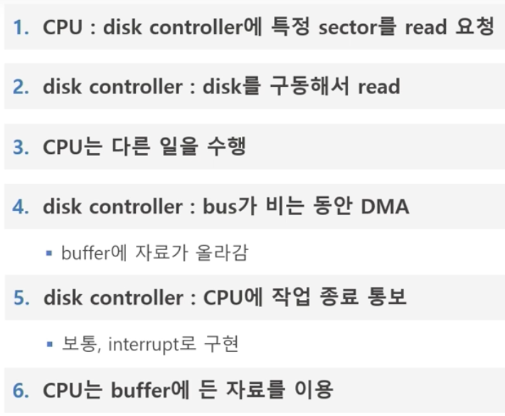

    - 기존은 장치  -> CPU -> Memory(CPU가 계속 데이터를 옮겨야해서 CPU낭비가 심함)

  - main memory access by a controller over the bus

  - buffer

    - DMA시의 자료 저장을 위한 main memory상의 특정 구역
      - DMA가 데이터를 넣거나 꺼내기 위해 사용하는 메모리 공간
      - 데이터를 임시로 저장하는 공간

- 자료 교환 속도

  - bps 
    - 초당 전송되는 비트 수 
    - 단위 : bit/sec (bits per second (1,000bps) )
    - Bandwidth(maximum available rate) : 이론적으로 가능한 최대 전송 속도

  - Baud rate : state per second (bps : baud rate의 * 한 번에 표현 가능한 비트 수)
    - 초당 신호 변화 횟수 (state변화)
    - 1baud = 신호 1번 변화
    - 유니크하게 감지할 수 있는 signal의 종류
    - ex) (서로 다른 신호 4개)도레미파 -> (00, 01, 10,11) -> 1 baud rate에 2bit전송
  - 전화선 : 기술적으로 1200 baud rate가 한계
    - baud 사용 -> 14,400bps (1200 * 12)
    - compression(데이터를 줄여서 더 많이 보내는 것) 사용 -> 57,600bps
  - 병렬 통신(parallel communication) : 여러 개의 통로로 동시 전송
  - 직렬 통신(serial communication) : 하나의 통로로 한 bit씩 전송
  - modem : modulator-demodulator
    - 디지털 신호와 아날로그 신호 사이 변환
      - 전화선은 원래 아날로그 신호만 전달 가능해서 디지털을 아날로그로 바꿔야함
    - (주로 전화선을 통해) 통신하는 장비
  - DSL(Digital Subscriber Loop) 
    - 전화선을 이용한 디지털 통신기술
    - 1.5Mbps, 6Mbps, 최대거리 3.4miles
  - Cable
    - 케이블 인터넷 (케이블 TV선 사용)
    -  40Mbps
  - Optic fibers(광섬유)
    - 빛으로 데이터 전송
    - Gbps

- CPU 속도의 한계

  - CPU 안에서 신호는 결국 전자/전기 신호 ≈ 빛의 속도(전자의 속도)
    - 신호 전달에도 일정 시간이 필요
    - CPU 속도는 전기 신호의 전파 속도와 신호 이동 거리 한계(1ns ≈ 30cm) 때문에 나노초 이하로 무한히 줄일 수 없다)
  - Nano second level 보다 더 빠를 수는 없다
    - CPU 동작은 보통 ns(10⁻⁹초) 단위
    - 신호 전달 + 논리 회로 동작 시간이 필요함
    - 나노초보다 훨씬 더 짧은 클럭 주기는 현실적으로 불가능
  - Miniaturization problem: 1 foot/nanosend
    - 한 클럭 안에 신호가 도달할 수 있는 거리에는 한계가 있음
    - CPU가 너무 크면 신호가 제시간에 도달하지 못함
    - 고속 CPU일수록 더 작고 촘촘한 구조 필요

- throughput

  - 단위 시간동안 CPU가 하는 일의 양
    - (total work) / (tatal time) : 단위 시간 당 처리량
  - 단위 instruction을 수행하는 데 걸리는 시간과는 다름
  - 높이는 방법
    - pipelining : machine cycle의 단계를 중복
      - 명령어 실행 단계를 겹쳐서 동시에 처리하는 기술
      - ex) Fetch - decode - excute 에 대해서 첫 번째 명령어는 Fetch, 두 번째 명령어는 decode, 세 번째 명령어는 excute
    - multi-processor(다중 프로세서: CPU 여러개 사용)
      - 병렬의 종류 : SISD(no parallel processing, single data), MIMD(different programs different data), SIMD(same program, different data)

## 운영체제

### * 운영체제의 주요 기능

- 컴퓨터운영 감독(Oversee opration of computer)
- 파일의 저장 및 검색(Store and retrieve files)
- 프로그램 수행 일정 관리(Schedule programs for execution)
- 프로그램 수행(Execute programs)
- Ex) Android, Windows, Mac OS, Unix, Linux

### * 단일 중앙처리장치 시스템

- 1940s ~ 1950s
  - 융통성 없고 비 효율적(Not flexible, not efficient)
  - 프로그램 입력장치로 펀치카드 사용
  - Job : execution of each program
    - 하나의 독립적 활동(Handled as an isolated activity)
  - 사용자 시간 배분을 사용자/운용자가 제어
  - 운용자(Operator)
    - 프로그램과 데이터 입력
    - 프로그램 요구사항 지시
    - 사용자에게 결과 제공

### * 일괄 처리(Batch Processing)

- 한 묶음의 일을 모아 수행, 수행 중에는 사용자와 대화(interaction)없이 진행
- Job queue
  - 수행을 위하여 대용량 저장장치에 대기하는 job들의 줄
  - Queue : FIFO fashion (priority - > bumped up)
- JCL(job control language)
  - job을 준비하고, 수행하는 데 필요한 작업들을 미리 적어 두는 language(요즘에는 OS에게 작업 지시하는 언어)
  - computer가 아니라 operator가 해석
    - Operator
      - batch processing을 진행시키는 사람(요즘은 OS)
      - JCL을 해석해서 batch processing진행
      - 숙련된 사람이 전적으로 관리하므로, 이전보다 효율적
  - JCL Today(communication with OS - not operator)
  - System administrator : S/W install, accounts, disk space 배정
- 단점
  - 일단 프로그램이 시작되면 결과가 나올 때 까지 기다려야함 (대화형 불가능)
    - 개선 -> 대화형처리(interactive prossing), 실시간 처리(real-time processing)

- 대화형 처리(interactive prossing)

  - 사용자가 입력하면 바로바로 결과가 나오는 방식

  - remote terminal이나 workstation을 통한 대화

    - 원격 터미널 : 중앙 컴퓨터에 연결된 대화형 입력 장치
    - workstation : 자체적으로 계산 능력을 가진 고성능 개인 컴퓨터

  - 사용자와 대화가 허용되는 O/S방식

    - ex) 현재의 거의 모든 O/S : UNIX, Windows

      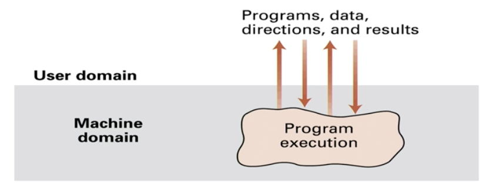

- 실시간 처리(real-time Processing)

  - 정해진 시간 내에 컴퓨터 서비스 제공
    - ex) 항공기 이착륙 시스템, 원전 관리

- 시간 공유(time-sharing) 방식

  - 가장 효율적으로 컴퓨터를 사용
    - I/O를 수행하는 동안 다른 프로그램이 CPU를 사용 ()
  - 시간을 적게 나누는 방식 (time slices)
    - time slice : CPU를 일정 시간 동안만 사용하게 하는 것
  - 가장 효율적으로 대화형 처리 지원
  - 하나의 사용자에서의 시간 공유 (Multitasking)
    - 사용자는 여러 개의 프로그램이 동시에 수행된다고 착각
    - 아주 짧은 시간 단위로 각각의 프로그램 실행
    - Ex) Windows 환경
  - 복수의 사용자에 쓰여질 때
    - 여러 사용자가 하나의 CPU를 동시에 쓰는 것처럼 보이게 하는 방식
      - 각 사용자에게 짧은 시간씩 CPU 할당
      - 매우 빠르게 전환 (context switching)
      - 사용자 입장에서는 “동시에 실행되는 것처럼 보임”
  - Multi-thread
    - 하나의 프로그램 안에서 여러 작업 흐름(thread)을 동시에 실행
    - ex) Web browser에서 여러 화면 동시 업데이트

- multiprocessor systems

  - 컴퓨터는 한 대 이지만, CPU가 여러 개
  - 여러 작업 병럴처리(parallel processing)
  - Load Balancing(로드 밸런싱) : 여러 CPU에 작업을 골고루 나눠주는 기술
  - Scaling : 시스템의 처리 능력을 필요에 따라 확장/축소

### * 소프트웨어 종류

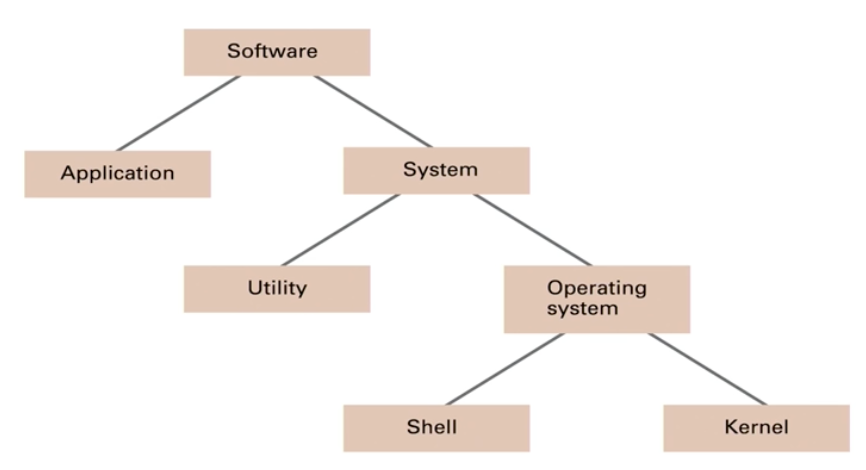

- 응용(application) 소프트웨어
  - 사용자를 위한 주어진 업무 수행
  - ex) word processor, game, AIMS
- 시스템(system) 소프트웨어
  - 모든 컴퓨터 시스템에 필요한 업무 수행
  - Utility : 없으면 매우 불편하나 없어도 작동함
    - Ex) disk format, compression, N/W communication S/W
  - Operating system : 없으면 작동하지 않음
    - Ex) windows, Unix
  - Utility와 Operating system 나눈 이유 :  OS를 너무 복잡하게 하지 않기 위해서

### * Operating System 구성요소

- Shell : 사용자와의 의사소통 부분

  - graphical user interface (GUI)

  - 사용자와 O/S간의 연결( interface)

  - 사용자와 명령을 O/S에 전달

  - ex) Window manager Windows의 GUI, DOS, shell

    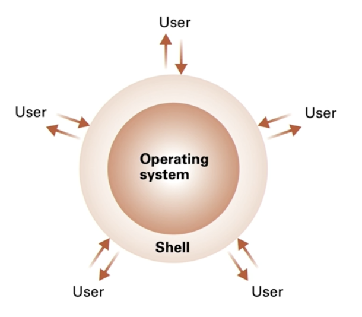

- Kernel : 핵심 부분

  - 하드웨어(CPU, 메모리 등)를 직접 관리하는 운영체제의 핵심 프로그램

  - ex) Linux kernel version 2.0.3, Windows kernel

    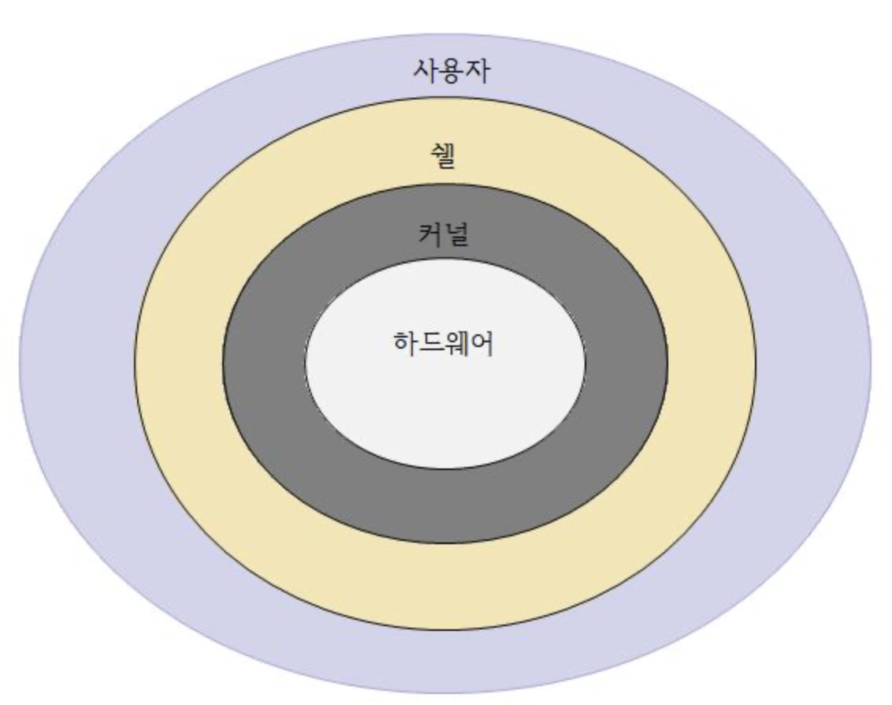

  - Shell과Kernel의 분리 이유

    - 하나의 kernel에 여러 개의 shell
      - 사용자가 편리한 shell을 고르면 된다
      - 심지어 자신만의 shell을 만들 수도 있다
        - ex) UNIX shell들은 모두 개인이 만든 것
    - 하나의 Shell에 여러 개의 kernel
      - 사용자는 일관된 interface 사용
        - ex) IBM 360 series, UNIX

  - 파일관리자(file manager) : 하드 디스크의 file/directory

    - 컴퓨터 대용량 기억장치의 사용조정
    - 대용량 기억장치의 모든 파일에 대한 기록 유지
    - 핵심 구조 3가지
      - Directory (folder) - 파일을 저장하는 폴더 구조
      - Path(chain of directories) - 파일 위치 경로(Directory 계층 내에 파일의 위치)
      - File descriptor - 열린 파일을 OS가 관리하기 위해 붙이는 번호

  - device drivers : 각 주변 장치와의 interface

    - 새로운 device를 O/S에 붙이는 방법 제공

  - Scheduler : 시간 공유시스템 (다음에 수행될 활동을 결정)

  - Dispatcher : 수행이 결정된 활동에 time slice부여

  - 주 기억장치 관리자(memory manager) : 운영체제에서 RAM(주 기억장치)를 관리하는 기능

    - 메모리 할당 (프로그램 실행 시 필요한 메모리 공간 배정), 메모리 해제, 보호(한 프로그램이 다른 프로그램 메모리 침범 못하게 한다)
    - 가상(virtual) memory
      - 주 기억장치인 것 같이 취급(실제 RAM보다 더 큰 메모리를 사용하는 것처럼 보이게 한다)
      - page라는 자료의 단위를 주기억장치와 대용량 기억장치 간에 주고 받게 하여, 전체가 주 기억장치로 여겨지도록 하는 방안(주 기억 장치 확장)
      - Page: unit of memory managed (a few kilobytes)
        - 메모리를 작은 단위로 나는 기술(주 기억장치 관리를 위한 분할 단위)

- UNIX : multi-user 환경을 위한 대표적 O/S

- Linux : 리눅스 토발즈가 취미로 O/S 커널 개발

  - 기능 : PC를 workstation으로 사용
  - 배포 판 : RedHat, Devian

- 컴퓨터 켜기 (Getting It Started)

  - bootstrapping : 컴퓨터 전원을 켰을 때 운영체제를 실행시키는 전체 과정

  - Bootstrap

    - program in read only memory (ROM에 저장된 아주 작은 프로그램)

      - system booting시에 O/S를 실행시키는 매우 짧은 프로그램
      - CPU의 PC 초기값에 위치

    - 전원이 켜지면 CPU에 의해 수행

    - 운영체제를 대용량 기억장치에서 주기억장치로 이전

    - 운영체제 시작주소로 jump

    - Power ON → Bootstrap (ROM) → OS를 RAM으로 로드 → OS 시작 주소로 jump → OS 실행

      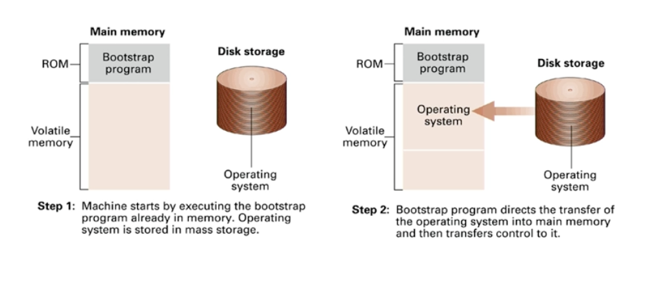

    - hard disk에서 O/S읽어 옴 -> O/S를 메모리에 저장 -> O/S의 시작 번지로 jump

### * 작업(process)

- 프로그램 : 명령어들로 이루어진 정적 상태
  - disk에 저장된 정적(static)인 상태
  - 프로그램 = code + data
  
- 작업
  - 프로그램을 수행하는 활동
  - 프로그램 + process 상태(state)
    - process 상태 : 활동(activity)의 현황
      - Program Counter, registers, associated main memory
  
- 운영체제의 역할(task)
  - process들 간의 조정 : 자원할당(allocat resources), 서로 간 간섭x(no interference), 정보교환(exchanges information )
  - Time-sharing system : process들이 time slices 경쟁
  
- 작업 관리(process Administration)
  - 작업 조정 : by scheduler and dispatcher 
  
  - Process Table : OS커널 안에 있는 모든 프로세스 정보를 저장하는 자료구조
  
    - 현재 실행 중이거나 대기 중인 프로그램들의 목록
    - 사용자 영역이 아닌 커널 영역에 있는 데이터
    - Process status(상태)
      - 항목(entries) : 
        - Process ID (PID) : 프로세스 고유 번호
        - Priority (우선순위) : CPU를 얼마나 먼저 받을지 결정
        - State (상태) : ready / running / waiting
        - Program Counter (PC) : 다음에 실행할 명령어 위치
        - Register 값들 : CPU 상태 저장
        - Memory 정보 : 어디에 적재되어 있는지
        - I/O 상태 : 입출력 작업 여부
      - process state (프로세스 상태)
        - ready : process can continue
        - running : time slice 쓰는 중
        - Waiting : time slice 줘도 일을 못한다(delayed until some external event occurs)
  
  - Scheduler : 프로세스의 순서를 유지 (maintains a record of the processes)
    - New/remove/maintain with process table
  
      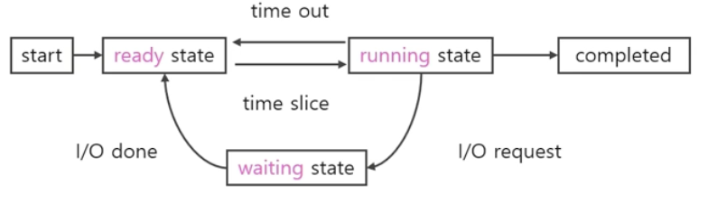
  
    - ready state : CPU를 쓰려고 대기 중 (FIFO)
  
    - running state : CPU를 실제 쓰고 있는 중
  
      - 주어진 시간 내 완료 : completed
      - 주어진 시간 내 끝내지 못함 : ready state (FIFO)
      - I/O 요청 : waiting state
  
    - waiting state : CPU를 쓸 필요가 없다 (I/O 요청 : 디스크 읽기, 파일 저장. 네트워크 요청 등)
  
      - 프로세스가 직접 처리 못 하고 장치 응답을 기다려야할 때
  
  - dispatcher
  
    - CPU를 다음 프로세스에게 넘겨주는 역할을 하는 OS 구성요소
  
      - Scheduler : 누가 실행할지 결정, dispatcher : 그걸 실제로 실행시키는 역할
  
    - 시분할 시스템에서 할당된 작업의 수행을 보장한다
  
      - time slice(quantum) 50msec(1초의 1/20 =0.05 )
      - process (context) switch : A프로세스에서 B프로세스로 CPU를 바꾸는 것
        - 현재 프로세스 상태 저장, 다음 프로세스 상태 복원
  
    - 시행중인 프로세스의 시간이 종료되면 process switch(or context switch) 시행
  
      - Interrupt indicates that time slice is over
  
      - interrupt handler : part of dispatcher
  
        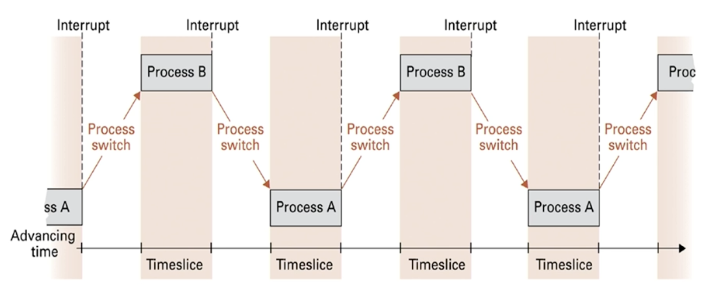
  
  - 시 분할(Time-sharing)구현
  
    - dispatcher
      1. Time circuit을 시작하여 next quantum측정
      2. 주어진 시간이 다 되었을 때 interrupt
      3. 작업의 현 상황(current status) 저장
      4. Interrupt handler (part of dispatcher)수행
      5. scheduler가 process table의 갱신 허용
      6. process table에서 process 선정(ready process 중 가장 높은 priority를 가진 process)
      7. process가 수행되도록 timer circuit을 재 시작
    - process switch (context switch)
      - 다른 프로세스가 수행되도록 현재 프로세스와 서로 바꿈 (현재 프로세스의 상태를 저장해야함)
      - 커널 내의 dispatcher가 수행
    - 끼어들기 (interrupt)
      - CPU에 미리 정의된 특별한 일을 하도록 요청하는 signal (hardware로 구현)
        - CPU는 하던 일을 멈추고 interrupt부터 처리
      - 발생 예 : time-slice 끝, I/O의 요청 완료, error의 경우
    - 입 출력 요청 (I/O request)
      - time slice가 만료되기 전에 끝남
    - 시분할 운영체제 (time-sharing O/S)의 평가 척도
      - process들 간의 switch가 얼마나 빨리, 균형 있게 수행되었는가
  
- 자원 배분(resources allocation) 과제

  - File manager : file에 접근, 디스크 공간 배분
  - Memory manager : 메모리 배분
  - scheduler, dispatcher

- 작업들끼리 서로 공유할 수 없지만 서로 사용하려는 자원

  - 자원의 예 : 프린터, tape driver, CD-ROM, 예약 시스템

- 수기신호(Semaphores)

  - flag : 자원이 사용 중 인지를 표시하는 제어기(control flag)

  - test and set의 시행이 반드시 필요 : 공유할 수 없는 자원을 독점하게 하는 기술

  - O/S, database에서는 필수적

    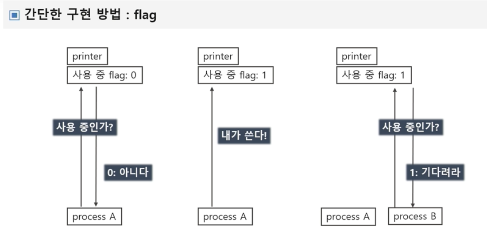

    - 구현이 쉽지 않은 이유 : time-sharing -> 문제 해결 : 수기신호semaphore

    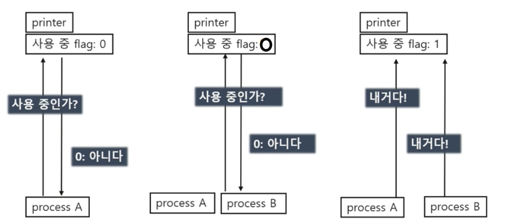

    - 수기신호(semaphore) : CPU에 새로운 명령 추가로 해결
      1. interrupt를 off/on 시킨 뒤 flag 1로 설정
         - off : time-slice가 끝나지 않는다
      2. Test-and-set 명령어 instruction
         - flag를 test한 뒤 1로 set하는 것을 하나의 명령어로 설정
           - flag가 1이면 그냥 넘어감
           - flag가 0이면 flag를 1로 set

  - 임계 구역(critical region)

    - 명령어의 수행이 오직 한 작업에서만 작동(한 번에 한 가지 작업만 접근)

    - 상호배제(mutual exclusion) - 임계 구역에 대한 적절한 구현이 필요

      - 방법 : 수기신호를 사용하여 임계 구역을 지킴

      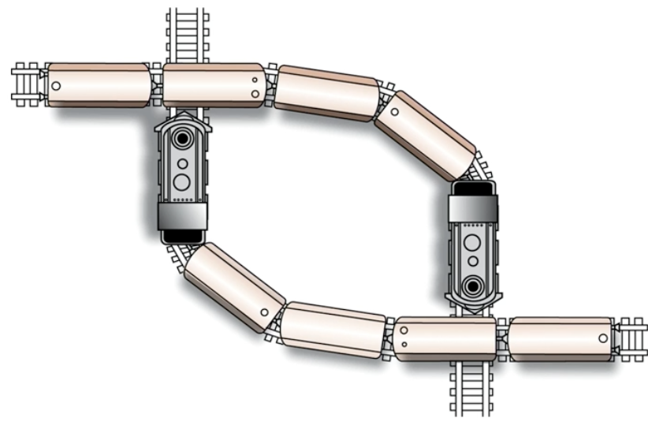

  - Deadlock(교착상태)

    - 자원 쟁탈전으로 일을 못하는 상태

    - 공유할 수 없는 자원이 여러 개인 경우

      

    - 해결책

      1. 서로 공유할 수 없다(non-shareable resources)

         -> 공유할 수 있게 한다 ex) printer spooler

      2. 하나씩 요청한다 (request on a partial basis)

         ex)

         1. A가 자원 1 획득
         2. B가 자원 2 획득
         3. A가 자원 2 요청 (대기)
         4. B가 자원 1 요청 (대기)

         - A는 B 기다림

         - B는 A 기다림

           ➡무한 대기 = deadlock

         -> 한꺼번에 요청하게 한다. (starvation 문제 발생 : 많은 것을 요구하는 process는 오래 기다려야 한다) A가 자원1, 2를 한꺼번에 요청

      3. 한 번 가져가면 돌려주지 않는다 (cannot forcibly)

         ->deadlock이면 강제로 반환한다 (O/S가 체크해야하는 문제점이 있다)

      - Spooling : 처리해야 할 data를 즉각 처리하는게 아니라 나중에 처리 가능할 때 까지 보관 (요청한 프로그램에는 처리했다고 미리 말함)

## 네트워크와 인터넷

### * 네트워크

- 초기 network : 파일 보내기 -> utility S/W

- 현재 network : 보편, 다면적인 -> network-wide OS (분산시스템)

- 네트워크 분류

  - 거리에 따른 분류
    - LAN(local area network) : 빌딩 또는 복합 빌딩
    - MAN(metropolitan area network) : 단위 지역
    - WAN(wide area network) : 국가, 세계
  - 소유주에 따른 분류
    - Colsed(proprietary) network : Dedicated Line(전용회선) Networks, Coporate Intranets, Healthcare Network, Voting systems, Surveillance(감시) Systems
      - 인트라넷 : 조직 내부에서만 사용되는 폐쇄형 네트워크
    - Open network : The Internet, Public Wi-Fi Networks

- network topology : 컴퓨터들이 연결된 패턴에 따른 분류

  - Ring, bus(가운데 LAN), star(중심이 되는 컴퓨터 존재), irregular(정해진 규칙없이 패턴연결), point to point, mesh, tree, etc

    

- wireless network : 눈에 보이는 연결선이 없음 (broadcast)

  - star(AP), ad hoc(peer-to-peer), mesh, cluster-tree/hybrid

- Network들을 연결해주는 장치

  - 리피터 : network간에 신호를 보냄(증폭)

  - 브릿지 : 두 개의 호환성(compatible)있는 네트워크 연결

  - 스위치 : 세 개 이상의 호환성 있는 네트워크 연결

    

  - 라우터 : 호환성없는 네트워크들의 연결로 인터넷 구성 (network of networks)

    

- IPC : 프로세스 사이의 통신

  - 서로 다른 프로세스들이 데이터를 주고받거나 협력하기 위해 통신하는 것

  - Client-Server : 하나의 서버와 여러 고객

    - 서버는 항상 운영되어야 한다

    - 고객이 통신 시작한다 ex) 프린트-서버, 파일-서버

      

  - Peer-to-peer(P2P) : 두 개의 프로세스가 같은 입장에서 통신

    - peer process들은 짧은 시간 지속 시간을 갖는다 (임시)
      - ex) internet을 통한 음악 공유

  - Client/Server 모델과 P2P 모델 비교

    

  - Process 사이의 통신

    - Process들은 같은 컴퓨터나 한 네트워크 안에 있는 다른 컴퓨터에 존재
    - 모든 소프트웨어 시스템의 수행은 현재 위치한 네트워크 구조에 독립적임
      - 컴퓨터가 어디에 있든 프로그램은 똑같이 동작한다 ex)로컬, 네트워크 다른나라

  - Protocol(의전 = 서로 통시할 때 지켜야 하는 규칙/절차)

    - 프로세스끼리 메시지 주고받을 때 정해진 규칙을 따라야한다
    - 규칙
      - message encoded - 데이터 특정형식 변환
      - packed and addressed -데이터를 패킷으로 나눔. 어디로 보낼지 주소 붙임
      - message 보내기/받기 - 송신과 수신 순서, 방식을 규칙으로 정함

- 분산 시스템(Distributed system)

  - 서로 다른 컴퓨터(노드)들이 네트워크로 연결되어 하나의 시스템처럼 동작하는 구조
  - 공통 인프라(Common infrastructure) : 분산시스템을 쉽게 만들 수 있도록 제공되는 기본 플랫폼/도구/기반 시스템
    - 표준화 toolkit에서 제공
    - Distributed applications : constructed by merely developing the part of the of the system unique to the application
  - Internet and Web Services
  - Social Media Platforms: Facebook, Youtube, whatsApp, instagram, TikToc
  - Cloud Computing : AWS, Azure(MS), Google, Oracle, IBM, Alibaba
  - 기타 : Online Marketplaces, Financial Systems, Content Delivery Networks

- The Internet

  - Internet : 네트워크들의 네트워크

  - The Internet : 세계에 걸치는 하나의 인터넷 (전 세계 컴퓨터들을 연결해주는 초거대 통신망)

    - DARPA에 의해 1973 시작 : 네트워크들을 연결하여 하나의 믿을만한 연결된 시스템으로 기능

    - 구성 구조 : Worldwide combination of WANs and LANs

      

  - 인터넷 구조 : 도메인들의 모음

    - Domain : 하나의 조직에 의해 관리되는 네트워크, 반드시 소유자에 의해 등록 되어야 함
      - Internet Corporation for Assigned Names & Numbers(ICANN)이 등록 처

  - Gateway : 라우터가 도메인들을 cloud에 연결

  - 인터넷 연결 전략 : 대규모 - 직접 연결, 소규모 - ISP(Internet Service Provider)에 연결, 개인 - ISP domain에 컴퓨터 임시연결

  - IP address : Internet에서 host를 구분하는 유일한 주소

    - ICANN에서 32bit 식별자 부여 

    - IP는 두 부분으로 나뉜다

      - network identifier(네트워크 주소) :ICANN에서 부여(같은 네트워크끼리 묶어서 구분)
      - host address(호스트 주소) : 소유자 부여(같은 네트워크 안에서 어떤 컴퓨터인가 구분)

      - ex) 192.207.177(domain) + .133 (host)
        - 192.207.177은 같은 네트워크 .133은 네트워크 속 특정 컴퓨터

  - Damain name

    - 사람이 읽기 쉬운 문자 형태의 인터넷 주소(mnemonic address)

      - ex) ajou.ac.kr

    - TLD(top-level domain) : 최상위 도메인(edu, gov, info, net, kr, jp ...)

    - 중 분류 영역, 개인 컴퓨터 이름

      - 대 분류 영역 소유자가 부여
        - 큰 도메인(예: ajou.ac.kr)을 가진 기관이 그 안의 하위 이름을 마음대로 만들 수 있다
      - 영역 소유자는 반드시 name server를 운영

    - dotted decimal notation

      - IP주소는 원래 11000000 11001011 10110001 10000101 이렇게 생겼으나 사람이 보기 쉽게 32비트 IP주소를 사람이 읽기 쉽게 8비트씩 4부분으로 나누고 점으로 구분해서 표현한 방식
      - IP 주소 표시의 표준
      - 192   .   207   .   177   .   133
        │         │         │         │
        8bit      8bit      8bit      8bit

    - Domain name server(DNS) : 도메인 이름(문자주소)를  IP주소(숫자)로 바꿔주는 시스템

      - DNS는 “이름 ↔ IP 주소”를 저장한 목록(주소록)

    - 주요 domain들

      

  - 인터넷 응용(Internet applications)

    - 전자우편, 파일 전송 규범(FTP), 원격 login(telnet), World Wide Web

  - Electronic Mail

    - mail server : 관할 영역(domain)의 e-mail 활동을 처리하는 지정 된 컴퓨터
    - Mail sent from domain members goes through mail server
      - 같은 도메인 사용자들이 보내는 메일은 반드시 메일 서버를 통해 나간다
    - Mail sent to domain members is collected by mail server
      - 외부에서 들어오는 메일은 먼저 메일 서버가 받는다
    - Mail delivered to clients on demand (사용자가 원할 때 메일 꺼낸다)
      - POP3(메일을 서버에서 내 컴퓨터로 다운로드해서 저장)
      - IMAP(메일을 서버에 그대로 두고 동기화해서 보는 방식)
    - e-mail : computer network 상에서의 편지
      - email -> mail server -> N/W -> mail server -> destination
      - e-mail address : user@domain_name
        - User : 특정 사용자의 login name
        - Domain_name : host/domain name, IP address
        - ex) dykim@ajou.ac.kr

  - The File Transfer Protocl(FTP)

    - 인터넷을 통한 파일 전송의 client-server protocol
    - FTP S/W
      - 클라이언트(사용자 컴퓨터)가 FTP서버(다른 컴퓨터)에 접속할 수 있게 해준다
      - 파일은 양방향으로 전송된다(업로드/다운로드 가능)
    - Note : FTP 파일 전송 시
      - 텍스트 파일(txt, html) : 전송과정에서 필요한 변환이 이루어진다
      - Binary file(image, exe, zip) : 변환 없이 그대로 전송된다
      - 줄바꿈 방식 : Line feed, Carriage Return, both LF and CR
    - FTP 사이트는 비밀번호가 있어야 접근 가능(다른 사람은 차단됨)
    - Anonymous FTP는 제한 없이 파일 접근 가능함

  - Telnet : 원격에서 컴퓨터에 접속 사용

    - Client (다른 OS)
         ↓ 변환
      NVT (표준 가상 터미널)
         ↓
      Server (다른 OS)

    - Network Virtual Terminal (NVT) : 실제 장치(키보드, 모니터)가 아니라 네트워크용 가상의 표준 터미널

      - 표준 가상 터미널: 키보드와 프린터처럼 동작하는 가상의 터미널 개념

      - telnet 프로토콜: 문자(character)를 전송하기 위한 명령 체계
        - telnet 서버: NVT와 통신(대화)하는 역할
        - telnet 클라이언트: NVT처럼 가장해서 동작함
          - 각 시스템의 차이(특수성)를 NVT 표준에 맞게 변환한다

### * WWW와 네트워크 프로토콜

- WWW(World Wide Web)

  - 전 세계를 거미줄처럼 연결하는 hypertext/hypermediea 망
  - hypertext : 문자가 링크(하이퍼링크)를 통해 다른 정보와 비선형적으로 연결된 문서구조
    - 사용자가 텍스트나 이미지를 클릭하여 관련 정보가 있는 다른 문서로 즉시 이동
  - hypermedia : 문자 뿐 아니라 이미지, 사운드, 비디오 등 모든 미디어 형태를 링크로 연결

- web site : 긴밀하게 연관된 web page들의 모음

  - 모든 하이퍼 텍스트 문서가 하나의 조직 혹은 개인에 의해 관리
  - 보통 같은 인터넷 주소를 가짐
  - web Page : WWW에서 HTML 언어를 사용해 작성된 하나의 독립적인 Hypertext 문서

- HTML : 웹 페이지의 구조와 내용을 정의하는 표준 마크업 언어 (hypertext 문서의 언어)

- Browser : 사용자가 web pages에 접근 허용

  - 사용자가 웹 서버에 요청을 보내고 결과(웹 페이지)를 화면에 보여주는 소프트웨어
  - web client = web browser

- Web Server : HTTP 프로토콜 기반으로 사용자의 요청을 받아 문서를 제공

  - containing documents to be accessed

- HTTP(Hypertext Transfer Protocol) : browser와 web server간의 통신 규범

- URL(Uniform Resource Locator) : 인터넷 상에서 특정 자원(웹 페이지, 이미지, 파일)의 고유한 위치를 나타내는 웹 주소

  - ex) 일반적인 url (typical url)

    

  - home page : 미리 정해진 문서

  - Search engine : 웹 사용자가 입력한 키워드로 웹에서 원하는 정보를 찾아주는 기능

    - semantic approach(의미 기반) : 단어가 아닌 의미(의도)를 이해하려고 한다
      - 문맥, 사용자 의도, 개념관 관계, 자연어 이해를 고려

- HTML(Hyper Text Markup Language)

  - 웹 페이지의 구조와 내용을 정의하는 표준 마크업 언어

  - 태그를 사용하여 콘텐츠의 의미를 브라우저에 전달

  - Tags : 웹 페이지의 구조와 내용을 정의하는 마크업 기호

    - ex) web page

      

    - ex) web page에 hyper tex추가

      

- XML : eXtensible Markup Language

  - 데이터를 의미 있게 저장하기 위한 언어 (HTML은 화면표시, XML은 태그로 데이터 의미 전달)
    - 검색 엔진이 단순 단어가 아니라 의미를 이해할 수 있음
  - 문서의 내용과 구조를 텍스트로 표현하는 표기 시스템

- World Wide Web Semantic Web : 컴퓨터도 이해할 수 있는 의미가 표현된 웹

  

### * 프로토콜

- 컴퓨터나 네트워크 장치들이 서로 통신할 때 따르는 규칙

  - 메시지를 어떻게 addressing하는가
  - 어떤 기계가 메시지를 전송할 권리를 갖는가
  - 메시지를 어떻게 packing/unpacking하는가

- Token Ring 프로토콜

  - 네트워크에서 데이터 전송 순서를 토큰으로 제어하는 방식

    - 컴퓨터들이 원형(Ring)구조
    - 한 방향으로만 데이터 흐른다 (오른쪽 기계로만 메시지 전송가능)

  - 토큰

    - 네트워크를 돌고 있는 토큰이라는 신호를 가진 장치만 데이터 전송 가능
    - 일반 데이터와 구별되는 특수한 비트 패턴으로 전송권한을 나타냄

    

- CSMA/CD

  - Ethernet에서 사용
  - 여러 컴퓨터가 동시에 통신할 때 충돌을 피라고 처리하는 방식
  - 한 컴퓨터에서 모든 다른 컴퓨터들로 메시지가 한꺼번에 전송
    - 공유 네트워크에서는 모든 노드가 메시지를 수신하지만, 목적지 주소가 일치하는 경우에만 처리하고 나머지는 페기
  - 두 개 이상의 기계가 동시에 전송을 시도할 경우 충돌발생, 각 기계별로 random period동안 기다려서 다시 전송 시도

- CSMA/CA

  - WiFi에서 쓰임
  - 충돌을 미리 회피
    1.  채널을 누가 쓰고 있는지 먼저 확인
    2. 바로 안 보내고 기다림(충돌 방지 위해 약간 대기)
    3. 각 장치가 랜덤으로 시간 기다림
    4. 데이터 전송
    5. (선택) ACK 확인 - 상대방이 잘 받았는지 확인

- TCP/IP (4계층) - 인터넷에서 데이터를 주고받기 위한 통신 프로토콜 집합

  - 데이터를 계층별로 나눠서 처리

  - 응용(Application Layer) - 사용자와 직접 연결되는 계층

    - 요청에 대한 데이터를 만들고 어디로 보낼지(목적지 정보)를 결정한다
      - 사용자 요청 처리 및 데이터 생성
      - 요청 데이터를 만들어서 아래 게층으로 전달
    - 대표 프로토콜 (telenet : 원격 컴퓨터 접속, FTP: 파일전송, SMTP : 이메일 전송)
      - http : 80, FTP : 21
    - Name server의 service 요구
      - 도메인 이름을 IP주소로 바꿔준다

  - 전송(Transport Layer)

    - 메시지가 상대방 전송계층으로 전달되도록 한다
    - 메시지를 패킷으로 쪼갠다
      - 긴 메시지를 인터넷 계층에서 사용할 수 있는 크기의 segment(작은 조각)로 분할
      - segment가 다시 조합될 수 있도록 일련 번호를 붙인다
      - 각 segment에 전송될 destination 주소 첨부
    - 패킷을 wrapping : 메시지 데이터 + 헤더(주소, 번호 등)
      - 패킷 특징
        - 각각 독립적으로 취급(treated as individual), 서로 관계없는 것 처럼 전송(non-related messages, 서로 다른 경로로 갈 수도 있음(different paths)
    - 프로토콜 : TCP/UDP
    - Transport Layer Based on TCP - 신뢰성, 연결성
      - Destination에 메시지 전송 시 상대방에게 ACK(acknowledgement)신호를 준다
        - ACK : 데이터를 정상적으로 받았다는 확인 응답 신호
        - ACK가 안 오면 데이터가 도착 안 했다고 판단하고 재전송함(Reliable Protocol)
      - 연결 지향(Connection-oriented) : 데이터 보내기 전에 먼저 연결을 만든다
    - Transport Layer Based on UDP - 비신뢰성, 비연결
      - 메시지 전송 전에 연결을 안 만들어도 됨 (Connectionless)
      - Origin은 자료 전송 후에 잊어버림 (재전송 X)
      - 속도가 빠름

  - 인터넷 (Internet Layer)

    - IP 기반으로 목적지 방향을 결정하고, 라우터들이 next hop 방식으로 패킷을 전달한다
      - next hop : 목적지까지 전체 경로를 한 번에 정하지 않고, 각 라우터가 다음 전달 지점만 선택하는 방식
      - 중간 경유지(라우터)를 거쳐 최종 목적지까지 가게 한다
    - 프로토콜 : IP, ARP, ICMP
    - IP (Internet Standard for Network Layer)
      - 네트워크 계층이 링크 계층에 보낼 때 마다 hop count, time to live 첨부
        - 패킷이 인터넷에서 무한히 떠도는 걸 막기 위한 설정
        - hop count : 패킷이 목적지까지 가면서 지나간 라우터의 개수를 limit 
          - 네트워크 계층이 패킷을 forward할 때마다 hop count를 하나씩 감소
          - protect circling endlessly
          - Initial hop count : 64 정도면 충분
        - time to live(TTL) : 패킷이 인터넷에서 무한히 떠도는 걸 막기 위한 시간 설정
          - 인터넷에서는 라우팅이 잘못되면 패킷이 계속 빙빙 도는 상황 발생가능 - 무한루프

  - 네트워크 인터페이스 (Network Interface)

    - 물리적 매체를 통한 node-to-node 데이터 물리적 전송

      - 실제 물리적 전송(케이블, 신호 등)

    - 개별적인 네트워크마다 필요한 통신 세부사항을 다룸

      - 각 네트워크(Wi-Fi, 유선 등)의 전송 규칙에 맞게 데이터를 실제로 전달

    - 인터넷 주소를 Local 주소로 변환 (IP 주소 -> MAC 주소 변환)

      - 변환된 주소를 frame에 첨부해서 이 장치로 보내라 표시

    - 프로토콜 : Ethernet, WiFi

    - 충돌없이 보내는 전송규칙 : 토큰링, CSMA/CD

      

## AI 시대에 필요한 핵심 역량

### * core human skills in AI revolution era

1. 비판적 사고와 판단
   - Analyzing AI outputs, checking evidence, and avoiding over-trust in seemingly authoritative answers.
   - AI의 결과물을 분석하고, 근거를 검증하며, 겉보기에는 권위 있어 보이는 답변을 과신하지 않는 능력
2. 소통능력
   - Explaining complex, AI-supported insights clearly to non-experts and across disciplines.
   - 복잡한 AI 기반 인사이트를 비전문가와 다양한 분야의 사람들에게 명확하게 설명하는 능력
3. 창의력
   - Designing new ideas, problems, and solutions that go beyond pattern repetition.
   - 단순한 패턴 반복을 넘어 새로운 아이디어, 문제, 해결책을 설계하는 능력
4. 감정지능과 공감능력
   - Emotional intelligence and empathy: Leading, teaching, counseling, and managing change in AI-augmented workplaces.
   - AI가 결합된 업무 환경에서 리더십을 발휘하고, 교육하고, 상담하며, 변화를 관리하는 능력
5. 적응력과 학습 민첩성
   - Continuously reskilling as tools and platforms change.
   - 도구와 플랫폼이 변화함에 따라 지속적으로 재교육하고 배우는 능력
6. 윤리적 추론과 의사결정
   - Handling bias, fairness, privacy, and accountability questions around AI use.
   - AI 활용과 관련된 편향성, 공*성, 프라이버시, 책임성 문제를 다루는 능력

### * AI & Data literacy in AI revolution era

1. AI literacy
   - Knowing basic concepts (training data, bias, hallucination, limitations) and typical use cases of generative AI.
   - 학습 데이터, 편향(추정값이나 결과가 한 방향으로 치우쳐 발생하는 오차), 환각(거짓말을 그럴듯하게 말하는 것), 한계 등 기본 개념과 생성형 AI의 대표적인 활용 사례를 이해하는 능력
2. Data literacy
   - Interpreting charts, statistics, and AI-generated insights, and asking the right data questions.
   - 차트, 통계, AI가 생성한 인사이트를 해석하고, 적절한 데이터 질문을 할 수 있는 능력
3. Selection competence
   - Finding, filtering, and validating reliable sources and AI outputs amid information overload.
   - 정보 과잉 속에서 신뢰할 수 있는 자료와 AI 결과를 찾아내고, 걸러내며, 검증하는 능력
4. Prompting skills
   - Structuring effective instructions, constraints, and evaluation criteria for AI tools.
   - AI 도구를 효과적으로 활용하기 위해 지시사항, 제약조건, 평가 기준을 구조화하는 능력

### * Technical foundations in AI revolution era

1. Programming and algorithms, especially with languages and libraries common in AI (e.g., Python, TensorFlow, PyTorch)
   - 프로그래밍과 알고리즘, 특히 AI에서 널리 사용되는 언어와 라이브러리(예: Python, TensorFlow, PyTorch) 활용 능력
2. Machine learning fundamentals and deep learning basics (models, training, evaluation, overfitting, etc.)
   - 머신러닝 기초 및 딥러닝 기본 개념(모델, 학습, 평가, 과적합 등)에 대한 이해
3. Data science and analytics: Cleaning, modeling, and visualizing data; understanding experimental design.
   - 데이터 과학 및 분석: 데이터 정제, 모델링, 시각화, 그리고 실험 설계에 대한 이해
4. NLP and generative AI concepts for text, image, and code applications.
   - 자연어 처리(NLP)와 생성형 AI 개념(텍스트), 이미지, 코드 응용을 위한 이해

## 컴퓨터 사고

- 세계 모든 사람들이 사용하는 근본적 기술
- 전산학의 기본개념을 바탕으로 문제를 해결하고 시스템을 설계하며 인간의 행동을 이해하는 것을 포함
- 소프트웨어 교육은 코딩 기술 습득이 아니라 소프트웨어의 기본원리 이해를 통해 컴퓨팅 사고력과 논리력을 바탕으로 창의적 문제해결 능력을 증진
  - 추상화, 알고리즘적 사고, 분석(Decomposition), 평가, 일반화
- 이미 다른 분야에 영향을 미쳤으며, 컴퓨팅 사고를 가르치는 것이 미래세대가 전산학 분야에 오는 것 뿐 아니라 모든 분야의 사람들에게 도움이 될 수 있다는 것을 강조

- 정보 개념(Informatics concepts)

  

- 컴퓨터적 사고 기술(Computational thinking skills)

  

### * 비버 챌린지

- 특별한 사전 지식 없이도 누구나 도전할 수 있는 과제를 해결하며 컴퓨팅 사고력을 바탕으로 한 정보를 경험

  - 모든 연령의 초/중등 학생들이 쉽게 시험에 응시 가능
  - 도전은 정보에 대한 사고를 촉진하고 정보교육을 지원

- 비버 문제 조건

  - 정보개념과 연계
  - 쉽게 이해가 가능해야 함
  - 3분 이내에 풀 수 있어야함
  - 한 페이지를 넘지 않아야 한다
  - 다른 소프트웨어 없이 풀 수 있어야 한다
  - 특정 시스템에 대해 독릭접이어야 한다
  - 흥미롭거나 재미있어야 한다.

- Ex)

  - 옆에 그림이 없는 딸기가 마지막이라고 생각하고 거슬러 올라가기

    

  - 1, 2, 3번 얼굴과 기존 얼굴 차이점 확인 후 비교하기

    

  - theory of computation (계산이론) : 컴퓨터처럼 문제를 푸는 원리(알고리즘, 논리판단, 최적화)

    

  - 한 끗 그리기 (선을 떼지 않고 한 번에 형태를 완성하는 드로잉기법)

    - Edge에 연결된 선이 모두 짝수면 line * 길이 
      - 아래 문제에서는 홀수가 2군데 이기때문에 line * 길이 + 길이(한번 왕복)

      

  - 논리 추론(Logical Deduction) 

    - 분해, 패턴 찾기, 논리 추론, 제약 조건 활용

    

  - 이웃

    - 인접 관계 찾기, 그래프 문제

    

  - MinMax : 아래에서부터 위로 거슬러 올라오면서 찾기 (로봇 차례일 때는 Min 내 차례일 때는 Max)

    

  - checksum : 데이터 무결성을 확인

    - 네트워크 전송 시에 활용,데이터를 저장할 때 오류가 나는지 감지하기 위해 CD, DVD, 하드디스크에 활용
    - 가로 total, 세로 total 비교 후 틀린 부분의 교집합 찾아내기

    

    

  - 암호화

    - 표에 문자를 배치한 후 읽는 순서를 바꾸어 암호화하는 전치 암호(Transposition Cipher) 문제
    - 정보 표현
    - 암호화(부호화)
    - 패턴 인식

    

    

  - 이분 탐색(Binary Search)

    - 정답 후보가 순서대로 정렬되어 있음
    - 질문 1번으로 후보를 절반 제거 가능
    - 최악의 경우 질문 수가 $O(\log N)$

    

    

  - 시뮬레이션

    - 시뮬레이션: 문제에 적힌 규칙을 그대로 따라가며 상태를 변화시킴
    - 자료구조: 자루들이 한 줄로 놓여 있고, 순서대로 처리되므로 큐(Queue) 비슷한 사고가 필요
    - 그리디 요소: 매 순간 가장 가까운 자루부터 처리
    - 재귀적/반복적 처리: 한 번 밀려난 자루들이 반대편에 새 줄을 만들고, 그 줄도 같은 규칙 적용

    

    

  - 그래프 모델링

    - 그래프 이론(Graph Theory)
    - 관계 표현(Relationship Representation)
    - 추상화(Abstraction)

    

    

  - 팰린 드롬(Palindrome)

    - 단어가 회문이어야 한다
      - 왼쪽에서 오른쪽으로 읽은 것과 오른쪽에서 왼쪽으로 읽은 것의 문자 순서가 같다.
    - 패턴 인식(Pattern Recognition)
    - 조합(Counting) :패턴을 찾은 뒤에는 조건을 만족하는 단어가 몇 개인지 세어야 한다
    - 수학적 규칙 찾기
      - 길이가 늘어나면 일반식을 찾을 수 있다
      - 기호 종류가 3개일 때 회문은 앞 절반만 정하면 뒤 절반은 자동으로 결정된다
        - 길이 n인 회문의 개수는 3^(n/2)

        

        

  - 상태 추적(State Tracking)

    - 버튼 입력 규칙을 이해한다.
    - 규칙에 따라 상태(방향)를 계속 갱신한다.
    - 최종 상태를 구한다.

    

    

  - 규칙 반복 적용(시뮬레이션 + 자료구조)

    

    

  - 반복문 + 패턴찾기

    

    

  - Stack

    - Last in Frist out
    - 구멍 = 스택
    - 여러 개의 구멍 = 여러 개의 스택
    - 지나가는 순서를 추적
    - 최종 출력 순서 예측

    

    

    

  - 게임 이론 문제

    - 백트래킹(DFS) + 미니맥스 + 승패 상태 분석

    1. 현재 가능한 수 찾기
    2. 한 수 두었을 때의 상태를 그려보기
    3. 상대가 둘 수 있는 수를 계산하기
    4. 마지막 수를 누가 두는지 확인

    

    

  - 그래프 최단경로 추론

    - 그래프 + 최단경로 + 논리추론

    1. 나무를 그래프로 바꾸기
    2. 이동 시간을 간선 가중치로 생각하기
    3. "최소 시간" 조건을 이용하기
    4. 어떤 나무가 가운데일 수 있는지 추론하기

    

    

  - 규칙 해석

    - 규칙 -> 행위 -> 허용 여부 판단

    

## 알고리즘

### * 알고리즘의 정의

- 어떤 일을 수행하기 위한 a set of steps

  - 알고리즘은 명확하고 실행가능한 단계들로 이루어진 순서 있는 집합이며, 언젠가는 종료되는 과정

  1. Ordered set : 순서가 있는 집합 (수행 순서가 명확)
  2. of unambiguous : 모호하지 않음(누구나 같은 의미로 이해해야 함)
  3. executable : 실행 가능한 단계 (각 단계가 실제로 수행 가능해야 함 = 컴퓨터가 명령을 이해하고 실행할 수 있어야 함)
  4. steps : 하나 하나의 단계가 단순해야 함
  5. Defining a : 언젠가는 종료가 되어야 함
  6. terminating process : 종료되고 결과를 볼 수 있어야 함

- 인간 정신의 모든 활동

  - 상상(imagination), 창조(creativity), 의사결정은 모두 알고리즘 수행의 결과

- Ordered vs parallel algorithm

  - Ordered Algorithm : 단계를 순서대로 실행
    - A -> B -> C -> D 
    - ex) 버블 정령, 삽입 정렬
  - Parallel algorithm : 여러 작업을 동시에 수행
    - A
      ├─ B
      └─ C
          ↓
          D
    - ex) GPU 연산, 병렬 정렬 ,분산처리(MapReduce)

- terminating vs. non-terminating algorithm

  - Terminating Algorithm : 반드시 종료
  - non-terminating algorithm : 종료되지 않고 계속 실행

- 추상적 본질(Abstract Nature)

  - 문제(Problem) = 알고리즘의 동기(부여)
  - 알고리즘 = 문제를 해결하는 절차 (Often one of many possibilities)
  - Representation = 필요한 사람들과 충분히 소통(이해)할 수 있는 알고리즘의 서술
  - Always one of many possibilities

### * 알고리즘의 표현

- 알고리즘 설계 시 알고리즘 표현

  - Flowchart : 설계 라기 보다는 presentation (순서도)

  - Graphical techniques : large S/W system의 설계 (방대한 체계의 전체 설계)

    - 알고리즘을 그림이나 도형을 이용하여 시각적으로 표현하는 방법

  - Pseudocode : design for smaller procedural components (잘 정의된 문자구조)

    - 알고리즘 개발과정에서 문제 해결 절차를 쉽게 기술하기 위한 표현 방법 

    - 알고리즘 표기 시에는 주로 pseudo code 사용

      - 사람만 이해할 수 있으면 된다
      - 프로그래밍 언어로 쓰면 너무 힘들다
      - 여러 프로그래밍 언어에서 구현 가능

    - Pseudocode 스타일

      - case1 : 규칙이 느슨한(loosened) 의사코드
        - Target programming language 정해진 경우 의사코드를 그 언어 문법에 가깝게 쓰는 경우가 있다
      - case2 : 일반적인 pseudo code
        - 특정 언어에 의존하지 않음

        

        

        

  - 자연 언어(Natural Language)

    - 사람이 평소 사용하는 언어로 알고리즘을 설명하는 방법
    - 이해하기 쉽고 작성이 편하나 모호함이 존재
      - ex) a와 b를 더해라
        - 사람은 이해하지만 컴퓨터는 결과를 어디에 저장하는지, 출력하라는 것인지, 기존 변수에 덮어쓰라는 것인지 애매하게 해석가능

  - 프로그래밍 언어(Programming Language)

    - a collection of primitives and rules
      - 프로그래밍 언어 = Primitive + 문법 규칙
    - Higher-level primitives

- 알고리즘은 생각 자체가 아니라  생각을 언어의 형태로 명확하게 표현해야 한다

- 기본 단위(Primitives)

  - a well-defined set of building blocks from which algorithm representations can be constructed 
  - 알고리즘을 만들기 위한 명확하게 정의된 기본 구성요소
    - 알고리즘을 표현하기 위한 최소단위의 기본 명령(기본 구성 요소)
    - 프로그래밍 언어를 구성하는 기본 연산 및 명령어의 집합
    - Ex) Input, Output, Assignment(대입), Selection(조건), Iteration

  - 자연어의 애매함을 제거하고, 알고리즘을 일관되고 명확하게 표현

    - 자연어 대신 정해진 Primitive를 사용하면 모두가 같은 의미로 이해한다

  - Primitive는 두 가지 측면으로 정의된다

    - Syntax(구문론) : primitive's symbolic representation

      - 어떻게 써야 하는지에 대한 형식적인 규칙 (형식, 문법)

    - Semantics(의미론) : primitive의 의미

      - 문법적으로 올바른 문장이 수행하는 의미와 동작을 정의하는 것

      

### * 알고리즘의 발견

- 프로그램 개발은 2가지 활동으로 구성

  1. 알고리즘의 발견(Discovery)
     - 문제를 해결하는 방법을 찾는 과정
     - 무엇을 해야 문제를 풀 수 있는가를 생각하는 단계
  2. 발견한 알고리즘을 프로그램으로 표현하는 과정
     - 찾아낸 해결 방법을 코드로 옮기는 단계

- 문제 풀이(Priblem Solving)

  - 문제를 해결하는 절차는 설계하는 과정 (알고리즘을 만들어 내는 과정)
  - Artistic Skill - 창의성이 필요
  - 알고리즘을 만드는 공식은 없음 훈련이 필요

- Polya의 문제 해결 4단계

  1. 문제의 이해(Understand the Problem)
     - 무엇을 구해야 하는지 정확히 파악 (입력은 무엇인지, 출력은 무엇인지, 조건은 무엇인지)
  2. 해결 방법 구상(Devise a Plan)
     - 문제를 풀 수 있는 방법(알고리즘)을 생각
  3. 방법 실행(Carry Out the Plan)
     - 생각한 알고리즘을 실제로 구현
  4. 평가 및 검토(Evaluate/Look Back)
     - 답이 맞는지 확인하고 개선

- Ex) A, B, C, D가 달리기 경주를 하려고 한다. 경주 시작 전에 각각은 경주 결과에 대해 예측을 했다.

  - A : B가 1등을 할 것이다

  - B : D가 꼴지를 할 것이다

  - C : A가 3등일 거이다

  - D : A의 예측이 맞을 것이다

    실제로 경주를 한 뒤 위의 예측들 중에서 하나만 맞았고, 그 예측은 1등을 한 선수의 예측이었다.

    글면 A, B, C, D의 순위는 무엇인가?

    

- 문제풀이에 대한 접근방법

  - 문제를 뒤쪽에서 접근 (start with output to backup to the given input)
    - 원하는 출력을 먼저 생각한 뒤 그 결과를 만들기 위해 필요한 입력이나 과정을 역으로 추적
    - 출력 -> 입력 방향으로 생각
  - 관련된 문제를 살핀다 (Major difficulty finding a general algorithm)
    - 현재 문제와 유사한 문제를 찾아본다
    - 기존에 알려진 알고리즘이나 해결 방법을 활용할 수 있다
    - 어려운 점 : 여러 문제에 공통으로 적용되는 일반적인 알고리즘을 찾는 것
  - 단계별 정제 (stepwise refinement)
    - 여러 개의 부분 문제로 분해 (top-down방식)
    - 자연스러운 모듈 구조 설계
    - 각 부분을 독립적으로 개발 및 검증
      - ex) 팀 프로젝트에서 기능별 모듈 분담
    - 큰 문제 -> 작은 문제 -> 세부 구현 순서로 진행

- 시간 복잡도(효율성)

  - 입력 크기(n)가 증가할 때 알고리즘의 실행 시간이 얼마나 증가하는지를 나타내는 척도

  - 실행 시간 ≠ 정확한 초(sec)

  - 입력 크기 증가 -> 연산 횟수 증가

  - Big-O 표기법

    - 실행 시간의 상한을 나타냄 (최악의 경우 실행 시간이 어느 정도 증가하는가)

    - 계산 규칙

      1. 상수무시 (입력이 매우 커지면 3배, 100배 차이보다 증가율이 중요)

         ~~~
         O(5)     ㅣ   O(3n)   ㅣ  O(100n)
         → O(1)   ㅣ   → O(n)  ㅣ  → O(n)

      2. 최고차향만 남김 (입력이 커질수록 가장 큰 항이 지배적)

         ~~~
         O(n² + n)  ㅣ  O(n³ + n² + n)
         → O(n²)    ㅣ  → O(n³)
         ~~~

    | 복잡도     | 이름     | 예시                  |
    | ---------- | -------- | --------------------- |
    | O(1)       | 상수     | 배열 접근             |
    | O(log n)   | 로그     | 이진 탐색             |
    | O(n)       | 선형     | 순차 탐색             |
    | O(n log n) | 선형로그 | 병합정렬              |
    | O(n²)      | 제곱     | 버블정렬, 삽입정렬    |
    | O(n³)      | 세제곱   | 3중 반복문, 행렬의 곱 |
    | O(2ⁿ)      | 지수     | 피보나치 재귀         |
    | O(n!)      | 팩토리얼 | 순열 생성             |

### * 순환구조(Iterative Structures)

- Instructions represented in a looping manner (명령어들을 반복 수행하도록 구성한 구조)

- 특정 조건이 만족될 때까지 또는 정해진 횟수만큼 명령어를 반복 수행하는 제어구조(Control Structure)

  - for, while, do-while

- The Sequential Search Algorithm (순차 탐색 알고리즘)

  - 데이터를 처음부터 하나씩 차례대로 비교하면서 원하는 값을 찾는 알고리즘

  - Ex) 자료의 리스트 1, 3, 6, 8, 9, 10가 주어질 때 3을 search(Success), 12를 search(failure)

  - Pseudocode

    

    

- Loop Control (반복문 제어)

  - 구성요소 : 초기화(Initialize) → 검사(Test) → 수정(Modify)
    1. 초기화
       - 반복이 시작되기 전 초기 상태를 결정
       - 종료 조건에 도달할 수 있도록 시작값을 정함
    2. 조건 검사
       - 현재 상태가 종료 조건(Termination Condition)에 도달했는지 확인
       - 조건을 만족하면 반복 종료
    3. 상태 변경
       - 현재 상태를 변경하여 종료 조건에 점점 가까워지게 함
       - 수정 과정이 없으면 무한 반복이 발생할 수 있음
  - While : 반복 횟수를 미리 알 수 없는 경우 사용 + 조건이 만족하는 동안 반복
  - for : 반복 횟수를 미리 아는 경우 사용 + Initialize, Test, Modify를 한 줄에 표현

  1. Pretest Loop(사전 검사 반복문)

     - while
     - 반복 실행 전에 조건을 먼저 검사
     - 조건이 참(true)일 때만 반복문 본문(Activity) 실행
     - 처음부터 조건이 거짓이면 한 번도 실행되지 않을 수 있음

  2. Posttest Loop(사후 검사 반복문)

     - repeat

     - 작업을 먼저 수행한 후 조건 검사

     - 조건과 상관없이 최소 1번 실행됨

       | 구분                 | while (Pretest)         | repeat / do-while (Posttest)  |
       | -------------------- | ----------------------- | ----------------------------- |
       | 조건 검사 시점       | 실행 전                 | 실행 후                       |
       | 최소 실행 횟수       | 0회                     | 1회                           |
       | 조건이 처음부터 거짓 | 실행 안 함              | 1번 실행                      |
       | 사용 예              | 조건이 만족될 때만 실행 | 반드시 한 번은 실행해야 할 때 |

       

### * 재귀 구조(Recursive Structures)

- 재귀는 어떤 문제를 자기 자신과 동일한 형태의 더 작은 문제로 나누어 해결하는 방법

- loop구조의 대안

  - 자기 스스로의 subtask로 반복(반복문을 사용하지 않고, 자기 자신을 다시 호출해서 반복 효과를 낸다)

- 분할공격(Divide-and-conquer)에 기초

  - 문제가 주어진다
  - 문제를 작은 문제(sub-problem) 몇 개로 나눈다 (작은 문제 = 원래 문제와 같은 구조의 문제)
  - 각 sub-problem을 푼다
  - 답을 합친다

- multiple copy of itself : procedure 활성화

  - 재귀함수가 자기자신을 호출할 때마다 새로운 함수 실행(activation)이 생성된다
  - 생성된 함수 활성화(activation record)는 스택에 쌓인다

- 재귀구조 (recursion structure)

  - 초기화(initialization) : 재귀 시작하는 단계, 수정(modification) : 문제를 더 작은 문제로 변경, 종료(termincation)
    - 종료조건(rumination condition) : base case(기저 조건)

- Ex) factorial

  ~~~
  iteration : n! = 1 x 2 x 3 x ... x (n-1) x n
  recursion : n! = (n-1)! x n
  	sub-problem : (n-1)! = (n-2)! x (n-1)
  	sub-problem : (n-2)! = (n-3)! x (n-2)
  									...
  	가장 간단한 sub-problem : 1! = 1
  ~~~

  

  Ex) Hanoi Tower

   - 시간 복잡도 (높이가 n이라면) 
     - F(n) = F(n-1) + 1 + F(n-1)
       - (n-1)개를 옮기고, 가장 큰 것을 옮긴 다음, 다시 그 위에 n-1개
       - Difference equation을 풀면 F(n) = 2ⁿ - 1

  	  

  	  Ex) Fibonacci 수열(sequence) : 

  	- 0, 1, 1, 2, 3, 5, 8, 13, 21, 34, ...
  	- 가장 간단한 sub-problem : F(0) = 0, F(1) = 1
   - 점화식 : F(n) = F(n-1) + F(n-2)
     - Sub-problem이 2개

     Ex) 이진검색(Binary Search) 알고리즘

     

### * e(자연상수)


- 자연상수 e ≈ 2.718
  - 1 + 1 + (1/2) + (1/6) + (1/24) + (1/120) + ... ≈ 2.716666… ≈ e(2.718)

### * 탐색(Search)

- 집합 A에 원소 x가 있는지 묻는 일

- 답의 후보를 꼼꼼하게 빼먹지 않고 모두 탐색

- 종류 : Brute force, 선형, 이분 탐색

- Brute force search

  - 가능한 모든 경우의 수를 탐색

- 선형 탐색(Linear search)

  - 배열의 처음부터 끝까지 하나씩 순서대로 비교하며 찾는 탐색 방법
  - 시간복잡도 : O(n)

- 이분 탐색

  - 정렬된 배열에서 중간을 기준으로 반씩 줄여가며 찾는 방법

  - 시간복잡도 : O(log n)

    - logₐ b = x : a를 x번 곱해야 b가 된다
    - log₂ n는 2로 몇번 나눠야 1이 되는지
      - 중간을 기준으로 반씩 줄이면서 찾고자 하는 값의 위치(1)를 탐색

      

      

### * Sorting

- 거품 정렬(Bubble Sort)

  - 서로 인접한 두 원소를 비교하여 자리를 교환하여 정렬하는 알고리즘

    - 맨 왼쪽 원소부터 바로 이웃한 우너소와 비교해 가면서, 큰 수가 오른쪽으로 가도록 교환

    

  - 시간 복잡도 : O(n²)

    - 처음 가장 큰 원소를 구할 때 n-1번 비교, 두번째 큰 원소를 구할 때 n-2번 비교 ...
    - (n-1) + (n-2) + ... + 2 + 1 = n(n-1)/2 = O(n²)
      - (n-1) + 1 = n, (n-2) + 2 =n => n이 (n-1)/2 개

  - Python code 구현

    

- 선택 정렬(Selection Sort)

  - 가장 작은 데이터를 찾아 가장 앞의 데이터와 교환해나가는 방식

    - 맨 왼쪽 원소부터 이웃한 원소와 비교해 가면서 최소값을 찾고, 그 값을 맨 왼쪽에 위치한 값과 교환

    

  - 시간 복잡도 : O(n²)

    - 처음 가장 큰 원소를 구할 때 n-1번 비교, 두번째 큰 원소를 구할 때 n-2번 비교 ...
    - (n-1) + (n-2) + ... + 2 + 1 = n(n-1)/2 = O(n²)

  - python code 구현

    

- 삽입 정렬(Insertion Sort)

  - 자료 배열의 모든 요소를 앞에서부터 차례대로 이미 정렬된 부분과 비교하여, 자신의 위치를 찾아 삽입하여 정렬

  - 정렬된 Sorted 집합, 정렬되지 않은Unsorted 집합 두 부분으로 나눈다

    - 부분집합 U에서 요소를 하나씩 꺼내서 이미 정렬된 부분집합 S의 마지막 원소부터 비교하며 위치를 찾아 삽입
    - 삽입 정렬은 2번째 요소부터 시작하여 앞 쪽과 비교하여 위치를 지정

    

    

  - 시간 복잡도

    - 가장 좋을 때 : O(n)
      - 이미 오름차순으로 정렬되어 있을 때
      - 정렬된 부분에 원소를 넣을 때마다, 비교를 한번만 하면 된다
        - 총 n-1번
    - 가장 안 좋을 때 : O(n²)
      - 역순으로 정렬된 수들을 정렬할 때
      - i번째 위치의 원소를 정렬된 부분에 추가할 때 i-1개의 원소와 모두 비교
        - 1 + 2 + ... + n-1 = n(n-1)/2 = O(n²)

  - python code

    

**-  분할 정복 기법(Divide-and-Conquer)**

- O(n²)의 한계를 극복하기 위해 멀리 떨어진 원소들을 비교하며 문제를 작게 쪼개어 해결하는 기법

- 설계

  - Divide(분할) : 원래 문제를 독립적으로 풀 수 있는 작은 문제로 나눔

  - Delegate(정복) : 각각의 문제를 푼다

  - Combine(결합) : 각각의 문제의 답을 이용하여 원래 문제의 답을 만든다

- 병합 정렬, 퀵 정렬

- 병할 정렬(Merge Sort)

  - 하나의 리스트를 두 개의 균등한 크기로 더 이상 분할할 수 없을 때까지 재귀적으로 분할하고, 가장 작은 단위부터 정렬하며 합쳐서 전체를 정렬하는 분할 정복 기반 알고리즘

  - 아이디어

    - Divide : 정렬할 리스트를 앞쪽 반, 뒤쪽 반으로 나눈다

    - Delegate : 분할 된 앞쪽 반을 정렬한다
    - Delegate : 분할 된 뒤쪽 반을 정렬한다

    - Combine : 이 둘을 합쳐서 하나의 정렬된 리스트를 만든다

      

  - 시간 복잡도 : O(n log n)

    - 쪼개는 단계
      - 데이터를 매번 정확히 반씩 쪼개면서 내려가는 과정 이진트리 구조 => log n
    - 합치며 정렬하는 단계
      - 쪼개진 부분 리스트들을 다시 정렬하면서 하나로 합칠 때 각 층마다 모든 원소를 한 번씩 정방향으로 비교 => 데이터의 전체 개수인 n번에 비례

  - python code

    

- 퀵 정렬(Quick Sort)

  - 리스트에서 하나의 기준값(Pivot)을 고른 후, 이를 기준으로 작은 원소들은 왼쪽으로 큰 원소들은 오른쪽으로 분할해가며 재귀적으로 정렬을 수행하는 분할 정복 기반 알고리즘

    - 기준은 랜덤으로 고른다

    

  - 시간 복잡도

    - 평균 시간 복잡도: O(n log n)
      - 피벗이 데이터들을 매번 절반에 가깝게 균등하게 쪼개준다면, 병합 정렬처럼 트리의 높이가 log n이 되어 매우 빠르게 정렬을 끝낸다.
      - 특히 동일한 O(n log n)인 병합 정렬과 비교해도 실제 하드웨어 레벨에서 데이터 이동이 적고 캐시 효율이 좋아 속도가 가장 빠르다
    - 최악의 시간 복잡도: O(n^2) (단점)
      - 만약 데이터가 이미 정렬되어 있는데 매번 맨 앞 원소를 피벗으로 고른다면, 균등하게 쪼개지지 않고 `1개`와 `n-1개`로 비대칭하게 쪼개지면서, 이미지에서 보셨던 인접 교환 정렬처럼 O(n^2)으로 대폭 느려진다

  - python code

    

 **- 비교에 기반하지 않은 정렬**

- 만약 추가적인 메모리를 사용할 수 있다면 시간복잡도를 줄일 수 있다

- 기수 정렬(Radix Sort)

  - 원소 간의 대소 비교를 하지 않고, 데이터를 구성하는 각 자릿수를 기준으로 순차적으로 버킷(데이터를 임시로 담아두는 바구니)에 분배하여 정렬하는 알고리즘낮은 자리에서 높은 자리로 기준을 바꾸어 가면서 정렬하는 비비교 기반 알고리즘

  - 특징

    1. 비비교 정렬
       - 데이터의 구조적 성질(자릿수, 범위, 분포)을 활용해 정렬
    2. 시간 복잡도
       - O(dn)
       - 데이터 개수가 n개이고, 가장 큰 데이터의 자릿수가 d개일 때 시간 복잡도는 O(dn)
    3. 치명적인 한계점(단점)
       - 정수나 문자열처럼 자릿수가 명확히 나누어지는 데이터에만 사용가능(소수점이 불규칙한 실수나 구조체 등은 정렬 불가능)
       - 자릿수만큼 데이터를 담아둘 추가적인 버킷 공간(메모리)이 많이 필요하다

  - pyhon code

    

  - Ex)

    

    ​	- 각 자릿수를 기준으로 순차적으로 버킷에 분배하는 모습

    

- 계수 정렬 (Counting Sort)
  - 각 숫자가 리스트에서 몇 개 등장하는지 개수를 세어 그 횟수를 바탕으로 데이터의 정렬된 위치를 바로 찾아내는 알고리즘
  - 작동 방식
    1. 개수 세기(Count) -> O(n)
       - 입력 배열을 순회하며 각 숫자의 등장 횟수를 측정하고, **그 숫자를 인덱스로 하는** 카운팅 배열(Counting Array)의 값을 1씩 증가시킨다.
       - counting array의 크기는 최대값만큼 생성
    2. 누적합 계산(정렬 위치 확정) ->O(k)
       - counting 배열(바구니)의 각 값을 누적합으로 변환시킨다
         - 누적합 : 배열에서 첫 번째 원소부터 특정 위치(index)까지의 합을 배열에 저장하는 알고리즘
         - 누적합으로 변환 된 counting 배열의 각 값은 해당 숫자가 결과 배열에 배치될 마지막 인덱스 위치를 의미하게 된다.
    3. 결과 배열에 배치 -> O(n)
       - 입력 배열의 맨 뒤에서부터 역순으로 숫자를 읽으면서, 카운팅 배열의 값을 1씩 감소시키며 결과 배열의 해당 인덱스에 배치한다.
  - 시간 복잡도 : O(n + k)
    - n은 입력받은 데이터의 개수, k는 입력받은 데이터 중 가장 큰 값(최대값)

    **-무작위 알고리즘 **

- 몬테 칼로(Monte Carlo) 알고리즘

  - 전체 데이터를 다 보지 않고, 몇 개만 무작위로 뽑아서 확인해도 아주 높은 확률로 원하는 답을 맞힐 수 있다
  - 100% 확실한 정답을 얻기 위해 엄청난 연산을 하는 대신, 아주 미미한 오류 가능성(0.1%)을 인정한다. 연산 횟수를 획기적으로 줄이는(단 10~20번만 확인) 효율적인 알고리즘
  - 확률적 계산
    - 내가 무작위로 뽑은 데이터 한 개가 하필이면 '중간보다 작은(하위 50%)' 데이터일 확률은 \(\frac{1}{2}\)입니다.
    - 그렇다면 10개를 뽑았는데 10개 전부 다 중간보다 작을 확률은 \((\frac{1}{2})^{10} = \frac{1}{1024} \approx 0.001\) (즉, 0.1%) 밖에 되지 않습니다.
    - 반대로 뒤집어 말하면, 10개 중 적어도 1개 이상은 중간보다 큰 값일 확률이 99.9%라는 뜻입니다. 10개 중 최고값을 고르면 당연히 중간보다 큰 값일 확률이 대단히 높습니다.
    - 데이터를 더 늘린다면 20개로 늘린다면, 20개 모두 중간보다 작을 확률은 \((\frac{1}{2})^{20} \approx 0.000001\) (즉, 0.0001%)로 줄어듭니다.

- Load Balancing 알고리즘

  - 컴퓨터 네트워크 기술의 일종으로 둘 혹은 셋 이상의 중앙처리장치 혹은 저장장치와 같은 컴퓨터 자원들에게 작업(Work), 즉, 부하(Load)를 나누는 것
  - 라운드 로빈(Round Robin)
    - 서버로 들어온 요청을 순서대로 돌아가며 배정하는 방식. 
      \- 클라이언트의 요청을 순서대로 분배하기 때문에 서버들이 동일한 스펙을 갖고 있고, 서버와의 연결(세션)이 오래 지속되지 않는 경우에 활용하기 적합.
  - 가중 라운드로빈 방식 (Weighted Round Robin Method)
    \- 각각의 서버마다 가중치(Weight)를 매기고 가중치가 높은 서버에 클라이언트 요청을 우선적으로 배분.
    \- 주로 서버의 트래픽 처리 능력이 상이한 경우 사용되는 로드밸런싱 방식.
    \- ex) 서버 A의 가중치: 5 / 서버 B의 가중치: 2
     => A 서버에 5개의 Request, B 서버에 2개의 Request 할당.
  - IP 해시 방식 (IP Hash Method)
    \- 클라이언트의 IP 주소를 특정 서버로 매핑하여 요청을 처리하는 방식. 
    \- 사용자의 IP를 해싱(Hashing)하여 부하를 분산하기 때문에 사용자가 항상 동일한 서버로 연결되는 것을 보장.
    \- 경로가 보장되며, 접속자 수가 많을수록 분산 및 효율이 뛰어남.

  - 최소 연결 방식 (Least Connection Method)
    \- Request가 들어온 시점에 가장 적은 연결(세션) 상태를 보이는 서버에 우선적으로 트래픽을 할당.
    \- 자주 세션이 길어지거나, 서버에 분배된 트래픽들이 일정하지 않은 경우에 적합.
  - 최소 응답시간 방식 (Least Response Time Method)
    \- 서버의 현재 연결 상태와 응답시간(Response Time)을 모두 고려하여, 가장 짧은 응답 시간을 보내는 서버로 트래픽을 할당하는 방식.
    \- 각 서버들의 가용한 리소스와 성능, 처리중인 데이터 양 등이 상이할 경우 적합.
  - 대역폭 방식 (Bandwidth Method)
    \- 서버들과의 대역폭을 고려하여 서버에 트래픽을 할당.

- 근사해(Proximity solution)

  - TSP(Travelling Salesperson Problem)
    - 여러 도시를 가장 짧은 거리로 한 번씩 방문하고 출발지로 돌아오는 최적의 경로를 찾는 알고리즘
    - 문제점 : 시의 수가 \(N\)개일 때 가능한 모든 경로의 수는 팩토리얼(\(N!\))로 증가
    - 시간 복잡도 : 아무리 최적화 알고리즘을 짜도 동적 계획법(DP) 기준 \(\Theta(2^N)\)이라는 엄청난 시간이 걸리는 NP-난제(NP-hard)
  - 근사해
    - 컴퓨터가 멈추는 것을 막기 위해 100% 최단 거리는 아니지만, "이 정도면 충분히 짧다" 싶은 경로를 눈깜짝할 사이에 찾아내는 기법
    - Nearest Neighbor (최근접 이웃) 방식 사용
      - 전략: 복잡하게 미래를 예측하지 않고, "그냥 지금 내가 있는 위치에서 가장 가까운 안 가본 도시로 가자!"를 반복하는 단순한 탐욕법(Greedy) 방식입니다.
    - 시간 복잡도 : O(n)

### * Hashing

- 임의의 길이를 지닌 데이터를 고정된 길이의 데이터로 매핑
- 데이터를 어딘가의 위치(index)로 바로 보내서 빠르게 찾는 방법
  - 값 -> 해시 함수 -> 저장 위치(index)
    - ex) "apple" - > hash -> 5번칸
- 구성
  - Key : 사용자가 입력하는 고유한 값
  - Hash Function : 값을 고정된 길이의 해시 값(주소/인덱스)로 바꿔주는 함수
  - Hash Value : 해시 함수를 통해 도출된 결과물, 데이터를 저장하거나 검색할 때 데이터가 위치한 주소역할
  - Hash Table : 실제 저장 공간, 키와 해시 값을 매핑하여 데이터를 빠르게 저장 및 조회
  - Bucket : 해시 테이블 내에서 데이터가 실제로 저장되는 기본 단위/공간
  - Slot : 하나의 버킷 내에서 여러개의 데이터를 저장할 수 있도록 나뉜 세부 공간
  - 체이닝(Chaining) : Hashing에서 충돌 해결 방법
    - 한 index에 여러 개를 줄줄이 연결해서 저장하는 방식 (연결 리스트)
      - ex) 5번 칸 → [apple → grape -> banana]

- Index = hash(key) mod table size
  - mod : a를 b로 나눈 나머지
    - mod는 큰 숫자를 배열 크기 안으로 강제로 집어넣는 장치
  - table size는 보통 소수(prime number)를 사용
    - 해시 값들이 특정 패턴으로 몰리지 않고 index에 골고루 퍼지기 위해서
    - 주기적인 패턴 반복을 줄여줘 충돌이 줄어듦

## 프로그래밍 언어

- 프로그래밍(Programming)

  - 알고리즘을 기계언어로 바꾸는 과정

- 디버깅 : 오류나 예기치 않은 동작(버그)을 찾아내고 원인을 분석하여 수정

- 프로그래밍 언어의 발전

  - 0세대 프로그래밍 언어

    - 프로그래머가 직접 알고리즘을 기계언어(machine language) 2진수로 바꿈

  - 1세대 프로그래밍 언어

    - 컴퓨터에게 내리는 명령(Instruction)은 크게 '무엇을 할 것인가(연산자)'와 '무엇을 가지고 할 것인가(피연산자)'로 나뉜다
    - mnemonic code : op-code (연산 코드)
    - 컴퓨터가 수행할 실제 행동(더하기, 가져오기 등)을 나타낸다
    - 0과 1로 된 기계어 대신 사람이 알아보기 쉬운 약어로 표기 (어셈블리 언어의 모태)
    - ex) LD(Load : 가져오기), ADDI(Add Integer : 정수 더하기), ST(Store : 저장하기), HLT(Halt : 정지)
    - Identifier : operand(피연산자)
    - 연산이 수행될 대상 데이터나 데이터가 저장된 메모리 주소/레지스터
    - 의미를 알기 쉬운 이름(descriptive names)을 붙여서 사용
    - ex) R5, R6(레지스터 이름), Price, Shipping ,TotalCost

    - 컴퓨터 내부에서 연산이 일어나는 과정(왼쪽 : 컴퓨터가 읽는 16진수 기계어 코드, 오른쪽 : 약어 형태)
      1. 156C	LD R5, Price
         - Price(가격) 데이터를 읽어와서 레지스터 `R5`에 집어넣어라.
      2. 166D        LD R6, Shipping
         - `Shipping`(배송비) 데이터를 읽어와서 레지스터 `R6`에 집어넣어라.
      3. 5056         ADDI R0, R5, R6
         - `R5` 값과 `R6` 값을 더한 뒤(`ADDI`), 그 결과값을 레지스터 `R0`에 저장해라. (가격 + 배송비)
      4. 3062         ST R0, TotalCost
         - 더한 결과가 들어있는 `R0`의 값을 `TotalCost`(총액)라는 메모리 공간에 저장(`ST`)해라.
      5. C000         HLT
         - 프로그램을 종료(`Halt`)해라.

  - 2세대 프로그래밍 언어 (Assembly 언어)

    - Mnemonic code를 computer가 직접 번역
    - Assembler : 번역 프로그램
    - 사람이 작성한 어셈블리 언어 코드(LD, ADD 등)를 컴퓨터가 이해할 수 있는 0과 1 형태의 기계어로 실시간 번역해 주는 전용 프로그램
    - 더 이상 2진수나 16진수 숫자를 직접 들여다보며 코딩하지 않아도 되었기 때문에, 소프트웨어 개발 생산성 향상
    - 문제점
    - 기계어보다 편해지기는 했지만, 하드웨어의 한계에 갇혀 있었다
    - assembly 언어는 컴퓨터마다 다르다. (본질적으로 컴퓨터에 의존적)
      - CPU 칩셋 제조사나 컴퓨터 구조(아키텍처)가 바뀌면 명령어가 완전히 달라집니다. A 컴퓨터에서 잘 돌아가는 어셈블리 프로그램을 B 컴퓨터에서는 단 한 줄도 실행할 수 없었습니다.
    - forced to think in terms of small, incremental steps (1세대도 동일)
      - 컴퓨터 하드웨어(레지스터, 메모리 주소)를 직접 제어해야 하므로, 아주 단순한 연산 하나를 하려고 해도 매우 작고 세부적인 단계들을 일일이 쪼개서 명령해야 했습니다. (예: 가져오기 ➔ 임시 저장 ➔ 더하기 ➔ 다시 저장 등)

  - 3세대 프로그래밍 언어 (고급 프로그래밍 언어)

    - 초기 언어 : FORTRAN(최초의 high-level P/L), COBO
    - imperative languages : FORTRAN, Pascal, C
      - 컴퓨터가 수행할 작업을 어떻게 해결할지 구체적인 명령어들로 순차적으로지시하는 프로그래밍 패러다임
    - 객체지향 언어 : C++, Java, C#, Ada
    - 포트란(FORTRAN)은 과학 계산 및 수학 수식을 위해, 코볼(COBOL)은 비즈니스 및 사무 처리용으로 개발
    - high-level primitives (고급 기본 요소를 제공)
    - 더 이상 CPU 레지스터로 데이터를 가져오고(`LD`), 더하는(`ADD`) 하드웨어 중심의 명령을 내릴 필요가 없어짐 
      1. 추상화 기법의 도입
         - 3세대 고급 언어는 하드웨어 부품(레지스터, 메모리 주소)을 직접 노출하지 않고, 이를 사람에게 익숙한 수학적 개념과 문장 구조 뒤로 숨겼습니다(추상화)
         - 메모리 주소 숨기기: 원래는 데이터가 담길 '메모리 몇 번지 방'을 직접 지정해야 했으나, 이를 `x`, `age`, `price` 같은 변수(Variable)라는 개념으로 대체
         - 레지스터 연산 숨기기: 임시 보관함(레지스터)으로 값을 일일이 옮기던 귀찮은 단계 대신, 사람이 직관적으로 이해할 수 있는 `+`, `-`, `*`, `/` 같은 연산자(Operator)를 제공합니다.
      2. 프로그래머와 하드웨어 사이에 컴파일러와 인터프리터라는 고도의 자동 번역기가 배치
         - 컴파일러(고급 프로그래밍 언어 -> 기계어), 인터프리터(코드를 한줄씩 읽어 내려가며 실행하는 프로그램)
         - 사람이 추상화된 코드로 명령을 내리면, 컴파일러가 내부적으로 엄청난 양의 세부 하드웨어 제어단계를 자동으로 생성
         - C = A + B;를 컴파일러가 내부에서 자동으로 쪼개어 번역해서 기계어로 표현하면
           1. `A 변수의 실제 메모리 주소를 찾아 CPU 레지스터 1번에 올려라.`
           2. `B 변수의 실제 메모리 주소를 찾아 CPU 레지스터 2번에 올려라.`
           3. `레지스터 1번과 2번의 값을 더해 레지스터 3번에 담아라.`
           4. `레지스터 3번의 값을 C 변수의 실제 메모리 주소 공간에 복사해 넣어라`

    - 프로그래머와 하드웨어 사이에 컴파일러와 인터프리터라는 고도의 자동 번역기가 배치
      - 더 이상 CPU 레지스터로 데이터를 가져오고(`LD`), 더하는(`ADD`) 하드웨어 중심의 명령을 내릴 필요가 없어짐 (추상적인 코드를 하드웨어 제어 명령으로 알아서 쪼개어 번역)
      - 대신 사람이 이해하기 쉬운 `+`, `-`, `if`, `while` 같은 추상화된 기본 명령어(원시 구문)를 제공하기 시작했습니다.
    - portability (이식성) 문제 -> 표준의 제정(ANSI, ISO)

  - 4세대 프로그래밍 언어
    - useer interface 개선
    - 4세대 패키지라고도 함 (language로 볼 수 없다는 주장)
    - ex) spread sheet system
      - 사용자가 클릭으로 코딩
      - Microsoft Excel

  - 5세대 프로그래밍 언어

    - 선언적(declarative) 프로그래밍의 도입
      - 프로그래머는 문제만 정의하고 컴퓨터가 그 문제를 푼다
      - Ex) Prolog

  - 프로그래밍 패러다임(Program Paradigms)

    

    ① 명령형 패러다임 (Imperative)

    - 컴퓨터에게 "이걸 하고, 그다음엔 저걸 해라"라며 상태를 바꾸는 명령을 순서대로 내리는 방식
    - 문제를 어떻게 풀 것인지 하나하나 지정
    - 대표 언어: FORTRAN, COBOL, C, Pascal, Ada 등

    ② 함수형 패러다임 (Functional)

    - 수학의 함수 계산 계산식처럼 프로그램을 짜는 방식

    - 상태를 바꾸는 명령 대신, 입력값을 넣으면 출력값이 나오는 독립적인 함수의 연결을 중시합니다.

    - 대표 언어: LISP, ML, Scheme 등

      

    ③ 객체지향 패러다임 (Object-oriented)

    - 프로그램을 데이터와 기능이 묶인 독립된 '객체(Object)'들의 조합과 상호작용으로 바라보는 방식입니다. 현대 대규모 소프트웨어 개발의 표준
    - 데이터 : 수동적인 존재 -> 능동적인 존재(데이터가 스스로 상태를 가지고 기능을 수행할 수 있는 주체)
      - ex) 리스트
        - 명령형 패러다임 (Imperative)
          - 리스트를 그저 데이터들이 나열된 단순한 덩어리(Collection)
          - 이 데이터를 집어넣거나(`insert`), 지우는(`delete`) 기능은 리스트와 완전히 분리된 외부의 제어 프로그램(Controlling Program)이 담당합니다. (데이터와 기능이 따로 놂)
        - 객체지향 프로그래밍 (OOP)
          - 리스트를 하나의 독립된 객체(Object)로 봅니다.
          - 이 객체 안에는 리스트 데이터뿐만 아니라, 스스로를 다룰 수 있는 기능/절차(Procedures: insert, delete, update 등)가 한 통속으로 묶여(캡슐화) 있습니다. 
            - ex) "리스트야, 데이터 하나 지워줘!"라고 요청하면 리스트가 스스로 지웁니다.
    - 대표 언어: Smalltalk, C++, Visual Basic, Java, C# 등

    ④ 선언형 패러다임 (Declarative)

    - "어떻게(How)" 행동할지 순서를 정하지 않고, 원하는 결과가 "무엇(What)"인지 목적만 선언하면 컴퓨터가 알아서 해결하는 방식
    - 논리 프로그래밍이나 데이터베이스 질의에 쓰입니다.

- 프로그래밍 언어의 3가지 범주
  1. 선언적(declarative) statement : 사용할 변수/method를 정의
  2. procedural statement : 실제 작업을 수행
  3. Comments : 설명

### * 데이터

- 데이터의 표현

  - Variable : memory의 번지수 대신 쓰는 이름

  - constant : fixed, predetermined value (정해진 숫자, 상수 - 변하지 않는 변수, 메모리 위치)

  - literal : 어떤 값을 그대로 적는 것, 변하지 않는 데이터 (메모리 위치안의 값)

    

- Data Types

  - Integer : 2's complement(2의 보수)로 표현한 정수형

  - real : floating point로 표현한 실수형 (float)

  - character: ASCII로 표현한 문자형

  - Boolean : true, false 중의 하나

  - Other data types (not yet common)

    - image, audio, video, hypertext

  - complex : FORTRAN에서의 복소수형

    - 복소수는 (실수부, 허수부) 형태로 표기
    - ex) (1.0, 2.0) => 1 + 2i,  (3.0, 4.0) => 3 + 4i

  - Array

    - Homogeneous Array (동질 배열)

      - 모든 요소가 동일한 데이터 타입으로 이루어진 순차적인 데이터 집합

      ~~~
      int Scores[2][9] --- in C
      INTEGER Score(2,9) --- in FORTRAN
      ~~~

      

    - Heterogeneous Array (이질 배열)

      - 하나의 묶음 안에 서로 다른 데이터 타입의 요소들이 섞여 있는 데이터 집합

        - 배열 보다는 구조체(Structure), 클래스(Class), 객체(Object)

        

- 각 언어에서의 변수선언

  

- 대입문(Assignment Statement)

  - 오른쪽 값을 왼쪽에 집어 넣는다
    - **=** : (C, C++, C#, Java), Z = X + Y;
    - **:=** : (Ada, Pascal), Z := X + Y;
    - **←** : (APL), Z ← X + Y;

- 연산자 우선순위(Operator Precedence)

  - 한 문장에 여러 연산자가 섞여 있을 때 무엇을 먼저 계산할지 결정하는 규칙
    - 최우선 연산자 : 괄호 `()`, 배열 첨자 `[]` 등
    - 단항 연산자 : 부호 변경 `-`, `+`, 논리 부정 `!` 등 (피연산자가 1개)
    - 산술 연산자 : 사칙연산 `*`, `/`, `%`, `+`, `-`
    - 비교 연산자 : 크기 비교 `>`, `<`, `>=`, `<=`, `==`, `!=`
    - 논리 연산자 : AND `&&`, OR `||`
    - 삼항 연산자 : 조건식 `? :`
    - 대입 연산자 : 값을 저장하는 `=`, `+=`, `:=` 등 (우선순위가 가장 낮음)

- 오버로딩(Overloading)

  - 연산 대상(operand)에 따라 연산자가 다른 의미를 가지게 하는 것

    - 4 + 6: 피연산자가 숫자(integer)이므로, +는 수학적 더하기로 동작하여 `10`이 됩니다.

      "abc" + "def": 피연산자가 글자(string)이므로, `+`는 두 문자를 이어 붙이는 기능으로 동작하여 `"abcdef"`

- 제어문(Control Statements)

  - 조건문/ 선택문(Selection Statements)

    - 주어진 조건식의 참(True) 또는 거짓(False) 여부에 따라 실행할 코드 블록을 선택

    - if/ if-Else (조건 분기)

      ~~~
      if (score >= 90) {
          printf("A학점");
      } else {
          printf("B학점");
      }
      ~~~

    - Switch/ Case (다중분기)

      - 하나의 변수 값에 따라 여러 개의 선택지 중 하나를 골라 실행

      - switch(변수) { case 값: ... break; }

        

  - 반복문 (Iteration / Loop Statements)

    - 특정 조건이 만족하는 동안, 또는 정해진 횟수만큼 코드 블록을 반복해서 실행

    - 카운터 기반 반복문 (정해진 횟수 반복)

      - 반복할 횟수가 명확할 때 사용하며, 제어 변수가 일정하게 증가/감소

      ~~~
      for (int i = 1; i <= 10; i++) {
          // 1부터 10까지 10번 반복
      }
      ~~~

      ​	

    - 조건 기반 반복문 (조건이 만족할 때까지 반복)

      - 반복 횟수는 알 수 없지만, 특정 조건이 참인 동안 계속해서 반복

      ~~~
      while (energy > 0) {
          // 에너지가 0보다 큰 동안 무한 반복
      }
      ~~~

  - 분기문/ 점프문(Jump Statement)

    - 반복문이나 조건문의 흐름을 강제로 깨고 나가는 명령어
    - Break : 현재 실행 중인 반복문을 즉시 탈출
    - Continue : 현재 차례의 반복 코드만 건너뛰고, 다음 차례 반복으로 바로 넘어간다

- 주석(Comments)

  - 프로그램의 readability를 높이는 방법

### * High level Programming

- FORTRAN(Formula Translator)

  - 최초의 high-level P/L

  - 수학 계산에 아주 강하다

  - 현재는 수치 해석, 통계용으로 사용

  - 특징 : 위치에 따라 명령을 구분

    

- Pascal

  - 잘 정의된 문법 -> 교육용으로 최적
  - 수많은 language들에 영향을 줌 (대표적으로 C)

- C

  - Ken Thompson과 Dennis Ritchie 공동개발
  - UNIX 운영체제(O/S)를 만들기 위해 개발됨
  - O/S뿐만 아니라 컴파일러(compiler), 임베디드 소프트웨어 개발에 최적화
  - assembly 언어와 high-level P/L의 중간
    - 고급언어처럼 인간이 읽기 쉽지만, 어셈블리어처럼 메모리와 하드웨어를 직접 제어할 수 있는 강력한 힘 보유
      - 포인터 지원 : 메모리 주소를 직접 다룰 수 있어 강력하지만, 잘못 쓰면 프로그램이 뻗는 위험성 존재
  - 키워드가 적고 간결한 문법을 가짐
  - 이식성이 좋음 : 기계 종류가 바뀌어도 코드를 거의 안 고치고 다시 컴파일해서 쓸 수 있음

- Ada

  - 미국방성이 정책적으로 개발
  - 국방용 모든 시스템의 소프트웨어 개발용
    - 실시간 처리, 병렬처리, 예외 처리(interrupt)

- LISP(LISt Processing)

  - MIT에서 개발

  - 리스트를 다루는데 최적화

  - 세계 최초의 함수형 프로그래밍 언어, 초기 인공지능(AI)개발에 독점적으로 사용된 언어

    ~~~lisp
    (defun average (numbers)      ; average라는 이름의 함수를 정의(defun)함
      (div (sum numbers)          ; numbers의 합계(sum)를 구하고
           (count numbers) ) )    ; 그것을 개수(count)로 나눔(div) -> 평균 계산
    
    (average '(3 7 8))            ; (3, 7, 8) 리스트를 던져서 함수를 실행
    6                             ; 결과값으로 6이 출력됨 ( (3+7+8)/3 = 6 )
    
    ; (3 7 8) 앞에 붙은 작은따옴표는 "이 괄호는 함수가 아니라 순수한 데이터(리스트)니까 계산하지 마라"고 컴퓨터에게 알려주는 중요한 기호
    ~~~

### * 소프트웨어 개발 패키지(Software Development Packages)

- 개발에 필요한 여러 도구를 하나로 묶어 놓은 시스템(환경)
- 강력한 편의 기능
  - 프로그램 간 유기적 이동 (move back and forth: editor, debugger, testing)
    - 코드를 쓰는 편집기(Editor), 에러를 잡는 디버거(Debugger), 프로그램을 검증하는 테스트 도구 간을 자유롭고 빠르게 오가며 작업가능
  - 관련 단위 및 최근 기록 저장 (Records regarding related units, last benchmarks)
    - 서로 연관된 소스코드 단위(모듈/컴포넌트)들의 관계나, 가장 최근에 수행한 성능 테스트(벤치마크) 결과 등의 기록을 알아서 관리
  - 자동 들여쓰기 (Line indentation)
    - 코드가 보기 좋고 읽기 쉽게 정렬되도록 줄바꿈 시 들여쓰기(Indentation)를 자동으로 맞춰줌 (가독성 향상 및 문법 에러 방지)
  - 그래픽 사용자 인터페이스 블록 (GUI: prewritten blocks (as icons))
    - 텍스트로 일일이 코딩하지 않아도, 이미 만들어진 코드 블록들을 아이콘 형태의 GUI로 끌어다 쓰거나 배치할 수 있도록 지원합니다. (스크래치 같은 블록 코딩이나 UI 디자이너 툴 생각)

### * 객체지향 프로그래밍 (Object-Oriented Programming)

- Object = data + a set of routines(데이터를 처리하는 함수/기능들의 집합)
  - 데이터 = 필드/속성(Properties), 루틴 = 메서드(Methods)
  - an instance of the class
- 대표 언어 : C++ ,Java
  - C++
    - Bjarne Stroustrup이 OOP를 쓰기 위해 개발
    - class 도입했음
  - Java
    - C++와 비슷하면서 불필요한 기능 제거
    - internet이나 임베디드 시스템용으로 설계
- 현실 세계의 사물이나 개념을 그대로 코드로 옮겨 담기에 적합
- 이벤트 기반 시스템(Event-driven system) : OOP의 변형
  - 프로그램이 순서대로 실행되는 것이 아니라, 사용자가 마우스를 클릭하거나 키보드를 누르는 등의 이벤트(Event)가 발생했을 때 지정된 객체의 루틴이 작동하는 방식
  - 사용자가 화면과 상호작용하는 GUI 환경에서 주로 사용
  - Ex) Visual Basic, Delphi

- Class

  - 객체 지향 프로그래밍에서 객체를 생성하기 위해 사용하는 표준 설계도(Template)

    - 설계도에는 데이터와 행동이 들어간다
    - 객체는 클래스로 찍어낸 실체

  - 클래스의 내부 구성요소

    - 인스턴스 변수(Instance Variable)
      - 클래스(틀)를 통해 찍어낸 실제 객체(인스턴스)가 **저마다 독립적으로 가지는 데이터/값**
    - 메서드 / 멤버 함수 (Methods or Member Functions)
      - 객체 내부(within an object)에 존재하는 프로시저(행동/함수)들을 뜻

  - 똑같은 구조와 기능을 가진 수많은 객체들을 만들 때, 코드를 중복해서 쓰지 않고 효율적으로 대량 생산하기 위해서 필요

    ~~~java
    class Name      // 클래스 이름 (예: Laser)
    {
        // .. 이곳에 데이터(변수)와 
        // .. 행동(루틴/함수)을 적어 둠
    }
    // Data = Property(속성) = Instance Variable (인스턴스 변수) = Field (필드)
    // Routine = Procedure = Method (메서드) = Member Function (멤버 함수)
    ~~~

    ~~~java
    class LaserClass
    {
        // 1. 인스턴스 변수 (데이터/속성)
        int RemainingPower = 100;
        
        // 2. 메서드 / 멤버 함수 (행동/루틴)
        void turnRight()
        {
            // ... (오른쪽으로 회전하는 로직)
        }
        
        void turnLeft()
        {
            // ... (왼쪽으로 회전하는 로직)
        }
        
        void fire()
        {
            // ... (레이저를 발사하는 로직)
        }
    }
    
    LaserClass Laser1 = new LaserClass();
    Laser1.fire(); // activating methods
    ~~~

- Constructor (생성자)

  - 객체 지향 프로그래밍(OOP)에서 클래스로 객체(인스턴스)를 새로 찍어낼 때, 메모리 고간을 할당받으면서 '최초로 딱 한 번 자동으로 실행되는 아주 특수한 메서드(함수)

    - 클래스를 인스턴스화하면 힙 영역에 동적 메모리가 할당되며, 이와 동시에 생성자가 호출되어 객체의 맴버 변수들을 초기화 한다

  - 생성자 특징

    - 생성자 함수의 이름은 무조건 자신이 소속된 클래스의 이름과 완벽하게 똑같아야 한다

    - 리턴 타입이 없음: 일반적인 메서드들과 달리 void나 int 같은 반환 타입(Return type)을 적지 않는다

    - 개발자가 직접 myLaser.Constructor()처럼 호출(활성화)할 수 없으며, new 연산자로 객체를 생성하는 순간 컴퓨터가 알아서 실행

      ~~~java
      class LaserClass
      {
          int RemainingPower; // 1. 처음엔 파워가 비어있음
          
          // ★ 생성자 (Constructor) ★
          // 클래스 이름과 똑같이 만들고, 리턴 타입을 적지 않음
          LaserClass() 
          {
              RemainingPower = 100; // 2. 객체가 태어날 때 파워를 100으로 초기화!
          }
          
          void fire() { ... }
      }
      
      LaserClass myLaser = new LaserClass(); // 이 순간 'new'에 의해 생성자가 자동으로 활성화됨!
      // 이제 myLaser의 RemainingPower는 자동으로 100이 되어 있습니다.
      ~~~

      ~~~java
      class LaserClass
      {
          int RemainingPower;
          
          // 매개변수(Parameter)를 받는 생성자
          LaserClass(int power) 
          {
              RemainingPower = power; // 태어날 때 준 값을 그대로 저장
          }
      }
      
      // [사용 예시] 저마다 다른 초기값을 가지고 객체가 생성됨!
      LaserClass luxuryLaser = new LaserClass(200); // 파워 200으로 태어남
      LaserClass cheapLaser  = new LaserClass(50);  // 파워 50으로 태어남
      ~~~

- 상속(inheritance)

  - 기존에 잘 만들어 둔 클래스(부모)의 데이터와 메서드를 그대로 물려받아, 새로운 클래스(자식)를 만드는 방법

  - 유사하면서도 서로 다른 특징을 가진 객체들을 만들 때 상속을 사용

    - 완전히 처음부터 다시 짤 필요 없이, 비슷한 부분은 부모 요소를 재사용하고 다른 부분만 새로 추가(extends)

    ~~~java
    class RechargeableLaser extends LaserClass { ... }

- 다형성(polymorphism) - Override

  - 이름은 같지만 상황에 따라, 혹은 어떤 객체냐에 따라 서로 다르게 동작(구현)

  - 메시지에 대한 맞춤형 해석

    - 컴퓨터가 똑같은 이름의 명령(메시지)을 내려도, 각 객체가 자신의 스타일에 맞게 "맞춤형"으로 알아서 해석해서 다르게 행동

    ~~~java
    // 1. 부모 클래스 (일반 레이저)
    class LaserClass {
        void fire() {
            System.out.println("일반 레이저 발사! (파워 10 감소)");
        }
    }
    
    // 2. 자식 클래스 (충전식 레이저 - 상속)
    class RechargeableLaser extends LaserClass {
        // 부모의 fire() 메서드를 자기 스타일로 '맞춤형 해석(재정의)'함
        @Override
        Def void fire() {
            System.out.println("충전식 강력 레이저 발사!! (파워 30 감소 및 이펙트 추가)");
        }
    }
    ~~~

- 오버로딩(Overloading)

  - 이름이 똑같은 함수나 연산자를 여러 개 정의하되, 매개변수의 형태에 따라 컴퓨터가 알아서 구별하여 실행하도록 만드는 기술

  - 성립 조건: 매개변수의 '개수', '타입', '순서' 중 하나는 반드시 달라야 함 (리턴 타입만 다른 것은 불가)

  - 메서드 오버로딩(Method Overloading)

    - 함수의 이름은 같지만, 매개변수의 개수나 데이터 타입을 다르게 하여 여러 개를 선언

      ~~~java
      class Calculator {
          // ① 정수 2개를 더하는 메서드
          int add(int a, int b) {
              return a + b;
          }
      
          // ② 실수(소수) 2개를 더하는 메서드 (데이터 타입이 다름)
          double add(double a, double b) {
              return a + b;
          }
      
          // ③ 정수 3개를 더하는 메서드 (매개변수 개수가 다름)
          int add(int a, int b, int c) {
              return a + b + c;
          }
      }
      ~~~

- 응축, 캡슐화(encapsulation)

  - 데이터(인스턴스 변수)와 그 데이터를 다루는 메서드들을 하나의 알약(캡슐)처럼 묶고, 내부의 중요한 정보는 감추는 기법

  - 정보은닉 :부에서 객체 내부의 중요한 데이터를 함부로 조작하여 고장 내는 것을 막음

  - 접근 제어자(Access Specifiers) : 외부에서 이 멤버에 접근할 수 있는 범위를 지정

    

    - private(비공개)

      - 객체 내부 속성(데이터)으로의 접근을 제한함

      - 클래스 괄호 `{ }` 바깥에서 직접 그 변수 이름을 부르며 접근하는 것을 막는다

      - 클래스 내부(집안)에 있는 메서드나 생성자는 `private` 변수를 마음대로 읽고 쓸 수 있는 '프리패스 권한'을 가진다

        ~~~java
        private int RemainingPower;
        // 이 변수는 오직 이 클래스 내부의 메서드들만 읽고 쓸 수 있습니다.
        // 외부에서 myLaser.RemainingPower = -999; 처럼 해킹하거나 강제로 값을 바꾸려고 하면 문법 에러가 발생

    - public(공개)

      - 외부에서 접근 가능함 (외부 세계와 소통하는 통로)
      - 다른 프로그램이나 객체가 이 클래스를 사용하려할 때, 생성자(`LaserClass`)나 메서드(`turnRight`, `fire`)를 호출할 수 있어야 하므로 이를 `public`으로 열어둔다

### * 선언적 패러다임(Declarative Paradigm)

- 무엇(What)이 문제인지 구조만 정의하면 컴퓨터가 알아서 푸는 방식
- 수학적/철할적 논리학을 기반으로 작동
- Solver(추론 엔진) : 사람이 문제 조건(규칙과 사실)을 입력하면, 컴퓨터가 수학적 논리와 알고리즘을 사용해 스스로 정답을 찾아내는 '자동 문제 해결 프로그램(엔진)
- 작동원리 3단계
  1. general problem solver를 일단 구현
     - 문제를 해결하는 범용 인공지능 엔진(Solver)을 컴퓨터 내부에 먼저 구축해 둡니다.
  2. programmer는 문제만 정의
     - 개발자는 규칙(Rule)과 사실(Fact)만 컴퓨터에 선언(입력)합니다. (예: "소크라테스는 사람이다", "사람은 언젠가 죽는다")
  3. solver가 자동으로 문제를 푼다
     - 개발자가 질문("소크라테스는 죽는가?")을 던지면, 내부 Solver 엔진이 스스로 추론하여 답을 찾아냅니다.
- 문제점 : solver를 만들기 어렵다
- ex) Prolog, GPSS

- Prolog(PROgramming in LOGic)

  - 개발자가 알고리즘을 짜는 대신, 컴퓨터에게 사실과 규칙을 선언해 주면 컴퓨터(Solver)가 알아서 추론

    - 논리 프로그래밍 언어

  - Prolog는 오직 fact(사실)와 rule(규칙)로만 이루어진다

  - predicates (술어): 데이터 간의 '관계'를 나타내는 표현 방식

    ~~~prolog
    1. 규칙(Rule) 선언
    grand-fa(A,C) :- fa(A,B), fa(B,C)
    해석: "A가 B의 아버지이고(and), B가 C의 아버지이면 \(\rightarrow\) A는 C의 할아버지(`grand-fa`)다."
    기호 ":-"는 '~라면 결론이 성립한다'
    쉼표 ","는 '그리고(AND)'를 뜻합니다
    
    2. 사실(Fact) 선언
    fa(이성계, 이방원)  -> "이성계는 이방원의 아버지다."
    fa(이방원, 세종)     -> "이방원은 세종의 아버지다."
    
    3. 이 상태에서 개발자가 컴퓨터에게 질문(Query)을 던진다
    grand-fa(X, 세종)     -> "세종의 할아버지(X)는 누구인가?"
    ~~~

- 논리적 추론(Logical Deduction) - Resolution

  - Resolution (분해법): 여러 논리 문장들 중에서 서로 모순되는 항을 지워나가며 새로운 결론을 유도하는 추론 규칙(inference rule)의 일종

  - Resolvent (분해식): 분해법을 통해 원래 문장들(`original statements`)로부터 도출해 낸 논리적 결과물

    ~~~
    입력 문장 1: P OR Q (P가 참이거나 Q가 참이다)
    입력 문장 2: R OR ¬Q (R이 참이거나 Q가 거짓(¬Q)이다)
    
    추론 과정 (Resolution):
    두 문장을 동시에 만족하려면, 중간에 낀 Q와 ¬Q는 서로 모순되므로 동시에 참일 수 없어 상쇄(삭제)
    남은 껍데기들을 합치면 P OR R이라는 새로운 결론이 유도
    이 결과물(P OR R)이 바로 Resolvent(분해식)입니다.
    ~~~

    

  - Empty clause

    - 주어진 전제들이 서로 정면으로 모순
    - Solver는 일부러 결론을 부정(`¬`)한 채로 추론을 시작하여, `empty clause`(모순)가 튀어나오면 **"아! 결론을 부정했더니 모순이 생기네? 그러니까 원래 내 결론이 참이구나!"**라고 증명을 끝마칩니다
      - **"결론을 부정한 채로 시작했다"**는 것은 정답이 맞는지 직접 확인하기 어려우니, **일부러 오답을 정답이라고 우겨본 뒤 논리가 엉망진창 꼬이는 것(empty clause)을 확인하여 역으로 정답을 찾아내는 컴퓨터 특유의 증명 기법**

    ~~~
    1. P OR Q와 R OR ¬Q를 분해 -> P OR R 획득
    2. 위에서 얻은 P OR R과 새로운 조건인 ¬R(R은 거짓이다)을 분해 -> R과 ¬R이 상쇄되면서 P 획득
    3. 최종적으로 얻은 P와 마지막 조건인 ¬P(P는 거짓이다)를 분해 -> P와 ¬P가 서로 정면으로 충돌하면서 상쇄됨
    4. 결과: 아무것도 남지 않는 empty clause (공절/비어있는 문장) 상태가 됨
    ~~~

    

  - 진리표

    - A -> B 

      - A가 참인데 B가 거짓인 최악의 배신 상황(\(A\)는 참인데 \(\neg B\))은 절대로 일어나지 않는다

        ~~~
        일상생활의 비유 : "내일 비가 오면(A), 영화를 보겠다(B)"
        -친구와 이런 약속(A -> B)을 했다고 가정
        -친구가 나에게 "너 약속 어겼어!(거짓)"라고 화를 낼 수 있는 상황은?
        
        상황 1: 내일 비가 왔는데(A=참), 영화를 안 봤다(B=거짓)
        -약속을 어긴 것
        -즉, 명제 전체가 거짓(F)이 된다.
        
        상황 2: 내일 비가 안 왔는데(A=거짓), 영화를 봤거나 안 봤다
        -비가 안 왔으므로 애초에 약속을 어긴 것이 아니다.
        -친구가 나에게 사기꾼이라고 비난할 수 없다.
        -따라서 논리학에서는 이 약속을 지켰다(참, T)고 판단
        -결국 이 약속이 유효하려면(참이 되려면) "약속을 깨는 최악의 상황(A이면서 동시에 B가아닌 상태)"만 아니면 됩니다.
        ~~~

    - 수학적 논리 기호로의 변환 과정 (드모르간 법칙 활용)

      - 컴퓨터 추론 엔진은 모든 힌트를 `OR`와 `NOT(¬)` 기호로만 통일해야 아까 배운 '상쇄 연산(Resolution)'을 척척 수행할 수 있기 때문에 이 변환식은 필수적

      - 변환대상 : A -> B (A이면 B이다)

        1. A -> B를 논리적으로 재해석하면 "A가 참이면서 동시에 B가 거짓(\(A \ AND \ \neg B\))인 상황이 아니다(\(\neg \))

           - ¬(A AND ¬B)

        2. ¬(A AND ¬B)에 드모르간의 법칙을 적용

           1. \(\neg \)가 \(A\)를 만나면 \(\rightarrow \mathbf{\neg A}\)
           2. \(\neg \)가 \(\text{AND}\)를 만나면 \(\rightarrow \text{OR}\)로 뒤집힘
           3. \(\neg \)가 \(\neg B\)를 만나면 부정이 2번 겹치므로 \(\rightarrow \mathbf{B}\)
           4. ¬A OR B(순서를 바꾸면 B OR ¬A)

        3. 직관적 이해 (약속 비유)

           - B 이거나 : "결과(B)가 이미 이루어졌거나" (그러면 원인 A가 뭐였든 상관없이 약속 성공)
           - A가 아니다: "애초에 원인(A) 사건이 일어나지 않았거나" (그러면 결과 B를 했든 안 했든 상관없이 약속 성공)

           

           - 진리표의 행(Row) 수 결정 공식 = 2^(변수의 개수)

             - 이유: 컴퓨터의 데이터 표현 단위가 이진수(참/거짓) 시스템이기 때문

           - 진리표의 열(Column) 배치 공식

             - [기본 알파벳 변수들] ➔ [괄호나 NOT이 붙은 중간 수식들] ➔ [최종 결론 수식]

               - 수학 문제 풀 때 안쪽 괄호부터 차근차근 풀어서 최종 답을 구하는 흐름과 똑같기 때문

               - ex) (¬A → B), (¬B → C) 

                 열 구성: [A, B, C] ➔ 부품 [¬A, ¬B] ➔ 식 [¬A → B], [¬B → C] ➔ [최종 AND 결합]

                 AND를 쓴 이유는 두 가지 조건을 동시에 만족하는 세계관을 찾는 것이 최종 결론이라고 생각

## 자료구조

- 동종(Homogeneous)배열 : 같은 타입의 데이터가 담겨있는 배열

  - 주소 다향식으로 표현한 1차원 메모리 주소 : **\(\text{address}(L[i])\)** = **\(\text{address}(L[0])\)** + **\(i\)** * **\(S\)** 

    - **\(\text{address}(L[i])\)**: 우리가 찾고자 하는 \(i\)번째 방의 실제 메모리 주소
    - **\(\text{address}(L[0])\)**: 배열이 시작되는 첫 번째 방의 주소(기준점, 시작).
    - **\(i\)**: 구하고자 하는 방의 번호(index)
      - 인덱스가 1부터 시작하도록 표기되어 있는지 확인할 것.(컴퓨터 공학 표준 공식은 0부터 시작)
    - **\(S\) (\(\text{array\ cell\ size}\))**: 배열 한 칸이 차지하는 메모리 크기(바이트 단위).
      -  모든 칸의 크기가 동일한 동종 배열이기 때문에 가능한 고정값

  - Ex) 메모리에서 실제로 어떻게 계산되는지 보여주는 1차원 그림

    - 열의 데이터들이 메모리에 **순차적으로 열거(연속 배치)**되어 있기 때문에, 컴퓨터는 중간에 있는 칸들을 일일이 거치지 않고 **수학 공식 하나로 원하는 칸의 주소를 단번에 계산**

    

  - Ex) 메모리에서 실제로 어떻게 계산되는지 보여주는 2차원 그림

    - 2차원 배열은 행 우선 순서(Row-major order)인지, 열 우선 순서(Column-major order)인지 확인

    - 밑에 그림은 Row-major order

      - 컴퓨터 메모리는 긴 1차원 띠 형태입니다. 따라서 **Row 1을 통째로 먼저 채우고, 그 뒤에 Row 2, Row 3, Row 4를 순서대로 한 줄로 줄 세우는 방식(행 우선)**

    - \(\text{Address}=x+(c\times (i-1))+(j-1)\)

      - **\(x\):** 배열의 맨 첫 번째 칸 주소 (시작 주소)
      - **\(c\):** 한 행에 있는 총 열의 개수 (**C**olumns). 즉, **한 줄에 데이터가 몇 칸씩 들어가는가?** (그림에서는 한 줄에 5칸씩이므로 \(c = 5\))
      - **\(i\):** 내가 찾고자 하는 **행(Row) 번호**
      - \(j\): 내가 찾고자 하는 **열(Column) 번호**

      

- 이종(Hetergeneous)배열 : 다른 타입의 데이터가 담겨있는 배열

  - 연속된 블록에 저장하는 방식 (Stored in a contiguous block)

    - 모든 데이터를 하나의 긴 메모리 띠에 **빈틈없이 순차적으로 이어 붙여 저장**하는 방식

    - **메모리 배치:**

      - **크기의 가변성**: 각 데이터가 차지하는 바이트(Byte) 크기대로 메모리 칸의 크기가 각각 다르게 배치됩니다.

      - **물리적 주소**: 데이터 B의 시작 주소는 정확히 `데이터 A의 시작 주소 + A의 크기`가 됨 (빈틈없이 붙어 있음)

        - **이름(`Name`, 25B)**: 주소 `x` ~ `x + 24` 까지 차지
        - **나이(`Age`, 1B)**: 바로 다음 주소인 `x + 25` 에 배치
        - **기술 등급(`SkillRating`, 1B)**: 바로 다음 주소인 `x + 26` 에 배치

      - **메모리 영역**: 주로 **스택(Stack) 영역**에 배치됩니다. (구조체 기준)

        

  - 포인터를 사용해 별도 공간에 저장하는 방식 (Stored in separate locations)

    - 배열의 각 칸에는 실제 데이터가 아닌 **데이터들이 저장된 방 주소(포인터)만 모아두는 방식**
    - **메모리 배치:**
      - **크기의 고정성**: 메인 배열(주소록)의 각 칸은 데이터 크기와 상관없이 **오직 주소값(포인터)의 크기(예: 64비트 시스템에서는 8바이트)로 모두 균일**하게 배치
      - **물리적 주소**: 배열의 인덱스로 주소를 찾는 것은 동종 배열처럼 매우 쉽지만, 실제 데이터를 꺼내려면 그 주소가 가리키는 머나먼 메모리 번지로 **점프(참조)**해야 함
      - **메모리 영역**: 주소록 배열은 스택이나 힙에, 실제 데이터들은 반드시 동적 공간인 **힙(Heap) 영역**에 배치

- List : 순차(Sequentially)로 열거된 자료(data)의 묶음

  - 순차 : 데이터마다 0번, 1번, 2번 ... 같은 명확한 순서가 정해져 있음
  - 머리(Head) : list의 시작
  - 꼬리(Tail) : list의 끝

  - 스택(Stack) : Last In Frist out

    - Top : 새로운 자료가 들어올 **메모리 방 번호(인덱스)**를 가리키는 포인터 변수
    - 팝(Pop) : To remove the entry at the top
      - pop_data = stack[--top]
        - 데이터를 빼기 전에 먼저 `top` 번호를 1 감소시켜서 가장 최근에 들어온 데이터가 있는 방으로 이동한 후, 그 안의 데이터를 꺼낸다
    - 푸쉬(Push) : to insert an entry at the top
      - stack[top++] = push_data
        - 현재 `top`이 가리키는 빈 방에 데이터를 집어넣은 후, 다음 데이터가 들어올 수 있도록 `top` 번호를 1 증가시킨다

  - 큐(Queue) : First in First out

    - Enqueue : 큐의 맨 뒤(Rear)에 새로운 데이터 추가하는 연산

    - Dequeue : 큐의 맨 앞(Front)에서 데이터를 꺼내거 제거하는 연산

      

    - **`Head pointer**: 큐에서 **가장 먼저 나가야 할 데이터(맨 앞)**를 가리키는 포인터. (데이터를 꺼내는 **디큐/Delete**의 기준점)

    - **`Tail pointer`**: 새로운 데이터가 **들어올 위치(맨 뒤의 빈 방)**를 가리키는 포인터. (데이터를 넣는 **인큐/Insert**의 기준점)

      

    - 데이터를 넣고 뺄 때 포인터가 **뒤로만 이동**하기 때문에, 앞쪽 칸들이 텅 비어있어도 `Tail` 포인터가 배열 끝에 도달하면 **오버플로우가 발생**

      - 배열의 끝과 시작을 연결한 원형 큐(Circular Queue)를 쓰거나, 크기 제한이 없는 연결 리스트 큐 사용

        

  - 연속 리스트의 데이터 저장

    - 데이터를 **동종 배열(Homogeneous Array)을 활용하여 메모리의 연속된 공간에 순차적으로 저장**하는 리스트 구현 방식
      - 메모리상에서 하나의 거대한 **연속된 메모리 셀 블록(Contiguous block)**을 형성
    - 리스트에 저장되는 모든 요소(예: 이름 데이터)는 메모리상에서 **고정된 바이트 크기**를 할당받음
      - 모든 요소의 저장 공간을 똑같이 맞춰야 하므로, **가장 긴 데이터(예: 가장 긴 이름)를 기준으로 방 크기를 크게 설정**해야 함. 이 때문에 짧은 데이터가 들어오면 **남는 공간이 버려지는 비효율(공간 낭비)**이 발생

  - 연결 리스트

    - 리스트의 각 요소(Entry)들이 메모리상에 연속해서 붙어있지 않고, **포인터(Pointer)에 의해 서로 연결되어 있는**리스트 구현 방식
    - 하나의 데이터 덩어리(Node)는 실제데이터(𝑁𝑎𝑚𝑒)+다음방을가리키는주소(𝑃𝑜𝑖𝑛𝑡𝑒𝑟)가 세트

    - **Head pointer (헤드 포인터, CurrentPointer)**:

      - 리스트의 **맨 첫 번째 요소(Entry)의 메모리 주소**를 가리키는 포인터
      - 연결 리스트를 탐색할 때 출발점이 되는 기차의 머리 역할을 함

    - **NIL pointer (닐 포인터)**:

      - 리스트의 **맨 마지막 요소**임을 나타내기 위해 사용하는 특수한 포인터 값 (언어에 따라 `NULL` 또는 `None`으로도 부름)
      - 더 이상 가리킬 다음 방이 없다는 '마침표' 역할

      

    - 데이터를 삭제

      - 연결 리스트에서 중간 데이터를 삭제할 때, 삭제할 노드를 가리키던 앞 노드의 포인터를 삭제할 노드가 가리키던 다음 노드의 주소로 변경

        

      - 이삭 줍기(Garbage Collection)

        - 프로그램에서 더 이상 필요 없게 된 메모리(컴퓨터의 쓰레기 데이터)를 **자동으로 감시하고 회수하여 다시 사용할 수 있도록 관리하는 기법**
          - 연결 리스트에서 노드를 삭제할 때 포인터(화살표) 연결만 끊어버리면, 삭제된 노드는 메모리(힙 영역) 어딘가에 실제 값 그대로 남아있게 된다
          - 이 데이터는 리스트와의 연결이 끊어졌기 때문에 프로그램에서 다시는 접근할 수 없지만, 메모리 공간은 여전히 차지
          - 시스템 전체의 효율을 위해 이 방치된 메모리를 회수하여 **나중에 재사용(Reuse)**
        - 메모리 누수(Memory Leak)
          - 가비지 컬렉션이 정상적으로 실패하거나 제때 이루어지 지 않아, **프로그램이 쓰지 않으면서도 메모리 공간만 계속 점유하여 시스템이 사용할 수 없는 메모리가 늘어나는 현상**

    - 데이터 삽입

      - 연결 리스트에서 중간에 새 데이터를 삽입할 때, 새로 들어온 노드가 다음 노드를 가리키게 하고, 앞 노드가 새 노드를 가리키게 포인터 주소를 변경

        

  - Doubly Linked List

    - Linked List의 단점 뒤로 돌아오는 것을 해결

    - 양방향 포인터 사용

      

- 트리(Tree) : 계급 조직(hierarchical organization)

  - A collection of data whose entries have a hierarchical organization : 요소들이 계층적인 구조(부모와 자식 관계)를 가지는 데이터 집합

  - 노드(Node) : 트리 안에 저장되어 있는 개별 데이터 하나하나를 의미

  - 뿌리(Root) node : 가장 위에 위치한 node

  - 잎새(Terminal or leaf node) : 가장 아래 위치한 node

  - 부모(Parent) : 어떤 노드의 바로 위에 연결된 한 단계 높은 노드

  - 자식(Child) : 어떤 노드의 바로 아래에 연결된 한 단계 낮은 노드

  - 조상(Ancestor) : 어떤 노드에서 루트(최상위) 노드까지 올라가는 경로에 있는 모든 노드들

    - 부모 노드를 포함하여 그 위 단계의 모든 노드가 조상에 해당

  - 자손(Descendent) : 어떤 노드의 아래로 뻗어나간 모든 경로에 있는 모든 노드들

    - 자식 노드를 포함하여 그 아래 단계의 모든 하위 노드가 해당

  - 동기간(Siblings) : 같은 부모를 공유하는 같은 레벨의 노드들

  - 깊이(Depth) : 루트 노드에서 특정 노드까지 도달하기 위해 거쳐야 하는 간선(Edge)의 개수

    - root node의 depth : 0

    

  - 이진(Binary)트리 : 모든 노드가 최대가 2개의 자식 노드만 가질 수 있는 트리구조

    - 노드 구조 (Linked Structure)

      - **Cells containing the data (데이터 칸)**: 실제 저장할 핵심 정보(값)가 들어가는 공간

      - **Left child pointer (왼쪽 자식 포인터)**: **왼쪽 자식 노드**가 위치한 메모리 주소를 가리키는 포인터

      - **Right child pointer (오른쪽 자식 포인터)**: **오른쪽 자식 노드**가 위치한 메모리 주소를 가리키는 포인터

        

    - 배열을 이용한 이진 트리 저장

      - 포인터가 없어도 **현재 내 방 번호(**\(i\))만 알면 부모와 자식의 방 번호를 수학적으로 계산가능

        - **왼쪽 자식(Left child)의 인덱스**: \(2 \times i\)

          - *예시: 2번 방(B)의 왼쪽 자식은 \(2 \times 2 = \mathbf{4}\)번 방(D)*

        - **오른쪽 자식(Right child)의 인덱스**: \((2 \times i) + 1\)

          - *예시: 2번 방(B)의 오른쪽 자식은 \((2 \times 2) + 1 = \mathbf{5}\)번 방(E)*

        - **부모 노드(Parent)의 인덱스**: \(i / 2\) (소수점 버림)

          - 예시: 5번 방(E)의 부모는 \(5 / 2 = 2.5\) ➔ 소수점 버리면 \(\mathbf{2}\)번 방(B)

        - A[1] = root node

          - A[2], A[3] = 2-level-node (B, C) -> root node의 자식들
            - A[4] ~ A[7] = 3-level-node -> B, C의 자식들

            

    - 이진 트리 종류

      - **포화 이진 트리 (Full/Perfect Binary Tree)**
        - 모든 리프(말단) 노드가 같은 깊이에 있고, 마지막 레벨까지 자식이 2개씩 **빈틈없이 꽉 찬** 트리[[1](https://namu.wiki/w/트리(그래프)?uuid=7dbf1dc0-0635-42b5-9018-3b9bf9fb2b49), [2](https://playentry.org/community/tips/5f72004d781dab0125d062f5)]
      - **완전 이진 트리 (Complete Binary Tree)**
        - 위에서 아래로, **왼쪽에서 오른쪽으로 순서대로** 차곡차곡 채워진 트리입니다. 마지막 레벨은 꽉 차지 않아도 되지만 중간에 빈칸이 있으면 안 된다 (힙(Heap) 구조에 쓰임.) [[1](https://gist.github.com/34b867c6742279f10bc88c5c50241098), [2](https://meoru-tech.tistory.com/80), [3](https://ssdragon.tistory.com/172), [4](https://yoongrammer.tistory.com/69), [5](https://devraphy.tistory.com/88)]
      - **편향 이진 트리 (Skewed Binary Tree)**
        - 한쪽 방향(왼쪽 혹은 오른쪽)으로만 자식 노드가 줄줄이 연결된 트리입니다. 모양이 선형(리스트)과 같아져서 트리의 장점이 사라지고 성능이 느려진다

    - 순회

      - 자식이 최대 2개인 **모든 이진트리**에서 모든 노드를 빠짐없이 한 번씩 방문하는 방법

      | 순회 종류                  | 방문 순서 (공식)                                       | 주요 용도 및 특징                                            |
      | -------------------------- | ------------------------------------------------------ | ------------------------------------------------------------ |
      | **전위 순회** (Pre-order)  | **루트** \(\rightarrow \) 왼쪽 \(\rightarrow \) 오른쪽 | 트리를 그대로 복사하거나, 디렉터리 구조를 위에서부터 출력할 때 사용 |
      | **중위 순회** (In-order)   | 왼쪽 \(\rightarrow \) **루트** \(\rightarrow \) 오른쪽 | 이진 탐색 트리(BST)에서 **알파벳순(오름차순) 정렬 출력**할 때 사용 ⭐ |
      | **후위 순회** (Post-order) | 왼쪽 \(\rightarrow \) 오른쪽 \(\rightarrow \) **루트** | 자식 노드를 먼저 다 지워야 부모를 지울 수 있으므로 **트리 삭제**, 또는 **수식 계산**에 사용 |

- 정적 구조 (Static Structure)

  - 프로그램을 실행하기 전(컴파일 시점)에 메모리 공간의 크기를 미리 결정하고, 한 번 정해진 크기는 절대 변경할 수 없는 구조
  - 메모리의 스택 영역에 연속된 공간으로 할당
  - 데이터 접근 속도가 압도적으로 빠름
  - ex) 정적 배열

- 동적 구조 (Dynamic Structure)

  - 프로그램이 실행되는 도중(런타임 시점)에 데이터의 개수에 맞춰 메모리 공간을 늘리거나 줄일 수 있는 구조
  - 필요한 만큼만 메모리를 가져다 쓰므로 메모리를 효율적으로 관리가능, 데이터의 추가와 삭제가 자유로움
  - 데이터들이 메모리 여기저기에 흩어져서 주소(포인터)로 연결되어 있기 때문에, 접근 속도가 상대적으로 느림
  - ex) 연결 리스트, 트리, 그래프

  - 포인터

    - 데이터가 저장되어 있는 메모리의 주소를 담고 있는 저장 공간

    - EX) **PC in CPU:** 프로그램 카운터(Program Counter)를 뜻하며, CPU가 다음에 실행할 '명령어의 메모리 주소'를 가리키는 포인터입니다.

      **URLs:** 우리가 인터넷 주소창에 치는 URL(예: `://naver.com`)은 인터넷상에 존재하는 실제 '웹페이지의 위치'를 가리키는 일종의 포인터입니다.

      **same authors(linked list):** 같은 저자의 책들을 주소(링크)로 연결해 둔 구조를 뜻하며, 아래 그림이 이를 시각화한 것

      

- 사용자 정의 데이터 타입 (User-defined Data Type)

  - 서로 다른 종류의 데이터(이종 구조)를 하나의 묶음으로 취급하기 위해 개발자가 직접 정의한 **메모리 설계도(Template)**

    ~~~java
    define type EmployeeType to be
    {
        char Name[25];  // 이름: 25바이트짜리 문자열 타입
        int  Age;       // 나이: 정수형(Integer) 타입
        real SkillRating; // 기술 등급: 실수형(Float/Real) 타입
    }
    ~~~

- 추상 데이터 타입(Abstract Data Type)

  - 저장할 **데이터의 형태**와 그 데이터를 처리할 **연산(Procedure) 기능**을 하나로 묶어 정의한 독립적인 데이터 타입

  - 내부의 구체적인 구현(배열, 포인터 연산 등)은 사용자에게 숨김

  - 오직 외부에 제공되는 기능 버튼(`push`, `pop`, `insert` 등)을 통해서만 데이터 조작을 허용함 (\(\rightarrow \) **정보 은닉 및 캡슐화**)

    ~~~java
    define type StackType to be
    {
        int StackEntries[20];   // [데이터] 20칸짜리 정수형 배열
        int StackPointer = 0;   // [데이터] 새로운 자료가 들어갈 곳 (top)
    
        procedure push(value)   // [기능] 스택에 데이터를 집어넣는 리모컨 버튼
        {
            StackEntries[StackPointer] ← value;
            StackPointer ← StackPointer + 1;
        }
        procedure pop...         // [기능] 데이터를 꺼내는 버튼 (생략됨)
    }
    ~~~

### * 사례 연구(Case Study)

- **실제 구체적인 문제 상황(Case)**을 설정하고 이를 해결하기 위해 적절한 자료구조와 알고리즘을 설계·비교하는 **실전 응용 단계**

- 문제 요구사항 분석(Problem)
  - `Search (검색)` : 목록에서 특정 이름을 찾아내는 기능
  - `Print (출력)` : 목록의 모든 이름을 처음부터 순서대로 화면에 보여주는 기능
  - `Insert (삽입)` : 새 이름을 **알파벳 순서가 유지되는 알맞은 위치**에 끼워 넣는 기능
- **자료구조 선택지 비교**
  - **선택지 A: 연속 리스트 (배열 기반)**
    - **검색 (`Search`)**: 데이터가 정렬되어 있으므로 **이진 탐색 (Binary Search)**이 가능해 매우 빠름 (\(O(\log N)\))
    - **삽입 (`Insert`)**: 새 데이터를 중간에 끼워 넣을 때마다 뒤에 있는 모든 데이터를 한 칸씩 뒤로 밀어야 하므로 대형 데이터에서 **치명적으로 느림** (\(O(N)\))
  - **선택지 B: 연결 리스트 (Linked List 기반)**
    - **검색 (`Search`)**: 원하는 위치로 즉시 점프할 수 없어 맨 앞(`Head`)부터 포인터를 타고 차례대로 전수 조사해야 함 (\(O(N)\))
    - **삽입 (`Insert`)**: 새 데이터가 들어갈 **위치를 찾는 탐색에** \(O(N)\)이 걸리지만, 자리를 찾은 뒤에는 데이터를 밀어낼 필요 없이 **포인터 2개만 새로 연결(**\(O(1)\))하면 되므로 배열보다 오버헤드가 적음 (위치 탐색을 포함한 **최종 복잡도는 \(O(N)\)**)

- 이진 탐색 트리의 검색 알고리즘

  - **핵심 원리**: 현재 노드의 값과 비교하여 `작으면 왼쪽`, `크면 오른쪽` 자식 노드로 재귀적으로 이동하며 탐색함.

  - **알고리즘 흐름**:

    - 트리가 비어있으면(`NIL`) ➔ **검색 실패**

    - 현재 노드 값 = 찾는 값 ➔ **검색 성공 및 종료**

    - 찾는 값 < 현재 노드 값 ➔ **왼쪽 서브트리**로 이동하여 다시 검색 (`Search` 재귀 호출)

    - 찾는 값 > 현재 노드 값 ➔ **오른쪽 서브트리**로 이동하여 다시 검색 (`Search` 재귀 호출)

    

- 이진 탐색트리의 알파벳 순 출력(Printing a Search Tree in Alphabetical Order)

  - 핵심 원리 (중위 순회 / In-order Traversal): '왼쪽 서브트리 ➔ 현재 루트 ➔ 오른쪽 서브트리' 순서로 트리의 모든 노드를 빠짐없이 전부 방문함.

  - 알고리즘 흐름

    1. 현재 루트보다 알파벳 순서가 앞서는 왼쪽 가지(Left branch)의 노드들을 먼저 순서대로 출력함. 
    2.  중심축이 되는 현재 루트 노드(Root node)를 출력함.
    3. 현재 루트보다 알파벳 순서가 뒤서는 오른쪽 가지(Right branch)의 노드들을 마지막으로 출력함.

  - 특징 및 장점: 이진 탐색 트리의 구조적 특성 덕분에, 이 방식(중위 순회)으로 읽기만 하면 별도의 복잡한 정렬 코드를 쓰지 않아도 데이터가 자동으로 알파벳 순서(A, B, C...)로 정렬되어 출력됨 (최종 복잡도: O(N))

    

## 소프트웨어 공학

- 공학
  - 눈에 보이는 물리적인 제품(하드웨어)을 다루며, 한정된 자원(시간, 비용, 인력) 속에서 제품을 대량 생산하고 관리하는 학문
- 프로젝트 관리
  - 한정된 시간과 자원 안에서 팀원들을 효율적으로 조율해 최종 결과물을 생산하는 것
  - 관리자의 4대 핵심 관리 항목
    - Cost (비용/시간 산정), Team (조직 구성 및 업무 위임), Progress (진행 상황 모니터링 및 평가), Collaboration (팀 간 협업 및 소통 채널 구축)

- 소프트웨어 공학

  - 눈에 보이지 않는 논리적인 제품(코드/데이터)을 다루며, 대규모 소프트웨어를 정해진 마감일 안에 버그 없이 효율적으로 빌드하고 유지보수하기 위한 학문

  - 소프트웨어 : 노동력 + 상상력의 산물

    | 비교 항목                    | 전통 공학 (기계, 세탁기 등)                                  | 소프트웨어 공학 (SW)                                         |
    | :--------------------------- | :----------------------------------------------------------- | :----------------------------------------------------------- |
    | 부품(Component)              | **선반 위 기성 부품 (Off-the-shelf)** · 이미 규격화·표준화되어 생산된 나사, 볼트 등을 그대로 가져와 조립함. | **도메인 특화 설계 (Domain specific)** · 프로그램의 용도와 목적에 맞게 매번 처음부터 새로 코딩하고 설계함. |
    | 오차  (Role of Tolerance) | **허용 오차 인정** · 세탁기 물 온도나 작동 시간이 계획보다 2% 정도 달라도 정상 작동함. | **비타협적 (Binary)** · 오차가 없음. 맞든지 틀리든지 둘 중 하나며, 글자 하나만 틀려도 시스템이 다운됨. |
    | 마모 (Metrics)            | **물리적 마모와 노후화 존재** · 시간이 지나면 부품이 닳기 때문에 MTBF(평균 고장 시간) 지표로 고장을 관리함. | **닳아 없어지지 않음** · 무형의 디지털 데이터이므로 마모되지 않으며, 고장은 오직 처음부터 있었던 '논리적 버그' 때문임. |

- 소프트웨어의 일생 (THE Software Life Cycle)

  

  - 소프트웨어의 변경(Modification)
    - 개발 환경, 요구사항, 초기 parameter, 사용자 수가 바뀔 때 + 에러교정
    - 문제 : 프로그래머가 전체 프로그램(program, documentation, comments)을 파악해야 한다

- 소프트웨어의 폐기

  - 개발 비용 < 변경 비용
    - 누더기처럼 얽힌 코드를 수정하는 것보다 바닥부터(from scratch) 새로 만드는 게 쉽다
    - 이미 복잡해진 코드를 억지로 수정하면, 문제를 해결하는 것보다 새로운 버그나 연쇄적인 결함(Side effect)이 더 많이 발생한다
    - 이 문제를 해결하기 위해 초기 소프트웨어 개발 단계의 품질 향상에 집중해야 한다
      - 문서화의 필수 요소 : 메뉴얼(manuual), 주석(comment), 가이드(guide)
      - 하드코딩 금지
        - 641, 645같은 의미를 알 수 없는 직접 값(리터럴/매직 넘버) 그대로 적어두면 고치기 불가능
        - 명확한 이름(식별자)로 정의해 두기

- 전통적 개발 단계 - waterfall

  1. 요구사항 분석(Analysis) : 시스템이 '무엇(What)'을 해야 하는지 명확히 식별하는 단계
     - 잠재적 사용자 식별(identify potential users)
       - 시스템을 사용할 대상을 찾아내고 그들의 목소리를 듣는 과정
         - 시장 조사: 범용 패키지 소프트웨어(모바일 앱이나 상용 솔루션 등)를 만들 때, 타겟 시장의 트렌드를 분석
         - 사용자 요구 조사: "사용자가 진짜로 원하는 기능과 환경이 무엇인가?"를 구체적으로 설문이나 인터뷰를 통해 조사
     - 요구사항 목록(requirment list)
       - 사용자의 언어와 비즈니스 관점인 애플리케이션 용어(terms of the application)로 작성된 날것의 요구사항 목록
     - 명세화(Specifications)
       - 앞서 작성한 요구사항 목록을 개발자가 알아들을 수 있도록 구체적인 문장(기술)으로 변환(converted from requirements)한 결과물
  2. 설계(Design) : 시스템이 요구사항을 "어떻게(How)" 구현할 것인지 기술적인 상세 내역(technical detail)을 설정
     - 모듈러 분해(Modular Decomposition) : 거대하고 복잡한 프로그램을 쪼개어 관리하는 기법
       - 모듈 (Module): 개발자(programmer)가 머리로 한 번에 이해하고 관리할 수 있는 크기(human comprehensive power)의 독립된 단위(unit)
       - 유지보수 (Maintenance): 프로그램에 수정 사항이 생겼을 때 전체를 건드리지 않고, 문제가 발생한 특정 모듈 단위로만 변경(changes on a modular basis)할 수 있어 유지보수가 쉬움
     - 모듈러 구조(Modular Structure) : 어떤 프로그래밍 패러다임을 쓰느냐에 따라 모듈을 쪼개는 기준이 바뀜
       - 전통적인 명령형 패러다임 (C언어 등 - 절차 지향): 수행해야 할 기능(작업, tasks)이나 절차(procedures)를 기준으로 모듈을 분할합니다. (예: 로그인 기능, 결제 기능 등 행동 중심
       - 객체 지향 패러다임 (OOP - Java, C++ 등): 현실 세계의 독립적인 실체(entities)나 객체(objects)를 기준으로 모듈(클래스)을 분할합니다. (예: 회원 객체, 상품 객체 등 명사 중심)
  3. 구현(Implementation) : 설계(Design) 단계를 바탕으로 실제 시스템을 구축
     - 소스코드 작성, 프로그램에 필요한 데이터 파일 생성, 데이터베이스 설계 및 유기적 구축
  4. 테스트(Testing Phase)
     - 모듈 완성 때마다 바로 검사하는 것이 원칙
     - 모듈 테스트
       - 단 하나의 개별 모듈(single module)만 집중적으로 검사
       - 아직 개발 안 된 주변 모듈을 흉내 내는 가짜 시뮬레이터 '스텁(stubs)'을 활용함
     - 시스템 테스트
       - 모든 모듈을 통째로 결합한 전체 프로그램(entire program)을 검사
       - 모듈 간 상호작용이 복잡하여 성공적인 수행이 극도로 어려우며(Extremely difficult)

  - 철학과 한계
    1. 작동 원칙: 
       - 시행착오(trial-and-error)를 막기 위해 설계 전 완벽한 분석(entire analysis)을 요구함.
       - 각 단계를 순차적으로(sequential fashion) 완전히 끝내야만 다음 단계로 이동 가능.
    2. 치명적 문제점: 초기에 인간이 완벽한 분석을 수행하는 것은 현실적으로 불가능함.
    3. 환경적 한계: 지나치게 계획 위주의 구조화된 환경(structured environment)이므로, 이전 계획을 폐기하며 유연하게 대처하는 창의적 문제 해결(creative problem solving)이 매우 어려움.

- 증가(Incremental) 모델 & 프로토타이핑

  - 한 번에 완벽하게 만들기보다 불완전한 상태로 시작해 점진적으로 완성도를 높이는 철학
  - 증가 모델: 기능을 쪼개어 초기에는 단순화된 버전을 만들고, 단계마다 살을 붙여가며 완성하는 방식.
  - 프로토타이핑: 최종 시스템의 불완전한 버전인 시제품을 신속히 제작해 사용자 피드백을 받는 기법.
    - 진화적 프로토타이핑: 만든 시제품을 버리지 않고 정제 및 수정하여 그대로 최종 제품으로 발전시킴.
    - 폐기형 프로토타이핑: 오직 고객과의 요구사항 소통 및 데모용으로만 쓰고 과감히 폐기한 뒤 바닥부터 새로 구현함. 신속 프로토타이핑이라고도 부름.

- 익스트림 프로그래밍 (Extreme Programming / XP) [최신 동향]

  증가 모델과 프로토타이핑의 유연함을 극한까지 끌어올린 현대 애자일 패러다임의 대표 주자입니다.

  - 팀 중심 환경: 대략 10여 명 내외의 소규모 팀원이 하나의 작업 공간을 공유하며, 규칙이나 계획에 얽매이지 않고 자유롭게 아이디어를 주고받음
  - 초고속 개발 주기: 폭포수 모델처럼 몇 달씩 분석 및 설계하지 않습니다. 매일매일 설계, 구현, 테스트라는 짧은 사이클을 끊임없이 반복하며 프로그램을 빠른 속도로 진화

- CASE (Computer-Aided Software Engineering) [최신 동향]

  건축가가 캐드 프로그램으로 도면을 그리듯, 소프트웨어 공학의 기법들을 컴퓨터 프로그램 도구로 구현하여 개발을 자동화하는 기술

  - CASE 도구의 역할: 프로젝트 계획, 관리, 문서화, 프로토타이핑, 시뮬레이션, GUI 디자인, 프로그래밍 툴 등 개발의 모든 단계를 컴퓨터가 편리하게 도와줌
  - 자동화의 특징: 분석 및 설계 단계에서 기술 명세서를 컴퓨터에 입력하면, CASE 도구가 알아서 실제 소스코드를 자동으로 생성해 줍니다. 아까 구현 단계에서 적어두신 생성형 AI의 활용과 같은 현대적 자동화 도구

### * Modularity

- module
  - 소프트웨어를 관리 가능한 단위(unit)으로 나누는 것
  - 하나의 일을 독립적으로 수행하도록 디자인 되어야 함

- 모듈러(Modular) : 복잡한 프로그램을 부품 단위로 쪼개어 설계하는 모든 행위

- 모듈러 구현

  - 구조 차트 : 프로그램의 모듈 구조를 절차나 기능 단위로 시각화하여 표현 (절차 지향)

    - 기호 규칙

      - 사각형 (rectangle): 하나의 독립된 모듈 또는 함수를 의미합니다. 그림에서는 게임 제어(ControlGame), 서브(Serve), 리턴(Return) 등이 각각 하나의 모듈입니다.
      - 화살표 (arrow): 모듈 간의 의존성(dependency)을 나타냅니다. 위에 있는 상위 모듈이 아래에 있는 하위 모듈을 호출하고 제어한다는 뜻	

    - 클래스 다이어그램 (객체 지향) : 프로그램의 모듈 구조를 현실 세계의 실체나 객체(Entity/Object) 단위로 표현

      - 클래스 구조의 시각화

        - 맨 위 칸: 클래스의 이름이 들어갑니다. 그림에서는 PlayerClass가 설계도 이름입니다.
        - 가운데 칸 (Attributes): 객체가 내부에 가질 데이터인 인스턴스 변수들을 적습니다. 기술(skill)과 지구력(endurance)이 플레이어의 데이터 속성입니다.
        - 맨 아래 칸 (Methods): 객체가 수행할 행동인 메서드들을 적습니다. 서브하기(serve)와 리턴 발리(returnVolley)가 플레이어의 행동 루틴

      - 객체 생성과 인스턴스 관계

        - 실체화 (Objects): PlayerClass라는 하나의 설계도로부터 실제 메모리에 살아 움직이는 독립된 객체인 PlayerA와 PlayerB를 각각 찍어냈습니다.

        - 화살표 (instance of): PlayerA와 PlayerB 객체는 모두 PlayerClass라는 동일한 틀로부터 태어난 자식들이라는 상호 관계를 가리킵니다. 즉, PlayerA는 PlayerClass의 인스턴스

          

- 모듈러리티를 하는 이유

  - 관리가 용이한 소프트웨어: 거대하고 복잡한 시스템을 인간이 제어하고 관리할 수 있는 크기로 만들기 위함
  - 미래 수정의 적용 단위: 코드 하나를 고쳤을 때 나도 모르게 다른 모듈에 치명적인 영향(버그)을 주는 것을 방지
  - 편리성 및 재사용: 실제 구현과 디버깅(에러 추적)이 엄청나게 편리해지며, 잘 만들어진 모듈은 다른 프로그램에서 재활용 가능
  - 독립성 극대화: 모듈 간의 독립성을 최대로 끌어올려야 함(결합도를 최소화)

- 목표 : 좋은 설계를 위해서는 결합도는 낮추고, 응집도는 높여야 한다

  - 결합도 (Coupling): "모듈 사이의 참견도" ➔ 낮을수록 좋다!

    - 서로 다른 모듈(부품)들이 **상대방의 코드나 데이터에 얼마나 깊게 참견하고 의존하고 있는가**를 나타내는 지표입니다.

    - **직관적인 비유 (회사 부서)**:
      - **결합도가 낮은 회사 (좋은 구조)**: 개발팀과 디자인팀의 업무 분담이 확실합니다. 디자인팀이 결과물만 넘겨주면 개발팀은 자기 일만 하면 됩니다. 디자인팀 팀원이 바뀌거나 휴가를 가도 개발팀의 업무에는 아무런 지장이 없습니다.
      - **결합도가 높은 회사 (나쁜 구조)**: 개발팀 직원이 코드를 한 줄 짤 때마다 디자인팀 팀장에게 허락을 받아야 하거나, 디자인팀 내부 서랍을 직접 열어서 장부를 뒤져야만 일을 할 수 있는 구조입니다. 디자인팀에 문제가 생기면 개발팀까지 도미노처럼 업무가 완전히 마비됩니다.
    - **프로그래밍에서의 의미**: A 모듈의 코드를 아주 살짝 고쳤는데, 전혀 상관없어 보이던 B 모듈과 C 모듈이 덩달아 고장 나며 에러가 폭발하는 현상입니다. 부품끼리 너무 끈적하게 엮여있기 때문에 발생하는 일이며, 결합도가 높은 심각한 설계 결함입니다.

  - 응집도 (Cohesion): "모듈 내부의 단합력" ➔ 높을수록 좋다!

    - 하나의 모듈(또는 클래스/방) 내부에 있는 구성 요소들이 **오직 하나의 목적을 위해 얼마나 강력하게 똘똘 뭉쳐있는가**를 나타내는 지표입니다.

    - **직관적인 비유 (맛집 주방)**:
      - **응집도가 높은 주방**: 오직 짜장면을 만드는 재료와 도구, 요리사만 모여있는 주방입니다. 짜장면을 주문받으면 군더더기 없이 최고 속도로 만들어냅니다.
      - **응집도가 낮은 주방**: 주방 한구석에서 요리도 하고, 빨래도 하고, 컴퓨터 포맷도 하고 있습니다. 서로 아무 상관 없는 일들이 섞여 있어 정신이 없고 효율이 극도로 떨어집니다.
    - **프로그래밍에서의 의미**: 로그인 모듈 안에는 오직 로그인 처리 로직만 들어가 있어야 합니다. 로그인 모듈에 뜬금없이 결제 기능이나 게임 점수 계산 코드가 섞여 있다면 응집도가 낮은 나쁜 설계입니다.

- 소프트웨어 모델링 도구

  - Data Flow Diagram

    

  - Case Diagram

    

  - Class Diagram

    

    

    

### * 소프트웨어 테스트

- White-box testing(Glass-box)

  - 프로그램 내부 소스코드를 직접 들여다보며 논리적인 오류를 찾는 기법
  - **파레토 법칙 (Pareto principle)**: 상단에 적힌 2 대 8 규칙을 의미합니다. 소프트웨어 공학에서는 전체 프로그램 코드 중 특정 20퍼센트의 핵심 모듈에서 전체 버그의 80퍼센트가 집중적으로 발견된다
  - **기본 경로 테스트 (Basis path testing)**: 소스코드의 실행 흐름을 순서도로 그려서, 발생할 수 있는 모든 독립적인 이동 경로를 최소 한 번 이상은 무조건 통과하도록 테스트 케이스를 설계하는 방식

- Black-box testing

  - 소스코드는 보지 않고, 프로그램이 겉으로 작동하는 기능만 검사하는 기법입니다. 입력값을 넣었을 때 원하는 출력값이 정확히 나오는지만 확인
  - **경계값 분석 (Boundary value analysis)**: 에러는 보통 입력 조건의 경계면(최소값, 최대값 직전 등)에서 가장 많이 발생한다는 점을 이용합니다. 예를 들어 10 이상 100 이하를 입력받는 프로그램이라면 경계면인 9, 10, 100, 101을 테스트 데이터로 던져보는 기법입니다.
  - **리던던시 테스트 (Redundancy testing / 중복 테스트)**: 시스템의 신뢰성을 높이기 위해 똑같은 입력을 주고 여러 개의 독립된 모듈이 동일한 올바른 답을 내놓는지 교차 검증하는 방식입니다.
  - **베타 테스트 (Beta testing)**: 개발팀 내부가 아닌, 정식 출시 전 실제 잠재 사용자들에게 프로그램을 배포하여 실무 환경에서 숨겨진 결함을 찾게 유도하는 테스트

- 버그 식재 기법을 통한 숨겨진 버그 개수 추정 (Bug Seeding)

  - 프로그램에 남아있는 전체 버그 수를 수학적으로 예측하기 위해 일부러 가짜 버그를 심어두고 낚시를 하는 기법

    ~~~
    상황 설정: 일부러 고의로 넣은 가짜 버그 100개가 있습니다. 테스터들이 열심히 테스트해서 진짜와 가짜를 합쳐 총 120개의 버그를 잡아냈습니다. 그중 확인해 보니 내가 고의로 심어둔 가짜 버그는 80개가 낚여 올라왔습니다.
    
    비례식 구조:
    전체 심은 가짜 버그 수:찾아낸 가짜 버그 수 = 전체 세상에 존재하는 진짜 버그 수:찾아낸 진짜 버그 수
    전체 심은 가짜 버그 수 = 100개
    찾아낸 가짜 버그 수 = 80개
    찾아낸 진짜 버그 수 = 발견한 전체 120개 중 가짜 80개를 뺀 40개
    계산 공식: 100 : 80 = x : 40
    
    전체 버그 수 : x = 50
    
    남아있는 진짜 버그 계산:
    전체 진짜 버그가 50개로 예측되는데, 이번 테스트에서 우리가 찾아낸 진짜 버그는 40개뿐이므로, 아직 프로그램 안에 안 잡히고 숨어있는 남은 버그는 50 빼기 40을 해서 10개라고 최종 결론

### * Documentation

- 사용자 문서 : 기술적인 전문 용어 대신 누구나 이해할 수 있는 쉬운 언어로 작성 (인쇄된 책자, 온라인 도움말 모듈)
- 시스템 문서 : 소프트웨어를 개발한 엔지니어나 향후 코드를 고칠 유지보수 개발자들을 위한 내부 기술 문서(소스 코드, 구조 차트 등의 설계 문서)
- 기술 문서 : 시스템을 현장에 실제로 배치하고 서버를 관리하는 인프라 엔지니어나 기술 지원 팀을 위한 관리자용 문서 (소스 코드, 구조 차트 등의 설계 문서)

### * 기계어 레벨에서의 포인터와 주소 지정 방식

- 기계어 주소 지정 방식 (Addressing Modes)

- 목적: 컴퓨터 하드웨어(CPU)가 명령어를 실행할 때 데이터를 어떤 방식으로 찾아올지 결정하는 규칙

- 종류 3가지:

  1. 즉시 주소 지정 (Immediate): 명령어 안에 실제 '데이터 값'이 직접 포함됨 (가장 빠름, 상수 개념)

  2. 직접 주소 지정 (Direct): 명령어 안에 데이터가 저장된 '메모리 주소'가 포함됨 (일반 변수 개념)

  3. 간접 주소 지정 (Indirect) : 명령어 안에 '주소를 담고 있는 방의 주소'가 있음.

     - 메모리를 두 번 거쳐 진짜 데이터에 도달하는 방식 (포인터의 실체)

     - 간접 주소 지정의 하드웨어 작동 순서 (포인터가 메인 메모리에 들어있음음)

       1. CPU가 명령어에 적힌 첫 번째 주소(AA 번지)를 보고 메인 메모리를 방문함.

       2. AA 번지 방에서 진짜 데이터가 아닌, '진짜 데이터의 주소(Pointer)' 쪽지를 먼저 획득함.

       3. 그 쪽지에 적힌 주소를 따라 메인 메모리를 '한 번 더(간접적으로)' 건너뜀.

       4. 도착한 최종 목적지에서 진짜 데이터(Data)를 찾아 CPU 레지스터로 읽어옴.

          

     - 레지스터 간접 주소 지정의 메커니즘 (포인터가 메모리가 아닌 CPU 내부의 레지스터에 저장해 둠)

       1. CPU가 명령어를 읽고 포인터가 담긴 레지스터(Register 4)를 확인함.
       2. 레지스터에 적힌 주소를 바탕으로 메인 메모리를 딱 "1번"만 방문하여 진짜 데이터(Data)를 찾음.
       3. 찾은 데이터를 목적지 레지스터(Register 5)로 읽어옴.

       

## Database

- 데이터들의 유기적인 결합체(통합 저장소)

  - 다차원성 (Multidimensional): 데이터 요소 간에 내부적인 연결 고리(Internal links)가 유기적으로 얽혀 있음

  - 다각적 접근성: 사용자가 원하는 다양한 관점(Variety of perspectives)에서 데이터에 접근하고 활용할 수 있음

- 전통적인 파일 시스템(Flat File)

  - 데이터베이스와 반대되는 옛날 방식의 단순 텍스트/데이터 저장 형태
  - 일차원적 저장 (One-dimensional): 데이터 간의 유기적 관계없이 일렬로만 나열됨
  - 단일 관점 (Single point of view): 처음에 저장된 단 하나의 고정된 시각으로만 정보를 바라볼 수 있어 유연성 떨어짐

- 데이터 통합의 필요성 -> 스키마가 필요한 이유

  - **옛날 방식의 한계**: 각 프로그램(Application)마다 각자 따로 데이터를 보관하는 시스템이 존재
  - **문제 발생**: 그러다 보니 동일한 정보가 여기저기 중복해서 저장되는 현상이 발생
  - **결과 (Result)**: 데이터가 중복되니 한쪽만 수정되고 한쪽은 그대로 남는 등 **오류가 나고 서로 모순되는 데이터(Erroneous and conflicting data)**가 넘쳐남
  - **해결책 (DB의 등장)**: 특정 조직이 저장하고 유지하는 **정보들을 하나로 유기적으로 결합하고 통합하는 수단**으로 데이터베이스(DB)가 탄생

- DBA(Database administrator) : DB의 관리자(O/S관리자와 비슷)

- Schema

  - 데이터베이스의 구조(Structure of an entire database)를 기술해 놓은 명세서(설계도)
  - 데이터베이스 소프트웨어가 전체 DB를 안전하게 유지관리하고 통제하기 위한 기준

- 통합으로 인한 단점(Disadvantages) : 보안 문제 -> 서브스키마가 탄생한 이유

  - **문제점**: 권한이 없는 사람(`unauthorized personnel`)이 기업의 민감한 데이터(`sensitive data`)에 접근하는 것을 제어하기가 어려워짐. 모든 데이터가 한 통에 모여있기 때문

    **해결책**: 이를 해결하기 위해 사용자의 권한에 따라 데이터베이스를 다르게 보여주는 **서브스키마(subschema)** 개념을 도입

- 서브스키마

  - 데이터베이스 중에서 특정 사용자의 필요에 맞는 일부 부분만 추출하여 기술해 놓은 설계도

  - 권한이 없는 사람(외부인, 일반 직원 등)이 회사의 민간함 데이터(인사 정보, 급여 등)에 접근 하는 것을 원천적으로 차단하고 방지하는 보안의 핵심 도구로 사용

    ~~~
    Ex) 스키마 & 서브스키마 구체적 예시 (대학교 DB)
    
    1. 전체 스키마 (Schema): 대학 DB의 전체 뼈대
       - 학생 기록(주소, 학적 등)과 교직원 기록(주소, 고용 이력 등)이 모두 통합되어 관리됨.
    
    2. 부서별 서브스키마 (Subschema): 보안 및 목적에 따른 일부 공개
       - 학사과(Registrar) 뷰: 
         * 허용: 학생의 지도교수 정보 조회
         * 제한: 교수의 고용 이력(민감 정보) 열람 불가
       - 재무과(Payroll Dept) 뷰:
         * 허용: 교수의 고용 이력(급여 산정용) 열람
         * 제한: 학생의 지도교수 정보 등 불필요한 학적 정보 열람 불가
    ~~~

- DBMS

  - 사용자와 데이터베이스 사이에서 사용자의 요구에 따라 정보를 생성해 주고, 데이터베이스를 **안전하게 관리·제어해 주는 전용 소프트웨어**

  - 전형적인 DB 시스템의 2개 소프트웨어 계층 (Two S/W Layers)

    - 사용자가 실제 데이터베이스(하드웨어 디스크)에 접근할 때, 직접 만지지 못하게 중간에 두 개의 벽으로 보호

    - Application Layer (응용 계층)

      - 특징: 사용자가 마주하는 외형적 인터페이스 (GUI, 입력창 등)
      - 핵심: 실제 DB를 직접 조작할 수 없음 (No direct manipulation)

    - DBMS Layer (DBMS 계층)

      - 특징: 응용 프로그램의 명령을 받아 실제 DB를 수정하는 제어 센터
      - 핵심: 데이터의 실제 추가/삭제(Add/Delete)를 전담함 (Actually alters DB)

      

    - 장점

      1. 추상적 도구 제공: 인덱스, 오버플로우, 포인터 업데이트 등 복잡한 물리적 디테일을 숨겨줌
      2. 접근 제어 (Access Control): 서브스키마(Subschema)를 통해 권한별 접근 제한 가능
      3. 데이터 독립성 (Data Independence) : 실제 DB의 물리적 구조를 변경해도 응용 소프트웨어를 수정할 필요가 없는 성질

- 분산 데이터베이스(Distributed Database)

  - 하나의 거대한 데이터베이스가 한 곳에 모여있는 것이 아니라, 여러 대의 컴퓨터/머신에 나누어 저장된 구조
  - 계층의 독립성 : 응용 계층과 DBMS계층이 서로 다른 물리적 컴퓨터에 각각 존재할 수 있으며, 이들은 네트워크를 통해 서로 통신하며 완벽하게 연결됨

- 관계형 모델 (Relational Model)

  - 관계형 데이터베이스
    - 데이터를 릴레이션(Relation) 구조를 활용하여 저장하고 관리하는 데이터베이스 시스템
    - 릴레이션 : (a rectangular table) 데이터를 저장하는 격자 모양의 사각형 표
    - Attribute : (a column in the table) 세로 열 ->  데이터의 속성(항목이름)
    - Tuple : (a row in the table) 가로 행 -> 하나의 개체(한 사람의 전체 정보)를 나타내는 실제 데이터 한 줄
    - Domain : 하나의 Attribute가 가질 수 있는 원작밧들의 합법적인 범위
    - ex) MySQL, Oracle, PostgreSQL 등
    - Relational 설계 고려 사항
      1. 원자성 확보 (Atomicity of Data)
         - 각 어트리뷰트(세로 열)에는 더 이상 쪼개질 수 없는 **단 하나의 값(원자값)**만 들어가도록 도메인을 한정해야 합니다.
      2. 중복성 제거와 정규화 (Normalization)
         - 중복성으로 인한 비효율을 제거하기 위해, 거대한 테이블을 **무손실 분해 규칙에 따라 작은 릴레이션 여러 개로 쪼개는 작업(1NF, 2NF, 3NF 등의 정규화)**
         - Decomposition : 거대한 릴레이션을 두 개 이상의 작은 릴레이션으로 나누는(Dividing) 작업
           - 무손실 분해 (Lossless Decomposition): 분해 후 재결합했을 때 그 어떤 정보도 잃어버리지 않는 '올바른(Correct)' 형태의 분해 규칙
      3. 기본키(Primary Key)의 스마트한 선택
         - **튜플을 고유하게 식별하기 위한 기본키는 크기가 큰 문자열보다 **가볍고 단순한 숫자형태(Integer)형태를 선택해야 컴퓨터가 주소를 매핑하고 인덱싱할 때 검색 속도(효율성)가 압도적으로 빨라진다
      4. 무결성 제약조건 준수 (Data Integrity)
         - 개체 무결성(기본키는 Null 불가)과 참조 무결성(외래키 제약)을 명확히 설계하여 데이터의 신뢰성을 보장해야 한다

- 관계 연산(Relational Operations)

  | 연산자 이름            | 기호 / SQL 매칭                  | 작동 방향         | 연산의 핵심 의미 (필기용 요약)                               |
  | ---------------------- | -------------------------------- | ----------------- | ------------------------------------------------------------ |
  | **셀렉트** (Select)    | \(\sigma \) (시그마) / `WHERE`   | **수평적 (가로)** | 조건에 맞는 **튜플(Row, 가로줄)들만 추출**하는 연산          |
  | **프로젝트** (Project) | \(\pi \) (피) / `SELECT`         | **수직적 (세로)** | 필요한 **어트리뷰트(Column, 세로칸)들만 쏙 골라내는** 연산 *(결과 속 중복 튜플은 자동 제거됨)* |
  | **조인** (Join)        | \(\Join \) (나비넥타이) / `JOIN` | **수평적 결합**   | 공통된 열(키)을 기준으로 **두 개의 테이블을 하나로 합치는** 연산 |
  | **디비전** (Division)  | \(\div \) (나누기)               | **조건 필터링**   | 테이블 S의 모든 조건을 만족하는 테이블 R의 튜플들을 구하는 연산 |

  - selct

    

  - project

    

  - Join

    

  - Ex) 모든 종업원의 ID number와 현업 부서

    1. JOIN 연산: ASSIGNMENT 테이블과 JOB 테이블을 'Job Id' 기준으로 가로로 합쳐 하나의 거대한 테이블(NEW1)을 생성

    2. SELECT 연산: 합쳐진 테이블(NEW1)에서 퇴사일(TermDate)이 '*'인 현재 근무자 가로줄(Tuple)만 수평 추출하여 NEW2를 생성

    3. PROJECT 연산: 필터링된 테이블(NEW2)에서 최종적으로 필요한 'EmpId'와 'Dept' 세로 열(Attribute)만 수직 추출하여 최종 리스트(LIST) 완성

       

### * SQL (Standard Query Language)

- 관계형 데이터베이스(RDB)에 저장된 데이터를 검색, 삽입, 수정, 삭제하기 위해 사용하는 **글로벌 표준 데이터베이스 전용 언어**

- ANSI standard

- 선언적 문장 (Declarative statement: no need to develop algorithms) 

  - 데이터를 어떻게(How) 가져올지" 알고리즘이나 절차를 코딩할 필요 없이, **"내가 어떤(What) 데이터를 원하는지" 결과만 컴퓨터에 선언(요구)**하는 언어

- SQL을 이용한 관계 연산 통합

  - 이 전에 NEW1, NEW2, LIST를 만들며 복잡하게 세단계로 처리했던 과정을 SQL은 단 하나의 문장으로 완성

  ~~~sql
  select EmpId, Dept                  -- ③ PROJECT 연산 (보고 싶은 세로 열 선택)
  from ASSIGNMENT, JOB                -- ① JOIN 대상 테이블 지정 (두 테이블 엮기)
  where ASSIGNMENT.JobId = JOB.JobId   -- ① JOIN 조건 (JobId가 같은 것끼리 붙여라)
    and ASSIGNMENT.TermDate = "*"    -- ② SELECT 연산 (현재 근무 중인 가로줄만 필터링)
  ~~~

  - Elect A.V, B.Z from A, B where A.W = B.X

    

- 명령어

  1. DML (데이터 조작어) 문법 틀

     - **SELECT (조회)**
       - `SELECT 컬럼1, 컬럼2 FROM 테이블명 WHERE 조건;`
       - *예시: `SELECT Name, Age FROM EMPLOYEE WHERE Age >= 20;`*
     - **INSERT (삽입)**
       - `INSERT INTO 테이블명 (컬럼1, 컬럼2) VALUES (값1, 값2);`
       - *예시: `INSERT INTO EMPLOYEE (Name, Age) VALUES ('Kim', 25);`*

     - **UPDATE (수정)**
       - `UPDATE 테이블명 SET 변경할컬럼 = 값 WHERE 조건;` ➔ `WHERE` 생략 시 모든 행 변경 주의!
       - *예시: `UPDATE EMPLOYEE SET Age = 26 WHERE Name = 'Kim';`*

     - **DELETE (삭제)**
       - `DELETE FROM 테이블명 WHERE 조건;` ➔ `WHERE` 생략 시 데이터 통째로 삭제 주의!
       - *예시: `DELETE FROM EMPLOYEE WHERE Name = 'Kim';`*

  2. DDL (데이터 정의어) 문법 틀

     - **CREATE (테이블 생성)**
       - `CREATE TABLE 테이블명 ( 컬럼1 타입, 컬럼2 타입 제약조건 );`
       - *예시: `CREATE TABLE EMPLOYEE ( EmpId INT PRIMARY KEY, Name VARCHAR(20) );`*
     - **ALTER (구조 변경 - 컬럼 추가 기준)**
       - `ALTER TABLE 테이블명 ADD 컬럼명 타입;`
       - *예시: `ALTER TABLE EMPLOYEE ADD Phone VARCHAR(15);`*
     - **DROP (테이블 완전 삭제)**
       - `DROP TABLE 테이블명;`
       - *예시: `DROP TABLE EMPLOYEE;`*
     - **TRUNCATE (데이터만 싹 비우기)**
       - `TRUNCATE TABLE 테이블명;`
       - *예시: `TRUNCATE TABLE EMPLOYEE;`*

  3. DCL / TCL (제어어 / 트랜잭션 제어어) 문법 틀

     - **GRANT / REVOKE (권한 부여/박탈)**
       - `GRANT 권한 ON 대상 TO 사용자;`
       - `REVOKE 권한 ON 대상 FROM 사용자;`
       - *예시: `GRANT SELECT ON EMPLOYEE TO User1;`*
     - **COMMIT (작업 최종 반영)**
       - `COMMIT;`
     - **ROLLBACK (작업 취소)**
       - `ROLLBACK;`

- 트랜잭션(Transaction)
  - 데이터베이스의 상태를 변화시키는 **"더 이상 쪼갤 수 없는 하나의 논리적인 작업 단위"**
  - **핵심 규칙 (All or Nothing)**: 트랜잭션에 포함된 여러 명령들은 **전부 다 성공(Commit)**하든지, 중간에 하나라도 실패하면 **전부 다 취소(Rollback)**되어 아예 안 한 것처럼 돌아가야 합니다. 중간만 성공하는 '어중간한 상태'는 절대로 허용하지 않는다
  - 트랜잭션 로그
    - 트랜잭션 연산이 실제로 수행되기 **'직전'**에, 그 활동 내용을 미리 기록해 두는 **비휘발성(하드디스크 등 전원이 꺼져도 날아가지 않는 공간) 기록장**
    - 컴퓨터 공학에서는 이를 **WAL(Write-Ahead Logging)**이라고 부르며, 실제 데이터를 바꾸기 전에 로그부터 먼저 쓰는 것이 대원칙입니다. 컴퓨터가 중간에 꺼져도 이 로그 파일만 살아있으면 완벽하게 복구가 가능
  - 커밋 포인트 (Commit point)
    - 트랜잭션의 모든 작업이 성공적으로 수행되어 **로그에 완벽하게 기록이 끝난 시점**
  - 롤백 (Roll-back)
    - 실패하거나, **일부만 완료된(어중간한) 트랜잭션을 원래 아무것도 안 했던 상태로 되돌리는(Undo)** 절차
    - 롤백 발생상황
      1. 커밋 전 오류 발생 시: 하드웨어 오작동(Malfunction) 등으로 작업이 중단되면 지금까지 한 일들을 전부 취소(Undo)하여 복구함
         - Undo : 실행취소 (원상태로 돌린다)
         - Redo : 다시실행 (사용자가 했던 작업 다시 실행)
      2. 정상 운영 중 강제 롤백
         - 권한 외 민감 정보(Privileged info)에 잘못 접근하려 할 때 (보안 목적)
         - 무한 대기 상태인 교착 상태(Deadlock)에 빠졌을 때 시스템 마비를 막기 위함 (안전 목적)
    - 연쇄 롤백(Cascading Rollback)
      - 하나의 트랜잭션이 취소(Rollback)될 때, 그 트랜잭션이 임시로 변경했던 데이터를 참조하여 이미 작업을 수행한 다른 추가적인 트랜잭션들까지 도미노처럼 연쇄적으로 취소되어야 하는 현상
      - 문제점: 데이터의 무결성을 지키기 위해 필수적이지만, 대규모 시스템에서 연쇄 취소가 일어나면 시스템 성능에 치명적인 비효율(오버헤드)을 유발함.
  - Locking
    - 하나의 트랜잭션이 사용하는 데이터 자원(테이블, 가로줄 등)에 대하여 다른 트랜잭션이 동시에 접근하지 못하도록, 데이터의 **독점권을 제어하는 데이터베이스의 가장 대표적인 동시성 제어(Concurrency Control) 기법**
    - 여러 트랜잭션의 동시 실행 시 발생하는 대표적 문제점 2가지
      - 모순된 요약 문제 (Incorrect Summary Problem): 한 트랜잭션이 데이터를 수정(이체 등)하는 중간에 다른 트랜잭션이 합계를 구하여, 결과가 실제와 다르게 계산되는 통계적 모순 현상.
      - 갱신 분실 문제 (Lost Update Problem) : 두 개 이상의 트랜잭션이 동시에 같은 데이터를 변경할 때, 하나의 변경 연산 결과가 다른 연산 결과에 덮어씌워져 데이터 수정분이 통째로 사라지는 치명적인 현상.
    - DBMS의 해결책 (Solution)
      - 원칙: 논리적으로는 한 번에 하나씩(One-at-a-time) 처리하여 데이터의 완전성을 지켜야 함.
      - 실전 (Interweaving): 성능 향상을 위해 디스크 작업 중 다른 트랜잭션을 교차 실행(끼워넣기)함.
      - 통제 (Scheduler): DBMS 내부의 스케줄러가 시분할(Time-sharing) 방식을 통해 여러 트랜잭션이 서로 충돌하지 않도록 정교하게 스케줄링함 (이를 실현하는 구체적 도구가 Locking 기법).
    - 로킹 프로토콜
      - 공유 잠금 (Shared Lock, S-Lock): 데이터를 읽기만 할 때 사용. 다른 트랜잭션의 동시 읽기 허용(공유 가능)
        - 읽기(Shared) 요청 시
          - 기존 데이터가 무잠금 또는 S-Lock 상태 ➔ 허가 (Access Granted)
          - 기존 데이터가 X-Lock 상태 ➔ 거절 (Access Denied)
      - 독점 잠금 (Exclusive Lock, X-Lock): 데이터를 수정할 때 사용. 다른 모든 트랜잭션의 접근을 차단(독점 권한).
        - 쓰기(Exclusive) 요청 시
          - 오직 데이터가 아무 자물쇠도 없는 상태(No Lock)일 때만 ➔ 허가 (Access Granted)
    - 접근 거절 시 부작용과 교착상태 해결책
      - 접근 거절 시 발생하는 문제점
        - 현상: 자물쇠 호환성 규칙에 의해 거절당한 트랜잭션은 사용 가능해질 때까지 대기(Wait)함
        - 단점: 여러 트랜잭션이 서로의 자물쇠가 풀리기를 물려 가며 기다릴 경우, 시스템이 영원히 멈추는 교착 상태(Deadlock)에 빠질 수 있음.
      - wound-wait 프로토콜 (교착 상태 해결 규약)
        - 정의: 선배(Older) 트랜잭션에게 우선순위를 부여하여 데드락을 원천 차단하는 동시성 제어 규약
        - 규칙 메커니즘
          - 선배 트랜잭션이 후배(Younger)가 선점한 데이터에 접근을 요청하는 상황 발생
          - 선배는 기다리지 않고 후배 트랜잭션을 강제로 중단(Wound)시켜 자물쇠를 선점함
          - 강제 종료된 후배 트랜잭션은 로그 기반으로 안전하게 롤백(Rollback)된 후 재실행됨
          - 특징: 후배 트랜잭션은 롤백과 재시도를 반복하는 과정에서 생성 시점이 유지되므로 결국 '선배'가 되어 기아 상태(Starvation)에 빠지지 않고 최종 성공함.
