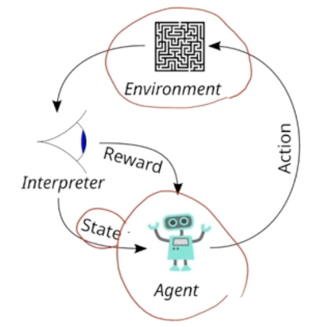
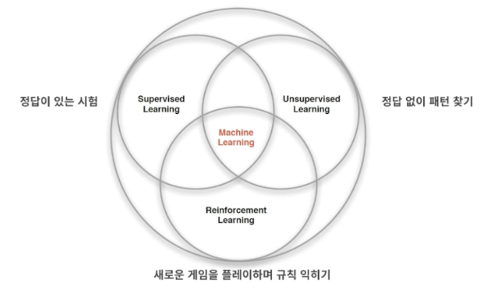
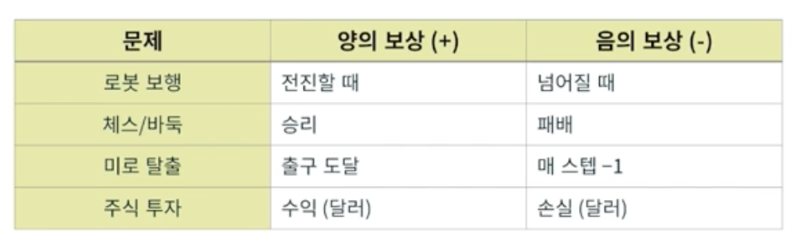
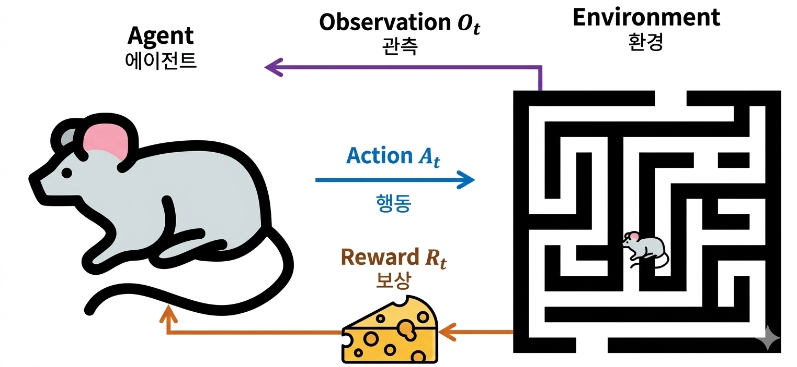
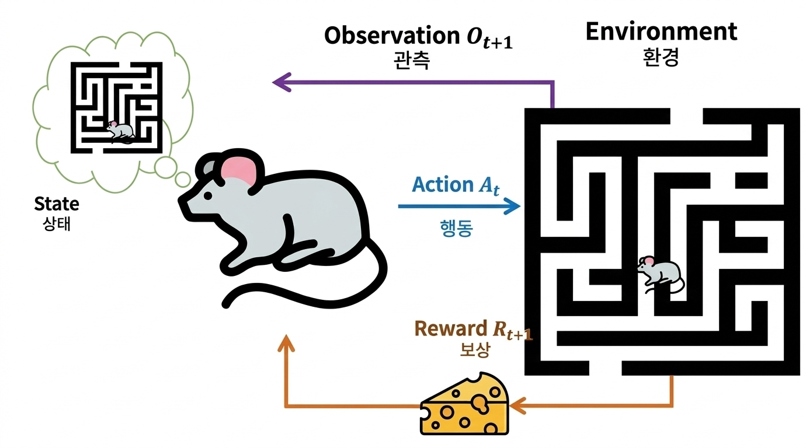
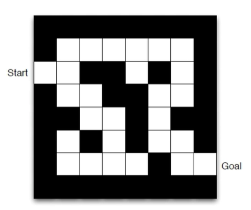
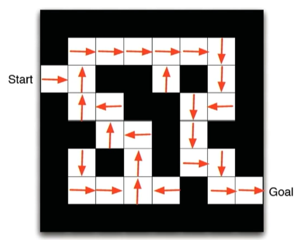
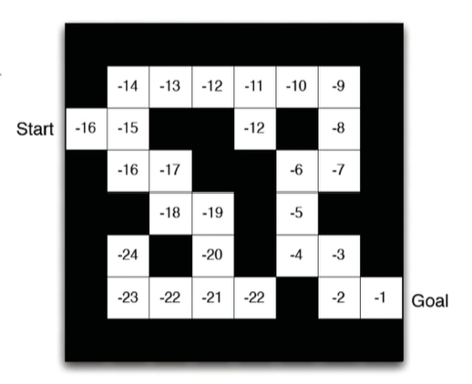
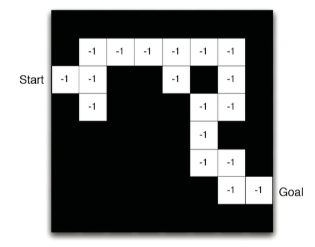

## 강화학습

#### * 강화학습이란?

- 어떤 환경(Environment, Agent가 적응해야하는 환경)안에서 정의된 에이전트(Agent, 로봇·모델)가 현재의 상태(State)를 인식하여, 선택 가능한 행동(Action)들 중 보상(Reward)을 최대화하는 행동 혹은 행동 순서를 선택하는 방법

  

- 강화학습은 단일 분야가 아닌 여러 학문의 교차점에 있다

  - 컴퓨터 과학 : 기계학습(Machine Learning)
    - 정답(Label)이 주어지지 않는 환경에서, 에이전트가 시행착오를 겪으며 데이터(경험)를 스스로 쌓고 신경망을 통해 가치 함수나 정책을 업데이트
  - 공학 : 최적 제어(Optimal Control, 보상을 최대화 시키는 최적화 알고리즘)
    - 시스템을 어떻게 최적의 상태로 제어할 것인가에 대한 수학적 공식과 이론을 제공 (벨만 방정식, 동적 계획법)
  - 심리학 : 조건화 학습(Classical/Operant Conditioning)
    - 환경의 긍정적 피드백(보상)은 행동을 강화하고 부정적 피드백(벌)은 행동을 약화시키는 구조
  - 경제학 : 제한된 합리성(Bounded Rationality)
    - 모든 정보를 다 알 수 없고 계산 능력도 유한한 상황(제한된 합리성)에서, 에이전트가 어떻게 완벽하진 않더라도 최선의 이익(효용)을 내는 의사결정을 내릴 수 있는지 분석

- 기계학습 안에 지도학습, 비지도학습, 강화학습이 포함된다

  - 지도학습(Supervised Learning)
    - 정답이 주어짐, 입력-출력 쌍으로 학습
    - Ex) 고양이 사진 -> '고양이'라는 정답 레이블
  - 비지도학습(Unsupervised Learning)
    - 정답이 없음, 데이터 내 숨겨진 패턴을 스스로 찾음
    - Ex)고객 군집화 (비슷한 고객끼리 그룹핑), 차원 축소(고차원 데이터를 시각화)
  - 강화학습(Reinforcement Learning)
    - 정답 대신 '보상'이 있음. 시행착오(Trial-and-Error)로 학습
    - Ex)게임에서 점수 올리기, 로봇 걷기 학습
    - 지도학습과의 차이점
      - 지도학습은 '이게 정답이야'라고 선생님이 알려주는 학습 방법
      - 강화학습은 '잘했어/못했어'라고만 알려줌. 정답은 스스로 찾아야 함

  

- 강화학습 4가지 핵심 특징

  1. 선생님(Supervisor)이 없음

     - 정답을 알려주는 선생님이 없음. 오직 보상 신호(Reward signal)만 존재.
     - '이 행동이 맞아'가 아니라 '이 행동은 +10점, -5점' 형태로 피드백

  2. 피드백이 즉각적이지 않음(Delayed Reward)

     - 행동의 결과가 한참 후에 나타남
       - 체스에서 오프닝 실수가 50수 후 패배로 이어질 수 있음.

  3. 시간이 중요함

     - 데이터가 순차적(Sequential)이고, 서로 독립적이지 않음

       - Agent는 아무런 지식이 없는 상태에서 출발하여, "과거의 보상 경험"을 이정표 삼아 미래의 행동 전략을 수정해 나간다.

       1. 상태 관찰(State) : 에이전트가 현재 환경의 상황을 파악
       2. 행동 선택(Action) : 에이전트가 어떤 행동을 취한다
       3. 보상 및 다음 상태 획득(Reward & Next State): 환경은 그 행동을 평가하여 플러스·마이너스 보상을 주고, 다음 상태로 변화
       4. 학습 및 업데이트(Learning) : 에이전트는 '이전에 받았던 보상들'을 기억하고 분석하여, 어떤 상태에서 어떤 행동을 하는 것이 이득이었는지 머릿속(신경망 또는 테이블)에 기록

     - 현재 상태는 과거 행동의 결과

  4. 핸동이 미래 데이터에 영향

     - 에이전트의 현재 행동이 미래에 받을 데이터를 바꿈

- 과거 보상을 기반으로 할 때 생기는 두가지 핵심 과제

  1. 탐색과 활용의 딜레마(Exploration vs Exploitation)
     - **탐색(Exploration):** 과거 보상 데이터는 적거나 없지만, 혹시 더 큰 보상이 숨겨져 있을지 모르니 **'새로운 길'**을 시도해보는 성향
     - **활용(Exploitation):** 이전에 보상을 많이 받았던 **'이미 아는 안전한 길'**로만 가려는 성향
       - *균형:* 과거의 보상을 기반으로 행동하되, 가끔은 새로운 시도를 하도록 제어해야 최적의 정답을 찾을 수 있음
  2. 지연된 보상(Delayed Reward)문제
     - 지금 당장 받은 보상뿐만 아니라, 과거에 했던 수많은 행동들이 누적되어 미래에 큰 보상으로 이어지는 경우가 많음
     - 에이전트는 단순히 '직전의 보상'뿐만 아니라 '앞으로 받을 보상의 총합(기대 가치)'을 예측하여 지금의 행동을 결정하도록 발전

- 응용 분야

  - 로보틱스 : 휴머노이드 보행, 드론 제어
  - 자율주행 : 복잡한 교통 상황에서 의사결정
  - 금융 : 고객 맞춤형 포트폴리오 최적화, 사기 탐지 시스템
  - 의료 : 환자 맞춤형 치료 계획 최적화, 신약개발

- 강화학습의 역사적 성과

  1. TD-Gammon

     - Gerald Tesauro가 개발한 백게먼 게임 프로그램

     - 지도학습을 전혀 이용하지 않고 자기 자신과 대국하며 학습(Self-play)해 세계 챔피언 수준에 도달함

     - 신경망+시간차(TD)학습의 첫 성공 사례

  2. Deep Q-Network(DQN)

     - DeepMind의 DQN이 49개 아타리 게임에서 인간 수준 초과 달성
     - 화면 픽셀만 보고 학습(수작업 특성 설계 없음)
     - 딥러닝 + 강화학습의 시작

  3. AlphaGo

     - DeepMind의 알파고가 이세돌 9단을 4:1로 격파
     - 바둑은 경우의 수가 10^170개로 체스보다 훨씬 복잡한데, 수많은 경기를 통해 시행착오를 겪으며 정책 네트워크의 확률을 조정

#### * 보상과 순차적 의사결정

- 보상(Reward)

  - **보상(\(R_{t}\)):** 시간 t에서 에이전트가 받는 숫자 형태(점수)의 피드백 신호

  - 현재 시점에서 에이전트가 '얼마나 잘하고 있는지'를 알려줌

  - 에이전트는 단순히 즉각 보상이 아닌, 누적 보상(Cumulative Reward)을 최대화하는 것을 목표로 함

    

- 보상 가설(Reward Hypothesis)

  - Agent의 모든 목표는 기대 누적 보상의 최대화로 표현 가능하다(강화학습의 핵심 가정)
  - Ex) '배고픔 해결'도 '음식 획득 보상 최대화'로 표현 가능

- 순차적 의사결정

  - 목표 : 미래의 총 보상을 최대화하도록 행동을 선택함
  - 현재의 선택이 당장의 결과 뿐만 아니라 미래의 상황과 보상에도 영향을 미치는 연속적인 선택 과정(행동에는 장기적 결과가 따름)
  - 보상이 지연될 수 있음
  - 당장의 보상을 포기하고 장기 보상을 얻는게 나을 수 있음
    - 즉시 보상 vs 지연 보상의 trade-off (지금 당장은 +5점, 10스텝 후 +100점)
    - 금융 투자(수익이 몇 달/몇 년 후 실현될 수 있음), 바둑·체스(현재 두는 수가 수십 수 후 승리에 기여할 수 있음)

- 할인율(Discount Factor)
  - 미래 보상을 현재 가치로 환산하는 계수 (0 <= γ <= 1)
  - 필요한 이유
    - 수학적 이유 : 무한한 미래 보상의 합이 발산하지 않도록
    - 현실적 이유 : 미래는 불확실 (보상 가치가 기하급수적으로 감소)
  - 할인된 누적 보상 (Return)
    - \(G_t = R_{t+1} + \gamma R_{t+2} + \gamma^2 R_{t+3} + ...\)
    - \(\gamma = 0\): 오직 즉각 보상만 (근시안적)
    - \(\gamma = 0.99\): 미래 보상도 중요하게 고려 (원시안적)
    - 게임처럼 짧은 에피소드면 \(\gamma \) 높게, 실시간 제어면 \(\gamma \) 낮게 설정함

#### * 상태와 환경

- 에이전트와 환경의 상호작용

  - 에이전트(Agent / 쥐) : 관측 \(O_{t}\) 받음 → 행동 \(A_{t}\) 실행 → 보상 \(R_{t}\) 받음

    - **관측 (\(O_{t}\)):** 쥐(에이전트)는 미로(환경)를 둘러보고 현재 자신이 막다른 길에 있는지, 갈림길에 있는지 상태를 **관측 **
      - **핵심 (정보의 흐름):** 쥐가 스스로 알아낸다기보다, **환경(미로)이 쥐에게 '현재 눈앞의 시각 데이터'를 전송(입력)해 주는 구조**
      - 강화학습의 시스템 구조에서는 '정보의 흐름(누가 누구에게 데이터를 전달하는가)'을 기준으로 보기 때문에 환경이 에이전트에게 관측을 줌
    - **행동 (\(A_{t}\)):** 관측한 정보를 바탕으로 쥐는 앞으로 갈지, 왼쪽으로 갈지 **행동**을 실행
    - **보상 (\(R_{t}\)):** 행동의 결과로 미로가 막혔다면 마이너스 점수를, 치즈(목적지)에 가까워졌다면 플러스 **보상**을 받으며 다음 상태로 이동 

    

  - 환경 (Environment / 미로) : 행동 \(A_{t}\) 받음 → (Agent)상태 업데이트 → 다음 관측 \(O_{t+1}\), 보상 \(R_{t+1}\) 방출

    - 에이전트가 놓인 외적인 세계이자, 에이전트의 행동에 반응하여 새로운 상황과 보상을 주는 대상
    - **행동 \(A_{t}\) 받음** : 에이전트가 현재 시점(\(t\))에서 결정한 행동을 환경에 전달
    - **상태 업데이트** : 환경은 에이전트의 행동을 반영하여 물리적인 상태나 내부 데이터를 변화시킴
    - 상태가 바뀌었으므로 환경은 에이전트에게 **새로운 시간대(\(t+1\))의 정보**를 건네준다
      - **다음 관측 (\(O_{t+1}\)):** 바뀐 위치에서 에이전트가 새로 보게 될 주변 상황
      - **보상 (\(R_{t+1}\)):** 직전 행동이 얼마나 좋은 행동이었는지 성적표를 줌

    

  - 이력 (History)

    - \(H_t = O_1, A_1, R_1, ..., O_t, A_t, R_t\) : 지금까지 모든 관측, 행동, 보상의 시퀀스

  - 상태 (State)

    - 다음에 무슨 일이 일어날지 결정하는 데 필요한 충분한 정보
    - \(S_t = f(H_t)\) : 상태는 이력에 대한 함수

  - 최종 목표

    쥐의 목표는 단순히 눈 앞의 치즈 한 조각만 먹는 것이 아니라, 앞으로 받을 모든 보상의 **총합(\(G_{t}\))을 극대화**하는 최적의 미로 탈출 경로를 찾아내는 것

    이때 **할인인자(γ)**를 조절하여, 지금 당장의 보상만 좇을지(근시안적) 혹은 조금 멀리 돌아가더라도 결국 탈출하는 큰 그림을 그릴지(원시안적) 결정

- 3가지 상태

  1. 환경 상태 (Environment State, \(S_{t}^{e}\))
     - **(현재 시점)환경의 실제 전체 모습**, 모든 데이터가 포함된 '진짜 현실' 스냅샷
       - 다음 환경이 어떻게 변할지 결정하는 데 필요한 모든 데이터를 포함
     - 보통 에이전트에게 이 데이터가 전부 제공되지는 않으며, 일부는 숨겨져 있는 경우가 많음
     - **쥐 미로 예시**: 미로의 전체 크기, 보이지 않는 곳에 숨겨진 모든 벽의 위치, 치즈가 놓인 정확한 좌표 등 미로 세상의 모든 정답지 데이터를 뜻
  2. 에이전트 상태 (Agent State, \(S_{t}^{a}\))
     - **에이전트(인공지능)가 받아들여서 머릿속에 기억하고 있는 정보**, 에이전트는 이 상태 정보를 바탕으로 다음 행동을 결정
     - 에이전트가 어떤 알고리즘을 쓰느냐에 따라 이전 기억을 많이 담을 수도 있고, 방금 본 것만 담을 수도 있음(주관적, 불완전)
     - **쥐 미로 예시**: 전체 미로 지도는 모르지만, 쥐가 지금까지 걸어오면서 머릿속으로 기억해 둔 **"직전에 왼쪽으로 꺾었고, 방금 치즈 냄새를 맡았다"** 같은 기억과 현재 눈앞의 시야 정보를 합친 기억 장부
  3. 정보 상태 / 마르코프 상태 (Information State / Markov State)
     - **미래를 예측하는 데 필요한 과거의 모든 유용한 정보가 현재에 이미 다 요약되어 있는 상태**
     - "현재 상태를 알면 과거의 기록은 미래를 예측하는 데 아무런 도움이 되지 않는다"는 마르코프 성질(Markov Property)을 만족하는 상태
     - 환경상태·이력은 마르코프 성질을 지닌다
       - 강화학습에서는 이력 전체를 쓰는 대신, 미래를 예측하기 위해 필요한 모든 정보의 요약본(마르코프 상태)을 찾는 것을 목표로 함
     - **쥐 미로 예시**: 쥐가 미로의 한 칸에 서 있을 때, **그 칸의 좌표 (x, y)**가 바로 마르코프 상태가 될 수 있습니다. 이 좌표만 알면 쥐가 과거에 뱅뱅 돌아서 왔든, 지름길로 왔든 상관없이 '앞으로 탈출하기 위해 어디로 가야 하는가'를 완벽히 결정할 수 있기 때문
  
- Markov Decision Process(완전 관측, MDP)

  - 에이전트가 환경 전체를 관측(이상적인 상태)
  - \(O_t = S_t^a = S_t^e\)  (관측된 정보 상태 = 에이전트 상태 = 환경 상태)
    - 관측된 정보(\(O_{t}\)) 자체가 마르코프 성질을 가짐, 현재 보이는 화면만 보고 행동해도 최적의 결과를 낼 수 있음
    - Ex) **체스, 바둑** (판 위의 말 위치가 전부 공개),
      **비디오 게임의 일부** (화면 안에 모든 적과 장애물이 다 보이는 경우)

- Partially observable Markov decision process (부분 관측, POMDP)

  - 에이전트가 환경의 일부만 관측하거나, 관측 정보에 노이즈가 섞임
  - 현실 세계의 문제 대부분에 해당
  - \(O_t \neq S_t^e\) (환경 상태의 일부 혹은 변형된 정보만 관측)
    - 에이전트가 별도로 \(S_{t}^{a}\)를 구축함
      - 이력 기반(\(S_t^a = H_t\)), 믿음 상태 기반(확률 기반 추정), 메모리 기반(RNN)

    - Ex) **포커** (상대의 패를 볼 수 없음), **자율주행** (센서 범위를 벗어난 사각지대, 앞차에 가려진 신호등)

#### * RL 에이전트의 구성요소

- RL 에이전트는 아래 구성 요소 중 무조건 하나 이상을 포함한다.
  - 정책, 가치함수, 모델

1. 정책(Policy, 𝜋)

   - 에이전트의 행동 규칙 (현재 상태를 입력받아 어떤 행동을 취할지 결정하는 규칙)
   - (입력값)상태 s에서 (결과값)행동 a로 가는 매핑 함수(𝜋) : 𝑎 = 𝜋(𝑠)
   - 결정적 정책 : 𝑎=𝜋(𝑠)
     - 상태 𝑠에서는 무조건 행동 𝑎를 한다.
     - ex) 사람이 있으면 멈춘다. 빨간불이면 멈춘다. (rule기반 action)
   - 확률적 정책 : 𝜋(𝑎|𝑠) = ℙ[𝐴𝑡 = 𝑎|𝑆𝑡 = 𝑠]
     - 상태 𝑠에서 행동 𝑎를 할 확률은 70%(탐험을 위해 주로 사용)

2. 가치 함수(Value Function, V&Q)

   - 현재 상태(혹은 상태-행동 쌍)의 장기적 가치 예측(현재 상태가 미래에 얼마나 많은 보상을 가져다줄지 평가)

   - 정책이 얼마나 좋은지 평가하고, 더 좋은 행동을 선택하는 기준이 됨

   - 상태 가치 함수 \(V_{\pi}(s)\)

     - 상태 s에서 정책 π를 따르는 것이 얼마나 좋은 지 (축구 경기에서 공을 가지고 골대 앞에 서 있는 상황의 점수)

   - 행동 가치 함수 \(Q_{\pi}(s, a)\)

     - 기존 정책(\(\pi \))의 흐름을 깨고, 현재 상태(s)에서 (만약 이 행동을 하면 어떻게 될지 가상으로 대입) 특정 행동(a)을 한 후, 그 이후부터는 기존 정책(π)를 따랐을 때 얻을 수 있는 미래 보상의 총합(점수) => 어떤 행동이 미래 보상을 최대화하는지 비교

       ~~~
       기존 정책을 깨고 특정 행동을 넣었을 때 어떤 행동이 미래보상을 최대화하는지 비교
       기존 정책 :
       "골대 앞(s)에서는 수비가 붙으니까, 보통 70% 확률로 패스를 찌르고 30% 확률로 가끔 슛을 쏜다."
       
       현재 (s):
       기본 전술(패스 70%, 슛 30%)의 흐름을 깨고, 이번 딱 한 번은 무조건 '슛'을 쏜다고 가정
       
       현재 (s): 기본 전술의 흐름을 깨고, 이번 딱 한 번은 무조건 '패스'를 찌른다고 가정
       ~~~

3. 모델(Model)

   - 에이전트가 이해한 환경의 동작 원리
     - 이 행동을 했을 때 환경이 어떻게 변할지 미리 예측(Planning)할 수 있게 함
   - 전이 모델 \(P(s'\vert{}s, a)\): 다음 **상태** 예측
   - 보상 모델 \(R(s, a)\): 다음 **보상** (즉각적인)예측

- Ex) 미로 찾기

  - 보상 : 매 스텝 -1 (빨리 탈출할수록 좋음)

  - 행동 : N, E, S, W (북, 동, 남, 서)

  - 상태 : 에이전트의 위치

    

  - 정책 𝜋(s) : 각 칸의 화살표 (해당 상태s에서 취할 행동)

    

  - 상태 가치함수 \(V_{\pi}(s)\) : 내가 지금 이 칸(\(s\))에 서 있을 때, 앞으로 게임이 끝날 때까지 받게 될 '최종 예상 성적표(총점)'

    - 각 칸의 숫자(해당 상태 s에서의 기대 누적 보상)

    

  - 모델 : 에이전트가 예측을 위해 시뮬레이션한 미로의 동작 원리

    - 전이 모델 \(P(s'\vert{}s, a)\) : 칸들의 배치 (내가 현재 칸(\(s\))에서 **어떤 행동(\(a\))을 했을 때**, 실제로 발을 디디게 될 **다음 칸(\(s^{\prime }\))이 어디가 될지** 예측)

    - 보상 모델 \(R(s, a)\): 각 칸의 숫자 (각 칸에 대해 예측한 즉각적인 보상 : 어디 서 있든 간에, '지금 당장 한 칸 움직이는 행동'을 했을 때 받게 되는 **즉각적인 보상(벌금 -1점)**)

      

- 학습 대상에 대한 분류

  1. Value Based (가치 기반) : 최적의 가치 함수(Q함수 등)를 학습하여, 각 상태에서 가치가 가장 높은 행동을 선택하는 방식
     - 정책은 암묵적(DQN)
  2. Policy Based(정책 기반) : 상태에 따라 어떤 행동을 할지 결정하는 정책(확률분포) 자체를 직접 학습하여 최적화하는 방식
     - 가치 함수 없음 (REINFORCE)
  3. Actor-Critic : 행동을 선택하는 Actor(정책)와 그 선택을 평가하는 Critic(가치 함수)을 동시에 학습하여 안전성과 효율을 높인 방식
     - A3C,PPO

