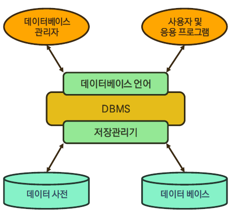
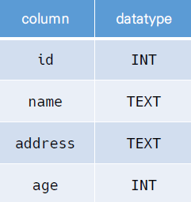
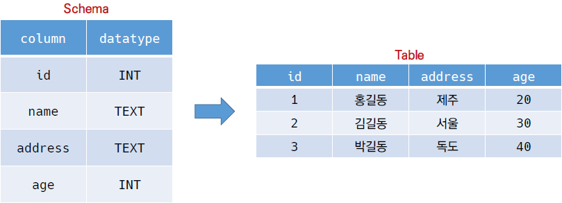

## 데이터베이스(DB)

- 체계화된 데이터의 모임
- 여러 사람이 공유하고 사용할 목적으로 통합 관리되는 정보의 집합
- 논리적으로 연관된 (하나 이상의)자료의 모음
- 몇개의 자료 파일을 조직적으로 통합하여 자료 항목의 중복을 제거, 자료를 구조화시킨 집합체

- Server의 서비스와 연관

##### * 장점

- 데이터 중복 최소화

- 데이터 무결성 (정확한 정보를 보장)

- 데이터 일관성

- 데이터 독립성 (물리적/논리적)

- 데이터 표준화

- 데이터 보안 유지

  

##### * 관계형 데이터베이스(RDB)

- Relation Database

- 키(key)와 값(value)들의 간단한 관계(relation)를 표(table) 형태로 정리한 DB

- 스키마(schema)

  - DB에서 자료의 구조, 표현방법, 관계등 전반적인 명세(table의 모양)를 기술한 것

  - ex)

    

- 테이블(table) : 열(컬럽/필드)과 행(레코드/값)의 모델을 사용해 조직된 데이터 요소들의 집합

- 열(Column) : 각 열에는 고유한 데이터 형식이 지정됨

- 행(row) : 실제 데이터가 저장되는 형태

  - 아래의 사진은 스키마를 통해 table을 구현

  - name이란 필드에 고객의 이름(TEXT)가 저장되어 있고, 총 3명의 고객정보(레코드)가 저장

    

##### * RDBMS

- Relation Database Management System
- 관계형 모델을 기반으로 하는 DB 관리시스템을 의미
- ex)
  - MySQL, SQLite, PostgreSQL, ORACLE, MS SQL

- SQLite
  - 서버형태가 아닌 파일 형식으로 응용 프로그램에 넣어서 사용하는 비교적 가벼운 DB
  - 오픈소스 프로젝트이기 때문에 자유롭게 사용가능
  - Django에서 기본적으로 제공하는 RDBMS

##### * SQL(Structured Query Language)

- RDBMS의 데이터 관리를 위해 설계된 특수 목적으로 프로그래밍 언어
- DB 스키마 생성 및 수정
- 자료의 검색 및 관리
- DB 객체 접근 조정 관리

- DDL(Data Defination Language)
  - 데이터 정의 언어
  - 관계형 DB 구조(테이블, 스키마)를 정의하기 위한 명령어
  - CREATE, DROP, ALTER
- DML(Data Manipulation Language)
  - 데이터 조작 언어
  - 데이터를 저장, 조회, 수정, 삭제 등을 하기 위한 명령어
  - INSERT : 새로운 데이터 삽입(추가)
  - SELECT : 저장되어있는 데이터 조회
  - UPDATE : 저장되어있는 데이터 갱신
  - DELETE : 저장되어있는 데이터 삭제
- DCL(Data Control Language)
  - DB 사용자의 권한 제어를 위해 사용하는 명령어
  - GRANT, REVOKE, COMMIT, ROLLBACK

## Foreign Key

- 외래 키(외부 키)
- 관계형 데이터베이스에서 한 테이블의 필드 중 다른 테이블의 행을 식별할 수 있는 Key
- 참조하는 테이블에서 1개의 Key(속성 or 속성의 집합)에 해당
  -  참조되는 측 테이블의 **기본 키 (Primary Key)**를 가리킴
- 참조하는 테이블의 행 1개의 값은, 참조되는 테이블의 행 값에 대응
  - 참조하는 테이블의 행에는 참조되는 테이블에 나타나지 않는 값을 포함할 수 없음
- 참조하는 테이블의 행 여러개가, 참조되는 테이블의 동일한 행을 참조할 수 있다
  - ex) 1개의 게시글에 여러개의 댓글이 존재할 수 있다

##### * 특징

- 키를 사용하여 부모 테이블의 유일한 값을 참조(참조 무결성)
  - 외래 키의 값이 반드시 부모 테이블의 기본 키 일 필요는 없지만 유일한 값이어야 한다
  - 참조 무결성
    - DB 관계 모델에서 관련된 2개의 테이블 간의 일관성을 말한다
    - 외래 키가 선언된 테이블의 외래 키 속성(열)의 값은 부모가 되는 테이블의 기본 키 값으로 존재해야 한다

