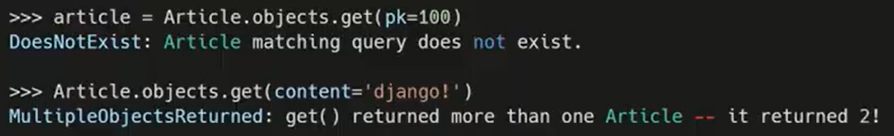

## Django

- Django is a high-level Pyhon WEb Framework that encourages rapid development and clean, pragmatic design
  - Django는 신속한 개발, 깨끗하고 실용적인 설계를 장려하는 높은 수준의 Python WEB 프레임워크
- It takes care of much of the hassle of Web development, so you can focus on Writing your app without needing to reinvent the wheel
  - 이것은 웹 개발의 많은 번거로움을 덜어주기 때문에 당신은 앱 작성에 집중할 수 있습니다

- 빠르고 깨끗한 개발을 지원 
- Web Framework노
- 검증된 Python 언어 기반 Web Framework
- 대규모 서비스에도 안정적이며 오랫동안 세계적인 기업들에 의해 사용되고 있다

##### * Web

- 인터넷에 연결된 컴퓨터를 통해 정보를 공유할 수 있는 전 세계적인 정보 공간
- static web page(정적 웹 페이지)
  - 정보가 고정되어 있다
  - 서버에 미리 저장된 파일이 사용자에게 그대로 전달되는 웹 페이지
  - 서버가 정적 웹 페이지에 대한 요청을 받은 경우 서버는 추가적인 처리 과정 없이 클라이언트에게 응답을 보냄
  - 모든 상황에서 모든 사용자에게 동일한 정보를 표시
  - 일반적으로 HTML, CSS, JavaSript로 작성됨
  -  flat page라고 한다

- Dynamic web page (동적 웹 페이지)
  - 웹 페이지에 대한 요청을 받은 경우는 서버는 추가적인 처리 과정 이후 클라이언트에게 응답을 보냄
    - 내가 보내는 특정 키워드에 따라 페이지가 달라진다? 
  - 동적 페이지는 방문자와 상호작용하기 때문에 페이지 내용은 그때그때 다름
  - 서버 사이드 프로그래밍 언어(python, java, c++ 등)가 사용되며 파일을 처리하고 데이터베이스와의 상호작용이 이루어짐

##### * Framework

- Framework
  - 프로그래밍에서 특정 운영 체제를 위한 응용 프로그램 표준 구조를 구현하는 클래스와 라이브러리 모임
  - 재사용할 수 있는 수많은 코드를 프레임워크로 통합함으로써 개발자가 새로운 애플리케이션을 위한 표준 코드를 다시 작성하지 않아도 같이 사용할 수 있도록 도움
  - Framework는 web을 어떻게 만들지 기본 틀이 주어진다.
  - Application Framework라고 함

##### * Web Framework

- Web Framework
  - 웹 페이지를 개발하는 과정에서 겪는 어려움을 줄이는 것이 주 목적으로 데이터베이스 연동, 템플릿 형태의 표준, 세션관리, 코드 재사용 등의 기능을 표함
  - 동적인 웹페이지나, 웹 애플리케이션, 웹 서비스 개발 보조용으로 만들어지는  Application Framewokr의 일종

##### * Framework Architecture

- MVC Design Pattern(model-view-controller)
  - model : 데이터, view : 화면의 입력과 출력, controller : 제어
  - 프로그램의 구조, 설계패턴
- 소프트웨어 공학에서 사용되는 디자인 패턴 중 하나
- 사용자 인터페이스로부터 프로그램 로직을 분리하여 애플리케이션의 시각적 요소나 이면에서 실행되는 부분을 서로 영향 없이 쉽게 고칠 수 있는 애플리케이션을 만들 수 있음
- Django는 MTV pattern

##### * [MTV Pattern](https://developer.mozilla.org/ko/docs/Learn/Server-side/Django/Introduction)

- Model

  - 응용프로그램의 데이터 구조를 정의하고 데이터베이스의 기록을 관리(추가, 수정, 삭제)
  - DB를 직접 connection하고 데이터 가져오고 view에 data를 전달

- Template(MVC패턴에서 View)

  - 파일의 구조나 레이아웃을 정의
  - 실제 내용을 보여주는데 사용(presentation)
  - View에서 받은 data를 js/html 등 다양한 형태의 user interface 형태로 만들어서 web browser로 넘겨준다

- View(MVC패턴에서 Controller)

  - HTTP 요청을 수신하고 HTTP응답을 반환
  - 프로그램의 로직을 처리
  - Model을 통해 요청을 충족시키는데 필요한 데이터에 접근
    - 사용자의 요청을 받는다, Model에서 받은 data를 Template에 전달
  - template에게 응답의 서식 설정을 맡김
  
  
  
  


##### * Django Intro

1. django 설치

   ```
   $pip install django

2. 장고 프로젝트 생성

   - 프로젝트 자체를 장고용으로 만들어서 장고 기본 폴더들이 포함된 새로운 폴더가 생성된다

   - 프로젝트를 만들고자 하는 위치에서 실행할 것
   - 프로젝트 이름에는 

   ```
   django-admin startproject firstpjt(프로젝트 이름)
   ```
   - 프로젝트 구조

     

3. django extension 설정

   - 생성된 프로젝트에서 vs code실행 후 확장에서 Django 설치,  Ctrl + Shift + P 눌러서 기본설정 : 설정열기(JSON)을 누른 뒤 setting.json에 아래와 같은 코드 추가

   ```
   //Django
       "files.associations": {
           "**/*.html": "html",
           "**/templates/**/*.html": "django-html",
           "**/templates/**/*": "django-txt",
           "**/requirements{/**,*}.{txt,in}": "pip-requirements"
       },
       "emmet.includeLanguages": {
           "django-html": "html"
       }

4. django 서버 실행

   ```
   python manage.py runserver
   ```

   - 서버 종료 : Ctrl + C


- Project & Application
  - project
  - Application
    - 앱은 실제 요청을 처리하고 페이지를 보여주고 하는 등의 역할을 담당
    - 하나의 프로젝트는 여러 앱을 가짐
    - 일반적으로 앱은 하나의 역할 및 기능 단위로 작성함


앱을 만들때는 복수형으로 만든다

article X , articles


url -> views ->templates


- 수요일 강의부터

##### * Model

- 단일한 데이터에 대한 정보를 가짐
  - 사용자가 저장하는 데이터들의 필수적인 필드들과 동작들을 포함
- 저장된 데이터베이스의 구조(layout)
  - 모델 != 데이터베이스
  - 내가 만든 모델이 DB에 실제로 저장될 것이므로 db의 table구조이다
- 웹 애플리케이션의 데이터(DB)를 **구조화**하고 **조작**하기 위한 도구
- 장고는 model을 통해 데이터에 접속하고 관리
- 일반적으로 각각의 model은 하나의 데이터베이스 테이블에 매핑 됨
  - 매핑 : 각각에 연결된다

##### * 데이터베이스(DB)

- 체계화된 데이터의 모임
  - 여러개의 테이블로 이루어져 있다
- 쿼리(Query)
  - 데이터를 조회하기 위한 명령어를 쿼리라 한다
    - 쿼리를 날린다 = DB를 조작(조회, 수정, 삭제 등)한다
  - 조건에 맞는 데이터를 추출하거나 조작하는 명령어

- 기본구조

  - 스키마(Schema)

    - 데이터베이스에서 자료의 구조, 표현방법, 관계 등을 정의한 구조

  - 테이블(Table)

    - 열(column) : 필드(field) or 속성

      - 데이터의 형식(타입)

        

    - 행(row) : 레코드(record) or 튜플

      - 실제 데이터가 작성되는 부분

        

    - PK(기본키) : 각 행(레코드)의 고유값으로, Primary key로 불린다. 반드시 설정해야하며, 데이터베이스 관리 및 관계 설정시 주요하게 활용된다

  	


##### * ORM

- Object-Relational-Mapping

- 객제 지향 프로그래밍 언어를 사용하여 호환되지 않는 유형의 시스템 간에 (Django-SQL)데이터를 변환하는 프로그래밍 기술

- DB를 객체(object)로 조작하기위해 ORM을 사용한다

- OOP 프로그래밍에서 RDBMS을 연동할 때, 데이터베이스와 객체 지향 프로그래밍 언어 간의 호환되지 않는 데이터를 (서로 대화할 수 있게)변환하는 프로그래밍 기법 

  - Django는 sql문을 해석할 수 없다

    

- Django는 내장 Django ORM을 사용

- 장점
  - SQL을 잘 알지 못해도 DB 조작이 가능
  - SQL의 절차적 접근이 아닌 객체 지향적 접근으로 인한 높은 생산성
  
- 단점
  - ORM만으로 완전한 서비스를 구현하기 어려운 경우가 있음
  
- 현대 웹 프레임워크의 요점은 웹 개발의 속도를 높이는 것(생산성)

##### * 클래스를 통한 모델 정의 (models.py 작성)

```django
from django.db import models

class Article(models.Model): # (model.Model)을 상속받는 순간 DB와 통신하는 method를 가지게된다
    title = models.CharField(max_length=10)
    content = models.TextField()
```

- 테이블을 구조화하는 스키마를 코드(클래스)로 구현한 것
- pk는 직접 정의하지 않아도 장고가 만들어준다
- DB컬럼과 어떠한 타입으로 정의할 것인지에 대해 django.db라는 모듈의 models를 상속
  - 각 모델은 django.db.models.Model 클래스의 서브 클래스로 
    - Article 클래스는 models.Model을 상속받는다
- title과 content는 모델의 필드(컬럼, 열)이다
  - 열은 총 3개 (pk + title + content)
  - 각 필드는 클래스 속성으로 지정되어 있으며, 각 속성은 데이터베이스의 열에 매핑
- 사용 모델 [필드](https://docs.djangoproject.com/en/3.2/ref/models/fields/)(title의 타입 : CharField, content의 타입 : TextField)
  1. CharField(max_length=None, **options)
     - 길이의 제한이 있는 문자열을 넣을 때 사용
     - charField의 max_length는 필수 인자
     - 필드의 최대 길이(문자), 데이터베이스 레벨과 Django의 유효성 검사(값을 검증하는 것)
  2. TextField(**option)
     - 글자의 수가 많을 때 사용
     - max_length 옵션 작성시 자동 양식 필드인 textarea 위젯에 반영은 되지만 모델과 데이터베이스 수준에는 적용되지 않음

##### * Migrations

- 기본적으로 마이그레이션이라는 뜻은 DB에 무언가를 적용할 때를 의미한다

- django가 model에 생긴 변화(필드를 추가했다던가 모델을 삭제했다던가 등)를 **DB에 반영**하는 방법

- Migration(설계도)실행 및 DB 스키마를 다루기 위한 몇가지 명령어

  - makemigrations ~ migrate 부분은 table을 생성한다

    - sql의 create table
    - 처음(makemigrations ~ migrate) 이후 migrate는 테이블의 열을 삽입, 수정, 삭제하는 것

  - **makemigrations**

    - model을 변경하는 것에 기반한 새로운 **마이그레이션(설계도)을 만들 때** 사용

      - models.py에 만든 클래스(스키마)를 DB에 보낼 수 있는 설계도로 바꿔줘야 한다

    - python manage.py makemigrations

      - models.py에 변경이 있을 때 명령어 python manage.py makemigrations을 수행하면 migrations 폴더에 설계도가 생성된다

        - 설계도에는 pk가 추가되어 있다, pk의 속성은 BigAutoField

          

    - 한 테이블을 구성하는 클래스가 변경되었을 때 makemigrations을 사용하면 기존의 설계도가 바뀌는것이 아니라 새로운 설계도 생성된다

      - 새로운 설계도는 이전에 만들어진 설계도를 참고한다.

        

  - **migrate**

    - 마이그레이션(설계도)을 **DB에 반영**하기 위해 사용

      - makemigrations에서 만들어진 설계도는 ORM에 의해서 SQL언어로 바꿔서 DB에 전달한다

    - 설계도를 실제 DB에 반영하는 과정

    - 모델에서의 변경 사항들과 DB의 스키마가 동기화를 이룬다

    - python manage.py migrate

      - sql에 생성되는 테이블의 이름은 기본적으로 앱이름_클래스이름 구조로 만들어진다

        

  - sqlmigrate

    - 마이그레이션(설계도)에 대한 SQL 구문을 보기 위해 사용
      - 설계도가 SQL문법으로 어떻게 바뀌는지 볼 수 있다
    - 마이그레이션이 SQL문으로 어떻게 해석되어서 동작할지 미리 확인 할 수 있음
    - python manage.py sqlmigrate 앱이름 설계도번호

  - showmigrations

    - 프로젝트 전체의 마이그레이션 상태를 확인하기 위해 사용
    - 마이그레이션 파일들이 migrate됐는지 안됐는지 여부를 확인 할 수 있음
    - python manage.py showmigrations

- DateField's options
  - auto_now_add
    - 최초 생성 일자
    - django ORM이 최초 insert(테이블에 데이터 입력)시에만 현재 날짜와 시간으로 갱신
      - 테이블에 어떤 값을 최초로 넣을 때
  - auto-now
    - 최종 수정 일자
    - django ORM이 save를 할 때마다 현재 날짜와 시간으로 갱신

#####  [더 다양한 필드와 option확인하기](https://docs.djangoproject.com/en/3.2/ref/models/fields/)

##### * Database API

- DB를 조작하기 위한 도구

- django가 기본적으로 ORM을 제공함에 따른 것으로 DB를 편하게 조작할 수 있도록 도움

- Model을 만들면 django는 객체들을 만들고 읽고 수정하고 지울 수 있는 database-abstract API를 자동으로 만듦

- database-abstract API 혹은 database-access API라고도 함

- DB API 문법적인 구문 : Making Queries

  - ClassName.Manager.QuerySetAPI

    

  - Manager

    - django 모델에 데이터베이스 query 작업이 제공되는 인터페이스
    - 기본적으로 모든 django 모델 클래스에 objects라는 Manager를 추가

    - 데이터베이스와 소통할 수 있는 메서드를 가지고 있다

  - [QuerySet](https://docs.djangoproject.com/ko/3.2/ref/models/querysets/)

    - 데이터베이스로부터 전달받은 객체 목록
    - queryset안의 객체는 0개, 1개 혹은 여러 개일 수 있음
      - 데이터베이스로부터 받은 값은 queryset 타입이다
    - 데이터베이스로부터 조회, 필터, 정렬 등을 수행 할 수 있음

- Django에서 사용 가능한 모듈 및 메서드를 Django shell에서 사용해보기

  - shell : 명령어들을 하나씩 동작 시켜보는 것

  - 일반 Python shell을 통해서는 장고 프로젝트 환경에 접근할 수 없음

    - 장고 프로젝트 설정이 load된 Python shell을 활용해 DB API 구문 테스트

      - 기본 Django shell보다 많은 기능을 제공하는 shell_plus 설치 후 사용

        ```
        $ pip install django-extensions

      - 설치 후 setting.py에서 INSTALLED_APPS에 django_extensions를 추가해줘야 한다

    - Django shell 실행 명령어

      ```
      $ python manage.py shell_plus


## CRUD

- 대부분의 컴퓨터 소프트웨어가 가지는 기본적인 데이터 처리기능 4가지

  - Create(생성), Read(읽기), Update(갱신), Delete(삭제)

- 아래의 설명을 위한 다음과 같은 모델을 정의

  ```
  from django.db import models
  
  class Article(models.Model):
      title = models.CharField(max_length=10)
      content = models.TextField()
      created_at = models.DateTimeField(auto_now_add= True)
      updated_at = models.DateTimeField(auto_now=True)

- Create

  - sql의 insert와 비슷?

  1. 모델 클래스의 인스턴스 클래스를 생성하여 인스턴스 변수에 값을 저장, 인스턴스 클래스가 save메서드를 호출

     

     

     ```
     article = Article()
     article.title = 'first'
     article.content = 'django!'
     ========================= 여기까지는 DB에 저장되지 않는다==============================
     article.save()

  2. **⭐키워드 인자를 활용하여 초기값과 함께 인스턴스 생성, save메서드 호출**

     

     - 저장하기 전에 유효성을 검사할 수 있다

     ```
     article = Article(title='second', content='django!!')
     ========================= 여기까지는 DB에 저장되지 않는다==============================
     # 유효성 검사
     article.save()

  3. QuerySetAPI의 create() 사용, 생성과 저장을 한번에 처리

     - 위의 2개의 방식과는 다르게 바로 쿼리 표현식 리턴
     - 유효성 검사할 수 있는 타이밍이 없다

     ```
     Article.objects.create(title='third', content='django!')
     # create는 return값이 존재한다

  - save() method

    - saving objects
    - 객체를 데이터베이스에 저장함
    - 데이터 생성시 save()를 호출하기 전에는 객체의 ID값이 무엇인지 알 수 없음
      - ID값은 django가 아니라 DB에서 계산되기 때문
    - 단순히 모델을 인스턴스화 하는 것은 DB에 영향을 미치지 않기 때문에 반드시 save()가 필요

  - 객체에 대한 출력표현 변경하기

    - 모델에 다음과 같은 코드 추가

      ```
      def __str__(self):
      	return self.title

    - 표준 파이썬 클래스의 메소드인 str()을 정의하여 각각의 object가 사람이 읽을 수 있는 문자열을 반환하도록 할 수 있다
      - 작성 후 반드시 shell_plus 재시작 필요

- READ

  - sql의 select과 비슷?

  - QuerySet API method를 사용해 다양한 조회를 하는 것이 중요

  - QuerySet API method는 크게 2가지로 분류

    1. Methods that return new querysets
       - 새로운 QuerySet을 주는 메서드
    2. Methods that do not return querysets
       - QuerySet을 주지 않는 메서드

  - all()

    - 모든 객체가 들어있는 QuerySet return

    

  - get()

    - 주어진 lookup(조회) 매개변수와 일치하는 객체를 반환

    - 객체를 찾을 수 없으면 DoesNotExist 예외를 발생, 둘 이상의 객체를 찾으면 MultipleObjectReturned예외 발생

      

    - 위와 같은 특징을 가지고 있기 때문에, primary key와 같이 고유(unique)성을 보장하는 조회에서 사용

    

  - filter()

    - 주어진 조회 매개변수와 일치하는 객체를 포함하는 새 QuerySet을 반환

      

    - 조건에 일치하는 데이터가 없으면 빈 QuerySet을 반환

- Update

  - 인스턴스 객체의 인스턴스 변수의 값을 변경한다

  1. 수정하고자 하는 부분을 조회해서 가져온다
  2. 변경하고자하는 부분(인스턴스 변수)에 새로운 값을 저장하여 save() 메서드 호출

  

- DELETE

  - 인스턴스 생성 후 delete() 메서드 호출
    - 삭제하고자 하는 부분을 조회해서 가져온 뒤 delete() 메서드 호출

  - delete()

    - QuerySet의 모든 행에 대해 SQL삭제 쿼리를 수행, 삭제된 객체 수와 객체 유형당 삭제 수가 포함된 닉셔너리를 반환

    

##### * Field lookups

- 열 지정하는 방법

- SQL WHERE 절을 지정하는 방법

- 조회 시 특정 조건을 적용시키기 위해 사용

- QuerySet 메서드 filter(), exclude() 및 get()에 대한 키워드 인수로 지정

- ex)

  ```
  Article.objects.filter(pk__gt=2)
  Article.objects.filter(content__contains='ja')


##### * HTTP method

- GET
  - 특정 리소스를 가져오도록 요청할 때 사용
  - 반드시 데이터를 가져올 때만 사용해야 함
  - DB에 변화를 주지 않음
  - CRUD에서 R 역할을 담당
- POST
  - 서버로 데이터를 전송할 때 사용
  - 리소스를 생성/변경하기 위해 데이터를 HTTP body에 담아 전송
  - 서버에 변경사항을 만듦
  - CRUD에서 C/U/D 역할을 담당

##### * 사이트 간 요청 위조(Cross-Site-Request-Forgery)

- 웹 애플리케이션 취약점 중 하나로 사용자가 자신의 의지와 무관하게 공격자가 의도한 행동을 하여 특정 웹페이지를 보안에 취약하게 한다거나 수정, 삭제 등의 작업을 하게 만드는 공격 방법
- django는 CSRF에 대항하여 middleware와 template tag를 제공

- 공격 방어

  - Security Token 사용 방식(CSRF Token)
    - 사용자의 데이터에 임의의 난수 값을 부여해 매 요청마다 해당 난수 값을 포함시켜 전송
    - 이후 서버에서 요청을 받을 때 마다 전달된 token 값이 유효한지 검증
  - 일반적으로 데이터 변경이 가능한 POST, PATCH, DELETE Method등에 적용
  - django는 csrf token 템플릿 태그를 제공

  - csrf token in Django

    - 전송하는 구간에 아래와 같은 코드 추가해준다

      ```
      
      ```

      - ex)

        ```
        <form action = "" method="post">
        	
            <input type="submit">
         </form>

    - input type이 hidden으로 작성되며 value는 djanfo에서 생성한 hash값이 들어있음

      - rendering할때마다 hash값은 계속 바뀐다

    - 해당 태그가 없다면 Django 서버는 403 forbidden을 응답


##### Admin Site

- Automatic admin interface
  - 사용자가 아닌 서버의 관리자가 활용하기 위한 페이지
  - Model class(DB)를 admin.py에 등록하고 관리
  - django.contrib.auth 모듈에서 제공됨
  - 행(record) 생성 여부 확인에 매우 유용하며, 직접 record를 삽입할 수도 있음

- admin 생성

  ```
  $ python manage.py createsuperuser


redirect

```
View -> template 가아니라
View - > url 로 다시 넘어간다

이미 만들어진 페이지 불러오는거고
```

render

```
render가 사용자에게 보여주기 위해 html을 만들어준다 (사용자에게 보여지는 형태로 html을 만든다)
템플릿을 가져오는것

내가 만들어놓은 템플릿을 가져다가 사용자가 볼수있는 html형태로 만들어준다?
```

```
redirect는 URL로 이동하는 것이기 때문에 render 처럼 context 값을 넘기지는 못함
render 는 템플릿을 불러오고, redirect 는 URL로 이동합니다. URL 로 이동한다는 건 그 URL 에 맞는 views 가 다시 실행될테고
여기서 render 를 할지 다시 redirect 할지 결정하는 것.
```


delete일 때는 POST방식을 사용하는게 좋다

DB에 저장된 값을 아무나 지울수 없게 방지하기 위함

view.py에서

조건을 걸어준다 if request.method == 'POST'
