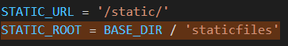

## Django

- Django is a high-level Pyhon WEb Framework that encourages rapid development and clean, pragmatic design
  - Django는 신속한 개발, 깨끗하고 실용적인 설계를 장려하는 높은 수준의 Python WEB 프레임워크
- It takes care of much of the hassle of Web development, so you can focus on Writing your app without needing to reinvent the wheel
  - 이것은 웹 개발의 많은 번거로움을 덜어주기 때문에 당신은 앱 작성에 집중할 수 있습니다

- 빠르고 깨끗한 개발을 지원 
- Web Framework노
- 검증된 Python 언어 기반 Web Framework
- 대규모 서비스에도 안정적이며 오랫동안 세계적인 기업들에 의해 사용되고 있다

##### * Web

- 인터넷에 연결된 컴퓨터를 통해 정보를 공유할 수 있는 전 세계적인 정보 공간
- static web page(정적 웹 페이지)
  - 정보가 고정되어 있다
  - 서버에 미리 저장된 파일이 사용자에게 그대로 전달되는 웹 페이지
  - 서버가 정적 웹 페이지에 대한 요청을 받은 경우 서버는 추가적인 처리 과정 없이 클라이언트에게 응답을 보냄
  - 모든 상황에서 모든 사용자에게 동일한 정보를 표시
  - 일반적으로 HTML, CSS, JavaSript로 작성됨
  -  flat page라고 한다

- Dynamic web page (동적 웹 페이지)
  - 웹 페이지에 대한 요청을 받은 경우는 서버는 추가적인 처리 과정 이후 클라이언트에게 응답을 보냄
    - 내가 보내는 특정 키워드에 따라 페이지가 달라진다? 
  - 동적 페이지는 방문자와 상호작용하기 때문에 페이지 내용은 그때그때 다름
  - 서버 사이드 프로그래밍 언어(python, java, c++ 등)가 사용되며 파일을 처리하고 데이터베이스와의 상호작용이 이루어짐

##### * Framework

- Framework
  - 프로그래밍에서 특정 운영 체제를 위한 응용 프로그램 표준 구조를 구현하는 클래스와 라이브러리 모임
  - 재사용할 수 있는 수많은 코드를 프레임워크로 통합함으로써 개발자가 새로운 애플리케이션을 위한 표준 코드를 다시 작성하지 않아도 같이 사용할 수 있도록 도움
  - Framework는 web을 어떻게 만들지 기본 틀이 주어진다.
  - Application Framework라고 함

##### * Web Framework

- Web Framework
  - 웹 페이지를 개발하는 과정에서 겪는 어려움을 줄이는 것이 주 목적으로 데이터베이스 연동, 템플릿 형태의 표준, 세션관리, 코드 재사용 등의 기능을 표함
  - 동적인 웹페이지나, 웹 애플리케이션, 웹 서비스 개발 보조용으로 만들어지는  Application Framewokr의 일종

##### * Framework Architecture

- MVC Design Pattern(model-view-controller)
  - model : 데이터, view : 화면의 입력과 출력, controller : 제어
  - 프로그램의 구조, 설계패턴
- 소프트웨어 공학에서 사용되는 디자인 패턴 중 하나
- 사용자 인터페이스로부터 프로그램 로직을 분리하여 애플리케이션의 시각적 요소나 이면에서 실행되는 부분을 서로 영향 없이 쉽게 고칠 수 있는 애플리케이션을 만들 수 있음
- Django는 MTV pattern

##### * [MTV Pattern](https://developer.mozilla.org/ko/docs/Learn/Server-side/Django/Introduction)

- Model

  - 응용프로그램의 데이터 구조를 정의하고 데이터베이스의 기록을 관리(추가, 수정, 삭제)
  - DB를 직접 connection하고 데이터 가져오고 view에 data를 전달

- Template(MVC패턴에서 View)

  - 파일의 구조나 레이아웃을 정의
  - 실제 내용을 보여주는데 사용(presentation)
  - View에서 받은 data를 js/html 등 다양한 형태의 user interface 형태로 만들어서 web browser로 넘겨준다

- View(MVC패턴에서 Controller)

  - HTTP 요청을 수신하고 HTTP응답을 반환
  - 프로그램의 로직을 처리
  - Model을 통해 요청을 충족시키는데 필요한 데이터에 접근
    - 사용자의 요청을 받는다, Model에서 받은 data를 Template에 전달
  - template에게 응답의 서식 설정을 맡김
  
  
  
  


##### * Django Intro

1. django 설치

   ```
   $pip install django

2. 장고 프로젝트 생성

   - 프로젝트 자체를 장고용으로 만들어서 장고 기본 폴더들이 포함된 새로운 폴더가 생성된다

   - 프로젝트를 만들고자 하는 위치에서 실행할 것
   - 프로젝트 이름에는 

   ```
   django-admin startproject firstpjt(프로젝트 이름)
   ```
   - 프로젝트 구조

     

3. django extension 설정

   - 생성된 프로젝트에서 vs code실행 후 확장에서 Django 설치,  Ctrl + Shift + P 눌러서 기본설정 : 설정열기(JSON)을 누른 뒤 setting.json에 아래와 같은 코드 추가

   ```
   //Django
       "files.associations": {
           "**/*.html": "html",
           "**/templates/**/*.html": "django-html",
           "**/templates/**/*": "django-txt",
           "**/requirements{/**,*}.{txt,in}": "pip-requirements"
       },
       "emmet.includeLanguages": {
           "django-html": "html"
       }

4. django 서버 실행

   ```
   python manage.py runserver
   ```

   - 서버 종료 : Ctrl + C


- Project & Application
  - project
  - Application
    - 앱은 실제 요청을 처리하고 페이지를 보여주고 하는 등의 역할을 담당
    - 하나의 프로젝트는 여러 앱을 가짐
    - 일반적으로 앱은 하나의 역할 및 기능 단위로 작성함


앱을 만들때는 복수형으로 만든다

article X , articles


url -> views ->templates


- 수요일 강의부터

##### * Model

- 단일한 데이터에 대한 정보를 가짐
  - 사용자가 저장하는 데이터들의 필수적인 필드들과 동작들을 포함
- 저장된 데이터베이스의 구조(layout)
  - 모델 != 데이터베이스
  - 내가 만든 모델이 DB에 실제로 저장될 것이므로 db의 table구조이다
- 웹 애플리케이션의 데이터(DB)를 **구조화**하고 **조작**하기 위한 도구
- 장고는 model을 통해 데이터에 접속하고 관리
- 일반적으로 각각의 model은 하나의 데이터베이스 테이블에 매핑 됨
  - 매핑 : 각각에 연결된다

##### * 데이터베이스(DB)

- 체계화된 데이터의 모임
  - 여러개의 테이블로 이루어져 있다
- 쿼리(Query)
  - 데이터를 조회하기 위한 명령어를 쿼리라 한다
    - 쿼리를 날린다 = DB를 조작(조회, 수정, 삭제 등)한다
  - 조건에 맞는 데이터를 추출하거나 조작하는 명령어

- 기본구조

  - 스키마(Schema)

    - 데이터베이스에서 자료의 구조, 표현방법, 관계 등을 정의한 구조

  - 테이블(Table)

    - 열(column) : 필드(field) or 속성

      - 데이터의 형식(타입)

        

    - 행(row) : 레코드(record) or 튜플

      - 실제 데이터가 작성되는 부분

        

    - PK(기본키) : 각 행(레코드)의 고유값으로, Primary key로 불린다. 반드시 설정해야하며, 데이터베이스 관리 및 관계 설정시 주요하게 활용된다

  	


##### * ORM

- Object-Relational-Mapping

- 객제 지향 프로그래밍 언어를 사용하여 호환되지 않는 유형의 시스템 간에 (Django-SQL)데이터를 변환하는 프로그래밍 기술

- DB를 객체(object)로 조작하기위해 ORM을 사용한다

- OOP 프로그래밍에서 RDBMS을 연동할 때, 데이터베이스와 객체 지향 프로그래밍 언어 간의 호환되지 않는 데이터를 (서로 대화할 수 있게)변환하는 프로그래밍 기법 

  - Django는 sql문을 해석할 수 없다

    

- Django는 내장 Django ORM을 사용

- 장점
  - SQL을 잘 알지 못해도 DB 조작이 가능
  - SQL의 절차적 접근이 아닌 객체 지향적 접근으로 인한 높은 생산성
  
- 단점
  - ORM만으로 완전한 서비스를 구현하기 어려운 경우가 있음
  
- 현대 웹 프레임워크의 요점은 웹 개발의 속도를 높이는 것(생산성)

##### * 클래스를 통한 모델 정의 (models.py 작성)

```django
from django.db import models

class Article(models.Model): # (model.Model)을 상속받는 순간 DB와 통신하는 method를 가지게된다
    title = models.CharField(max_length=10)
    content = models.TextField()
```

- 테이블을 구조화하는 스키마를 코드(클래스)로 구현한 것
- pk는 직접 정의하지 않아도 장고가 만들어준다
- DB컬럼과 어떠한 타입으로 정의할 것인지에 대해 django.db라는 모듈의 models를 상속
  - 각 모델은 django.db.models.Model 클래스의 서브 클래스로 
    - Article 클래스는 models.Model을 상속받는다
- title과 content는 모델의 필드(컬럼, 열)이다
  - 열은 총 3개 (pk + title + content)
  - 각 필드는 클래스 속성으로 지정되어 있으며, 각 속성은 데이터베이스의 열에 매핑
- 사용 모델 [필드](https://docs.djangoproject.com/en/3.2/ref/models/fields/)(title의 타입 : CharField, content의 타입 : TextField)
  1. CharField(max_length=None, **options)
     - 길이의 제한이 있는 문자열을 넣을 때 사용
     - charField의 max_length는 필수 인자
     - 필드의 최대 길이(문자), 데이터베이스 레벨과 Django의 유효성 검사(값을 검증하는 것)
  2. TextField(**option)
     - 글자의 수가 많을 때 사용
     - max_length 옵션 작성시 자동 양식 필드인 textarea 위젯에 반영은 되지만 모델과 데이터베이스 수준에는 적용되지 않음

##### * Migrations

- 기본적으로 마이그레이션이라는 뜻은 DB에 무언가를 적용할 때를 의미한다

- django가 model에 생긴 변화(필드를 추가했다던가 모델을 삭제했다던가 등)를 **DB에 반영**하는 방법

- Migration(설계도)실행 및 DB 스키마를 다루기 위한 몇가지 명령어

  - makemigrations ~ migrate 부분은 table을 생성한다

    - sql의 create table
    - 처음(makemigrations ~ migrate) 이후 migrate는 테이블의 열을 삽입, 수정, 삭제하는 것

  - **makemigrations**

    - model을 변경하는 것에 기반한 새로운 **마이그레이션(설계도)을 만들 때** 사용

      - models.py에 만든 클래스(스키마)를 DB에 보낼 수 있는 설계도로 바꿔줘야 한다

    - python manage.py makemigrations

      - models.py에 변경이 있을 때 명령어 python manage.py makemigrations을 수행하면 migrations 폴더에 설계도가 생성된다

        - 설계도에는 pk가 추가되어 있다, pk의 속성은 BigAutoField

          

    - 한 테이블을 구성하는 클래스가 변경되었을 때 makemigrations을 사용하면 기존의 설계도가 바뀌는것이 아니라 새로운 설계도 생성된다

      - 새로운 설계도는 이전에 만들어진 설계도를 참고한다.

        

  - **migrate**

    - 마이그레이션(설계도)을 **DB에 반영**하기 위해 사용

      - makemigrations에서 만들어진 설계도는 ORM에 의해서 SQL언어로 바꿔서 DB에 전달한다

    - 설계도를 실제 DB에 반영하는 과정

    - 모델에서의 변경 사항들과 DB의 스키마가 동기화를 이룬다

    - python manage.py migrate

      - sql에 생성되는 테이블의 이름은 기본적으로 앱이름_클래스이름 구조로 만들어진다

        

  - sqlmigrate

    - 마이그레이션(설계도)에 대한 SQL 구문을 보기 위해 사용
      - 설계도가 SQL문법으로 어떻게 바뀌는지 볼 수 있다
    - 마이그레이션이 SQL문으로 어떻게 해석되어서 동작할지 미리 확인 할 수 있음
    - python manage.py sqlmigrate 앱이름 설계도번호

  - showmigrations

    - 프로젝트 전체의 마이그레이션 상태를 확인하기 위해 사용
    - 마이그레이션 파일들이 migrate됐는지 안됐는지 여부를 확인 할 수 있음
    - python manage.py showmigrations

- DateField's options
  - auto_now_add
    - 최초 생성 일자
    - django ORM이 최초 insert(테이블에 데이터 입력)시에만 현재 날짜와 시간으로 갱신
      - 테이블에 어떤 값을 최초로 넣을 때
  - auto-now
    - 최종 수정 일자
    - django ORM이 save를 할 때마다 현재 날짜와 시간으로 갱신

#####  [더 다양한 필드와 option확인하기](https://docs.djangoproject.com/en/3.2/ref/models/fields/)

##### * Database API

- DB를 조작하기 위한 도구

- django가 기본적으로 ORM을 제공함에 따른 것으로 DB를 편하게 조작할 수 있도록 도움

- Model을 만들면 django는 객체들을 만들고 읽고 수정하고 지울 수 있는 database-abstract API를 자동으로 만듦

- database-abstract API 혹은 database-access API라고도 함

- DB API 문법적인 구문 : Making Queries

  - ClassName.Manager.QuerySetAPI

    

  - Manager

    - django 모델에 데이터베이스 query 작업이 제공되는 인터페이스
    - 기본적으로 모든 django 모델 클래스에 objects라는 Manager를 추가

    - 데이터베이스와 소통할 수 있는 메서드를 가지고 있다

  - [QuerySet](https://docs.djangoproject.com/ko/3.2/ref/models/querysets/)

    - 데이터베이스로부터 전달받은 객체 목록
    - queryset안의 객체는 0개, 1개 혹은 여러 개일 수 있음
      - 데이터베이스로부터 받은 값은 queryset 타입이다
    - 데이터베이스로부터 조회, 필터, 정렬 등을 수행 할 수 있음

- Django에서 사용 가능한 모듈 및 메서드를 Django shell에서 사용해보기

  - shell : 명령어들을 하나씩 동작 시켜보는 것

  - 일반 Python shell을 통해서는 장고 프로젝트 환경에 접근할 수 없음

    - 장고 프로젝트 설정이 load된 Python shell을 활용해 DB API 구문 테스트

      - 기본 Django shell보다 많은 기능을 제공하는 shell_plus 설치 후 사용

        ```
        $ pip install django-extensions

      - 설치 후 setting.py에서 INSTALLED_APPS에 django_extensions를 추가해줘야 한다

    - Django shell 실행 명령어

      ```
      $ python manage.py shell_plus


## CRUD

- 대부분의 컴퓨터 소프트웨어가 가지는 기본적인 데이터 처리기능 4가지

  - Create(생성), Read(읽기), Update(갱신), Delete(삭제)

- 아래의 설명을 위한 다음과 같은 모델을 정의

  ```
  from django.db import models
  
  class Article(models.Model):
      title = models.CharField(max_length=10)
      content = models.TextField()
      created_at = models.DateTimeField(auto_now_add= True)
      updated_at = models.DateTimeField(auto_now=True)

- Create

  - sql의 insert와 비슷?

  1. 모델 클래스의 인스턴스 클래스를 생성하여 인스턴스 변수에 값을 저장, 인스턴스 클래스가 save메서드를 호출

     

     

     ```
     article = Article()
     article.title = 'first'
     article.content = 'django!'
     ========================= 여기까지는 DB에 저장되지 않는다==============================
     article.save()

  2. **⭐키워드 인자를 활용하여 초기값과 함께 인스턴스 생성, save메서드 호출**

     

     - 저장하기 전에 유효성을 검사할 수 있다

     ```
     article = Article(title='second', content='django!!')
     ========================= 여기까지는 DB에 저장되지 않는다==============================
     # 유효성 검사
     article.save()

  3. QuerySetAPI의 create() 사용, 생성과 저장을 한번에 처리

     - 위의 2개의 방식과는 다르게 바로 쿼리 표현식 리턴
     - 유효성 검사할 수 있는 타이밍이 없다

     ```
     Article.objects.create(title='third', content='django!')
     # create는 return값이 존재한다

  - save() method

    - saving objects
    - 객체를 데이터베이스에 저장함
    - 데이터 생성시 save()를 호출하기 전에는 객체의 ID값이 무엇인지 알 수 없음
      - ID값은 django가 아니라 DB에서 계산되기 때문
    - 단순히 모델을 인스턴스화 하는 것은 DB에 영향을 미치지 않기 때문에 반드시 save()가 필요

  - 객체에 대한 출력표현 변경하기

    - 모델에 다음과 같은 코드 추가

      ```
      def __str__(self):
      	return self.title

    - 표준 파이썬 클래스의 메소드인 str()을 정의하여 각각의 object가 사람이 읽을 수 있는 문자열을 반환하도록 할 수 있다
      - 작성 후 반드시 shell_plus 재시작 필요

- READ

  - sql의 select과 비슷?

  - QuerySet API method를 사용해 다양한 조회를 하는 것이 중요

  - QuerySet API method는 크게 2가지로 분류

    1. Methods that return new querysets
       - 새로운 QuerySet을 주는 메서드
    2. Methods that do not return querysets
       - QuerySet을 주지 않는 메서드

  - all()

    - 모든 객체가 들어있는 QuerySet return

    

  - get()

    - 주어진 lookup(조회) 매개변수와 일치하는 객체를 반환

    - 객체를 찾을 수 없으면 DoesNotExist 예외를 발생, 둘 이상의 객체를 찾으면 MultipleObjectReturned예외 발생

      

    - 위와 같은 특징을 가지고 있기 때문에, primary key와 같이 고유(unique)성을 보장하는 조회에서 사용

    

  - filter()

    - 주어진 조회 매개변수와 일치하는 객체를 포함하는 새 QuerySet을 반환

      

    - 조건에 일치하는 데이터가 없으면 빈 QuerySet을 반환

- Update

  - 인스턴스 객체의 인스턴스 변수의 값을 변경한다

  1. 수정하고자 하는 부분을 조회해서 가져온다
  2. 변경하고자하는 부분(인스턴스 변수)에 새로운 값을 저장하여 save() 메서드 호출

  

- DELETE

  - 인스턴스 생성 후 delete() 메서드 호출
    - 삭제하고자 하는 부분을 조회해서 가져온 뒤 delete() 메서드 호출

  - delete()

    - QuerySet의 모든 행에 대해 SQL삭제 쿼리를 수행, 삭제된 객체 수와 객체 유형당 삭제 수가 포함된 닉셔너리를 반환

    

##### * Field lookups

- 열 지정하는 방법

- SQL WHERE 절을 지정하는 방법

- 조회 시 특정 조건을 적용시키기 위해 사용

- QuerySet 메서드 filter(), exclude() 및 get()에 대한 키워드 인수로 지정

- ex)

  ```
  Article.objects.filter(pk__gt=2)
  Article.objects.filter(content__contains='ja')


##### * HTTP method

- GET
  - 특정 리소스를 가져오도록 요청할 때 사용
  - 반드시 데이터를 가져올 때만 사용해야 함
  - DB에 변화를 주지 않음
  - CRUD에서 R 역할을 담당
- POST
  - 서버로 데이터를 전송할 때 사용
  - 리소스를 생성/변경하기 위해 데이터를 HTTP body에 담아 전송
  - 서버에 변경사항을 만듦
  - CRUD에서 C/U/D 역할을 담당

##### * 사이트 간 요청 위조(Cross-Site-Request-Forgery)

- 웹 애플리케이션 취약점 중 하나로 사용자가 자신의 의지와 무관하게 공격자가 의도한 행동을 하여 특정 웹페이지를 보안에 취약하게 한다거나 수정, 삭제 등의 작업을 하게 만드는 공격 방법
- django는 CSRF에 대항하여 middleware와 template tag를 제공

- 공격 방어

  - Security Token 사용 방식(CSRF Token)
    - 사용자의 데이터에 임의의 난수 값을 부여해 매 요청마다 해당 난수 값을 포함시켜 전송
    - 이후 서버에서 요청을 받을 때 마다 전달된 token 값이 유효한지 검증
  - 일반적으로 데이터 변경이 가능한 POST, PATCH, DELETE Method등에 적용
  - django는 csrf token 템플릿 태그를 제공

  - csrf token in Django

    - 전송하는 구간에 아래와 같은 코드 추가해준다

      ```
      
      ```

      - ex)

        ```
        <form action = "" method="post">
        	
            <input type="submit">
         </form>

    - input type이 hidden으로 작성되며 value는 djanfo에서 생성한 hash값이 들어있음

      - rendering할때마다 hash값은 계속 바뀐다

    - 해당 태그가 없다면 Django 서버는 403 forbidden을 응답


##### Admin Site

- Automatic admin interface
  - 사용자가 아닌 서버의 관리자가 활용하기 위한 페이지
  - Model class(DB)를 admin.py에 등록하고 관리
  - django.contrib.auth 모듈에서 제공됨
  - 행(record) 생성 여부 확인에 매우 유용하며, 직접 record를 삽입할 수도 있음

- admin 생성

  ```
  $ python manage.py createsuperuser


redirect

```
View -> template 가아니라
View - > url 로 다시 넘어간다

이미 만들어진 페이지 불러오는거고
```

render

```
render가 사용자에게 보여주기 위해 html을 만들어준다 (사용자에게 보여지는 형태로 html을 만든다)
템플릿을 가져오는것

내가 만들어놓은 템플릿을 가져다가 사용자가 볼수있는 html형태로 만들어준다?
```

```
redirect는 URL로 이동하는 것이기 때문에 render 처럼 context 값을 넘기지는 못함
render 는 템플릿을 불러오고, redirect 는 URL로 이동합니다. URL 로 이동한다는 건 그 URL 에 맞는 views 가 다시 실행될테고
여기서 render 를 할지 다시 redirect 할지 결정하는 것.
```


delete일 때는 POST방식을 사용하는게 좋다

DB에 저장된 값을 아무나 지울수 없게 방지하기 위함

view.py에서

조건을 걸어준다 if request.method == 'POST'


##### *Django form Class

- HTML에서의 사용자 데이터 입력 받기
  - HTML from, input을 통해서 사용자로부터 데이터를 받음
  - 직접 사용자의 데이터를 받으면 입력된 데이터의 유효성을 검증하고, 필요시에 입력된 데ㅣ터를 검증 결과와 함께 다시 표시, 유효한 데이터에 대해 요구되는 동작을 수행하는 것을 '올바르게 하기'위해서는 많은 노력이 필요한 작업
- Django는 일부 과중한 작업과 반복 코드를 줄요줌으로써, 훨씬 쉽게 만들어 준다

- Django의 forms

  - Form은  Django 프로젝트 주요 유효성 검사 도구들 중 하나, 공격 및 우연한 데이터 손상에 대한 중요한 방어수단
  - HTML의 form 기능의 방대한 부분을 단순화하고 자동화, 프로그래머가 직접 작성한 코드에서 수행할 수 있는 것보다 더 안전하게 수행 가능
  - Django가 Form에 관련된 작업 3가지를 처리해준다
    1. 렌더링을 위한 데이터 준비 및 재구성
    2. 데이터에 대한 HTML forms 생성
    3. Client로부터 받은 데이터 수신 및 처리

- form class

  - Django Form 관리 시스템의 핵심

  - form내 field, field배치, 디스플레이 widget, label, 초기값, 유효하지 않는 field에 관련된 에러 메시지를 결정

  - 사용자의 데이터를 받을 때 해야 할 과중한 작업(데이터 유효성 검증, 필요시 입력된 데이터 검증 결과 재출력, 유효한 데이터에 대해 요구되는 동작 수행 등)과 반복 코드를 줄여줌

    

- Form 선언

  - Class로 선언한다

  - Model을 선언하는 것과 유사하며 같은 필드타입을 사용(또한, 일부 매개변수도 유사)

    - Model 의 TextField()는 forms에서는 CharField(widget=forms.Textarea())로 쓰인다

  - forms 라이브러리에서 파생된 Form 클래스를 상속받는다

    ```
    #form.py
    from django import forms
    
    class ArticleForm(forms, Form):
    	title = forms.CharField(max_length=10)
    	content = forms.CharField()


##### * ModelForm

- **Model이 있는 경우** form에서 Form class를 만들면서 필드 재정의를 하면 중복된 행위가 발생한다

- Django는 Model을 통해 Form Class를 만들 수 있는  Helpaer를 제공

- ModelForm Class
  - Model을 통해 Form Class를 만들 수 있는 Helper
  - 일반 Form Class와 완전히 같은 방식(객체 생성)으로 view에서 사용 가능
  - 이미 정의된 Model class를 기반으로 만든다
    - 필드에 대한 재정의가 없다
  - inner class로 meta calss가 존재한다
    - meta class에는 model에 대한 정보가 들어있다
  
- 선언

  - forms 라이브러리에서 파생된 ModelForm 클래스를 상속받음

  - 정의한 클래스 안에 Meta 클래스를 선언하고, 어떤 모델을 기반으로 form을 작성할 것인지에 대한 정보를 Meta클래스에 지정

    ```
    ```

- Meta class

  - Model의 정보를 작성하는 곳
  - ModelForm을 사용할 경우 사용할 모델이 있어야 하는데 Meta class가 이를 구성한다
    - 해당 model에 정의한 field 정보를 Form에 적용하기 위함

  - 참고
    - Inner class(Nested class)
      - 클래스 내에 선언된 다른 클래스
      - 같은 기능을 하는 클래스(관련 클래스)들 간에 그룹화
        - 클래스가 많아졌을 때 가독성, 유지보수성 높아진다
      - 관련 클래스를 함께 그룹화 하여 가독성 및 프로그램 유지 관리를 지원(논리적으로 묶어서 표현)
      - 외부에서 내부 클래스에 접근할 수 없으므로 코드의 복잡성을 줄일 수 있음
    - Meta 데이터
      - 데이터에 대한 데이터
      - ModelForm class에 대한 추가 정보 데이터
      - ex) 사진촬영 - 사진 데이터 - 사진의 메타 데이터(촬영 시각, 렌즈, 조리개 값 등)

- 유효성 검사

  - 요청한 데이터가 특정 조건에 충족하는지 확인하는 작업

  - DB 각 필드 조건에 올바르지 않은 데이터가 서버로 전송되거나, 저장되지 않도록 하는 것

  - is_valid()

    - 유효성 검사를 실행하고, 데이터가 유효한지 여부를 boolean으로 반환
    - 데이터 유효성 검사를 보장하기 위한 많은 테스트에 대해 django는 is_valid()를 제공

    - ex)

      ```
      def create(request):
      
          form = ArticleForm(request.POST) # 현재 form은 데이터가 채워져있는 상태, data는 request.POST에 들어있다
          #유효성 검사
          if form.is_valid():
              article = form.save() # save하면 작성된 객체가 나온다
              return redirect('articles:detail', article.pk)
          return redirect('articles:new')

  - save()

    - form에 바인딩 된 data에서 DB 객체를 만들고(반환이 있다) 저장
      - 바인딩 : 연결이 됐다, 담겨져 있다

    - ModelForm의 하위(sub)클래스는 기존 모델 인스턴스를 키워드 인자 instance로 받아 들일 수 있음
      - 이것이 제공되면 save()는 해당 인스턴스를 업데이트(UPDATE)
      - 제공되지 않은 경우 save()는 지정된 모델의 새 인스턴스를 만듦(CREATE)
    - form의 유효성이 확인되지 않은 경우(hasn't been validated), save()를 호출하면 form.error를 확인하여 에러 확인 가능

---

---

## Managing Static Files

##### * static file(정적 파일)

- 응답할 때 별도의 처리 없이 파일 내용을 그대로 보여주면 되는 파일
  - 사용자의 요청 따라 내용이 바뀌는 것이 아니라 요청한 것을 그대로 보여주는 파일
  - 사용자의 요청이 서버에 왔을 때  서버가 별도의 처리X
- 웹 사이트는 일반적으로 이미지, 자바스크립트 또는 CSS와 같은 미리 준비된 추가 파일(움직이지 않는)을 제공

- 구성

  1. django.contrib.staticfiles가 INSTALLED_APPS에 포함되어 있는지 확인

     - staticfiles : 장고에서 staticfile을 managing해주는 application

  2. setting.py에서 STATIC_URL을 정의

  3. templates에서 static 탬플릿 태그를 사용하여 지정된 상대경로에 대한 URL을 빌드

     ```
     
     

  4. 앱의 static 폴더에 정적 파일을 저장

- Django template tag

  - load
    - 사용자 정의 템플릿 태그 세트를 로드
    - 로드하는 라이브러리, 패키지에 등록된 모든 태그와 필터를 로드
  - static
    - STATIC_ROOT에 저장된 정적 파일에 연결

- staticfiles app

  - STATIC_ROOT

    - collectstatic이 배포를 위해 정적 파일을 수집하는 디렉토리의 절대 경로

      - collectstatic : SATIC_ROOT에 정적 파일을 수집하는 명령어

        ```
        $ python mange.py collectstatic

      - settings.py에서 STATIC_ROOT 작성(경로 설정)

        

    - django 프로젝트에서 사용하는 모든 정적 파일을 한 곳에 모아 넣는 경로

    - 개발 과정에서 settings.py의 DEBUG 값이 True로 설정되어 있으면 해당 값은 작용되지 않음

      - 직접 작성하지 않으면 django 프로젝트에서는 settings.py에 작성되어 있지 않음

    - 실 서비스 환경(배포 환경)에서 djnago의 모든 정적 파일을 다른 웹 서버가 직접 제공하기 위한 경로

  - STATIC URL

    - STATIC_ROOT에 있는 정적파일을 참조 할 때 사용할 URL
      - 개발 단계에서는 실제 정적 파일들이 저장되어 있는 각 앱의 static/ 폴더 및 STATICFILES_DIRS에 정의된 추가 경로들을 탐색함
    - 실제 파일이나 디렉토리가 아니며, URL로만 존재
    - 비어 있지 않은 값으로 설정 한다면 반드시 salsh(/)로 끝나야 함

  - STATICFILES_DIRS

    - App내에서 static 디렉토리 경로를 사용하는 것(기본 경로)외에 추가적인 정적 파일 경로 목록을 정의하는 리스트
    - 추가 파일 디렉토리에 대한 전체 경로를 포함하는 문자열 목록으로 작성 되어야 함

    - BASE_DIR에 static폴더 -> images라는 폴더를 생성했을 때 settings.py에 아래와 같이 정의

      ```
      STATICFILES_DIRS = [
          BASE_DIR / 'static',
      ]

##### * 이미지 업로드

- Media file
  - 사용자가 웹에서 업로드하는 정적 파일(user-uploaded)
  - 유저가 업로드 한 모든 정적 파일

- Model field

  - ImageField

    - 이미지 업로드에 사용하는 모델 필드
    - 사용하기 위해 반드시 Pillow 라이브러리 필요
    - FileField를 상속받는 서브 클래스이기 때문에 FileField의 모든 속성 및 메서드를 사용가능하며, 사용자에 의해 업로드 된 객체가 유효한 이미지인지 검사함

    - ImageField 인스턴스는 최대 길이가 100자인 문자열로 DB에 생성, max_length 인자를 사용하여 최대 길이 변경가능
      - DB에 이미지 파일이 저장되는 것이 아니라 경로가 담긴 문자열이 저장된다.
    - 

  - FileField
    - 파일 업로드에 사용하는 모델 필드
    - upload_to 인자
      - 실제 이미지가 저장되는 경로를 지정
      - 업로드 디렉토리(경로)와 파일 이름을 설정하는 2가지 방법을 제공
        1. 문자열 값이나 경로 지정
        2. 함수 호출

  - MEDIA_ROOT

    - 사용자가 업로드 한 파일(미디어 파일)들을 보관할 디렉토리의 절대 경로
    - django는 성능을 위해 업로드 파일은 데이터베이스 저장X
      - 실제 데이터베이스에 저장되는 것은 파일의 경로
    - MEDIA_ROOT는 STATIC_ROOT와 반드시 다른 경로로 지정해야 한다

  - MEDIA_URL

    - MEDIA_ROOT에서 제공되는 미디어를 처리하는 URL

    - 업로드 된 파일의 주소(URL)를 만들어 주는 역할
      - 웹 서버 사요자가 사용하는public URL
    - 비어 있지 않은 값으로 설정한다면 반드시 slash(/)로 끝나야 함
    - MEDIA_URL은 STATIC_URL과 반드시 다른 경로로 지정해야 한다


##### * 이미지 업로드()


##### * 이미지 업로드(UPDATE)

- 이미지는 바이너리 데이터(하나의 덩어리)이기 때문에 텍스트처럼 일부만 수정 하는 것은 불가능
  - 새로운 사진으로 덮어 씌우는 방식을 사용


##### * 이미지 Resizing

- 실제 원본 이미지를 서버에 그대로 업로드 하는 것은 서버의 부담이 큰 작업
- img 태그에서 직접 사이즈를 조정할 수 있지만 (width와 height), **업로드 될 때 이미지 자체를 resizing**
  - django-imagekit 라이브러리 활용

- django-imagekit

  1. install

     ```
     $ pip install django-imagekit

  2.  INSTALLED_APPS에 imagekit 추가


cache(캐시) : 미리 복사해 놓는 임시 장소

​	이미지들은 memory cache를 사용

​	브라우저에 캐쉬 메모리 어딘가에 이미지들을 저장해두고 가져다 쓴다


- Form의 역할 2가지
  1. data validation(유혀성 검사)
  2. HTML(<input>)생성

- Django (Model) Form workflow

  

​	


## Django Authentication System

- Django 인증 시스템은 django.contrib.auth에 Django contrib module

  - 필수 구성은 setting.py에 이미 포함되어 있으며 INSTALLED_APPS 설정에 나열된 아래 두항목으로 구성됨

    1. django.contrib.auth
       - 인증 프레임워크의 핵심과 기본 모델(유저와 관련된 인증모델)을 포함
    2. django.contrib.contenttypes
       1. 사용자가 생성한 모델과 권한을 연결할 수 있다

    


- Django 인증 시스템은 인증과 권한 부여를 함께 제공(처리)하며, 이러한 기능이 어느정도 결합되어 일반적으로 인증 시스템이라고 한다.

- Authentication(인증)
  - 사용자의 신원 확인 : 사용자가 자신이 누구인지 확인하는 것
- Authorization(권한,허가)
  - 권한 부여 : 인증된 사용자가 수행할 수 있는 작업을 결정


##### * auth와 관련된 app

- auth와 관련된 앱의 이름은 보통 accounts라는 이름으로 사용되고 있다. (권장)
  - auth와 관련된 app 이름이 반드시 accounts일 필요는 없음


##### * Session in Django

- Django의 Session은 Middleware를 통해 구현됨

  ##### * Middleware(미들웨어)

  - http 요청과 응답 처리 중간에서 작동하는 시스템(hooks)
  - django는 http 요청이 들어오면 미들웨어를 거쳐 해당 URL에 등록되어 있는 view로 연결해주고, http 응답 역시 미들웨어를 거쳐서 내보냄
  - 주로 데이터관리, Application Service, 메시징, 인증 및 API 관리를 담당

- Django는 database-backed sessions 저장 방식을 기본 값으로 사용

  - 세션을 DB에 저장한다 (Client에게는 session id가 담긴 Cookie를 준다)
  - 설정을 통해 cached, file-based, cookie-based 방식으로 변경 가능

- Django는 특정 session id를 포함하는 Cookie를 사용해서 각각의 Browser와 Site가 연결된 Session을 알아냄
  - Session 정보는 Django DB의 django_session table에 저장된다

- 모든 것을 Session으로 사용하려고 하면 사용자가 많을 때 Server에 부하가 걸릴 수 있다
  - 노출되어도 괜찮은 정보는 Cookie를 사용한다


##### * Authentication System in Middleware

- 세션에 대해서 처리해주는 Middleware

1. SessionMiddleware

   - 요청 전반에 걸쳐 Session을 관리

2. AuthenticationMiddleware

   - Session을 사용하여 사용자를 요청과 연결

   


##### * 로그인

- 로그인은 Session을 Create(User Create X)하는 로직과 같다

- Django는 우리가 Session의 메커니즘의 생각하지 않게끔 도움을 줌

  - 인증에 관한 built-in forms를 제공

- 로그인 기능을 구현하기 위한 views.py에서 작성 되어야할 코드예시

  

- [Authentication Form](https://docs.djangoproject.com/en/3.2/topics/auth/default/)

  - 사용자 로그인을 위한 form 형태를 제공한다 (로그인 창을 띄워준다)

  - request를 첫번째 인자로 취한 뒤 data(request.POST)를 받을 수 있다

    - form에 작성된 유저정보는 request.POST에 존재한다

  - django.contrib.auth.forms에서 import해올 수 있다

    ```
    from django.contrib.auth.forms import AuthenticationForm
    ```

- Login  함수

  - 현재 Session에 연결하려는 인증(가입) 된 사용자가 있는 경우 login()함수가 필요

  - 사용자를 로그인할 수 있게 해주며 view 함수에서 사용 된다

  - 인자로 request, user정보를 받는다

  - HttpRequest 객체와 User객체가 필요

  - django의 session framework를 사용하여 session에 user의 ID를 저장(== 로그인)

  - django.contrib.auth에서 import해올 수 있다

    ```
    from django.contrib.auth import login

- get_user()

  - AuthenticationForm의 인스턴스 메서드

  - user_cache는 인스턴스 생성 시에 None으로 할당되며, Authentication Form이 유효성 검사를 통과했을 경우 로그인 한 사용자 를 객체로 제공

  - 인스턴스의 유효성을 먼저 확인하고, 인스턴스가 유효할 때만 user를 제공하려는 구조

    


##### * 로그아웃

- 로그아웃은 Session을 Delete하는 로직과 같다

- logout(request) 함수

  - 실제로 로그아웃을 진행해주는 함수

  - HttpRequest 객체를 인자로 받고 반환 값이 없음

  - 사용자가 로그인하지 않은 경우 오류를 발생시키지 않음

  - 현재 요청에 대한 session data를  DB에서 완전히 삭제하고, Client Cookie에서도 session id가 삭제된다

    - 다른 사람이 동일한 웹 브라우저를 사용하여 로그인하고, 이전 사용자의 세션 데이터에 엑세스하는 것을 방지한다

  - django.contrib.auth에서 import해올 수 있다

    ```
    from django.contrib.auth import logout


##### * 로그인 사용자에 대한 접근 제한

- 로그인 사용자에 대한 엑세스 제한 2가지 방법
  1. The raw way
     - is_authenticated attribute
  2. The login_required decorator
