## 자동차 공학개론

### 자동차

- 육상에서 이동할 목적으로 제작한 용구 또는 이에 견인되어 육상을 이동할 목적으로 제작한 용구
- 원동기란 자동차의 구동을 주목적으로 하는 내연기관(엔진)이나 전동기(모터) 등처럼 자동차를 움직이는 힘을 만들어내는 동력발생장치
  - 하이브리드 = 엔진 + 모터 조합을 조합해서 사용
- 자율주행자동차란 운전자 또는 승객의 조작 없이 자동차 스스로 운행이 가능한 자동차
- 자동차란 철길이나 가설된 선을 이용하지 아니하고 원동기를 사용하여 운전되는 차(견인되는 자동차도 자동차의 일부로 본다)
  - 승용자동차, 승합자동차, 화물자동차, 특수자동차, 이륜자동차

#### * 질량, 중량

- 질량(Mass)

  - 물체를 구성하는 물질의 절대적인 양
  - 변하지 않는 고유한 값
  - 단위 :kg

- 중력(Gravity)

  - 질량을 가진 두 물체가 서로 끌어당기는 힘

  - 주변에 얼마나 큰 천체가 있느냐에 따라 값이 계속 바뀜

  - 질량이 큰 물체일수록 더 강한 중력을 만들어냄

  - 단위 : 힘의 단위인 N(뉴턴) 또는 일상에서 무게를 나타내는 kgf(킬로그램힘)

    | 구분                      | 지구에서           | 달에서                               | 우주 공간(무중력)        |
    | :------------------------ | :----------------- | :----------------------------------- | :----------------------- |
    | **질량** (고유한 양)      | \(60\,kg\)         | \(60\,kg\) (똑같음)                  | \(60\,kg\) (똑같음)      |
    | **중력** (당기는 힘/무게) | \(60\,kgf\) (기준) | \(10\,kgf\) (지구의 \(\frac{1}{6}\)) | \(0\,kgf\) (둥둥 떠다님) |

#### * 자동차의 제원

​	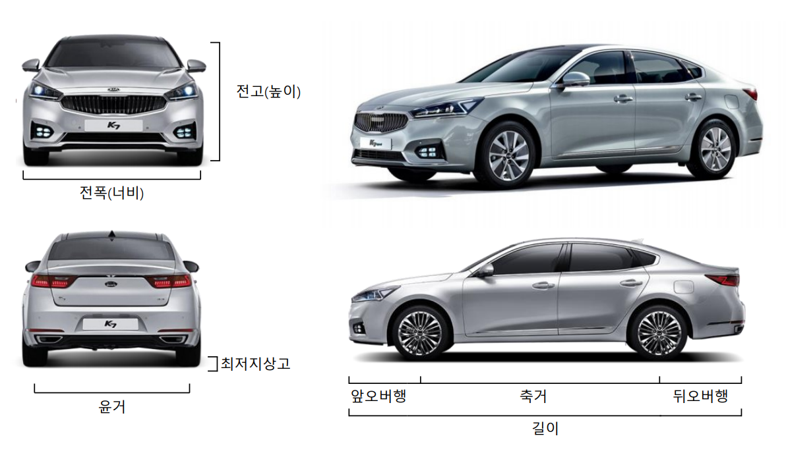

- 자동차의 구조 및 장치가 안전운행에 적합하도록 갖추어야 할 조건으로, 안전기준이나 제원을 법규로 규정하고 있다

- 자동차의 제원은 ISO 등의 국제 기준과 미터법을 바탕으로 전 세계에서 공통으로 통용되는 표준화된 수치로 표기

  - 치수(dimension) 제원
    - 길이 (overall length), 전장 : 차의 중심선을 기준으로 가장 앞으로 튀어나온 부분과 가장 뒤로 튀어나온 부분의 길이
    - 너비 (overall width), 전폭 : 차 중심선에서 차량의 전·후면 좌우의 가장 바깥쪽으로 튀어나온 부분 사이 의 길이, 제원표에 쓰는 너비는 사이드미러를 제외한 차체의 가장 바깥쪽 부분을 기준, 즉 펜더에서 가장 튀어나온 부분 사이의 거리를 지칭
    - 높이 (overall height) 전고 : 차의 중심선에서 위아래 수직 방향으로 타이어의 접지면과 지붕의 가장 높 은 부분의 거리
    - 휠베이스 (wheelbase), 축거 : 바퀴를 정진행 방향으로 똑바로 정렬하고 차체 옆면에서 봤을 때 앞바퀴의 중심과 뒷바퀴의 중심 사이의 거리
    - 트레드/트랙 (tread, track), 윤거 : 트레드는 휠베이스와 마찬가지로 앞바퀴를 정진행 방향으로 고르게 정 렬하고 차의 정면에서 보았을 때 좌우 바퀴 중심 사이의 거리 
    - 최저 지상고 (ground clearance, road clearance) : 타이어의 접지면과 차체 바닥에서 가장 아래로 튀어나 온 부분 사이의 거리
    - 오버행 (overhang) : 차체에서 앞으로 튀어나온 부분과 앞바퀴 중심 사이의 거리 “앞 오버행”, 차체에서 뒤 로 튀어나온 끝부분과 뒷바퀴 중심 사이의 거리
    - 최소 회전반경 (minium turning radius) : 자동차의 핸들을 최대로 회전시킨 상태에서 선회할 때 외측 바 퀴의 접지면 중심이 그리는 원의 반지름
  - 질량(masses)·하중(weight) 제원
    -  차량 중량 (공차 중량, unloaded or empty vehicle weight) : 공차 상태에서의 차량 무게
    - 최대 적재량 (max payload) : 자동차에 적재할 수 있도록 허용된 물품의 최대중량
    - 차량 총중량 (gross vehicle weight) : 자동차의 최대 적재 상태에서의 중량
    - 승차 정원 (riding capacity) : 자동차에 승차할 수 있도록 허용된 최대 인원(운전자를 포함)
    - 최대 접지 압력 (maximum ground contact pressure) : 최대 적재 상태에서 접지 부분에 걸리는 단위 면 적에 대한 무게
  - 성능(performance) 제원
    -  최고 속도 (maximum speed) : 최대 적재 상태에서 자동차가 평단 도로를 주행할 수 있는 최고의 속도
    - 최대 출력 (maximum power) : 단위 시간당 기관이 행할 수 있는 최대 일의 능률 (일률 : 일의 양)
    - 토크 (torque) : 한 중심축에 대해 한 물체를 회전시키는 힘의 물리량으로 회진 모멘트
    - 구동력 (driving force) : 어떤 속도로 주행시킬 때 그 운동 저항을 이기기 위한 힘 
    - 등판 능력 (hill climbing ability) : 최대 적재 상태에서 변속 1단으로 언덕을 올라갈 수 있는 능력
    - 변속비 (transmission gear ratio) : 변속기 입력축과 출력축의 회전수의 비율
    - 총 감속비 (total reduction gear ratio) : 기관의 회전속도와 구동바퀴의 회전속도의 비
    - 정지거리 (stopping distance) : 운전자가 제동조작을 한 순간부터 자동차가 정지할 때까지의 주행한 거리
    - 연료 소비량 (fuel consumption) : 자동차가 일정한 거리를 주행하는 동안 소비하는 연료의 양
    - 연료 소비율 (rate of fuel consumption) : 기관이 단위 시간당 소비하는 연료의 양

- 자동차에 작용하는 주요 힘

  - 자동차에서 오는 힘은 중량에서 온다
    - 차를 밀어내는 동력은 **엔진/모터**에서 나오지만, 타이어가 미끄러지지 않고 도로를 꽉 움켜쥐는 **마찰력의 한계는 차량의 중량(수직으로 누르는 힘)에 비례**
  - **구동력 (Driving Force)**: 엔진이나 모터가 발생시켜 바퀴를 통해 차량을 **앞으로 움직이게 만드는 힘**입니다.
  - **제동력 (Braking Force)**: 브레이크 장치와 타이어 마찰을 통해 차량을 **멈추거나 속도를 줄이는 힘**입니다.
  - **마찰력 및 저항력 (Friction & Resistance)**:
    - **마찰력**: 타이어와 도로 표면 사이의 접지력입니다. 구동력과 제동력이 실제로 작용하려면 이 마찰력이 반드시 바탕이 되어야 합니다.
    - **저항력**: 공기저항

- 핵심 공식

  1. 뉴턴의 운동 제 2법칙 (F = ma)
     - 차가 가속하거나 감속(제동)할 때 필요한 힘의 크기를 결정
  2. 마찰력 공식 (F = μ N)
     - 자동차에서 오는 힘(마찰력)은 중량에서 온다
     - F (마찰력): 바퀴가 미끄러지지 않고 차를 밀거나 멈추게 하는 힘
     - μ (마찰계수): 타이어와 노면 사이의 미끄러움 정도
     - N (수직항력 = 윤하중/축하중): 차가 지면을 누르는 무게(중량)
  3. 운동에너지 공식 (\(E_k = \frac{1}{2}mv^2\))
     - 제동력과 제동거리를 설명할 때 쓰이는 공식
       - 자동차를 멈추려면 차가 가진 운동에너지를 브레이크 열에너지로 모두 바꿔서 소멸시켜야 함
     - m: 차량 질량
     - v: 차량 속도
  4.  토크와 구동력 공식 (\(T = r \times F\))
     - 엔진 회전력이 바퀴 구동력으로 변환되는 공식
       - 엔진에서 나오는 회전력(토크 T)을 타이어 반지름(r)으로 나눈 값이 차를 앞으로 밀어주는 구동력 F가 된다
     - T (토크, Torque): 엔진이나 바퀴 축이 회전하려는 힘
     - F (구동력): 타이어가 지면을 미는 실제 힘
     - r (바퀴 반지름): 타이어의 반지름

- 하중의 단위와 수식 관계(윤하중 · 축하중 · 총중량)

  - **윤하중 (Wheel Load)**: **바퀴 1개**가 지면에 전달하는 하중
  - **축하중 / 축중 (Axle Load)**: 한 차축(양쪽 바퀴)에 걸리는 하중
  - **차량 총중량 (Gross Vehicle Weight)**: **자동차 전체**의 무게
    - 왼쪽 윤하중 + 오른쪽 윤하중 = 축하중(축중)

- 차대번호(VIN)

  - 자동차를 생산하고 나면 그 차량에만 해당하는 17자리의 숫자와 알파벳으로 구성된 식별번호를 부여

    - 연식코드는 30년 주기로 같은 문자·숫자가 순환

      1. **총 30개 기호 사용**: 알파벳 21개(I, O, Q, U, Z 제외) + 숫자 9개(1~9)
      2. **30년마다 순환**: 1년에 1개씩 부여되어 30년 후 동일 기호 반복 (예: `A` = 1980년, 2010년, 2040년)
      3. **연도 구분 방법**: 같은 코드

    - 부품 조회 시 사용되는 위치 약어

      | 약어 | 풀네임           | 의미 (국내 좌핸들 차량 기준) |
      | ---- | ---------------- | ---------------------------- |
      | LHF  | Left Hand Front  | 앞쪽 왼쪽 (운전석 앞)        |
      | RHF  | Right Hand Front | 앞쪽 오른쪽 (조수석 앞)      |
      | LHR  | Left Hand Rear   | 뒤쪽 왼쪽 (운전석 뒤)        |
      | RHR  | Right Hand Rear  | 뒤쪽 오른쪽 (조수석 뒤)      |

  - 전세계적으로 같은 방식으로 사용하여 자동차의 생산국가, 연도, 차종 등에 대한 정보를 담는다

    - 1~3 : 제작회사, 4~9 : 자동차 특성, 10~17 : 제작 일련번호

#### * 구동방식

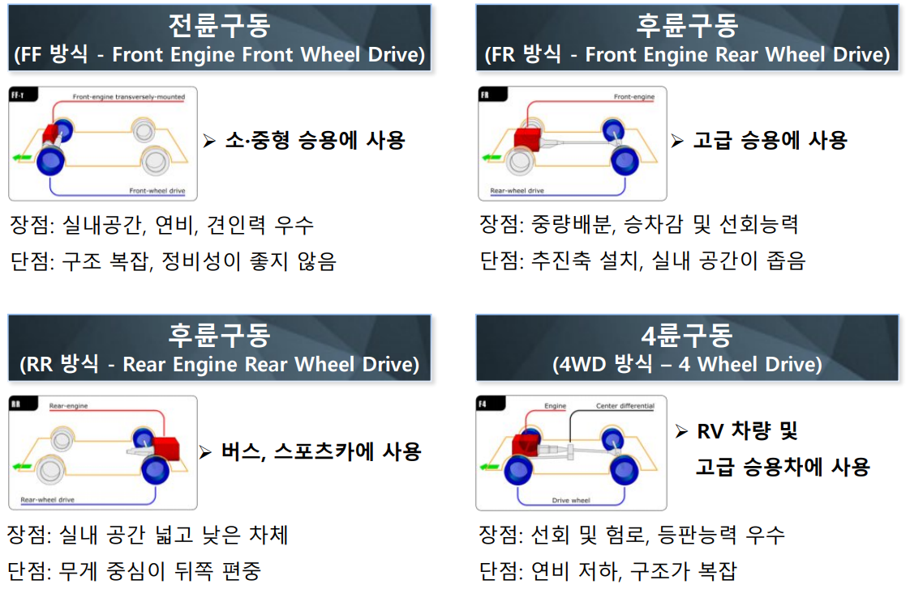

#### * 구조

​	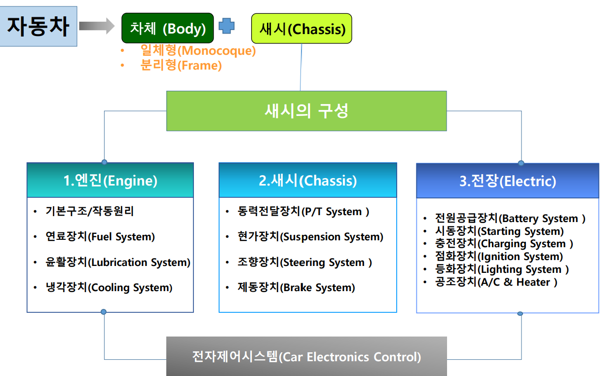

- 자동차 = 차체(Body) + 새시 (Chassis)

  - Body (사람이 탑승하거나 짐을 싣는 외형)

    1. 일체형(Monocoque) : 차체와 뼈대가 하나로 합쳐진 일체구조, 가볍고 충격 흡수가 좋음

       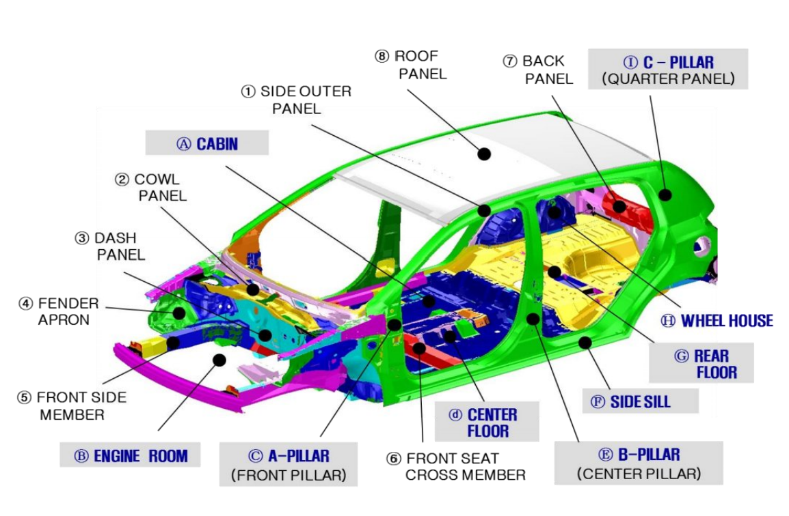

    2. 분리형(Frame) : 튼튼한 철골 뼈대 위에 차체를 얹는 방식, 강성이 뛰어남

  - Chassis (차체를 제외한, 자동차가 달리고 돌고 멈추는 데 필요한 모든 기계·전기 장치의 집합)

    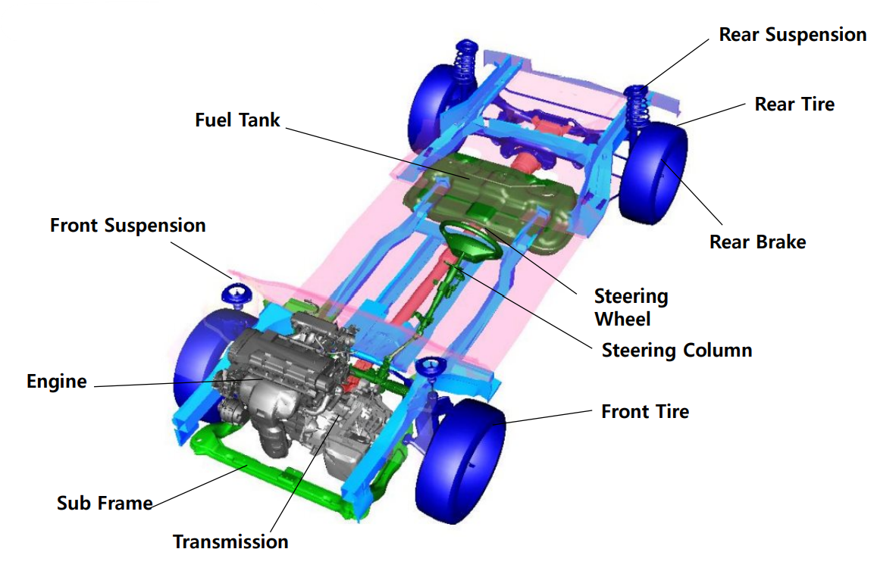

    1. 엔진(Engine) - 동력 발생 장치 (연료를 태워 움직이는 에너지를 만드는 영역)

       - 기본구조 / 작동원리: 피스톤, 크랭크축 등으로 구성되며, 흡기-압축-폭발-배기의 4행정을 통해 회전력을 만듬
       - 연료장치 (Fuel System): 연료를 저장하고 엔진 내부로 적절히 분사해 주는 장치
       - 윤활장치 (Lubrication System): 엔진 내부 부품의 마찰과 마모를 줄이기 위해 엔진오일을 순환시키는 장치
       - 냉각장치 (Cooling System): 엔진 폭발 시 발생하는 강한 열을 식히기 위해 냉각수와 라디에이터를 순환시키는 장치입니다.
       - 4가지 구동방식
         1. HEV (Hybrid Electric Vehicle - 하이브리드)
            - 동력원 : 엔진(내연기관) + 전기모터 + 소형 배터리
            - 주 동력원은 엔진이며, 감속 시 버려지는 에너지(회생제동)로 배터리를 충전해 모터가 엔진을 보조
         2. PHEV (Plug-in Hybrid Electric Vehicle - 플러그인 하이브리드)
            - 동력원 : 엔진(내연기관) + 대용량 전기모터 + 대용량 배터리
            - HEV와 동일하게 엔진과 모터를 모두 쓰지만, **외부 플러그(전원)로 배터리를 직접 충전**할 수 있어 일정 거리를 순수 전기차처럼 주행가능
         3. BEV (Battery Electric Vehicle - 순수 전기차)
            - 전기모터 + 고전압 대용량 배터리 (**엔진 없음**)
            - 엔진과 배기구가 전혀 없으며, 배터리에 충전된 전기에너지로만 모터를 돌려 주행
         4. FCEV (Fuel Cell Electric Vehicle - 수소연료전지차)
            - 동력원 : 수소연료전지 스택 + 수소탱크 + 전기모터 + 배터리 (**엔진 없음**)
            - 충전한 수소와 공기 중의 산소를 반응시켜 **차 내부에서 직접 전기를 생산**하고, 그 전기로 모터를 돌려 주행시 버려지는 에너지(회생제동)로 배터리를 충전해 모터가 엔진을 보조

    2. 새시(Chassis) - 주행 및 운동 기계장치 (엔진에서 만든 힘을 바퀴로 전달, 조종 및 멈춤을 담당하는 기계 파트)

       - 동력전달장치 (Power Train System / PT): 엔진의 회전력을 바퀴까지 전달하는 장치 (클러치, 변속기/미션, 드라이브 샤프트 등)
       - 현가장치 (Suspension System): 노면의 충격을 흡수하여 승차감을 높이고 타이어 접지력을 유지하는 장치 (서스펜션, 쇼크업쇼버, 스프링)
       - 조향장치 (Steering System): 운전자가 핸들(스티어링 휠)을 돌려 진행 방향을 바꾸는 장치
       - 제동장치 (Brake System): 마찰력을 이용해 달리는 차를 멈추거나 속도를 줄이는 장치 (브레이크 패드, 디스크 등)

    3. 전장(Electric) - 전기 및 편의 장치 (차량 내 모든 전기·전자 부품과 편의 기능을 작동시키는 영역)

       - 전원공급장치 (Battery System): 차량에 필요한 전기를 저장하고 공급하는 배터리 장치
       - 시동장치 (Starting System): 시동 모터(스타터 모터)를 돌려 엔진을 처음 켜주는 장치
       - 충전장치 (Charging System): 주행 중 엔진 힘으로 발전기(알터네이터)를 돌려 전기를 생산하고 배터리를 충전하는 장치
       - 점화장치 (Ignition System): 가솔린 엔진에서 혼합기에 불꽃을 튀겨 폭발을 일으키는 장치입니다. (점화플러그 등)
       - 등화장치 (Lighting System): 헤드램프, 방향지시등, 브레이크등 등 각종 조명 장치
       - 공조장치 (A/C & Heater): 실내 온도와 습도를 조절하는 에어컨 및 히터 장치

    4. 전자제어시스템 (Car Electrionics Controls) - 통합제어

       - 컴퓨터(ECU 등)와 각종 센서를 통해 **엔진, 섀시, 전장 시스템 전체를 실시간으로 감지하고 최적의 제어를 위한 값을 계산하여 통제**하는 '자동차의 뇌'에 해당

         - Ex) ABS, 최적 연료 분사 제어 등

       - 인지 -> 판단 -> 제어

         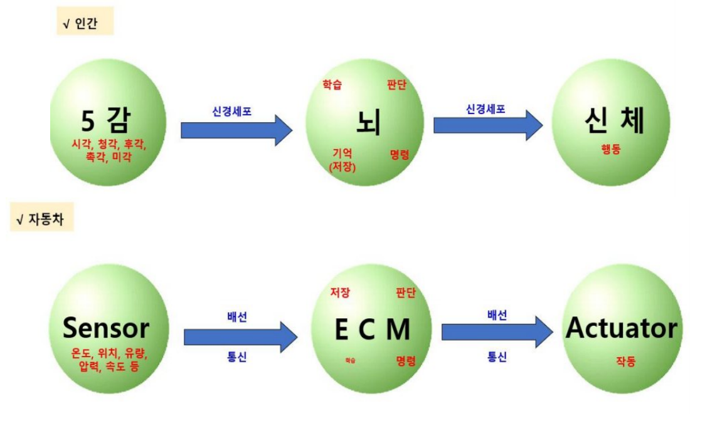

         - 센서는 물리/화학/생물량(아날로그)을 측정하여 전기량(디지털화)으로 변환하는 소자
           - 재료 및 가공기술 + 전자기술 + 광기술 + 제어기술 + 시스템기술

       - 전자제어 엔진 시스템

         - 출력향상 및 유해배스가스 저감을 위해 개발된 장치

         - 연료를 연소실내 직접분사 하는 연소실내 분사방식(GDI)과 흡기 다기관내 연료를 분사하는 흡기 다기관 분사 방식(MPI, SPI)이 있다

           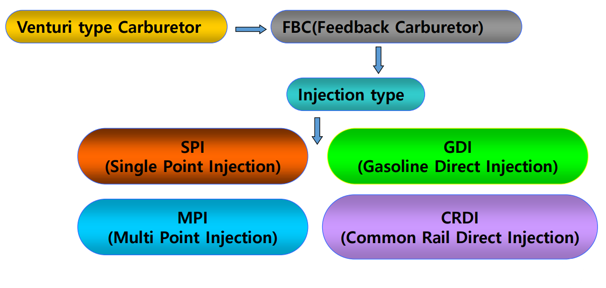

       - 전자제어 새시 시스템

         - 차체의 안전성, 승차감 향상 및 제동 및 조향 시스템과 4WD, 8단 변속 시스템 등 효율적인 동력 전달을 이루기 위해 지속적인 발전을 하고 있다

           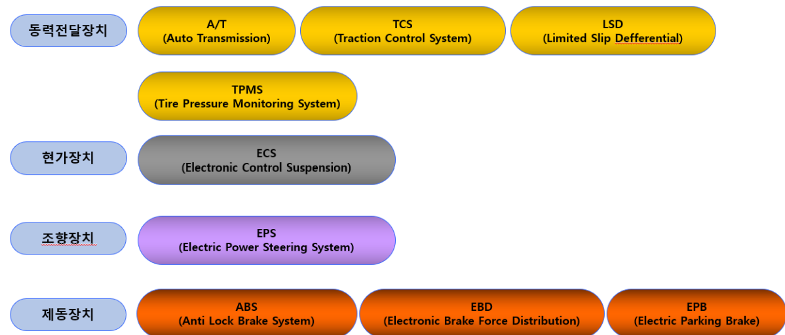

       - 전자제어 전장 시스템

         - 운전자의 편의성 및 안전성을 확보하며 쾌적하고 편리한 자동차 시스템을 구현

         - DIS, 도난방지 시스템, 텔레매틱스, GPS 등 여러 전장 기술의 발달로 더욱 향상되고 진보된 기술 개발로 스마트 시스템을 구축하고 있다

           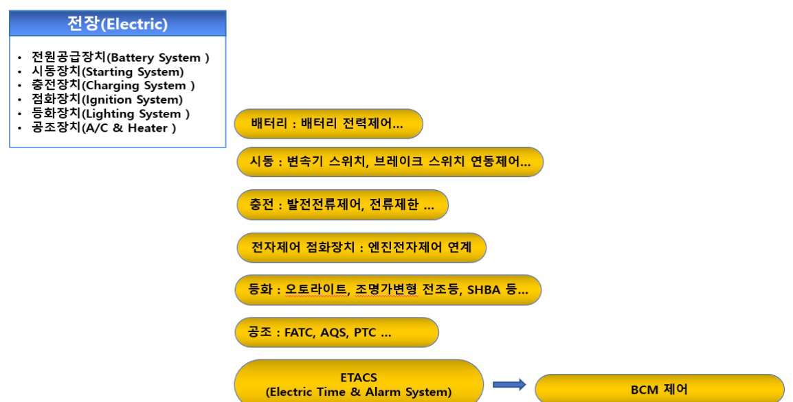

#### * 엔진 전자 제어

- 엔진 전자제어 시스템을 구성하는 입출력 관계 (Sensor -> ECU -> Actuator)

  - 입력 : 엔진 상태 측정 센서
  - 제어 주체(가운데 : 컴퓨터)
  - 출력 : 엔진 제어 항목

  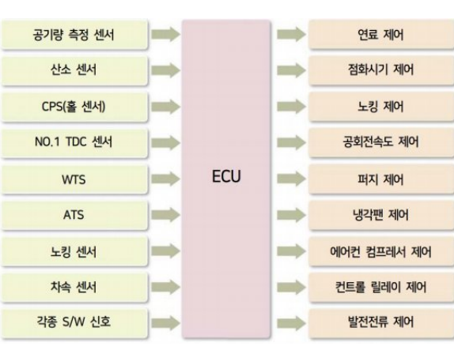

- 엔진 전자제어 센서의 종류와 기능

  - 유량/온도/위치/각도/압력/회전/가스 => 각 센서가 어떤 기능을 수행하는지(무엇을 측정하는지) 나타내고 있다

  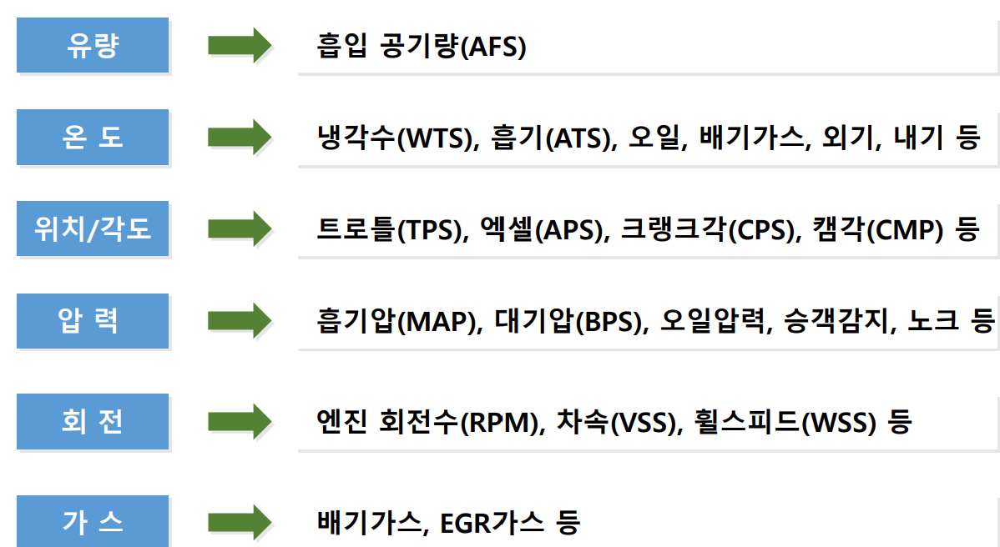

- 스로틀 밸브 개도 센서 (TPS)

  - 운전자가 가속 페달을 밟는 양에 따라 스로틀 밸브가 얼마나 열렸는지(개도율, %)를 측정

  - 가속 페달을 밟으면 축이 회전하면서 센서 내부의 가변저항 값이 변함

    - 밸브가 닫혔을 때 : 낮은 전압 (약 0.5V) -> 공회전 상태 인식
    - 밸브가 열렸을 떄 : 높은 전압 (약4.5V) -> 가속/최대 출력 상태 인식

    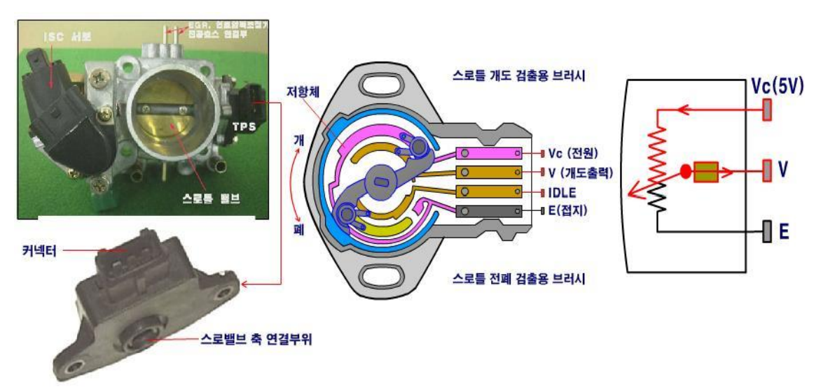

- 맵센서

  - 엔진으로 들어가는 흡기 매니폴드(흡기다기판) 내부의 절대 압력을 측정

    - 공기량을 직접 무게로 재는 AFS와 달리, 맵 센서는 [공기 압력 X 흡기 온도 X 엔진 회전수]를 계산하여 공기가 얼마나 들어왔는지 간접적으로 알아냄(D-제트로닉 방식)

  - 작동 원리

    - 가속 페달을 밟으면 압력이 높아지고, 발을 떼면 진공(낮은 압력) 상태, ECU가 이 압력 변화로 엔진이 얼마나 힘을 쓰고 있는지 파악
    - 센서 내부에 실리콘 칩(피에조 저항 소자)과 진공 방(Chamber)가 들어가 있음
    - 흡기 기판의 압력이 변하면 실리콘 칩이 미세하게 구부러지며 저항값 변함
    - 압력이 낮을 때(진공 상태, 공회전) : 낮은 전압 출력
    - 압력이 높을 때(가속/급가속): 높은 전압 출력

    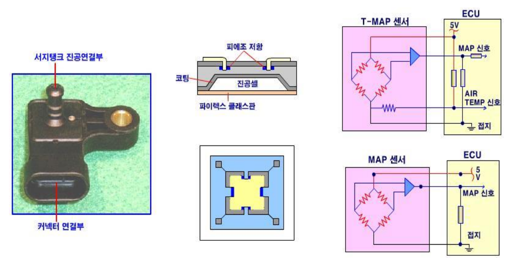

- 열선식, 열막식

  - 엔진으로 들어가는 공기의 무게(질량)를 직접 측정

  - 기본 연료량 제어. 점화시기 결정

  - 작동 원리

    - 센서 내부에 아주 가느다란 백금선이 존재

    - **열 받기**: 컴퓨터(ECU)가 이 백금선에 전류를 흘려 주변 온도보다 항상 약 100~200℃ 더 높게 뜨겁게 달궈 놓음

      **식히기**: 운전자가 엑셀을 밟아 엔진으로 공기가 슉 지나가면, 차가운 공기 때문에 이 뜨거운 백금선이 식게 됨

      **전류 공급**: 백금선이 식으면 저항이 변하므로, ECU는 원래 온도를 유지하기 위해 전류를 더 많이 밀어 넣음

      **신호 변환**: 이때 백금선을 다시 데우기 위해 추가로 들어간 전류의 양(전압 변화)을 측정하여 "공기가 이만큼 많이 들어왔구나!" 하고 공기의 무게를 계산

      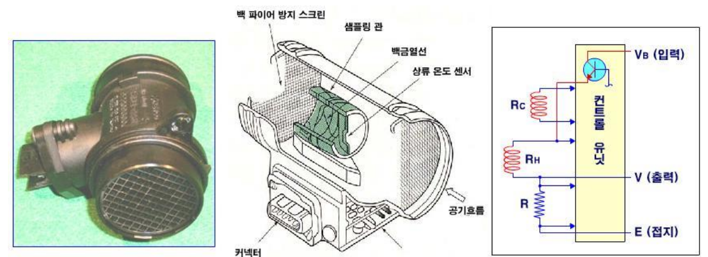

- 냉각수 온도 센서(WTS, ETC)

  - 엔진은 온도에 따라 필요한 연료의 양과 작동 방식이 완전히 다른데, 냉각수 온도 센서가 온도를 전압으로 변환, 연료 보정량 결정, 부특성

- 맵센서

  - 공기량 간접 계측, 피에조 압전효과, 아날로그 형태 신호 발생
  - 진공셀에서
  - 컴퓨터가 V값을 판단으로 연료를 얼마나 쓸지 판단?

- 

1atom = 1.0332 kgf/cm2

빨아들이면 진공 불면 압력

온도센서들은

NTC 부특성 서미스터

온도랑 저항이 비례하면 PTC 반비례하면 NTC

NTC를 온도 측정하는데 많이씀

ATC 

온도가 차가울땐 산소가 많다

뜨거울땐 산소가 적다

온도가 올라가면 저항이 내려간다  -- 5V가 들어오면 -> 1V 아 뜨거워

온도가 내려가면 저항이 올라간다  -- 5V가 들어오면 -> 5V 아 차가워

통합연산장치 제어시스템

ECU, TCU, BCU, ACU, ICU

액츄에이터

요즘에는 뭐가 중요하냐면 (책에 없음) 배선

SBY

BBY

브레이크 패달 밟으면 배선없이 무선 네트워크로 신호전달

노 와이어 (와이어 삭제)

배선을 없애면 공간 확보

ETC시스템은 

#### * 4행정 내연기관 엔진

- 엔진의 기본 구조

  - **Intake valve (흡기 밸브)**: 연료와 공기(혼합기)를 실린더 안으로 들여보냄

  - **Exhaust valve (배기 밸브)**: 연소 후 남은 배아가스를 밖으로 내보냄

  - **Injector (인젝터)**: 연료를 정밀하게 분사

  - **Piston (피스톤)**: 실린더 내부를 위아래로 움직이며 압력을 가하거나 받음

  - **Connecting rod (커넥팅 로드) & Crank shaft (크랭크축)**: 피스톤의 직선 운동을 회전 운동으로 바꾸어 바퀴를 돌림

    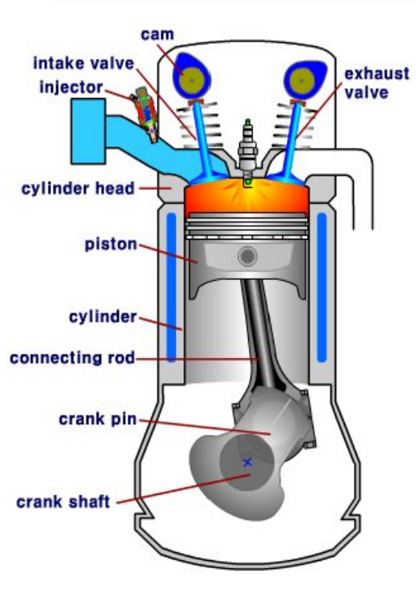

- 4행정 1사이클 - 엔진이 한 번 동력을 얻기 위해 피스톤이 4번 움직이는 과정

  - RPM(분당 회전 수) : 엔진의 크랭크축이 1분 동안 몇 번 회전하는지를 나타내는 단위

    - 실린더 1개 기준, 1사이클동안 크랭크축 2회전 1폭발
      - 2000 RPM일 때 크랭크축이 1분에 2,000번 회전 그리고 한 실린더에서 1,000번의 폭발 일어남
    - 4기통(실린더) 엔진이 2,000RPM으로 돌 때 4,000번 폭발
      - 크랭크축 2회전마다 각 실린더가 번갈아가며 4번 폭발 (회전당 2번 폭발)

  - **흡입행정**: 흡기 밸브가 열리고 피스톤이 내려가면서 혼합기를 빨아들임

    - **밸브 상태**: 흡기 밸브 열림 / 배기 밸브 닫힘
    - **피스톤 이동**: 위(상사점)에서 아래(하사점)로 하강
    - **원리**: 피스톤이 내려가면서 실린더 내부 압력이 낮아져(진공 상태), 신선한 공기와 연료(혼합기)를 내부로 빨아들이는 단계

  - **압축행정**: 밸브가 모두 닫히고 피스톤이 올라가며 혼합기를 강하게 압축

    - **밸브 상태**: 흡기 밸브 닫힘 / 배기 밸브 닫힘 (모두 밀봉)
    - **피스톤 이동**: 아래에서 위로 상승
    - **원리**: 들어온 혼합기를 강하게 압축합니다. 압축된 가스는 온도가 급격히 올라가 밀도가 높아지며, 폭발하기 최적의 상태가 됨

  - **동력행정 (폭발)**: 연료가 폭발(점화)하면서 그 힘으로 피스톤을 강하게 밀어내려 동력을 만듬

    - **밸브 상태**: 흡기 밸브 닫힘 / 배기 밸브 닫힘 (모두 밀봉)
    - **피스톤 이동**: 위에서 아래로 강하게 하강
    - **원리**: 압축된 가스에 불꽃을 튀기거나(가솔린) 자체 발화(디젤)시켜 폭발을 일으킴. 이 연소 가스의 엄청난 팽창 압력이 피스톤을 아래로 밀어내며, 실제 자동차를 움직이는 회전 동력을 만들어 냄

  - **배기행정**: 배기 밸브가 열리고 피스톤이 다시 올라가며 타버린 가스를 밀어냄

    - **밸브 상태**: 흡기 밸브 닫힘 / 배기 밸브 열림
    - **피스톤 이동**: 아래에서 위로 상승
    - **원리**: 역할을 다하고 남은 뜨거운 연소 가스(배기가스)를 피스톤이 위로 올라가면서 밀어내어 머플러(배기구) 밖으로 배출

    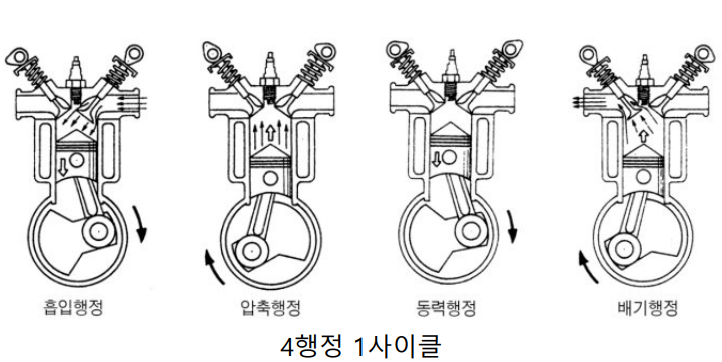

- 압력(P)-부피(V) 변화 그래프

  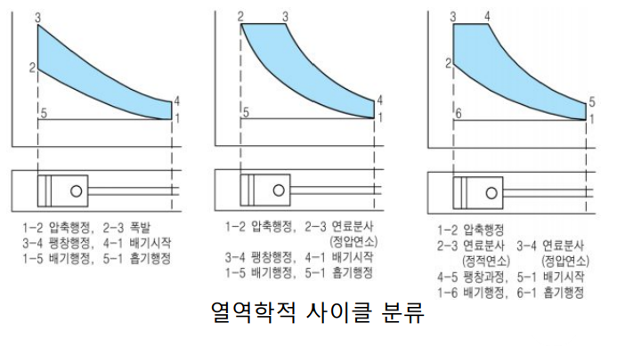

  - **첫 번째 그래프 (오토 사이클 / 가솔린 엔진)**
    - 혼합기를 압축한 뒤 불꽃을 튀겨 순간적으로 폭발(정적 연소)시키는 방식
  - **두 번째 그래프 (디젤 사이클 / 디젤 엔진)**
    - 공기만 압축해 뜨거워진 상태에서 연료를 분사하여 일정한 압력을 유지하며 연소(정압 연소)시키는 방식
  - **세 번째 그래프 (사바테 사이클 / 복합 사이클)**
    - 현대 고속 디젤 엔진에서 주로 쓰이며, 정적 연소와 정압 연소가 혼합된 형태

위에 피스톤은 직선운동

밑에 커넥팅 로드는 회전운동

위에서 아래로 동력이 전달된다

직선운동이 회전운동으로? 회전운동이 직선운동으로?

크랭크축 - 측면에 압력이 발생하는데 그걸 막기위해서....

윤활 

1.마찰계수가 낮아져서 유체마찰로 만들어서 재료가 마찰로 인해서 마모가 되거나 성능저하 되는 것을 막는 윤활의 목적 (부식방지, 마찰계수 낮추기, 마모막기)

2.작동유 : 에너지 목적 (브레이크,)

감마 작용 :마찰을 낮춰주는

방청 작용 : 녹이 덜 생김 

응력 분산 작용 : 집중해서 힘을 받았을 때 액체가 그 힘을 먹어서 상쇄시킴 (p25)

기름의 성질() 오일이 가지고 있는 특성(점도, )

- 

#### * 엔진 냉각 시스템

- 작동중인 엔진의 동력 행정에서 발생되는 열(1,500 ~ 2,000℃)을 냉각시켜 엔진의 온도를 알맞게 유지시키는 장치

- 엔진의 정상적인 온도는 75 ~ 85℃

  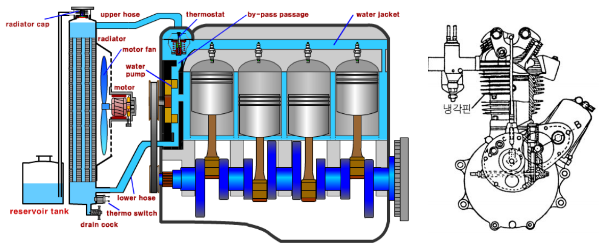

- 라디에이터(RADIATOR)

  - 실린더 헤드 및 블록에서 뜨거워진 냉각수가 라디에이터 위 탱크로 들어오면 튜브를 통하여 아래 탱크로 흐르는 동안 자동차의 주행속도와 냉각 팬에 의하여 유입되는 대기와의 열 교환이 냉각핀에서 이루어져 냉각된다

    - 위탱크와 아래탱크의 온도차이는 최대 4 ~ 6℃

    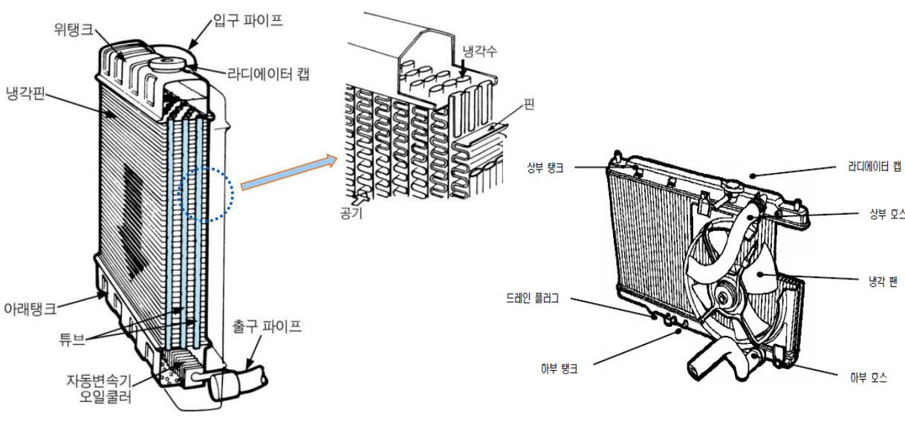

  - 라디에이터 캡은 냉각수 주입구 뚜껑이며, 냉각장치 내의 비등점(비점)을 높이고, 냉각 범위를 넓히기 위하여 압력식 캡을 사용한다

    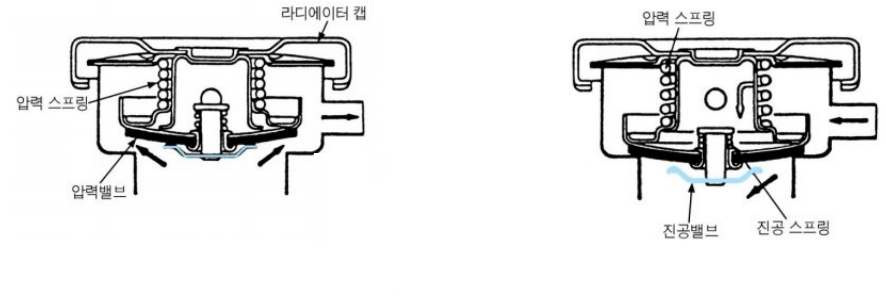

- 물펌프

  - 크랭크축에 의해 구동되며, 실린더 헤드 및 블록의 물 재킷 내로 냉각수를 순환시키는 원심력 펌프

  - 라디에이터에서 식은 냉각수를 강한 힘으로 빨아들여 엔진 구석구석으로 끊임없이 순환시켜 주는 냉각 시스템의 심장 역할

  - 엔진 블록 앞쪽에 장착되어 있음

    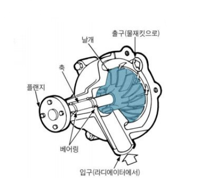

- 수온조절기 (THERMOSTAT)

  - 실린더 헤드 물 재킷 출구 부분에 설치되어, 냉각수의 온도에 따라 냉각수 통로를 개폐하여 엔진의 온도를 알맞게 유지하는 기구

  - 냉각수의 온도가 차가울 때는 수온조절기가 닫혀서 라디에이터쪽으로 냉각수가 흐르지 못하게 하고, 냉각수가 가열되면 점차 열리기 시작하여 정상 온도가 되면 완전히 열려 냉각수가 라디에이터로 순환된다

    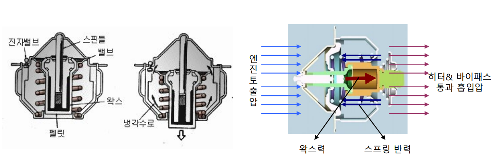

#### * 엔진 연료 시스템(ENGINE FUEL SYSTEM)

- 연료시스템은 기본적으로 연료탱크, 연료 펌프, 연료 여과기, 연료 분사기, 연료 파이프 등으로 구성되며 공기와 연료의 혼합비(공기 + 연료의 비율)를 엔진 운전 상태에 알맞게 ECM으로 정밀제어 공급하는 장치

  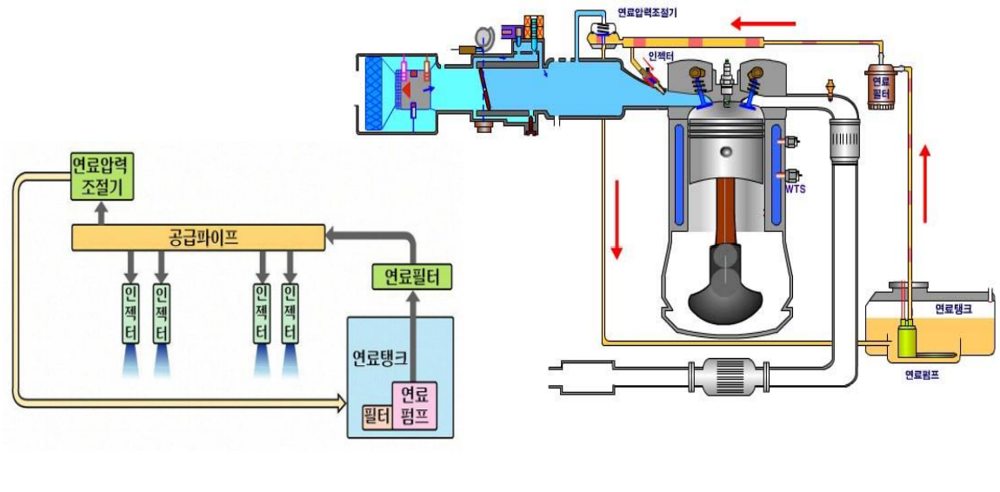

- 연료 탱크 및 펌프

  - 연료탱크는 승용창의 경우 일반적으로 후석 하단에 장착되며 연료잔량 표시장치, 증발가스 제어장치 및 연료펌프 등이 조립된다

  - 연료펌프는 전동식으로 연료 탱크 내에 설치되어 있으며, 연료를 인젝터로 압송한다

    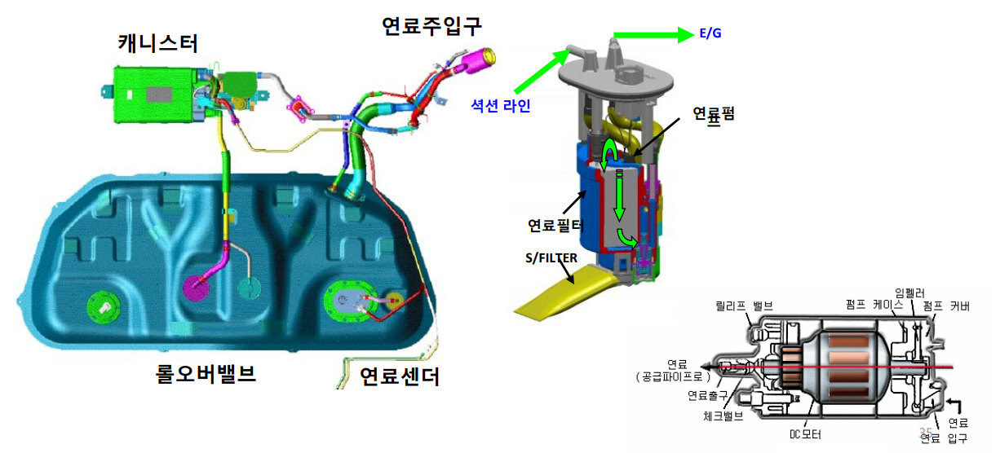

- 인젝터(INJECTOR)

  - 연료 펌프로부터 압송된 연료를 연소실 또는 흡기라인에 정밀 분사하여 운전 조건에 맞는 공연비를 구현하며 엔진 요소를 최적화한다.

    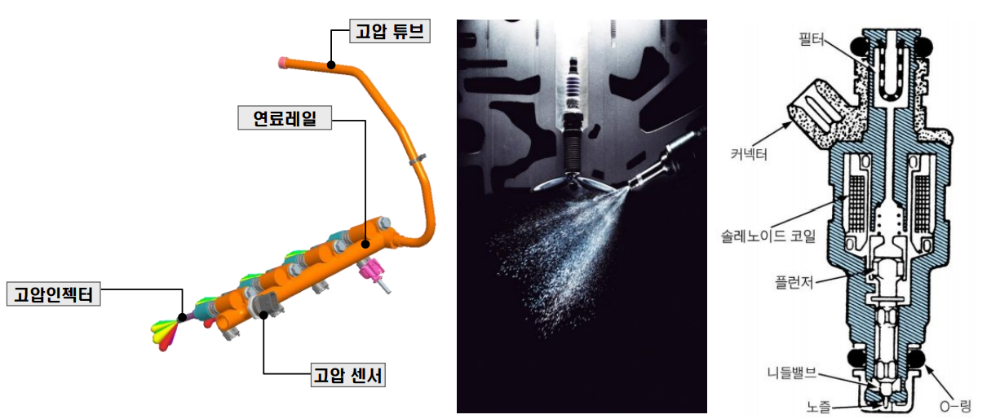

- 연료 압력 조절기(FUEL PRESSURE REGULATOR)

  - 연료 계통 내의 압력을 조절해주는 장치로서 분배 파이프 앞 끝에 설치되어 있음

  - 연료 계통 내의 압력을 2∼3㎏f/cm²로 유지시켜 주는 다이어프램 조절의 오버 플로형식

    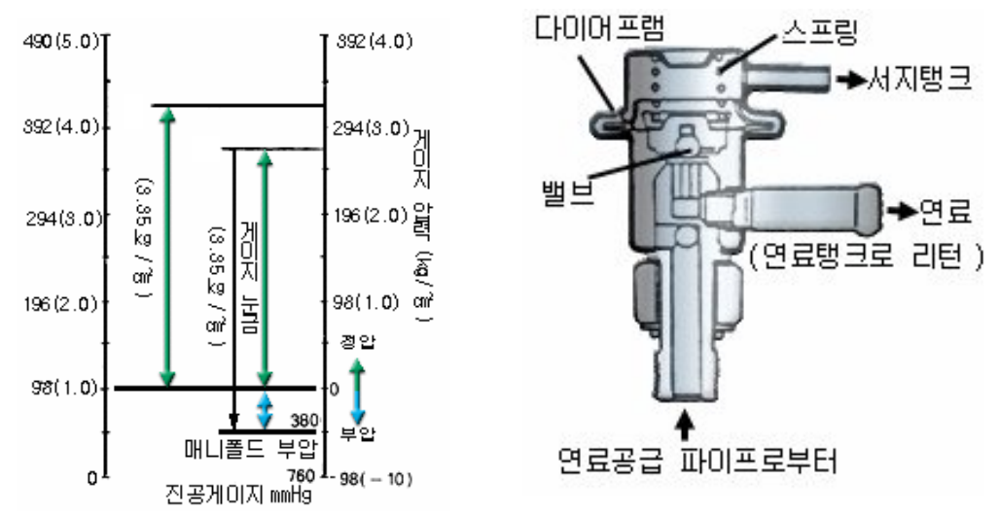

#### * 배출가스 제어 시스템

- 자동차에서 배출되는 가스는 배기 파이프로부터의 배기가스, 엔진 크랭크 실로부터의 블로 바이 가스(blow-by gas), 연료 탱크와 연료 공급 계통에서 증발하는 증발 가스 등 3가지가 존재

  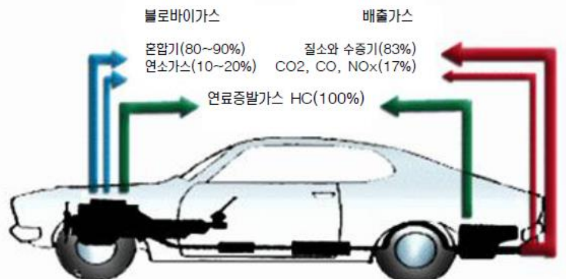

- 유해배출가스의 주성분은 일산화탄소(CO), 탄화수소(HC), 질소산화물(NOx), 납산화물, 탄소입자 등

  - 이 중에서 일산화탄소, 질소산화물, 탄화수소가 인체에 해로운 유해 물질로 분류

- 블로우 바이 가스는 실린더와 피스톤 간극에서 미연소 가스가 크랭크 실(crank case)로 빠져 나오는 가스

  - 주로 탄화수소이고 나머지가 연소가스 및 부분 산화된 혼합가스

    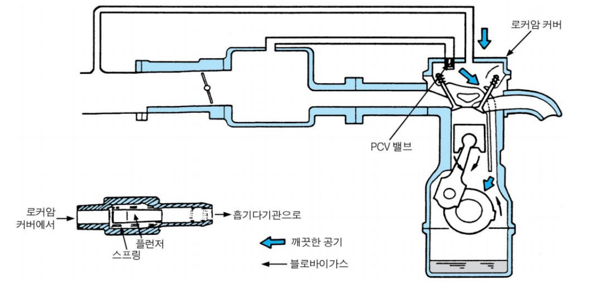

- 연료 증발 가스는 연료 탱크나 연료 계통 등에서 가솔린이 증발하여 대기 중으로 방출되는 가스

  - 미연소 가스로 주성분은 탄화수소(HC)

    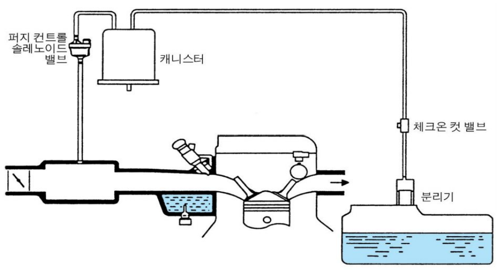

- 

p159

#### * 기초전기

- 전기란 물질 내 전자의 이동으로 생기는 에너지의 한 형태

- 옴의 법칙

  - 전기회로를 흐르는 전압, 전류 및 저항 사이의 관계

  - 도체를 흐르는 전류는 도체에 가해진 전압에 비례하고, 그 도체의 저항에 반비례

    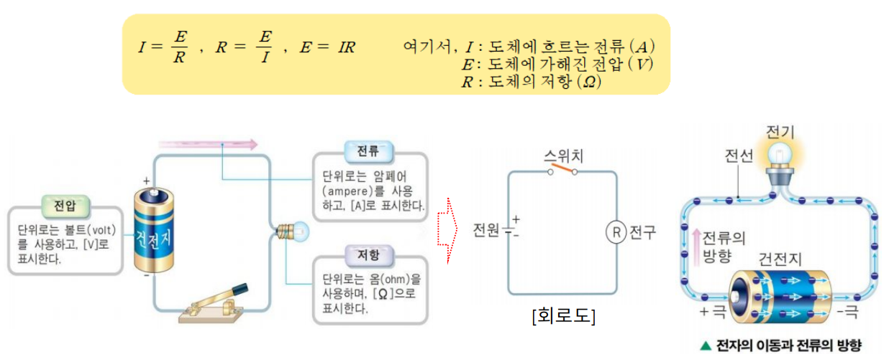

- 전압

  - 도체에 전류를 흐르게 하는 전기적인 압력으로 정의(전위차)

    - 전압은 높은곳에서 낮은 곳으로 흐르며 저항에 의해 전압 강하가 일어남
    - Ex) 12V battery = (+) 12V, (-) 0V [ground] : 전위차는 12V

  - 단위 : V(볼트)

  - 기전력(E) : 전하를 이동시켜 끊임없이 발생되는 전기적인 압력이라 하며, 기전력을 발생시켜 전류원이 되는 것을 전원이라 한다

  - 1V : 1Ω의 도체에 1A의 전류를 흐르게 할 수 있는 전기적인 압력 (전류를 보내는 힘)

    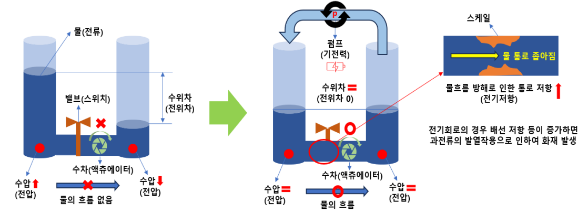

- 전류

  - 1초 동안에 어떤 도체의 단위면적을 통과하는 전하량으로 정의

  - 단위 : A(암페어)

  - 종류

    - 직류 : 일정한 크기를 갖고 한 방향으로 흐르는 전류
    - 교류 : 흐르는 방향과 크기가 시간에 따라 주기적으로 변화하는 전류
      - Ex) 60Hz라고 한다면, 1초에 +-가 60번이 바뀐다?
    - 맥류 : 교류를 직류로 정류할 경우 발생하는 전류형태

  - 전류의 작용

    - 발열작용 : 저항이 큰 물체에 전류가 흐르면 발열이 발생한다. 

      - 전자가 빠른 속도로 도체를 통과 하면서 도체의 분자와 충돌하여 운동E -> 열E로 변환
      - (Ex.) 전열기, 열선, 시가라이터 등

    - 자기작용 : 전선이나 코일에 전류를 흘리면 자장이 형성된다.

      - (Ex.) 전동기, 발전기, 솔레노이드 등

    - 화학작용 : 전해액에 전류가 흐르면 화학작용이 발생한다.

      - (Ex.) 배터리, 전기도금 등

      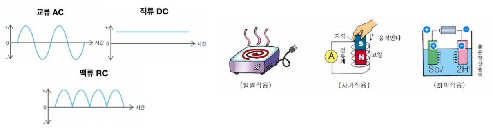

- 저항

  - 전류가 물질 속을 흐를 때 그 흐름을 방해하는 것을 저항으로 정의
  - 단위 : Ω(옴)
  - 1Ω : 도체에 1A의 전류를 흐르게 할 때 1V의 전압을 필요로 하는 도체의 저항
  - 도체의 재질과 형상에 의한 저항
    - 도체의 저항은 그 길이에 비례하고 단면적에는 반비례
      - 도체의 길이가 길면 저항이 증가, 길이가 짧으면 저항이 감소
      - 도체의 단면적이 크면 저항이 감소, 단면적이 작으면 저항이 증가
      - 물질의 고유저항 : 길이 1m, 단면적 1m²인 도체 두면간의 저항값을 비교하여 나타 낸 비저항을 고유 저항
  - 저항을 사용하는 목적
    - 저항은 전기 회로에서 전압 강하를 위하여 사용
    - 회로에서 부품에 알맞은 전압으로 강하시키기 위해서 사용
    - 부품에 흐르는 전류를 감소시키기 위해서 사용
    - 변동되는 전압이나 전류를 얻기 위해서 사용

- 자동차의 전원은 직류전원이지만 단선식을 사용

  - 교류는 단선식, 직류는 복선식 배선
  - 차체접지

시동 걸기전은 배터리 전압 배터리 전류

시동 건 후에는 발전기 전압?

- Switch, Fuse, Relay
  - Fuse는 과전압으로부터 회로를 보호
  - 릴레이 => 스위치보호
- 상시전원은 fuse, realy없고 스위치만 있다
  - 비상등, 브레이크등

p164 자동차전원 -> key box

- keyBox

전원이 공급되는 위치?

OFF - LOCK  핸들잠김

ACC - AV시스템에만 전원

ON 컴퓨터에 전기가 켜진다 (버튼 시동키)

ST - 모터를 작동시킨다

p167

배터리가 시동걸기전에는 부하로

시동걸면 Alt 배터리인데

여기에서 만드는 전기는 교류 13.5V ~14.5V 로 다이오드를 통해서 직류로 바뀌어(정류) 충전시작

충전되는 전기가 배터리로 갔다가 부하로

시동걸기 전에는 배터리

시동걸면 발전기가 돌면서 배터리충전

시동걸기전에는 12.6V

전자제어 시스템은 5V로 작동 (묻따 전세계 통일) 13.5~14.5들어가면 아날로그가됨 2진법 하기위해 5V로작동

IC를 통해서 5V로 교정

센서는 저항 -> 센서로 보내는 전압 통제

센서는 기본적으로 배선이 3개

1번 E로 가는 배선하나 2번 접지 선 3번 전원선?