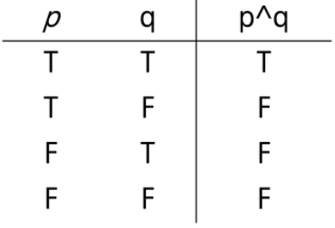
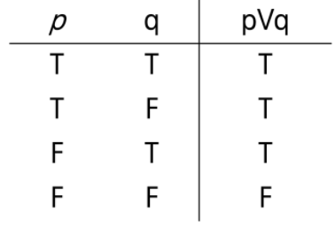
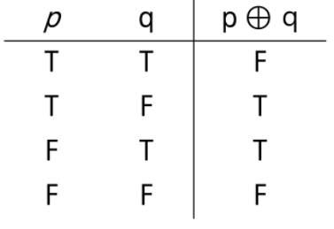
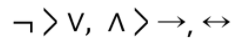
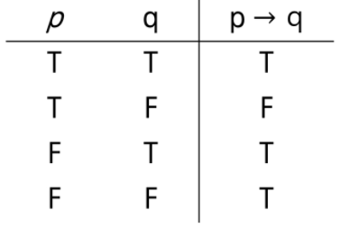
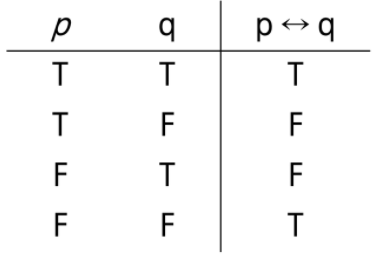

## Logic

##### * Soft Logic(직관)

- 논리적인 느낌을 주는 것
- (익숙한 상황에서) 빠르다
  - 일상 생활에서 유용
  - 논리적으로 부정확한 표현을 사용, 어떤 의미인지 모든 사람이 알고 있다는 가정이 존재
- 정확X (익숙한 상황에서 틀리는 경우도 존재)
- 강한 착각을 일으킨다


##### * Hard Logic(논리)

- 프로그래밍에서 사용
  - 프로그래밍 언어의 표현들이 논리학에서 파생됨
- 알고리즘을 이해하기 위해서는 Hard Logic이 필요


## 명제

- 참이나 거짓을 알 수 있는 식이나 문장
- p, q, r 등으로 표현


##### * 진릿값(결과값)

- 참이나 거짓을 표현
- T, F 또는 1, 0


##### * 진리표

명제를 연산하였을 떄,  진릿값에 따라 얻을 수 있는 가능한 모든 진릿값을 표로 나타낸 것


#### 1.연산(결합)

##### * 부정 NOT

- p가 명제일 때, 명제의 진릿값이 반대

- ~p 또는 ㄱp로 표기 (not p 또는 p의 부정으로 읽는다)

  | p    | ~p   |
  | ---- | ---- |
  | T    | F    |
  | F    | T    |

  

##### * 논리곱AND

- p, q가 명제일 때,  p, q 모두 참일 때만 참이 되는 명제

- p and q , p 그리고 q

  


##### * 논리합 OR

- p, q가 명제일 때, p, q모두 거짓일 때만 거짓이 되는 명제

- p or q, p 또는 q

  


##### * 베타적 논리합XOR

- p, q가 명제일 때, p, q중 하나만 참일 때 참이 되는 명제

- p xor q

  


#### 2. 합성

- 연산자 우선 순위

  

- 항진명제 : 진릿값이 항상 참
- 모순명제 : 진릿값이 항상 거짓
- 사건명제 : 항진명제도 모순명제도 아닌 명제

##### * 조건명제

- p, q가 명제일 때, 명제 p가 조건(또는 원인), q가 결론(또는 결과)로 제시되는 명제

- p -> q (p이면 q이다.)

  ```
  ex) 오늘 비가 오면 수업하지 않는다
  p : 오늘 비가 온다
  q : 수업하지 않는다
  p->q의 진리표는 p가 참일 때는 q가 참이냐, 거짓이냐에 따라 참, 거짓이 결정
  그러나 p가 거짓일 때는 어떻게 하겠다는 말은 없다
  그러므로 p가 거짓일 때는 q의 참, 거짓에 관계없이 p->q는 참이다.
  ```

  

##### * 역, 이, 대우

- 역 :  가정과 결론의 위치를 바꾼다

- 이 : 가정과 결론을 부정한다

- 가정과 결론을 부정하고 위치를 바꾼다

  | p    | q    | p->q | q->p(역) | ~p -> ~q(이) | ~q -> ~p(대우) |
  | ---- | ---- | ---- | -------- | ------------ | -------------- |
  | T    | T    | T    | T        | T            | T              |
  | T    | F    | F    | T        | T            | F              |
  | F    | T    | T    | F        | F            | T              |
  | F    | F    | T    | T        | T            | T              |

  

##### * 쌍방조건명제

- p, q가 명제일 때, 명제 p와 q가 모두 조건이면서 결론인 명제

- p <->q (p면 q고, q면 p다)

- 두 조건이 같은 결과값일 때 참인 결과가 나온다

  
