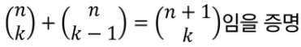

## 논리와 증명

### Logic

##### * Soft Logic(직관)

- 논리적인 느낌을 주는 것
- (익숙한 상황에서) 빠르다
  - 일상 생활에서 유용
  - 논리적으로 부정확한 표현을 사용, 어떤 의미인지 모든 사람이 알고 있다는 가정이 존재
- 정확X (익숙한 상황에서 틀리는 경우도 존재)
- 강한 착각을 일으킨다


##### * Hard Logic(논리)

- 프로그래밍에서 사용
  - 프로그래밍 언어의 표현들이 논리학에서 파생됨
- 알고리즘을 이해하기 위해서는 Hard Logic이 필요


### 증명

##### * 명제

- 참이나 거짓을 알 수 있는 식이나 문장
- p, q, r 등으로 표현


##### * 진릿값(결과값)

- 참이나 거짓을 표현
- T, F 또는 1, 0


##### * 진리표

명제를 연산하였을 떄,  진릿값에 따라 얻을 수 있는 가능한 모든 진릿값을 표로 나타낸 것


##### 1.연산(결합)

##### * 부정 NOT

- p가 명제일 때, 명제의 진릿값이 반대

- ~p 또는 ㄱp로 표기 (not p 또는 p의 부정으로 읽는다)

  | p    | ~p   |
  | ---- | ---- |
  | T    | F    |
  | F    | T    |

  

##### * 논리곱AND

- p, q가 명제일 때,  p, q 모두 참일 때만 참이 되는 명제

- p and q , p 그리고 q

  

##### * 논리합 OR

- p, q가 명제일 때, p, q모두 거짓일 때만 거짓이 되는 명제

- p or q, p 또는 q

  

##### * 베타적 논리합XOR

- p, q가 명제일 때, p, q중 하나만 참일 때 참이 되는 명제

- p xor q

  


##### 2. 합성

- 연산자 우선 순위

  

- 항진명제 : 진릿값이 항상 참
- 모순명제 : 진릿값이 항상 거짓
- 사건명제 : 항진명제도 모순명제도 아닌 명제

##### * 조건명제

- p, q가 명제일 때, 명제 p가 조건(또는 원인), q가 결론(또는 결과)로 제시되는 명제

- p -> q (p이면 q이다.)

  ```
  ex) 오늘 비가 오면 수업하지 않는다
  p : 오늘 비가 온다
  q : 수업하지 않는다
  p->q의 진리표는 p가 참일 때는 q가 참이냐, 거짓이냐에 따라 참, 거짓이 결정
  그러나 p가 거짓일 때는 어떻게 하겠다는 말은 없다
  그러므로 p가 거짓일 때는 q의 참, 거짓에 관계없이 p->q는 참이다.
  ```

  

##### * 역, 이, 대우

- 역 :  가정과 결론의 위치를 바꾼다

- 이 : 가정과 결론을 부정한다

- 대우 : 가정과 결론을 부정하고 위치를 바꾼다

  - 명제가 참이면 명제의 대우도 참이다
    - 명제의 역이 참이라면 명제의 이도 참이다 (대우관계)
  - 명제의 역, 이는 참일수도 있고 거짓일 수도 있다

  | p    | q    | p->q | q->p(역) | ~p -> ~q(이) | ~q -> ~p(대우) |
  | ---- | ---- | ---- | -------- | ------------ | -------------- |
  | T    | T    | T    | T        | T            | T              |
  | T    | F    | F    | T        | T            | F              |
  | F    | T    | T    | F        | F            | T              |
  | F    | F    | T    | T        | T            | T              |

  

##### * 쌍방조건명제

- p, q가 명제일 때, 명제 p와 q가 모두 조건이면서 결론인 명제

- p <->q (p면 q고, q면 p다)

- 두 조건이 같은 결과값일 때 참인 결과가 나온다

  


## 수와 표현

- 컴퓨터는 0과 1을 표현할 수 있는 비트들을 모아 수를 표현한다
- k개의 비트를 사용하면 0 ~ 2^(k-1) 표현 가능
  - 10진수로 k자리를 쓰면 0 ~ 10^(k-1) 표현이 가능한 것과 동일
  - 어떤 값 n을 표현하기 위해서는 몇 개의 비트가 필요할까?
    - 2^(k-1) >= n이 성립해야한다
    - k >= log(n+1)


- 위의 식에서 log n의 뜻(밑이 2, 컴퓨터분야에서 log의 밑은 항상 2)
  - 2의 몇 승이 n이 되는지
  - n을 표현하는데 비트가 (log n)+1개 필요하다
  - 1로 시작해서 계속 두 배를 할 때 몇 번 하면 n이 되느냐의 답
    - 2를 log n번 곱하면 n이 된다
  - n을 2로 계속 나눌 때 몇 번 나누면 거의 1이 되느냐에 대한 답
    - n을 2로 log n번 나누면 1이 된다

- 다음 두 식의 항의 개수는 log n개

  - n을 1이 될 때까지 2로 계속 나누기 때문 : log n
  - [nlog n](https://ko.khanacademy.org/computing/computer-science/algorithms/merge-sort/a/analysis-of-merge-sort)

  


## 집합과 조합론

- 두 집합 A, B에 대해 "**A가 B의 부분집합**"임을 증명한다는 것은 "**A의 임의의 원소가 B에 포함됨**"을 보이는 것과 같다

- 두 집합 A, B가 같다는 것은 A가 B의 부분집합 and B가 A의 부분집합이라는 뜻이다

  ex)두 집합이 같다는 것을 증명

  ``` 
  A = {x|x=2K+1, k는 자연수}, B = {x|x=4k+1 혹은 x=4k+3, k는 자연수}
  A가 B의 부분집합
  	A에 포함되는 임의의 원소 x를 지정
  	x = 2k+1 (k가 짝수 2t, 홀수 2t+1인 경우 생각)
  	짝수인 경우 x = 2(2t)+1 = 4t+1
  	홀수인 경우 x = 2(2t+1)+1 = 4t+3 모든 가능한 경우에 x는 B에 포함
  B가 A의 부분집합
  	B에 포함되는 임의의 원소 x를 가정
  	x = 4k+1인경우, x = 2(2k)+1
  	x = 4k+3인경우, x = 2(2k+1)+1
      모든 가능한 경우에 x는 B에 포함
  위의 두 증명에서 집합 A와 B는 같다

- 조합론은 경우의 수를 따지는 문제들

  - 조합 : 서로 다른 n개에서 순서를 생각하지 않고 r개를 택하는 것

    

- 조합의 개수 표현방법 : C, 괄호

  

- ex)

  1. 
     - 

  2. 

     - 

  3. n개의 원소를 가진 집합의 가능한 부분집합의 종류는 2^n개임을 증명

     - 

  4. 

     - 귀류법 : 어떤 명제가 참임을 증명하려 할 때 그 명제의 결론을 부정하여 모순을 이끌어 내어 그 명제가 성립함을 증명하는 방법 (명제의 대우)

     - 

  5. 
     - 

  6. 8 * 8 체스 판에 말 두개를 놓으려고 한다. 아무 곳에나 놓아도 되지만 한 칸에 두 개가 들어가지는 못한다. 가능한 방법은 모두 몇가지인가?

     - 

  7. 52개의 카드를 이용해서 만들 수 있는 5개의 카드 조합의 수

     

  8. 52개의 카드를 이용해서 5개의 카드 조합 중 같은 무늬의 카드가 정확히 3개인 경우

     - 

  9. x+y+z=100의 자연수 해는 몇가지인가?

     - 100개에 대해 x와 y의 경계, y와 z의 경계를 결정하는 문제

       

## 기초 수식

- 구현한 알고리즘이 어느정도의 복잡도를 가지고 있는지 파악하는데 이용
  - 알고리즘의 시간 복잡도를 표현할 수 있는 다양한 수식들이 존재

- 풀이법을 익혀 두어야 알고리즘의 시간 복잡도를 계산이 가능

- 재귀식을 O notation으로 표기해라

  - 빅오 표기법 : 알고리즘의 최대로 걸리는(최악의) 시간 복잡도
    - 계수와 상수 무시 (n이 클 때 무시할 수 있음)

  1. T(n) = T(n-1) + 1

     

  2. T(n) = T(n-1) + n

     

  3. T(n) = T(n-1) + log n

     

  4. T(n) = T(n/2) + 1

     - 이진탐색의 걸리는 시간을 재귀형태로 표현

     - 1의 갯수 : 1+1/2+1/4+...+1/n (1에서 2를 몇번 곱해야 n이 될지 생각)

       - 2^logn = n^log2 = n

       

     

  5. T(n) = T(n/2) + n

     

  6. T(n) = 2T(n/2) + n

     - 병합정렬

     

  7. T(n) = 3(T/3) + n

     


## 재귀

- 자기 자신을 호출하는 함수
  - 함수는 어떤 문제를 해결하는 방법을 코딩한 것
  - 함수는 어떤 문제의 단 한 케이스만을 해결하는 것이 아님
- 함수는 입력이 있으며, 자기 자신의 입력과 동일한 입력으로 자기 자신을 호출하면 당연히 끝나지 않는다
  - 특정한 입력으로 호출하면 끝날 수 있음

- 수학적 귀납법(수열을 이웃하는 항들 사이의 관계식으로 정의) 증명 사용 가능

  1. P(1)이 참이여야 한다.

  2. n-1에서 문제를 풀 수 있으면 n에서도 문제를 풀 수 있다
     - P(n-1) -> P(n)
     - [P(n-1)은 참이여야 한다](https://blog.naver.com/zbqmgldjfh/222283440690)
  3. P(n)은 모든 자연수에 대해서 참이다

- 다음과 같은 알고리즘에서 swap의 최대 횟수를 구하여라

  ```
  Stupid(A[0..n-1])
  {
  	if n=2 and A[0]>A[1]
  		then swap A[0] and A[1]
  	else
  		m = ceiling(2n/3)
  		Stupid(A[0..m-1])
  		Stupid(A[n-m..n-1])
  		Stupid(A[0..m-1])
  }
  ```

  


## 동적 프로그래밍

- 재귀 함수에서 동일한 입력의 함수 호출이 반복적으로 일어날 때 그 결과 값을 저장해 두고 불러 쓰는 것(Memoization)
- 입력에서 파생되는 답들을 모두 저장할 수 있는 메모리가 존재해야 한다.
- 재귀에서 저장된 값을 찾아보는 것으로도 가능하지만, 결과 값을 순서를 정해서 계산이 가능하다
  - Dynamic Programming

-  피보나치 수열(F(n) = F(n-1) + F(n-2), F(1) = F(2) = 1)

  - Memoization

    

  - Dynamic Programming

    

