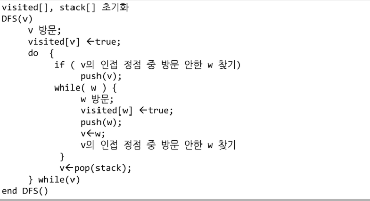

## DFS(깊이우선탐색)

- Tree의 Branch가 다 끝날 때 까지 계속 탐색 수행, 해당 Branch가 끝나면 다른 Branch로 이동하는 로직

- 비선형구조인 그래프 구조는 그래프로 표현된 모든 자료를 빠짐없이 검색하는 것이 중요
- 비선형구조 두가지 방법
  1. 깊이 우선 탐색(Depth First Search, DFS)
  2. 너비 우선 탐색(Breadth First Search, BFS)

- 시작 정점의 한 방향으로 갈 수 있는 경로가 있는 곳까지 깊이 탐색해 가다가 **더 이상 갈 곳이 없게되면**, 가장 마지막에 만났던 갈림길 간선이 있는 정점으로 되돌아와서 다른 방향의 정점으로 탐색을 계속 반복하여 결국 모든 정점을 방문하는 순회방법

- 가장 마지막에 만났던 갈김길의 정점으로 되돌아와서 다시 깊이 우선 탐색을 반복해야 하므로 후입선출 구조의 스택 사용

- 깊이 우선 탐색에는 내가 지나온 경로를 최근 순으로 꺼낼 수 있어야한다. 경로를 저장할 수 있는 방법으로 스택을 사용할 수 있다

- DFS 알고리즘

  1. 시작 정점 v를 결정하여 방문

  2. 정점 v에 인접한 정점 중에서 (인접 : 두점이 연결 a-b , 방향이 있으면 a -> b : a가 b에 인접, a가 b에 갈수 있으면 인접이라고 한다 )

     - 방문하지 않은 정점 w가 있으면, 정점 v를 스택에 push하고 정점 w 를 방문, w를 v로하여 2번 반복

     - 방문하지 않은 정점이 없으면, 탐색의 방향을 바꾸기 위해서 스택을 pop하여 받은 가장 마지막 방문 정점을 v로 하여 2번 반복

  3. 스택이 공백이 될 때까지 2번을 반복

  

  - ex)

    ```
    def dfs(s, V):
    	visited = [0]*(V+1)
    	stack = [s]
    	visited[s] = 1
    	i = s # 현재 방문한 정점 i
    	print(node[i])
    	while i !=0: # True:
    		for w in range(1, V+1):
    			if adj[i][w] == 1 and visited[w] ==0:
    				stack.append(i) # 반문 경로 저장
    				i = w # 새 방문지 이동
    				visited[w] = 1
    				print(node[w])
    				break
    		else:
    			if stack:
    				i = stack.pop()
    			else:
    				i = 0
    				
    adj =[[0, 0, 0, 0, 0, 0, 0, 0],
    	  [0, 0, 1, 1, 0, 0, 0, 0], # A
    	  [0, 1, 0, 0, 1, 1, 0, 0], # B
    	  [0, 1, 0, 0, 0, 1, 0, 0], # C
    	  [0, 0, 1, 0, 0, 0, 1, 0], # D
    	  [0, 0, 1, 1, 0, 0, 1, 0], # E
    	  [0, 0, 0, 0, 1, 1, 0, 1], # F
    	  [0, 0, 0, 0, 0, 0, 1, 0], # G
    ]
    node = ['', 'A', 'B', 'C', 'D', 'E', 'F', 'G']
    dfs(1,7)
    
    #출력
    A
    B
    D
    F
    E
    C
    G
    ```

    

