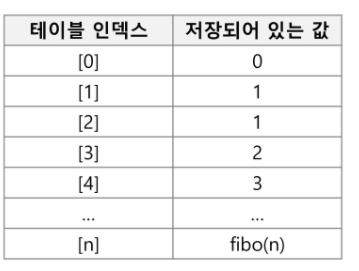
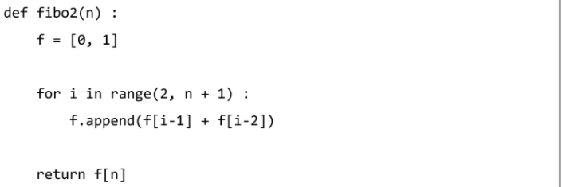

## DP(Dynamic Programming)

- 그리디 알고리즘과 같이 **최적화 문제(가장 좋은 해를 찾는)**를 해결하는 알고리즘

- 먼저 입력 크기가 작은 부분 문제들을 모두 해결한 후에 그 해들을 이용하여 보다 큰 크기의 부분 문제들을 해결하여, 최종적으로 원래주어진 입력의 문제를 해결하는 알고리즘

- 피보나치 수 DP적용

  - 피보나치 수는 부분 문제의 답으로부터 본 문제의 답을 얻을 수 있으므로 최적 부분 구조로 이루어져 있음

  1. 문제를 부분 문제로 분할
     - Fibonacci(n) 함수는 Fibonacci(n-1)과 Fibonacci(n-2)의 합
     - Fibonacci(n-1) 함수는 Fibonacci(n-2)과 Fibonacci(n-3)의 합
     - Fibonacci(2) 함수는 Fibonacci(1)과 Fibonacci(0)의 합
     - Fibonacci(n)은 Fibonacci(n-1), Fibonacci(n-2), ... Fibonacci(2), Fibonacci(1), Fibonacci(0)의 부분집합으로 나뉜다

  2. 부분 문제로 나누는 일을 끝냈으면 가장 작은 부분 문제부터 해를 구한다

  3. 그 결과는 테이블에 저장하고, 테이블에 저장된 부분 문제의 해를 이용하여 상위 문제의 해를 구한다

     

- memoization과의 차이

  - Memo는 재귀호출 DP는 반복

- 피보나치 수 DP 적용 알고리즘

  

  - ex)

    ```
    def fibo(n):
        table[0] = 0
        table[1] = 1
    
        for i in range(2, n+1):
            table[i] = table[i-1] + table[i-2]
    
        return table[n]
    
    n = int(input())
    table = [0] * (n+1)
    
    print(fibo(n))
    ```

- 팩토리얼 DP 적용 알고리즘

  ```
  def fact(n):
  	table[0] = 1
  	for i in range(1, n+1):
  		table[i] = i * table[i-1]
  	return table[n]
  	
  n = int(input()) #3
  print(fact(n)) #6

- DP의 구현 방식

  - recursive 방식

    ```
    def fibo1(n):
    	if n>=2 and len(memo1)<=n:
    		memo1.append(fibo1(n-1) + fibo1(n-2))
    	return memo1[n]
    
    n = 50
    memo1 = [0,1]
    print(fibo1(n))

  - iterative 방식

    ```
    def fibo(n):
        table[0] = 0
        table[1] = 1
    
        for i in range(2, n+1):
            table[i] = table[i-1] + table[i-2]
    
        return table[n]
    
    n = int(input())
    table = [0] * (n+1)
    
    print(fibo(n))

  - memoization을 재귀적 구조에 사용하는 것보다 반복적 구조로 DP를 구현한 것이 성능 면에서 보다 효율적
  - 재귀적 구조는 내부에 시스템 호출 스택을 사용하는 오버헤드가 발생하기 때문이다