## Queue

- 특성
  - 스택과 마찬가지로 삽입과 삭제의 위치가 제한적인 자료구조
    - 큐의 뒤에서는 삽입만하고, 큐의 앞에서는 삭제만 이루어지는 구조
  - 선입선출구조(FIFO : First in First out)
    - 큐에 삽입한 순서대로 원소가 저장되어, 가장 먼저 삽입 (First In)된 원소는 가장 먼저 삭제(First Out)

- 선입선출 구조

  - 두개의 index를 쓴다 : 머리(꺼낼 위치)와 꼬리(저장할 위치)

  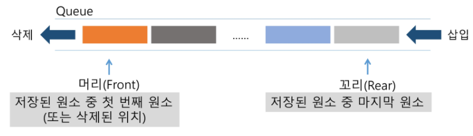

- 기본 연산
  - 삽입 : enQueue(item)
    - 큐의 뒤쪽(rear 다음)에 원소를 삽입하는 연산
  - 삭제 : deQueue
    - 큐의 앞쪽(front)에서 원소를 삭제하고 반환하는 연산
  - createQueue()
    - 공백 상태의 큐를 생성하는 연산
  - imEmpty()
    - 큐의 공백상태인지를 확인하는 연산
  - isFull()
    - 큐가 포화상태인지를 확인하는 연산
  - Qpeek()
    - 큐의 앞쪽(front)에서 원소를 삭제 없이 반환하는 연산

- 연산 과정

  1. 공백 큐 생성 : CreateQueue();

     ```
     Q = [0] * 필요한만큼(정점의 개수?)
     front = -1
     rear = -1
     ```

     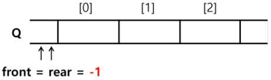

  2. 원소 A 삽입 : enQueue(A);

     ```
     rear += 1
     Q[rear] = 'A'
     ```

     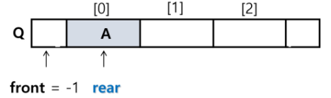

  3. 원소 B 삽입 : enQueue(B);

     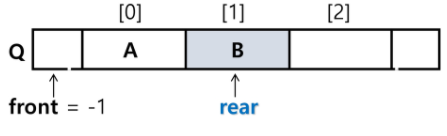

  4. 원소 반환/삭제 : deQueue();

     ```
     front += 1
     data = Q[front]
     ```

     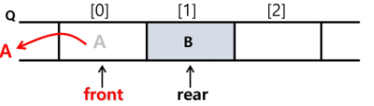

  5. 원소 C 삽입 : enQueue(B);

     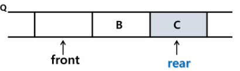

  6. 원소 반환/삭제 : deQueue();

     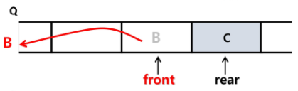

  7. 원소 반환/삭제 : deQueue();

     - Queue가 비어있다  : front와 rear가 만난다

     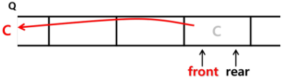

- 선형 큐
  - 1차원 배열을 이용한 큐
    - 큐의 크기 = 배열의 크기
    - front : 저장된 첫 번째 원소의 인덱스
    - rear : 젖아된 마지막 원소의 인덱스
  - 상태 표현
    - 초기 상태
      - front = rear = -1
    - 공백 상태
      - front = rear
    - 포화 상태
      - rear = n-1 (n:배열의 크기, n-1 : 배열의 마지막 인덱스)

- 구현

  - 초기 공백 큐 생성
    - 크기 n 인 1차원 배열 생성
    - frontㄹ와 rear를 -1로 초기화

  - 삽입 enQueue(item)

    - 마지막 원소 뒤에 새로운 원소를 삽입하기 위해

      1. rear 값을 하나 증가시켜 새로운 원소를 삽입할 자리를 마련
      2. index에 해당하는 배열원소 Q[rear]에 item을 저장

      ```
      def enQueue(item):
      	global rear
      	if isFull() : print("Queue Full")
      	else:
      		rear <- rear + 1;
      		Q[rear] <- item

  - 삭제 : deQueue()

    - 가장 앞에 있는 원소를 삭제하기 위해 (앞에 있는 원소는 쓰레기 데이터)

      1. front 값을 하나 증가시켜 큐에 남아있게 될 첫 번째 원소 이동
      2. 새로운 첫 번째 원소를 리턴 함으로써 삭제와 동일한 기능함

      - 파이썬은 배열의 사이즈가 자유롭게 조절이 가능하나, 다른언어에서는 그러지 못하다.
      - index번호를 이용하여 판단하기 때문에 삭제한다 = 쓰레기 데이터라고 생각(실제 삭제X)
        - front의 index 이하에 있는 데이터는 다 비어있다고 판단(생각)

      ```
      deQueue()
      	if(isEmpty()) then Queue_Empty(); # 디버깅용도
      	else{
      		front <- front + 1;
      		return Q[front];
      	}

    - deque

      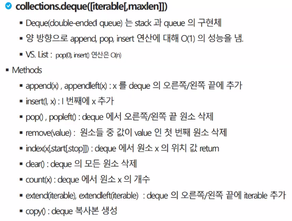

  - 공백상태 및 포화상태 검사 : isEmpty(), isFull()

    - 공백상태 : front = rear
    - 포화 상태 : rear = n-1 (n:배열의 크기, n-1 : 배열의 마지막 인덱스)

    ```
    def isEmpty():
    	return front = rear
    def Full():
    	return rear == len(Q) - 1

  - 검색  : Qpeek()

    - 가장 앞에 있는 원소를 검색하여 반환하느 ㄴ연산
    - 현재 front의 한자리 뒤(front+1)에 있는 원소, 즉 큐의 첫번째에 있는 원소를 반환

    ```
    def Qpeek():
    	if isEmpty() : print("Queue_Empty")
    	else: return Q[front+1]

- 코드 구현

  ```
  3개의 데이터 1, 2, 3을 차례로 큐에 삽입
  큐에서 3개의 데이터를 차례로 꺼내서 출력
  Q = [0] * 10 # 10칸짜리 큐
  front = -1
  rear = -1
  
  rear += 1
  Q[rear] = 1 # enQueue(1)
  
  rear += 1
  Q[rear] = 2 # enQueue(2)
  
  rear += 1
  Q[rear] = 3 # enQueue(3)
  
  while front != rear:
      front += 1
      print(Q[front], end= ' ') # print(deQueue()) # 1 2 3

- 잘못된 포화상태 인식

  - 선형 큐를 이용하여 원소의 삽입과 삭제를 계속할 경우, 배열의 앞부분에 활용할 수 있는 공간이 있음에도 불구하고, rear = n - 1인 상태 즉, 포화상태로 인식하여 더 이상의 삽입을 수행하지 않게 됨

    - 파이썬은 배열의 사이즈가 자유롭게 조절이 가능하나, 다른언어에서는 그러지 못하다.
    - index번호를 이용하여 판단하기 때문에 삭제한다 = 쓰레기 데이터라고 생각(실제 삭제X)
      - front의 index 이하에 있는 데이터는 다 비어있다고 판단(생각)

    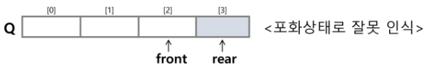

  - 해별방법1

    - 매 연산이 이루어질 때마다 저장된 원소들을 배열의 앞부분으로 모두 이동

    - 원소 이동에 많은 시간이 소요되어 큐의 효율성이 급격히 떨어짐

      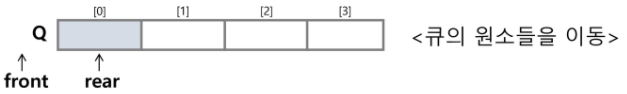

  - 해결방법2
    - 1차원 배열을 사용하되, 논리적으로는 배열의 처음과 끝이 연결되어 원형 형태의 큐를 이룬다고 가정하고 사용 : 원형 큐

- 원형 큐

  - 1차원 배열을 사용하되, 논리적으로는 배열의 처음과 끝이 연결되어 원형 형태의 큐를 이룬다고 가정하고 사용

  - 원형 큐의 논리적 구조

    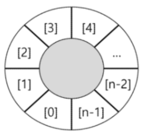

  - 초기 공백 상태
    - front = rear = 0
  - index의 순환
    - front와 rear의 위치가 배열의 마지막 인덱스인 n-1를 가리킨 후, 그 다음에는 논리적 순환을 이루어 배열의 처음 index인 0으로 이동해야 함
    - 이를 위해 나머지 연산자 mod를 사용

  - front 변수

    - 공백 상태와 포화 상태 구분을 쉽게 하기 위해 fromt가 있는 자리는 사용하지 않고 빈자리로 둠

  - 삽입 위치 및 삭제 위치

    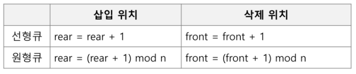

  - 연산 과정

    1. create Queue

       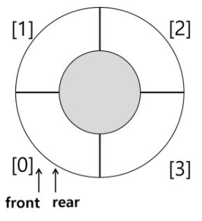

    2. enQueue(A);

       ```
       (rear+A)%4
       ```

       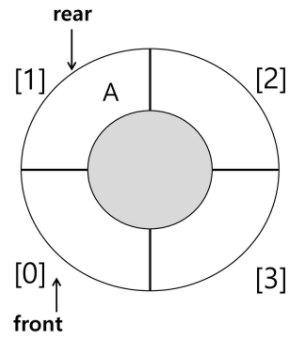

    3. enQueue(B);

       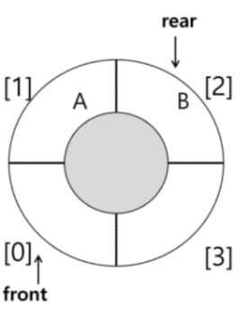

    4. deQueue();

       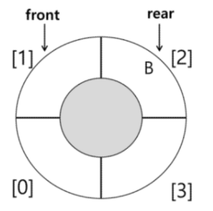

    5. enQueue(C);

       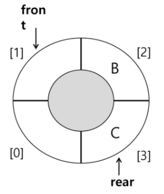

    6. enQueue(D);

       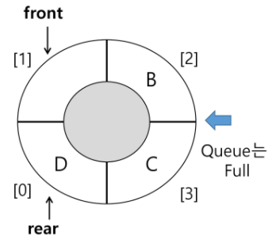

  - 구현

    - 초기 공백 큐 생성

      - 크기 n인 1차원 배열 생성
      - front와 rear를 0으로 초기화

    - 공백상태 및 포화상태 검사 : isEmpty(), isFull()

      - 공백상태 : front = rear

      - 포화상태 : 삽입할 rear의 다음위치 = 현재 front

        - (rear+1) % n = front

        ```
        def isEmpty():
        	return front == rear
        def isFull():
        	return (rear+1) % len(cQ) == front

    - 삽입 : enQueue(item)

      - 마지막 원소 뒤에 새로운 원소를 삽입하기 위해

        1. rear값을 조정하여 새로운 원소를 삽입할 자리를 마련함 : rear <- (rear + 1) % n
        2. index에 해당하는 배열원소 cQ[rear]에 item을 저장

        ```
        def enQueue(item):
        	global rear
        	if isFull():
        		print("Queue_Full")
        	else:
        		rear = (rear + 1) % len(cQ)
        		cQ[rear] = item

    - 삭제 : deQueue(), delete()

      - 가장 앞에 있는 원소를 삭제하기 위해

        1. front값을 조정하여 삭제할 자리를 준비
        2. 새로운 front 원소를 리턴 함으로써 삭제와 동일한 기능

        ```
        def deQueue():
        	global front
        	if isEmpty():
        		print("Queue_Empty")
        	else:
        		front = (front + 1) % len(cQ)
        		return cQ[front]
        ```

        ```
        def delete():
        	global front
        	if isEmpty():
        		print("Queue_Empty")
        	else:
        		front = (front + 1) % len(cQ)

    - 공백상태 및 포화상태 검사 : isEmpty(), isFull()

      ```
      def isEmpty():
      	return front == rear
      def isFull():
      	return (rear + 1) % len(cQ) == front ( rear 다음 칸이 front면 가득찬 상태)

- 연결 큐 (넘어 감)

  - 배열의 사이즈 조절이 자유롭지 않기 때문에 연결 큐가 나왔다

    - 파이썬은 사이즈 조절이 자유롭다.

  - 배열로 구현하지 않는다

    - 선형구조인 list(파이썬의 list가 아니다)를 쓴다..?

  - 단순 연결 리스트(Linked List)를 이용한 큐

    - 큐의 원소 : 단순 연결 리스트의 노드
    - 큐의 원소 순서 : 노드의 연결 순서. 링크로 연결되어 있음
    - front : 첫 번째 노드를 가리키는 링크
    - rear : 마지막 노드를 가리키는 링크

  - 상태 표현

    - 초기 상태 : front = rear = null

    - 공백 상태 : front = rear= null

      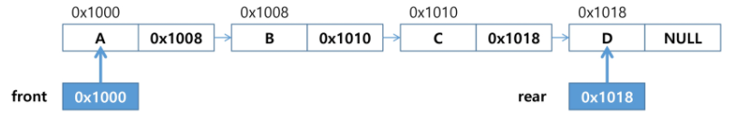

      - A : data, 0x1008 :다음 공간을 가르키는 주소값
        - 공간을 잡는다 = 변수에 저장한다

##### * 우선순위 큐(Priority Queue) - 넘어 감

- 특성

  - 우선순위를 가진 항목들을 저장하는 큐
  - FIFO 순서가 아니라 우선순위가 높은 순서대로 먼저 나가게 된다

- 우선순위 큐의 적용 분야

  - 시뮬레이션 시스템
  - 네트워크 트래픽 제어
  - 운영체제의 데스크 스케줄링

- 구현종류

  - 배열을 이용한 우선순위 큐
  - 리스트를 이용한 우선순위 큐

- 기본 연산

  - 삽입 : enQueue
  - 삭제 : deQueue

  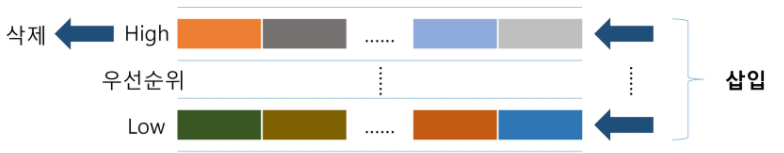

- 배열을 이용한 구현
  - 배열을 이용하여 자료 저장
  - 원소를 삽입하는 과정에서 우선순위를 비교하여 적절한 위치에 삽입하는 구조
  - 가장 앞에 최고 우선순위의 원소가 위치하게 됨
- 문제점
  - 배열을 사용하므로, 삽입이나 삭제 연산이 일어날 때 원소의 재배치가 발생함
  - 이에 소요되는 시간이나 메모리 낭비가 큼


##### * 큐의 활용 : 버퍼(Buffer)

- 버퍼 
  - 임시저장소
  - 데이터를 한 곳에서 다른 한 곳으로 전송하는 동안 일시적으로 그 데이터를 보관하는 메모리의 영역
  - 버퍼링 : 버퍼를 활용하는 방식 또는 버퍼를 채우는 동작을 의미
  - 버퍼는 들어온 순서대로 꺼내서 쓴다 -> Queue활용
- 버퍼의 자료 구조
  - 버퍼는 일반적으로 입출력 및 네트워크와 관련 기능에서 이용
  - 순서대로 입력/출력/전달되어야 하므로 FIFO방식의 자료구조인 Queue가 활용

- 키보드 버퍼는 그림과 같이 수행

  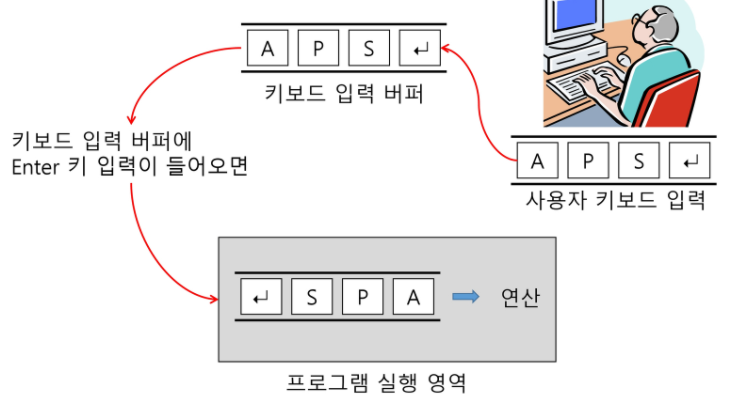


##### * BFS(Breadth First Search)

- 그래프를 탐색하는 방법에는 크게 두가지가 있다

  - 깊이 우선 탐색(Depth First Search, DFS)
  - 너비 우선 탐색(Breadth First Search, BFS)

- 너비우선 탐색은 탐색 시작점의 인접한 정점들을 먼저 모두 차례로 방문한 후에, 방문했던 정점을  시작점으로 다시 인접한 정점들을 차례로 방문하는 방식

  ```
  1.시작점 A inQueue
  2.A deQueue, A와 인접한 점(새로운 시작점) B, C, D를 inQueue
  3.B부터 deQueue하고 B와 인접한 점을 Queue에 inQueue
  deQueue할 때 방문표시를 한다.
  ```

  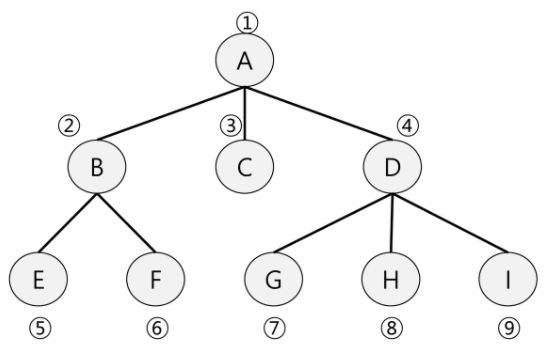

- 인접한 정점들에 대해 탐색을 한 후, 차례로 다시 너비우선탐색을 진행해야 하므로, 선입선출 형태의 자료구조인 큐를 활용함

- 알고리즘

  - BFS는 탐색 시작점이 여러개일 때도 동작 가능

  ```
  def BFS(G, v): # 그래프 G, 탐색 시잠점 v
  	visited = [0] * (n+1) # 방문표시 배열생성, n : 정점의 개수 (n+1 : index를 1~n까지 씀)
  	queue = [] # 큐 생성
  	queue.append(v) # 시작점 v를 큐에 삽입, 시작점 inQueue
  	while queue: # 큐가 비어있지 않은 경우
  		t = queue.pop(0) # 큐의 첫번째 원소 반환
  		if not visited[t]: # 방문되지 않은 곳이라면
  			visited[t] = True # 방문한 것으로 표시
  			visit(t) # 정점 t에서 할 일
  			for i in G[t]: # t와 연결된 모든 정점에 대해
  				if not visited[i]: # 방문되지 않은 곳이라면
  					queue.append(i) # 큐에 넣기
  ```
  - enQueue와 visited표시를 동시 + 각 정점까지의 거리

    ```
    def BFS(G, v, n): # 그래프 G, 탐색 시잠점 v
    	visited = [0] * (n+1) # 방문표시 배열생성, n : 정점의 개수 (n+1 : index를 1~n까지 씀)
    	queue = [] # 큐 생성
    	queue.append(v) # 시작점 v를 큐에 삽입, 시작점 inQueue
    	visited[v] = 1
    	while queue: # 큐가 비어있지 않은 경우
    		t = queue.pop(0) # 큐의 첫번째 원소 반환
    		visit(t)
    		for i in G[t]: # t와 연결된 모든 정점에 대해
    			if not visited[i]: # 방문되지 않은 곳이라면
    				queue.append(i) # 큐에 넣기
    				visited[i] = visited[t] + 1 # n으로부터 1만큼 이동
    										# 출발점과의 거리를 나타낸다

- 연습문제

  ```
  다음은 연결되어 있는 두 개의 정점 사이의 간선을 순서대로 나열 해 놓은 것이다. 모든 정점을 너비우선탐색하여 경로를 출력하시오. 시작 정점을 1로 지정한다.
  1, 2, 1, 3, 2, 4, 2, 5, 4, 6, 5, 6, 6, 7, 3, 7
  출력 결과 : 1-2-3-4-5-7-6
  ```

  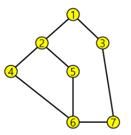

  ```
  """
  7 8 # node의 개수, 간선의 개수
  1 2 1 3 2 4 2 5 4 6 5 6 6 7 3 7
  """
  def bfs(s, V): # s는 시작점
      q = [] # 큐 생성
      visited = [0]*(V+1) # visited 생성
      q.append(s) # 시작점 inQueue
      visited[s] = 1 # 시작점 visited 표시
      while q: # 큐가 비어있지 않으면 (처리할 정점이 남아 있으면)
          t = q.pop(0) # deQueue(꺼내서)해서 t에 저장
          print(t , end= ' ') # t에 대한 처리
          for i in range(1, V+1): # t에 인접하고 미방문인 모든 i에 대해
              if adj[t][i]  == 1 and visited[i] == 0:
                  q.append(i) # enQueue(i)
                  visited[i] = visited[t] + 1 # i visited로 표시
                  
  V, E = map(int, input().split())
  edge = list(map(int, input().split()))
  adj = [[0]*(V+1) for _ in range(V+1)] # 인접 행렬
  
  for i in range(E):
      n1, n2 = edge[2*i], edge[2*i+1]
      adj[n1][n2] = 1
      adj[n2][n1] = 1 # 방향이 없는 그래프
  
  bfs(1, V)
  출력 : 1 2 3 4 5 7 6
  ```

  ```
  def bfs(s, V): # s는 시작점
      q = [] # 큐 생성
      visited = [0]*(V+1) # visited 생성
      q.append(s) # 시작점 inQueue
      visited[s] = 1 # 시작점 visited 표시
      while q: # 큐가 비어있지 않으면 (처리할 정점이 남아 있으면)
          t = q.pop(0) # deQueue(꺼내서)해서 t에 저장
          print(t , end= ' ') # t에 대한 처리
          for i in adjList[t]: # t에 인접하고 미방문인 모든 i에 대해
              if visited[i] == 0:
                  q.append(i) # enQueue(i)
                  visited[i] = visited[t] + 1 # i visited로 표시
                  
  V, E = map(int, input().split())
  edge = list(map(int, input().split()))
  adjList = [[] for _ in rnage(V+1)]
  
  for i in range(E):
      n1, n2 = edge[2*i], edge[2*i+1]
      adjList[n1].append(n2)
      adjList[n2].append(n1)
  bfs(1, V)