## 트리

- 비선형 구조
  - 원소들 간에 1:n관계를 가지는 자료구조
  - 원소들 간에 계층 관계를 가지는 계층형 자료구조
  - 상위 원소에서 하위 원소로 내려가면서 확장되는 트리(나무)모양의 구조
  - 트리는 절대 Cycle을 가지지 않는다

- 한 개 이상의 노드로 이루어진 유한집합이며 다음 조건을 만족한다

  - 노드 중 최상위 노드를 루트(root)라 한다.

  - 나머지 노드들은 n(>=0)개의 분리 집합 T1,...TN으로 분리될 수 있다

  - 아래의 그림에서 T1,...,TN은 각각 하나의 트리가 될 수 있으며(재귀적 정의) 루트의 부 트리(subtree)라 한다

    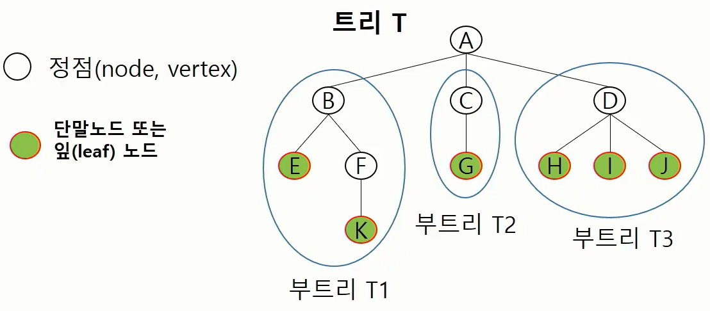

- 용어정리
  - 잎 노드 = 맨 끝에 다다른 노드
  - 노드(node) = vertex 
    - 트리의 원소
    - 트리 T의 노드 - A, B, C, D, E, F, G, H, I, J, K
  - 간선(edge) - 노드를 연결하는 선. 노드와 자식 노드를 연결
  - 루트 노트(root node) - 트리의 시작노드 (탐색의 시작 위치가 아니다)
    - 트리T의 루트노드 : A
  - 형제 노드 (sibling node) - 같은 부모 노드의 자식 노드들
    - B, C, D는 형제 노드
  - 조상 노드 - 간선을 따라 루트노드까지 이르는 경로에 있는 모든 노드들
    - K의 조상 노드  : F, B, A
  - 서브 트리(subtree) - 부모 노드와 연결된 간선을 끊었을 때 생성되는 트리
  - 자손 노드 - 서브 트리에 있는 하위 레벨의 노드들
    - B의 자손노드 : E, F, K
  - 차수(degree)
    - 노드의 차수 : 노드에 연결된 자식 노드의 수
      - B의 차수 = 2, C의 차수 = 1
    - 트리의 차수 : 트리에 있는 노드의 차수 중에서 가장 큰 값
      - 트리 T의 차수 = 3 (자식이 3인 경우)
    - 단말 노드(리프 노드) : 차수가 0인 노드, 자식 노드가 없는 노드
  - 높이
    - 노드의 높이 : 루트에서 노드에 이르는 간선의 수, 노드의 레벨
      - B의 높이 = 1, F의 높이 = 2
    - 트리의 높이 : 트리에 있는 노드의 높이 중에서 가장 큰 값(최대 레벨)
      - 트리 T의 높이 = 3


##### * 이진 트리

- 모든 노드들이 2개의 서브트리를 갖는 특별한 형태의 트리

- 각 노드가 자식 노드를 최대한 2개 까지만 가질 수 있는 트리

  - 왼쪽 자식 노드(left child node)
  - 오른쪽 자식 노드(right child node)

- 특성

  - 레벨 i에서의 노드의 최대 개수는 2^i개
  - 높이가 h인 이진 트리가 가질 수 있는 노드의 최소 개수는 h+1 개 (높이가 간선이 기준이므로), 최대개수는 2^(h+1)-1
  - 노드의 개수를 계산하는 이유: 순서대로 꽉 찬 포화 이진 트리

  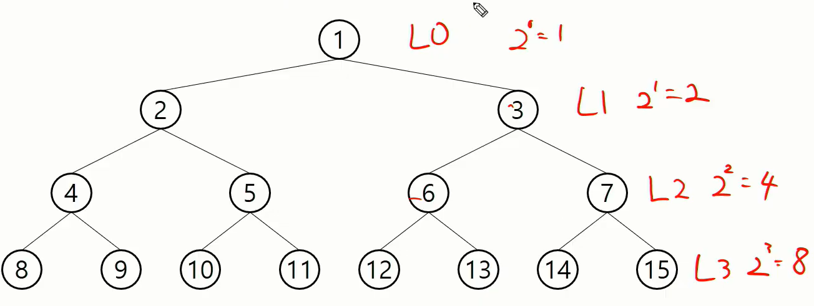

##### 포화 이진 트리(Full Binary Tree)

- 모든 레벨에 노드가 포화상태로 차 있는 이진 트리
- 높이가 h일 때, 최대의 노드 개수인 2^h-1의 노드를 가진 이진 트리

- 루트를 1번으로하여 2^h-1까지 정해진 위치에 대한 노드 번호를 가짐

  - 왼쪽에서 오른쪽으로, 꽉 찰시 아래로 넘어가 번호를 부여

  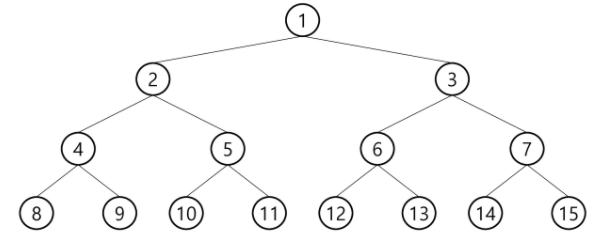

##### 완전 이진 트리(Complete Binary Tree)

- 높이가 h이고 노드 수가 n개일 때(h+1 <= n < 2^(h+1)-1), 포화 이진 트리의 규칙대로 번호를 부여했을 때 노드 번호 1번부터 n번까지 빈 자리가 없는 이진트리

  - ex) 노드가 10개인 완전 이진 트리

    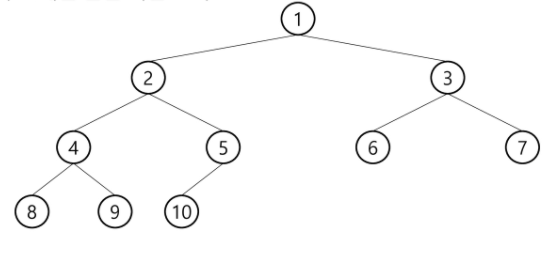

##### 편향 이진트리(Skewed Binary Tree) <-> 균형트리

- 높이 h에 대한 최소 개수의 노드를 가지면서 한쪽 방향의 자식 노드만을 가진 이진 트리

  - 한 쪽으로 치우쳐진 트리

  - 왼쪽 편향 이진 트리

    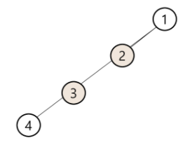

  - 오른쪽 편향 이진트리

    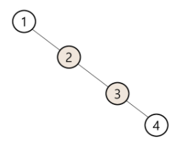


##### 이진트리의 순회(trabersal)

- 트리의 각 노드를 중복되지 않게 전부 방문(visit)하는 것을 말한다
  - 트리는 비 선형 구조이기 때문에 선형구조에서와 같이 선후 연결 관계를 알 수 없다

- 순회(traversal) : 트리의 노드들을 체계적으로 방문하는 방법

- 서브트리에 대해 순회를 시작하면 서브트리 안에서만 순회한다.(서브 트리 밖의 정점은 건들지 않는다) 

- 3가지 기본 순회방법

  - 전위순회(preoder traversal) : VLR
    - 부모노드 방문 후, 자식노드를 좌우 순서로 방문(방문한 정점에 대해 할 일)
  - 중위순회(inorder traversal) : LVR
    - 왼쪽 자식노드, 부모노드, 오른쪽 자식노드 순으로 방문
  - 후위순회(postorder traversal) : LRV
    - 자식노드를 좌우 순서로 방문한 후, 부모노드로 방문

  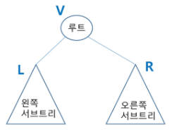

- 전위 순회

  1. 현재 노드 n을 방문하여 처리한다 -> V
  2. 현재 노드 n의 왼쪽 서브트리로 이동 -> L
  3. 현재 노드 n의 오른쪽 서브트리로 이동 -> R

  - BFS랑 비슷하지만 엄연히 다른 것
    - 트리는 BFS구조보다 작은 범주이다
      - 트리 알고리즘으로 BFS를 풀지는 못하나, BFS알고리즘으로 트리를 풀 수 있다

  - 알고리즘

    ```python
    def preorder_traverse(T): #전위순회
        if T: # T is not None, 자료구조에따라 유동적으로 변한다
            visit(T) # print(T.item), 방문했을 때 할 일
            preorder_traverse(T.left) # 왼쪽자식
            preorder_traverse(T.right) # 오른쪽 자식
    ```

    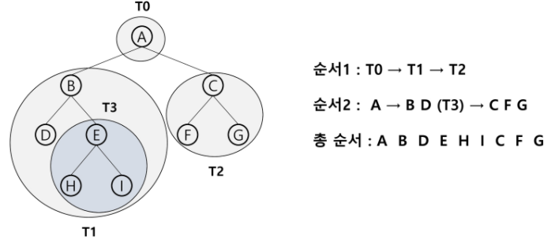

  - 구현

    - 내가 탐색을 하고자하는 정점을 root로 하는 서트브리 안에서만 돌고 끝난다

    ```python
    def pre_order(root):
        if root < N:
            print(root, tree[root])
            pre_order(root*2)
            pre_order(root*2+1)
    
    N = 10 # 노드 개수
    tree = [i*100 for i in range(N+1)] # len(tree)도 노드의 개수
    pre_order(1)
    ```

    ```python
    # tree를 아래와 같이 딕셔너리로 만들었을 때 위의 코드를 사용하면 keyError가 발생한다
    # {'1':[2,3], '2':[4, 5]}
    # V = 13 # 노드의 수
    def pre_order(root):
        print(root, tree[root])
        if root*2 <= N:
            pre_order(root*2)
        if root*2 + 1 <= N:
            pre_order(root*2+1)
            
    N = 10
    tree = [i*100 for i in range(N+1)]
    pre_order(1)

- 중위 순회

  1. 현재 노드 n의 왼쪽 서브트리로 이동 -> L
  2. 현재 노드 n을 방문하여 처리한다 -> V
  3. 현재 노드 n의 오른쪽 서브트리로 이동 -> R

  - 알고리즘

    ```python
    def inorder_traverse(T): # 중위순회
        if T: # T is not None, 자료구조에따라 유동적으로 변한다
            inorder_traverse(T.left) # 왼쪽자식
            visit(T) # print(T.item), 방문했을 때 할 일
            inorder_traverse(T.right) # 오른쪽 자식
    ```

    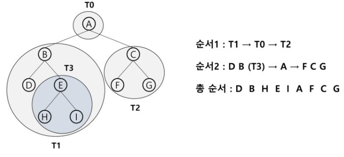

- 후위 순회

  1. 현재 노드 n의 왼쪽 서브트리로 이동 -> L
  2. 현재 노드 n의 오른쪽 서브트리로 이동 -> R
  3. 현재 노드 n을 방문하여 처리한다 -> V

  - 알고리즘

    ```python
    def postorder_traverse(T): # 후위순회
        if T: # T is not None, 자료구조에따라 유동적으로 변한다
            postorder_traverse(T.left) # 왼쪽자식
            postorder_traverse(T.right) # 오른쪽 자식
            visit(T) # print(T.item), 방문했을 때 할 일
    ```

    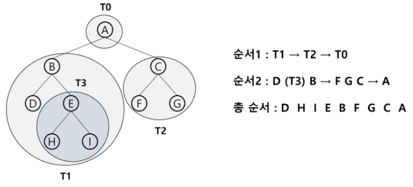

- 전위, 중위, 후위 생각해보기

  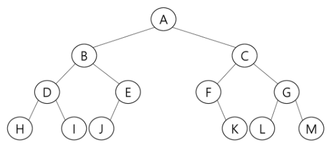

  ```
  전위 : ABDHIEJCFKGLM
  중위 : 
  후위 : 


##### * 배열을 이용한 이진트리의 표현(저장 방법)

- 선형구조인 배열(리스트)를 가지고 트리구조를 어떻게 구현할 것인가?

- 이진 트리에 각 노드 번호를 다음과 같이 부여
  - 루트의 번호를 1로 함
    - 트리의 특성에따라 루트의 번호가 달라질 수도 있다는것을 주의!
  - 레벨 n에 있는 노드에 대하여 왼쪽부터 오른쪽으로 2^n부터 2^(n+1)-1까지 번호를 차례로 부여

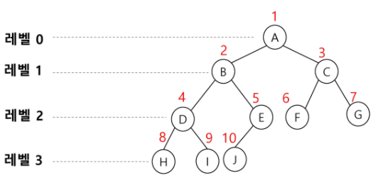

- idex(= node번호)를 이용해 표현해보기

  ```
  노드 번호가 i인 노드의 부모 노드 번호는? i//2
  노드 번호가 i인 노드의 왼쪽 자식 노드 번호? 2*i
  노드 번호가 i인 노드의 오른쪽 자식 노드 번호? 2*i + 1
  레벨 n의 노드 번호 시작 번호는? 2^n
  ```

  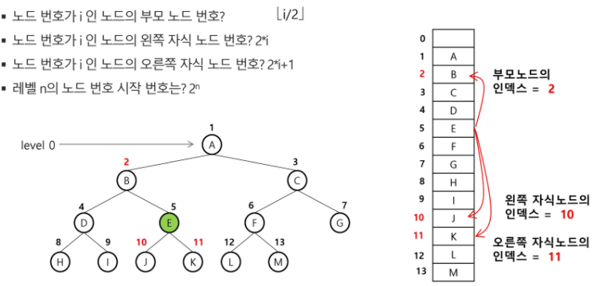

  - 높이가 h인 이진트리를 위한 배열의 크기

    - 2^(h+1) - 1

      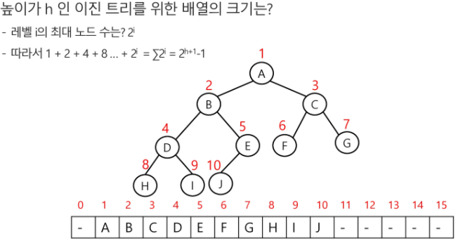

- 배열을 이용한 이진 트리의 표현의 단점

  - 사용하지 않는 배열 원소에 대한 메모리 공간 낭비 발생

    - 편향 이진트리를 위의 방법으로 표현해보기 (비효율적)

    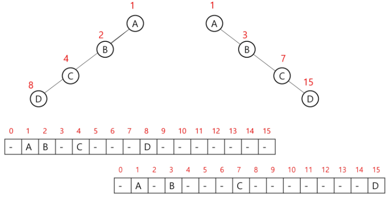

  - 트리의 중간에 새로운 노드를 삽입하거나 기존의 노드를 삭제할 경우 배열의 크기 변경 어려워 비효율적

- 문제로 접근

  ```
  첫 줄에는 트리의 정점의 총 수 V가 주어진다. 그 다음 줄에는 V-1개 간선이 나열된다. 간선은 그것을 이루는 두 정점으로 표기된다. 간선은 항상 "부모 자식"순서로 표기된다. 아래 예에서 두 번째 줄 처음 1과 2는 정점 1과 2를 잇는 간선을 의미하며 1이 부모, 2가 자식을 의미한다. 간선은 부모 정점 번호가 작은 것부터 나열되고, 부모 정점이 동일하다면 자식 정점 번호가 작은 것부터 나열된다.
  ```

  ```python
  def pre_order(n):
      if n: # 유효한 정점이면
  		print(n, end=' ')
          pre_order(left[n]) # n의 왼쪽자식으로 이동
          pre_order(right[n])
          
  V = int(input()) # node 개수
  edge = list(map(int, input().split())) # 부모-자식
  E = V - 1 # V개의 정점이 있는 트리의 간선 수
  left = [0] * (V+1)
  right = [0] * (V+1)
  
  for i in range(E):
      p, c = edge[i*2], edge[i*2+1]
      if left[p] == 0: # p의 왼쪽 자식이 없으면
          left[p] = c
      else: # 왼쪽자식이 있으면 오른쪽자식으로 저장
          right[p] = c
  pre_order(1)
  # 입력 :
  6
  1 2 1 3 2 4 3 5 3 6
  # 출력결과 : 1 2 4 3 5 6
  ```
  - 특정한 값을 root로하는 서브트리의 정점 개수구하기

    ```python
    def pre_order(n):
    	global cnt
        if n: # 유효한 정점이면
    		cnt += 1
            pre_order(left[n]) # n의 왼쪽자식으로 이동
            pre_order(right[n])
            
    V = int(input()) # node 개수
    edge = list(map(int, input().split())) # 부모-자식
    E = V - 1 # V개의 정점이 있는 트리의 간선 수
    left = [0] * (V+1)
    right = [0] * (V+1)
    
    for i in range(E):
        p, c = edge[i*2], edge[i*2+1]
        if left[p] == 0: # p의 왼쪽 자식이 없으면
            left[p] = c
        else: # 왼쪽자식이 있으면 오른쪽자식으로 저장
            right[p] = c
            
    cnt = 0
    pre_order(3)
    print(cnt) # 3을 root로하는 서브트리의 정점 개수
    print(cnt - 1) # 3을 root로 하는 서브트리에서 3의 자손의 수
    # 입력 :
    6
    1 2 1 3 2 4 3 5 3 6
    # 출력결과 :
    3 # 3을 root로하는 서브트리의 정점 개수
    2 # 3을 root로 하는 서브트리에서 3의 자손의 수

  - 자식을 index로 부모의 값 저장하면 다음 2가지가 가능해진다

    - (1) 조상 찾기

      ```python
      V = int(input()) # node 개수
      edge = list(map(int, input().split())) # 부모-자식
      E = V - 1 # V개의 정점이 있는 트리의 간선 수
      par = [0] * (V+1)
      
      for i in range(E):
          p, c = edge[i*2], edge[i*2+1]
          par[c] = p #조상을 찾는데 사용
          
      c = 6 # 조상이 누구인지 궁금한 node
      while par[c]:
      	print(par[c], end= ' ')
      	c = par[c]
      
      # 입력 :
      6
      1 2 1 3 2 4 3 5 3 6
      # 출력
      3 1

    - (2) root찾기

      ```python
      V = int(input()) # node 개수
      edge = list(map(int, input().split())) # 부모-자식
      E = V - 1 # V개의 정점이 있는 트리의 간선 수
      par = [0] * (V+1)
      
      for i in range(E):
          p, c = edge[i*2], edge[i*2+1]
          par[c] = p # root를 찾는데 사용
      
      # 부모가 없으면 root
      root = 1 
      while par[root]: # root로 추정한 정점이 부모가 있으면
      	root += 1
      print(root)
      
      # 입력 :
      6
      2 1 1 3 2 4 3 5 3 6
      # 출력
      2

##### * 연결리스트를 이용한 트리의 표현(저장 방법)

- 배열을 이용한 이진 트리 표현의 단점을 보완하기 위해 연결리스트를 이용하여 트리를 표현

- 연결 자료구조를 이용한 이진트리의 표현

  - 이진 트리의 모든 노드는 최대 2개의 자식 노드(주소)를 가지므로 일정한 구조의 단순 연결 리스트 노드를 사용하여 구현

    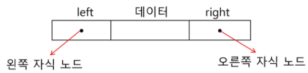

- 완전 이진 트리의 연결 리스트 표현

  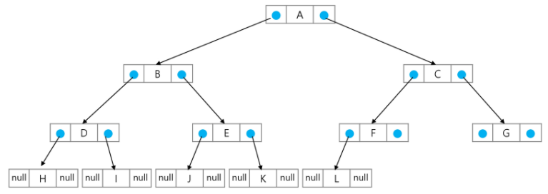


##### * 수식 트리

- 수식을 표현하는 이진 트리
  - 수식 이진 트리(Expression Binary Tree)라고 부르기도함

- 연산자는 루트 노드이거나 가지노드

- 피연산자는 모두 잎 노드

  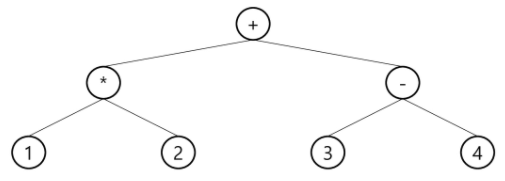

- 수식 트리의 순회

  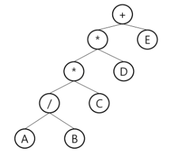

  ```
  중위 순회 : A / B * C * D + E (식의 중위 표기법)
  후위 순회 : A B / * C * D + E (식의 후위 표기법)
  전위 순회 : + * * / A B C D E (식의 전위 표기법)
  ```


##### * 이진 탐색 트리

- 이진 탐색은 정렬되어 있어야 한다

- 탐색작업을 효율적으로 하기 위한 자료구조
- 모든 원소는 **서로 다른 유일한 키**를 갖는다
- 노드 안에 있는 값을 키(key)라고 한다
- **key(왼쪽 서브트리) < key(루트 노드) < key(오른쪽 서브트리)**
- 왼쪽 서브트리와 오른쪽 서브트리도 이진 탐색 트리
- 왼쪽 서브트리의 key들은 root보다 작고, 오른쪽 서브트리의 key들은 root보다 크다

- 이진탐색트리를 중위 순회하면 오름차순으로 정렬된 값을 얻을 수 있다.

  - 2-3-5-8-10-11-14-16

  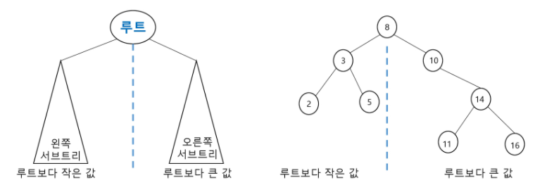

- 탐색연산

  - root에서 시작
  - 탐색할 key 값 x를 노드의 key 값과 비교
    - (키 값 x = 루트노드의 key 값)인 경우 :  원하는 원소를 찾았으므로 탐색연산 성공
    - (키 값 x < 루트노드의 key 값)인 경우 :  루트노드의 왼쪽 서브트리에 대해서 탐색연산 수행
    - (키 값 x > 루트노드의 key 값)인 경우 :  루트노드의 오른쪽 서브트리에 대해서 탐색연산 수행

  - 서브트리에 대해서 순환적으로 탐색 연산을 반복

  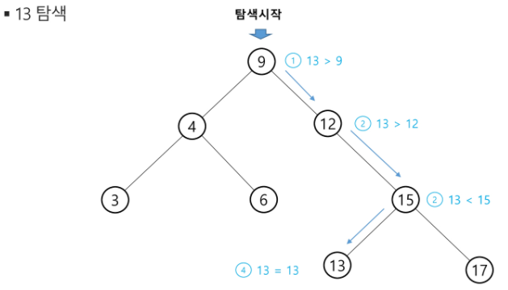

- 삽입 연산

  1. 먼저 탐색 연산을 수행
     - 삽입할 원소와 같은 원소가 트리에 있으면 삽입할 수 없으므로, 같은 원소가 트리에 있는지 탐색하여 확인
     - 탐색에서 탐색 실패가 결정되는 위치가 삽입 위치가 된다
  2. 탐색 실패한 위치에 원소를 삽입

  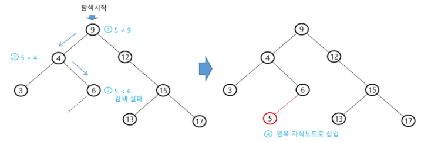

- 이진 탐색 트리의 성능
  - 탐색(searching), 삽입(insertion), 삭제(deletion) 시간은 트리의 높이 만큼 시간이 걸린다
    - O(h), h : BST의 깊이(height)
  - 평균의 경우
    - 이진 트리가 균형적으로 생성되어 있는 경우
    - O(log n)
  - 최악의 경우
    - 한쪽으로 치우친 경사 이진트리의 경우
    - O(n)
    - 순차탐색과 시간복잡도가 같다
- 검색 알고리즘의 비교
  - 배열에서의 순차 검색 : O(N)
  - 정렬된 배열에서의 순차 검색 : O(N)
  - 정렬된 배열에서의 이진 탐색 : O(longN)
    - 고정 배열 크기와 삽입, 삭제 시 추가 연산 필요
  - 이진 탐색트리에서의 평균 : O(logN)
    - 최악의 경우 : O(N)
    - 완전 이진 트리 또는 균형트리로 바꿀 수 있다면 최악의 경우를 없앨 수 있다
      - 새로운 원소를 삽입할 때 삽입 시간을 줄인다
      - 평균과 최악의 시간이 같다 O(lonn)
    - 해쉬 검색 : O(1)
      - 추가 저장 공간이 필요

- 삭제 연산

  - (키 값 x = 루트노드의 key 값)인 경우 :  원하는 원소를 찾았으므로 삭제
  - 다음 트리에 대하여 13, 12, 9를 차례로 삭제
    - 12가 삭제되면 15가 9에 붙는다
    - 9가 삭제되면 왼쪽 서브트리에서 가장 오른쪽에 있는 값으로 대체한다

  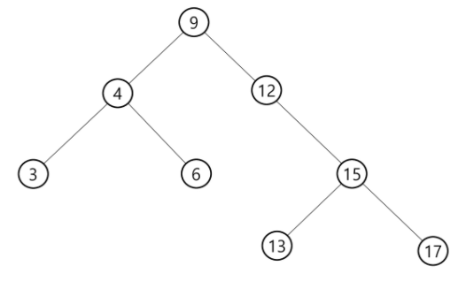


##### * 힙 (heap)

- 완전 이진 트리에 있는 노드 중에서 키(우선순위) 값이 가장 크거나 가장 작은 노드를 찾기 위해서 만든 자료구조
  - 우선 순위가 높거나 작은 정점을 찾기위한 자료구조
  - 완전 이진 트리로 구현되어있다
- 힙의 키를 우선순위로 활용하여 우선순위 큐를 구현할 수 있다
  - [링크]('http://pages.cs.wisc.edu/~vemon/cs367/notes/11.PRIORITY-~.html')

- 최대 힙 (max heap)
  - 큰 숫자에 우선순위를 높게 주면 최대힙
  - 키값(우선순위)이 가장 큰 노드를 찾기 위한 완전 이진 트리
  - 부모노드의 키값 > 자식 노드의 키값
  - 루트 노드 :키값이 가장 큰 노드
  - 우선 순위 큐를 구현하는 자료구조

- 최소 힙(min heap)

  - 작은 숫자에 우선순위를 높게 주면 최소힙
  - 키값이 가장 작은 노드를 찾기 위한 완전 이진트리
  - 가장 작은 키 값을 가진 노드가 항상 루트에 위치한다
  - 부모노드의 키값 < 자식 노드의 키값

  - 루트 노드 : 키값이 가장 작은 노드

- 힙의 예

  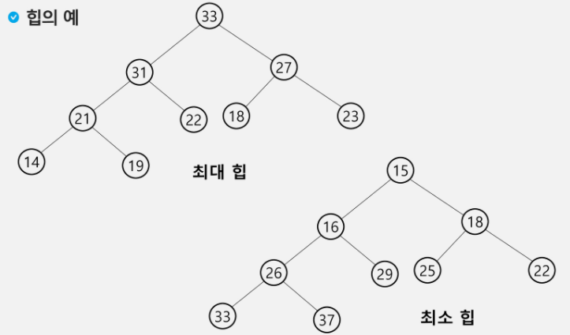

- 힙이 아닌 예

  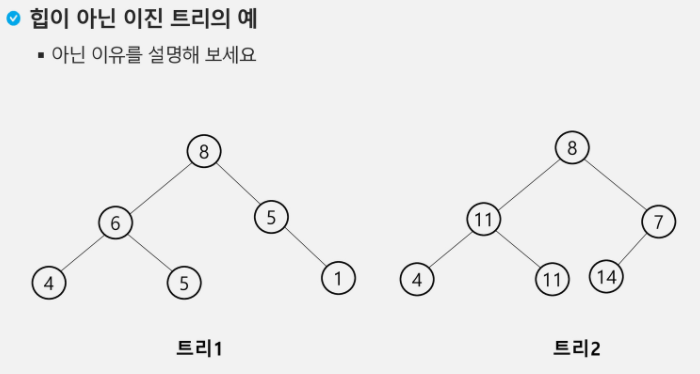

- 삽입

  - 부모가 없거나 (root거나) 부모의 키가 커질때까지 부모와 키값을 교환

  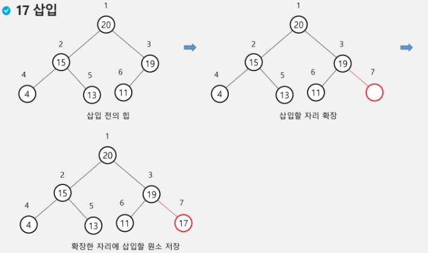

  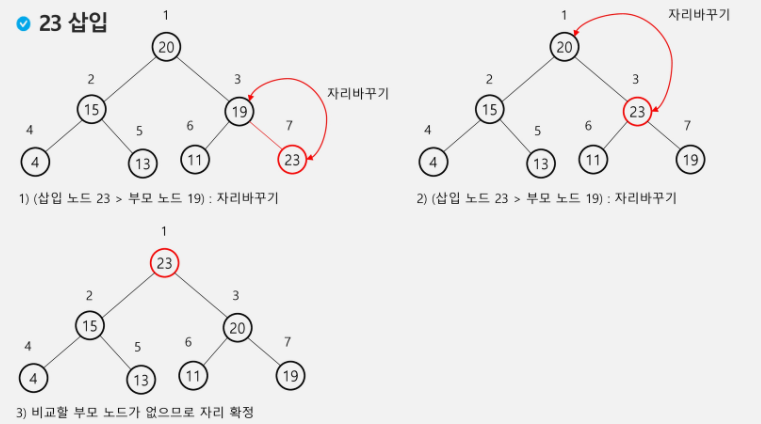

- 삭제
  - 힙에서는 루트 노드의 원소만을 삭제할 수 있다
  - 루트 노드의 원소를 삭제하여 반환
  - 힙의 종류에ㅐ 따라 최대값 또는 최소값을 구할 수 있다

​		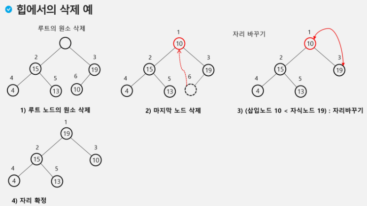

