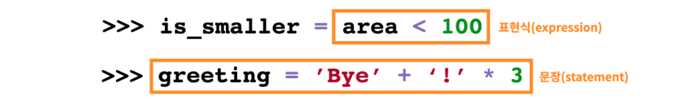
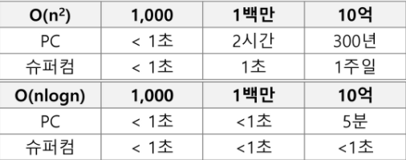
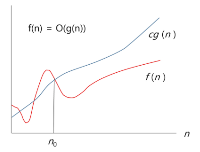
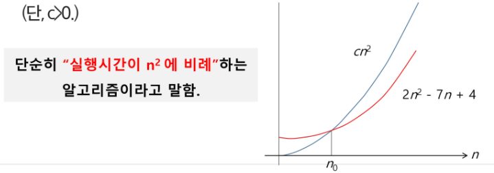
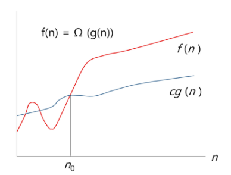
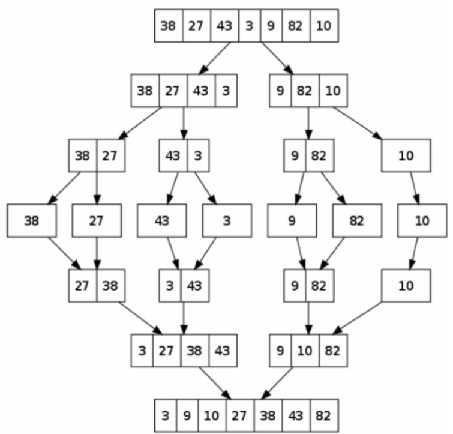

## SW 문제 해결 역량

- 프로그램을 하기 위한 많은 제약 조건과 요구사항을 이해하고 최선의 방법을 찾아내는 능력
  - 무작정 암기X, 이해를 기반한 문제 해결


## 문제해결

- 과정
  1. 문제를 읽고 이해
  2. 문제를 익숙한 용어로 재정의
  3. 어떻게 해결할지 계획 세우기(자료구조, 데이터 저장 등등)
  4. 계획 검증
  5. 프로그램 구현
  6. 어떻게 풀었는지 돌아보고, 개선할 방법 있는지 찾아보기
- 전략
  - 직관과 체계적인 접근이 필요
- 체계적인 접근을 위한 질문들
  1. 비슷한 문제를 풀어본 적이 있던가?
  2. 단순한 방법에서 시작할 수 있을지?
  3. 문제를 **단순화** 시킬 수 있을지?
  4. **그림**으로 그려 볼 수 있을지?
  5. **수식**으로 표현 할 수 있을지?
  6. 문제를 **분해** 할 수 있을지?
  7. **뒤에서부터** 생각해서 문제를 풀어볼 수 있을지?
  8. 특정 형태의 답만을 고려할 수 있을지?

## 기초

##### * 식별자

- 프로그램 내부에 있는 항목(변수, 함수, 클래스)의 이름
  - 서로 다른 항목간에 이름중복 불가능
- 이름의 첫번째에 숫자는 불가능하다
- 길이제한X

- 기본 키워들을 사용하면 안 된다


##### * 할당문

- 변수에 어떠한 값을 할당(저장)하는 명령문
- = 으로 할당한다


##### * 표현식

- 값, 변수명(식별자), 연산자로 구성된다
- 표현식은 평가(계산)되고, 값으로 변경된다
- 하나의 값을 나타낼 수 있는 하나 이상의 조합
  - 식 : 값이 될수 있나 없나
- 함수호출(값을 return해주는 함수)도 포함될 수 있다.
- 하나의 값도 표현식이 될 수 있다.


##### * 문장, 명령문(statement)

- 컴퓨터에게 어떤 동작을 수행하라는 명령을 나타내는 조합
- 정의문(정의), 할당문(대입), 호출문(호출), 제어문(조건, if, for, switch, while), 복합문(블록으로 감싸져 그 안에 여러 명령문이 조합)
- 표현식은 하나의 문장이다




 

## 알고리즘

- 유한한 단계를 통해 문제를 해결하기 위한 절차나 방법

- 주로 컴퓨터용어로 쓰이며, 컴퓨터가 어떤 일을 수행하기 위한 단계적 방법

- 어떤 문제를 해결하기 위한 절차

- 알고리즘을 표현하는 방법 2가지

  1. 슈더코드(Pseudocode)

     - 완전한 코드X, 논리적 구조를 이해할 수 있는 구도로 적은 코드

       ```python
       def CalcSum( n ):
       	sum <- 0
       	for i in ragne (1, n + 1):
       		sum <- sum + i;
       	return sum;
       ```

  2. 순서도

     


##### * 좋은 알고리즘이란

1. 정확성 : 얼마나 정확하게 동작하는가
2. 작업량 : 얼마나 적은 연산으로 원하는 결과를 얻어내는가
3. 메모리 사용량 : 얼마나 적은 메모리를 사용하는가
4. 단순성 : 얼마나 단순한가
5. 최적성 : 더 이상 개선할 여지없이 최적화되었는가


##### * 왜 효율적인 알고리즘이 필요한가

- 10억 개의 숫자를 정렬하는데 PC에서 O(n^2) 알고리즘은 300여 년이 걸리는 반면에 O(nlogn) 알고리즘은 5분만에 정렬이 가능하다

  

##### * 효율

- 공간적 효율성  
  - 연산량 대비 얼마나 적은 메모리 공간을 요구하는 지
- 시간적 효율성
  - 연산량 대비 얼마나 적은 시간을 요구하는 지
- 효율성을 뒤집어 표현하면 복잡도(Complexity)가 된다. 복작도가 높을수록 효율성은 저하

- 시간적 복잡도 분석
  - 하드웨어 환경에 따라 처리시간이 달라진다
    - 부동소수 처리 프로세서 존재유무, 나눗셈 가속기능 유무
    - 입출력 장비의 성능, 공유여부
  - 소프트웨어 환경에 따라 처리시간이 달라진다
    - 프로그램 언어의 종류
    - 운영체제, 컴파일러의 종류
  - 환경적 차이로 인해 분석 힘들다

- 시간 (또는 공간)복잡도는 입력 크기에 대한 함수[(T(n)]로 표기하는데, 이 함수는 주로 여러개의 항을 가지는 다항식

- 이를 단순한 함수로 표현하기 위해 점근적 표기 (Asymptotic Notation)를 사용한다
- 입력 크기 n이 무한대로 커질 때의 복잡도를 간단히 표현하기 위해 사용하는 표기법
  - O(Big-oh), Ω(Big-Omega), Θ(Big-Theta)


##### *O(Big-Oh) 표기

- O-표기는 복잡도의 점근적 상한을 나타낸다

  - f(n)의 단순화된 함수g(n)가 특정 값보다 큰 모든 n에 대해서 항상 f(n)보다 크다는 것

    - 최악의 상황속에서도 특정 값보다 큰 범위에서는 f(n)이 g(n)을 절대 넘지 않는다!!

    

- ex) 복잡도가 f(n) = 2n^2 -7n +4이라면, f(n)의 O-표기는 O(n^2)이다

  - f(n)의 단순화된 표현 : n^2

    - 다항식의 최고차항만 계수없이 취한다

  - 단순화된 함수 n^2에 임의의 상수 c를 곱한 cn^2이 n이 증가함에 따라 f(n)의 상한이 된다

    

- 최악의 경우 이 정도의 시간이 걸린다


##### *Ω(Big-Omega) 표기

- 복잡도의 점근적 하한을 의미한다

  - f(n)의 단순화된 함수g(n)가 특정 값보다 큰 모든 n에 대해서 항상 f(n)보다 작다는 것

  

- ex) 복잡도가 f(n) = 2n^2 -7n +4이라면, f(n)의 Ω표기는 Ω(n^2)이다

  - n이 증가함에 따라 f(n)이 g(n)=cn^2(c=1)보다 작을 수 없다

- 최소한 이만한 시간은 걸린다


##### * Θ(Big-Theta)

- O와 Ω의 표기가 같은 경우에 사용한다

- ex) f(n) = 2n^2 -7n +4이라면 O(n^2)=Ω(n^2)이므로 , Θ(n^2)

- n이 증가함에 따라 n^2과 동일한 증가율을 가진다


##### * 알고리즘의 성능 비교

- 작업량 비교(작업량을 표현할 떄 시간복잡도로 표현)

  - 시작복잡도(Time Complexity)

    - 실제 걸리는 시간을 측정

    - 실행되는 명령문의 개수를 계산 (연산 횟수)

      - 파이썬에서의 줄바꿈은 명령문의 끝을 의미
        - 즉, 하나의 명령문은 한 줄에 기록하는 것을 원칙으로 한다

      

      

- 빅-오(O) 표기법

  - 시간 복잡도 함수 중에서 가장 큰 영향력을 주는 n에 대한 항만을 표시

  - 계수(Coefficient)는 생략하여 표시

    - 밑의 예시에서는 n의 차수가 가장 큰 영향력이다
      - 계수, 상수 제거 (밑에서 상수 2는 입력에 따라 변하지 않는 부분)

    

  - ex) n개의 데이터를 입력 받아 저장한 후 각 데이터에 1씩 증가(n번의 연산)시킨 후 각 데이터를 화면에 출력하는 알고리즘의 시간 복잡도는??

    - O(n)

- 요소 수가 증가함에 따라 각기 다른 시간복잡도의 알고리즘은 아래와 같은 연산 수를 보인다

  


- 시간 복잡도별 실제 실행 시간 비교

  

  1. O(1) : 상수 시간

     - 입력된 데이터의 크기에 상관 없이 일정한 시간이 소요되는 알고리즘

       ```python
       print("Hello World!")

  2. O(n) : 선형 시간

     - n번 반복하는 for문의 시간복잡도

       ```python
       for i in range(n):
       	print("이것은 O(n)을 위한 예제입니다")

     - ex) O(2n+1)

       ```python
       a = 0 # 1번
       for i in range(n): # n번동안
       	a = a + 1 # 1개의 할당문, 1개의 표현식
       
     - 선형탐색

  3. O(log n) : 로그시간

     - 데이터를 처리하는데 걸리는 시간이 반씩 줄어든다

       ex) 이진탐색

  4. O(nlogn) : 로그선형시간

     - 데이터를 반으로 나누는 과정을 반복하여 합친다

       - lon n 에 데이터의 개수(n)을 곱해준다

       ex) 분할정복, 버블정렬

       

  5. O(n**2) : 2차시간

     - 이중 반복문의 시간복잡도

     - 입력데이터의 크기에 따라 연산 횟수도 기하학적으로 증가

     - ex) 버블정렬

       ```python
       for i in range(n):
       	for j in range(n):
       		print("Hello World!!")

  6. O(2**n) : 지수시간

     - 계산하는 양이 늘어날 수록 걸리는 시간도 2배

       ex) 피보나치 수열을 구현할 때, 부분집합

       ```python
       def fibonacci(n):
         if(n<3):
           return 1
         else:
           return fibonacci(n-1) + fibonacci(n-2)


##### *파이썬 기본 연산자의 시간 복잡도

1. List

   | 연산           | 설명                                            | 예제                 | 복잡도            | 비고                                                         |
   | -------------- | ----------------------------------------------- | -------------------- | ----------------- | ------------------------------------------------------------ |
   | Index          | n번째 element 접근                              | l[i]                 | O(1)              |                                                              |
   | Store          | n번째에 element 할당                            | l[i] = 10            | O(1)              |                                                              |
   | Length         | List의 길이 가져옴                              | len(l)               | O(1)              |                                                              |
   | Append         | List의 뒤쪽에 element 추가                      | l.append(1)          | O(1)              |                                                              |
   | Pop            | List의 뒤쪽 element 제거                        | l.pop()              | O(1)              | l.pop(-1)과 동일한 동작                                      |
   | Clear          | List를 비움                                     | l.clear()            | O(1)              | l = list(), l = [] 과 동일                                   |
   | Slice          | List의 일부를 취함                              | l[a:b]               | O(b-a)            | 복사되는 element의 개수에 비례                               |
   | Extend         | 리스트뒤에 리스트를 붙임                        | l.extend(other_list) | O(len(other_list) | 추가되는 list의 size에 비례                                  |
   | Construction   | list 객체 생성                                  | list()               | O(len(...))       | 초기화 되는 리스트 Element 개수에 비례                       |
   | Equality Check | 두 리스트가 같은지 확인                         | l1 == l2             | O(N)              | N : list의 size                                              |
   | Insert         | 특정 위치에 element를 끼워 넣음                 | l.insert(2, 10)      | O(N)              | 중간에 끼워 넣어야 해서 한칸씩 뒤로 밀려나서 그러는듯?       |
   | Delete         | 특정 위치의 element를 제거함                    | del l[10]            | O(N)              | 마찬가지로 중간에 제거되고 그 뒤에 있는 Element를 땡겨줘야해서 그러는듯? |
   | Containment    | 특정 Element가 list 내에 있는지 확인            | x in l, x not in l   | O(N)              | Searching Overhead                                           |
   | Copy           | list를 복사                                     | l.copy()             | O(N)              | l[:]와 동일한 결과                                           |
   | Remove         | list에서 Element를 제거                         | l.remove(10)         | O(N)              | 10이라는 값을 제거                                           |
   | Pop            | List의 i번째 element를 제거                     | l.pop(1)             | O(N)              | O(N - i).                                                    |
   | Extreme  Value | min/max 값 찾기                                 | min(l), max(l)       | O(N)              | 전체를 한번씩 탐색 필요                                      |
   | Reverse        | 리스트를 역순으로 변경                          | l.reverse()          | O(N)              |                                                              |
   | Iteration      | 리스트의 element들을 한번씩 순회                | for item in l :      | O(N)              |                                                              |
   | Sort           | 정렬 수행                                       | l.sort()             | O(N * log N)      |                                                              |
   | Multiply       | 리스트의 element들을 k번 반복해서 리스트를 생성 | k * l                | O(k * l)          | 3 * [0] -> [0,0,0]                                           |

2. Set

   | 연산           | 설명                                | 예제                 | 복잡도              | 비고                                                  |
   | -------------- | ----------------------------------- | -------------------- | ------------------- | ----------------------------------------------------- |
   | Length         | 집합 element들의 개수               | len(s)               | O(1)                |                                                       |
   | Add            | 집합에 element 추가                 | s.add(10)            | O(1)                |                                                       |
   | Containment    | 집합에 특정 Element가 있는지 확인   | 10 in s, 10 not in s | O(1)                | List/Tuple은 O(N)임과 비교                            |
   | Remove         | 집합에서 특정 Element를 제거        | s.remove(10)         | O(1)                | List/tuple의 경우 O(N)                                |
   | Discard        | 집합에서 특정 Element를 제거        | s.discard(10)        | O(1)                |                                                       |
   | Pop            | 집합에서 임의의 element하나를 제거  | s.pop()              | O(1)                |                                                       |
   | Clear          | 집합을 공집합(empty)으로 만들어버림 | s.clear()            | O(1)                | s = set() 과 동일                                     |
   | Construction   | 집합을 생성                         | set(...)             | O(len(...))         | 새로 생성되는 집합 요소(Element)의 개수에 비례        |
   | Equality Check | 동일한 집합인지 연산                | s == t, s != t       | O(len(s))           | 모든 element가 동일하면 동일한 집합                   |
   | Subset Check   | Subset인지 여부를 확인              | s <= t, s >= t       | O(len(s)) O(len(t)) | Subset 쪽의 모든 element가 superset에 존재하는지 확인 |
   | Union          | 합집합                              | s \| t               | O(len(s) + len(t))  |                                                       |
   | Intersection   | 교집합                              | s & t                | O(len(s) + len(t))  |                                                       |
   | Difference     | 차집합                              | s - t                | O(len(s) + len(t))  |                                                       |
   | Symmetric Diff | 두 집합의 상대 여집합의 합          | s ^ t                | O(len(s) + len(t))  |                                                       |
   | Iteration      | 집합의 모든 element들을 순회        | for v in s:          | O(N)                |                                                       |
   | Copy           | 집합을 복사                         | s.copy()             | O(N)                |                                                       |

3. Dict

   | 연산         | 설명                             | 예제        | 복잡도      | 비고                                     |
   | ------------ | -------------------------------- | ----------- | ----------- | ---------------------------------------- |
   | Index        | 특정 Element에 접근              | d[k]        | O(1)        |                                          |
   | Store        | 특정 Element에값을 설정          | d[k] = v    | O(1)        |                                          |
   | Length       | Dict에 들어있는 Element 개수     | len(d)      | O(1)        |                                          |
   | Delete       | 특정 Element를 지움              | del d[k]    | O(1)        |                                          |
   | Pop          | 특정 Element를 지움              | d.pop(k)    | O(1)        |                                          |
   | Pop item     | 무작위로 Element 하나를 지움     | d.popitem() | O(1)        |                                          |
   | Clear        | Dict를 초기화                    | d.clear()   | O(1)        | d = {}와 동일함                          |
   | View         | Dict의 Key들을 List형태로 가져옴 | d.keys()    | O(1)        | d.values()도 동일                        |
   | Construction | Dictionary를 생성                | dict(...)   | O(len(...)) | 새로 생성되는 Dict의 element 개수에 비례 |
   | Iteration    | Dict 내의 element들을 순회       | for k in d: | O(N)        |                                          |


## Python3 표준 입출력

- 입력

  - Raw 값의 입력 : input()
    - 받은 입력값을 문자열로 취급
  - Evaluated된 값 입력 : eval(input())
    - 받은 입력값을 평가된 데이터 형으로 취급 (ex : 1+2+3)

- 출력

  - print()

    - 표준 출력 함수, 출력값의 마지막에 개행문자(\n) 포함

  - print('text', end='')

    - 출력 시 마지막에 개행문자 제외

  - Formatting

    ```python
    a = 1
    b = 2
    print(f'{a} {b}')
    print('{} {}'.format(a, b))
    print('%d' %a)

- 파일의 내용을 표준 입력으로 읽어오는 방법

  ```python
  import sys
  sys.stdin = open("파일명.txt", "r")
  ```

- 표준 출력을 파일로 저장하는 방법

  ```python
  import sys
  sys.stdout = open("파일명.txt", "w")
  ```


## 엔디안(Endianness)

- 컴퓨터의 메모리와 같은 1차원의 공간에 여러 개의 연속된 대상을 배열하는 방법
- 속도 향상을 위해 바이트 단위와 워드 단위를 변환하여 연산 할 때 올바로 이해하지 않으면 오류가 발생할 수 있다

여러 바이트를 나눠서 저장해야할 때 낮은 자리수를 더 빠른 주소에 저장하는 방법

or 더 빠른자세에 높은 자리수를 더 저장하는 방법?

낮은 자리수를 더 빠른 주소에 저장할 것인가, 높은 자리수를 더 빠른 주소에 저장할 것인가

- 빅 엔디안(Big-Endian)
  - 보통 큰 단위가 앞에 나옴, 네트워크
- 리틀 엔디안(Litte-Endian)
  - 작은 단위가 앞에 나옴, 대다수 데스크탑 컴퓨터
  - 


### Reference

[ssafy](https://edu.ssafy.com/)

[시간 복잡도별 실제 실행 시간 비교](https://blog.naver.com/khw11044/221829276516)

[파이썬 기본 연산자의 시간 복잡도](https://www.ics.uci.edu/~pattis/ICS-33/lectures/complexitypython.txt)

