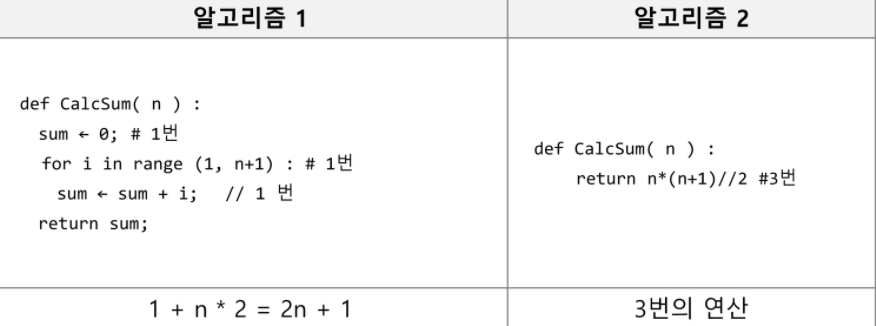
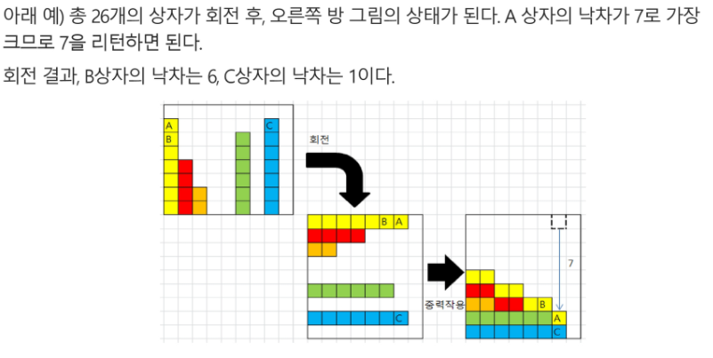
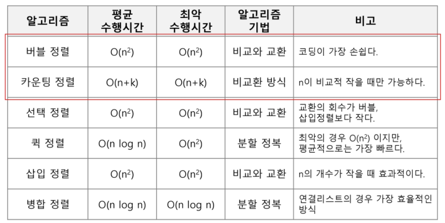
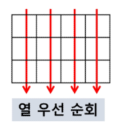
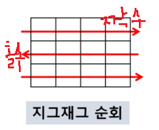
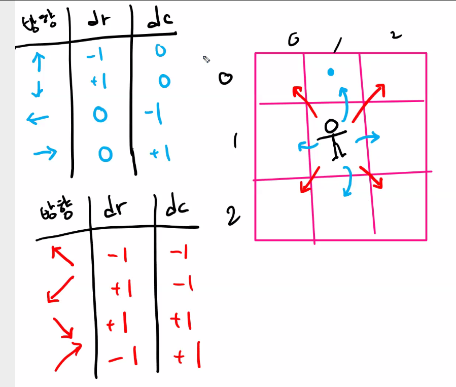
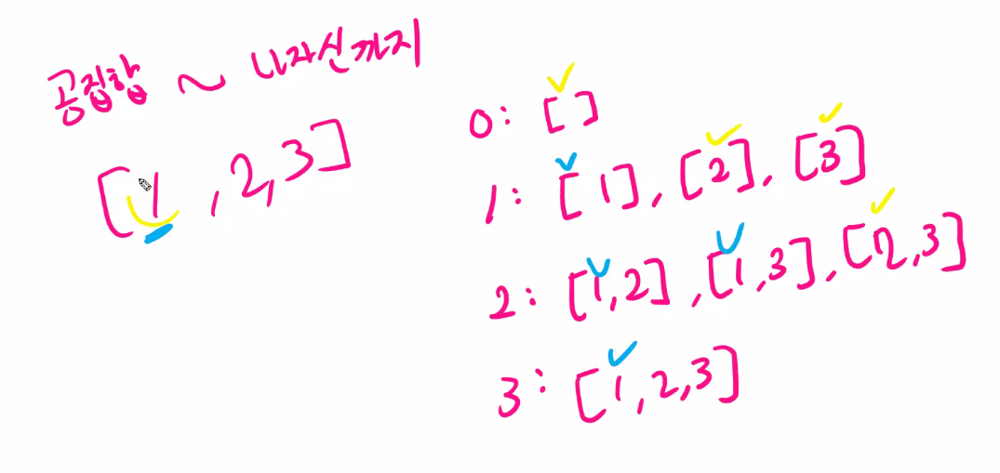
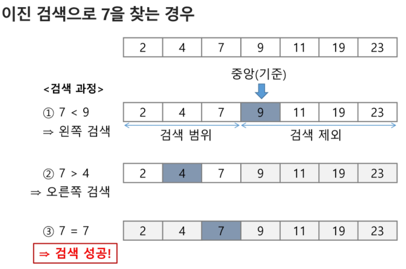
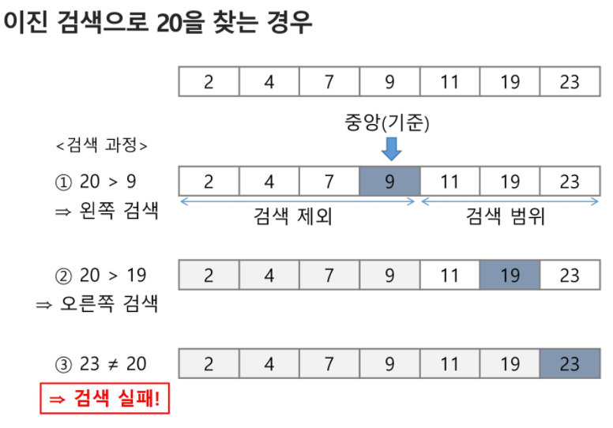

## 알고리즘

- 유한한 단계를 통해 문제를 해결하기 위한 절차나 방법

- 주로 컴퓨터용어로 쓰이며, 컴퓨터가 어떤 일을 수행하기 위한 단계적 방법

- 어떤 문제를 해결하기 위한 절차

- 알고리즘을 표현하는 방법 2가지

  1. 슈더코드(Pseudocode)

     - 완전한 코드X, 논리적 구조를 이해할 수 있는 구도로 적은 코드

       ```
       def CalcSum( n ):
       	sum <- 0
       	for i in ragne (1, n + 1):
       		sum <- sum + i;
       	return sum;
       ```

  2. 순서도

     


##### * 좋은 알고리즘이란

1. 정확성 : 얼마나 정확하게 동작하는가
2. 작업량 : 얼마나 적은 연산으로 원하는 결과를 얻어내는가
3. 메모리 사용량 : 얼마나 적은 메모리를 사용하는가
4. 단순성 : 얼마나 단순한가
5. 최적성 : 더 이상 개선할 여지없이 최적화되었는가


##### * 알고리즘의 성승 비교

- 작업량 비교(작업량을 표현할 떄 시간복잡도로 표현)

  - 시작복잡도(Time Complexity)

    - 실제 걸리는 시간을 측정

    - 실행되는 명령문의 개수를 계산

      

      

- 빅-오(O) 표기법

  - 시간 복잡도 함수 중에서 가장 큰 영향력을 주는 n에 대한 항만을 표시

  - 계수(Coefficient)는 생략하여 표시

    - 밑의 예시에서는 n의 차수가 가장 큰 영향력이다
      - 계수, 상수 제거 (밑에서 상수 2는 입력에 따라 변하지 않는 부분)

    

  - ex) n개의 데이터를 입력 받아 저장한 후 각 데이터에 1씩 증가(n번의 연산)시킨 후 각 데이터를 화면에 출력하는 알고리즘의 시간 복잡도는??

    - O(n)

- 요소 수가 증가함에 따라 각기 다른 시간복잡도의 알고리즘은 아래와 같은 연산 수를 보인다

  


- 시간 복잡도별 실제 실행 시간 비교

  


---

---

##### * index

- database에서 유래, 테이블에 대한 동작 속도를 높여주는 자료 구조
- 배열을 사용한 index
  - 대량의 데이터를 매번 정렬시 성능 저하 문제가 발생, 이를 위해 배열 인덱스 사용

## 배열

- 일정한 자료형의 변수들을 하나의 이름으로 열거하여 사용하는 자료구조
- 배열의 필요성
  - 프로그램 내에서 여러개의 변수가 필요할 때, 일일이 다른 다른 변수명을 이요하여 자료에 접근하는 것은 매우 비효율적
  - 하나의 선언을 통해서 둘 이상의 변수를 선언
  - 다수의 변수로는 하기 힘든 작업을 배열을 활용해 쉽게 가능
- 1차의 배열의 선언
  - 별도의 선언 방법이 없으면 변수에 처음 값을 할당할 때 생성
  - 이름 : 프로그램에서 사요할 배열의 이름
    - Arr = list(), Arr = []
- 1차원 배열의 접근
  - Arr[idx] = 10; 
    - 배열 Arr의 idx번째 원소에 10을 저장

##### * 배열 활용 예제 : Gravity

- 상자들이 쌓여있는 방이 오른쪽으로 90도 회전하였을 때, 중력의 영향을 받아 낙하한다. 이 때 낙차가 가장 큰 상자를 구하여 그 낙차를 리턴하는 프로그램을 작성해라

  

  ```
  lst = [7, 4, 2, 0, 0, 6, 0, 7, 0]
  max_v = lst[0]
  result = 0
  
  for i in range(len(lst)):
      count = 0
  
      for j in range(i+1, len(lst)):
          if lst[i] > lst[j]:
              count += 1
  
      if result < count:
          result = count
  
  print(result) # 7
  ```


##### * 정렬

- 2개 이상의 자료를 특정 기준에 의해 작은 값부터 큰 값(오름차순 : ascending), 

  혹은 그 반대의 순서대로(내림차순 : descending) 재배열하는 것

- 키

  - 자료를 정렬하는 기준이 되는 특정 값

- 대표적인 정렬 방식의 종류

  

  - 버블 정렬 (Bubble Sort)

    - **인접한 두 개의 원소를 비교**하며 자리를 계속 교환하는 방식

    1. 첫 번째 원소부터 인접한 원소끼리 계속 자리를 교환하면서 맨 마지막 자리까지 이동
    2. 한단계가 끝나면 가장 가장 큰 원소가 마지막 자리로 정렬

    ```
    def BubbleSort(a): # 정렬할 List
    	for i in range(len(a)-1, 0, -1): # 범위의 끝 위치
    		for j in range(0, i):
    			if a[j] > a[j+1]:
    				a[j], a[j+1] = a[j+1], a[j]
    ```

    

  - 카운팅 정렬 (Counting Sort)

    - 항목들의 순서를 결정하기 위해 집합에 각 항목이 몇 개씩 있는지 세는 작업을 하여, 선형 시간에 정렬하는 효율적인 알고리즘
    - **정수나 정수로 표현할 수 있는 자료**에 대해서만 적용가능
      - **각 항목의 발생 회수를 기록**하기 위해, 정수 항목으로 인덱스 되는 카운트들의 배열에 사용
      - 카운트들을 위한 충분한 공간을 할당하려면 집합 내의 가장 큰 정수를 알아야 함
    - 시간 복잡도 : O(n+k) : n은 리스트 길이, k는 정수의 최대값

    ```
    def Counting_Sort(A, B, k)
    # A [] -- 입력 배열(1 to k)
    # B [] -- 정렬된 배열
    # C [] -- 카운트 배열
    	
    	c = [0] * (k+1)
    	
    	for i in range(0, len(B)):  # N번
    		C[A[i]] += 1
    		
    	for i in range(1, len(C)): # K번
    		C[i] == C[i-1]
    		
    	for i in range(len(B)-1, -1, -1): # N번
    		B[C[A[i]]-1] = A[i] # C[A[i]] -= 1
    		C[A[i]] -= -1		# B(C[A[i]]) = A[i]
    # 2N + K --> O(N+K)
    ```

    1. Data에서 각 항목들의 발생 회수를 세고, 정수 항목들로 직접 인덱스 되는 카운트 배열에 저장

       - 카운트 배열은 주어진 숫자의 범위에 따라서 달라진다 (data 개수X)

       - 카운트 배열의 원소들은 0으로 초기화 해놓구 시작해야한다

         - counts = [0] * (주어진 숫자의 범위 중 가장 큰) 값

           ```
           counts = [0] * 3 # [0, 0, 0]
           ```

    2. 정렬했을 때 각 항목 앞에 위치할 항목의 개수를 반영

       - 밑의 그림에서, data배열에서 각 항목(0~4)들에서 가장 뒤에 있는 값들은 다음과 같이 존재한다.

         0은 첫번째, 1은 네번째, 2는 5번째, 3은 6번째, 4는 8번째에 있다는 뜻이다.

       

    3. data의 맨 뒤에 있는 값부터 차례대로W 정렬 된 값을 기록할 배열에 채워 넣는다 (안전정렬)

       

         

    - ex)

      ```
      data = [0, 4, 1, 3, 1, 2, 4, 1]
      
      M = 5 # 0 ~ 4, data 개수가 아닌 data원소의 범위
      N = len(data)
      counts = [0] * M
      temp = [0] * N
      
      # 데이터가 각 항목별로 몇개 있는지 센다
      for d in data:
          counts[d] += 1
      
      # 정렬했을 때 각 숫자(data)의 앞에 위치할 data 개수를 반영하기 위해 counts의 원소를 조정
      for i in range(M-1):
          counts[i+1] = counts[i] + counts[i+1]
      
      for j in range(N-1, -1, -1):
          p = counts[data[j]] - 1
          temp[p] = data[j]
          counts[data[j]] -= 1
          # p1 = data[j] # j=7, p1=1
          # p2 = counts[p1] - 1 # p2 =3
          # temp[p2] = p1
          # counts[p1] -= 1
      
      print(temp) # [0, 1, 1, 1, 2, 3, 4, 4]

  - 선택 정렬 (Selection Sort)

    - 전테 데이터를 정렬하는 것이 목적, return X

    - 주어진 자료들 중 가장 작은 값의 원소부터 차례대로 선택하여 위치를 교환하는 방식

    - 정렬 과정
      1. 주어진 리스트 중에서 최소값을 찾는다
      2. 그 값을 리스트의 맨 앞에 위치한 값과 교환
      3. 맨 처음 위치를 제외한 나머지 리스트를 대상으로 위의 과정을 반복
      4. 미정렬원소가 하나 남은 상황에서는 마지막 원소가 가장 큰 값을 갖게 된다

    - 시간 복잡도 : O(n**2)

    - 슈더 코드

      ```
      def SelectionSort(a):
      	for i in range(0, len(a)-1): # 작업구간의 시작
      		min = i # 맨 앞을 제일 작다고 가정
      		for j in range(i+1, len(a)):
      			if a[min] > a[j]:
      				min = j
      		a[i], a[min] = a[min], a[i]
      ```

    - ex)

      ```
      lst = [64, 25, 10, 22, 11]
      
      def selectionS(lst):
          N = len(lst)
          for i in range(N-1):
              # i 번째로 작은 값을 찾아서 i 번째 위치에 있는 자료와 교환한다
              #i에서 시작해서
              minP = i # minV = lst[i]
              for j in range(i+1, N):
                  if lst[minP] > lst[j]: # minV > lst[j]
                      #minV = lst[j]
                      minP = j
      
              lst[minP], lst[i] = lst[i], lst[minP]
      
      selectionS(lst)
      print(lst) # [10, 11, 22, 25, 64]
      ```

    ##### * 셀렉션 알고리즘

    - k번째 리스트를 찾아오게는 목적이므로 return

    - i번째로 작은 값을 찾아서 i번째 위치에 있는 자료와 교환 (0 ~ N-2까지포함)

    - 저장되어 있는 자료로부터 k번째로 크거나 작은 원소를 찾는 방법
      - 최소값, 최대값 혹은 중간값을 찾는 알고리즘
    - 선택과정
      1. 정렬 알고리즘을 이용하여 정렬
      2. 원하는 순서에 있는 원소 가져오기

    - k번째로 작은 원소를 찾는 알고리즘

      - 1번부터 k번째까지 작은 원소들들을 찾아 배열의 앞쪽으로 이동시키고, 배열의 k번째를 반환

        - 정렬을 다 한 다음에 k번째의 원소를 찾는 것이 아니라, k번만큼 셀렉정렬을 하여 k번째로 작은 데이터 값을 반환

      - k가 비교적 작을 때 유용하며 O(kn)의 수행시간을 필요

      - 슈더코드

        ```
        def select(list, k):
        	for i in range(0, k): # 선택정렬과 다른 점
        		minIndex = i
        		for j in range(i+1, len(list)):
        			if list[minIndex] > list[j]:
        				minIndex = j
        		list[i], list[minIndex] = list[minIndex], list[i]
        	return list[k-1]
        ```

      - ex)

        ```
        lst = [64, 25, 10, 22, 11]
        
        def selectionAlgo(lst, k):
            N = len(lst)
            for i in range(k):
                minP = i
                for j in range(i+1, len(lst)):
                    if lst[minP] > lst[j]:
                        minP = j
        
                lst[minP], lst[i] = lst[i], lst[minP]
            return lst[k-1]
        k_min = selectionAlgo(lst, 2)
        print(k_min) # 11
        ```

  - 퀵 정렬 (Quick Sort)

  - 삽입 정렬 (Insertion Sort)

  - 병합 정렬 (Merget Sort)


##### * Baby-gin Game

```
0 ~ 9 사이의 숫자 카드에서 임의의 카드 6장을 뽑았을 때,  3장의 카드가 연속적인 번호를 갖는 경우를 run이라 하고, 3장의 카드가 동일한 번호를 갖는 경우를 triplet이라 한다.
6장의 카드가 run과 triplet로만 구성된 경우를 baby-gin이라 부른다.
run + run, run + triplet, triplet + triplet
이 때 찾는 방법은 완전검색방법과 탐욕 알고리즘이 있다.
```


##### * 완전 검색(Exaustive Search)

- 완전 검색 방법은 문제의 해법으로 생각할 수 있는 모든 경우의 수를 나열해보고 확인하는 기법

- Brute-force 혹은 generate-and-test 기법이라 불리운다

- 모든 경우의 수를 테스트한 후, 최종 해법 도출

- 일반적으로 경우의 수가 상대적으로 작을 때 유용

- ex)완전 검색을 활용한 Baby-gin 접근

  - 고려할 수 있는 모든 경우의 수 생성하기

    - 6개의 숫자로 만들 수 있는 모든 숫자 나열(중복 포함)

    - ex) 입력으로 [2, 3, 5, 7, 7, 7]을 받았을 경우, 아래와 같이 순열을 생성할 수 있다

      ​	

      ##### * [순열(추후에 배울 것)](https://shoark7.github.io/programming/algorithm/Permutations-and-Combinations)

      - 서로 다른 것들 중 몇 개를 뽑아서 한 줄로 나열하는 것

      - 서로 다른 n개 중 r개를 택하는 순열은 다음과 같이 표현 : nPr

      - nPr은 다음과 같은 식이 성립

        - nPr = n * (n-1) * (n-2) * ... * (n-r+1)

      - nPn = n!이라고 표기하며 Factorial이라고 부른다

        - n! = n * (n-1) * (n-2) * ... * 2 * 1

      - ex) {1, 2, 3}을 포함하는 모든 순열을 간단하게 생성해보기

        ```
        # 동일한 숫자가 포함되지 않았을 때, 각 자리 수 별로 loop을 이용
        for i1 in range(1, 4):
        	for i2 in range(1, 4):
        		if i2 != i1:
        			for i3 in range(1, 4):
        				if i3 != i1 and i3 != i2:
        					print(i1, i2, i3)
        ```

  - 해답 테스트하기

    - 앞의 3자리와 뒤의 3자리를 잘라, run와 triplet 여부를 테스트하고 최종적으로 bay-gin 판단


##### * 탐욕(Greedy) 알고리즘

- 최적해를 구하는데 사용되는 근시안적인 방법
- 여러 경우 중 하나를 결정해야 할 때마다 그 순간에 최적이라고 생각되는 것을 선택해 나가는 방식으로 진행하여 최종적인 해답에 도달
- 각 선택의 시점에서 이루어지는 결정은 지역적으로는 최적이지만, 그 선택들을 계속 수집하여 최종적인 해답을 만들었다고 하여, 그것이 최적이라는 보장은 없다.
- 머릿속에 떠오르는 생각을 검증이 바로 구현하면 Greedy접근이 된다

1. 해 선택 
   - 현재 상테에서 부분 문제의 최적해 구한 뒤, 이를 부분해 집합(Solution Set)에 추가
2. 실행 가능성 검사
   - 새로운 부분해 집합이 실행 가능한지 확인, 문제의 제약 조건을 위반하지 않는지 검사
3. 해 검사
   - 새로운 부분해 집합이 문제의 해가 되는지 확인
   - 아직 전체 문제의 해가 완성되지 않았다면 해 선택부터 다시 시작


## 2차원 배열

- 1차원 List를 묶어놓은 List

- 2차원 이상의 다차원 List는 차원에 따라 Index를 선언

- 2차원 List의 선언 

  - 세로길이(행의 개수), 가로길이(열의개수)를 필요로 함

- Python에서는 데이터 초기화를 통해 변수선언과 초기화가 가능함

  ​	ex) arr = [[0, 1, 2], [3, 4, 5, 6, 7]]

- 2차원 배열 만들어보기

  - N, M을 입력받았다고 가정

  1. ```
     arr = [ list(map(int, input().split())) for _ in range(N) ]	# List Comprehension
  
  2. ```
     arr2 = [[0] * M for _ in range(N)]  # List Comprehension
     ```
     
     - arr 2 = [[0] * M] * N은 사용 불가
       - 보이는 건 2차원 배열이지만 2차원 배열 속 N개의 배열들이 모두 주소를 공유한다
     
  3. ```
     # 빈 리스트를 하나 만들어 놓고 거기에다가 append 시키자
     arr = []
     
     for i in range(N):
     	tmp = list(map(int, input().split()))
     	arr.append(tmp)
     ```
  
  4. ```
     # 행의 길이만큼 미리 확보를 해놓고 index 접근으로 바꾸자
     arr = [0] * N
     
     for i in range(N):
         tmp = list(map(int,input().split()))
         arr[i] = tmp
     ```


##### * 2차원 배열의 접근

- 배열 순회 (각각의 원소에 어떻게 접근할 것인가)
  - n X m 배열의 n*m개의 모든 원소를 빠짐없이 조사하는 방법

1. 행 우선 조회

   ```
   # i 행의 좌표
   # j 열의 좌표
   for i in range(len(Array)):
   	for j in range(len(Array[i])):
   		Array[i][j] #필요한 연산 수행
   		
   * i번째 행의 합 구하기
   for i in range(N):
   	sumV = 0
   	for j in range(M):
   		sumV += ARR[i][j]
   	print(sumV)
   ```

   ​	

2. 열 우선 조회

   - ex) 각 열의 합 중 최대값을 구하시오

   ```
   1# i 행의 좌표
   # j 열의 좌표
   for i in range(len(Array[0])): # Array[0]의 data 값들이 각 열에 들어가는 data이므로 len
   	for j in range(len(Array)):
   		Array[j][i] #필요한 연산 수행
   		
   * i번째 열의 합을 구하라
   for i in range(M):
   	sumV = 0
   	for j in range(N):
   		sumV += ARR[j][i]
   	print(sumV)
   ```

   ​	

3. 지그재그 순회

   - 짝수일 때는 오른쪽, 홀수일 때는 왼쪽
     - if문을 줘서 구현이 가능하다

   ```
   for i in range(N):
   	if i%2 == 0:
   		for j in range(M-1):  # j
   			print(ARR[i][j])
   	else:
   		for j in range(M-1, -1, -1): # m-j-1
   			print(ARR[i][j])
   ```

   ```
   # i 행의 좌표
   # j 열의 좌표
   for i in range(len(Array)): # Array[0]의 data 값들이 각 열에 들어가는 data이므로 len
   	for j in range(len(Array[0])):
   		Array[i][j + (m-1-2*j) * (i%2)] #필요한 연산 수행
   ```

   ​	

4. 델타를 이용한 2차 배열 탐색

   - 내가 있는 위치 기준으로 상대 위치 뽑아내는것

   - 2차 배열의 한 좌표에서 네 방향의 인접 배열 요소를 탐색하는 방법

   ```
   ary[0...n-1][0...n-1]
   dx[] <- [0, 0, -1, 1] # 상하좌우
   dy[] <- [-1, 1, 0, 0]
   
   for x in range(len(ary)): # x 가 row
   	for y in range(len(ary[x])): # y가 column
   		for mode in range(4):
   			textX <- x + dx[mode]
   			textY <- y + dy[mode]
   			test[ary[testX][testY]]
   ```

   - 교수님 설명

     

     ```
     ARR[i][j]
     	상 : ARR[i-1][j]
     	하 : ARR[i+1][j]
     	좌 : ARR[i][j-1]
     	우 : ARR[i][j+1]
     
     #상하좌우
     drow = [-1, 1, 0, 0] # row는 y적 요소
     dcol = [0, 0, -1, 1] # col이 x적 요소
     
     상 : ARR[i+drow[0]][j+dcol[0]]
     하 : ARR[i+drow[1]][j+dcol[1]]
     좌 : ARR[i+drow[2]][j+dcol[2]]
     우 : ARR[i+drow[3]][j+dcol[3]]
     
     #행우선으로 차례대로 상하좌우 좌표 찍어내보기
     for row in range(len(Arr)):
     	for col in range(len(Arr[i])):
     		for mode in range(4):
     			newRow = row+drow[mode] 
     			newCol = col+dcol[mode]
     			if 0 <= newRow < N and 0 <= newCol <M: # newRow, newCol가 범위내라면
     				print(ARR[newRow][newCol]) # 나중에 쓸 때는 print말고 필요에 따라 바꿈
     
     # 조건을 벗어나면 다음 차례로 넘기기
     if newRow < 0 or newRow >= N or newCol < 0 or newCol >= N : continue
     
     #==========================================================================
     di = [-1, 1, 0, 0] # 상하좌우
     dj = [0, 0, -1, 1]
     
     for i in range(N):
     	for j in range(M):
     		for k in range(4):
     			ni = i + di[k]
     			nj = j + dj[k]
     			if 0 <= ni < N and 0 <= nj < M:
                 	arr[ni][nj]
                 	
     for i in range(N):
     	for j in range(M):
     		for dr, dc in [[0, 1], [1,0], [0, -1], [-1,0]]:
     			ni = i + dr
     			nj = j +dc
     			if 0 <= ni < N and 0 <= nj < M:
     				arr[ni][nj]
     ```

     

     

5. 전치행렬

   - 대각선을 기준으로 데이터 값 교환

   ```
   # i : 행의 좌표, len(arr)
   # j : 열의 좌표, len(arr[0])
   arr = [[1,2,3], [4,5,6], [7,8,9]] # 3*3 godfuf
   
   for i in range(3):
   	for j in range(3):
   		if i < j: # 대각선 기준 오른쪽 부분 (i > j : 대각선 기준 왼쪽부분, i=j : 대각선)
   					# if문이 없었다면 원상복구가 된다
   			arr[i][j], arr[j][i] = arr[j][i], arr[i][j]
   ```

   ​	

   - 오른쪽 대각선의 합을 구하려고 할 때

     ```
     def r_diagonal(lst):
         sum = 0
         for i in range(len(lst)):
             sum += lst[i][len(lst)-i-1]
         return sum
     
     def r_diagonal(lst):
         sum = 0
         for row in range(lst):
             for col in range(len(lst[0])):
                 if col == len(lst) -row -1:
                     sum += lst[row][col]
         return sum
     ```

   - 왼쪽 대각선의 합을 구하려고 할 때

     ```
     def l_diagonal(lst):
         sum = 0
         for i in range(len(lst)):
             sum += lst[i][i]
         return sum
     
     def l_diagonal(lst):
         sum = 0
         for row in range(len(lst)):
             for col in range(len(lst[0])):
                 if row == col:
                     sum += lst[row][col]
         return sum
     ```

     


##### * 부분집합 합(Subset Sum)문제

- 부분집합 : 공집합, 자신을 포함, 집합에서 요소들이 1개 이상 선택 된 집합

  

- 유한 개의 정수로 이루어진 집합이 있을 때, 이 집합의 부분집합 중에서 그 집합의 원소를 모두 더한 값이 0이 되는 경우가 있는지를 알아내는 문제

  ex) [-7, -3, -2, 5, 8]라는 집합이 있을 때, [-3, -2, 5]는 이 집합의 부분집합이면서 (-3)+(-2)+(5)이므로 참

- 완전검색 기법으로 접근한 부분집합의 합

  - 집합의 모든 부분집합을 생성한 후에 각 부분집합의 합을 계산해야 한다.

- 부분집합의 수

  - 집합의 원소가 n개일 때, 공집합을 포함한 부분집합의 수는 2^n개
    - [0, 0, 0, ....., 0] (0이 n개) ~ [1, 1, 1, ....., 1] (1이 n개) -> 0 ~ 2^n - 1 -> 2^n개 
    
  - 각 원소를 부분집합에 포함시키거나 포함시키지 않는 2가지 경우를 모든 원소에 적용한 경우의 수와 같다

    

- 각 원소가 부분집합에 포함되었는지를 loop 이용하여 확인하고 부분집합을 생성하는 방법

  ```
  bit = [0, 0, 0, 0] # 집합의 원소가 4개
  for i in range(2):
  	bit[0] = i	# 0번째 원소
  	for j in range(2):
  		bit[1] = j # 1번째 원소
  		for k in range(2):
  			bit[2] = k # 2번째 원소
  			for l in rnage(2):
  				bit[3] = l # 3번째 원소
  				print(*bit) #생성된 부분집합 출력
  ```

  - 위 코드에 대한 출력 값

  

  - 부분집합, 부분집합 속 데이터값 출력하기

    ```
    arr = [1, 2, 3, 4]
    bit = [0, 0, 0, 0]
    for i in range(2):
    	bit[0] = i	# 0번째 원소
    	for j in range(2):
    		bit[1] = j # 1번째 원소
    		for k in range(2):
    			bit[2] = k # 2번째 원소
    			for l in rnage(2):
    				bit[3] = l # 3번째 원소
    				print(bit, end = ' ') # 생성된 부분집합 출력
    				for p in range(4): # arr 원소의 개수?
    					if bit[p]: # bit[p]이 1이라면 부분집합에 속한 원소이다
    						print(arr[p], end=' ')
    				print() # 부분집합이 바뀌게되면
    ```

    ​	

  


##### * 비트 연산자

- 비트 : 정보를 구분할 수 있는 최소 단위
  - 비트 8개 묶어서 주소(Byte)를 만든다
- 1을 저장하는데 1 bit면 충분한데 현실은 1byte를 쓴다.
  - 낭비되는 자원이 아까우므로 bit를 사용

```
& 비트 단위로 AND 연산을 한다
	- i&(1<<j) : i의 j번째 비트가 1인지 아닌지를 리턴
	- 특정 비트를 0으로 만들 때 주로 사용
	
| 비트 단위로 OR 연산을 한다.
	- 특정 비트를 1로 만들 때 주로 사용
	
<<	피연산자의 비트 열을 왼쪽으로 이동시킨다
	- 1 << n : 2^n (원소가 n개일 경우의 모든 부분집합의 수를 의미한다)
	- 1 << n : n번 bit가 1인 값이고 나머지 bit는 0, n은 0부터 존재
				1을 왼쪽으로 n번 밀어버린다
	- 레프트 시프트 연산은 한번 할 때마다 값이 2배씩 늘어난다 
	
	
>> 피연산자의 비트 열을 오른쪽으로 이동시킨다
	- 라이트 시프트 연산은 2배씩 줄어든다.

~ not


^ 비트 단위로 비교값 두개가 서로 같다면 1, 다르다면 0
  
```

- 레프트 시프트 연산은 한번 할 때마다 값이 2배씩 늘어난다 


- ex) 1을 4번 시프트 연산(1 << 4 )

  - 4번 비트가 1인 값

  ```
  비트값 : 1 0 0 0 0 # 16
  2 * 2 * 2 * 2 # 16
  ```

- 10진법으로 표현된 값을 비트연산자를 이용하여 2진법으로 바꾸기

  ```
  i = 15 #0b01111 비트가 5자리 수
  
  for j in range(4, -1, -1):
  	r = i & (1<<j)
  	if r:
  		print('1', end='')
  	else:
  		print('0', end='')
  # 출력 결과 01111
  ```

- 각 부분집합이 데이터모양(부분집합의 10진수 값?) 합 출력

  - 코드에서 i는 부분집합의 데이터 모양 + 몇 번째 부분집합인지 의미를 갖는다
    - 데이터 모양은 집합에서 어떤 data(집합의 원소)들로 부분집합이 이뤄졌는지 의미한다.
    - r = i & (1<<j) : i의 bit는 i번 째  부분집합이 어떻게 생겼는지 나타낸다.
      - 각 자리의 bit가 0인지 1인지 check하여 부분집합의 원소를 알아낸다

  ```
  lst = [0, 1, 2, 3, 4] # 원소가 5개, 부분집합의 개수 : 2^5개
  N = 5
  for i in range(1<<N): #0b11111 + 1 = 0b100000 = 1<<5 = 2^5 
  	#부분 집합 2^5개 중 하나인 i에 대한 sumV를 구한다.
  	sumV = 0
  	for j in range(N): # 집합의 원소의 개수 (0b11111.....N개 +1 == 1<<N)
  		r = i & (1<<j) # 0 ~ N-1 번째 자리의 bit가 0인지 1인지 판단하기 위함
  		if r != 0: # 만약 j번째 자리의 bit가 1이라면(= 집합에서의 j번째 요소가 i부분집합에 포함 )
  			sumV += lst[j] # 부분집합의 합을 나타내는 sumV 변수에 리스트의 ?번째 데이터 값을 더한다
  	print(i, sumV)
  ```

  - ex) swea 4837.py

    ```
    A = list(range(1, 13)) # 원소가 12개, 부분집합의 개수 : 2^12개
    t = int(input()) # 테스트 케이스 수 입력 받음
    
    for i in range(t): # 테스트 케이스 개수만큼 반복
        subset_element, subset_sum = map(int, input().split()) # 집합의 원소의 몇개로 부분집합이 이루어졌는지, 부분집합의 합은 몇인지 입력받는다
        want_subset = 0 # 위의 조건을 만족하는 부분집합을 counting할 변수
        
        for j in range(1<<12): # #0b111111111111 + 1 = 0b1000000000000 = 1<<12 = 2^12,  부분집합의 개수는 2^12개
            element_count = 0 # 현재 부분집합의 원소가 몇개 있는지 couning할 변수
            element_sum = 0 # 현재 부분집합의 합을 저장해둘 변수
            for k in range(12): # 집합의 원소가 12개 이므로
                if j & (1<<k): # j의 bit는 j번째 부분집합이 어떻게 생겼는지 나타낸다. 각 자리의 bit가 0인지 1인지 check하여 부분집합의 원소를 알아낸다
                    element_sum += A[k] # k번째 bit가 1이라면 집합에서 k번째 원소는 j번째 부분집합의 원소
                    element_count += 1 # 부분집합의 원소를 세주는 변수에 +1을 해준다
            if element_count == subset_element and element_sum == subset_sum: # 만약 부분집합의 원소의 개수와 합이 입력받은 값과 같다면
                want_subset += 1 # 구하고자 하는 부분집합이 1개 늘어난 것
    
        print('#{} {}'.format(i+1, want_subset)) # 테스트케이스와 조건을 만족하는 부분집합의 개수를 출력
    ```

- ex) 보다 간결하게 부분집합을 생성하는 방법 (비트 연산자 이용)

  ```
  arr = [3, 6, 7, 1, 5, 4]
  
  n = len(arr) # 원소의 개수
  
  for i in range(1<<n): # 1 << N : 부분 집합의 개수
  	for j in range(n): # 원소의 수만큼 비트를 비교
  		if i & (1<<j): # i의 j번째 비트가 1이면 j번째 원소 출력, #True or False
  			print(arr[j], end=", ")
  	print()
  print()
  ```

  

##### * 검색

- 저장되어 있는 자료 중에서 원하는 항목을 찾는 작업

- 목적하는 탐색 키를 가진 항목을 찾는 것

  - 탐색 키(search key) : 자료를 구별하여 인식할 수 있는 키

- **순차 검색(Sequential Search)**

  - 일렬로 되어 있는 자료를 순서대로 검색하는 방법

    - 가장 간단하고 직관적
    - 배열이나 연결 리스트 등 순차구조로 구현된 자료구조에서 원하는 항목을 찾을 때 유용
    - 알고리즘이 단순하여 구현 쉽지만, 검색 대상의 수가 많은 경우 비효율적

  - 정렬되어 있지 않은 경우

    - 검색과정
      - 첫 번째 원소부터 순서대로 검색 대상과 키 값이 같은 원소가 있는지 비교하며 찾는다
      - 키 값이 동일한 원소를 찾으면 그 원소의 index를 반환
      - 자료구조의 마지막에 이를 때까지 검색 대상을 찾지 못하면 검색 실패
      
    - 찾고자 하는 원소의 순서에 따라 비교회수가 결정된다
      - 첫 번째 원소를 찾을 떄는 1번 비교, 두 번째 원소를 찾을 때는2번 비교
      - 정렬되지 않은 자료에서의 순차 검색의 평균 비교 회수
        - (1/n)*(1+2+3+...+n) = (n+1)/2
      - 시간 복잡도 : O(n)
      
    - 슈더코드

      ```
      def sequentialSearch(a, n, key)
      	i <- 0
      	while i<n and a[i]!=key :
      		i <- i+1
      	if i<n:
      		return i
      	else:
      		return -1
      ```

    - ex) 정렬되어 있지 않은 경우에서의 순차 검색

      ```
      def sequential_search(key, lst): # key는 리스트에서 찾고자 하는 값
          idx = 0
          N = len(lst)
          # idx를 증가하면서 key를 찾는다
          # key를 찾을 때까지 idx를 증가한다
          while idx < N and key != lst[idx]:
              idx += 1
      
          if idx == N: # if문을 while문 안에 넣은다음에 조건문에서 idx < N을 빼주는 방법은 비추천(조건을 먼저 생각했느냐 안 했느냐의 차이)
              return -1
          return idx
      
      lst = [4, 9, 11, 23, 2, 19, 7]
      print(sequential_search(2, lst)) # 4
      print(sequential_search(8, lst)) # -1
      print(sequential_search(4, lst)) # 0
      print(sequential_search(7, lst)) # 6
      ```

    

  - 정렬되어 있는 경우

    - 검색 과정
      - 자료가 오름차순으로 정렬된 상태에서 검색을 실시한다고 가정
      - 자료를 순차적으로 검색하면서 키값을 비교하여, 원소의 키값(배열안의 데이터 값)이 검색 대상의 키 값보다 크면 찾는 원소가 없다는 것이므로 더 이상 검색하지 않고 종료

    - 찾고자 하는 원소의 순서에 따라 비교회수 결정된다
      - 정렬이 되어있으므로, 검색 실패를 반환하는 경우 평균 비교 회수가 반으로 줄어든다
      - 시간 복잡도 : O(n)
      
    - 슈더코드

      ```
      def sequentialSearch(a, n, key)
      	i <- 0
      	while i<n and a[i]<key:
      		i <- i+1
      	if i<n and a[i] = key:
      		return i
      	else:
      		reutrn -1
      ```

    - ex)

      ```
      def sequential_search(key, lst):
          idx = 0
          N = len(lst)
          # idx를 증가하면서 key를 찾는다
          # key를 찾을 때까지 idx를 증가한다
          while idx < N and key > lst[idx]:
              idx += 1
      
          if idx < N and key == lst[idx]:
              return idx
      
          return -1
      
      lst = [2, 4, 7, 9, 11, 19, 23]
      print(sequential_search(4, lst)) # 1
      print(sequential_search(7, lst)) # 2
      print(sequential_search(5, lst)) # -1
      print(sequential_search(1, lst)) # -1
      print(sequential_search(24, lst)) # -1
      ```

    

- **이진검색(Binary Search)**

  - 자료의 가운데에 있는 항목의 키 값과 비교하여 다음 검색의 위치를 결정하고 검색을 계속 진행하는 방법
    - 목적 키를 찾을 때까지 이진 검색을 순환적으로 반복 수행함으로써 검색 범위를 반으로 줄여가면서 보다 빠르게 검색
    
  - 이진 검색을 하기 위해서는 자료가 정렬된 상태여야 한다.

  - 검색과정

    1. 자료의 중앙에 있는 원소를 고른다
    2. 중앙 원소의 값과 찾고자 하는 목표 값을 비교한다
    3. 목표 값이 중앙 원소의 값보다 작으면 자료의 왼쪽 반에 대해서 새로 검색을 수행하고, 크다면 자료의 오른쪽 반에 대해서 새로 검색을 수행한다
    4. 찾고자 하는 값을 찾을 때까지 1~3의 과정을 반복한다

  - 구현

    1. 검색 범위의 시작점과 종료점을 이용하여 검색을 반복 수행
    2. 이진 검색의 경우, 자료에 삽입이나 삭제가 발생했을 때 배열의 상태를 항상 정렬 상태로 유지하는 추가 작업이 필요하다.

    - 슈더코드

      ```
      def binarySearch(a, key)
      	start <- 0
      	end <- length(a) -1
      	while start <= end:
      		middle = (start + end)//2
      		if a[middle] == key: # 검색성공
      			return true
      		elif a[middle] > key:
      			end = middle -1   # 주의해야할 곳!!
      		else:
      			start = middle + 1  # 주의해야할 곳!!
      	return false # 검색 실패
      ```

    - ex)

      ```
      def binaryS(key, lst): # key는 찾고자 하는 값
      	start = 0
      	end = len(lst) - 1
      	while start <= end:
      		m = (start+end)//2
      		if key == lst[m]: # 검색성공
      			return m
      		elif key < lst [m]:
      			end = m - 1 # 주의!!
      		else:
      			start = m +1 # 주의!!
      
      	return -1
      
      print(binaryS(7, lst)) # 2
      print(binaryS(2, lst)) # 0
      print(binaryS(23, lst)) # 6
      print(binaryS(5, lst)) # -1
      print(binaryS(1, lst)) # -1
      ```

  - 재귀 함수를 이용한 이진 검색

    ```
    다음 기회에
    ```

  

  


​		

swea 2001. 파리퇴치
