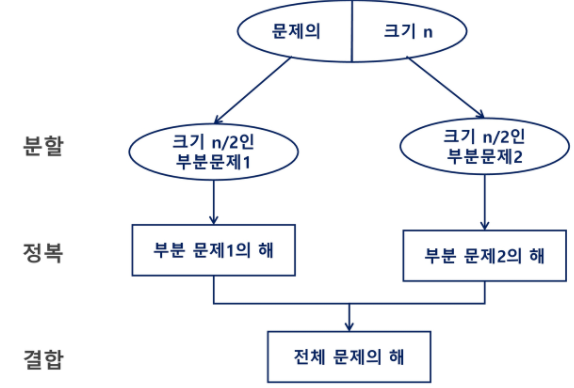
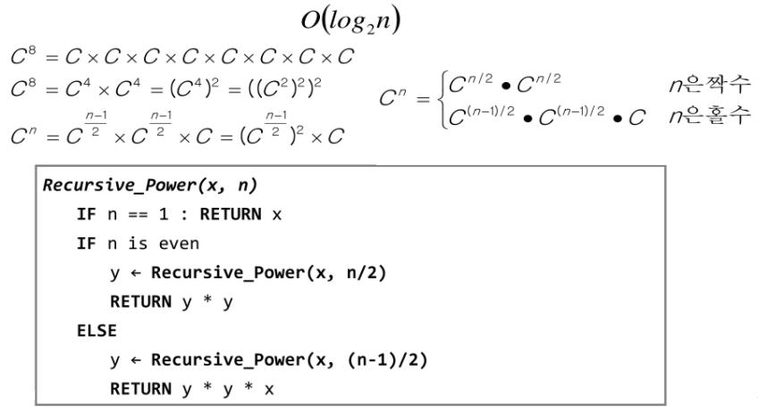
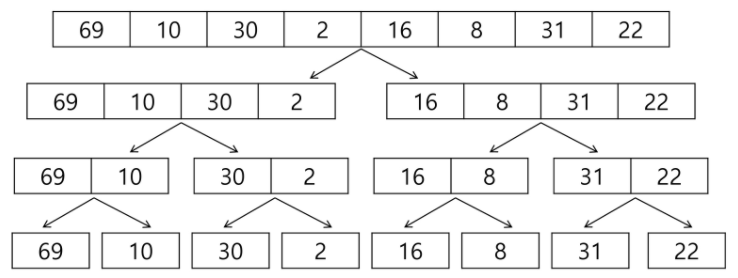
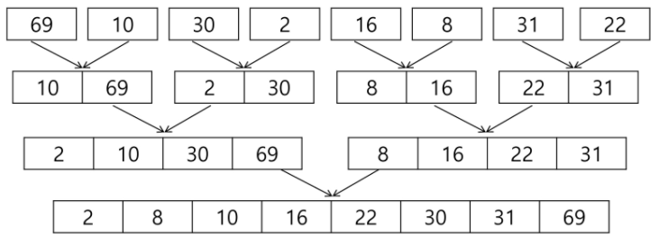
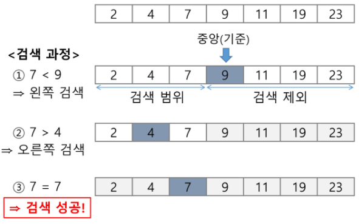
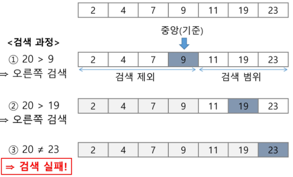

## 분할정복

- 문제를 분할해서 해결하는 방법

  - 대표적인 알고리즘 : 퀵 정렬, 병합정렬

- 분할 정복 기법 (Top-down approach)

  1. 분할(Divide) : 해결할 문제를 여러 개의 작은 부분으로 나눈다
  2. 정복(Conquer) : 나눈 작은 문제를 각각 해결
  3. 통합(Combine) : (필요하다면) 해결된 해답을 모은다

  

- 시간 복잡도

  


##### * 병합정렬(Merge Sort)

- 여러 개의 정렬된 자료의 집할을 병합하여 한 개의 정렬된 집합으로 만드는 방식

- 분할 정복 알고리즘 활용

  - 자료를 최소 단위의 문제까지 나눈 후에 차례대로 정렬하여 최종 결과를 얻어냄

  - top-down 방식

- 시간 복잡도 : O(n log n)

- 외부 정렬의 기본이 되는 정렬 알고리즘

- {69, 10, 30, 2, 16, 8, 31, 22}를 병합 정렬하는 과정

  - 분할 단계 

    - 전체 자료 집합에 대하여, 최소 크기의 부분집합(1개)이 될 때까지 분할 작업을 계속한다

      

  - 병합

    - 2개의 부분집합을 정렬하면서 하나의 집합으로 병합

      1. 각 부분집합의 맨 앞 원소를 가르키는 index를 준비해놓고  서로비교

      2. 작은 쪽이 복사되고 작은 쪽의 index증가

      3. 반복 (8개의 부분집합이 1개로 병합될 때까지 반복)

         

- 알고리즘

  - 분할 과정

    - 슈더코드

      ```
      merge_sort(LIST m)
      	if length

    - 구현

      ```python
      def mergesort(lst):
          if len(lst) == 1:
              return lst
          m = len(lst) // 2
          left = lst[:m]
          right = lst[m:]
          a = mergesort(left)
          b = mergesort(right)
          res = merge(a, b)
          return res

  - 병합 과정

    - 슈더코드

      ```

    - 구현

      ```python
      def merge(left, right):
          l = r = 0
          res = []
          while l != len(left) and r != len(right) :
              if left[l] < right[r]:
                  res.append(left[l])
                  l += 1
              else:
                  res.append(right[r])
                  r += 1
      
          if l != len(left):
              for l in left[l:]:
                  res.append(l)
          elif r != len(right):
              for l in right[r:]:
                  res.append(l)
          return res


##### * 퀵 정렬

- 주어진 배열을 두 개로 분할하고, 각각을 정렬

- 매우 큰 입력 데이터에 대해서 좋은 성능을 보이는 알고리즘

- 병합 정렬과 다른 점

  1. 병합 정렬은 단순하게 두 부분으로 나누는 반면에, 퀵 정렬은 분할할 때 **기준 아이템(pivot item) 중심**으로 이보다 작은 것은 왼편, 큰 것은 오른편에 위치시킨다.
     - pivot의 위치는 어디든지 될 수 있다.
  2. 각 부분 정렬이 끝난 후, 병합정렬은 "병합"이란 후처리 작업필요하나 퀵 정렬은 필요X

- 알고리즘

  - quickSort

    - 슈더코드

      ```
      quickSort(A[], l, r) # l:왼쪽 index, r:오른쪽 index
      	if l < r
      		s <- partition(a, l, r)
      		quickSort(A[], l, s -1)
      		quickSort(A[], s+1, r)

  - Hoare-Partition 알고리즘 (partition은 pivot의 위치를 잡아준다)

    - 슈더코드

      ```
      partition(A[], l, r)
      	p -< A[l] # p: 피봇 값 , 기준
      	i <- l, j <- r
      	WHILE i <= j # i와 j가 역전되기 전까지 반복
      		WHILE i < j  and A[i] <= p: i++
      		WHILE i < j  and A[i] >= p: j--
      		IF i < j: swap(A[i], A[j])
      		
      	swap(A[l], A[j])
      	RETURN j

    - 구현

      ```python
      # pivot을 첫번째로 잡았을 때
      def partition(l, r):
          p = l
          i = l
          j = r
      
          while i<j:
              while i<r and lst[i] <= lst[p]:
                  i += 1
      
              while l<j and lst[j] >= lst[p]:
                  j -= 1
      
              if i<j:
                  lst[i], lst[j] = lst[j], lst[i]
      
          lst[p], lst[j] = lst[j], lst[p]
          return j
      
      # pivot을 마지막으로 잡았을 때
      def partition(l, r):
          p = r
          i = l
          j = r
      
          while i<j:
              while i<r and lst[i] <= lst[p]:
                  i += 1
      
              while l<j and lst[j] >= lst[p]:
                  j -= 1
      
              if i<j:
                  lst[i], lst[j] = lst[j], lst[i]
      
          lst[p], lst[i] = lst[i], lst[p]
          return j

  - Lomuto partition 알고리즘 (피봇이 한쪽에 치우치면 효율이 떨어진다)

    - 슈더코드

      ```
      partition(A[], l, r)
      	x <- A[r]
      	i <- l-1
      	
      	FOR j in p -> r-1
      		IF A[j] <= x
      			i++, swap(A[i], A[j])
      	
      	swap(A[i+1], A[r])
      	RETURN i+1

    - 구현

      ```python
      def partition(l, r):
          x = lst[r]
          i = l - 1
          for i in range(1, r):
              if lst[j] < x:
                  i += 1
                  lst[i], lst[j] = lst[j], lst[i]
      
          lst[r], lst[i+1] = lst[i+1], lst[r]
      
          return i+1


##### * 이진 검색(Binary Search)

- 자료의 가운데에 있는 항목의 키 값과 비교하여 다음 검색의 위치를 결정하고 검색을 계속 진행하는 방법
  - 목적 키를 찾을 때까지 이진 검색을 순환적으로 반복 수행, 검색 범위 반으로 줄여나감
- 이진 검색을 하기 위해서는 자료가 정렬된 상태여야 한다

- 과정
  1. 자료의 중앙에 있는 원소를 고른다
  2. 중앙 원소의 값과 찾고자 하는 목표값을 비교
  3. 목표 값이 중앙 원소의 값보다 작으면 자료의 왼쪽 반에 대해서 검색을 수행, 크다면 자료의 오른쪽 반에 대해서 검색을 수행
  4. 찾고자 하는 값을 찾을 때까지 1~3 과정 반복

- ex) 2, 4, 7, 9, 11, 19, 23

  1. 이진 검색으로 7찾기

     

  2. 이진 검색으로 20찾기

     

- 알고리즘

  - 반복구조

    ```

  - 재귀구조

    ```python
    def binary_search_recursion(l, r, key):
        if l > r:
            return 0
        else:
            mid = (l+r)//2
            if key == A[mid]:
                return 1
            elif key < A[mid]:
                return binary_search_recursion(l, mid-1, key)
            else:
                return binary_search_recursion(mid+1, r, key)
    	return 0

