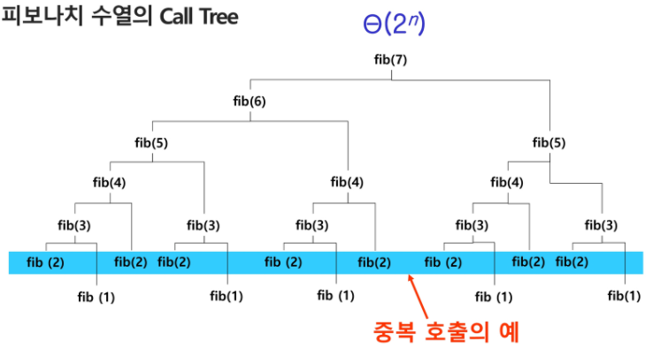
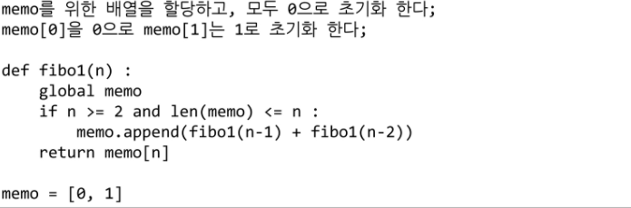

- 피보나치를 재귀함수로 구현한 알고리즘의 문제점

  - 중복호출(똑같은 값을 여러번 구하는 것)이 존재

- 피보나치 수열의 Call Tree

  

## Memorization

- 한번 계산했던 값은 저장한 뒤 불러오자

- 컴퓨터 프로그램을 실행할 때 이전에 계산한 값을 메모리에 저장해서 매번 다시 계산하지 않도록하여 전체적인 실행속도를 빠르게 하는 기술

  - 동적 계획법의 핵심이 되는 기술

- 피보나치 수를 구하는 알고리즘에서 fibo(n)의 값을 계산하자마자 저장하면(memonize), 실행시간을 O(n)으로 줄일 수 있다

- 알고리즘

  ```
  def fibo(n):
  	global cnt
  	cnt += 1
  	if n>=2 and memo[n]==0: # 아직 계산되지 않은 값이면
  		memo[n] = fibo(n-1) + fibo(n-2)
  	return memo[n]
  
  n = 50
  memo = [0] * (n+1) # n값 자체를 index로 쓰기위하여 n+1
  memo[0] = 0
  memo[1] = 1
  cnt = 0
  print(fibo(n), cnt)
  ```

  - append를 이용하여 구현

    ```
    def fibo1(n):
    	if n>=2 and len(memo1)<=n:
    		memo1.append(fibo1(n-1) + fibo1(n-2))
    	return memo1[n]
    
    n = 50
    memo1 = [0,1]
    print(fibo1(n))
    ```

    

  

  - Testcase가 10개이고 fibo(5), fibo(10), fibo(15)를 구하라는 문제가 있을 때 testcase 수만큼 계속 돌리지 않고 memorization 배열(값을 저장하는 배열)을 n의 최대 값만큼 만들어놓고 값 구하는게 좋다
    - memo = [0] * (n+1)

