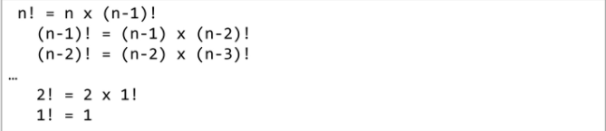
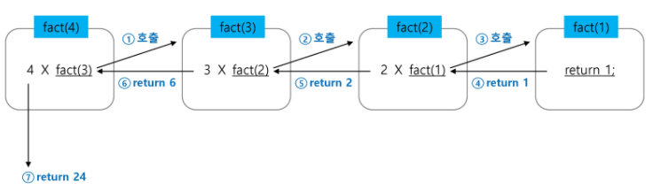
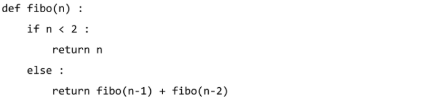
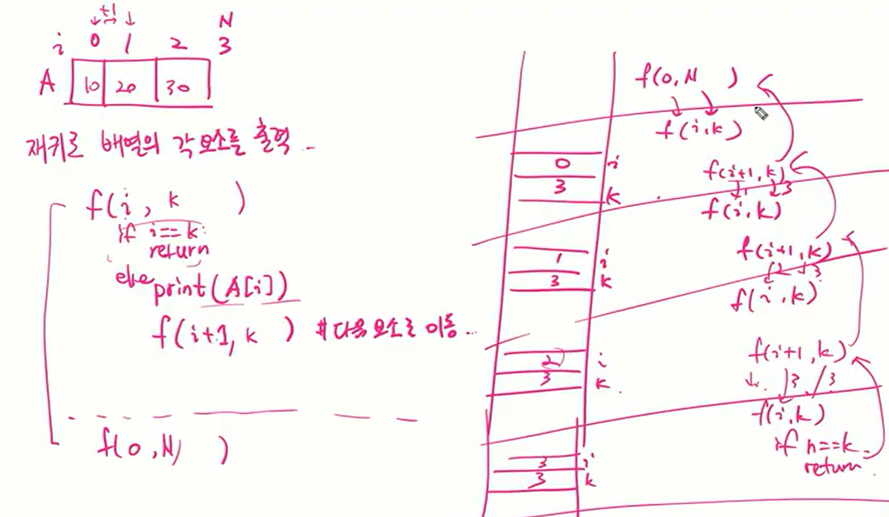

## 재귀호출

- 함수 호출을 스택프레임을 통해 이해해보자
- 자기 자신을 호출하여 순환 수행되는 것
- 재귀함수를 이용할 때는 base 코드(빠져나가는 부분), 일반적으로 재귀가 호출되는 부분이 명확하게 나뉘어지게 코드를 구성해야한다.
  - 구조적으로 base부분을 if, 호출되는 부분을 else로 두고 만들면 보기 좋다

- 함수에서 실행해야 하는 작업의 특성에 따라 일반적인 호출방식보다 재귀호출방식을 사용하여 함수를 만들면 프로그램의 크기를 줄이고 간단하게 작성

  - 재귀 호출의 예) factorial

    - n에 대한 factorial : 1부터 n 까지의 모든 자연수를 곱하여 구하는 연산

      

    - 마지막에 구한 하위 값을 이용하여 상위 값을 구하는 작업을 반복

    - n = 4인 경우의 실행

      

    - ex)

      ```
      def fact(n):
          if n == 1:
              return n
          result = n*fact(n-1)
          return result
      
      print(fact(5))
      ```

  - 피보나치

    - 0과 1로 시작하고 이전의 두수 합을 다음 항으로 하는 수열을 피보나치라 한다

      - 0, 1, 1, 2, 3, 5, 8, 13, ......

    - 피보나치 수열의 i번 째 값을 계산하는 함수 F를 정의하면 다음과 같다

      - F(0) = 0, F(1) = 1
      - F(i) = F(i-1) + F(i-2) , i >=2 

      

    - ex)

      ```
      def fibo(n):
          if n<2:
              return n
          return fibo(n-1) + fibo(n-2)
      
      print(fibo(4)) # 3
      ```

- 증가하는 방향으로 재귀호출을 하게되면 접근위치, 경계를 이용

  ```
  def f(i, k):
  	if i==k: # 배열을 벗어나면(모든 원소에 대한 작업이 끝나면)
  		return
  	else:
  		print(A[i])
  		f(i+1, k) # 다음 원소로 이동
  N = 3
  A = [10, 20, 30]
  f(0, N) # 배열을 출력하는 함수
  ```

  

  


---

---

- 피보나치를 재귀함수로 구현한 알고리즘의 문제점

  - 중복호출(똑같은 값을 여러번 구하는 것)이 존재

- 피보나치 수열의 Call Tree

  

## Memorization

- 한번 계산했던 값은 저장한 뒤 불러오자

- 컴퓨터 프로그램을 실행할 때 이전에 계산한 값을 메모리에 저장해서 매번 다시 계산하지 않도록하여 전체적인 실행속도를 빠르게 하는 기술

  - 동적 계획법의 핵심이 되는 기술

- 피보나치 수를 구하는 알고리즘에서 fibo(n)의 값을 계산하자마자 저장하면(memonize), 실행시간을 O(n)으로 줄일 수 있다

- 알고리즘

  ```
  def fibo(n):
  	global cnt
  	cnt += 1
  	if n>=2 and memo[n]==0: # 아직 계산되지 않은 값이면
  		memo[n] = fibo(n-1) + fibo(n-2)
  	return memo[n]
  
  n = 50
  memo = [0] * (n+1) # n값 자체를 index로 쓰기위하여 n+1
  memo[0] = 0
  memo[1] = 1
  cnt = 0
  print(fibo(n), cnt)
  ```

  - append를 이용하여 구현

    ```
    def fibo1(n):
    	if n>=2 and len(memo1)<=n:
    		memo1.append(fibo1(n-1) + fibo1(n-2))
    	return memo1[n]
    
    n = 50
    memo1 = [0,1]
    print(fibo1(n))
    ```

    

  

  - Testcase가 10개이고 fibo(5), fibo(10), fibo(15)를 구하라는 문제가 있을 때 testcase 수만큼 계속 돌리지 않고 memorization 배열(값을 저장하는 배열)을 n의 최대 값만큼 만들어놓고 값 구하는게 좋다
    - memo = [0] * (n+1)

