##### * Stack이라는 자료구조를 이용해서 무엇을 할 수 있을까??

- 재귀호출 + Memoization, DP, DFS

## 스택(stack)

- 쌓다라는 의미로 먼저 들어온 물건은 나중에 나갈 수 있고, 나중에 들어온 물건은 먼저 나갈 수 있는 자료구조
  
  - 선입후출 or 후입선출 구조라고 한다
  
- 특성

  1. 물건을 쌓아 올리듯 자료를 쌓아 올린 형태의 자료구조(저장하는 방법)

  2. 스택에 저장된 자료는 선형 구조를 갖는다

     - 선형 구조 : 1, 2차원 배열, 연결리스트, 스택, 큐, 덱 등
       - 자료간의 관계가 1:1 관계
     - 비선형 구조 : 트리, 그래프 등
       - 자료간의 관계가 1:多, 多:多 관계
       - 규칙이 없다

  3. 스택에 자료를 삽입, 자료를 꺼낼 수 있다

  4. 마지막에 삽입한 자료를 가장 먼저 꺼낸다. : 후입선출(LIFO, Last-in-First-Out)

     ex) 스택에 1,2,3 순으로 자료를 삽입한 후 꺼내면 역순으로 3,2,1순으로 꺼낼 수 있다

  5. 중간이나 아래에 있는 데이터는 바로 접근할 수 없다

- 스택을 프로그램에서 구현하기 위해서 필요한 자료구조와 연산

  - 자료 구조 : 자료를 선형으로 저장할 저장소

    - C언어에서는 배열사용
    - 저장소 자체를 스택이라 부르기도 한다
    - 스택에서 마지막 삽입된 원소의 위치를 top이라 부른다

  - 연산

    - 삽입 : 저장소에 자료를 저장, **push**라고 부른다
    - 삭제 : 저장소에서 자료를 꺼낸다, 꺼낸 자료는 삽입한 자료의 역순, **pop**이라 부른다
    - 스택이 공백인지 아닌지를 확인하는 연산 : **isEmpty**

    - 스택의 top에 있는 item(원소)을 확인하는 연산 : **peek**

- 스택의 삽입/삭제 과정

  - 빈 스택에 원소 A, B, C를 차례로 삽입 후 한번 삭제하는 연산과정 

  ```
  #stack을 만들 때
  stack = [0] * ??
  
  #push
  push(n) # 넣고자하는 데이터를 받아야 한다
  	top += 1
  	stack[top] = n
  	return True/ False/ None/ top의 position을 return해주기도 함
  
  #pop : 자료를 꺼낼 때 기존의 top 지우지 않아도 새로 push할 때 데이터가 덮어 씌워진다
  pop()
  	t = stack[top]
  	top -= 1
  	return t
  ```

  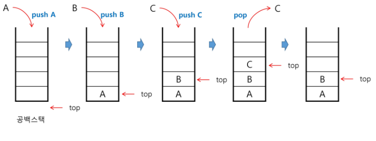

- 스택의 push 알고리즘

  - Appen 메소드를 통해 리스트의 마지막에 데이터를 삽입

  ```
  def push(item):
  	s.append(item)
  ```

- 스택의 pop 알고리즘

  ```
  def pop():
  	if len(s) == 0: # 디버깅 용도, 보통 스택이 비어있는지 비어있지 않은지 먼저 검사한 후 pop실행
  		# underflow : 모자라는데 꺼낼 때
  		return
  	else:
  		return s.pop(-1) # 배열의 마지막에 있는 데이터 
  ```

- 스택의 peak 알고리즘

  ```
  def peak():
  	if len(s) != 0:
  		return stack[-1]

- ex)

  ```
  def push(n):
      s.append(n)
  
  def pop():
      if len(s) == 0:
          return -1
      return s.pop(-1)
  
  s = []
  
  for i in range(5):
      push(i)
  
  print(s) # [0, 1, 2, 3, 4]
  
  for i in range(3):
      print(pop()) #4, 3, 2
  print(s) [0, 1]
  ```

- 스택 구현 고려 사항

  - 1차원 배열을 사용하여 구현할 경우 구현이 용이한다는 장점이 있지만 스택의 크기를 변경하기가 어렵다
    - 동적 연결리스트를 이용하여 구현하여 위의 문제점을 해결


- 스택의 응용

  1. 괄호 검사

     - 종류 : 대괄호('[', '']'), 중괄호('{', '}'), 소괄호('(', ')')

     - 조건

       1. 왼쪽 괄호의 개수와 오른쪽 괄호의 개수가 같아야 한다
       2. 같은 괄호에서 왼쪽 괄호는 오른쪽 괄호보다 먼저 나와야 한다
       3. 괄호 사이에는 포함 관계만 존재

     - 잘못된 괄호 사용의 예

       ```
       (a(b)
       a(b)c)
       a{b(c[d]e})
       ```

     - 스택을 이용한 괄호 검사

       - )가 나왔는데 stack이 비어있는 경우도 오류다

     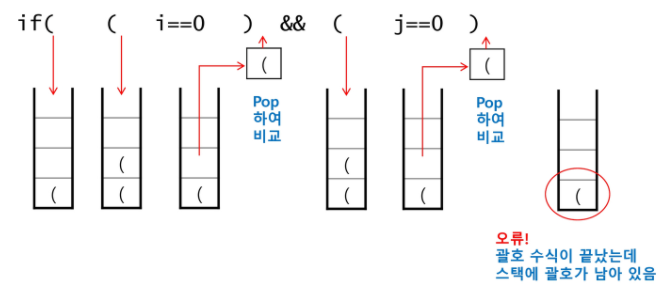

     - 괄호를 조사하는 알고리즘 개요

       1. 문자열에 있는 괄호를 차례대로 조사하면서 왼쪽 괄호를 만나면 스택에 삽입(push), 오른쪽 괄호를 만나면 스택에서 top괄호를 삭제(pop)한 후 오른쪽 괄호와 짝이 맞는지를 검사
       2. 스택이 비어 있으면 조건 1 또는 조건 2에 위배, 괄호의 짝이 맞지 않으면 조건3에 위배
       3. 마지막 괄호까지를 조사한 후에도 스택에 괄호가 남아 있으면 조건 1에 위배

     - ex)

       ```
       s1 = '( )( )((( )))'
       #s1 = '(( )'
       # s1 = '( ))'
       
       ST = []
       result = 'OK'
       for c in s1:
           if c=='(':
               ST.append(c)
           if c==')':
               if len(ST) == 0: # 수식이 아직 안끝났는데 스택에 괄호가 없는 경우
                   result = 'ERR'
                   break
       
               ST.pop(-1)
       
       if len(ST) > 0: # 괄호 수식이 끝났는데 스택에 괄호가 남아있는 경우
           result = 'ERR'
       
       print(result)
       ```

       

  2. Function call

     - 프로그램 안에서 사용되는 메모리중 스택이 존재
     - 프로그램에서의 함수 호출과 복귀에 따른 수행 순서를 관리
       - 가장 마지막에 호출된 함수가 가장 먼저 실행을 완료 복귀하는 후입선출 구조, 후입선출 구조의 스택을 이용하여 수행순서 관리
       - 함수호출이 발생하면 호출한 함수 수행에 필요한 지역변수, 매개변수 및 수행 후 복귀할 주소 등의 정보를 스택 프레임(stack frame)에 저장하여 시스템 스택에 삽입
       - 함수의 실해이 끝나면 시스템 스택의 top원소(스택 프레임)를 삭제(pop)하면서 프레임에 저장되어 있던 복귀주소를 확인하고 복귀
       - 함수 호출과 복귀에 따라 이 과정을 반복하여 전체 프로그램 수행이 종료되면 시스템 스택은 공백 스택이 된다

     - 함수 호출과 복귀에 따른 전체 프로그램의 수행 순서

       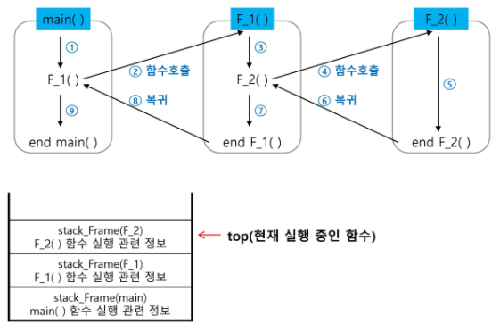


## 재귀호출

- 함수 호출을 스택프레임을 통해 이해해보자

  - 함수가 호출될 때 스택이 쌓인다

- 자기 자신을 호출하여 순환 수행되는 것

- 재귀함수를 이용할 때는 base 코드(빠져나가는 부분), 일반적으로 재귀가 호출되는 부분이 명확하게 나뉘어지게 코드를 구성해야한다.
  - 구조적으로 base부분을 if, 호출되는 부분을 else로 두고 만들면 보기 좋다

- 함수에서 실행해야 하는 작업의 특성에 따라 일반적인 호출방식보다 재귀호출방식을 사용하여 함수를 만들면 프로그램의 크기를 줄이고 간단하게 작성

  - 재귀 호출의 예) factorial

    - n에 대한 factorial : 1부터 n 까지의 모든 자연수를 곱하여 구하는 연산

      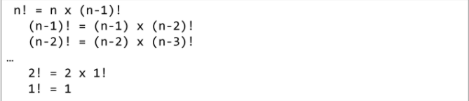

    - 마지막에 구한 하위 값을 이용하여 상위 값을 구하는 작업을 반복

    - n = 4인 경우의 실행

      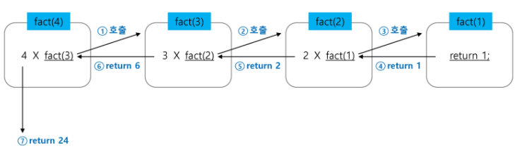

    - ex)

      ```
      def fact(n):
          if n == 1:
              return n
          result = n*fact(n-1)
          return result
      
      print(fact(5))
      ```

  - 피보나치

    - 0과 1로 시작하고 이전의 두수 합을 다음 항으로 하는 수열을 피보나치라 한다

      - 0, 1, 1, 2, 3, 5, 8, 13, ......

    - 피보나치 수열의 i번 째 값을 계산하는 함수 F를 정의하면 다음과 같다

      - F(0) = 0, F(1) = 1
      - F(i) = F(i-1) + F(i-2) , i >=2 

      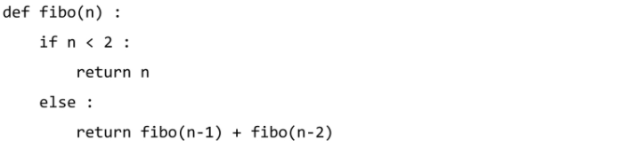

    - ex)

      ```
      def fibo(n):
          if n<2:
              return n
          return fibo(n-1) + fibo(n-2)
      
      print(fibo(4)) # 3
      ```

- 증가하는 방향으로 재귀호출을 하게되면 접근위치, 경계를 이용

  ```
  def f(i, k):
  	if i==k: # 배열을 벗어나면(모든 원소에 대한 작업이 끝나면)
  		return
  	else:
  		print(A[i])
  		f(i+1, k) # 다음 원소로 이동
  N = 3
  A = [10, 20, 30]
  f(0, N) # 배열을 출력하는 함수
  ```

  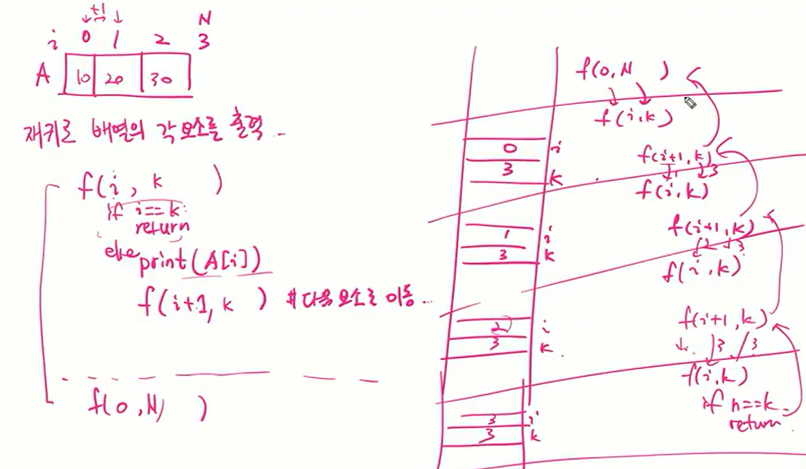


---

---

- 피보나치를 재귀함수로 구현한 알고리즘의 문제점

  - 중복호출(똑같은 값을 여러번 구하는 것)이 존재

- 피보나치 수열의 Call Tree

  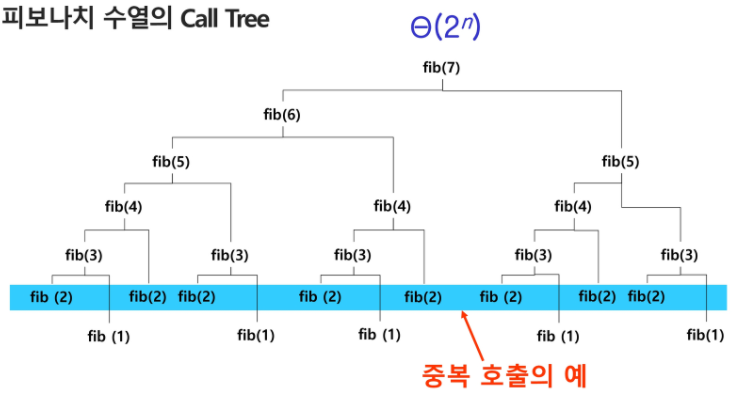

## Memoization

- 한번 계산했던 값은 저장한 뒤 불러오자

- 컴퓨터 프로그램을 실행할 때 이전에 계산한 값을 메모리에 저장해서 매번 다시 계산하지 않도록하여 전체적인 실행속도를 빠르게 하는 기술

  - 동적 계획법의 핵심이 되는 기술

- 피보나치 수를 구하는 알고리즘에서 fibo(n)의 값을 계산하자마자 저장하면(memonize), 실행시간을 O(n)으로 줄일 수 있다

- 알고리즘

  ```
  def fibo(n):
  	#if n < 2: # 계속 저장이 일어나므로 밑에서 0과 1은 함수 호출되기전에 미리 정의
  	#	memo[n] = n
  	#	return meno[n]
  	if n >= 2 and memo[n] ==0:
  		memo[n] = fibo[n-1] + fibo(n-2)
  	return memo[n]
  
  n = 10
  memo = [0] * (n+1)
  memo[0] = 0
  memo[1] = 1
  fibo(10)
  ```

  ```
  def fibo(n):
  	global cnt
  	cnt += 1
  	if n>=2 and memo[n]==0: # 아직 계산되지 않은 값이면
  		memo[n] = fibo(n-1) + fibo(n-2)
  	return memo[n]
  
  n = 50
  memo = [0] * (n+1) # n값 자체를 index로 쓰기위하여 n+1
  memo[0] = 0
  memo[1] = 1
  cnt = 0
  print(fibo(n), cnt)
  ```

  - append를 이용하여 구현

    ```
    def fibo1(n):
    	if n>=2 and len(memo1)<=n:
    		memo1.append(fibo1(n-1) + fibo1(n-2))
    	return memo1[n]
    
    n = 50
    memo1 = [0,1]
    print(fibo1(n))
    ```

    

  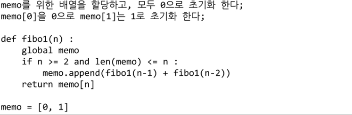

  - Testcase가 10개이고 fibo(5), fibo(10), fibo(15)를 구하라는 문제가 있을 때 testcase 수만큼 계속 돌리지 않고 memorization 배열(값을 저장하는 배열)을 n의 최대 값만큼 만들어놓고 값 구하는게 좋다
    - memo = [0] * (n+1)


## DP(Dynamic Programming) - 뒤에서 다시 다룸

- 그리디 알고리즘과 같이 **최적화 문제(가장 좋은 해를 찾는)**를 해결하는 알고리즘

- 먼저 입력 크기가 작은 부분 문제들을 모두 해결한 후에 그 해들을 이용하여 보다 큰 크기의 부분 문제들을 해결하여, 최종적으로 원래주어진 입력의 문제를 해결하는 알고리즘

- 어디를 방문했는지 check할 때 중복이 일어나서는 안 된다

- 피보나치 수 DP적용

  - 피보나치 수는 부분 문제의 답으로부터 본 문제의 답을 얻을 수 있으므로 최적 부분 구조로 이루어져 있음

  1. 문제를 부분 문제로 분할
     - Fibonacci(n) 함수는 Fibonacci(n-1)과 Fibonacci(n-2)의 합
     - Fibonacci(n-1) 함수는 Fibonacci(n-2)과 Fibonacci(n-3)의 합
     - Fibonacci(2) 함수는 Fibonacci(1)과 Fibonacci(0)의 합
     - Fibonacci(n)은 Fibonacci(n-1), Fibonacci(n-2), ... Fibonacci(2), Fibonacci(1), Fibonacci(0)의 부분집합으로 나뉜다

  2. 부분 문제로 나누는 일을 끝냈으면 가장 작은 부분 문제부터 해를 구한다

  3. 그 결과는 테이블에 저장하고, 테이블에 저장된 부분 문제의 해를 이용하여 상위 문제의 해를 구한다

     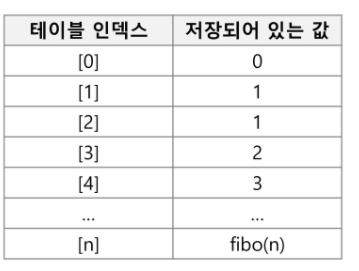

- memoization과의 차이

  - Memo는 재귀호출 DP는 반복

- 피보나치 수 DP 적용 알고리즘

  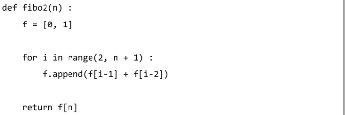

  - ex)

    ```
    def fibo(n):
        table[0] = 0
        table[1] = 1
    
        for i in range(2, n+1):
            table[i] = table[i-1] + table[i-2]
    
        return table[n]
    
    n = int(input())
    table = [0] * (n+1)
    
    print(fibo(n))
    ```

- DP의 구현 방식

  - recursive 방식

    ```
    def fibo1(n):
    	if n>=2 and len(memo1)<=n:
    		memo1.append(fibo1(n-1) + fibo1(n-2))
    	return memo1[n]
    
    n = 50
    memo1 = [0,1]
    print(fibo1(n))
    ```

  - iterative 방식

    ```
    def fibo(n):
        table[0] = 0
        table[1] = 1
    
        for i in range(2, n+1):
            table[i] = table[i-1] + table[i-2]
    
        return table[n]
    
    n = int(input())
    table = [0] * (n+1)
    
    print(fibo(n))
    ```

  - memoization을 재귀적 구조에 사용하는 것보다 반복적 구조로 DP를 구현한 것이 성능 면에서 보다 효율적
  - 재귀적 구조는 내부에 시스템 호출 스택을 사용하는 오버헤드가 발생하기 때문이다


## DFS(깊이우선탐색)

[참고사이트](https://algorithm-visualizer.org/brute-force/depth-first-search)

- 내가 목표지점까지 한군데도 빠짐없이 가고 있는 도중에 어느 곳을 갔는지 기억하는 것 

- Tree의 Branch가 다 끝날 때 까지 계속 탐색 수행, 해당 Branch가 끝나면 다른 Branch로 이동하는 로직

- 비선형구조인 그래프 구조는 그래프로 표현된 모든 자료를 **중복없이** **빠짐없이 검색**하는 것이 중요

  - 선형 구조 : 1, 2차원 배열, 연결리스트, 스택, 큐, 덱 등
    - 자료간의 관계가 1:1 관계
  - 비선형 구조 : 트리, 그래프 등
    - 자료간의 관계가 1:多, 多:多 관계
    - 규칙이 없다

- 비선형구조 탐색 두가지 방법
  1. 깊이 우선 탐색(Depth First Search, DFS)
  2. 너비 우선 탐색(Breadth First Search, BFS)

- 시작 정점의 한 방향으로 갈 수 있는 경로가 있는 곳까지 탐색해 가다가 **더 이상 갈 곳이 없게되면**, 가장 마지막에 만났던 갈림길 간선이 있는 정점으로 되돌아와서 다른 방향의 정점으로 탐색을 계속 반복하여 결국 모든 정점을 방문하는 순회방법

- 가장 마지막에 만났던 갈김길의 정점으로 되돌아와서 다시 깊이 우선 탐색을 반복해야 하므로 후입선출 구조의 스택 사용

- 깊이 우선 탐색에는 내가 지나온 경로를 최근 순으로 꺼낼 수 있어야한다. 경로를 저장할 수 있는 방법으로 스택을 사용할 수 있다

- DFS 알고리즘

  1. 자료간의 구조를 python에서 사용할 수 있게 2차원 배열(인접 행렬) or 리스트(인접 리스트)를 통해 구현

     - 인접 행렬

       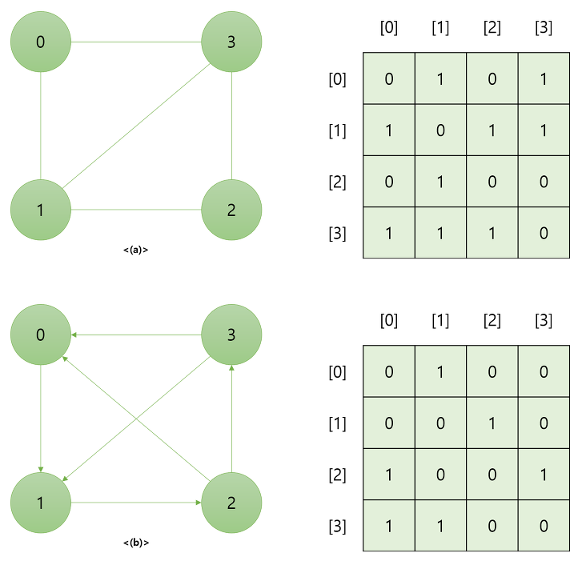

     - 인접 리스트

       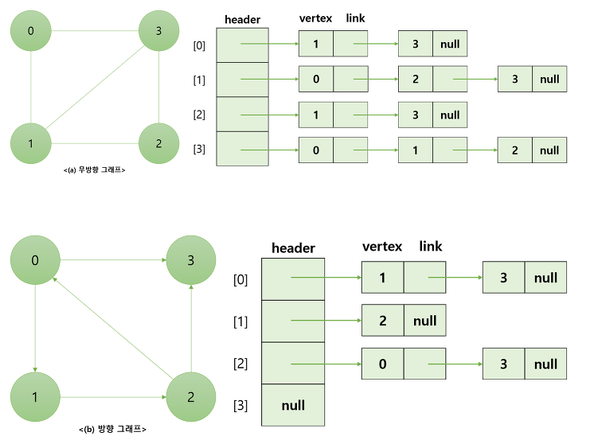

  2. 시작 정점 v를 결정

     - 시작점에서 가장 멀리 갈 수 있는 경로를 탐색

  3. 정점 v에 인접한 정점 중에서 (인접 : 두점이 연결 a-b , 방향이 있으면 a -> b : a가 b에 인접, a가 b에 갈수 있으면 인접이라고 한다 )

     - 방문하지 않은 정점 w가 있으면, 정점 v를 스택에 push하고 정점 w 를 방문, w를 v로하여 2번 반복

     - 방문하지 않은 정점이 없으면, 탐색의 방향을 바꾸기 위해서 스택을 pop하여 받은 가장 마지막 방문 정점을 v로 하여 2번 반복

  4. 스택이 공백이 될 때까지 2번을 반복

  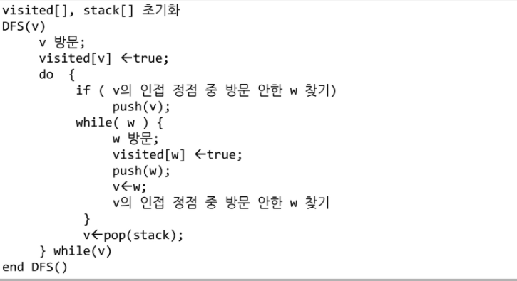

  - ex)

    ```
    def dfs(s, V):
    	visited = [0]*(V+1)
    	stack = [s]
    	visited[s] = 1
    	i = s # 현재 방문한 정점 i
    	print(node[i])
    	while i !=0: # True:
    		for w in range(1, V+1):
    			if adj[i][w] == 1 and visited[w] ==0:
    				stack.append(i) # 반문 경로 저장
    				i = w # 새 방문지 이동
    				visited[w] = 1
    				print(node[w])
    				break
    		else:
    			if stack:
    				i = stack.pop()
    			else:
    				i = 0
    
    # adj배열은 각 노드들간의 관계를 표현하였다.
    adj =[[0, 0, 0, 0, 0, 0, 0, 0],
    	  [0, 0, 1, 1, 0, 0, 0, 0], # A
    	  [0, 1, 0, 0, 1, 1, 0, 0], # B
    	  [0, 1, 0, 0, 0, 1, 0, 0], # C
    	  [0, 0, 1, 0, 0, 0, 1, 0], # D
    	  [0, 0, 1, 1, 0, 0, 1, 0], # E
    	  [0, 0, 0, 0, 1, 1, 0, 1], # F
    	  [0, 0, 0, 0, 0, 0, 1, 0], # G
    ]
    
    node = ['', 'A', 'B', 'C', 'D', 'E', 'F', 'G']
    dfs(1,7)
    
    #출력
    A
    B
    D
    F
    E
    C
    G
    ```
    
    ```
    func dfs1(v int, visited []bool, graph [][]int) {
       stack := []int{v}
       for len(stack) > 0 {
          node := stack[len(stack)-1]
          stack = stack[:len(stack)-1]
          visited[node] = true
          // fmt.Println(node)
          for _, nd := range graph[node] {
             if visited[nd] == false {
                stack = append(stack, nd)
             }
          }
       }
    }
    
    func dfs2(v int, visited []bool, graph [][]int) {
       visited[v] = true
       // fmt.Println(v)
       for _, node := range graph[v] {
          if visited[node] == false {
             dfs2(node, visited, graph)
          }
       }
    }

- 자료간의 구조를 python에서 사용할 수 있게 구현하는 방법들과 3가지 방법 풀이

  - ex)

    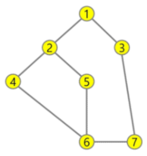

  1. ```
     lst =[1, 2, 1, 3, 2, 4, 2, 5, 4, 6, 5, 6, 6, 7, 3, 7]
     
     def findw(v):
         for i in range(0, len(lst), 2):
             if v == lst[i] and visited[lst[i+1]] ==False:
                 return lst[i+1]
             if v == lst[i+1] and visited[lst[i]] ==False:
                 return lst[i]
     
         return -1
     
     def dfs(v):
         visited[v] = True
         print(v)
         stack.append(v)
         while len(stack) > 0: # stack이
             w = findw(v)
             if w != -1:
                 stack.append(v)
                 visited[w] = True
                 print(w)
                 v = w
             else:
                 v = stack.pop(-1)
     
     n = 7
     visited = [False] * (n+1) # n대신 n+1한 이유 : 0번 비워 놓는다
     stack = []
     dfs(1)
     ```

  2. ```
     G = {0:[], 1:[2, 3], 2:[1, 4, 5], 3:[1, 7], 4:[2, 6], 5:[2, 6], 6:[4, 5, 7], 7:[3, 5]}
     
     def findw(v):
         for w in G[v]:
             if visited[w] == False:
                 return w
         return -1
     
     def dfs(v):
         visited[v] = True
         print(v)
         stack.append(v)
         while len(stack) > 0: # stack이
             w = findw(v)
             if w != -1:
                 stack.append(v)
                 visited[w] = True
                 print(w)
                 v = w
             else:
                 v = stack.pop(-1)
     
     n = 7
     visited = [False] * (n+1) # n대신 n+1한 이유 : 0번 비워 놓는다
     stack = []
     dfs(1)
     ```

  3. ```
     G = [[], [2, 3], [1, 4, 5], [1, 7], [2, 6], [2, 6], [4, 5, 7], [3, 5]]
     
     def dfs(v):
     	s = []
     	s.append(v)
     	while s:
     		v = s.pop(-1)
     		if not visited[v]
     			print(v, end=' ')
     			visited[v] = True
     			for w in G[v]:
     				if not visited[w]:
     					s.append(w)
     
     def dfs(v):
     	s = []
     	s.append(v)
     	while s:
     		v = s.pop(-1)
     		print(v, end=' ')
     		for w in G[v]:
     			if not visited[w]:
     				s.append(w)
     				visited[w] = True
     				
     def dfs(v):
     	visited[v] = True
     	print(v, end=' ')
     	for w in G[v]:
     		if not visited[w]:
     			dfs(w)
     
     visited = [False] * 8
     dfs(1)
     ```

     - stack배열에는 현재 노드와 간선으로 연결된 노드들을 push, 다른 노드로 이동시 해당 노드 pop, 그 노드와 간선으로 연결된 노드들을 push, 없으면 이 전 노드로 복귀하여 다른 연결된 노드로 이동

  4. ```
     adj = [[0, 0, 0, 0, 0, 0, 0, 0],
            [0, 0, 1, 1, 0, 0, 0, 0],
            [0, 1, 0, 0, 1, 1, 0, 0],
            [0, 1, 0, 0, 0, 0, 0, 1],
            [0, 0, 1, 0, 0, 0, 1, 0],
            [0, 0, 1, 0, 0, 0, 1, 0],
            [0, 0, 0, 0, 1, 1, 0, 1],
            [0, 0, 0, 1, 0, 0, 1, 0]]
            
     def findw(v):
         for i in range(len(adj[v])):
             if adj[v][i] == 1 and visited[i] == False:
                 return i
         return -1
     def findw(v):
         lst = adj[v]
         for i in range(len(lst)):
             if lst[i] == 1 and visited[i] == False:
                 return i
         return -1
     
     def dfs(v): #
         visited[v] = True
         print(v)
         stack.append(v)
         while len(stack) > 0:  # stack이
             w = findw(v)
             if w != -1:
                 stack.append(v)
                 visited[w] = True
                 print(w)
                 v = w
             else:
                 v = stack.pop(-1)
     
     n = 7
     visited = [False] * (n + 1)  # n대신 n+1한 이유 : 0번 비워 놓는다
     stack = []
     dfs(1)
     ```

  
