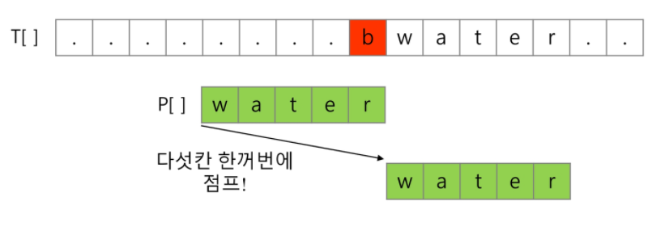

## 문자의 표현

- 컴퓨터에서의 문자표현

  - 각 문자에 대해서 대응되는 숫자를 정해 놓고 이것을 메모리에 저장하는 방법으로 사용

  - 코드체계
    -  영어가 대소문자 합쳐서 52이므로 6(64가지)비트면 모두 표현가능
    - 000000 -> 'a', 000001 -> 'b'

- 여러개의 코드체계가 존재했었지만, 네트워크(인터넷)이 발전하면서 서로의 정보를 해석하는데 문제발생

  - 문제해결 : 표준안

  

- 코드체계 표준안 : ASCII(Americal Standard Code for Information Interchange) 문자 인코딩 표준

  - 오늘날 대부분의 컴퓨터는 문자를 읽고 쓰는데 ASCII형식을 사용

  - 7bit 인코딩으로 128문자를 표현

    - 33개의 출력 불가능한 제어 문자들 + 공백을 비롯한 95개의 출력 가능한 문자들로 이뤄짐

    - 1, A, a를 16진수로 표현해보기

      - 1 = 0x31, A = 0x41, a=0x61

      

- 확장 아스키
  - 표준 문자 이외의 악센트 문자, 도형 문자, 특수 문자, 특수 기호 등 부가적인 문자를 128개 추가가능
  - 8bit를 모두 사용함으로써 추가적인 문자 표현가능
  - 컴퓨터 생산자와 SW개발자가 여러가지 다양한 문자에 할당할 수 있게 해줌
    - 할당된 확장 부호는 표준 아스키와 같이 서로 다른 프로그램이나 컴퓨터 사이에 교환X
  - 프로그램이나 컴퓨터 또는 프린터가 그것을 해독할 수 있도록 설계되어있어야만 올바르게 해독가능


- 유니코드

  - 16진수

  - 다국어 처리를 위한 표준

  - 국가간에 정보를 주고받을 때 해석하는데 문제 발생하여 만든 것

  - Character Set으로 분류

    - 유니코드를 저장하는 변수의 크기를 정의

    - 바이트 순서에 대해서 표준화하지 못하였음

    - 적당한 외부 인코딩 필요

      

  - 유니코드 인코딩(UTF : Unicode Transformation Format)

    - UTF는 기본적으로 4 byte이용
    - 가변(메모리에 대한 장점)으로 쓸 것인지, 고정(처리시간)으로 쓸 것인지
    - UTF-8(in web) - 가변
      - MIN : 8bit, Max : 32bit(1 byte * 4)
    - UTF-16(in window, java) - 가변
      - MIN : 16bit, Max : 32bit(2 byte * 2)
    - UTF-32(in unix) - 고정
      - MIN : 32bit, Max : 32bit(4 byte * 1)

- python 인코딩

  - 유니코드 UTF-8이 기본값

  - 다른 인코딩 방식으로 처리 시 첫 줄에 작성하는 위 항목에 원하는 방식을 지정

    ```
    ASCII -> #-*-coding: utf-8 -*-
    ```


## 문자열(String)


- 문자열 : 문자를 모아놓은 것

- java에서 String클래스에 대한 메모리 배치

  

- java(객체지향 언어)에서의 문자열 처리

  - 유니코드(UTF16, 2byte)로 저장

  - 문자열 데이터를 저장, 처리해주는 클래스를 제공

  - String클래스를 사용

    ```
    String str = "abc";
    String str = new String("abc")
    ```

  - 문자열 처리에 필요한 연산을 연산자, 메소드 형태로 제공
    - +, length(), replace(), split(), substring(), ...

- C언어에서 문자열 처리

  - 아스키 코드로 저장

  - 문자열은 문자들의 배열 형태로 구현된 응용 자료형

  - 문자배열에 문자열을 저장할 때는 항상 마지막에 끝을 표시하는 널문자('\0')를 넣어줘야 한다

    ```
    char ary[]= {'a', 'b', 'c', '\0'};; // 또는 char
    ary[] = "abc";
    ```

  - 문자열 처리에 필요한 연산을 함수 형태로 제공

    ```
    strlen(), strcpy(), strcmp(), .....
    ```

- python에서의 문자열 처리

  - 유니코드(UTF8)로 저
  - char 타입 없음
  - 텍스트 데이터의 취급방법이 통일
  - 문자열 기호
    - '(홑따옴표), "(쌍따옴표), '''(홑따옴표 3개), """(쌍따옴표 3개)
    - +연결(Concatenation)
      - 문자열 + 문자열 : 이어 붙여주는 역할
    - *반복
      - 문자열 * 수 : 수만큼 문자열이 반복

  - 문자열은 시퀀스 자료형으로 분류되고, 시퀀스 자료형에서 사용할 수 있는 인덱싱, 슬라이싱 연산 사용O

  - 문자열 클래스에서 제공되는 메소드

    ```
    replace('문자열에 있는 값', '바꿀 값') # 대체된 새로운 문자열을 반환
    split()
    isalpha('문자열') # 문자열이 대소문자로 되어있는지 없는지 Ture False 반환
    find()
    ```

  - 문자열은 요소값을 변경 할 수 없음(immutable)


##### * 문자열 뒤집기

- 자기 문자열에서 뒤집기

  - swap을 위한 임시 변수가 필요하며 반복 수행을 문자열 길이의 반만큼 수행

    ```
    s = list(input()) # 입력받은 문자열의 문자들을 리스트에 하나의 원소로 두고 저장
    n = len(s) # 굴자수
    for i in range(n//2):
    	swap = s[i]
    	s[i] = s[n-1-i]
    	s[n-1-i] = s[i]
    	# s[i], s[n-1-i] = s[n-1-i], s[i]
    ```

  

- 새로운 빈 문자열을 만들어 소스의 뒤에서부터 읽어서 타겟에 쓰는 방법


##### * 문자열에서 a ~ Z가 몇 개 존재한지 세는 방법

- 소문자에 한해서만 세어보기

  ```
  cnt = [0] * 26 # 배열은 a ~ z가 몇번 들어있는지 저장되어 있다.
  s ='aba'
  for x in s:
  	cnt[ord(x) - ord('a')] += 1 # 가장 낮은 값인 a의 ascii코드 값을 빼주면 배열에서의 문자위치를 알아낼 수 있다.
  print(cnt)
  ```

- 문자열이 소문자와 대문자가 같이 있을 경우

  ```
  cnt = [0] * 52 # 배열은 a ~ Z가 몇번 들어있는지 저장되어 있다.
  s ='aB1a'
  for x in s:
      if 'a' <= x <= 'z': # 소문자
          cnt[ord(x)-ord('a')] += 1 # 가장 낮은 값인 a의 ascii코드 값을 빼주면 배열에서의 문자위치를 알아낼 수 있다.
      elif 'A' <= x <= 'Z': # 대문자
         	cnt[ord(x) - ord('A') + 26] += 1 # 가장 낮은 값인 a의 ascii코드 값을 빼주고 z가 저장되어 있는 위치의 index값을 더해주면 배열에서의 문자위치를 알아낼 수 있다. 
      elif '0' <= x <= '9':
          print('숫자')
  print(cnt)
  ```

- 문자열이 소문자와 대문자 숫자로 이루어져 있을 때

  ```
  cnt = [0] * 61 # 배열은 0~9, a ~ Z가 몇번 들어있는지 저장되어 있다.
  s ='aB1a'
  for x in s:
      if 'a' <= x <= 'z': # 소문자
          cnt[ord(x)-ord('a')] += 1 # 가장 낮은 값인 a의 ascii코드 값을 빼주면 배열에서의 문자위치를 알아낼 수 있다.
      elif 'A' <= x <= 'Z': # 대문자
         	cnt[ord(x) - ord('A') + 26] += 1 # 가장 낮은 값인 A의 ascii코드 값을 빼주고 z가 저장되어 있는 위치의 index값을 더해주면 배열에서의 문자위치를 알아낼 수 있다. 
      elif '0' <= x <= '9':
      	cnt[ord(x) - ord('1') + 51] += 1 # 가장 낮은 값인 '1'의 ascii코드 값을 빼주고 Z가 저장되어 있는 위치의 index값을 더해주면 배열에서의 문자위치를 알아낼 수 있다.
          # cnt[51 + int(x)] += 1 # 0 ~ 51 : a ~ Z의 위치, 52 ~ 61 : 0 ~9 위치     
  print(cnt)
  ```

  

##### * 문자열 비교

- c strcmp()함수를 제공

  

- java에서는 equals() 메소드 제공

  - 문자열 비교에서 ==연산은 메모리 참조가 같은지를 묻는 것

- 파이썬 에서는 == 연산자와 is 연산자를 제공

  - == 연산자는 내부적으로 특수(매직) 메서드 eq()를 호출

    - 내용물이 똑같은건지

  - is 연산자는 객체(주소) 자체가 같은건지 

    ```
    # 메모리상에 123이라고 하는 String은 하나만 존재
    a = '123'
    b = '123'
    print(a is b) # True
    
    c = str(123)
    d = '123'
    print(c is d) # False
    ```

    

##### * 문자열 숫자를 정수로 변환

- c언어에서는 atoi()함수를 제공, 역 함수로는 itoa()제공

  

- java에서는 숫자 클래스의 parse 메소드를 제공

  - ex) Integer.parseInt(String)
  - 역함수로는 toString()메소드를 제공

- 파이썬에서는 숫자와 문자변환 함수를 제공

  ex) int("123"), float("3.14"), str(123), repr(123)


## 패턴매칭

- 패턴매칭
  - 어떤 긴 문자열 안에서 패턴(특정단어, 어떤 특정한 작은 문자열)을 찾는 것
- 패턴매칭에 사용되는 알고리즘들
  1. 고지식한 패턴 검색 알고리즘
  2. 카프-라빈 알고리즘
  3. KMP 알고리즘
  4. 보이어-무어 알고리즘


##### * 고지식한 알고리즘(Brute Force)

- 본문 문자열을 처음부터 끝까지 차례대로 순회하면서 패턴 내의 문자들을 일일이 비교하는 방식으로 동작

- ex ) 

  ```
  def pattern_B(T, P):
      lenT = len(T)
      lenP = len(P)
  
      for idxT in range(lenT - lenP):
          idxP = 0
          while idxP < lenP and P[idxP] == T[]:
              idxP += 1
          if idxP == lenP:  #
              return idxT
          else:
              idxT += 1
      return -1
  
  T = "TTTTAACCABCDETTATTTF"
  P = "TTATTT"
  
  
  result = pattern_B(T, P)
  print(result)
  ```

  ```
  p = 'is' # 찾을 패턴
  t = 'This is a book~!' # 전체 텍스트
  M = len(p) # 찾을 패턴의 길이
  N = len(t) # 전체 텍스트의 길이
  
  def BruteForce(p,t ):
      i = 0 # t의 인덱스
      j = 0 # p의 인덱스
      while j < M and i < N: # 주어진 영역을 벗어나지 않게 해줌, 패턴의 index 패턴을 벗어나지 않아야하고, 텍스트index가 text를 벗어나면 안된다?
          if t[i] != p[j]:
              i = i - j # 비교를 시작할 위치
              j = -1 # 초기화
          i = i + 1
          j = j + 1
      if j == M :
          return i - M # 검색 성공, 몇번째 index부터 찾고자하는 단어가 시작되는지 반환
      else:
          return -1 # 검색 실패
  ```

  

  

- 고지식한 패턴 검색 알고리즘의 시간 복잡도
  - 최악의 경우 텍스트의 모든 위치에서 패턴을 비교해야 함 
    - O(MN)


##### * KMP 알고리즘 (보강 필요)

- 불일치가 발생한 텍스트의 string의 앞 부분에 어떤 문자가 있는지를 미리 알고 있으므로, 불일치가 발생한 앞 부분에 대하여 다시 비교하지 않고 매칭을 수행
- 패턴을 전처리하여 배열 next[M]을 구해서 잘못된 시작을 최소화
  - next[M] : 불일치가 발생했을 경우 이동할 다음 위치
- 시간 복잡도 : O(M+N)

- 아이디어

  - Text에 반복되는 구간이 있어야한다..??? (어떤 문장이 특정한 조건을 기준으로 반복된다는 조건??)
  - 텍스트에서  abcdabc까지는 매치되고, e에서 실패한 상황 패턴의 맨 앞의 abc와 실패 직전의 abc는 동일
  - 실패한 텍스트 문자와 P[]를 비교

  

  - 매칭이 실패했을 때 돌아갈 곳을 계산한다

  
  
  

##### * 보이어-무어 알고리즘

- (찾고자 하는 문자열)오른쪽에서 왼쪽으로 비교
- 텍스트 문자를 다 보지 않아도 된다
- 대부분의 상용 소프트웨어에서 채택하고 있는 알고리즘
- 보이어-무어 알고리즘은 패턴(찾고자하는 문자열)의 오른쪽 끝에 있는 문자가 불일치하고 이 문자가 패턴 내에 존재하지 않는 경우, 이동거리는 무려 패턴의 길이만큼이 된다
  - 불일치하는 문자가 패턴에 없는 경우



- 오른쪽 끝에 있는 문자가 불일치하고 이 문자가 패턴 내에 존재할 경우

  - 일치하는 문자끼리 위치를 맞추고 다시 끝 글자를 확인한다

  

- skip배열 이용한 보이어-무어 알고리즘

  - skip 배열 : 문자별로 몇칸씩 건너뛰어야하는지 미리 배열에 정보를 저장

    - 밑에서 보면 rithm의 반대 mhtir순서로 배열을 구성하였다
    
    

- 입력에 따라 다르지만 일반적으로 O(n)보다 시간이 덜 든다

- 최악의 경우 수행시간 : O(mn)

  

  

- 문자열 매칭 알고리즘 비교

  - 찾고자 하는 문자열 패턴의 길이 : m , 총 문자열 길이 : n
  - 고지식한 패턴 검색 알고리즘의 수행시간 : O(mn)
  - 카프-라빈 알고리즘의 수행시간 : O(n)
  - KMP 알고리즘의 수행시간 : O(n)


##### * 문자열 암호화

- 시저암호
  - 평문에서 사용되고 있는 알파벳을 일정한 문자 수만큼[평행이동]시킴으로써 암호화를 행한다

    

- 단일 치환 암호

  - 문자 변환표를 이용한 암호화
  - 카이사르 암호화보다 훨씬 강력한 암호화 기법

  
  - 복호화 하기 위해서는 모든 키의 조합(key space)가 필요
  - 단일 치환 암호의 키의 총 수
    - 26!

- bit열의 암호화

  - 베타적 논리합(exclusive-or) 연산 사용

    


##### * 문자열 압축

- Run-length encoding 알고리즘
  - 같은 값이 몇 번 반복되는 가를 나타냄으로써 압축
- 허프만 코딩 알고리즘