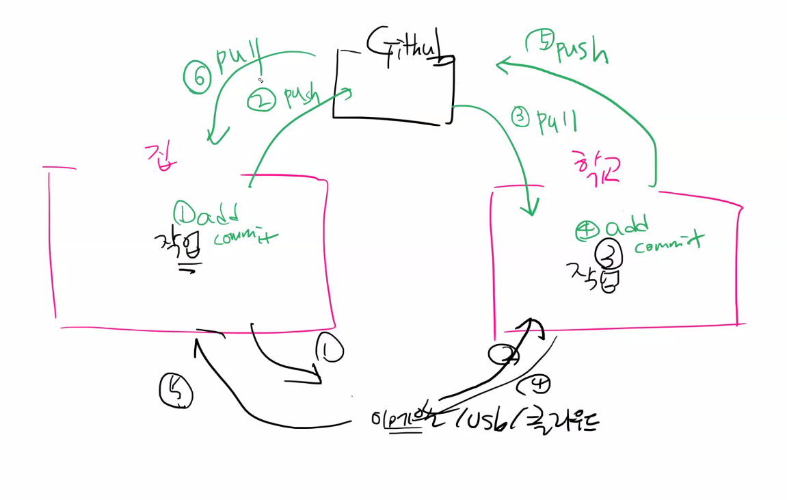
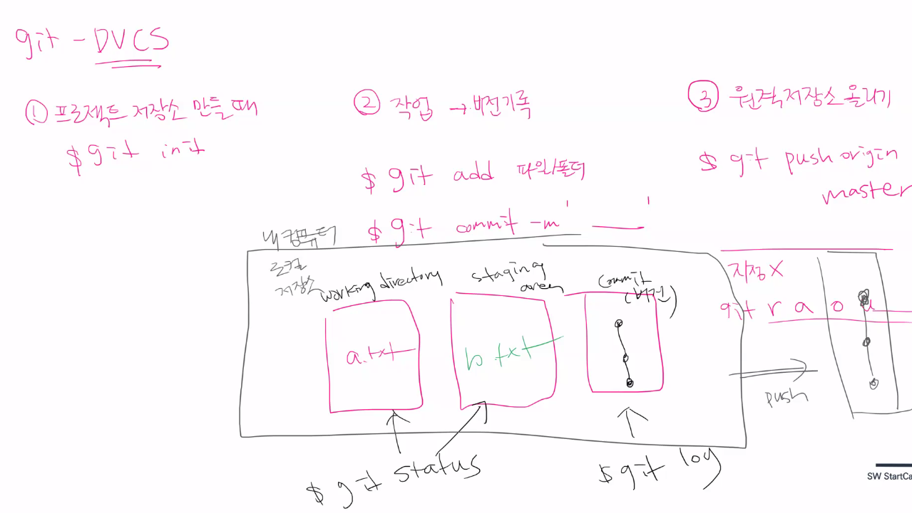
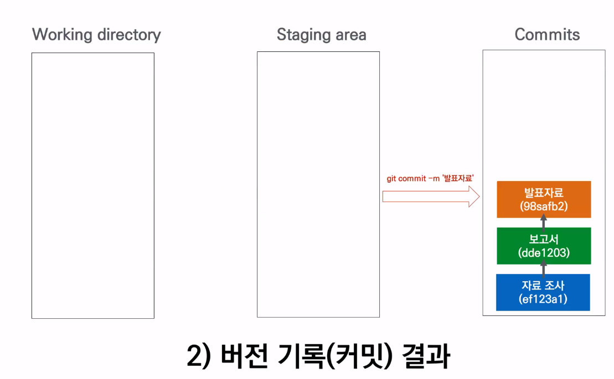

# git

> 분산 버전 관리 시스템 (DVCS, Distributed Version Control System)

윈도우 환경에서는 git 설치 및 실행을 위해 git bash를 다운로드 받는다.

## 기본 명령어

- ls (list의 약자) 목록 - 내 현재 목록을 보기위함
- cd (change directory) 폴더를 이동하는 명령어
- mkdir (make directory) 폴더 생성
- touch 비어있는 파일 생성
- rm (remove) 삭제

### 저장소(repository) 생성

```bash
$ git init
```

* `.git` 폴더가 숨김 폴더로 생성되고, git bash에서는 `(master)` 라고 표기 된다.
  * 저장소 생성시 상위 폴더에 `.git` 저장소가 있지 않은지 확인할 필요가 있다.
    * 예) 바탕화면에 실수로 `git init` 에서 `.git` 이 있는 경우

### 기본 버전 관리 흐름

* git은 저장소 내에 모든 파일의 변경사항을 추적함
* 작업을 완료하고 `add` -> `commit` 을 통해 버전을 기록한다.
  * `working directory` 에서 `add` 명령어를 통해 `staging area` 상태(`staged`)로
  * `staged` 상태인 파일들을 모두 `commit` 명령어를 통해 버전 기록

#### `add`

> `working directory` 에서 `add` 명령어를 통해 `staging area` 상태(`staged`)로
>
> 버전으로 기록할 파일을 모으기 위해 사용

```bash
$ git add a.txt    # 특정 파일
$ git add test/    # 특정 폴더
$ git add .        # 현재 디렉토리 (하위 디렉토리 포함)
$ git add git.md markdown.md # 이어서 쓰기
```

#### `commit` 

> `staged` 상태인 파일들을 모두 `commit` 명령어를 통해 **버전 기록**

```bash
$ git commit -m '커밋 메시지'
[master ce0578b] 커밋 메시지
 1 file changed, 1 deletion(-)
 delete mode 100644 a.txt
```

* 커밋 메시지는 현재 버전에 대해 알 수 있도록 작성
* 지금까지 커밋을 확인하기 위해서는 `git log` 명령어 사용

### 상태 확인 

#### `status`

> working directory와 staging area의 상태를 확인할 수 있다. 
>
> 특정 파일이 변경되었는지 (추가/수정/삭제), `staged` 상태인지

```bash
$ git status
On branch master
Changes to be committed:
  (use "git restore --staged <file>..." to unstage)
        new file:   b.txt

Untracked files:
  (use "git add <file>..." to include in what will be committed)
        c.txt
```

#### `log`

> 커밋 로그를 확인

```bash
$ git log 
$ git log --oneline # 한줄로 간략히 표기
$ git log -2 # 최근 n개의 로그만 확인
$ git log --oneline -2 # 한줄로 최근 n개만
```


## 깃헙 프로젝트

1. open source 프로젝트 - Tensor flow
2. 개발자의 이력서 && 경험 1일 1commit - 잔디밭 쌓기

git 은 github과 다르다.

비유 하자면 마치 핸드폰의 사진첩 갤러리와 네이버 클라우드 구글 클라우드 등

## 깃헙 원격 remote origin 추가하기

```bash
$git remote add origin <https://github.com/K-Dongil/TIL.git>
```

## 깃헙 원격 remote origin 삭제하기

`````
$git remote rm origin
`````

## push

``````
$git push origin master
# 만약, 지정이 안되있다면 git아 원격저장소 추가해줘 origin이라는 이름으로 url을
``````

## 연결 확인

``````
$git remote -v
``````


## 원격 저장소 등록

``````
$git remote add origin 주소
``````

## staging area

버전을 나눠서 commit하고 싶을 때 필요한 영역




## 로그인 정보

- 자격 증명 관리자에서 확인


## 오류

``````
$ git push origin master
To https://lab.ssafy.com/kdi1569/test.git
 ! [rejected]        master -> master (fetch first)
error: failed to push some refs to 'https://lab.ssafy.com/kdi1569/test.git'
hint: Updates were rejected because the remote contains work that you do
hint: not have locally. This is usually caused by another repository pushing
hint: to the same ref. You may want to first integrate the remote changes
hint: (e.g., 'git pull ...') before pushing again.
hint: See the 'Note about fast-forwards' in 'git push --help' for details.
``````

- 원격저장소랑 로컬저장소 커밋 로그가 다른 경우
  - 원격저장소를 지원하는 곳에서 직접 수정한 경우 (Github/Gitlab)
  - 혹은 저장소 만들 때, README랑 같이 만들기 이런 옵션 클릭했을 때
  - 원격저장소에서는 파일만 만들어주지 않는다 
  - GIt은 버전관리시스템
  - Github/Gitlab 저장소에서 보이는 모든 파일은 단순히 특정 시점의 파일 구조인 것이고 실제로는 버전이 기록 되어 있다.

- 해결하기

  - 원격 저장소 버전 가져오기

    ``````
    git pull origin master
    ``````

  - Merge commit
    - 두 버전을 합치는 커밋
      - 일반적으로 충돌이 없으면 vs ocde창이 열리고(커밋메시지) 저장하고 종료하면 됨
      - 이 과정에서 동일 파일이 수정되어 있으면 충돌 발생
        - 충돌난 파일 확인해서 수정하고 add, commit-

## clone

- git hub에 올려져 있는 것들 모두 가져옴
- 가져온 다음 git init해줘야 연동 됨

## pull, push 와  clone 

- pull, push : 버전관리 (작업 중)

- clone,init : 저장소를 받아오고 저장소를 로컬 새로 생성 (프로젝트 시작 때)
  - clone을 하면 init을 할 필요가 없다??
