## 브라우저(browser)

- 웹 서버에서 이동하며 클라이언트와 서버 간 양방향으로 통신하고, HTML 문서나 파일을 출력하는 GUI 기반의 소프트 웨어
- 인터넷의 Content를 검색 및 열람하도록 함
- 주요 브라우저
  - Google Chrome, Mozilla Firefox, Microsoft Edge, Opera, Safari


크로스 부라우징(Cross Browsing)

- W3C에서 채택된 표준 웹 기술을 채용하여 각각의 브라우저마다 다르게 구현되는 기술을 비슷하게 만들되, 어느 한쪽에 치우치지 않도록 웹 페이지를 제작하는 방법론(동일성이 아닌 동등성에 초점을 둠)
- 브라우저마다 렌더링에 사용하는 엔진이 다르기 때문


## JavaScript

- 브라우저 화면을 **동적**으로 만들어 준다

- 브라우저를 조작할 수 있는 유일한 언어

  - 

  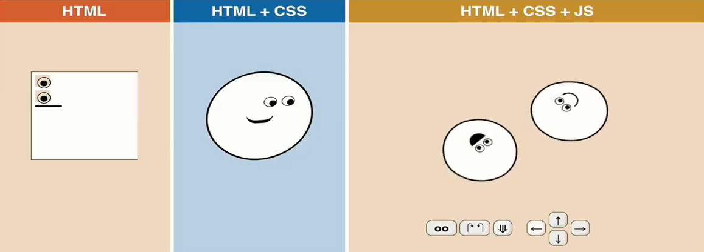


##### * 자바스크립트가  브라우저에서 할 수 있는 일

- DOM 조작 = 문서(HTML)조작

  - 문서(HTML)를 동적으로 만들 수 있다 (문서의 객체를 조작한다)

- BOM(Browser Object Model) 조작

  - 브라우저를 조작한다 (브라우저 각각의 객체를 조작한다)
  - navigator, screen, location, frames, history, XHR

- JavaScript Core(ECMAScript)

  - 자바스크립트의 문법 자체

  - 브라우저에서 할 수 있는 일 3가지

    - 프로그래밍 언어의 자바스크립트 일도 브라우저에서 진행할 수 있다

    1. Data Structure(Object, Array)를 만들 수 있다
    2. Conditional Expression(조건 표현식)
    3. Iteration(반복)


##### * Object Model

- 웹 브라우저의 구성요소들은 각각 객체화 되어있는 것을 말한다

- 자바스크립트는 이 각각의 객체들을 제어함으로써 웹 브라우저를 제어할 수 있다

- 객체들은 서로 계층적인 관계로 구조화 되어있다

  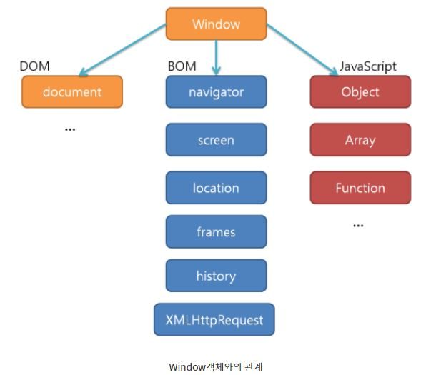


##### * window 객체

- 자바스크립트의 최상위객체이자 전역객체이면서 모든 객체가 소속된 객체
- window는 객체화된 수 많은 구성 요소들로 이루어져 있다
  - 자바스크립트로 이 객체들을 제어해서 웹 브라우저를 제어할 수 있게 되는 것
  - 개발자도구에서 window를 치면 객체들을 확인할 수 있음


##### * DOM (데이터 구조)

- HTML, XML과 같은 문서를 다루기 위한 문서 프로그래밍 인터페이스

- HTML 문서를 구조화하고 구조화된 구성 요소를 하나의 객체로 취급하여 다루는 논리적 트리 모델

  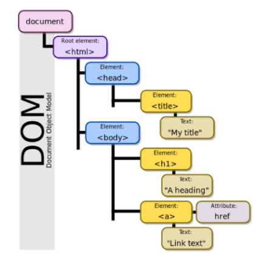

- 문서과 구조화되어 있으며 각 요소는 객체(object)로 취급

  - 자바스크립트가 객체를 인식하여 조작을 할 수 있다

- 단순한 속성 접근, 메서드 활용뿐만 아니라 프로그래밍 언어적 특성을 활용한 조작 가능

- 주요 객체

  - window : DOM을 표현하는 창, 가장 최상위 객체(작성 시 생략 가능)
  - document : 페이지 컨텐츠의 Entry Point 역할을 하며, body와 같은 수많은 다른 요소들을 포함
  - navigator, location, history, screen

- 해석(파싱, Parsing)

  - 구문 분석, 해석
  - 브라우저가 문자열을 해석하여 DOM Tree로 만드는 과정

  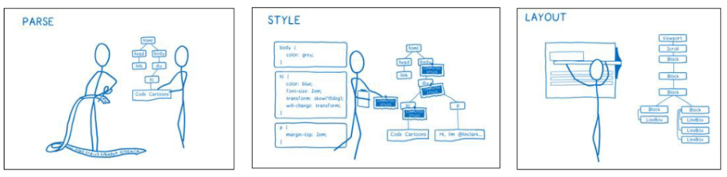

- 조작
  - JavaScript 언어로 조작하여 문서(HTML, web page)를 조작할 수 있다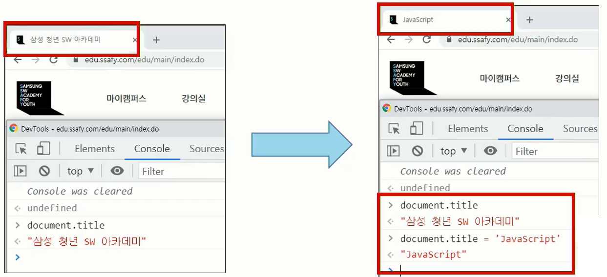


##### * BOM

- Browser Object Model

- 자바스크립트가 브라우저와 소통하기 위한 모델

  - window객체를 통해 접근이 가능하다

- 브라우저의 창이나 프레임을 추상화해서 프로그래밍적으로 제어할 수 있도록 제공하는 수단
  - 버튼, URL 입력창, 타이틀 바 등 브라우저 윈도우 및 웹 페이지 일부분을 제어 가능

- window 객체는 모든 브라우저로부터 지원받으며 브라우저의 창(window)를 지칭
  - document도 브라우저 내에 종속되어 있기 때문에 window 전역 객체에 포함된다

- ex) 
  - 탭 창 window.open(), 인쇄 창 window.print(), 메세지 및 대화상자 창 window confirm()

    | navigator | 브라우저 명과 버전정보를 속성으로 가짐                    |
    | --------- | --------------------------------------------------------- |
    | window    | 최상위 객체로, 각 프레임별로 하나씩 존재                  |
    | document  | 현재 문서에 대한 정보                                     |
    | location  | 현재 URL에 대한 정보 / 브라우저에서 사용자가 요청하는 URL |
    | history   | 현재의 브라우저가 접근했던 URL history                    |
    | screen    | 브라우저의 외부환경(운영체제 화면)에 대한 정보를 제공     |


##### * JavaScript Core(ECMAScript)

- 프로그래밍 언어로 사용

  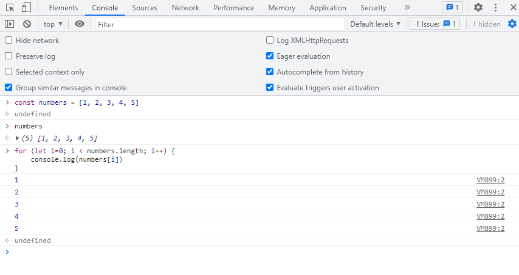

##### * DOM 조작

- Document는 문서 한 장(HTML)에 해당하고 이를 조작
  - 우리가 보는 웹 화면을 조작하는 것이라고 생각
  
- 조작 순서
  1. 선택(Select)
  2. 변경(Manipulation)

- document 위치
  
  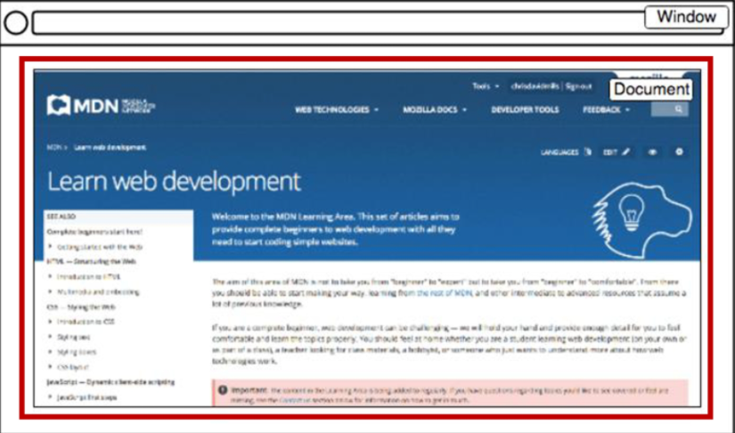

- 객체의 상속 구조

  - EventTarget
    - Event Listener를 가질 수 있는 객체가 구현하는 DOM 인터페이스
      - ex) addEventListener가 가능한 객체
    
  - Node(틀에 대한 개념)
    - 여러 가지 DOM 타입들이 상속하는 인터페이스 

  - Element
    - Document 안의 모든 객체가 상속하는 가장 범용적인 기반 클래스
    - 부모인 Node와 그 부모인 EventTarget의 속성을 상속

  - Document
    - 브라우저가 불러온 웹 페이지를 나타냄
    - DOM 트리의 진입점(entry point) 역할을 수행
  - HTMLElement
    - 모든 종류의 HTML요소
    - 부모 element의 속성 상속 

  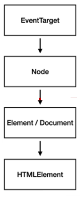

##### * DOM 선택

- 메서드

  - querySelector, querySelectorAll를 주의깊에 봐야하는 이유

    - id, class, tag 선택자 등을 모두 사용 가능하므로 더 구체적이고 유연하게 선택 가능

  - Document.querySelector(selector)

    - 인자에 CSS 선택자가 들어간다
    - 제공한 선택자와 일치하는 element 하나 선택
    - 제공한 CSS selector를 만족하는 첫 번째 element 객체를 반환 (없다면 null)

  - Document.querySelectorAll(selector)

    - 제공한 선택자와 일치하는 여러 element를 선택

    - 매칭 할 하나 이상의 셀렉터를 포함하는 유효한 CSS selector를 인자(문자열)로 받음
    - 지정된 셀렉터에 일치하는 NodeLIst를 반환
      - 현재 문서에서 지정된 CSS selector에 일치하는 모든 태그들을 선택하면 List로 반환된다

  - getElementById(id)

  - getElementsByTagName(name)

  - getElementByClassName(names)

- 선택 메서드별 반환 타입

  1. 단일 element

     - querySelector(), getElementById()

  2. HTMLCollection

     - 배열과 같이 각 항목에 접근하기 위한 index를 제공(유사 배열)
     - name, id, index 속성으로 각 항목에 접근 가능

     - getElementsByTagName(), getElementByClassName()

  3. NodeList

     - 배열과 같이 각 항목에 접근하기 위한 index를 제공(유사 배열)
     - index로만 각 항목에 접근 가능
     - HTMLCollection과 달리 배열에서 사용하는 forEach함수 및 다양한 메서드 사용 가능

     - querySelectorAll()

  - HTMLCollection 와 NodeList 둘다 Live Collection으로 DOM의 변경사항을 실시간으로 반영
    - querySelectorAll()에 의해 반한되는 NodeList는 static Collection으로 실시간 반영X

- Collection
  1. Live Collection
     - 문서가 바뀔 때 실시간으로 업데이트 됨
     - DOM의 변경사항을 실시간으로 collection에 반영
     - HTMLCollection, NodeList
  2. Static Collection(non-live)
     - DOM이 변경되어도 collection 내용에는 영향을 주지 않음
     - querySelectAll()의 반환 NodeLIst만 Static collection


##### * DOM 변경

- 메서드(Creation)

  - Document.createElement()
    - 작성한 태그 명의 HTML 요소를 생성하여 반환
    - append()와 appendChild()를 이용하여 추가하기 위해서는 createElement()를 통해서 먼저 생성이 되어야 한다
  - Element.append() - Element를 객체라 생각
    - 특정 부모 Node의 자식 NodeList중 마지막 자식 다음에 **Node객체나 DOMString**을 삽입
    - **여러 개**의 Node객체, DOMString을 추가할 수 있음
    - 반환 값이 없음

  - Node.appendChild()
    - 한 Node를  특정 부모 Node의 자식 NodeList중 마지막 자식으로 삽입(**Node만 추가 가능**)
    - **한번에 오직 하나**의 Node만 추가할 수 있음
    - 만약 주어진 Node가 이미 문서에 존재하는 다른 Node를 참조한다면 새로운 위치로 이동
    - 추가된 Node 객체를 반환

- 메서드(proerty)

  - Node.innerText = '집어 넣을 값'

    - Node 객체와 그 자손의 텍스트 컨텐츠(DOMString)를 표현 (사람이 읽을 수 있는 내용만 남김)
      - 줄 바꿈을 인식하고 숨겨진 내용을 무시하는 등 최종적으로 스타일링이 적용된 모습으로 표현

  - Element.innerHTML

    - 요소(Element)내에 포함된 HTML 마크업을 반환

    - XSS 공격에 취약

    - [참고] XSS (Cross-site-Scripting)

      - 공격자가 웹 사이트 클아이언트 측 코드에 악성 스크립트를 삽입해 공격하는 방법
      - 피해자의 브라우저가 악성 스크립트를 실행하며 공겨자가 엑세스 제어를 우회하고 사용자인 척 한다(CSRF공격과 유사)

      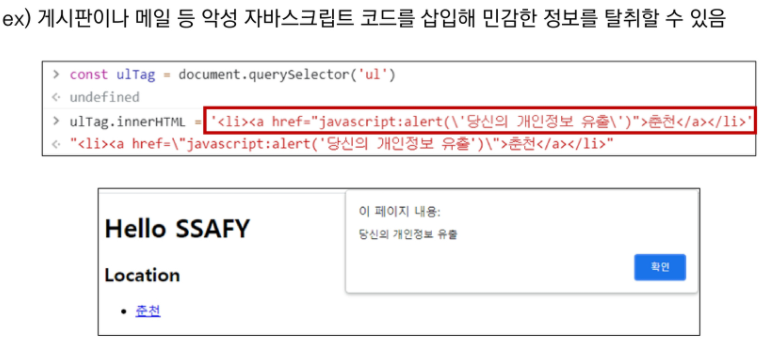

- 메서드(삭제)
  - ChildNode.remove()
    - 자식 Node를 선택해서 제거
  - 부모Node.removeChild(자식Node)
    - DOM에서 자식 Node를 제거하고 제거된 Node를 반환
    - Node는 인자로 들어가는 자식 Node의 부모 Node

- 메서드(속성)

  - Element.setAttribute(속성, 속성값)

    - 지정된 요소의 값을 설정

    - 속성이 이미 존재하면 값을 갱신, 존재하지 않으면 지정된 이름과 값으로 새 속성을 추가

  - Element.getAttribute(attributeName)
    - 해당 요소의 지정된 값(특정 속성값, 문자열)을 반환
    - 인자(attributeName)는 값을 얻고자 하는 속성의 이름

  - Element.removeAttribute(name)
    - Element의 속성 값을 지움

  - Element.hasAttribute(name)
    - Element의 속성 값이 있는지 없는지 True, Flase값 반환


##### * [Event](https://developer.mozilla.org/ko/docs/Web/Events) ( ~~하면 ~~ 한다)

- 네트워크 활동이나 사용자와의 상호작용 같은 사건의 발생을 알리기 위한 객체

- 이벤트 발생
  - 마우스를 클릭하거나 키보드를 누르는 등 사용자 행동으로 발생할 수도 있음
    - ex) click, change, submit, load
  - 특정 메서드를 호출(Element.click())하여 프로그래밍적으로도 만들어 낼 수 있음
  
- Event기반 인터페이스
  - AnimationEvent, ClipboardEvent, DragEvent 등
  - UIEvent
    - 간단한 사용자 interface event
    - Event의 상속을 받음
    - MouseEvent, KeyboardEvent, InputEvent, FocusEvent 등의 부모 객체 역할을 함

- Event handler (Event를 처리)

  - 대상에 특정 이벤트가 발생하면, 할 일을 등록하자

  - EventTarget.addEventListener(type, listener[, options])

    - 지정한 이벤트가 대상에 전달될 때마다 호출할 함수를 인자에 설정
    - 이벤트를 지원하는 모든 객체(Element, Document, Window 등)를 대상으로 지정 가능
    - type
      - 반응 할 이벤트 유형(대소문자 구분 문자열)
    - listener
      - 지정된 타입의 이벤트가 발생했을 때 알림을 받는 객체
      - EventListener 인터페이스 혹은 JS function 객체(콜백 함수)여야 함
      - event 값이 인자로 자동으로 넘어온다
    
  - ex) 클릭하면 알림창을 띄우는 addEventListener

    ```html
    # 방법1
    <body>
        <button type="button">버튼</button>
        
        <script>
        	const btn = document.querySelector("button")
            btn.addEventListener("click", function (event)){
              alert("버튼이 클릭되었습니다.")
              console.log(event)
            })
        </script>
    </body>
    # 방법2
    <body>
        <button onlick="alertMessage()">버튼</button>
        
        <script>
            const alertMessage = function () {
                alert("버튼이 클릭되었습니다.")
            }
        </script>
    </body>

- Event 취소

  - Event.preventDefault()
  
  - 현재 이벤트의 기본 동작을 중단
  
  - 태그의 기본 동작을 작동하지 않게 막음
    - ex) a태그의 기본 동작은 클릭 시 링크로 이동/ form 태그의 기본 동작은 form 데이터 전송
    
  - 이벤트를 취소할 수 있는 경우, 이벤트의 전파를 막지 않고 그 이벤트를 취소
  
  - 취소 할 수 없는 이벤트도 존재
  
    - 이벤트의 취소 가능 여부는 event의 data값에 cancelable을 통해 확인이 가능하다
  
      -  event.cancelable을 사용해 확인할 수 있음(false면 취소 불가능)
    
        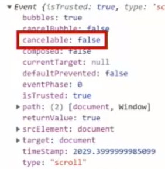
    
    - ex) 대표적인 취소할 수 없는 이벤트 : 스크롤 이벤트


##### * CREATE, READ 기능을 충족하는 todo app만들어보기

```html
<html>
<head>
    <meta charset="UTF-8">
    <meta http-equiv="X-UA-Compatible" content="IE-edge">
    <meta name="viewport" content="width=device-width, initial-scale=1.0">
    <title>Document</title>
</head>
<body>
    <form action="#">
        <input type="text">
        <button>Add</button>
    </form>
    <ul>
        
    </ul>
    <script>
        // 이벤트 타켓 설정
        const form = document.querySelector("form")
        
        form.addEventListener("submit", function (event) {
          event.preventDefault() // event의 기본동작을 막는다
            
          // 1. input 선택 및 value 값 선택
          const input = document.querySelector("input")
          const content = input.value
          
          if (content.trim()) {
            // 새로운 li 요소 생성, input value를 innerText로 넣는다
            const liTag = document.createElement("li")
            liTag.innerText = content
        	
            // ul 요소를 선택, ul의 자식 요소로 li요소를 추가한다
            const ulTag = document.querySelector("ul")
            ulTag.appendChild(liTag)
          } else {
            alert('할 일을 입력해주세요!')
          }
          
          // event 타겟을 reset(input창에 입력된 값 초기화)
          event.target.reset()
        })
    </script>
</body>
</html>
```


## AJAX

- Asynchronous JavaScript And XML (비동기식 JavaScript와 XML)
- 서버와 통신하기 위해 XMLHttpRequest 객체를 활용
- JSON, XML, HTML 그리고 일반 텍스트 형식 등을 퐇마한 다양한 포맷을 주고 받을 수 있음
  - AJAX의 X가 XML을 의미하긴 하지만, 요즘은 더 가벼운 용량과 JavaScript의 일부라는 장점 때문에 JSON을 더 많이 사용함

- 특징
  - 페이지 전체를 reload(새로고침)를 하지 않고서도 수행되는 비동기성
    - 사용자의 event가 있으면 전체 페이지가 아닌 일부분만을 업데이트 할 수 있음
  - AJAX의 주요 두가지 특징
    1. 페이지 새로고침 없이 서버에 요청
    2. 서버로부터 데이터를 받고 작업을 수행

- Google 사용 예시
  - Gmail
    - 메일 전송 요청이 모두 처리 되기 전 다른 페이지로 넘어가더라도 메일은 전송 됨
  - Google Maps
    - 스크롤 행위 하나하나가 모두 요청이지만 페이지는 갱신X

- XMLHttpRequest 객체
  - 서버와 상호작용하기 위해 사용되며 전체 페이지의 새로고침 없이 데이터를 받아올 수 있음
  - 사용자의 작업을 방해하지 않으면서 페이지 일부를 업데이트할 수 있음
  - 주로 AJAX 프로그래밍에 사용
  - 이름과 달리 XML 뿐만 아니라 모든 종류의 데이터를 받아올 수 있음
  - 생성자
    - XMLHttpRequest()

- XMLHttpRequest 예시

  - console에 todo 데이터가 출력X

    - 데이터 응답을 기다리지 않고 console.log()를 먼저 실행했기 때문이다.

    ```javascript
    const request = new XMLHttpRequest()
    const URL = 'https://jsonplaceholder.typicode.com/todos/1/'
    
    request.open('GET', URL)
    request.send() // 요청
    
    const todo = request.response // 응답 데이터 저장
    console.log(`data: ${todo}`) // 출력


##### * 동기식

- 순차적, 직렬적 Task 수행
- 요청을 보낸 후 응답을 받아야만 다음 동작이 이루어짐(blcoking)

- ex)

  - 버튼 클릭 후 alert 메시지의 확인 버튼을 누를 때까지 문장이 만들어지지 않음

  - 즉, alert 이후의 코드는 alert의 처리가 끝날 때까지 실행되지 않음

  - 왜 이런 현상 -> JavaScript는 single threaded

    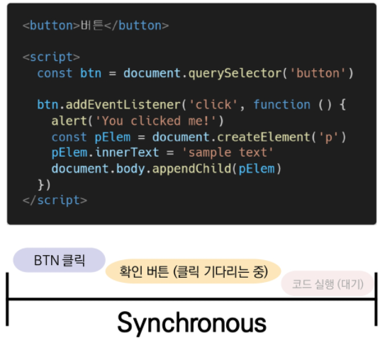


##### * 비동기식

- 병렬적인 듯한 Task 수행
  - JavaScript는 single threaded
- 요청을 보낸 후 응답을 기다리지 않고 다음 동작이 이루어짐(non-blocking)

- ex)

  - 요청을 보내고 응답을 기다리지 않고 다음 코드가 실행됨

  - 결과적으로 변수 todo에는 응답 데이터가 할당되지 않고 빈 문자열이 출력

  - 그렇다면 JS는 왜 기다려주지 않는 방식으로 동작하는가?

    - JavaScript는 single threaded

    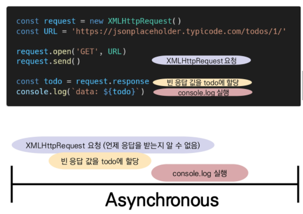

- 사용 이유
  - 사용자 경험 때문
  - 매우 큰 데이터를 동반하는 앱이 있다고 가정할 때 동기식 코드라면 데이터를 모두 불러온 뒤 앱이 실행됨
    - 데이터를 모두 불러올 때 까지는 앱이 모두 멈춘 것처럼 보임
    - 코드 실행을 차단하여 화면이 멈추고 응답하지 않는 것 같은 사용자 경험을 제공
  - 비동기식 코드라면 데이터를 요청하고 응답 받는 동안, 앱 실행을 함께 진행함
    - 데이터를 불러오는 동안 지속적으로 응답하는 화면을 보여줌으로써 더욱 쾌적한 사용자 경험을 제공
  - 웹 API 기능은 현재 비동기 코드를 사용하여 실행됨


##### * Threads

- 프로그램이 작업을 완료하기 위해 사용할 수 있는 단일 프로세스(일처리를 할 수 있는 머리)
- 각 스레드는 한 번에 하나의 작업만 수행할 수 있음
- ex) Task A -> TaskB -> Task C
  - 다음 작업을 시작하려면 반드시 앞의 작업이 완료되어야 함
  - 컴퓨터 CPU는 여러코어를 가지고 있기 때문에 한번에 여러 가지 일을 처리가능


##### - Blocking vs Non-Blocking

1. 요청

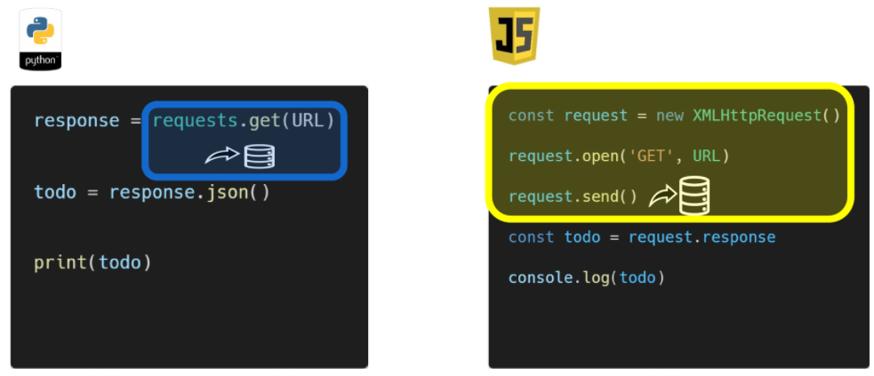

2. 응답을 기다림

   - 응답을 기다리는 동안 python은 제자리, js는 할당하는 곳으로 넘어감 (현재응답 받지못함)

     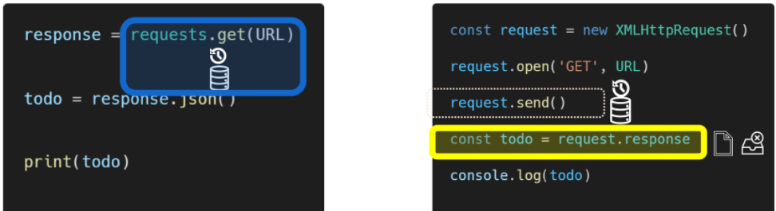

3. 응답을 받음

   - 파이썬은 응답을 받아 저장, js는 응답을 받은상태에서 이미 할당부분을 넘어 출력되는 부분

     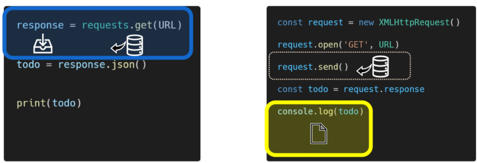

4. 최종

   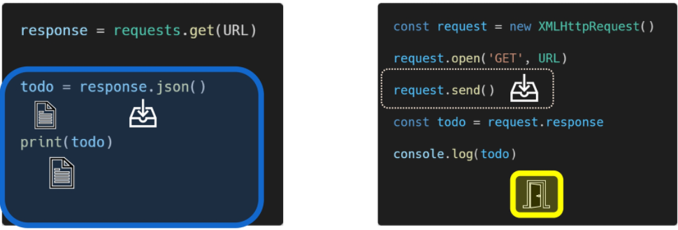

- JavaScript는 Sing threaded
- 컴퓨터가 여러 개의 CPUT를 가지고 있어도 main thread라 불리는 단일 스레드에서만 작업 수행
- 이벤트를 처리하는 Call stack이 하나인 언어라는 의미
- 문제해결
  1. 즉시 처리하지 못하는 이벤트들을 다른 곳(Web API)으로 보내서 처리하도록 한다
  2. 처리된 이벤트들은 처리된 순서대로 대기실(Task queue)에 줄을 세워 놓는다
  3. Call stack이 비면 담당장(Event Loop)가 대기 줄에서 가장 오래된 (제일 앞의)이벤트를 Call stack으로 보낸다


##### * JavaScript 동작원리

- 자바스크립트는 싱글 쓰레드 기반 언어

  - 호출 스택이 하나 = 한 번에 한 작업만 처리 가능
  - 호출 스택 : 프로그램 상에서 어디에 있는지를 기록하는 자료구조
  - 호출 스택이 최대 허용치를 넘으면 브라우저에서 에러발생

- setTimeout, EventListener, Ajax 같이 처리가 오래걸리는 코드는 동작순서가 뒤로 밀리고 빠르게 처리가능한 코드부터 처리한 뒤 처리된다.

  - 코드

    ```javascript
    function multiply(x, y) {
        return x * y;
    }
    function printSquare(x) {
        var s = multiply(x, x);
        console.log(s);
    }
    printSquare(5);
    ```

  - 실행 결과

    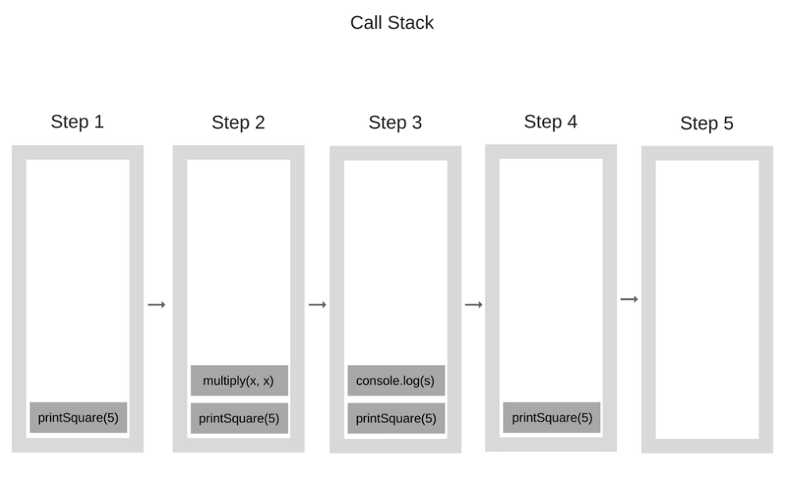

- 반복문 코드를 짤 때 반복이 깊게 일어나면 js로는 구현하지 않는게 좋다.

  - ex) 30초가 걸리는 어려운 연산이 있을 때 eventListener는 30초 뒤에 실행된다.
    - 어려운 연산이 해결될 때까지 브라우저는 기능이 정지된다.
  - 비동기 콜백이 필요


##### * Concurrency model

- Event loop를 기반으로 하는 동시성 모델

1. Call stack
   - 요청이 들어올 때마다 해당 요청을 순차적으로 처리하는 Stack(LIFO)형태의 자료 구조
2. WebAPI(Browser API)
   - JavaScript 엔진이 아닌 브라우저 영역에서 제공하는 API
     - js는 한번에 하나(스택에서 한개의 일)만 수행 Stack에서 처리할 수 없는 일에 대해서는 Web API로 보낸다
   - setTimeout(), DOM events, AJAX로 데이터를 가져오는 시간이 소요되는 일들을 처리
     - setTimeout()의 설정시간은 출력을 보장하는 것이 아니라, TaskQueue로 넘어가는데 시간
3. TaskQueue(Event Queue, Message Queue)
   - 비동기 처리된 callback 함수가 대기하는 Queue(FIFO)형태의 자료 구조
     - WebAPI에서 처리되는 event들이 바로 Call Stack으로 Push되지않고 TaskQueue에서 대기
   - main  thread가 끝난 후 실행되어 후속 JavaScript코드가 차단 되는 것을 방지
   
4. Event Loop
   - Call Stack이 비어있는지 확인
   - 비어 있는 경우 Task Queue에서 실행 되기 중인 callback함수가 있는지 확인
   - Task Queue에 대기 중인 callback 함수가 있다면 가장 앞에 있는 callback 함수를 Call stack으로 push

- ex)예시코드

  ```javascript
  console.log('Hi')
  
  setTimeout(function ssafy() {
    console.log('SSAFY')
  }, 3000)
  
  console.log('Bye')

- 동작원리

  1. Call Stack으로 들어가고 출력된 뒤 빠진다

     

  2. setTimeout이 Call Stack에 들어갔다가 ssafy 함수를 바로 실행할 수 없으므로 WebAPI로 보낸다.

     

  3. Call Stack으로 들어가고 출력된 뒤 빠진다

     

  4. 3초가 지나면 WebAPI에 있던 ssafy콜백함수가 Task Queue로 이동

     

  5. ssafy 콜백함수가 Call Stack으로 이동한 뒤 호출되고 빠진다.

     


##### * Zero delays

- 실제로 0ms 후에  callback함수가 시작된다는 의미가 아님
- 실행은 Task Queue에 대기 중인 작업 수에 따라 다르며 해당 예시에서는 callback 함수의 메시지가 처리되기 전에 'HI', 'Buy'가 먼저 출력됨
  - delay(지연)는 JavaScript가 요청을 처리하는데 필요한 최소 시간이다(보장된 시간이 아님)
- setTimeout 함수에 특정 시간제한을 설정했더라도 대기 중인 메시지의 모든 코드가 완료될 때까지 대기해야 한다.


##### * 순차적인 비동기 처리하기

- Web API로 들어오는 순서는 중요하지 않고, 어떤 이벤트가 먼저 처리되느냐가 중요
  - 실행 순서 불명확
- 실행 순서 불명확 현상을 해결하기 위해 순차적인 비동기 처리를 위한 2가지 작성 방식
  1. Async callbacks(비동기 콜백)
     - 백그라운드에서 실행을 시작할 함수를 호출할 때 인자로 지정된 함수
     - ex) addEventListener()의 두번째 인자 : 콜백함수
  2. promise-style
     - Modern Web APIs에서의 새로운 코드 스타일
     - XMLHttpRequest 객체를 사용하는 구조보다 조금 더 현대적인 버전


##### * Callback Function

- 다른 함수에 인자로 전달된 함수
- 외부 함수 내에서 호출되어 루틴 또는 작업을 완료함

- 동기식, 비동기식 모두 사용됨
  - 비동기 작업이 완료된 후 코드 실행을 계속하는 데 주로 사용
- 비동기 작업이 완료된 후 코드 실행을 계속하는 데 사용되는 경우 : 비동기 콜백(Async callbacks)

- JavaScript의 함수는 일급객체(일급함수)

  - 다른 객체들에 적용할 수 있는 연산을 모두 지원하는 객체(함수)

  - 일급 객체의 조건

    1. 인자로 넘길 수 있어야 한다
    2. 함수의 반환 값으로 사용할 수 있어야 한다
    3. 변수에 할당할 수 있어야 한다

  - Callback Function 예시

    ```javascript
    // 
    const myFunc = function (func) {
        return func
    }
    
    const myArgumentFunc = function () {
        return 'Hello'
    }
    
    const result = myFunc(myArgumentFunc)
    console.log(result)
    /* 출력
    f () {
        return 'Hello'
    }
    */
    
    // map
    const nums = [1, 2, 3]
    const doubleNums = nums.map(num => {
        return num * 2
    })
    console.log(doubleNums) // 출력 : [2, 4, 6]
    
    // Array Helper Method (array 메서드)
    const numbers = [1, 2, 3]
    const newNumbers = []
    
    numbers.forEach(num => {
        newNumbers.push(num + 1)
    })
    console.log(newNumbers) // [2, 3, 4]
    
    // setTimeout
    const helloworld = function () {
        console.log('happy coding!!')
    }
    setTimeout(helloworld, 3000)
    console.log('unhappy coding!!')
    /* unhappy coding!! 먼저 출력 후 WebAPI에서 3초간 돌고 que -> callstack -> 출력 */
    
    //addEventListener
    <body>
      <button>버튼</button>
    
      <script>
        const myButton = document.querySelector('button')
    	myButton.addEventListener('click', function() { // 두번째 인자가 콜백함수
            console.log('button clicked!!')
        })
      </script>
    </body>
    ```

    


##### * Async callbacks

- 백그라운드에서 코드 실행을 시작할 함수를 호출할 때 인자로 지정된 함수

- 백그라운드 코드 실행이 끝나면 callback 함수를 호출하여 작업이 완료되었음을 알리거나, 다음 작업을 실행하게 할 수 있음

  - ex) adEventListener()의 두번째 매개변수

- callback 함수를 다른 함수의 인자로 전달할 때, 함수의 참조를 인자로 전달할 뿐이지 즉시 실행되지 않고, 함수의 body에서 called back됨.

  - 정의된 함수는 때가 되면 callback 함수를 실행하는 역할을 함
  - addEventListener()에서 콜백함수는 바로 실행되지 않는다

- Why use callback?

  - 콜백 함수는 명시적인 호출이 아닌 특정 루틴 혹은 action에 의해 호출되는 함수
  - Django의 "요청이 들어오면", event의 경우 "특정 이벤트가 발생하면"이라는 조건으로 함수를 호출 할 수 있었던 건 "Callback function"개념 때문에 가능하다

  - 비동기 로직을 수행할 때 callback 함수는 필수
    - 명시적인 호출이 아니라 다른 함수의 매개변수로 전달하여 해당 함수 내에서 특정 시점에 호출


##### * callback Hell(콜백지옥)

- 순차적인 연쇄 비동기 작업을 처리하기 위해 "callback 함수를 호출하고, 그 다음 callback 함수를 호출하고, 또 그 함수의 callback 함수를 호출하고.."의 패턴이 지속적으로 반복됨

  - 여러 개의 연쇄 비동기 작업을 할 때 마주하는 상황

  - pyramid of doom(파멸의 피라미드)라고도 한다

- 콜백지옥이 일어나면 디버깅, 코드 가독성이 어려워진다

  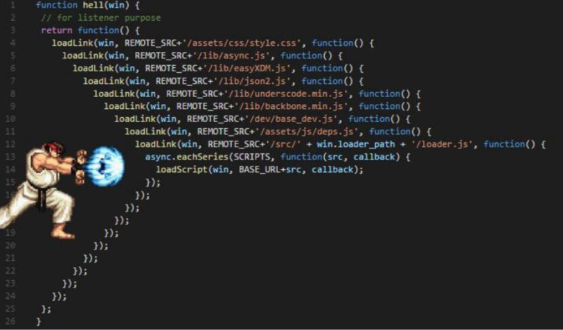

- 해결
  1. Keep your code shallow (코드의 깊이를 얕게 유지)
  2. Modularize (모듈화)
  3. Handle every single error (모든 단일 오류 처리)
  4. Promise callbacks (Promise 콜백 방식 사용)


##### * Promise

