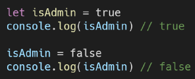
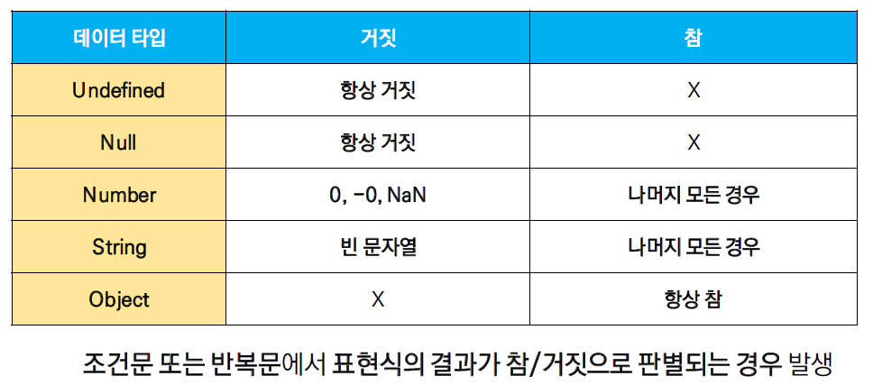
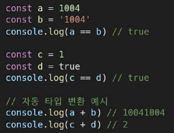
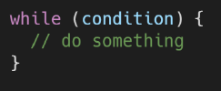
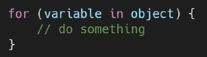
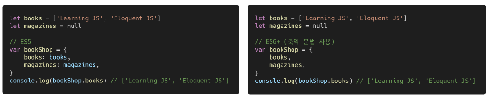

## 자바스크립트 문법

##### * 세미콜론(semicolon)

- 문장이 끝났음을 의미한다
- 다음 줄과 이어봤을 때 해석할 수 있는 경우메나 줄바꿈을 세미콜론으로 인식한다
  - return, 전위/훈위 증감 연산자 주의

- 자바스크립트는 세미콜론(;)을 선택적으로 사용 가능
- 세미콜론이 없으면 [ASI(자동 세미콜론 삽입 규칙)](https://tc39.es/ecma262/#sec-automatic-semicolon-insertion)에 의해 자동으로 세미콜론이 삽입됨


##### * 코딩 스타일 가이드

- 코딩 스타일의 핵심은 합의된 원칙과 일관성
  - 절대적인 하나의 정답은 없으며, 상황에 맞게 원칙을 정하고 일관성 있게 사용
- 코드의 품질에 직결되는 중요한 요소
  - 코드의 가독성, 유지보수 또는 팀원과의 커뮤니케이션 등 개발 과정 전체에 영향을 끼침
- [Airbnb JavaScript Style Guide]([GitHub - airbnb/javascript: JavaScript Style Guide](https://github.com/airbnb/javascript)), [Google JavaScript Style Guide]([Google JavaScript Style Guide](https://google.github.io/styleguide/jsguide.html)), [standardjs]([JavaScript Standard Style (standardjs.com)](https://standardjs.com/#javascript-style-guide-linter-and-formatter))


(밑에서부터는 Airbnb JavaScript 스타일 )

##### * 식별자 정의와 특징

- 식별자는 변수를 구분할 수 있는 변수명을 의미한다

- 식별자는 반드시 문자, 달러($) 또는 밑줄(_)로 시작

- 대소문자를 구분하며, 클래스명 외에는 모두 소문자로 시작

- 예약어* 사용 불가능

  - ex) for, if ,case 등

- 스타일

  - 카멜 케이스(camelCase, lower-camel-case)

    - 첫 번째 단어를 제외한 단어들의 첫 글자부터 대문자

      - 두 번째 단어의 첫 글자부터 대문자

    - 변수, 객체, 함수에 상요

      

  - 파스칼 케이스(PascalCase, upper-camel-case)

    - 모든 단어의 첫번째 글자를 대문자로 작성

    - 클래스, 생성자에 사용

      

  - 대문자 스네이크 케이스(SNAKE_CASE)

    - 모든 단어 대문자 작성 & 단어 사이에 언더스코어 삽입

    - 상수(constants)에 사용

      - 상수의 정의 : 개발자의 의도와 상관없이 변경될 가능성이 없는 값을 말함
  
      


### 데이터 타입

##### * 변수 선언

- 선언(Declaration)

  - 변수를 생성하는 행위 또는 시점
- 할당(Assignment)

  - 선언된 변수에 값을 저장하는 행위 또는 시점
- 초기화(Initialization)

  - 선언된 변수에 처음으로 값을 저장하는 행위 또는 시점


- 변수 생성과정

  - 선언 및 초기화 --> 할당

    ```javascript
    let foo // 선언
    console.log(log) // undefined
    foo = 11 // 할당
    console.log(foo) // 11
    
    let bar = 0 // 선언 + 할당
    console.log(bar) // 0

- **const**

  - 재할당할 수 없는 변수 선언 시 사용

    

  - 변수 재선언 불가능

    

  - 블록스코프 규칙을 따른다

    - 블록 스코프 규칙을 따르면 함수스코프 규칙도 따른다

- **[let](https://developer.mozilla.org/ko/docs/Web/JavaScript/Reference/Statements/let#%EC%8B%9C%EA%B0%84%EC%83%81_%EC%82%AC%EA%B0%81%EC%A7%80%EB%8C%80)**

  - 재할당할 수 있는 변수 선언 시 사용

    

  - 변수 재선언 불가능

    

  - 블록스코프 규칙을 따른다

- **블록 스코프(block scope)**

  - if, for 함수 등의 중괄호 내부를 가리킨다

  - 블록 스코프 범위의 변수는 블록 바깥에서 접근 불가능

    - 바깥에서 선언된 변수를 블록 스코프에서 다시 선언하여 쓸 수 있다

    

  - 블록 스코프 범위 안에서 재할당은 블록 바깥의 변수에 영향을 준다

    

- **[var](https://developer.mozilla.org/ko/docs/Web/JavaScript/Reference/Statements/var)**

  - var로 선언한 변수는 재선언 및 재할당 모두 가능

    

  - ES6 이전에 변수를 선언할 때 사용되던 키워드

  - **[호이스팅](https://developer.mozilla.org/ko/docs/Glossary/Hoisting)**되는 특성으로 인해 예기치 못한 문제 발생 가능

    - 따라서 ES6 이후부터는 var대신 const와 let을 사용하는 것을 권장

  - 함수 스코프 규칙을 따른다

    - 블록 스코프 규칙을 따르지 않는다

- **함수 스코프**

  - 함수의 중괄호 내부를 가리킴

  - 함수 스코프를 가지는 변수는 함수 바깥에서 접근 불가능

    

- **호이스팅(hoisting)**

  - 변수를 선언 이전에 참조할 수 있는 현상

    - 호출된 시점보다 밑에 있는 선언부분을 위로 불러오는 것 

  - 변수 선언 이전의 위치에서 접근 시 undefined를 반환

    

    


##### * [데이터 타입 종류](https://developer.mozilla.org/ko/docs/Web/JavaScript/Data_structures)

- 자바스크립트의 모든 값은 특정한 데이터 타입을 가짐

- 크게 원시 타입(Primitive type)과 참조 타입(Reference type)으로 분류 됨

  

- 원시 타입(Primitive type)

  - 객체(object)가 아닌 기본 타입

  - 변수에 해당 타입의 값이 담김

  - 다른 변수에 복사할 때 실제 값이 복사 됨

    

  1. 숫자 타입

     - 정수, 실수 구분 없는 하나의 숫자 타입

     - 부등소수점 형식을 따름

     - 계산 불가능한 경우 반환되는 값 : NaN(Not-A-Number)

       - ex) 'Angel' / 1004 => NaN

       

  2. 문자열(String) 타입

     - 텍스트 데이터를 나타내는 타입

     - 16비트 유니코드 문자의 집합

     - 작은따옴표 또는 큰 따옴표 모두 가능

     - 템플릿 리터럴(Template Literal)

       - ES6부터 지원

       - 따옴표 대신 backtick(``)으로 표현

       - ${expression} 형태로 표현식 삽입 가능

         

  3. undefined 타입

     - 변수의 값이 없음을 나타내는 데이터 타입

     -  변수 선언 이후 직접 값을 할당하지 않으면 자동으로 undefined가 할당됨

     - typeof 연산자의 결과는 undefined

       

  4. [null 타입](https://developer.mozilla.org/ko/docs/Web/JavaScript/Reference/Global_Objects/null#difference_between_null_and_undefined)

     - 변수의 값이 없음을 의도적으로 표현할 때 사용하는 데이터 타입

     - 개발자가 의도적으로 필요한 경우 할당

     - null 타입과 typeof 연산자

       - typeof 연산자 : 자료형 평가를 위한 연산자
       - null 타입은 ECMA 명세의 원시 타입의 정의에 따라 원시 타입에 속하지만, typeof 연산자의 결과는 객체(object)로 표현됨

       

  5. Boolean 타입

     - 논리적 참 또는 거짓을 나타내는 타입

     - true 또는 false로 표현

       

     - 조건문 또는 반복문에서 유용하게 사용

       - 조건문 또는 반복문에서 boolean이 아닌 데이터 타입은 자동 형변환 규칙에 따라 true 또는 false로 변환됨

       

- 참조 타입(Reference type)

  - 객체(object) 타입의 자료형

  - 변수에 해당 객체의 참조(주소, key) 값이 담김

  - 다른 변수에 복사할 때 참조 값이 복사됨

    


### 연산자

1. 할당 연산자

   - 오른쪽에 있는 피연산자의 평가 결과를 왼쪽 피연산자에 할당하는 연산자
   - 다양한 연산에 대한 단축 연산자 지원
   - Increment 및 Decrement 연산자
     - Increment(++) : 피연산자의 값을 1 증가시키는 연산자
     - Decrement(--) : 피연산자의 값을 1 감소시키는 연산자
     - Airbnb Style Guide에서는 '+=' 또는 '-='와 같이 더 분명한 표현으로 적을 것을 권장

   

2. 비교 연산자

   - 피연산자들(숫자, 문자, Boolean등)을 비교하고 결과값을 boolean으로 반환하는 연산자

   - 문자열은 유니코드 값을 사용하며 표준 사전 순서를 기반으로 비교

     - ex) 알파벳끼리 비교할 경우
       - 알파벳 순서상 후순위가 더 크다
       - 소문자가 대문자보다 더 크다

     

3. 동등 비교 연산자

   - 두 피연산자가 같은 값으로 평가되는지 비교 후 boolean 값을 반환
   - 비교할 때 암묵적 타입 변환을 통해 타입을 일치시킨 후 같은 값인지 비교

   - 두 피연산자가 모두 객체일 경우 메모리의 같은 객체를 바라보는지 판별
   - 예상치 못한 결과가 발생할 수 있으므로 특별한 경우를 제외하고 사용하지 않음

   

4. 일치 비교 연산자

   - 두 피연산자가 같은 값으로 평가되는지 비교 후 boolean 값을 반환

   - 엄격한 비교가 이뤄지며 암묵적 타입 변환이 발생하지 않음

     - 엄격한 비교 : 두 비교 대상의 **타입과 값** 모두 같은지 비교하는 방식

     

   - 두 피연산자가 모두 객체일 경우 메모리의 같은 객체를 바라보는지 판별

     

5. 논리 연산자

   - 세 가지 논리 연산자로 구성

     - and 연산은 && 연산자를 이용

       

     - or 연산은  ||연산자를 이용

       

     - not 연산은 ! 연산자를 이용

       

   - 단축 평가 지원

     - ex) false && true => false
     - ex) true || false => true

6. 삼항 연산자(Ternary Operator)

   - 세 개의 피연산자를 사용하여 조건에 따라 값을 반환하는 연산자

   - 가장 왼쪽의 조건식이 참이면 콜론(:) 앞의 값을 사용하고 그렇지 않으면 콜론(:) 뒤의 값을 사용

   - 삼항 연산자의 결과는 변수에 할당 가능

   - [한 줄에 표기하는 것을 권장](https://github.com/airbnb/javascript#comparison--nested-ternaries)

     


### 조건문 & 반복문

##### * 조건문

- 조건문의 종류와 특징

  1. if statement

     - 조건 표현식의 결과값을 Boolean 타입으로 변환 후 참/거짓을 판단

  2. switch statement

     - 조건 표현식의 결과값이 어느 값(case)에 해당하는지 판별

     - 주로 특정 변수의 값에 따라 조건을 분기할 때 활용
       - 조건이 많아질 경우 if문보다 가독성이 나을 수 있음

- if statement

  - If, else, if, else
  - 조건은 소괄호(condition)안에 작성
  - 실행할 코드는 중괄호{} 안에 작성
  - 블록 스코프 생성

  
  - ex)

    

- switch statement

  - 표현식(expression)의 결과값을 이용한 조건문

  - 표현식의 결과값과 case문의 오른쪽 값을 비교

  - break 및 default문은 선택적으로 사용 가능

  - break문이 없는 경우 break문을 만나거나 default문을 실행할 때까지 다음 조건문 실행

  - default는 표현식의 결과값이 case문의 어떠한 값과도 맞지 않을 때, 위의 case문이 실행되었을 때 break로 도중에 막히지 않는다면 실행된다.

  - 블록 스코프 생성

    

  - break가 있는 경우

    

  - break가 없는 경우

    

- if 와 switch 비교

  


##### * 반복문

- while, for, for... in, for... of

- while

  - 조건문이 참(true)인 동안 반복 시행

  - 조건은 소괄호(condition) 안에 작성

  - 실행할 코드는 중괄호{} 안에 작성

  - 블록 스코프 생성

    

  - ex) 예시

  

- for

  - 세미콜론(;)으로 구분되는 세 부분으로 구성

  - initialization

    - 최초 반복문 진입시 1회만 실행되는 부분

  - condition

    - 매 반복 시행 전 평가되는 부분

  - expression

    - 매 반복 시행 이후 평가되는 부분

  - 블록 스코프 생성

    

  - for문 동작 순서

- for...in(객체 순회 적합)

  - 주로 객체(object)의 속성값들을 순회할 때 사용

  - 배열도 순회 가능하지만 인덱스 순으로 순회한다는 보장이 없으므로 권장X

  - 실행할 코드는 중괄호 안에 작성

  - 블록 스코프 생성

    

  - for...in에서 사용하는 객체

    ```javascript
    // 서로 다른 데이터 타입
    // 반복 객체가 아니다
    // title, releaseYear, actors, gernes 서로 다른 속성, 반복성 X
    const bestMovie = {
      title: '벤자민 버튼의 시간은 거꾸로 간다',
      releaseYear: 2008,
      actors: ['브래드 피트', '케이트 블란쳇'],
      genres: ['romance', 'fantasy'],
    }

- for...of(배열 원소 순회)

  - **반복 가능한(iterable) 객체**를 순회하며 값을 꺼낼 때 사용

  - 실행할 코드는 중괄호 안에 작성

  - 블록 스코프 생성

  - 반복 가능한(iterable)객체의 종류 : Array, Map, Set, String 등

    

  - for...of에서 사용하는 반복 가능한 객체

    ```javascript
    // 같은 데이터 타입
    // 반복 객체
    const movies = [
      {title: '어바웃 타임'},
      {title: '굿 윌 헌팅'},
      {title: '인턴'},
    ]

- for...in (객체 순회 적합) vs for...of(배열 원소 순회)

  

- 총정리 


### 함수

- 참조 타입 중 하나로써 function 타입에 속함
- JavaScript에서 함수를 정의하는 방법은 주로 2가지로 구분
  - 함수 선언식
  - 함수 표현식


### 객체

- 객체는 속성(property)의 집합이며 중괄호 내부에 key와 value의 쌍으로 표현

- key는 문자열 타입만 가능

  - key 이름에 띄어쓰기 등의 구분자가 있으면 따옴표로 묶어서 표현

- value는 모든 타입 가능

- 객체 요소 접근은 점 또는 대괄호로 가능

  - key 이름에 띄어쓰기 같은 구분자가 있으면 대괄호 접근만 가능

  

- 객체 관련 ES6 문법

  - 객체 생성 및 조작에 용이

  1. 속성명 축약(shorthand)

     - 객체를 정의할 때 key와 할당하는 변수(value에 쓰일 변수)의 이름이 같으면 아래와 같이 축약 가능

     

  2. 메서드명 축약(shorthand)

     - 메서드 선언 시 function 키워드 생략 가능
       - 메서드 : 어떤 객체의 속성이 참조하는 함수

     

  3. 계산된 속성(computed property name)

     - 객체를 정의할 때 key의 이름을 표현식을 이용하여 동적으로 생성 가능

       

  4. 구조 분해 할당(destructing assignment)

     - 배열 또는 객체를 분해하여 속성을 변수에 쉽게 할당할 수 있는 문법

       

##### * JSON(JavaScript Object Notation)

- key-value쌍의 형태로 데이터를 표기하는 언어 독립적 표준 포맷
- 자바스크립트의 객체와 유사하게 생겼으나 실제로는 문자열 타입
  - 따라서 JS의 객체로써 조작하기 위해서는 구문 분석(parsing)이 필수
- 자바스크립트에서는 JSON을 조작하기 위한 두 가지 내장 메서드 제공
  1. JSON.parse()
     - JSON => 자바스크립트 객체
  2. JSON.stringify()
     - 자바스크립트 객체 => JSON

- 예시

  - Object -> JSON

    

  - JSON -> Object 

    