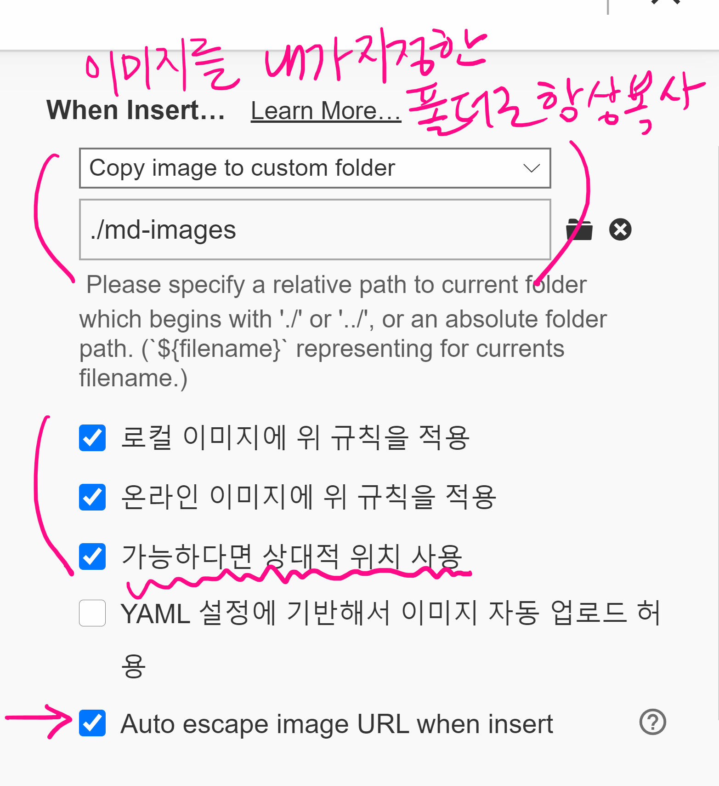

# markdown 

> 매우 가벼운 텍스트를 구조화하는(markup) 언어

## 제목(heading)

문서의 제목을 나타내기 위해 사용되며, #을 통해 제목의 수준(level)을 정한다.

### 제목3

#### h4

##### h5

###### h6

## 목록(list)

* 순서가 없는 목록(unordered list)
* 순서가 없는 목록입니다.
  * tab을 누르면, 하위 목록을 작성할 수 있습니다.
* shift+tab하시면 상위 목록을 작성할 수 있습니다.

1. 순서가 있는 목록(ordered list)
2. 순서가 있습니다.
   1. 하위 목록을 작성할 수 있습니다.
   2. 계속..

## 코드 블록

코드블록은 backtick(`)세개로 구성되며, 특정 언어를 같이 작성하면 대부분 편집기에서 언어별 syntax highlighting을 지원한다.

예시) 

```
​```python
print('hi')
# 주석
​```
```

```python
print('hi')
# 주석
if True:
    print('참')
```

```html
# 주석인가?
<!-- 주석이다. -->
```

### 인라인 코드블록

backtick(`)을 하나로 문장 내에 있는 코드(함수이름 등)를 블록화할 때 사용

ex ) `random` 모듈을 활용하는 것을 배웠다. `print` 함수는 출력할 때 사용한다. `if` 는 조건문에서 사용되며, 다중 조건을 할 때는 `elif` 를 쓴다.


## 표(table)

| 이름   | 출석 |      |
| ------ | ---- | ---- |
| 홍길동 | V    |      |
| 김철수 | V    |      |
| 이영희 | V    |      |

## 이미지


* Typora에 아래처럼 설정하면, 자동으로 특정 폴더에 상대경로로 입력
  * 절대경로 - `C:\Users\lec\Desktop\1.png`
  * 상대경로 - `md-images/1.png`



## 링크

[구글](https://google.com)

## 인용문

> 인용, 정의 / 정리

인용문은 `>` 기호로 작성한다.

## 기타

* 수직선 `---` 

  ---

* 기울임(이탤릭) `*` 로 감싸기

  * *기울임*

* 굵게(볼드) `**` 로 감싸기

  * **굵게**

* 취소선 `~~` 로 감싸기

  * ~~취소선~~

  

## 리눅스 기본 명령어들

- ls : List 목록
- cd : change directory 폴더이동
- mkdiv : make directory 폴더 생성
- touch : 비어있는 파일 생성 (ex: touch 파일이름.확장자)
- rm : remove 삭제


