## NodeJS

- 크롬 V8 자바스크립트 엔진으로 Build된 자바스크립트를 런타임(실행)하는 것

  - 런타임: 특정 언어로 만든 프로그램들을 실행할 수 있게 해주는 가상 머신(크롬의 V8 엔진 사용)의 상태

- 내부 : V8과 libuv를 내부적으로 포함한다

  - V8 엔진 : 오픈 소스 자바스크립트 에진 => 속도 문제 개선
  - libuv: 노드의 특성인 이벤트 기반, 논블로킹 I/O(Input/ Output) 모델을 구현한 라이브러리

  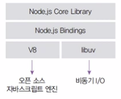


##### * 자바스크립트를 왜 Node가 실행해야하는 것일까?

- Node : 자바스크립트로 만든 프로그램을 실행할 수 있게 해준다

- 브라우저가  html을 읽으면서 script source를 같이 읽었다
  - html이 없으면 script를 읽을 수 없다
  - html에 종속되어 있었다
- NodeJs를 설치하면 html상관없이 V8 자바스크립트 엔진으로 script source를 해석해준다
  - Node가 html에대한 종속을 벗어나게 해주었다
  - Node가 자바스크립트의 역할을 확장시켜준다
- Node는 서버가 아니다
  - 자바스크립트로 서버코드를짜면 서버가 되는것
    - 서버 실행을 위해 필요한 http/https/http2 모듈을 제공
  - 서버의 역할도 수행할 수 있는 자바스크립트 런타임
- Node 이전에도 자바스크립트로 런타임을 만들기 위한 많은 시도가 있었으나 엔진 속도 문제로 실패


##### * 이벤트 기반

- 이벤트가 발생할 때 미리 지정해둔 작업을 수행하는 방식

  - ex) 클릭, 네트워크 요청, 타이머 등
  - `event listener` : 이벤트를 등록하는 함수
  - `Callback Function` : 이벤트가 발생했을 때 실행될 함수 

  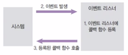


##### * 논블로킹 I/O

- 오래 걸리는 함수를 백그라운드로 보내서 다음 코드가 먼저 실행되게 하고, 나중에 오래 걸리는 함수를 실행

  - 논 블로킹 방식 하에서 일부 코드는 백그라운드에서 병렬로 실행됨
  - 일부 코드 :  I/O 작업(파일 시스템 접근, 네트워크 요청), 압축, 암호화 등
  - 나머지 코드는 블로킹 방식으로 실행됨

  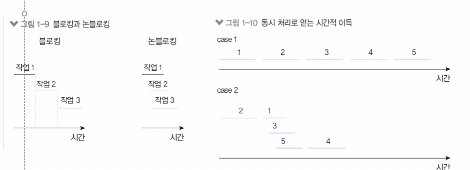


## Server

- 다른 컴퓨터에서 연결이 가능하도록 **대기 상태**로 상시 실행중인 프로그램
  - ex) 영업중인 식당
    - 손님이 올 수 있도록 식당을 열고 대기중인 상태
    - 손님이 오면 식당 메뉴/ 정책에 따라 서비스 제공

1. Web Server (aka. HTTP server)

   - Client가 요청을 보내고 Server가 응답을 보낸다
     - 실시간 상호작용 X (요청&응답)
     - Client와 Server간 질의 /응답 형태
     - 드물게 정보를 요청/갱신
     - 실시간 Interaction 필요X
     - Server에서 Client에게 먼저 접근할 일X
   - Client가 떠나면 Server에서는 Client의 상태를 당분간 잊고 지낸다(Stateless)
   - 웹 서비스를 만드는 데 사용
     - 구글, 아마존, 네이버 등등
     - 처음부터 만드는 경우는 거의 없고 프레임워크를 하나 골라서 사용
       - ASP.NET, Spring, NodeJS, Django, Flask, PHP
   - ex) 테이크아웃 포장 전문 식당

2. Game server(aka. TCP server, Binary Server, Stateful Server)

   - Client와 Server간 실시간 상호작용

     - 요청/갱신 횟수가 많다
     - 실시간 Interaction필요
     - Server가 언제라도 Client에게 접근 가능해야한다
     - Client가 Game에 접속해있을 때, Server가 Client의 상태를 보며 서비스 제공한다(Stateful)

   - Game Server도 Web Server를 이용한다

     - ex) 인증 & 로그인 -> Web Server이용 후 GameServer로 넘어온다

   - 최적의 프레임워크 & 장르에 따라 요구사항이 다르다

     | 고려할 대상              | 의미                      |
     | ------------------------ | ------------------------- |
     | 최대 동시 접속자         |                           |
     | Thread 개수 & 모델       |                           |
     | 게임 로직                | Client의 행동에 따른 운영 |
     | 네트워크                 | Client와 Server간 소통    |
     | DB                       | 데이터 처리               |
     | 게임장르 및 채널링       |                           |
     | 네트워크 모델            |                           |
     | 반응성(FPS, MMORPG, ...) |                           |

   - ex) 일반 식당

##### * 프로그램

- 실행 가능한 명령어의 집합


##### * 프로세스 & 스레드

- 프로세스 : 운영체제에서 할당하는 작업의 단위, 프로세스 간 자원 공유X

  - 기본적으로 프로그램 하나 띄울 때 프로세스가 한개 이상 뜬다
  - ex) Chrome

- 스레드 : 프로세스 내에서 실행되는 작업의 단위, 부모 프로세스 자원 공유

  - ex) Chrome의 Tab

- Node Process는 멀티 스레드이지만 직접 다룰 수 있는 스레드는 하나이기 때문에 싱글 스레드라고 표현

  - Node가 Single Thread였다면 코드가 동시에 돌아가는 것이 불가능했을 것이다

- Node는 주로 멀티 스레드 대신 멀티 프로세스 활용

- 14버전부터 멀티 스레드 사용 가능

  


##### * 프로세스

- 컴퓨터에서 실행되고 있는 프로그램
- 메모리에 적재되어 실행되고 있는 프로그램
  - 실제 실행중인 프로그램을 일컫는다(동적이라고 표현하기도 함)
- 프로세스마다 최소 1개의 스레드 소유(메인 스레드)
- 각 프로세스는 별도의 주소 공간에서 실행되며, 다른 프로세스의 변수나 자료구조에 접근이 불가
  - 다른 프로세스의 자원에 접근하기 위해서는 IPC를 사용
- 프로세스는 각각 독립된 메모리 영역(Code(text), Data, Heap, Stack)을 할당받는다
  - Code: 프로그램의 실제 코드 저장
  - Data: 프로세스 실행 시 정의된 전역변수와 static변수
  - Heap: 프로세스 런타임 중 동적으로 할당되는 변수들 저장(함수 내에서 할당되는 변수 등)
  - Stack: 함수에서 다른 함수를 실행하는 등의 서브루틴들의 정보 저장


##### * 스레드

- 프로세스 내에서 실행되는 여러 흐름의 실행 단위

- 스레드는 CPU가 실행시켜야 동작한다

  - 1개의 CPU는 1개의 스레드를 실행시킬 수 있다

  - 1개의 CPU가 각 프로그램을 왔다갔다 반복하면서 스레드를 실행시킨다

    - 우리 눈에는 여러개의 프로그램이 동시에 돌아가는 것처럼 보인다
    - CPU가 왔다갔다하면서 스레드를 동작시키는 과정자체가 무겁고 힘든과정

    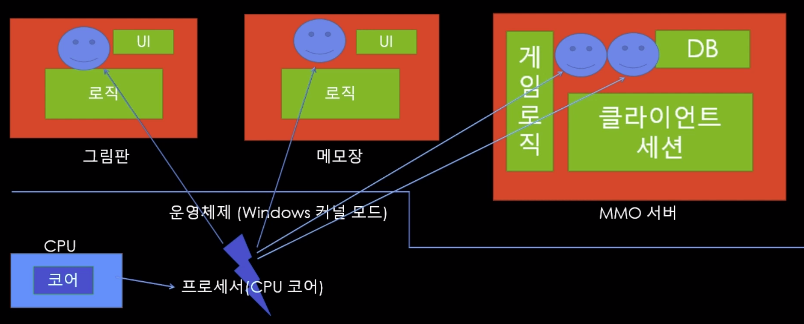

- 기아현상 : CPU가 한 쪽 프로그램에 몰려있으면 다른 프로그램은 실행이 원활하지 않다

- 모든 스레드는 Heap영역과 데이터 영역을 공유하지만, 스택영역은 공유하지 않는다

  - 스택을 공유하지 않는 이유
    - 스택은 함수 호출 시 전달되는 인자, 작업 후 되돌아갈 주소값 및 함수 내에서 선언하는 변수 등을 저장하기 위해 사용되는 메모리 공간
    - 스택 메모리 공간이 독립적이라는 것은 독립적인 함수 호출이 가능하다는 것이고 이는 독립적인 실행 흐름이 추가되는 것
    - 스레드의 정의에 따라 독립적인 실행 흐름을 추가하기 위한 최소 조건으로 독립된 스택을 할당
  - PC 레지스터를 공유하지 않는 이유
    - PC값은 스레드가 명령어의 어디까지 수행하였는지를 나타내게 된다
    - 스레드는 CPU를 할당받았다가 스케쥴러에 의해 다시 선점, 명령어가 연속적으로 수행되지 못하고 어느 부분까지 수행했는지 기억해야 한다.
  - Heap, data영역을 공유하기 때문에 IPC없이도 스레드간 통신가능
  - code 영역을 공유하기 때문에 프로세스 내부 스레드들은 프로세스가 가지고 있는 함수 호출가능

  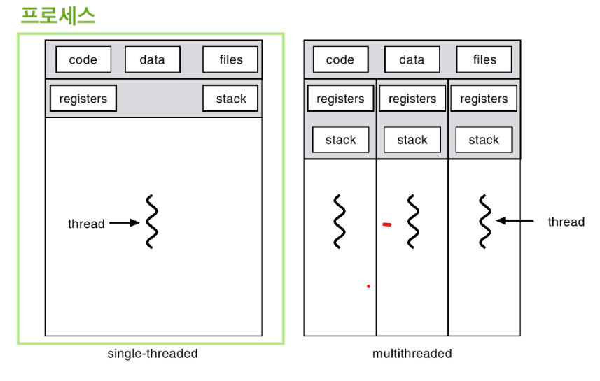


##### * 싱글 스레드

- 주어진 일을 하나밖에 처리하지 못한다

  - 블로킹이 발생하는 경우 나머지 작업은 모두 대기해야 함 -> 비효율

- 프로그램 1개에 1개의 스레드로 구성하여 작업을 처리

- 싱글 스레드 모델은 에러를 처리하지 못하는 경우 멈춘다

  - 프로그래밍 난이도 쉽고, CPU, 메모리 자원 적게 사용

- ex) 주방에 비유 (점원 : 스레드, 주문 : 요청, 서빙 : 응답)

  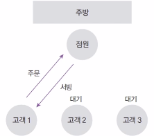


##### * 멀티스레드

- 프로그램에 여러개의 스레드로 구성하여 작업을 처리

- 에러 발생 시 새로운 스레드를 생성하여 극복

- 장점

  - 스레드들은 각자의 stack, 레지스터 영역을 제외한 모든 메모리를 공유하기 때문에 통신의 부담이 적다
  - 스레드간 데이터를 주고 받는 것이 간단해지고 시스템 자원소모가 감소
  - 프로세스를 생성하여 자원을 할당하는 시스템 콜이 감소하여 자원의 효율적 관리 가능

- 단점

  - 하나의 스레드가 데이터 공간 훼손 시, 모든 스레드가 작동 불가 상태
    - 공유하는 메모리를 소유하기 때문이다
  - 새로운 스레드 생성이나 놀고 있는 스레드 처리에 비용 발생
  - 프로그래밍 난이도 어려움
  - 스레드 수만큼 자원을 많이 사용

- ex) 주방에 비유 (점원 : 스레드, 주문 : 요청, 서빙 : 응답)

  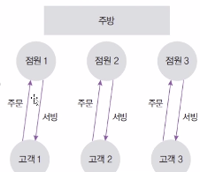


##### * NodeJs에서의 싱글 스레드

- 멀티 프로세싱
  - 스레드가 하나인 노드 프로세스를 여러개가 존재
    - 요청을 각 프로세스에 분산시킨다

- 논 블로킹 모델을 채택하여 일부 코드(I/O)를 백그라운드(다른 프로세스)에서 실행 가능

  - 요청을 먼저 받고, 완료될 때 응답함
  - I/O관련 코드가 아닌 경우 싱글 스레드, 블로킹 모델과 같아짐

  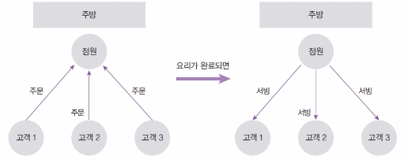


##### * 서버로서의 노드

- Server : 네트워크를 통해 클라이언트에 정보나 서비스를 제공하는 컴퓨터 또는 프로그램

- Client : 서버에 요청을 보내는 주체

  - 브라우저, 데스크탑 프로그램, 모바일 앱, 다른 서버에 요청을 보내는 서버

- ex)

  - 브라우저(클라이언트, 요청)가 길벗 웹사이트(서버, 응답)에 접속
  - 핸드폰(클라이언트)을 통해 앱스토어(서버)에서 앱 다운로드

  

- 노드 서버의 장단점

  | 장점                                              | 단점                                          |
  | ------------------------------------------------- | --------------------------------------------- |
  | 멀티 스레드 방식에 비해 컴퓨터 자원을 적게 사용함 | 싱글 스레드라서 CPU 코어를 하나만 사용함      |
  | I/O 작업이 많은 서버로 적합                       | CPU 작업이 많은 서버로는 부적합               |
  | 멀티 스레딩 방식보다 쉬움                         | 하나뿐인 스레드가 멈추지 않도록 관리해야 한다 |
  | 웹 서버가 내장되어 있음                           | 서버 규모가 커졌을 때 서버를 관리하기 어려움  |
  | 자바스크립트를 사용함                             | 어중간한 성능                                 |
  | JSON 형식과 호환하기 쉬움                         |                                               |

  - CPU 작업을 위해 AWS Lambda, Google Cloud Functions같은 별도 서비스 사용


##### * 서버 외의 노드

- 자바스크립트 런타임이기 때문에 용도가 서버에만 한정되지 않음
- 웹, 모바일, 데스크탑, 애플리케이션에도 사용
  - 웹 프레임워크 : Angular, React, Vue, Meteor 등
  - 모바일 앱 프레임워크 : React Native
  - 데스크탑 개발 도구 : Electron(Atom, Slack, VSCode, Discord 등 제작)


##### * REPL

- 자바스크립트는 스크립트 언어라서 즉석에서 코드를 실행할 수 있다

- REPL이라는 콘솔

  - R(Read), E(Evaluate), P(Print), L(Loop)

  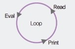

- window에서는 명령 프롬프트, Mac & 리눅스에서는 터미널에 node 입력

  - `node 자바스크립트 파일 경로`로 실행


##### * 모듈 만들기

- Node는 자바스크립트 코드를 모듈로 만들 수 있다

  - 모듈 : 특정한 기능을 하는 함수나 변수들의 집합

  - 모듈로 만들면 여러 프로그램에서 재사용 가능

    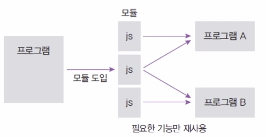

- 파일 끝에 module.exports로 모듈로 만들 값을 지정

  ```javascript
  // test.js
  const odd = "Test입니다.";
  const even = "Test중입니다.";
  
  module.exports = {
    odd,
    even,
  };

- 다른 파일에서 require(파일경로)로 모듈의 내용 가져올 수 있음

  - require함수는 node에서 기본적으로 제공한다

  ```javascript
  // test.js와 같은 경로에 존재
  const value = require(./test);
  console.log(value); // { odd: "Test입니다.", even: "Test중입니다."}
  
  // 구조분해
  const { odd, even } = require("./test.js")
  ```

- 자바스크립트 자체 모듈 시스템 문법

  - require대신 import, module.exports대신 export default를 사용


##### * 노드 내장 객체

1. global
   - 노드의 전역 객체
   - 브라우저의 window와 비슷한 역할
   - 모든 파일에서 접근 가능
   - window처럼 생략도 가능(console, require도 global의 속성)

2. global 속성 공유

   - global 속성에 값을 대입하면 다른 파일에서도 사용 가능

   ```javascript
   //globalA.js
   module.exports = () => global.message;
   
   //globalB.js
   const A = require('./globalA');
   
   global.message = "안녕하세요";
   console.log(A());
   
   // console창
   $ node globalB
   안녕하세요
   ```

3. console 객체

   - 브라우저의 console 객체와 매우 유사
   - console.time, console.timeEnd : 시간 로깅
   - console.error : 에러 로깅
   - console.log : 평범한 로그
   - console.dir : 객체 로깅
   - console.trace : 호출스택 로깅

4. 타이머 메서드

   - set 메서드에 clear 메서드가 대응됨
   - set 메ㅔ서드의 리턴 값(아이디)을 clear 메서드에 넣어 취소
   - setTimeout(콜백함수, 밀리초): 주어진 밀리초(1000분의 1초) 이후에 콜백 함수를 실행
   - setInterval(콜백함수, 밀리초): 주어진 밀리초마다 콜백 함수를 반복 실행
   - setImmendiate(콜백함수) : 콜백 함수를 즉시 실행
     - setTimeout 0초와 비슷
   - clearTimeout(아이디): setTimeout을 취소
   - clearInterval(아이디): setInterval을 취소
   - clerImmediate(아이디): setImmediate를 취소
     - 즉시 실행되지만 백그라운드 -> TaskQueue -> 호출스택 과정에서 취소가능

5. `__filename` `__dirname`

   -  `__filename` : 현재 파일경로
   - `__dirname` : 현재 폴더(디렉터리)경로

6. module, exports

   - module.exports 외에도 exports로 모듈을 만들 수 있음

   - module.exports와 exports는 참조관계

   - 객체가 아닌 값을 넣으면 참조관계가 깨진다

     ```javascript
     // 깨지지 않는 유형
     exports.odd = odd;
     exports.even = even;
     
     module.exports = {
       odd,
       even,
     }
     
     // 깨지는 유형
     module.exports = function(){...}
     ```

7. Node에서 this

   - 최상위 스코프의 this는 module.exports를 가르킨다
   - 그 외에는 브라우저의 자바스크립트와 동일
   - 함수 선언문 내부의 this는 global(전역) 객체를 가리킴

   ```javascript
   // this.js
   conosole.log(this); // {}
   console.log(this === module.exports); // true
   conosole.log(this === exports); // true
   
   function whatIsThis() {
     console.log('function', this === exports, this === global);
   }
   whatIsThis(); // function false true
   ```

8. require

   - require.main : 어떤파일을 실행한건지 알아낼 수 있다(노드 실행 시 철 모듈 가르킴)
   - requrie.cache : require로 한번 읽은 모듈을 cache에 저장해두고 두번째 불러올 때부터는 cache(메모리 영역)에서 불러온다 
     - caching : 하드디스크에 있는 정보를 메모리로 불러온다
   - require가 제일 위에 올 필요는 없다
     - import는 맨 위에 있어야 한다
   - 순환참조
     - 두 개의 모듈이 서로를 require하는 상황을 조심해야 한다
     - 두 개의 모듈이 서로를 require하면 한 쪽이 빈 객체가 된다(무한 반복 막기위함)

9. process

   - 현재 실행중인 노드 프로세스에 대한 정보를 담고 있음
     - 컴퓨터마다 출력값이 다를 수 있다
     - version, arch`프로세스 아키텍처 정보`, platform`운영체제 플랫폼 정보`, pid`현재 프로세스의 아이디`, uptime()`프로세스가 시작된 후 흐른 시간`, exexpath`노드의 경로`, cwd()`현재 프로세스가 실행되는 위치`, cpuUsage()`현재 cpu사용량`

10. process.env

    - 시스템 환경 변수들이 들어있는 객체

    - 비밀키(DB 비밀번호, 서드파티 앱 키 등)를 보관하는 용도로도 쓰임

    - 환경 변수는 process.env로 접근가능

      ```javascript
      const secretId = process.env.SECRET_ID;
      const secretCode = process.env.SECRET_CODE;
      ```

    - 일부 환경 변수는 노드 실행시 영향을 미친다

      - ex) NODE_OPTIONS(노드 실행 옵션), UV_THREADPOOL_SIZE(스레드풀 개수)
      - max-old-space-size는 노드가 사용할 수 있는 메모리를 지정하는 옵션

11. process.nextTick(콜백)

    - 이벤트 루프가 다른 콜백 함수들보다 nextTick의 콜백 함수를 우선적으로 처리
    - 너무 남용할 시 다른 콜백 함수들의 실행이 늦어짐
      - 비슷한 경우로 promise가 있음(nextTick처럼 우선순위가 높다)

    ```javascript
    setImmediate( () => {
      console.log('immediate');
    });
    process.nextTick( () => {
      console.log('nextTick');
    });
    setTimeout( () => {
      console.log('timeout');
    }, 0);
    Promise.resolve().then( () => console.log('promise'));
    
    // 결과
    nextTick
    promise
    timeout
    immediate
    ```

12. process.exit(코드)

    - 현재의 프로세스를 멈춤
    - 코드가 없거나 0이면 정상 종료
    - 이외의 코드는 비정상 종료를 의미한다


##### * Node의 내장 모듈

1. os(operation system)

   - 운영체제의 정보를 담고 있음
   - 모듈은 require로 가져옴(내장 모듈이라 경로대신 이름만 적어도 된다)

   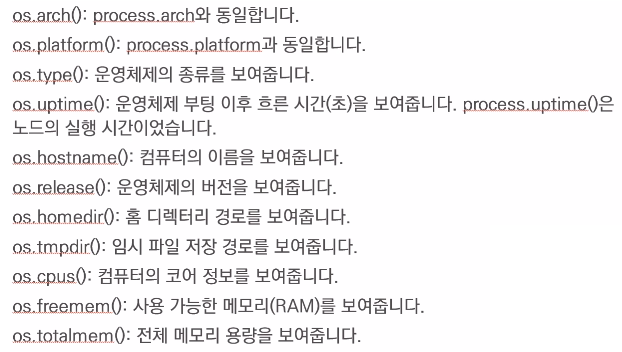

2. path

   - 폴더와 파일의 경로를 쉽게 조작하도록 도와주는 모듈
   - 운영체제별로 경로 구분자가 다르다(Windows : `\` , POSIX : `/`)

   ```javascript
   const path = require('path');
   
   path.join(__dirname, '/파일이름.js');
   path.join(__dirname, '..', '/파일이름.js');
   path.resolve(__dirname, '..', '/파일이름.js');
   ```

3. url 모듈

   - 인터넷 주소를 쉽게 조작하도록 도와주는 모듈

   - url 처리에 크게 두가지 방식이 있음(기존 노드 방식 vs WHATWG 방식)

   - 아래 그림에서 가운데 주소를 기준으로 위쪽은 노드방식, 아래쪽은 WHATWG방식

     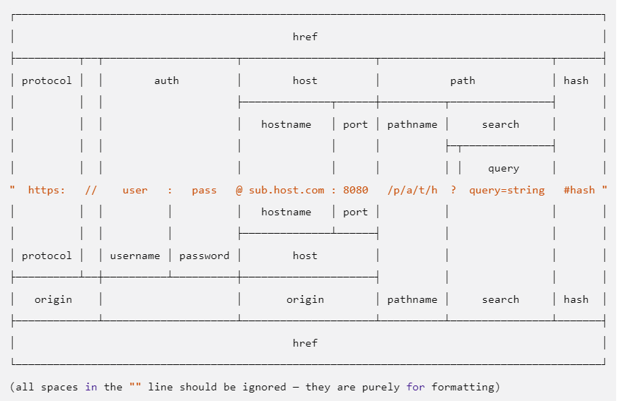

4. searchParams

   - WHATWG 방식에서 쿼리스트링(search) 부분 처리를 도와주는 객체
     - 쿼리스트링 : url(주소)에 데이터가 담겨있는 부분

   | get ALL(key)       | key에 해당하는 모든 값들을 가져온다.<br />category 키에는 두가지 값, 즉 nodejs와 javascript의 값이 들어 있다 |
   | ------------------ | ------------------------------------------------------------ |
   | get(key)           | key에 해당하는 첫 번째 값만 가져온다                         |
   | has(key)           | 해당 key가 있는지 없는지를 검사한다                          |
   | keys()             | searchParams의 모든 키를 반복가능한(iterator, ES2015 문법)객체로 가져온다 |
   | values()           | searchParams의 모든 값을 반복가능한 객체로 가져온다          |
   | append(key, value) | 해당 키를 추가한다. 같은 key의 값이 있다면 유지하고 하나 더 추가 |
   | set(key, value)    | append와 비슷하지만 같은 키의 값들을 모두 지우고 새로 추가   |
   | delete(key)        | 해당 키를 제거                                               |
   | toString()         | 조작한 searchParams 객체를 다시 문자열로 만든다. <br />이 문자열을 search에 대입하면 주소 객체 반영된다 |

5. queryString

   - 기존 노드 방식에서는 url querystring을 querystring 모듈로 처리

   - querystring.parse(쿼리) : url의 query 부분을 자바스크립트 객체로 분해

   - querystring.stringify(객체) : 분해된 query 객체를 문자열로 다시 조립

     ```javascript
     const url = require('url');
     const querystring = require('querystring');
     
     const parseUrl = url.parse('http://www.gilbut.co.kr/?page=3&limit=100&category=nodejs&category=javascript');
     const query = querystring.parse(parseUrl.query)
     
     // console1
     console.log(query);
     [Object: null prototype] {
       page: '3',
       limit: '10',
       category: ['nodejs', javascript]
     }
     
     // console2
     console.log(queryStringify(query))
     page=3&limit=100&category=nodejs&category=javascript
     ```

6. 단방향 암호화(crypto)

   - CPU를 많이 잡아먹어서 멀티 스레드로 돌아간다

   - 암호화는 가능하지만 복호화는 불가능

     - 암호화 : 평문을 암호로 만듬
     - 복호화 : 암호를 평문으로 만듬

   - 단방향 암호화의 대표 주자는 해시 기법

     - 문자열을 고정된 길이의 다른 문자열로 바꾸는 방식
     - 비밀번호같은 경우 암호화된 정보가 DB에 저장된다

     

7. Hash 사용하기(sha512)

   - createHash(알고리즘) : 사욜할 해시 알고리즘을 넣어준다

     - md5, sha1, sha256, sha512 등이 가능

     - Node에서는 pbkdf2와 scrypt 지원

       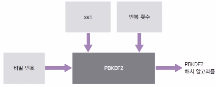

   - update(문자열) : 변환할 문자열을 넣어준다

   - digest(인코딩) : 인코딩할 알고리즘을 넣어준다

     - base64, hex, latin1이 주로 사용(base64가 결과 문자열이 가장 짧아 애용)

   ```javascript
   const crypto = require('crypto');
   crypto.createHash('sha512').update('테스트').digest('base64');
   ```

8. pbkdf2 인수로 순서대로 비밀번호, salt, 반복 횟수, 출력 바이트, 알고리즘

   ```javascript
   const crypto = require('crypto');
   
   crypto.randomBytes(64, (err, buf) => {
     const salt = buf.toString('base64');
     console.log('salt:', salt);
     crypto.pbkdf2('비밀번호', salt, 1000000, 64, 'sha512', (err, key) => {
       console.log('password:', key.toString('base64'));
     })
   })
   ```

9. 양방향 암호화

   - 대칭형 암호화(암호문 복호화 가능)
   - Key가 사용된다
   - 암호화할 떄와 복호호화 할 때 같은 Key를 사용해야 함
     - Key가 훔쳐질 관리가 있으므로 보안에 취약하다

10. util

    - 각종 편의 기능을 모아둔 모듈
    - deprecated 
      - 함수가 deprecated 처리되었음을 알려준다
      - 배포된 코드가 다른 사람이 쓰고있을 때 수정된 경우 사용
      - 예전 코드를 쓰는 사람에게 경고문을 띄어준다
    - promisify
      - 콜백패턴을 프로미스 패턴으로 바꿔준다
      - 콜백이 (error, data) => {}형식이여야 한다

11. fs

    - 파일 시스템에 접근하는 모듈
      - 브라우저에서는 제한적이었으나 노드는 권한을 가지고 있음
    - 파일/폴더 생성, 삭제, 읽기, 쓰기 가능

    ```javascript
    const fs = require('fs'); // 뒤에 promises 메서드 붙이면 promise화 된다
    
    fs.readFile('./readme.txt', (err, data) => {
      if (err) {
        throw err;
      }
      console.log(data); 
      console.log(data.toString());
    });
    
    // readme.txt
    저를 읽어주세요.
    
    // 결과
    <Buffer ec a0 80 eb a5 bc 20 ec 9d bd ec 96 b4 ec a3 bc ec 84 b8 ec 9a 94 2e>
    저를 읽어주세요.


##### * child_process

- 다른 프로그램(언어) 호출하는 방법

  ```javascript
  const spawn = require('child_process').spawn;
  
  var process = spawn('python', ['test.py']);
  
  process.stdout.on('data', function(data) {
    console.log(data.toString()); // 0101같은 컴퓨터 데이터를 toString
  }); // 실행 결과
  
  process.stderr.on('data', function(data) {
    console.error(data.toString());
  }); // 실행 >에러
  
  // python.py
  print('hello python')


##### * worker_threads

- 노드에서 멀티 스레드 방식으로 작업할 수 있다
- `Worker` : 독립적인 자바스크립트 실행 스레드
- `isMainThread` : 현재 코드가 메인 스레드에서 실행되는지, 워커 스레드에서 실행되는지 구분
- `parentPort` : Main Thread로 접근이 가능한 메세지 포트 인스턴스
- 메인 스레드에서는 new Worker를 통해 현재 파일(__filename)을 워커 스레드에서 실행
- `Worker.on, Worker.postMessage`로 부모 스레드와 다른 스레드간 메세지를 주고받을 때 사용
- `parentPort.postMessage(data)`
  - `worker.on('message')`를 사용한 부모 스레드에서 사용 가능
- `parentPort.on('message')`
  - `worker.postMessage(data)`를 사용한 부모 스레드로부터 보내진 메세지를 받아온다
- `workerData`
  - new Worker를 호출할 떄 두 번째 인수의 workerData속성으로 원하는 데이터를 보낼 수 있다
  - Worker에서는 workerData로 부모로부터 데이터를 받는다

1. Main Thread안에서 Worker Thread 생성
2. Worker Thread들한테 일을 분배
3. Worker Thread가  일을 마치면 Main Thread로 결과물을 다시 보냄
4. Main Thread에서 Worker Thread에서 보내준 것들을 합친다

- ex) File 1개에서 Main Thread와 Worker Thread 작업

  ```javascript
  const { Worker, isMainThread, parentPort } = require('worker_threads');
  
  if (isMainThread) {
    const worker = new Worker(__filename);
    worker.on('message', (value) => console.log('워커로부터', value))
    worker.on('exit', ()=> console.log('워커 끝~'))
    worker.postMessage('ping');
  } else {
    parentPort.on('message', (value) => {
      console.log('부모로부터', value);
      parentPort.postMessage('pong');
      parentPort.colse();
    })
  }
  
  // 결과
  부모로부터 ping
  워커로부터 pong
  워커 끝~
  ```

  ```javascript
  const { Worker, isMainThread, parentPort, workerData } = require('worker_threads');
  
  if (isMainThread) {
    const threads = new Set();
    threads.add(new Worker(__filename, {
      workerData: {start: 1},
    }));
    threads.add(new Worker(__filename, {
      workerData: {start: 2},
    }));
    for (let worker of threads) {
      worker.on('message', (value) => console.log('워커로부터', value))
      worker.on('exit', ()=> {
        threads.delete(worker);
          if (threads.size === 0) {
            console.log('워커 끝~')
          }
      });
    }
  } else {
    const data = workerData;
    parentPort.postMessage(data.start + 100);
  }
  
  // 결과
  워커로부터 101
  워커로부터 102
  워커 끝~

- ex) Worker Thread간의 데이터 송수신 Main Thread에서 중계

  ```javascript
  // main.js
  const {Worker} = require('worker_threads');
  const worker1 = new Worker('./worker1.js');
  const worker2 = new Worker('./worker2.js');
  worker1.on('message', message => worker2.postMessage(message))
  
  //worker1.js
  const {parentPort} = require('worker_threads');
  parentPort.postMessage('message from worker1');
  
  //worker2.js
  const {parentPort} = require('worker_threads');
  parentPort.on('message', message => {
    consol.elog('worker2 received message: %o', message)
  })
  
  // console
  $ node main.js
  worker2 received message: 'message from worker1'
  ```

- ex) 2부터 1,000만까지의 숫자 중에 소수가 몇개 있는지 알아내기

  ```javascript
  const { Worker, isMainThread, parentPort, workerData } = require('worker_threads');
  
  const min = 2;
  let primes = [];
  
  function findPrimes(start, range) {
    let isPrime = true;
    let end = start + range;
    for (let i = start; i < end; i++) {
      for (let j = min; j < Math.sqrt(end); j++) {
        if (i !== j && i % j === 0) {
          isPrime = false;
          break;
        }
      }
      if (isPrime) {
        primes.push(i);
      }
      isPrime = true;
    } 
  }
  
  if (isMainThread) {
    const max = 10000000;
    const threadCount = 8;
    const threads = new Set();
    const range = Math.ceil((max - min) / threadCount);
    let start = min;
    console.time('prime');
    for (let i = 0; i < threadCount - 1; i++) {
      const wStart = start;
      threads.add(new Worker(__filename, { workerData: { start: wStart, range } }));
      start += range;
    }
    threads.add(new Worker(__filename, { workerData: { start, range: range + ((max - min + 1) % threadCount) } }));
    for (let worker of threads) {
      worker.on('error', (err) => {
        throw err;
      });
      worker.on('exit', () => {
        threads.delete(worker);
        if (threads.size === 0) {
          console.timeEnd('prime');
          console.log(primes.length);
        }
      });
      worker.on('message', (msg) => {
        primes = primes.concat(msg);
      });
    }
  } else {
    findPrimes(workerData.start, workerData.range);
    parentPort.postMessage(primes);
  }
  ```


##### * 파일 시스템 접근하기

1. fs

   - 파일 시스템에 접근하는 모듈
     - 브라우저에서는 제한적이었으나 노드는 권한을 가지고 있음
   - 파일/폴더 생성, 삭제, 읽기, 쓰기 가능

   - ex) fs 예제

     ```javascript
     const fs = require('fs');
     
     fs.readFile('./readme.txt', (err, data) => {
       if (err) {
         throw err;
       }
       console.log(data); 
       console.log(data.toString());
     });
     
     // readme.txt
     저를 읽어주세요.
     
     // 결과
     <Buffer ec a0 80 eb a5 bc 20 ec 9d bd ec 96 b4 ec a3 bc ec 84 b8 ec 9a 94 2e>
     저를 읽어주세요.

   - ex) fs의 promise화

     ```javascript
     const fs = require('fs').promises;
     
     fs.writeFile('./writeme.txt', '글이 입력됩니다')
     .then(() => {
       return fs.readFile('./writeme.txt');
     })
     .then((data) => {
       console.log(data.toString());
     })
     .catch((err) => {
       console.error(err);
     });
     ```

   - ex) fs의 동기적 코드

     ```javascript
     const fs = require('fs');
     
     console.log('시작');
     let data = fs.readFileSync('./readme2.txt');
     console.log('1번', data.toString());
     data = fs.readFileSync('./readme2.txt');
     console.log('2번', data.toString());
     data = fs.readFileSync('./readme2.txt');
     console.log('3번', data.toString());
     console.log('끝');
     ```

   - ex) 비동기 방식 유지 & 순서 유지

     ```javascript
     const fs = require('fs').promises;
     
     async function main() {
       let data = await fs.readFile('./readme.txt');
       console.log('1번', data.toString());
       data = await fs.readFile('./readme.txt');
       console.log('2번', data.toString());
       data = await fs.readFile('./readme.txt');
       console.log('3번', data.toString());
       data = await fs.readFile('./readme.txt');
       console.log('4번', data.toString());
     }
     main();


##### * 버퍼와 스트림

- 버퍼 : 일정한 크기로 모아두는 데이터

  - 일정한 크기가 되면 한 번에 처리
  - 버퍼링 : 버퍼에 데이터가 찰 때까지 모으는 작업
  - `Buffer` 클래스로 버퍼를 직접 다뤄볼 수 있다
    - from(문자열) : 문자열을 버퍼로 바꿔준다
    - toString(버퍼) : 버퍼를 다시 문자열로 바꿔준다
    - concat(배열) : 배열 안에 든 버퍼들을 하나로 합친다
    - alloc(바이트) : 빈 버퍼를 생성

  ```javascript
  const buffer = Buffer.from('저를 버퍼로 바꿔보세요');
  console.log('from():', buffer);
  console.log('length:', buffer.length);
  console.log('toString():', buffer.toString());
  
  const array = [Buffer.from('띄엄 '), Buffer.from('띄엄 '), Buffer.from('띄어쓰기')];
  const buffer2 = Buffer.concat(array);
  console.log('concat():', buffer2.toString());
  
  const buffer3 = Buffer.alloc(5);
  console.log('alloc():', buffer3);
  
  // $ node buffer
  from(): <Buffer ec a0 80 eb a5 bc 20 eb b2 84 ed 8d bc eb a1 9c 20 eb b0 94 ea bf 94 eb b3 b4 ec 84 b8 ec 9a 94>
  length: 32
  toString(): 저를 버퍼로 바꿔보세요
  concat(): 띄엄 띄엄 띄어쓰기
  alloc(): <Buffer 00 00 00 00 00>

- 스트림 : 데이터의 흐름

  - 일정한 크기로 나눠서 여러 번에 걸쳐서 처리

    - 나눠진 조각을 chunk라고 한다

  - 버퍼(청크)의 크기를 작게 만들어서 주기적으로 데이터를 전달

  - 스트리밍 : 일정한 크기의 데이터를 지속적으로 전달하는 작업

    - 메모리 관리 효율이 높다

  - 대용량 파일서버를 작업할 때는 스트림 방식이 필수적

  - `createReadStream('파일경로', 버퍼의 크기)`

    - 용량이 큰 파일을 여러 조각으로 나눠준다

    ```javascript
    // 읽기
    const fs = require('fs');
    
    const readStream = fs.createReadStream('./readme3.txt', { highWaterMark: 16 });
    const data = [];
    
    readStream.on('data', (chunk) => {
      data.push(chunk);
      console.log('data :', chunk, chunk.length);
    });
    
    readStream.on('end', () => {
      console.log('end :', Buffer.concat(data).toString());
    });
    
    readStream.on('error', (err) => {
      console.log('error :', err);
    });
    
    // 쓰기
    const fs = require('fs');
    
    const writeStream = fs.createWriteStream('./writeme2.txt');
    writeStream.on('finish', () => {
      console.log('파일 쓰기 완료');
    });
    
    writeStream.write('이 글을 씁니다.\n');
    writeStream.write('한 번 더 씁니다.');
    writeStream.end();

  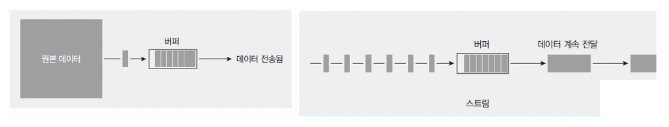

- pipe

  - 파일 복사

  - 파이핑 : 스트림끼리 연결하는 것

  - createReadStream으로 파일 읽고, 스트림을 전달받아 createWirteStream으로 파일 쓰기

    ```javascript
    const fs = require('fs');
    
    const readStream = fs.createReadStream('readme4.txt');
    const writeStream = fs.createWriteStream('writeme3.txt');
    readStream.pipe(writeStream);


##### * 스레드풀

- Node는 기본적으로 백그라운드에서 동시에 4개가 동시에 돌아갈 수 있다

- fs, crypto, zlib 모듈의 메서드를 실행할 떄는 백그라운드에서 동시에 실행
  - 스레드풀이 동시에 처리해준다


##### * 예외 처리하기

- 예외 : 처리하지 못한 에러

- Node는 기본적으로 Single Thread

  - 예외 발생 시 Node는 Thread를 멈춘다
  - 에러 처리가 필수

- 기본적으로 try catch문으로 예외를 처리

- 모든 에러를 기록해주는 코드 `process.on('uncaughtExeption', (err) => {...})`

  ```
  process.on('uncaughtException', (err) => {
    console.error('예기치 못한 에러' error))
  })
  ```

- 프로세스 종료하기

  ```
  // 윈도우
  $ netstat -ano | findstr 포트 
  $ taskkill /pid 프로세스아이디 /f
  
  // 맥/리눅스
  $ lsof -i tcp:포트
  $ kill -9 프로세스아이디


// 정리 수정할 것..


##### * HTTP 서버 만들기

-  HTTP 요청에 응답하는 Node 서버

  - createServer로 요청 이벤트에 대기
  - req 개체는 요청에 관한 정보가, res 객체는 응답에 관한 정보가 담겨 있음
  - `res.write` & `res.end`는 스트림 과정
  - 포트는 서버 내에서 프로세스를 구분하는 번호
    - 기본적으로 http 서브는 80번 포트 사용(생략가능, https는 443)
  - 하나의 도메인(호스트)에 Port번호를 다르게 하면 여러개의 프로그램을 동시에 연결할 수 있다
  - localhost는 컴퓨터 내부 주소
    - 외부에서 접근 불가

  - ex) 8080 포트에서 서버연결

    ```javascript
    const http = require('http');
    
    http.createServer((req, res) => {
      res.write('<hi>Hello Node!</h1>')
      res.write('<p>Hello Server!</p>')
      res.end('<p>Good</p>')
    })
      .listen(8080, () => {
        console.log('8080란 포트에서 대기 중입니다')
      })
    ```

  - HTML을 보내줬는데 어떤 브라우저에서는 HTML인지 문자열인지 모르는 브라우저가 존재

    - 직접 HTML이라는 것을 알려줘야 한다
    - Content-Type 설정

    - `res.writeHead(statusCode, { 'Content-Type': 'text/html; charset=utf-8'});`

  - 응답에 StatusCode 넣어주기

    `res.writeHead(statusCode, {option})` 

    ```javascript
    const http = require('http');
    
    http.createServer((req, res) => {
      res.writeHead(200, { 'Content-Type': 'text/html; charset=utf-8'})
      res.write('<hi>Hello Node!</h1>')
      res.write('<p>Hello Server!</p>')
      res.end('<p>Good</p>')
    })
      .listen(8080, () => {
        console.log('8080란 포트에서 대기 중입니다')
      })

- ex) fs로 HTML읽어 제공하기

  ```javascript
  const http = require('http');
  
  const server = http.createServer(async (req, res) => {
    try{
      res.writeHead(200, { 'Content-Type': 'text/html; charset=utf-8'})
      const data = await fs.readFile('./server2.html')
      res.end(data)
    }catch (err){
      console.log(err);
      res.writeHead(404)
      res.end(err.message)
    }
  })
    .listen(8080, () => {
      console.log('8080란 포트에서 대기 중입니다')
    })


##### * REST API

- 서버에 요청을 보낼 때는 주소를 통해 요청의 내용을 표현
  - /index.html이면 index.html을 보내달라는 뜻
    - 항상 html을 요구할 필요는 없다
  - 서버가 이해하기 쉬운 주소가 좋음
- 서버의 자원을 정의하고 자원에 대한 주소를 지정하는 방법
  - /user이면 사용자 정보에 관한 정보를 요청하는 것
  - /post이면 게시글에 관련된 자원을 요청하는 것
  - REST API로 구조를 잘 잡으면 해커들이 추측이 가능할 수 있다
- HTTP 요청 메서드
  - GET : 서버 자원을 가져오려고 할 때 사용
  - POST : 서버에 자원을 새로 등록하고자 할 때 사용
  - PUT : 서버의 자원을 요청에 들어있는 자원으로 치환하고자 할 때 사용
  - PATCH : 서버 자원의 일부만 수정하고자 할 때 사용
  - DELETE : 서버의 자원을 삭제하고자할 때 사용


##### * HTTP 프로토콜

- Client가 누구든 Server와 HTTP 프로토콜로 소통 가능
  - IOS, 안드로이드, 웹이 모두 같은 주소로 요청 보낼 수 있음
  - Server와 Client의 분리
- RESTful
  - REST API를 사용한 주소 체계를 이용하는 서버
  - ex) GET / user는 사용자를 조회하는 요청, POST /user는 사용자를 등록하는 요청


##### * 웹 소켓

- 실시간 양방향 데이터 전송을 위한 기술

- ws 프로토콜 사용

  - 브라우저가 지원해야 한다
  - 최신 브라우저는 대부분 웹 소켓을 지원함
  - Node는 ws나 Socket.IO같은 패키지를 통해 웹 소켓 사용 가능

- 한 번 열결하면 끊기전까지 연결이 유지된다

  - 연결 통로가 생성되는데 요청과 응답을 여러번 보낼 수 있다

-  HTTP와 포트 공유가능

- 성능이 좋다

- 웹 소켓 이전에는 폴링이라는 방식 사용

  - HTTP가 클라이언트에게서 서버로만 요청이 가기 때문에 주기적으로 서버에 요청을 보내 업데이트가 있는지 확인

  


##### * Server Sent Events

- EventSource라는 객체를 사용

- 처음에 한 번만 연결하면 서버가 Clien에 지속적으로 데이터를 보내줌

- Client에서 Server로는 데이터를 보낼 수 없음

  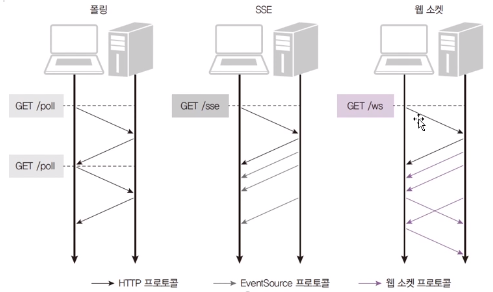


##### * Socket.io

- 호환되는 기술 자동 선택

  - ajax, polling, long polling, 웹 소켓

- Server는 HTTP기반으로 동작

  - HTTP, Socket.io Server & HTTP, Socekt.io Client

  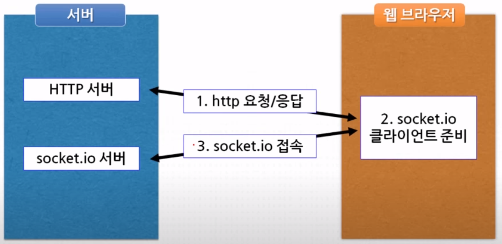

- 설치

  ```
  npm install socket.io
  ```

1. HTTP or Express 서버와 socket.io 서버 준비

   ```javascript
   // HTTP
   const http = require('http');
   const server = http.createServer(function(req, res) {
     res.end('socket.io Sample');
   })
   server.listen(3000);
   
   // Express
   const express = require('express');
   const http = require('http');
   
   const app = express();
   const server = http.Server(app);
   server.listen(8080);
   ```

2. socket.io 서버 생성

   ```javascript
   const Server = require('socket.io');
   const io = new Server(httpServer);
   
   // 축약 형태
   const io = require('socket.io')(server);
   ```

3. socker.io Client 준비

   - HTTP Server에게 socket.io 초기화 HTML 요청

     - Server가 scoket.io 초기화를 해주는 코드를 제공
     - Socket.io Client를 만드는 코드는 HTML안에 들어있다

   - HTML 로딩 - 스크립트 로딩

     - 서버 모듈 로딩 or CDN

     ```javascript
     <script src="/socket.io/socket.io.js"><script>
     <script src="https://cdn.socket.io/socket.io-1.3.7.js"></script>
     ```

   - 소켓 생성, socket.io 서버연결

     - 클라이언트 소켓 클래스 : `IO(url:String, opts:Object):Socket`

     ```javascript
     <script>
       const socket = io(); // Client 초기화
       
       socket.on('connect', function(arg){
         console.log('server connect');
       });
     </script>

   - Server의 socket.io Client html 응답

     ```javascript
     app.get('/', function(req, res){
       res.sendFile(__dirname + '/client.html');
     })
     ```

   - Client Event

     - `connect` : Server와 연결
     - error : 연결 에러
     - disconnect : 연결 끊김
     - reconnect, reconnectiong, reconnect_error, ... : 재접속
       - 서버와 연결 끊어지면 자동 재접속 시도

- ex) Server와 Client 연결

  ```javascript
  // Server
  const io = require('socket.io')(server);
  io.on('connection', function(socket) {
    console.log('Client Connect');
  });
  
  // Client
  <script src="/socket.io/socket.io.js"></script>
  <script>
    const socket = io();
    
    socket.on('connect', function(arg){
      console.log('server Connect');
    });
  </script>
  ```

  

##### * Socket.io의 데이터 교환 (이벤트 기반)

- 메시지 전송

  - 이벤트 발생 : `socket.emit('Event이름', data);`

  - Server에서의 이벤트 발생

    ```
    // 소켓 하나에 이벤트 발생 (1:1)
    socket.emit('Direct Event', [데이터]);
    
    // 연결된 모든 소켓에 이벤트 발생 (1:N)
    // 소켓에 연결된 모든 Client에 이벤트를 발생\
    // Server에서만 가능(Client쪽에서는 불가능) 
    socket.emit('Broadcast Event', [데이터]); //io.emit으로도 가능

- 메세지 수신

  - 이벤트 리스너 등록 : `socket.on('Event이름', function(data){...});`

- 서버에 이벤트 등록 : 클라이언트에서 이벤트 발생

  - Client에서 Server Message 전송

- 클라이언트에 이벤트 등록 : 서버에서 이벤트 발생

  - Server에서 Client로 Message 전송

- ex) 이벤트를 이용하여 데이터 주고 받기

  ```javascript
  // 보내기 & 받기
  socket.emit('hello', {message:"Welcome"});
  
  socket.on('howAreYou', function(data){
    const msg = data['message'];
  });
  
  // 받기 & 보내기
  socket.on('hello', function(data){
    const msg = data['message'];
  });
  
  socket.emit('howAreYou', {message: "Welcome"});
  ```

- ex) 실습

  ```javascript
  // Server
  const express = require("express");
  const http = require('http');
  const app = express();
  
  const server = http.createServer(app);
  server.listen(3000);
  
  app.get('/', function(req, res){
    res.sendFile(__dirname + '/client.html')
  });
  
  const io =require('socket.io')(server);
  io.on('connect', function(socket){
    console.log('클라이언트 접속');
    
    socket.on('discount', functino(){
      console.log('클라이언트 접속 종료')
    });
  
    setInterval(function(){
      socket.emit('message', '메시지';)
    }, 3000)
  });
  
  // Client
  <html>
  <head>
      <meta charset="UTF8">
      <script src="/socket.io/socket.io.js"></script>
      <script>
        const socket = io();
  
        socket.on('connect', function(){
          console.log('서버와 연결');
        });
      </script>
  </head>
  <body>
  	<h1>Socket.IO Sample></h1>
  	<ul>
          <script>
              socket.on('message', function(msg){
              document.writeln('<li>');
              document.writeln(msg);
              document.writeln('</li>');
          })
          </script>
  	</ul>
  </body>
  </html>


##### * 네임스페이스

- socket.io를 연결할 때 네임스페이스를 이용하여 연결

  - 같은 네임스페이스에서만 메시지 주고 받는다

- 기본 네임 스페이스: `/`

  ```javascript
  // Server
  const io = require('socket.io')(server);
  
  // Client
  const socket = io();

- Custom 네임스페이스 : `/NAME-SPACE`

  ```javascript
  // Server
  const io = require('socket.io')(server);
  const nsp = io.of('/Custom-Namespage');
  
  // Client
  const socket = io();
  const nps = io('/Custom-Namespage');
  ```

- ex) NameSpace를 이용한 커넥션과 통신

  ```javascript
  // Server
  const io = require('socket.io')(server);
  
  const system = io.of('/system');
  system.on('connection', function(socket) {
    console.log('System Client Connect');
  });
  system.emit('message', 'Notice');
  
  // Client
  <script src="/socket.io/socket.io.js"></script>
  <script>
    const socket = io();
    
    const sysNsp = io('http:/myserver.com/system');
    sysNsp.on('connect', function(arg){
      console.log('System server Connect');
    });
    sysNsp.on('message', function(data){
      alert('System message:' + data);
    })
  </script>


##### * 룸

- 네임스페이스 내 채널(작은 그룹)
- 같은 룸에서만 데이터 교환
- Server에서만 동작
  - Server에서 Client를 룸에 입장시키고 떠나게한다
- 룸에 입장(join), 여러 룸에 입장 가능
  - `Socket#join(name:String[,fn:Function]):Socket` : 특정 룸에 입장
- 룸에서 떠나기(leave)
  - `Socket#leave(name:String[,fn:Function]):Socket` : 룸에서 떠나기
- 룸 이벤트
  - `Socket#to(room:String):Socket` : 특정 룸에만 이벤트 발생

- ex) 룸을 이용한 통신

  ```javascript
  // Server
  const io = require('socket.io')(server);
  
  const system = io.of('/system');
  
  let room;
  system.on('joinRoom', function(data) {
    // 기존 방에서 나오기
    system.leave(room);
    
    // 새로운 채팅방 입장
    room = data.room;
    socket.join(room);
  });
  // 채팅 메시지, 룸으로(to) 전송
  system.on('chatInput', function(data){
    io.to(room).emit('chatMessage', chat);
  });
  
  // Client
  <script src="/socket.io/socket.io.js"></script>
  <script>
    const socket = io();
    
    const sysNsp = io('http:/myserver.com/system');
    
    // 룸에 입장
    sysNsp.emit('joinRoom', {room:room});
    
    // 채팅 메시지 수신
    sysNsp.on('chatMessage', function(data){
      const msg = data['msg'];
      const nick = data['nick'];
      const str = nick + ":" + msg;
      
      //채팅 메시지
      $('#messages').append($'<li>').text(str);
    });
  </script>


##### * 데이터베이스

- 관련성을 가지며 중복이 없는 데이터들의 집합
- DBMS : 데이터베이스를 관리하는 시스템
- RDBMS : 관계형 데이터베이스를 관리하는 시스템
- 서버의 하드 디스크나  SSD 등의 저장 매체에 데이터를 저장
- 서버 종료 여부와 상관 없이 데이터를 계속 사용가능
- 여러 사람이 동시에 접근할 수 있고, 권한을 따로 줄 수 있음

- 콘솔(CMD)에서 MySQL이 설치된 경로로 이동
  - 기본 경로는 `C:\Program Files\MySQL\MySQL Server 버젼\bin`
  - 편의를 위해 기본 경로를 환경변수로 등록해준다
-  MySQL Prompt 실행 : `mysql -h localhost -u root -p`
  - -h는 호스트, -u는 사용자, -p는 비밀번호
  - `exit` : MySQL 빠져나오는 명령어

- DB 생성 : `CREATE SCHEMA DB이름;`
  - ex) `CREATE SCHEMA `nodejs` DEFAULT CHARACTER SET utf8;`

- DB 선택 : `user DB이름;`
  - ex) `user nodejs;`
- Table  생성 : `CREATE TABLE DB이름.TABLE이름(OPTIONS)`


##### * [시퀄라이즈 ORM](https://sequelize.org/docs/v6/)

- MySQL 작업을 쉽게 할 수 있도록 도와주는 라이브러리

  - ORM : Object Relational Mapping : 객체와 데이터를 Mapping (1:1)
  - MySQL 외에도 다른 RDB(Maria, SQLite, MSSQL)와 호환가능
  - 자바스크립트 문법으로 DB 조각 가능

- 시퀄라이즈에서는 1:N관계에서 참조당하는 쪽을 hasMany로 표현

  - 반대의 입장(다른 Table의 column을 참조하는 쪽)에서는 belongsTo(속해있다)로 표현

  - belongsTo상태인 Table에 foreignKey column이 생긴다

  - `1 :  N => belongsTo : hasMany`

    ```javascript
    // foreignKey가 targetKey를 참조할 것이다
    // belongsTo인 Table쪽에 foreignKey가 생성된다
    static associate(db) {
      db.Table이름.belongsTo(db.Table이름, { foreignKey: "", targetKey: ""});
    }
      
    // foreignKey가 sourceKey를 참조하고 있다
    static associate(db) {
      db.Table이름.hasMany(db.Table이름, { foreignKey: "", sourceKey: ""});
    }
    ```

    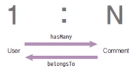

- 시퀄라이즈에서는 1:N관계에서 참조당하는 쪽을 hasOne로 표현

  - 반대의 입장(다른 Table의 column을 참조하는 쪽)에서는 belongsTo(속해있다)로 표현

  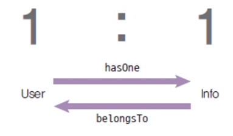

- DB특성상 다대다(N:M) 관계는 중간 테이블이 생긴다

  - 두 테이블 모두 중간 테이블을 참조하므로 belongsToMany

  - ex) Post와 Hashtag의 관계

    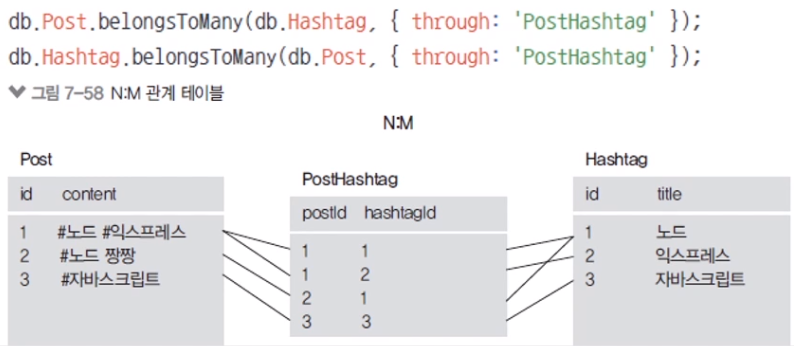

- 시퀄라이즈 명령어 사용하기 위한 sequelize-cli 설치

  - mysql2는 MySQL DB가 아닌 드라이버(NodeJS와 MySQL 이어주는 역할)
  - sequelize-cli : sequelize 명령어 사용할 수 있게해주는 package
  - sequelize : sequelize  본체
  - `npm i express morgan nunjucks sequelize sequelize-cli mysql2`
  - `npm i -D nodemon`

- 시퀄라이즈 구조 생성

  - `npx sequelize init`

    - sequelize-cli으로부터 명령어가 가능해진다
    - config, models, migrations, seeders foler들이 생성된다

  - models 폴더의 index.js

    - mysql squelize nodejs 연동

      ```javascript
      const Sequelize = require('sequelize');
      
      const env = process.env.NODE_ENV || 'development';
      const config = require('../config/config')[env];
      const db = {};
      
      const sequelize = new Sequelize(config.database, config.username, config.password, config); // 연결 객체
      
      db.sequelize = sequelize;
      db.Sequelize = Sequelize;
      
      module.exports = db;
      ```

  - config폴더에서 config.json에서 `username`, `database`, `password`를 연동하려는 DB의 값으로 설정해준다

- app.js작성해서 sequelize.sync로 연결

  ```javascript
  const express = require('express');
  const path = require('path');
  const morgan = require('morgan');
  const nunjucks = require('nunjucks');
  
  const { sequelize } = require('./models');
  
  const app = express();
  app.set('port', process.env.PORT || 3001);
  app.set('view engine', 'html');
  nunjucks.configure('views', {
    express: app,
    watch: true,
  });
  
  // sync를 통해서 node에서 database로 연결이 가능
  sequelize.sync({ force: false })
    .then(() => {
      console.log('데이터베이스 연결 성공');
    })
    .catch((err) => {
      console.error(err);
    });
  
  app.use(morgan('dev'));
  app.use(express.static(path.join(__dirname, 'public')));
  app.use(express.json());
  app.use(express.urlencoded({ extended: false }));
  
  app.use('/', indexRouter);
  
  app.use((req, res, next) => {
    const error =  new Error(`${req.method} ${req.url} 라우터가 없습니다.`);
    error.status = 404;
    next(error);
  });
  
  app.use((err, req, res, next) => {
    res.locals.message = err.message;
    res.locals.error = process.env.NODE_ENV !== 'production' ? err : {};
    res.status(err.status || 500);
    res.render('error');
  });
  
  app.listen(app.get('port'), () => {
    console.log(app.get('port'), '번 포트에서 대기 중');
  });

- 연결 테스트 : `npm start`
  - `SELECT 1+1 AS RESULT`가 나오면 연결 성공


##### * 모델(테이블) 생성

- `models`폴더의 `Table이름.js`파일에서 Code로 Table생성

- 생성된 Table은 `models`폴더의 `index.js`에서 추가

  - ex) user와 comment Table추가

    - 두 테이블은 관계성 Table

    ```javascript
    const Sequelize = require('sequelize');
    const User = require('./user'); // 추가된 코드
    const Comment = require('./comment'); // 추가된 코드
    
    const env = process.env.NODE_ENV || 'development';
    const config = require('../config/config')[env];
    const db = {};
    
    const sequelize = new Sequelize(config.database, config.username, config.password, config);
    
    db.sequelize = sequelize;
    db.Sequelize = Sequelize;
    
    db.User = User; // 추가된 코드
    db.Comment = Comment; // 추가된 코드
    
    User.init(sequelize); // init으로 sequelize와 연결, 추가된 코드
    Comment.init(sequelize); // 추가된 코드
    
    User.associate(db); // 관계설정
    Comment.associate(db); // 관계설정
    
    module.exports = db;

- Sequelize은 id column을 자동으로 만들어준다

  - id column 생략가능

- Sequelize와 MYSQL에서의 표현차이가 있다

  - Sequelize에서 여러개의 DB를 지원해주기 때문이다

    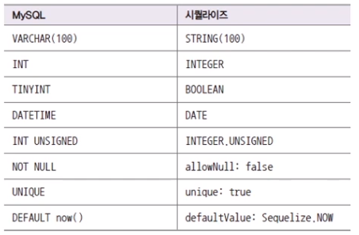

- ex)

  ```javascript
  const Sequelize = require('sequelize');
  
  module.exports = class 모델이름 extends Sequelize.Model {
    static init(sequelize){
      return super.init({
        // init에 column들을 정의해 넣을 수 있다
        column이름: {
          type: Sequelize.타입,
          allowNull: Boolean,
          unique: Boolean,
          ...
        }
      }, {
        // model에 대한 설정
        sequelize,
        timestamps: Boolean, // createdAt, updateAt 여부
        underscored: Boolean, // sequelize에서 자동으로 만들어주는 것들에 대한 이름설정
        paranoid: Boolean, // deleteAt(제거날짜) 여부, true일 때 soft delete
        modelName: "모델 이름", // 보통 단수형
        tableName: "테이블 이름", // 모델이름의 복수형
        charset: String, // utf8mb4, utf8
        collate: String, // utf8mb4_general_ci, utf8_general_ci
      });
    }
    
      
    // 관계 column(foreignKey, pk)
    // foreignKey가 targetKey를 참조할 것이다
    // belongsTo인 Table쪽에 foreignKey가 생성된다
    static associate(db) {
      db.Table이름.belongsTo(db.Table이름, { foreignKey: "", targetKey: ""});
    }
    
    // foreignKey가 sourceKey를 참조하고 있다
    static associate(db) {
      db.Table이름.hasMany(db.Table이름, { foreignKey: "", sourceKey: ""});
    }
  }


##### * 시퀄라이즈 쿼리

- Sequelize Query는 비동기

  - await을 써야한다
  - 결과값이 자바스크립트 객체

- sequelize를 통해 sql query를 쓸 수 있다

  - `await sequelize.query(query 문장);`

  ```javascript
  const [result, metadata] = await sequelize.query('SELECT * from comments');
  console.log(result);

- include로 JOIN과 비슷한 기능 수행이 가능(관계 엮는 것 엮을 수 있다)

  - inclue로 가져오면 성능상 문제가 생길 수 있다

  ```javascript
  const user = await User.findOne({
    include: [{
      model: Comment,
    }]
  });
  console.log(user.Comments);
  ```

- `get모델명`으로 관계 있는 데이터 로딩 가능

  ```
  const user = await User.findOne({});
  const comments = await user.getComments();
  console.log(comments);
  ```

- `include`, `get모델명`을 통한 관계 쿼리 메서드에도 where나 attributes 쓸 수 있다

- `as`로 모델명 변경 가능

- 생성 쿼리

  - ex) item이 드롭되고 주인이 정해질 때

    ```javascript
    const user = await User.findOne({});
    const item = await Item.create();
    
    await user.addItem(item);
    await user.addItem(item.id);

- N:M 모델은 다음과 같이 접근

  - `db.sequelize.models.PostHashtag`

- 수정 : `set모델명`, 삭제 : `remove모델명`

- SQL과 SEQUELIZE 쿼리비교

  ```javascript
  INSERT INTO nodejs.users (name, age, married) VALUES ('zero', 24, 0);
  const { User } = require('../models');
  await User.create({
    name: 'zero',
    age: 24, 
    married: false,
  })
  
  SELECT * FROM nodejs.users;
  await User.findAll({});
  
  SELECT name, married FROM nodejs.users;
  await User.findAll({
    attributes: ['name', 'married'],
  });
  
  // 특수한 기능들 Sequelize의 Op객체에 들어있다 (gt: >, lt: <, gte: >=, lte: <=)
  SELECT name, age FROM nodejs.users WHERE married = 1 AND age > 30;
  const { Op } = require('sequelize');
  const { User } = require('../models');
  await User.findAll({
    attributes: ['name', 'age'],
    where: {
      married: true,
      age: { [Op.gt]: 30},
    }
  });
  
  SELECT id, name FROM users WHERE married = 0 OR age > 30;
  const { Op } = require('sequelize');
  const { User } = require('../models');
  await User.findAll({
    attributes: ['id', 'name'],
    where: {
      [Op.or]: [{ married: 0}, { age: { [Op.gt]: 30 }}],
    },
  });
  
  
  SELECT id, name FROM users ORDER By age DESC;
  await User.findAll({
    attributes: ['id', 'name'],
    order: [['age', 'DESC']],
  });
  
  SELECT id, name FROM users ORDER BY age DESC LIMIT 1;
  await User.findAll({
    attributes: ['id', 'name'],
    order: [['age', 'DESC']],
    limit: 1,
  })
  
  SELECT id, name FROM users ORDER BY age DESC LIMIT 1 OFFSET 1;
  await User.findAll({
    attributes: ['id', 'name'],
    order: ['age', 'DESC'],
    limit: 1,
    offset: 1,
  });
  
  // 수정
  UPDATE nodejs.users SET comment = '바꿀 내용' WHERE id = 2;
  await User.update({
    comment: '바꿀 내용',
    },{
    where: { id: 2},
  });
  
  // 삭제
  DELTE FROM nodejs.users WHERE id = 2;
  await User.destory({
    where: {id: 2},
  });
  ```

  