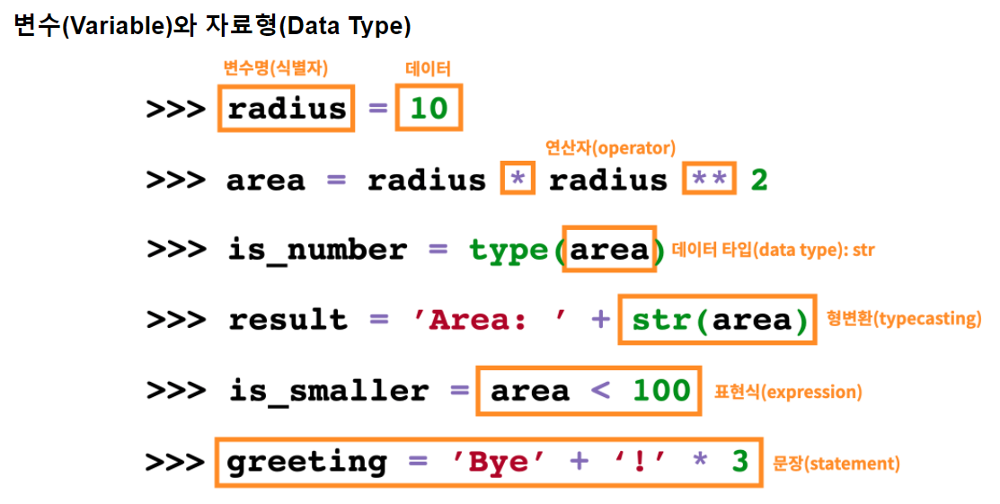
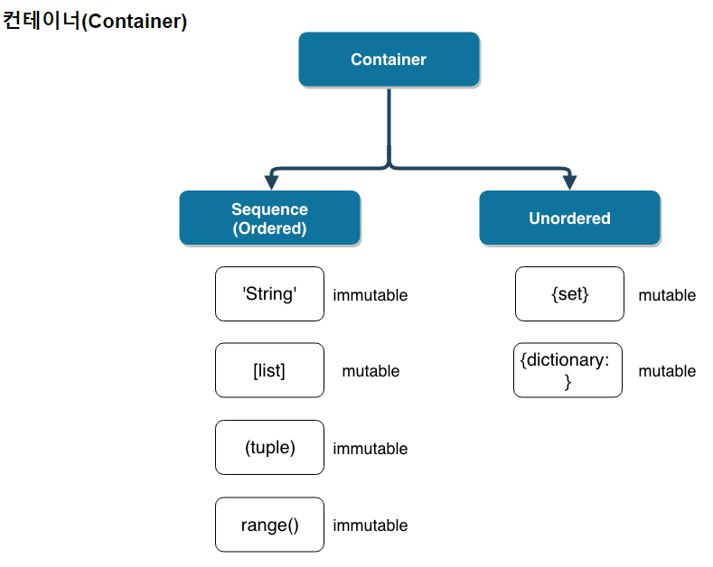
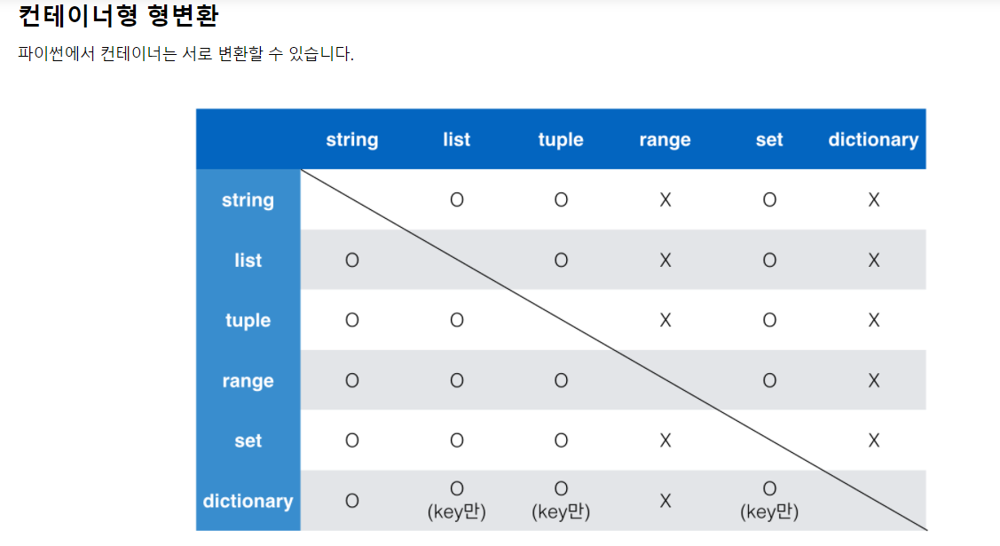
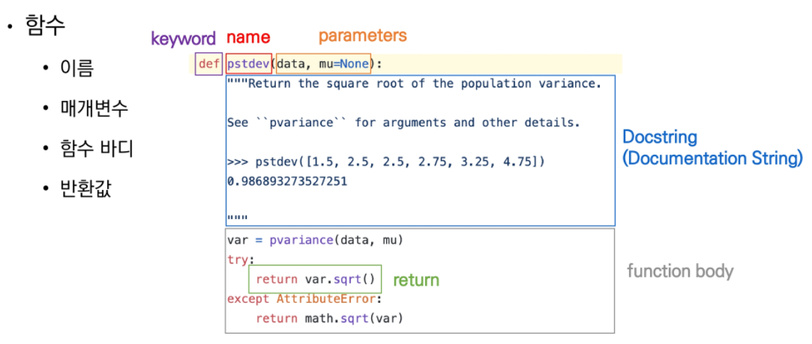
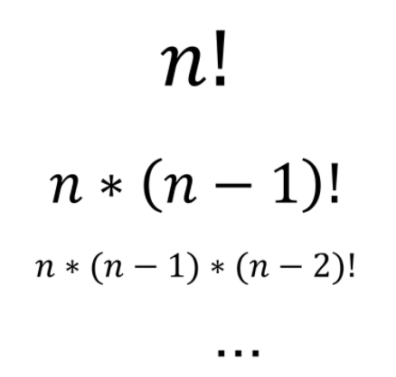
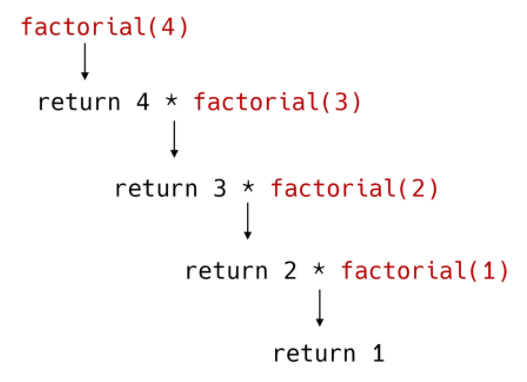
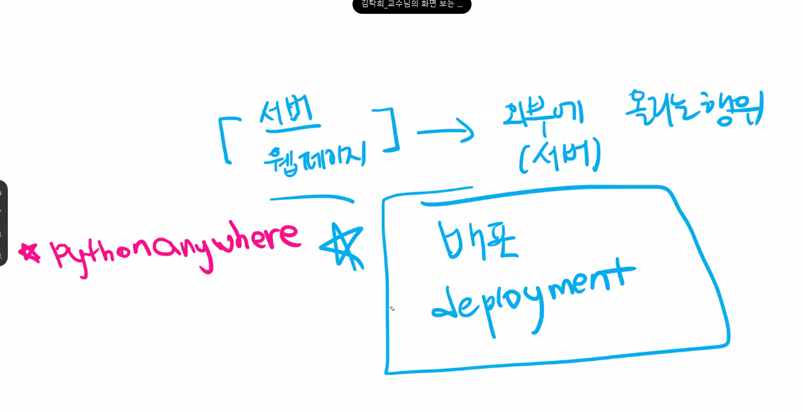

## 파이썬 라이브러리

[doc.python.org]('https://docs.python.org/ko/3/library/index.html')

## 코드 실행구도

[tutor]('http://pythontutor.com/index.html')

## 프로그래밍 언어 : 3형식

1. 저장
2. 조건
3. 반복

## 특징

- 특징
  1. 인터프리터 언어(Interpreter)
     - 소스 코드를 컴파일X, 한 줄씩 소스코드 읽어 바로 실행
     - 컴파일 언어에 비해 느릴 수 잇지만 빌드 과정 없이 바로 실행가능
  2. 객체 지향 프로그래밍
     - 파이썬은 모두 객체로 이뤄져 있음
  3. 동적 타이핑
     - 변수에 별도의 타입 지정이 필요 없음


## Python 개발환경

- 대화형 환경
  - Python 기본 Interpreter (IDLE Shell)
    - 인터프리터가 대화형 모드로 동작
      - 프롬프트(>>)에 코드를 작성하면 해당 코드가 실행 됨
      - 여러 줄의 코드가 작성되는 경우 보조 프롬프트(...)가 사용됨
    - Python이 설치된 환경에서는 기본적으로 활용 가능하나 디버깅 및 코드 편집, 반족 실행이 어려움
  - Jupyter Notebook
    - 웹 브라우저 환경에서 코드를 작성할 수 있는 오픈소스
    - 브라우저에서 코드를 실행하고 결과를 확인할 수 있음
  - 파이썬 쥬피터와 비쥬얼 스튜디오
    - 실시간으로 결과를 확인하며 학습하기 위함
  - 웹 : Visual Studio Code
    - HTML / CSS, Django, JavaScript, Vue 등 모두 개발하기 편한 환경
- 스크립트 실행
  - Python 스크립트 실행
    - IDE(ex - Pycharm), Text editor(ex - Visual Studio Code)등에서 작성한 파이썬 스크립트 파일을 직접 실행
  - .py 파일을 작성하고 IDE 혹은 Text Editor 활용


## 코드 스타일 가드

- 코드를 어떻게 작성할지 권장사항
  - 내가 작성하는 코드는 결국 다른사람들도 보게 되는 것 (맞춤법이라 생각)
- 파이썬 : PEP8
- 한글로 번역된 거 읽어보기


## 주석(Commnet)

- 한 줄 주석은 #으로 표현한다.
- 여러 줄의 주석은 한 줄씩 #을 사용하거나, """ 또는 '''표현한다.
  - docstring을 위해 사용
  - 함수/클래스의 설명을 작성 (설명서, 가이드라인)
  - 함수명.***doc\*** 출력하면 설명이 출력됨 (단 함수에 docstring을 설정해줘야 함)
- 주석할 코드 드래그 후 Ctrl + / 하면 주석처리


## 코드 라인

- 코드는 1줄에 1문장
- 문장은 파이썬이 실행 가능한 최소한의 코드 단위
- 세미콜론(;)을 사용하지는 않으나 한줄에 두개의 문장을 사용할 때 ;를 이용해 구분하여 표기가능


## 변수

- variable = 숫자, 문자, 객체 등 값을 넣을 수 있는 공간
- 사전적 의미 : "변화를 줄 수 있는" or  "변할 수 있는 수"
- 프로그래밍에서는 데이터를 담을 수 있는 공간(숫자, 문자, 객체)
- 변수 활용 이유 : 유지보수 관리 용이


#####  * 변수 선언하는 방법

- 변수명 = 대입할 값 (=는 대입)

- 변수는 할당 연산자(=)를 통해 값을 할당(assignment)

- 같은 값을 동시에 할당 가능

  ```python
  x = y = '값'
  x, y ='값1', '값2'
  ```

  ------

  ```python
  x, y = 1 #불가능
  ```


##### * 값 swap

- 임시변수 활용, Pythonic (x, y = y, x)


##### * 변수명 규칙

1.  영문자(대, 소문자 구분), 숫자, 언더바(_)를 사용할 수 있음.  ex)number와 Number는 다르다

2.  숫자로 시작할 수 없다. ex) 1a =0

3.  변수 하나에는 하나의 값만 넣을 수 있다.

   ​	- 어떤 값이 저장된 변수에 새로운 값을 넣으면 덮어씌워진다.
   
4.  길이 제한X, 대소문자 구별

5. 파이썬에서 이미 정의(예약)되고 있는 단어는 불가

   ex) Falase, True

   ```python
   import keyword
   print(keyword.kwlist) #를 통해서 사용되고 있는 예약어 확인가능
   ```

6. 내장함수나 모듈 사용X

   - 기존의 이름에 다른 값을 할당하게 되므로 더 이상 동작X

   ```python
   print('hi')
   print = 'hi' #print 함수에 hi 문자열을 저장해버림
   print('hi') #오류발생
   ```


##### * 데이터 타입

- 숫자 (int, float, complex)

- 문자열 (String)

- 참/ 거짓( Boolean)

- None

  *python에서는 오버플로가 일어나지 않는다. (메모리의 크기 자동 조정)


##### * 변수의 형태

- 숫자형 : 소수자 포함 숫자

  - float : 정수가 아닌 모든 실수

    - 314e - 2 = 3.14
    - float은 int로 형변환이 가능하나 소수점은 버려짐

  - 부동소수점에서 실수인경우 주의필요

    - 두 실수의 차이가 임의의 매우 작은 수(1e-10)보다 작은지를 확인, math 모듈 활용

    ```python
    abs(x - y) <= le-10  #le - 10는 사용자가 정한 임의의 수
    ```

    ```python
    # system상의 machine epslion
    import sys
    print(abs(x - y) <= sys.float_info.epsilon)
    ```

    ```python
    import math
    math.isclose(a, b)
    ```

  - 실수부와 허수부로 구성된 복소수는 complex 타입

    - 허수부는 j로 표현가능
    - 복소수.imag 허수부분, 복소수.real 실수부분
    
  - round(값, 표현할 소수점자릿수) 

    -  round()는 0~4내림, 5 (짝수에서 5는 내림, 홀수에서 5는 올림)

- 문자열 자료형 :  'Hello, World!', "123"

  - 모든 문자는 str타입
  - 문자열은 작은 따옴표' or 큰 따옴표" 사용
    - 하나의 문장부호를 선택하여 유지
  - upper()함수 : 문자열의 모든 문자들을 대문자로 바꿔 줌
  - lower()함수 : 문자열의 모든 문자들을 소문자로 바꿔 줌

- 리스트 자료형 : [], [1, 3, 5] (묶음 자료형)

- 튜플 자료형 : (), (1, 2, 3) 읽기전용(수정불가) 묶음

  ```
  a, b = (1, 2)
  print(a)
  print(b)
  #출력
  1
  2
  ```

- 딕셔너리 자료형:{'name':'MH',  'birth':'1118'}  클론(:)기준 왼쪽“키”, 오른쪽“값”

- 집합 자료형:set이용  교집합?합집합?여집합? set([1,2,3]), set("Hello")

- Boolean: True, False 참과 거짓 (논리자료형)

  - 계산식에 쓰일 때는 True는 1, False는 0으로 형변환
  - None, 빈 리스트, 빈 문자열 은 False, 이 외의 문자는 True
  - 값이 존재하는 리스트, 문자열  True

- None타입 : 값이 존재하지 않음

- type()

  - 변수에 할당된 값의 타입 확인

- 2진수 : 0b숫자

- 8진수 : 0o숫자

- 10진수 : 숫자

- 16진수 : 0x숫자

- ascii(아스키) 코드 
  - ord('ascii코드') -> ascii코드를 10진수로 바꿔 줌
  - chr(숫자) -> 숫자를 ascii코드로 바꿔 줌

##### * 변수의 주소

- id()
  - 변수에 할당된 값(객체)의 고유한 아이덴티티 값이며, 메모리 주소를 확인
  - 변수에 저장된 값 == 사람, 메모리 주소 == 사람이 있는 위치(집)
  - 변수에 새로운 값을 초기화 시키면 주소도 바뀐다 (-5~ 256까지는 같음)


##### * 문자열 안에 작은 따옴표나 큰 따옴표를 포함시키고 싶을 때

1. ""안에 '를 쓰기 or ''안에 "를 쓰기
2. \\' or \\"


##### * 이스케이프 문자

| 예약문자 | 내용(의미)       |
| -------- | ---------------- |
| \n       | 줄 바꿈          |
| \t       | 탭               |
| \r       | 캐리지리턴       |
| \0       | 널(Null)         |
| \\\\     | \                |
| \\'      | 단일인용부호(')  |
| \\"      | 이중인용부호('') |


##### * 타입 변환

- 파이썬에서 데이터 타입은 서로 변환 가능

- 암시적 타입 변환

  - 사용자 의도X, 파이썬 내부적으로 타입을 변환

  ```python
  True + 3 #True를 1로 변환해줌, 출력: 4
  5 + 5.0 #5를 float 타입으로 변환, 출력: 5.5
  5 + 5j + 5 #복소수로 바꿔줌, 출력: 10+5j
  ```

- 명시적 타입 변환

  - 사용자가 특정 함수를 활용하여 의도적으로 타입 변환
  - 형식에 맞아야 변환가능

- 데이터 타입이 다른 것들끼리 비교를 해버릴 때 암묵적 변경이 되지 않는 것들이 있다

  ```
  print([] == False) => []는 False가 맞으나 Flase가 출력됨
  print(bool([]) == False) => 타입 변환 시켜주고 써야 함
  if문에 조건식으로 줄 때 (bool타입과 비교하지 않는다는 가정하에) True False로 암시적 타입 변환
  ```

  

##### * String Interpolation

- 변수의 값을 문자열의 자리표시자(placeholder)로 대체하는 방법

  - %-formatting

    ```python
    print('안녕, %s' % name) 
    ```

    ```
    print('안녕, %s %d' %(name, 5) 
    ```

  - str.format()

    ```python
    print('안녕, {}', format(name))
    ```

  - f-strings(python 3.6 버젼 이상)

    ```python
    pinrt(f'안녕, {name})
    ```

---

---

## 연산자

##### * 산술 연산자

- 기본적인 사칙연산 및 수식 계산

  | 연산자 | 내용     |
  | ------ | -------- |
  | +      | 덧셈     |
  | -      | 뺄셈     |
  | *      | 곱셈     |
  | /      | 나눗셈   |
  | //     | 몫       |
  | **     | 거듭제곱 |
  | %      | 나머지   |

- divmod(x, y)
  - 몫과 나머지를 출력
  - 튜플 형태로 반환


##### * 비교연산자

- 값을 비교하며, True/ False 값을 리턴

  | 연산자 | 내용                        |
  | ------ | --------------------------- |
  | <      | 미만                        |
  | <=     | 이하                        |
  | >      | 초과                        |
  | >=     | 이상                        |
  | ==     | 같음                        |
  | !=     | 같지않음                    |
  | is     | 객체 아이덴티티(OOP)        |
  | is not | 객체 아이덴티티가 아닌 경우 |

- 특정 변수가 비어 있는 확인 하기 위해서는 is None을 사용

  ```
  x = '비어있는가??'
  x is None
  #출력: False
  ```

  

##### * 논리연산자

- 일반적으로 비교연산자와 함께 사용

| 연산자  | 내용                           |
| ------- | ------------------------------ |
| A and B | A와 B 모두 True시, True        |
| A or B  | A와 B 모두 False시 ,False      |
| Not     | True를 False로, Flase를 True로 |

- ##### 결과가 확실한경우 두번째 값은 확인하지 않음

  - 결과가 확실한 경우 두번째 값은 확인하지 않고 첫번째 값 반환

    - 0은 False, 0을 제외하고는 True

    - and연산에서 첫번째 값이 False인 경우 무조건 False -> 첫번째 값 반환

    - or 연산에서 첫번째 값이  True인 경우 무조건 True -> 첫번째 값 반환

    - 단축평가

      ```
      a = 10 and 5
      print(a) #출력5
      #10이 True이므로 5까지 비교하게 됨
      #만약 10대신 0이였다면 False이므로 뒤까지 볼 필요X 출력은 0
      
      b = 10 or 5
      print(b) #출력 10
      #첫번째 값이 True이므로 첫번째 값 무조건 출력
      
      c = 0 or 0 #출력은 0이나 뒤의 값이다.
      d = 0 or 5 #출력 5
      ```


##### * 복합 연산자

- 연산과 대입이 함께 이뤄짐
- +=, -=, *=, /=, //=, %= 등등


##### * Concatenation

- +는 숫자가 아닌 자료형에서도 사용가능

  - 리스트, 튜플, 문자열 사용 가능
  - range는 사용 불가능

- *는 숫자가 아닌 자료형에서도 사용가능

  - 리스트, 튜플, 문자열 사용 가능

  - range는 사용 불가능

    ```
    'hi' *3 #출력 : 'hihihi'
    (1, 2) * 3 #출력 : (1, 2, 1, 2, 1, 2)
    ```

    

- 컨테이너(데이터 타입), OOP에서 연산자의 다양한 활용을 확인


##### *  Concatenation Test

- 특정 요소가 속해 있는지 여부를 확인

  ```
  'b' in 'apple'
  #출력: False
  ```


##### * Identity

- is 연산자를 통해 동일한 객체(object)인지 확인 가능함


##### * Indexing / Sliciing

- []를 통해 값을 접근하고, [:]를 통해 슬라이싱 가능함
- 문자열은 0부터 Indexing번호를 가진다.
- Indexing : 리스트, 튜플, range, 문자열 사용 가능
- Sliciing : 리스트, 튜플, range, 문자열 사용 가능
  - [x:y]일 때 x포함 y불포함 


##### *연산자 우선순위

1. `()`을 통한 grouping
2. Slicing
3. Indexing
4. 제곱연산자 `**`
5. 단항연산자 `+`, `-` (음수/양수 부호)
6. 산술연산자 `*`, `/`, `%`
7. 산술연산자 `+`, `-`
8. 비교연산자, `in`, `is`
9. `not`
10. `and`
11. `o`

```
print(-3 ** 6) # 출력 : -729
print((-3) ** 6) # 출력 : 729
```


---

---

## 표현식(Expression)/문장(Statement)

- 표현식
  - 하나의 값(value)으로 환원(reduce)될 수 있는 문장을 의미
  - 값이 평가되고 있는 부분
    - ex) x  < 100
  - 식별자(변수명), 값, 연산자로 구성
  - 표현식은 평가(evaluate)되고, 값으로 변경
  - 하나의 값으로 환원(reduce)될 수 있는 문장
    - 식: 값이 될수 있냐 없냐?
  -  표현식 => evaluate => 값
    - 표현식은 결과적으로 값이 나온다.
    - 표현식에 함수호출(값을 return해주는 함수)이 올 수도 있다.
  - 하나의 값(value)도 표현식이 될 수 있다
- 문장
  - 값, 표현식
  - 파이썬이 실행가능한 최소한의 코드 단위
  - 모든 표현식은 문장
    - 표현식이 아닌 문장이 존재
      - ex) del5
  - 

```
if a > 3:
	실행문장
위에서 if a > 3:는 조건문
		a > 3 는 조건식
```




---

---

## 컨테이너(데이터 타입?)




- 컨테이너 : 여러 개의 값을 저장할 수 있는 것(객체)
  - 시퀀스형, 비 시퀀스형
  - string, list, tuple, range, set, dictionary
  
- 시퀀스(sequence)형 : 순서가 있는(ordered) 데이터
  - 순서가 있다 != 정렬되어 있다

  - 특정 위치의 데이터를 가리킬 수 있다.

  - 리스트(list), 튜플(tuple), 레인지(range), 문자형(string), 바이너리(binary)

  - 데이터의 길이(갯수) : len()
    - 시퀀스(문자열, 바이트열, 튜플, 리스트, range) 또는 컬렉션(딕셔너리, 집합 또는 불변 집합)
    
  - 최소/최대 : min(), max()
    - 문자열은 ascii 코드에 따름
    
  - 시퀀스에서의 특정 원소의 개수 : .count(찾고 싶은 원소)
    - 시퀀스에 등장하지 않는 경우 0 반환
    
  - 시퀀스 포함 여부 확인
    - in, not in
      - a in b : a가 b안에 있는지 여부
    
  - indexing : s[ i ]

  - slicing : s[ i : j ]

  - iterable한데이터.index(몇번째 위치한지 알아낼 데이터 값) : 몇번 째 인덱스인지 위치값 출력

    [iterable정리 블로그]('https://jiminsun.github.io/2018-05-11/Iteration/')

    - 컨테이너는 대부분 iterable
    
    - 컨테이너라고 안부르는 것중에서도 iterable이 존재함  :stirng
    
    - for in 뒤에 오는 건 iterable만 가능
    
    - iterable이 아닌 것: int float boolean
    - 데이터가 반복적인 의미를 갖는다 : iterable?
      - 데이터 한개가 의미를 갖는다???

    ```
    파이썬의 iterable과 iterator은 특별한 의미를 가지고 있다.
    
    Iterable의 특징은 일단 내부 원소에 하나씩 차례로 접근할 수 있다는 점이다. 따라서 이터러블은 for item in iterable: ...의 문법을 사용할 수 있다. 그런데 이러한 문법을 수행할 수 있는 것은 이터러블이 __iter__ 메소드를 가지고 있는 객체이기 때문이다. 이것이 이터러블의 좀 더 엄밀한 정의이다. 그리고 이 __iter__ 메소스가 하는 일은 iterator를 반환하는 것이다.
    
    Iterator는 __next__ 메소드로 데이터를 순차적으로 호출할 수 있는 객체이다. 즉 실제로 루프를 돌면서 반복 도중에 현재 위치가 어디인지를 기억하는 것은 이터레이터이다. 이터레이터는 __iter__ 메소드도 가지고 있는데, 실행할 경우 자기자신이 반환된다.
    
    보통은 파이썬에서 for 루프나, map, list comprehension을 사용하면, Iterator의 __next__ 메소드가 자동으로 호출되고 iteration 과정을 수행한다.
    ```
    
    ```
    iterable (이터러블)
    멤버들을 한 번에 하나씩 돌려줄 수 있는 객체. 이터러블의 예로는 모든 (list, str, tuple 같은) 시퀀스 형들, dict 같은 몇몇 비시퀀스 형들, 파일 객체들, __iter__() 나 시퀀스 개념을 구현하는 __getitem__() 메서드를 써서 정의한 모든 클래스의 객체들이 있다. 이터러블은 for 루프에 사용될 수 있고, 시퀀스를 필요로 하는 다른 많은 곳 (zip(), map(), …) 에 사용될 수 있다. 이터러블 객체가 내장 함수 iter()에 인자로 전달되면, 그 객체의 이터레이터를 돌려준다. 이 이터레이터는 값들의 집합을 한 번 거치는 동안 유효하다. 이터러블을 사용할 때, 보통은 iter()를 호출하거나, 이터레이터 객체를 직접 다룰 필요는 없다. for 문은 이것들을 여러분을 대신해서 자동으로 해주는데, 루프를 도는 동안 이터레이터를 잡아둘 이름 없는 변수를 만든다.
    
    iterator (이터레이터)
    데이터의 스트림을 표현하는 객체. 이터레이터의 __next__() 메서드를 반복적으로 호출하면 (또는 내장 함수 next() 로 전달하면) 스트림에 있는 항목들을 차례대로 돌려준다. 더 이상의 데이터가 없을 때는 대신 StopIteration 예외를 일으킨다. 이 지점에서, 이터레이터 객체는 소진되고, 이후의 모든 __next__() 메서드 호출은 StopIteration 예외를 다시 일으키기만 한다. 이터레이터는 이터레이터 객체 자신을 돌려주는 __iter__() 메서드를 가질 것이 요구되기 때문에, 이터레이터는 이터러블이기도 하고 다른 이터러블들을 받아들이는 대부분의 곳에서 사용될 수 있다. 중요한 예외는 여러 번의 이터레이션을 시도하는 코드다. (list 같은) 컨테이너 객체는 iter() 함수로 전달하거나 for 루프에 사용할 때마다 새 이터레이터를 만든다. 이런 것을 이터레이터에 대해서 수행하려고 하면, 지난 이터레이션에 사용된 이미 소진된 이터레이터를 돌려줘서, 빈 컨테이너처럼 보이게 만든다.
    ```
  
- 비 시퀀스형 : 순서가 없는(unordered) 데이터
  - 세트(set), 딕셔너리(dictionary)

### 1. 시퀀스

##### *리스트

- 리스트는 순서가 있는 시퀀스로 인덱스를 통해 접근
  - (시퀀스: 순서가 있다. But 정렬X)
  
- 인덱스는 0부터 시작

- 대괄호[] 혹은 list()를 통해 생성

- 값에 대한 접근은 list[숫자]

- 서로 다른 타입의 데이터를 저장할 수 있다.

- 리스트 오름차순 정렬

  ```
  numbers = [
           85, 72, 38, 80, 69, 65, 68, 96, 22, 49, 67,
           51, 61, 63, 87, 66, 24, 80, 83, 71, 60, 64,
           52, 90, 60, 49, 31, 23, 99, 94, 11, 25, 24,
       ]
  
  # 아래에 코드를 작성하시오.
  #버블정렬
  number = []
  min_num = 0
  for i in range(len(numbers)):
      for j in range(i+1, len(numbers)):
          if numbers[i] < numbers[j]:
              pass
          elif numbers[i] > numbers[j]:
              min_num = numbers[i]
              numbers[i] = numbers[j]
              numbers[j] = min_num
  print(numbers)
  ---
  numbers = [
           85, 72, 38, 80, 69, 65, 68, 96, 22, 49, 67,
           51, 61, 63, 87, 66, 24, 80, 83, 71, 60, 64,
           52, 90, 60, 49, 31, 23, 99, 94, 11, 25, 24,
       ]
  
  # 아래에 코드를 작성하시오.
  
  number = []
  min_num = 0
  for i in range(len(numbers)):
      for j in range(i+1, len(numbers)):
          if numbers[i] > numbers[j]:
              min_num = numbers[i]
              numbers[i] = numbers[j]
              numbers[j] = min_num
  print(numbers)
  ---
  numbers = [
           85, 72, 38, 80, 69, 65, 68, 96, 22, 49, 67,
           51, 61, 63, 87, 66, 24, 80, 83, 71, 60, 64,
           52, 90, 60, 49, 31, 23, 99, 94, 11, 25, 24,
       ]
  
  # 아래에 코드를 작성하시오.
  
  number = []
  min_num = 0
  for i in range(len(numbers)):
      for j in range(i+1, len(numbers)):
          if numbers[i] < numbers[j]:
              pass
          elif numbers[i] > numbers[j]:
              min_num = numbers[i]
              numbers[i] = numbers[j]
              numbers[j] = min_num
          if j == len(numbers) - 1:
              number.append(numbers[i])
  print(number)
  ```

  


##### *튜플

- 튜플은 수정 불가능한(immutable) 시퀀스로 인덱스로 접근

- 소괄호() 혹은 tuple()을 통해 생성

  - 값이 하나인 튜플은 값 뒤에 쉼표를 붙여줘야 함

    ```
    a = (1, ) # (1, )는 데이터(값)가 한개인 튜플 
    print(type(a)) #출력: tuple
    ```

- 값에 대한 접근은 tuple(숫자)

- 일반적으로 파이썬 내부에서 활용

  - multiple assignment
  - 추후 함수에서 복수의 값을 반환하는 경우에도 활용 (변경 불가능 특징 때문에)
  - 값 swap은 가능


##### *range

- range는 숫자의 시퀀스를 나타내기 위해 사용
  - 기본형 : range(n)
    - 0부터 n-1까지의 숫자의 시퀀스
    - 갯수는 n개
  - 범위 지정 : range(n, m)
    - n부터 m-1까지의 숫자의 시퀀스
  - 범위 및 스텝 지정 :  range(n, m, s)
    - n부터 m-1까지 s만큼 증가시키며 숫자의 시퀀스

```
range(4) #출력 : range(0, 4) 0,1,2,3이 들어있음
list(range(4)) #출력 : [0, 1, 2, 3] list로 형변환해서 출력
print(type(range(4))) #출력 : range
```

```py
# range 기본
range(5)
range(0, 5) # => 0, 1, 2, 3, 4?????
print(range(5)) # => range(0, 5)
print(list(range(5))) # => [0, 1, 2, 3, 4] / 내용을 보려면 list로 바꿔서!

a = range(1000)
b = list(range(1000))
print(a)
print(b)
```

- range(?,?) 와 list(range(?,?)) 차이
  - http://pythontutor.com/visualize.html#code=a%20%3D%20range%281000%29%0Ab%20%3D%20list%28range%281000%29%29&cumulative=false&curInstr=2&heapPrimitives=nevernest&mode=display&origin=opt-frontend.js&py=3&rawInputLstJSON=%5B%5D&textReferences=false

### 2. 비 시퀀스

##### * 세트

- 순서가 없는 자료구조
  - 중괄호{} 혹은 set()을 통해 생성
    - 빈 세트를 만들기 위해서는 set()을 반드시 활용
    - 빈 중괄호는 딕셔너리!!
  - 순서가 없어 별도의 값에 접근할 수 없음
- 수학에서의 집합과 동일한 구조를 가짐
  - 집합 연산이 가능
  - 중복된 값이 존재X
    - 만들 때 중복된 값이 존재하면 중복 값 제거한다.
- 활용 가능 (집합)연산자 : 차집합, 합집합, 교집합
  - 차집합 : -
  - 합집합 : |
    - 합칠 때 중복 제거
  - 교집합 : &

- 세트를 활용하면 다른 컨테이너에서 중복된 값을 쉽게 제거할 수 있음
  - 단, 이후 순서가 무시되므로 순서가 중요한 경우 사용X


##### * 딕셔너리 {key : value}

- key와 value가 쌍으로 이뤄진 자료구조
  - 중괄호{} 혹은 dict()을 통해 생성
  - key를 통해 value에 접근
- key와 value가 쌍으로 이뤄진 자료구조
  - key는 변경 불가능한 데이터(immutable)만 활용 가능
    - string, integer, float, boolean, tuple, range
  - value는 모든 값으로 설정 가능(리스트, 딕셔너리 등)
- dictionary.items() : 딕셔너리 키와 값을 리스트안에 튜플형태로 불러옴
- dictionary.keys() : 딕셔너리의 키만 리스트에 저장하여 불러옴
- dictionary.values() : 딕셔너리의 값만 리스트에 저장하여 불러옴


### 3. 변경 불가능(immutable)한 데이터

- 리터럴(literal) - 숫자(Number), 문자열(String), 참/거짓(Bool)
- range
- tuple
- 변경 불가능한 데이터의 복사
  - 공유X ,재할당
  - b = a를 하면 같은 값이 공유

### 4. 변경 가능(mutable)한 데이터

- list, set, dictionary
- 변경이 가능한 데이터를 복사하면 주소를 공유
  - 동일한 리스트(객체)의 주소를 참조





---

---

## 제어문

- 파이썬은 기본적으로 위에서부터 아래로 순차적으로 명령수행
- 특정 상황에 따라 코드를 선택적으로 실행(분기/조건)하거나 계속하여 실행(반복)하는 제어가 필요
- 제어문은 순서도(flow chart)로 표현가능
- 순차적인 코드의 흐름을 제어하는 것을 제어문이라고 하고, 제어문은 크게 **조건문**과 **반복문**


### 1. 조건문(Conditional Statement)

- if문은 참/거짓을 판단할 수 있는 조건식과 함께 사용

  - if <expression>:

    ​	# Code block (문장들의 묶음)

  - expression에는 참/거짓에 대한 조건식

  - 조건이 참인 경우 이후 들여쓰기 되어있는 코드 블록을 실행

  - 이외의 else 이후 들여쓰기 되어있는 코드 블록을 실행

    - else는 선택적으로 활용 가능함

  - if의 조건식이 참이면 이 후 조건문(elif, else)문은 실행X

    - 조건식이 거짓이면 바로 다음의 조건문 실행

- if, elif, else는 순차적으로 실행된다.
- 중첩 조건문(Nested Conditional Statement)
  - 조건문은 다른 조건문에 중첩되어 사용 될 수 잇음 (들여쓰기 유의)
- 조건 표현식(Conditional Expression)
  - 조건 표현식은 일반적으로 조건에 따라 값을 정할 때 활용
  - 삼항 연산자(Ternary Operator)로 부르기도 함
  - <true인 경우 값> if < expression> else <false인 경우 값>


### 2. 반복문(Loop Statement)

- while문

  - 종료 조건에 해당하는 코드를 통해 반복문을 종료시켜야 함

  - 조건식이 참인 경우 반복적으로 코드를 실행(조건이 False가 될때까지 반복)

  - 코드 블록이 모두 실행되고, 다시 조건식을 검사하며 반복적으로 실행

  - 무한 루프를 하지 않도록 종료 조건이 반드시 필요

  - while <expression> :

    ​	# Code block
    
  - EOF : End Of File

    - 더이상 읽을 자료가 없다는 뜻
    - try except으로 오류 해결가능

- for문

  - 반복 가능(iterable)한 객체요소를 모두 순회하면 종료(별도의 종료 조건이 필요 없음)

    - 어떤 객체의 원소에 하나씩 차례로 접근하는 것. 명시적으로든 암묵적으로든 반복문을 사용해 객체의 여러 원소에 하나하나 접근하면 그것은 이터레이션(iteration)이다.

  - for문은 시퀀스(string, tuple, list, range)를 포함한  iterable한 객체 요소를 모두 순회함

    - 처음부터 끝까지 모두 순회하므로 별도의 종료 조건 필요X

  - for <임시변수> in <순회가능한 데이터(iterable)>:

    ​	# Code block

    - for 문 안에서 임시 변수에 다른 값을 할당해도 반복구문에 영향을 주지 않습니다.

      ```
      for i in range(10):
      	print(i)
      	i = 5
      ```

      

  - iterable한 객체에서 차례대로 변수에 담겨져서 Code block이 실행되며 순회한다.

  - 변수명을 단수형 itreable에는 복수형을 이용해서 쓰자

    - 문자열도 iterable가능한 데이터다
    
    ```
    chars = 'happy'
    for char in chars:
    	print(char)
    #출력:
    h
    a
    p
    p
    y
    ```

- 반복 제어

  - break, continue, for-else
  - break : 반복문을 강제종료
  - continue : continue 아래 있는 block(코드) 실행X, 다음 반복을 수행
  - for-else : 끝까지 반복문을 실행한 이후에 else문 실행
    - break를 통해 중간에 종료되는 경우 else문은 실행X
    
    - for-else에서 else는 for랑 연관이 있다
    
      - 간혹 for문 안에 if가 있을 때 주의!!
    
      ```
      for i in range(10):
          print(i)
          if i == 100:
              print(f'{i}에서 break 실행됨.')
              break
      else:
          print("break 실행안됨.")
      0
      1
      2
      3
      4
      5
      6
      7
      8
      9
      break 실행안됨.
      ```
    
      

- pass문

  - 아무것도 하지 않음

    - 특별히 할 일이 없을 때 자리를 채우는 용도로 사용

      - 문법적으로 오류나는 것을 방지할 때

      ```
      for i in rage(5):
      	if i == 3:
      		pass
      	print(i)
      ```

    - 반복문 아니여도 사용 가능

- enumerate()

  - enumerate(순회가능한 데이터(iterable))
    - index와 (순회가능한 데이터에서 index맞는 위치의 데이터)
  - index와 value를 함께 활용 가능
  - enumerate() 에 의해 반환되는 인덱스가 0으로 시작
    - 인덱스가 1로 시작할 수 있음
      - enumerate(순회가능한 데이터(iterable), 1)

- ex 1) 

```py
# 반복문 while 
'''
종료조건을 생각하자.
0 -> 1 -> 2 (값 초기화를 0, 3보다 작을 때까지)
'''
# 1) 값 초기화
n = 0
while n < 3:
  print('안녕하세요.')
  n += 1
  # n = n + 1

# 반복문 for문
'''
정해진 것을 반복!
정해진 것을 만들어야만 한다...
길이가 3이여야한다. (총 3번이니까)
'''
for i in range(3):
  print('hi!')

# 리스트를 모두 반복하는 법(for)
lunch_box = ['햄버거', '피자', '치킨']

# 1) lunch_box를 다 돌기
for lunch in lunch_box:
  # lunch = ....
  print(lunch)

# 2) lunch_box의 길이를 바탕으로 0부터 하나씩 접근하기
for i in range(len(lunch_box)):
  print(lunch_box[i])
  
#리스트 순회하기 -enumerate
members=['a', 'b', 'c']
for i, member in enumerate(members):
	print(i, member)
```

- ex 2) lunch_box를 다 돌기

```python
# 리스트를 모두 반복하는 법 (for)

lunch = ['햄버거', '피자', '치킨']
for lunch in lunch_box:
	print(lunch)
```

→ lunch라는 변수에 계속 햄버거 피자 치킨 순서로 넣어주는 것

- ex 3) lunch_box의 길이만큼 돌기_len

```python
for i in range(len(lunch_box)):
	print(lunch_box[i])
#range(5)
# 숫자가 0부터 4까지
print(range(5))
print(list(range(5))
print(range(0,5))
#리스트 길이가 5
# 인덱스? 0,1,2,3,4!

# 1이상 46 미만!
print(range(1,46))
```


---

---

## 함수

- 특정한 기능을 하는 코드의 조각(묶음)

- 하나의 큰 프로그램을 여러 부분으로 나누어 같은 함수를 여러 상황에서 호출하고(높은 재사용성), 일부분을 수정하고 쉽다(유지보수 용이)는 장점을 가짐

- 함수를 선언할 때는 def(define)키워드를 쓰고 선언한다

  - 함수의 선언은 실행되는 코드 위 쪽에 있어야 읽기 좋다

- 들여쓰기를 통해 함수body(실행될 코드 블록)를 작성함

  - Dcstring은 함수 body 앞에 선택적으로 작성 가능

- 함수는 매개변수(parameter)를 넘겨줄 수 도 있음

- 함수는 동작 후에 return을 통해 결과 값을 전달함

  - 반드시 하나의 객체를 반환 (여러개의 값이 묶어져 있음)

- 함수의 특징

  - 함수의 이름

  - 함수의 매개변수

  - 함수의 바디(body) - Docstring(선택적) 및 코드셋

    - docstring(문서화 문자열) ''' ''' : 함수에 대해서 설명

      ```
      함수이름.__doc__ 쓰면 docstring 출력
      ```

    - 코드셋 :  return 전에 돌아가는 코드

  - 함수의 반환 값

    - return 값

  

- 파이썬 인터프리터에는 항상 사용할 수 있는 많은 함수와 형(type)이 내장되어 있음

  - 함수를 import 하나 안하나에 따라 내장함수인지 아닌지 알 수 있음


##### * 함수의 호출

- 함수는 함수명()으로 호출
  - 함수에 매개변수가 있는경우, 함수명(값, 값2, ...)로 호출

- 함수는 호출되면 코드를 실행하고 return 값을 반환하며 종료


##### * 함수의 리턴(return) -output

- 함수는 항상 반환되는 값이 있으며, 어떠한 객체라도 상관 없음

- ruturn은 값을 반환해주는 것, 출력이 아니다

- 오직 한 개의 객체만 return 됨

  - 복수의 객체를 return하는 경우

    - 한개의 tuple형태로 반환

  - 명시적인 return값이 없는 경우

    - 하나의 객체(None)가 반환

    ```
    def greeting():
    	print('hi')
    
    my_var = greeting()
    print(my_var)
    #출력: None
    ```

- print와 return 주의!

  - return은 함수 안에서만 사용되는 키워드
  - print는 출력을 위해 사용되는 함수
  - 마지막으로 작성된 코드의 리턴 값을 보여주므로 같은 동작을 하는 것으로 착각 할 수 있음

- ex) 리스트 두개를 받아 각각 더한 결과를 비교하여 값이 큰 리스트를 반환하는 함수를 만들기

  ```
  def my_list_max(a, b):
      sumsum = 0
      sum_a = 0
      sum_b = 0
      for i in range(len(a)):
          sum_a += a[i]
      for i in range(len(b)):
          sum_b += b[i]
      if sum_a > sum_b:
          sumsum = sum_a
      else:
          sumsum = sum_b
      return sumsum
  my_list_max([1,2], [1,3])
  --------------------------------------
  def my_list_max(lst1, lst2):
  	sumsum = 0
  	if sum(lst1) > sum(lst2):
  		sumsum = sum(lst1)
  	else:
  		sumsum = sum(lst2)
  	return sumsum
  ```

  

  

##### * 함수 input

##### - 위치 인자(Positional Arguments),

- 기본적으로 함수 호출 시 인자는 위치에 따라 함수 내에 전달됨

  ```
  def cylinder(r ,h):
      a = 3.14*r*r*h
      return a
  # 순서를 바꾸면 다른 값이 나옵니다.
  print(cylinder(5, 2)) # 출력 : 157.0
  print(cylinder(2, 5)) # 출력 : 62.800000000000004
  ```

  

- 인자(인수) vs 매개변수(parameter) 차이

  - 매개변수 : 함수에 입력으로 전달된 값을 받는 변수
    - 입력을 받아 함수 내부에서 활용할 변수
    - 함수의 정의 부분에서 볼 수 있다.
  - (전달)인자 : 함수를 호출할 때 함수에 전달되는 입력 값
    - 함수를 호출하는 부분에서 볼 수 있다.


##### - 기본 인자 값(Default Arguments Values)

- 함수를 정의할 때 기본 값을 지정하여 함수 호출 시 인자 값을 설정하지 않도록 함

  - 정의 된 것 보다 더 적은 개수의 인자들로 호출 될 수 있음

    ex) print의 개행문자, range의 초기값 증가값 

  ```
  def add(x, y=0):
  	return x + y
  ```

- 함수를 호출할 때 인자를 받지 않더라도 기본 설정된 값을 쓴다

  ```
  def greeting(name="익명, 안녕?"):
      return name
  greeting() # 출력 : "익명, 안녕?"
  greeting('동일, 안녕?') # 출력 : '동일, 안녕?'
  ------------------------------------------
  def greeting(b, name=', 안녕?'):
      return b + name
  greeting('동일')
  # 출력 : '동일, 안녕?'
  ```


##### - 키워드 인자

- 함수를 호출할 때 키워드 인자를 활용하여 직접 변수의 일므으로 특정 인자를 전달할 수 있다.

- 직접 변수의 이름으로 특정 인자를 전달할 수 있음
  - add(x=2, y=5), add(2, y=5)
  - 불가능 : add(x=2, 5) , 키워드 인자 다음에  위치 인자를 활용할 수 없음
- 키워드 인자 다음에 위치 인자를 활용할 수 없음


##### -  가변(임의) 인자 리스트(정해지지 않은 여러개의 인자처리)

- 함수가 임의의 개수 인자로 호출될 수 있도록 지정

- 인자들은 튜플로 묶여(패킹) 처리되며, 매개변수에 *을 붙여 표현

  ```
  def abc(*args): # args 매개변수 이름은 바꿔도 되나 바꾸지 않고 쓰는 것을 추천한다. style약속
  	for arg in args: <<튜플 형태로 들어감
  		print(arg)
  abc(2)
  abc(2, 3, 4, 5)
  ```


##### - 가변 키워드 인자

- 함수가 임의의 개수 인자를 키워드 인자로 호출될 수 있도록 지정

- 인자들은 딕셔너리로 묶여 처리되며, 매개변수에 **를 붙여 표현

  ```
  def family(**kwargs):
  	for key, vlaue in kwargs:
  		print(key, ":", vlaue)
  family(father='Sungmo', mother='Haengran', me='Dongil')
  ```
  
  

##### - 함수 정의 주의사항

- 기본 인자 값을 가지는 인자 다음에 기본 값이 없는 인자로 정의할 수 없음

- 키워드 인자 다음에  위치 인자를 활용할 수 없음
- 가변 인자리스트가 위치 인자보다 앞쪽에 올 수 없음
- 가변 키워드 인자가 위치 인자보다 앞쪽에 올 수 없음
- 위치인자, 키워드 인자, 가변인자 리스트, 가변인자 키워드 순서대로 정의하는 것이 바람직
  - 위치 인자, 기본값이 있는 위치 인자, 가변 인자, 가변 키워드 인자 순서로 작성


- 인자에 *를 쓰면 unpacking, 매개변수에 *를 쓰면 packing

  ```
  def get_numbers(x, *args):
  	return x, *args
  ```


##### * 함수 스코프(scope) - 범위??

- 함수는 코드 내부에 지역 스코프(local scope)를 생성하며, 그 외의 공간인 전역 스코프(global scope)로 구분
- 스코프
  - 전역 스코프 : 코드 어디에서든 참조할 수 잇는 공간
  - 지역 스코프 : 함수가 만든 스코프, 함수 내부에서만 참조 가능
- 변수
  - 전역 변수(global variable) : 전역 스코프에 정의된 변수
  - 지역 변수(local variavle) : 지역 스코프에 정의된 변수

- 변수 수명주기
  - 변수는 각자의 수명주기(lifestyle)가 존재
    - 빌트인 스코프
      - 파이썬이 실행된 이후부터 영원히 유지
    - 전역 스코프
      - 모듈이 호출된 시점 이후 혹은 인터프리터가 끝날 때까지 유지
    - 지역(함수) 스코프
      - 함수가 호출될 때 생성되고, 함수가 종료될 때까지 유지
      - 기본적으로 함수에서 선언된 변수는 Local scope에 생성되며, 함수 종료 시 사라집니다.
  
- 이름 검색 규칙(Name Resolution)
  - 파이썬에서 사용되는 이름(식별자)드은 이름공간(namespace)에 저장되어 있음

  - 해당 스포크에 변수가 없는경우 LEGB rule에 의해 이름을 검색함

  - 아래와 같은 순서로 이름을 찾아 나가며, LEGB Rule이라고 부름

    - Local scope : 함수

    - Enclosed scope : 특정 함수의 상위 함수

    - Global scope : 함수 밖의 변수, import 모듈

    - Built-in scope : 파이썬 안에 내장되어 있는 함수 또는 속성

      ```
      print = 'Dongil' 라고 저장을 해버리면
      print는 global에서 'Dongil'
      		Built-in 에서 함수로 2개가 저장되어 있다
      이 때문에 global에 저장되어있는 문자열이 호출된다.
      ```

      

  - 함수 내에서는 바깥 스코프의 변수에 접근가능하나 수정은 할 수 없음

    ```
    a = 0
    b = 1
    def enclosed():
    	a = 10
    	c = 3
    	def local(c):
    		print(a, b, c)
    	local(500)
    	print(a, b, c)
    enclosed()
    print(a, b)
    #출력
    10 1 500
    10 1 3
    0 1
    ```

- global

  - 현재 코드 블록 전체에 적용되며, 나열된 식별자(이름)들이 전역 변수임을 나타냄

    - global에 나열된 이름은 같은 코드 블록에서  global 앞에 등장할 수 없음
    - global에 나열된 이름은 매개변수, for 루프 대상, 클래스/함수 정의 등으로 정의되지 않아야 함

    ```
    #함수 내부에서 글로벌 변수 변경
    a = 5
    def func1():
    	global a
    	a = 3
    	
    print(a)
    func1()
    print(a)
    #출력:
    10
    3

  - 선언된 적 없는 변수의 활용가능

  - 함수 내에서 global을 이용하면 지역이 아니라  전역으로 쓸 수 있음

- nonlocal

  - 전역을 제외하고 가장 가까운 (둘러 싸고 있는) 스코프의 변수를 연결하도록 함

    - nonlocal에 나열된 이름은 같은 코드 블록에서 nonlocal 앞에 등장할 수 없음
    - nonloval에 나열된 이름은 매개변수, for 루프 대상, 클래스/함수 정의 등으로 정의되지 않아야 함

  - global과는 달리 이미 존재하는 이름과의 연결만 가능함

    ```
    #nonlocal 예시
    x = 0
    def func0():
    	x = 5
    	def func1():
    		nonlocal x
    		x = 10
    	func1()
    	print(x)
    func0()
    print(x)
    #출력
    2
    0
    ```


- 주의
  - 기본적으로 함수에서 선언된 변수는 local scope에 생성되며, 함수 종료 시 사라짐
  - 해당 스포크에 변수가 없는경우 LEGB rule에 의해 이름을 검색함
    - 변수에 접근은 가능하지만, 해당 변수를 수정할 수는 없음
    - 값을 할당하는 경우 해당 스코프의 이름공간에 새롭게 생성되기 때문
    - 단, 함수내에서 필요한 상위 스포크 변수는 인자로 넘겨서 활용할 것(클로저 제외)
      - 클로저 : 어떤 함수 내부에 중첩된 형태로써 외부 스코프 변수에 접근 가능한 변수
  - 상위 스코프에 있는 변수를 수정하고 싶다면 global, nonlocal 키워드를 활용 가능
    - 단, 코드가 복잡해지면서 변수의 변경을 추적하기 어렵고, 예기치 못한 오류 발생
    - 가급적 사용하지 않는 것을 권장하며, 함수로 값을 바꾸고자 한다면 항상 인자로 넘기고 리턴 값을 사용 하는 것을 추천


##### * call_by_value

- 일반 변수는 함수에서 고친 값이 global에서 저장이 안되므로 return받은 값을 변수에 초기화 해줘야 함
- call by value는 일종의 복사하는 개념이라서 새롭게 메모리를 할당받는다
- 평행세계로 넘어간 나의 복제인간으로 생각
- 값을 복사해서 준다

```
global_num = 0
def local_scope(g):
	g = g + 1
	return g
global_num = local_scope(global_num)
```


##### * call_by_reference

- list,dictionary는 인자로 넘어갈 때 주소값이 넘어간다.

- 리스트 같은 경우에는 함수에서 고친 값이 global에 그대로 적용이 된다?

- 리스트 같은 경우에는 굳이 안 넘어가도 처리가 된다
- 평행세계로 내가 갔다가 오는거

```
def local_scope(g):
	g[1] = 100
	print('l', g)
	return
lst = [1, 2, 3]
local_scope(lst)
print('g', lst)
#출력
l [1, 100, 3]
g [1, 100, 3]
```


---

---

## 재귀 함수(recursive function)

- 재귀가 사용가능 한 문제인가?

  - 큰 범위를 쪼개어 작은 범위에 같은 해결책을 적용할 수 있는지
  - 전체범위f(n) : 작은 범위f(n-1)로 표현할 수 있는가

- 자기 자신을 호출하는 함수

- 큰 문제를 해결 하기위해 , 작은 단위로 쪼개어 해결

- 무한한 호출이 목표X, 알고리즘 설계 및 구현에서 유용하게 활용
  - 알고리즘 중 재귀 함수로 로직을 표현하기 쉬운 경우가 있음(ex - 점화식)
  - 변수의 사용 줄어듬, 코드의 가독성 높아짐
  
- 1개 이상의 base cse(종료되는 상황)가 존재하고, 수렴하도록 작성
  - 같은 문제를 다른 Input 값을 통해서 해결하는 과정
    - 큰 문제를 해결하기 위해 작은 문제로 좁히고, 작은 문제의 해답을 이용하여 해결
  - 작은 문제는 base case에 도달하여 재귀함수가 끝날 수 있도록 함

- 팩토리얼을 반복문으로 만들어보기

  - 반복문
    - n이 1보다 큰 경우 반복문 실행, n은 1씩 감소
    - 마지막에 n이 1이면 더 이상 반복문을 돌지 않음

  ```
  def fact(n):
      result = 1 # 팩토리얼은 곱하는거니깐 1로 초기화
      while n > 1:
          result *= n
          n -= 1
      return result
  print(fact(3)) # 6
  print(fact(4)) # 24
  ```

- 팩토리얼을 재귀로 만들어보기

  - 재귀 함수를 호출하며, n은 1씩 감소
  - 마짐가에 n이 1이면 더 이상 추가 함수를 호출하지 않음 (base case)

  

  

  ```
  def factorial(n):
      if n ==1 :
          return n
      else:
          return n * factorial(n-1)
  print(factorial(4)) # 출력 : 24
  ```

- 재귀 함수 주의 사항

  - 재귀 함수는 base case 도달할 때까지 함수를 호출함

  - 메모리 스택이 넘치게 되면(stack overflow) 프로그램이 동작하지 않게 됨

  - 파이썬에서는 최대 재귀 깊이(maximum recursion depth)가 1,000번으로, 호출 횟수가 이를 넘어가게 되면 Recursion Error 발생

    ```
    # 무한정 자기 자신 호출
    def Dongil() :
    	Dongil()
    Dongil()
    ```

- 피보나치 수열 : 첫째 및 둘째 항이 1이며 그 뒤의 모든 항은 바로 앞 두항의 합인 수열

  - 재귀로 풀어보기

    ```
    def fibonacci(n):
    
    ```

  - 반복으로 풀어보기

    ```
    def fibo(n):
        if n < 2:
            return n
        a, b =0, 1
    
        for i in range(n-1):
            a, b = b, a+b
        return b
    print(fibo(4))
    ```


---

---

## 에러/예외

##### * 디버깅

- 프로그래밍에서 잘못된 부분을 찾아 고치는 것

- 방법
  - print문 활용
    - 특정 함수 결과, 반복/조건 결과 등 나눠서 생각
  - 개발 환경(text editor, IDE)등에서 제공하는 기능 활용
    - breakpoint, 변수 조회 등
  - Python tutor 활용 (단순 파이썬 코드인 경우)
  - 뇌컴파일, 눈디버깅


##### * 에러

- 문법 에러(Syntax Error)
  - SyntaxError가 발생하면, 파이썬 프로그램은 실행이 되지 않음
  - 파일이름, 줄 번호, ^문자를 통해 파이썬이 코드를 읽어 나갈 때 (parser)문제가 발생한 위치를 표현
  - 줄에서 에러가 감지된 가장 앞의 위치를 가리키는 캐럿(caret)기호(^)표시
  - Invalid syntax(파이썬에서는 쓰지 않는 문법), assign to literal, EOL, EOF


##### * 예외

- 실행 도중 예상치 못한 상황을 맞이하면, 프로그램 실행을 멈춤
  - 문장이나 표현식이 문법적으로 올바르더라도 발생하는 에러
- 실행 중에 감지되는 에러들을 예외(Exception)라고 부름
- 예외는 여러 타입(type)으로 나타나고, 타입이 메세지의 일부로 출력됨
  - NameError, TypeError 등은 발생한 예외 타입의 종류(이름)
- 모든 내장 예외는 Exception Class를 상속받아 이뤄짐
- 사용자 정의 예외를 만들어 관리할 수 있음
- zeroDivisionError : 0으로 나누려고 할 때
- NameError : 변수가 정의되지 않았을 때
- TypeError : 타입 불일치, 함수 호출할 때 인자(argument) 누락, 인자 개수 초과, 인자 type 불일치
- ValueError : 타입은 올바르나 값이 적절하지 않거나 없는 경우
  - ex) int('3.5'), range(3).index(5)
- IndexError : 인덱스가 존재하지 않거나 범위를 벗어나는 경우
- KeyError : 해당 키가 존재하지 않는 경우, 딕셔너리
- ModuleNotFoundError : 존재하지 않는 모듈을 import하는 경우
- ImportError : Module은 있으나 존재하지않는 클랙스/함수를 가져오는 경우

- KeyboardInterrupt : 임의로 프로그램을 종요하였을 때
- IndentationError : Indentation(들여쓰기)이 적절하지 않을 때


##### * 예외처리(handling exeption)

- try문(statement) / except 절(clause)을 이용하여 예외 처리를 할 수 있음

- try 아래의 코드 블록이 실행됨

  - 예외가 발생하지 않으면, except 없이 실행 종료
  - 예외가 발생하면, except 절이 실행됨

  ```
  try: # 코드 실행
  	실행문장
  except 특정오류: #오류는 가장 적은 범주부터 예외처리, try문에서 예외 발생 시 실행
  	실행문장
  except Exception: # Exception은 가장 큰 범주
  	실행문장
  except: #특정오류를 안 적으면 모든 오류에 한해서 except 아래의 문장이 실행
  	실행문장
  ```

- else

  - try문에서 예외가 발생하지 않으면 실행

- finally

  - 예외 발생 여부와 관계없이 항상 실행함

- 에러 메시지 처리

  - as  키워드를 활용하여 원본 에러 메시지를 사용할 수 있음

    - 예외를 다른 이름에 대입

      ```
      try:
      	empty_list = []
      	print(empty_list[-1])
      except IndexError as err:
      	print(f'{err}, 오류가 발생했습니다.')
      ```


##### * 예외 발생 시키기

- raise statement
  - raise <표현식>(에러랑 같이 뜨게 할 메시지)
    - 표현식에 예외 타입을 지정(주어지지 않을 경우 현재 스코프에서 활성화 된 마지막 예외가 다시 동작)
  - raise를 통해 예외를 강제로 발생
  - 특정 에러 발생 시키려고할 때
    - raise 
- assert statement
  - assert <표현식>, <에러랑 같이 뜨게 할 메시지>
    - 표현식이 False인 경우 Assertion Error
  - assert를 통해 예외를 강제로 발생
  - assert는 상태를 검증하는데 사용되며, 무조건 AssertError가 발생
  - 일반적으로 디버깅 용도로 사용


##### *EAFP (파이썬이 추구하는 방식)

- try

- 허락보다 용서를 구하는 것이 쉽다.

- 예외처리를 활용하여 검사를 수행하지않고 일단 실행하고 예외처리를 진행하는 스타일

- 파이썬 코드가 문제 없이 '실행 될 것'을 전제

  ```
  try:
  	x = my_dict['key']
  except KeyError:
  	pass
  ```

  

##### *LBYL

- if

- 도약하기 전에 봐라

- 어떤 것이 실행하기 전에 에러가 날만한 요소들을 조건문으로 검사를하고 실행

  ```
  if 'key' in my_dict:
  	x = my_dict['key']
  else:
  	pass
  ```


---

---

## 데이터 구조

- 문자열, 리스트, 세트. 딕셔너리
- 데이터에 편리하게 접근하고, 변경하기 위해 데이터를 저장하거나 조작하는 법
  - 자료구조 라고도 함
- 순서가 있는 데이터 구조 - 시퀀스
  - 문자열(String), 리스트(List)
- 순서가 없는 데이터 구조 - 비 시퀀스
  - 딕셔너리, 세트


##### * 문자열

- 문자들의 나열

- 특징 : 변경할 수 없고(Immutable) 순서가 있고(Ordered) 순회 가능한(Iterable)

  - Immutable

    ```
    # 변경 불가능
    a = 'my string'
    a[-1] = '!'
    ```

  - Iterable

    ```
    a = '123'
    for char in a:
    	print(char)
    ```

- 문자열 인덱스

  - 파이썬에서 문자열은 맨 앞 문자부터 0부터 시작, 맨 뒷 문자부터 -1 시작
    - 만약 문자열을 넘어선 index 범위를 사용하면 오류가 뜸 : index out of range

- 문자열 자르기(Slicing)

  - 문자열[start인덱스번호 : stop 인덱스번호 : step]
    - step > 0 : 양의 방향으로
    - step < 0 : 음의 방향으로
  - 슬라이싱은 해당되는 값이 없다면 빈 문자열을 출력해준다
  - start인덱스번호는 기본값이 0
  - stop인덱스번호는 기본값이 len(문자열)
  - s[ : :-1] : s[-1: -(len(s)+1): -1]

- 문자열 조회/탐색 메서드

  - 문자열.find(x)

    - x의 첫번째 위치를 반환, 없으면 -1을 반환

  - 문자열.idex(x)

    - x의 첫번째 위치를 반환, 없으면 VauleError 일으킴

  - 문자열replace(old, new[ , count])

    - 바꿀 대상 글자(old)를 새로운 글자(new)로 바꿔서 반환 (복사본을 반환해줌)

    - count를 지정하면, 해당 개수만큼만 시행

      - 배커스-나우르 표기법 (문서상의 표기법)
        - [  ] => 선택적 인자

      ```
      'wooooowoo'.replace('o', '!', '2')
      #출력
      'w!!ooowoo'
      ```

  - 문자열. strip( [chars]=문자열 )

    - 특정한 문자들을 지정하면 양쪽을 제거하거나(strip), 왼쪽을 제거하거나(lstrip), 오른쪽을 제거(rstrip)하여 복사본 반환
    - 문자열을 지정하지 않으면 공백을 제거

    - []인 선택적 인자 안에 chars라고 써져 있어서 iterable 의미를 갖는다

      ```
      'hehhhhhello chhdddd!!!'.lstrip('he')
      # 출력 : 'llo chhdddd!!!'
      # 다시 물어보자..?
      #iterable의 의미를 갖ㄱ........
      ```
  
  - 문자열.split( sep=None, maxsplit=-1 )
  
    - 문자열을 특정한 단위로 나눠 리스트로 반환
    - 인자가 iterable 의미를 갖지 않는다!!
  
  - 'separator'.join( iterable )

    - 반복가능한(iterable) 컨테이너 요소들을 separator(구분자)로 합쳐 문자열 반환

    - join은 문자열 메소드 -> iterbale한 컨테이너가 들어갈 수 잇으나 요소가 문자열이여야 함

      ```
      ' '.join(['3', '5'])
      #출력
      '3 5'
      ```

  - 문자열.capitalize()

    - 첫 문자을 대문자, 나머지는 소문자

  - 문자열.title()

    - '나 공백 이후의 단어 첫 문자를 대문자로

  - 문자열.upper()

    - 문자를 전부 대문자로

  - 문자열.lower()
  
    - 문자를 전부 소문자로
  
  - 문자열.swapcase
  
    - 대 <-> 소문자 변경
  
  - 메서드 이름 앞에 is가 있으면 반환 값은 보통 True, False 반환
  
    - 문자열.isalpah() : 알파벳 문자 여부 (유니코드 상  Letter)
    - 문자열.isupper() : 대문자 여부
    - 문자열.islower() : 소문자 여부
    - 문자열.istitle() : 현재 문자열이 타이틀 형식 여부
      - 문자열.title() : 단어가 대문자로 시작 나머지는 소문자
    - 문자열.isdecimal(), 문자열.isdigit(), 문자열.idnumeric()


##### * 리스트

- 순서가 있는 시퀀스, 인덱스로 접근

- 변경 가능(Mutable), 순서가 있고(ordered), 순회가 가능(iterable)

- 값 추가 및 삭제
  - 리스트.append(x)

    - 리스트의 끝에 값을 추가

  - 리스트.extend( iterable )

    - iterable에 있는 항목이 풀려서 들어감

      ```
      cafe = ['starbucks', 'tomntoms', 'hollys']
      print(cafe) # ['starbucks', 'tomntoms', 'hollys'] 
      cafe.extend( ['coffee'] )
      print(cafe) # ['starbucks', 'tomntoms', 'hollys', 'coffee']
      cafe.extend('coffee')
      print(cafe) # ['starbucks', 'tomntoms', 'hollys', 'coffee', 'c', 'o', 'f', 'f', 'e', 'e']
      ```

  - 리스트.insert(i, x)

    - 정해진 위치 i에 값 x를 추가함 (i를 리스트 길이보다 길게 설정할 경우 끝에 추가)

  - 리스트.remove(x)]

    - 리스트에서 값이 x인 첫번째 항목 삭제
    - 없는 값을 삭제할 경우 ValueError

  - 리스트.pop(i)

    -  정해진 위치 i에 있는 값을 삭제하고 삭제된 값을 반환
    - i가 지정되지 않으면, 마지막 항목을 삭제하고 반환함

  - 리스트.clear()

    - 모든 항목을 삭제함

- 탐색 및 정렬

  - 리스트.index(x)
    - 첫번째 x값을 찾아 해당 idnex를 반환
  - 리스트.count(x)
    - 원하는 값 x의 개수를 반환함
  - 리스트.sort()
    - 원본 리스트를 정렬함. None반환
    - 리스트.sorted 함수는 정렬된 복사본을 반환
  - 리스트.reverse()
    - 순서를 반대로 뒤집음 (정렬X)

- 리스트 복사

  - 리스트의 복사는 같은 리스트의 주소를 참조

  - 해당 주소의 일부 값을

    ```
    original_list = [1, 2, 3]
    copy_list = original_list
    print(original_list, copy_list) # [1, 2, 3], [1, 2, 3]
    copy_list[0] = 'hello'
    print(original_list, copy_list) # ['hello', 2, 3], ['hello', 2, 3]
    ```

  - 얕은 복사(shallow copy)

    - Slice 연산자 활용하여 같은 원소를 가진 리스트지만 결과를 복사(다른 주소)

    - list() 활용하여 같은 원소를 가진 리스트지만 연산된 결과를 복사(다른 주소)

    - 주의사항

      - 복사하는 리스트의 원소가주소를 참조하는 경우

        - 안에 있는 리스트는 복사가 아니라 주소를 참조하게 된다

        ```
        a = [1, 2, ['a', 'b']]
        b = a[:]
        print(a, b) # [1, 2, ['a', 'b']] [1, 2, ['a', 'b']]
        b[2][0] = 0
        print(a, b) # [1, 2, [0, 'b']] [1, 2, [0, 'b']]
        ```

  - 깊은 복사(deep copy)

    - copy 라이브러리를 이용하여 복사
    - copy.deepcopy(복사할 리스트) # 복사한 리스트를 반환

- List comprehension

  - 표현식과 제어문을 통해 특정한 값을 가진 리스트를 생성하는 법

  - [<expression> for <변수> in <iterable>]

  - [<expression> for <변수> in <iterable> if  <조건식>]

    - 조건식에서 else문이 추가되면 뒤에있던 조건식이 맨 앞으로 간다

    ```
    # 1~3의 세제곱의 결과가 담긴 리스트를 만드시오
    cubic_list = []
    for number in ragne(1, 4):
    	cubic_list.append(number ** 3)
    cubic_list # 출력 [1, 8, 27]
    
    #List comprehension이용
    [number**3 for number in range(1,4)]
    
    ## 1~3까지의 숫자중 짝수만 담긴 리스트를 만드시오
    [x for x in range(1, 4) if x%2 == 0]
    ```

    ```
    # 다음의 반복문을 List comprehension으로 표현
    girls = ['jane', 'ashley']
    boys = ['justin', 'eric']
    
    pair = []
    for boy in boys:
    	for girl in girls:
    		pair.append((boy, girl))
    		
    #comprehension
    [(boy, girl) for boy in boys for girl in girls]
    ```

- Built-in Function

  - map

    - map(function, iterable)

    - 순회 가능한 데이터 구조(iterable)의 모든 요소에 함수(function)적용하고, 그 결과를  map object로 반환

      - 리스트 형변환을 통해 결과 확인

      ```
      numbers = [1, 2, 3]
      result = map(str, numbers)
      print(result, type(result)) # <map object at 0x10e2ca100> <class 'map'>
      ```

    - 알고리즘 문제 풀이시 input 값들을 숫자로 바로 활용하고 싶을 때 사용

      ```
      n, m = map(int, input().split()) # 3 5 입력
      print(n, m) # 3 5
      print(type(n), type(m)) # <class 'int'> <class 'int'>
      ```

  - filter

    - filter(function, iterable)

    - 순회 가능한 데이터 구조의 모든 요소에 함수적용하고, 그 결과가 True인 것들을 filter object로 반환

      ```
      def odd(n):
      	return n % 2
      numbers = [1, 2, 3]
      result = filter(odd, numbers)
      list(result) # [1, 3]
      ```

  - zip

    - zip(*iterables)

    - 복수의 iterable을 모아 튜플을 원소로 하는 zip object를 반환

      ```
      girls = ['jane', 'ashley']
      boys = ['justin', 'eric']
      pairt = zip(girls, boys)
      list(pair) # [('jane', 'justin'), ('ashley', 'eric')]
      ```


##### * set

- 중복 없이 순서가 없는 데이터 구조
- 변경가능(mutable), 순서가 없고(unordered), 순회 가능(iterable)
- set.add(element)
  - 세트에 값을 추가
- set.update(*ohters)
  - 여러 값을 추가, 중복되는 값은 추가 안 된다
- set.remove(element)
  - 세트에서 삭제하고, 없으면 KeyError
- set.discart(element)
  - 세트에서 삭제하고 없어도 에러가 발생하지 않음
- set.pop()
  - 임의의 원소를 제거해 반환. 세트가 비어있는 경우 KeyError


##### * 딕셔너리

- key와 value로 구성된 데이터 구조

- 변경가능(mutable) 순서가 없고(unordered) 순회가능(iterable)

- 조회

  - 딕셔너리.get(key[ ,default])

    - key에 대응하는 value를 가져옴

    - key가 딕셔너리에 없어도 KeyError 발생X, default(기본: None)를 돌려줌

      ```
      my_dict = {'apple':사과, 'banana':바나나}
      print(my_dect.get('pineaaple', 0)) # 0
      ```

- 추가 및 삭제

  - 딕셔너리.pop(key[ ,default])

    - key가 딕셔너리에 있으면 제거하고 해당 값을 반환

    - key가 딕녀서리에 없으면 KeyError, default값을 주면 기본값 반환

      ```
      my_dict = {'apple':사과, 'banana':바나나}
      data = my_dict.pop('pineapple', 0)
      print(data, my_dict) # 0 {'apple':사과, 'banana':바나나}
      ```

  - 딕셔너리.update('key'=vlaue값)

    - 값을 제공하는 key, value로 갱신(기존 key는 덮어씀)

- 딕셔너리 순회

  - 딕셔너리는 기본적으로 key를 순회하며, key를 통해 값을 활용
  - 추가 메소드를 활용하여 순회할 수 잇음
    - 딕셔너리.keys() : Key로 구성된 결과
    - 딕셔너리.values() : Value로 구성된 결과
    - 딕셔너리.items() : (Key, Value)의 튜플로 구성된 결과

- Dictionary comprehension

  - {key: value for <변수> in <iterable>}

  - {key: value for <변수> in <iterable> if  <조건식>}

    ```
    dusts = {'서울':72, '대전':82, '구미':29, '광주':45}
    result = {}
    for key, value in dusts.item():
    	if value > 70:
    		result[key] = value
    print(result) # {'서울':72, '대전':82}
    
    # Dictionary comprehension
    {key: value for key, value in dusts.item() if value > 70}
    ```

    

# 함수

: 특정한 용도의 동작하는 코드를 한 곳에 모아 놓은 것 (**재사용성**)

```python
print(1+3)

# abs(-3) ⇒ 3 절대값 absolute value
# len('hi') ⇒ 2 길이 length
```

## Random함수 import하기

### 1) Random.sample

→  random.sample(리스트, 개수)

→ 리스트에서 특정 수의 요소를 임의적으로 비복원추출

ex) random.sample(numbers,6)

### 2) Random.choice

→ random.choice(리스트)

→ 리스트에서 임의로 하나의 요소를 선택

ex) random.choice(menu)

```python
import random
menu = ['롯데리아','홍콩반점','김밥천국']
choice = random.choice(menu)

print(choice)
# 변수명이 lunch box인 리스트를 만들어주세요
lunch_box = ['파스타', '피자', '치킨']
#점심 메뉴 최소 3개 이상 작성해주세요.
print(lunch_box)

# 1. random 모듈을 가져온다.
import random

# 2. lunch_box 에서 하나를 선택하여, menu 변수에 저장한다.
menu = random.choice(lunch_box)

# 3. menu 변수를 출력한다.
print("메뉴 : " + menu)
```

→ random으로 선택을 할 건데, lunch_box 중에서 그것을 menu에 저장

```python
menu2 = range(1,46)
pick = random.sample(menu2, 4)
print(pick)
```

### 로또 실습하기

```python
# 아래에 코드를 작성하세요.

# 1. 필요한 모듈을 불러오세요.
import random
# 2. 1~45까지 숫자를 numbers에 저장하세요.
numbers = range(1,46)
# 3. numbers 중에 6개의 숫자를 뽑아 lucky에 저장하세요.
lucky = random.sample(numbers,6)
# 4. lucky를 출력하세요.
print(lucky)
```


## 정렬기능 sorted

```python
print(sorted(lucky)) # 정렬해줌 
```

## range(1000) vs list(range(1000))

```python
print(list(range(5))) #-> [0,1,2,3,4]

a = range(1000)
b = list(range(1000))
print(a)
print(b)
```

## 파이썬 내에서 json 구조 정렬하기

- pprint.pprint(json구조 담긴 변수)

## 문자열 길게 쓸 때

- """ """

## f-string


## 기본주소와 메서드

- 기본주소에 메서드가 붙은 것 : 내가 조작할 내용

```
# https://api.telegram.org/bot1881066428:AAHGZvkEe2DHTr9tft5G4RRRzINiyrszr-E/ (기본주소)
# https://api.telegram.org/bot1881066428:AAHGZvkEe2DHTr9tft5G4RRRzINiyrszr-E/getMe (요청URL)
```


## 배포

- pythonanywhere (https://www.pythonanywhere.com/) 
- heroku
- Amazon Web Service (AWS EC2)



## Flask

- pythonanywhere에서 Files-> mysite/ flask_app.py에서 실습하였음.

```
# 응답
# 사용자가 요청 보낼 URL 패턴 만들고
@app.route('/lotto') #주소
#함수를 만들어서
def hello_world():
    pick = random.sample(range(1,46), 6)
    return f'{pick}' #반환하는 것
```

- 위에 코드에서의 웹 주소 : http://kdongil1569.pythonanywhere.com/lotto 
  - app.route에 적는 부분이 http://kdongil1569.pythonanywhere.com 에 추가된다.
  - kdongil1569는 플라스크에서 ID부분


## 참고

(https://hphk.notion.site/3-cc150ad7c7db47a2a27c9bfe35199075)

(https://github.com/edutak/TIL-gj)

(https://www.notion.so/ff144edf41044fb789ea4c3e7b478fe8?v=38e1799d52724a269df8b4252e7684a3)