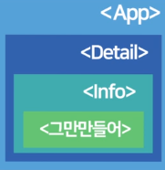

## React.

##### * Why react?

- react으로 Web App 만드는 것이 가능하다.
- Web App : App이랑 사용성이 비슷한 Web
  - 다른 페이지로 넘어가거나 포스팅을 발행하거나 어떠한 행동을 할 때 새로고침X 스무스하게 동작
  - Web-App을 쉽게 만들 수 있는 라이브러리가 react
  - 장점
    1. Web app은 모바일앱으로 발행이 쉽다
       - pwa, react-native 이용
    2. 앱처럼 뛰어난 UX
    3. 뛰어난 UX로 인한 일반 웹사이트보다 비즈니스적 강점
    4. HTML 관리 용이


##### * [내가 사용한 react 세팅 & 실행](https://ko.reactjs.org/docs/create-a-new-react-app.html)

1. Node.js
   - npm 툴 사용가능
     - create-react-app 라이브러리를 이용 가능
2. Visual Studio Code (editor)

3. react 프로젝트 생성

   ```
   npx create-react-app 프로젝트명
   npx : 라이브러리 설치 도와주는 명령어
   create-react-app : 리액트 셋팅 다 된 boilerplate 설치를 도와주는 라이브러리 이름
   	boilerplate : 재사용 가능한 프로그램

4. npm start
   - 실시간으로 개발 서버를 띄어준다
5. 리액트 프로젝트에서
   - node_modules 폴더 : 라이브러리 모은 폴더
   - public 폴더 : static 파일 보관함
     - index.html : 실제 main page
   - src 폴더 : 소스코드 보관함
     - App.js :  main페이지에 들어갈 HTML 짜는 곳
     - App.css : 스타일 지정
     - index.js : App.js를 index.html에 넣어준다.
   - package.json : 설치한 라이브러리 목록
     - npm이용할 때 자동으로 등록된다


##### * 메인페이지 작동원리(App.js, index.html, index.js)

- src/App.js

  - main페이지에 들어갈 HTML 짜는 곳

  - return 소괄호 안에는 무조건 하나의 html tag만 시작하고 끝나야 한다. (하나의 요소)

    - 하나의 요소 안에 다른 태그들이 들어가있는건 괜찮다.

    ```react
    function App() {
      return (
        <div className="App">
          <p>Hello World!!</p>
        </div>
      );
    }
    export default App;

  - App.css

    - 스타일 적용

      ```react
      body {
        font-family:'nanumsquare';
      }
      
      .black-nav {
        background: black;
        width: 100%;
        display: flex;
        color: white;
        padding: 20px;
        font-weight: 600;
        font-size: 20px;
      }

- public/index.html

  - 실제 main page

    ```react
    <div id="root"></div>

- src/index.js

  - App.js를 index.html에 넣어준다.

  - id가 root인 Tag에 App.js안에 있는 html을 넣어라. 

  - App Component를 index.html(main)에서 id가 root인 것에 넣어라
  
    ```react
    ReactDOM.render(
      <React.StrictMode>
        <App />
      </React.StrictMode>,
      document.getElementById('root')
    )


##### * [JSX](https://ko.reactjs.org/docs/introducing-jsx.html)

- JavaScript의 확장 문법

  - js의 모든 기능이 포함되어 있다.

- React element를 생성한다.

- JacaScirpt 코드 안에서 UI 관련 작업(HTML 작성)이 가능하다.

  - ex) JS 함수문법에서 HTML 작성이 가능

    ```react
    function App() {
      return (
        <div className="App">
          <p>Hello World!!</p>
        </div>
      );
    }

- 태그에 class 주는 법

  - class="클래스명" 대신 className="클래스명" 사용

    ```react
    function App() {
      return (
        <div className="App">
          <div className="black-nav">
            <div>개발 Blog</div>
          </div>
        </div>
      );
    }

- 데이터 바인딩

  - html 모든 곳에 중괄호 {}로 변수를 집어넣을 수 있다

    - 중괄호 안에 조건, 반복문 불가능

  - 데이터를 HTML에 넣어주는 것

    - 요소의 content, 속성값 등등 html 안에서 자유롭게 데이터 활용이 가능하다
    - 데이터 값을 변수명, 함수 등 및 중괄호{}를 이용하여 html 안에서 활용한다.

  - ex)

    ```react
    // 요소의 content에 사용
    function App() {
    
      const posts = '김동일 짱짱'
    
      return (
        <div className="App">
          <div className="black-nav">
            <div>개발 Blog</div>
          </div>
          <h4>{posts}</h4>
        </div>
      );
    }
    
    // 함수도 사용이 가능하다
    function App() {
    
      function func(){
        return 김동일
      }
    
      return (
        <div className="App">
          <div className="black-nav">
            <div>개발 Blog</div>
          </div>
          <h4>{ func() }</h4>
        </div>
      );
    }
    ```

- JSX에서 style 속성 집어넣을 때

  - style={ object자료형으로 만든 스타일 }

  - 속성명은 camelCase 작명관습을 따른다

    ```react
    // 1
    function App() {
    
      return (
        <div className="App">
          <div className="black-nav">
            <div style={{ color : "blue", fontSize : '30px'}}>개발 Blog</div>
          </div>
        </div>
      );
    }
    // 2. 스타일을 변수명에 집어넣어 데이터바인딩 이용
    function App() {
      let postCss = { color : 'blue', fontSize : '30px'}
    
      return (
        <div className="App">
          <div className="black-nav">
            <div style={ postCss } >개발 Blog</div>
          </div>
        </div>
      );
    }

- React element

  - React.createElement()를 이용한다

    ```react
    // <h1 className="greeting">Hello, world!</h1>
    // jsx 문법
    const element = React.createElement( // element같은 객체를 React 엘리먼트라 한다
      'h1',
      {className: 'greeting'},
      'Hello, world!'
    );
    
    //js 문법
    const element = React.createElement(
      'h1',
      {className:'greeting'},
      'Hello, world!'
    );
    ```


##### * Hook

- 기존에 class component에서 사용하던 것을 functional component로 사용하게 만들 수 있다.

- 규칙
  1. 최상위(at the Top Level)에서만 Hook을 호출
     - 반복문,조건문,중첩된 함수 내에서 Hook 실행 불가
  2. React 함수 컴포넌트 내, 커스텀 Hook내에서만 Hook호출 가눙
     -  JavaScript 함수에서 Hook 호출 불가
- Custom Hook
  - 직접 만든 Hook
  - 작명을 보통 맨 앞에 use가 붙은 use00000으로 한다.

- Hook API

  - useState : state관리
  - useEffect : lifecycle 생애주기 관리
  - useContext : 컴포넌트 간 전역 상태 관리

  - useReducer(reducer함수, reducer의 기본 값)

    - 현재 상태, 업데이트를 위해 필요한 정보를 담은 액션값을 전달받아 새로운 상태를 반환하는 함수

    - reducer함수는 현재상태와 action 객체를 파라미터로 받아와서 새로운 상태를 반환하는 형태를 갖는다

    - 결과로 state(현재 가리키고 있는 상태)와 dispatch(액션을 발생시키는 함수) 함수를 받아온다

    - 다수의 하윗값을 포함하는 복잡한 정적 로직을 만드는 경우 사용

      ```react
      // 1. reducer 함수 만들기
      function reducer(state, action) {
          switch (action.type) {
              case 'INCREMENT':
                  return state + 1;
              case 'DECREMENT':
                  return state - 1;
              default:
                  //return state
                  throw new Error('unhandled action');
              // return state를 할 경우에는 준비하는 액션이 들어와도 별 액션이 안생기고,
              // error 를 던져주면 콘솔에서 어떤 에러가 발생햇다는걸 볼수있음
          }
      }
      
      function Counter() {
          // 2. useReducer 사용
          const [number, dispatch] = useReducer(reducer, 0);
          // [현재상태, dispatch] = useReducer(reducer함수, 초기값);
      
          const onIncrease = () => {
              dispatch({
                  type: 'INCREMENT'
              });
          }
          const onDecrease = () => {
              dispatch({
                  type: 'DECREMENT'
              });
          }
      ```

  - useMemo & useCallback

    - 이전 값을 기억해서 성능을 최적하하는 용도로 사용
    - useMemo : 계산량이 많은 **함수의 반환값**을 재활용하는 용도로 사용
    - useCallback : 리액트의 렌더링 성능을 위해 제공되는 훅
      - 컴포넌트가 렌더링될 때마다 새로운 함수를 생성해서 자식 컴포넌트의 속성값으로 인력

​			


##### * state

- 데이터를 저장할 수 있는 방법
  1. 변수에 저장
  2. state에 저장
     - 웹이 App처럼 동작하게 만들기 위하여
     - state로 만들어진 data가 변경되면 HTML이 자동으로 재렌더링이 된다
     - 자주 바뀌는 변수, 중요한 데이터는 state를 사용
- 변수 대신 쓰는 데이터 저장 공간
- useState()를 이용해 만들어야 한다
- 문자, 숫자, array, object 전부 저장가능

- 사용 방법

  1. import

     - react에 있는 내장함수를 쓰겠다

     ```react
     import React, { useState } from 'react';
     ```

  2. useState 선언

     ```react
     useState('남자가 좋아하는 음식 추천');
     ```

  3. 코드 실행

     - useState는 코드가 실행되면 array[a, b]를 생성한다
     - 생성된 array[a, b]를 저장 (destructuring 문법)
       - a, b는 각 변수에 저장된다

     ```react
     let [a, b] = useState('남자가 좋아하는 음식 추천');
     실행하면 useState는 array[a, b]가 나온다.
     a : ''안에 있는 data값 (state 데이터)
     b : data인 state 정정해주는 함수 (state 데이터 변경 함수)
     
     결과 : 변수 a와 변수 b에 각각 저장된다

- state 값 수정

  - 리액트 원칙 : immutable data

  - Array, Object data 수정 방법

    1. 기존 state를 deepcopy한다
       - [...복사할 Array] {...복사할 Object data}
         - ...은 중괄호, 대괄호를 모두 제거해 달라는 의미
       - 괄호를 제거 해주었으니 다시 중괄호 또는 대괄호에 담아 새로운 Object, Array를 생성
    2. 복사본에 수정사항을 반영한다
    3. 변경함수()의 인자에 수정한 복사본을 집어넣는다
       - 변경함수(수정한 복사본)

    ##### * event를 이용한 state 값 바꾸기

    - onclick={ 실행할 함수 }
    - onclick={ (event)=>{실행할 내용} }
    - onclick의 중괄호 안에 함수명()가 아닌 함수명만 쓰기
      - 함수명()는 event가 없어도 실행 된다.

    ```react
    function App() {
    
      let [글제목, 글제목변경] = useState(['남자가 좋아하는 음식', '살 뺄 거야', '야식 추천']);
      let [따봉, 따봉변경] = useState(0)
    
      function 제목바꾸기(){
        const newArray = [...글제목]; // deepcopy
        newArray[0] = '여자가 좋아하는 음식';
        글제목변경( newArray );
      }
    
      function 따봉바꾸기(){
        let num = 따봉;
        num = num + 1;
        따봉변경(num)
      }
    
      return (
        <div className="App">
          <div className="black-nav">
            <div>개발 Blog</div>
          </div>
          <button onClick={ 제목바꾸기 }>버튼</button>
          <div className='list'>
            <h3> { 글제목[0] } <button onClick={ 따봉바꾸기 }> { 따봉 }</button></h3>
            <p>2022년 1월월 15일 발행</p>
            <hr/>
          </div>
        </div>
      );
    }


##### * Component 문법

- HTML을 줄여서 쓸 수 있는 방법

  - HTML을 한 단어로 줄여서 쓴다

- Component를 만드는 기준

  1. 반복적으로 쓰이는 HTML 덩어리들
  2. 자주 바뀌는 UI 부분 (자주 재렌더링 일어나는 부분)
     - 성능적으로 좋음

- Component 단점

  - state 쓸 때 복잡해짐
    - 상위 component에서 만든 state 쓰려면 props 문법 이용해야함

- Component 만드는 방법

  1. 함수 만들고 이름 짓기

  2. 축약을 원하는 HTML 함수 안에 넣기

  3. 원하는 곳에서 <함수명></함수명>

     ```react
     function App() {
       return (
         <div className="App">
           {/* 재사용 하고싶은 HTML 
           <div className='modal'>
             <h2>제목</h2>
             <p>날짜</p>
             <p>상세내용</p>
           </div>
           */}
     
           {/* 사용 */}
           <Compo></Compo>
     
         </div>
       );
     }
     
     function Compo(){ // 이름 짓기
       return (
         // 원하는 HTML 담기
         <div className='Compo'>
           <h2>제목</h2>
           <p>날짜</p>
           <p>상세내용</p>
         </div>
       )
     }

- 유의 사항

  1. 이름은 대괄호로 시작

  2. 함수의 return() 안에는 태그 한개만 사용이 가능하다

     - 태그 하나로 묶어야 한다.

  3. return() 내부를 묶을 때 의미없이 div로 묶기 싫다면 Fragment 문법인 <></> 사용

     ```react
     function App() {/* function App도 하나의 Component */}
       return (
         <div className="App">
           {/* 사용 */}
           <Compo></Compo>
         </div>
       );
     }
     
     function Compo(){ // 이름 짓기
       return (
         // 원하는 HTML 담기
         <>
           <div className='Compo'>
             <h2>제목</h2>
             <p>날짜</p>
             <p>상세내용</p>
           </div>
         </>
       )
     }


##### * 조건문

- JSX안에서 if대신 삼항연산자 이용이 가능하다.

- { 조건식 ? 참일 때 실행할 코드 : 거짓일 때 실행할 코드}

  ```react
  function App() {/* function App도 하나의 Component */}
    {
      1 < 3 ? console.log('True입니다') : console.log('False입니다')
    }
    {
      1 < 3 ?
      console.log('True입니다')
      : console.log('False입니다')
    }
    // True입니다 출력된다.
    return (
    );
  }


##### * Modal

- 삼항연산자를 활용하여 Modal을 띄운다.

  1. 조건식에는 어떤 경우에 modal창을 보여줄지에 대한 표현식 (모달창을 켜고 닫는 스위치)
  2. True일 때 띄어 줄 Modal창
  3. False일 때 띄어 줄 값 (보통 null, 텅빈 HTML)

  ```react
  {
    modal === true // 어떤 경우에 modal창을 보여줄까에 대한 조건
    ? <Modal></Modal> // Modal 창
    : null // modal을 보여주고 싶지 않을 때, 아무것도 아닌 HTML을 보내고 싶을 때(텅빈 HTML)
  }

- 리액트에서는 UI를 만들 때 state 데이터를 이용한다

  1. 모달창을 켜고 다는 스위치(state데이터로 UI를 보여줄까에 대한 true/false)

     - 사이트 첫 로드시 모달창은 안보이므로 기본값은 보통 false

     ```react
     let [modal, modal변경] = useState(false);
     ```

  2. 어떠한 요소를 눌렀을 때 스위치(state 데이터)를 True로 바꿔주려한다 (Modal 띄우기 위함)

     ```react
     <h3 onClick={ ()=>{ modal변경(true) } }> { 글제목[2] }</h3>

  - ex)

    - !(느낌표) 기호는 true 왼쪽에 붙이면 false로 바꿔주고, false일 때는 true로 바꿔준다

    ```react
    function App(){
      let [modal, modal변경] = useState(false);
      return (
      <div>
        <button onClick={ ()=>{ modal변경(!modal) } }>Modal(On/Off)</button>
    	{
          modal === true
          ? <Modal></Modal>
          : null
    	}
      </div>
      );
    }
    function Modal(){
      return (
       <div className="Modal">
         <h2>제목</h2>
         <p>날짜</p>
         <p>상세내용</p>
       </div>
      );
    }


##### * 반복문

- 리액트에서는 HTML를 반복문으로 반복시킬 수 있다

- JSX 중괄호 내에 for 못 넣는다

  - map() 함수를 이용해야 한다.

- map 함수

  - 기존 array 자료형을 변형시켜 새로운 array를 만들기 위한 함수

  - array 내의 모든 데이터에 똑같은 작업을 시켜주고 싶을 때 사용

  - iterableData.map( (data) => {표현식} )

    - 반복가능한 데이터.map( () => {return HTML} )
    - map 반복문으로 돌린 HTML에는 key = {번호}가 필요하다
    - return해주는 HTML에 eventListener(Onclick)이 넣어져 있어도 괜찮다
      - 다만 event에 대한 처리를 할때 주의해야 한다.
      - ex) 버튼을 클릭했을 때 값이 변경되는 event라면 state데이터를 주의해야 한다.
        - state 데이터가 반복된 HTML에서 모두 공유되어 있지 않게 해야한다.

    ```react
    function App (){
      let array = [1, 2, 3, 4, 5]
      let newArray = array.map(function(a){ // a는 array에 담긴 데이터
        return a*2
      }) // newArray는 [2, 4, 6, 8, 10]
      return();
    }
    ```

    ```react
    function App() {
    
      let [글제목, 글제목변경] = useState(['남자가 좋아하는 음식', '살 뺄 거야', '야식 추천']);
    
      return (
        <div className="App">
          <div className="black-nav">
            <div>개발 Blog</div>
          </div>
          {
            글제목.map(function(글, i) {
              return (
                <div className="list" key={ i }>
                  <h3> { 글 }</h3>
                  <p>2022년 1월 16일 발행</p>
                  <hr/>
                </div>
              )
            })        
          }
        </div>
      );
    }

- for 반복문을 쓰고 싶다면  반복된 UI를 return 해주는 함수를 만든다

  1. 함수 안에서 for문을 쓰기위해 함수생성

  2. 비어 있는 array를 만든다

  3. for문을 이용하여 array에 HTML 추가

     - array.push(HTML);
     - for in, for of사용도 가능

  4. array를 return으로 뱉어낸다

  5. 만들어진 array를 JSX를 이용하여 보이고 싶은 자리에 사용한다.

     ```react
     function App (){
       function forUI(){
         var array = [];
         for (var i = 0; i < 3; i++) {
           array.push(<div>반복</div>)
         }
         return array
       }
       return (
         <div className="App">
           HTML 잔뜩있는 곳
           { forUI() } /* 이자리에 array에 들어있는 HTML이 표시된다 */
         </div>
       );
     }


##### * props

- Component 요소에 props value를 지정

- App Component 안에 있는 state데이터를 다른 component에 전송할 때 사용

- Modal Component를 App Component에서 삼항연산자를 이용하여 Modal창 조작할 때, App이 부모 컴포넌트, Modal이 자식 컴포넌트

  - App이 가진 State를 Modal Component에서 바로 쓸 수 없지만, 쓸 수 있게 Modal에 전송이 가능하다

  - 자식컴포넌트는 부모 컴포넌트가 가진 state를 전송해줘야 사용이 가능하다.

    

- Component가 여러개 중첩되어 있을 때 하위 Component에 데이터를 전달

  1. props를 여러번 쓰면 된다
  2. redux 사용

- props로 자식에게 state 전해주는 방법

  1. <자식컴포넌트 전송할변수명={전송할state}/ >

     - 전송할변수명을 보통 전송할state와 똑같이 작명한다.
       - 밑의 예시에서는 구분을 위해 다르게 표현함.

     ```react
     function App(){
       let [modal, modal변경] = useState(false);
       let [글제목, 글제목변경] = useState(['남자가 좋아하는 음식', '살 뺄 거야', '야식 추천']);
       let 그냥데이터 = 0;
       return (
       <div className="App">
         <button onClick={ ()=>{ modal변경(!modal) } }>Modal(On/Off)</button>
     	{
           modal === true
           ? <Modal 전송데이터={ 글제목 } 전송데이터2={ 그냥데이터 } ></Modal>
           : null
     	}
       </div>
       );
     }
     ```

  2. 부모컴포넌트에서 전송된 props를 인자에 입력 후 사용 (전송된 props들을 받아온다)

     - 부모에서 전달받은 props들은 인자로 적은 '전송받은props들'에 모두 들어있다.

     ```react
     function Modal(전송받은props들){
       return (
        <div className="Modal">
          <h2>{ 전송받은props들.전송데이터[0] }</h2>
          <p>날짜</p>
          <p>상세내용</p>
        </div>
       );
     }
     ```

- 제목을 누를 때 각각 다른 모달창 띄우기

  - 몇번째 제목 눌렀는지 상태정보를 state에 저장
    - 저장한 state가 0일 때 0번째 제목, 1일 때 1번째 제목 출력, 2일 때 2번째 제목 출력

  ```react
  function App(){
    let [modal, modal변경] = useState(false);
    let [글제목, 글제목변경] = useState(['남자가 좋아하는 음식', '살 뺄 거야', '야식 추천']);
    let [누른제목, 누른제목변경] = useState(0);
    return (
    <div className="App">
      <button onClick={ ()=>{ 누른제목변경(0) } }>Modal1</button>
      <button onClick={ ()=>{ 누른제목변경(1) } }>Modal2</button>
      <button onClick={ ()=>{ 누른제목변경(2) } }>Modal3</button>
            
      <button onClick={ ()=>{ modal변경(!modal) } }>Modal(On/Off)</button>
  	{
        modal === true
        ? <Modal 전송데이터={ 글제목 } 누른제목={누른제목} ></Modal>
        : null
  	}
    </div>
    );
  }
  
  function Modal(전송받은props들){
    return (
     <div className="Modal">
       <h2>{ 전송받은props들.전송데이터[전송받은props들.누른제목] }</h2>
       <p>날짜</p>
       <p>상세내용</p>
     </div>
    );
  }
  ```

  ```react
  function App() {
    let [modal, modal변경] = useState(false);
    let [글제목, 글제목변경] = useState(['남자가 좋아하는 음식', '살 뺄 거야', '야식 추천']);
    let [누른제목, 누른제목변경] = useState(0);
    return (
      <div className="App">
        <div className="black-nav">
          <div>개발 Blog</div>
        </div>
        {
          글제목.map(function(글, i) {
            return (
              <div className="list" key={ i }>
                <h3 onClick={ ()=>{ 누른제목변경(i) } }> { 글 }</h3>
                <p>2022년 1월 16일 발행</p>
                <hr/>
              </div>
            )
          })        
        }
        <button onClick={ ()=>{ modal변경(!modal) } }>Modal(On/Off)</button>
  	  {
          modal === true
          ? <Modal 전송데이터={ 글제목 } 누른제목={누른제목} ></Modal>
          : null
  	  }
      </div>
    );
  }
  
  function Modal(전송받은props들){
    return (
     <div className="Modal">
       <h2>{ 전송받은props들.전송데이터[전송받은props들.누른제목] }</h2>
       <p>날짜</p>
       <p>상세내용</p>
     </div>
    );
  }


##### * input

- 사용자가 input에 입력한 값을 state로 저장

  - Event핸들러 onChange, onInput 사용
    - **event.target**(e.target)은 이벤트가 동작하는 곳을 가르킨다.
      - e는 event 정보가 들어가 있는 객체
    - onChange, onInput에서 **e.target.value**은 사용자가 input에 입력한 값을 가져온다

  ```react
  function App() {
    let [입력값, 입력값변경] = useState(''); // 저장공간
    return (
      <div className="App">
        <input onChange={ ()=>{ 입력값변경(e.target.value) } } />
      </div>
    );
  }
  ```

- 글 작성(발행)

  1. 사용자가 입력한 글 변수, state로 저장
  2. 저장버튼 누르면 입력한 글 state를 다른 state에 추가
     - array.unshift() 사용 : array 맨 앞에 자료 추가하는 문법

  ```react
  function App() {
    let [입력값, 입력값변경] = useState(''); // 저장공간
    let [글목록, 글목록변경] = useState(['남자가 좋아하는 음식', '살 뺄 거야', '야식 추천']);
    return (
      <div className="App">
        <div className="black-nav">
          <div>개발 Blog</div>
        </div>
        {
          글목록.map(function(글, i) {
            return (
              <div className="list" key={ i }>
                <h3 onClick={ ()=>{ 누른제목변경(i) } }> { 글 }</h3>
                <p>2022년 1월 16일 발행</p>
                <hr/>
              </div>
            )
          })        
        }
        <div className="publish">
          <input onChange={ ()=>{ 입력값변경(e.target.value) } } />
          <button onclick={ ()=>{
              let arrayCopy = [...글목록];
              arrayCopy.unshift(입력값);
              글목록변경( arrayCopy )
            } }>저장
          </button>
        </div>
      </div>
    );
  }


##### *BootStrap

- [리액트 전용 BootStratp](https://react-bootstrap.github.io/getting-started/introduction) 존재
  - 원조 Bootstrap은 css 사이즈가 커진다.

1. react boostrap 설치

   ```
   npm install react-bootstrap bootstrap

2. react bootstrap 사이트의 CSS link 태그 index.html에 넣기

   ```
   <link
     rel="stylesheet"
     href="https://cdn.jsdelivr.net/npm/bootstrap@5.1.3/dist/css/bootstrap.min.css"
     integrity="sha384-1BmE4kWBq78iYhFldvKuhfTAU6auU8tT94WrHftjDbrCEXSU1oBoqyl2QvZ6jIW3"
     crossorigin="anonymous"
   />
   ```

3. 쓰고자 하는 곳에 react-bootstrap import하기

   - react-bootstrap에서 제공하는 것들은 모두 Component

   - 밑의 Navbar를 이용하려면 Navbar말고도 Container, Nav, NavDropdown Component를 가져와야 함

     ```react
     import React from 'react'
     import { Navbar, Container, Nav, NavDropdown } from 'react-bootstrap';
     import './App.css';
     
     function App() {
       return (
         <div className='App'>
           <Navbar bg="light" expand="lg">
             <Container>
               <Navbar.Brand href="#home">React-Bootstrap</Navbar.Brand>
               <Navbar.Toggle aria-controls="basic-navbar-nav" />
               <Navbar.Collapse id="basic-navbar-nav">
                 <Nav className="me-auto">
                   <Nav.Link href="#home">Home</Nav.Link>
                   <Nav.Link href="#link">Link</Nav.Link>
                   <NavDropdown title="Dropdown" id="basic-nav-dropdown">
                     <NavDropdown.Item href="#action/3.1">Action</NavDropdown.Item>
                     <NavDropdown.Item href="#action/3.2">Another action</NavDropdown.Item>
                     <NavDropdown.Item href="#action/3.3">Something</NavDropdown.Item>
                     <NavDropdown.Divider />
                     <NavDropdown.Item href="#action/3.4">Separated link</NavDropdown.Item>
                   </NavDropdown>
                 </Nav>
               </Navbar.Collapse>
             </Container>
           </Navbar>
         </div>
       );
     }
     
     export default App;


##### * impot/export

- export(가져오기)

  - data가 길거나 재사용성이 높은 것은 따로 보관할 파일명.js을 만들어서 App.js같은 곳에서 불러오기

    - 중요한 데이터는 App Component에 보관하는 것이 좋다.

      - 데이터는 상위 Component에서 하위 Component로 전해주는 형태가 좋다

    - 데이터 보관 js파일은 export default name 형식이여야 한다.

      ```react
      // data1.js
      let name = 'KimDongil';
      export default name;
      ```

    - 여러개의 데이터를 전달하려면 array, Object를 이용한다

      - Object {} 자료형 2개를 array에 저장하여 export하기 위한 예시

      ```react
      // data2.js
      export default [
        {
          name : Dongil,
          title : "나는 최고야",
          content : "나이는 27살"
        },
      
        {
          name : Kim,
          title : "내 성은 Kim",
          content : "나이는 27살"
        },
      ] 
      ```

    - 여러개의 변수를 export할 수 있다

      ```react
      // data3.js
      let firstName = 'Dongil';
      let lastName = 'kim'
      export { firstName, lastName };

  - 한 파일에 한번만 사용이 가능하다

  - Component를 파일로 관리하기

    - 파일들은 대문자로 시작하는 것으로 설정한다

    - Component 파일을 만들 때는 import React 필수

    - Component 파일이 많아지면 src내에 폴더를 만들어 관리

      ```react
      import React, {useState} from 'react'
      
      function Detail(){
        return (
          <div>나는 component가 들어있는파일</div>
        )
      }
      export default Detail;

- import(가져오기)

  - import 변수명 from 경로

    - export한 변수이름 그대로 사용하기
    - import Example : export default 된거 가져오기
    - import {Example} : Example이라는 변수/함수 가져오기

    ```react
    // data1.js (가져올 파일명)
    import name from ./data1.js;
    ```

    ```react
    // data2.js
    import Data from ./data2.js;
    ```

    ```react
    // data3.js
    import { firstName, lastName } from ./data3.js


### 페이지 나누기(라우팅)

- React Router 특징
  - 페이지마다 다른 HTML파일이 아니다
  - index.html 하나에 HTML 내용을 변경하면서 다른페이지처럼 보여주는 것

- 여러가지 페이지를 만들고 싶을 때는 react-router-dom 라이브러리 이용

  ```react
  npm install react-router-dom@5

- index.js에서 react-router-dom 초기셋팅법

  1. 설치한 라이브러리 import

     ```react
     import { BrowserRouter } from 'react-router-dom';
     ```

  2. App 태그를 감싸주는 BrowserRouter 태그를 생성

     - 주소창은 server에 이런 페이지좀 갖다주라고 요청하는 공간

     - BrowserRouter

       - 라우팅을 리액트가 아니라 서버에게 요청할 수도 있어서 위험하다

     - HashRouter

       - 라우팅 안전하게 할 수 있게 도와준다

       - 사이트 주소 뒤에 #이 붙는데 #뒤에 적는 것은 서버로 전달이 되지 않는다

         ```
         http://localhost:3000/#/

       - 라우팅은 리액트가 알아서 잘 해줄 수 있다

     ```react
     import React from 'react';
     import ReactDOM from 'react-dom';
     import './index.css';
     import App from './App';
     import reportWebVitals from './reportWebVitals';
     
     import { BrowserRouter } from 'react-router-dom';
     
     ReactDOM.render(
       <React.StrictMode>
         <BrowserRouter>
           <App />
         </BrowserRouter>
       </React.StrictMode>,
       document.getElementById('root')
     );
     
     reportWebVitals();

##### - Route

1. App.js에서 import

   - Link, Route, Switch 태그 불러오기

     ```react
     import { Link, Route, Switch } from 'react-router-dom'

2. App.js에서 Route태그를 이용한 페이지 나누기

   - http://localhost:3000 주소로는 main페이지

   - http://localhost:3000/detail 주소르는 detail페이지

   - 리액트 라우터는 매칭이 되는 것들을 다 보여준다 -> exact 속성사용하기

     - 경로가 정확히 일치할 때만 보여준다

     ```react
     import { Link, Route, Switch } from 'react-router-dom'
     
     function App() {
       return (
         <div className='App'>
           <Route exact path="/">
             <div>메인페이지</div> // main페이지 작업공간
           </Route>
           <Route exact path="/detail">
             <div>detail페이지</div> // detail페이지 작업공간
           </Route>
         </div>
       );
     }
     export default App;

   - Route태그 안에 component라는 속성을 통해 component를 속성값으로 집어 넣을 수 있다

     ```react
     function App() {
       return (
         <div className='App'>
           <Route exact path="/">
             <div>메인페이지</div> // main페이지 작업공간
           </Route>
           <Route exact path="/detail" component={detail}></Route>
         </div>
       );
     }
     
     function detail(){
       return (
         <div>detail페이지</div>
       )
     }
     ```

##### - Link

- 페이지 이동하기 위해 쓰는 태그

- Link태그에 to속성을 이용하여 이동한다

  - 속성값은 이동할 주소

  ```react
  <Nav.Link ><Link to="/">Home</Link></Nav.Link>
  <Nav.Link> <Link to='/detail'>Detail</Link> </Nav.Link>
  ```

- Nav.Link, Link태그는 a태그와 유사

  - 위의 문제점 a태그 안의 a태그

  - 문제점 해결

    - Nav.Link에 to속성을 쓴다
    - Nav.Link에 as속성, 속성값에 {Link}를 준다
      - as속성은 태그를 속성값에 있는 값처럼 쓰이게 해준다

    ```react
    <Nav.Link as={Link} to="/">Home</Nav.Link> // Nav.Link 태그를 Link태그처럼 쓰이게 한다
    <Nav.Link as={Link} to="/detail">Detail</Nav.Link>

##### - history

- useHistory 훅은 방문기록 등을 저장해놓은 object

  - 뒤로가기, 특정경로로 이동시키기 가능

- react-router-dom v5, react v16.3이상

- useHistory 훅 import하기

  ```react
  import React, {useState} from 'react' // useState는 useHistory를 변수에 담기위해
  import { useHistory } from 'react-router-dom';
  ```

- ex)

  - useHistory의 goback (뒤로가기)

    ```react
    // 뒤로가는 버튼 생성
    function App() {
      let history = useHistory();
      return (
        <button onClick={()=>{
      	  history.goBack();
    	}}>뒤로가기</button>
      )
    }
    ```

  - useHistory의 push

    ```react
    // 특정 경로로 이동시키기
    function App() {
      let history = useHistory();
      return (
        <button onClick={()=>{
      	  history.push('경로');
    	}}>특정경로로 이동</button>
      )
    }

##### - Switch 컴포넌트

- 리액트 라우터는 매칭이 되는 것들을 다 보여준다

- Switch는 여러개가 매칭이 돼도 하나만 매칭이 되게 해준다

  - 중복을 허용하지 않는다
  - 중복이 되면 맨 위의 Route를 선택한다

  ```react
  function App() {
    return(
      <Switch>
        <Route path="/detail">Detail</Route>
        <Route path="/:id">id</Route>
      </Switch>
    )
  }


##### - URL parameter

- 비슷한 라우터들이 존재할 때

  - 주소에 /:parameter 사용

    - parameter는 아무렇게나 작명해도 된다

      ```react
      import { Switch, Route} from 'react-router-dom'
      function App() {
        return(
          <Switch>
            <Route path="/detail/:id">Detail</Route>
          </Switch>
        )
      }

  - :  콜론기호는 아무문자나 받겠다는URL 작명법

  - 라우터의 useParams 훅

    - useParams에는 사용자가 입력한 URL의 모든 파라미터 값들이 들어있다

      - Object 형식으로 들어있다.

      ```
      path="/post/:postId"일 때
      http://localhos:3000/post/1 로 접속을 한다면
      useParams에는 {postId: '1'}이 들어있다
      
      이유 : URL parameter가 여러개 일 때를 생각하면 object형식으로 출력되는 것이 맞다
  
    - 사용하기 위해서는 import 해야한다
  
      ```react
      import { useParams } from 'react-router-dom';
  
  - ex) url의 :parameter 자리에 있던 문자 사용
  
    ```react
    import { useParams } from 'react-router-dom';
    
    function Detail(props){
    	let { id } = useParams(); // id는 사용자가 /:id자리에 입력한 값
    }
    ```

##### * 중첩 라우팅(Nested Routing)

- Route 컴포넌트에 의해 렌더링 되는 두 개 이상의 컴포넌트를 동시에 렌더링한다
- Route 컴포넌트에 의해 렌더링 된 컴포넌트 내에서 한 번 더 Route 컴포넌트를 구현한다


##### * Lifecycle Hooks (class 문법 - 옛날)

- Component의 인생

  - Component의 등장- 업데이트(재렌더링) - 퇴장

- Hooks : Lifecycle(등장~퇴장) 중간에 무언가 요청(명령)을 하는 것

  - ex) Component가 등장하기 전에 이 것좀 해줘

- ex)

  ```react
  class Detail2 extends React.Component {
    componentDidMount(){
      // Detail2 컴포넌트가 Mount(등장) 되었을 때 실행할 코드
    }
  
    componentWillUnmount(){
      // Detail2 컴포넌트가 UnMount(퇴장) 되었을 때 실행할 코드
    }
  }

##### * useEffect

- useEffect는 여러개 사용했을 때 순서대로 실행된다.

- import해야한다

  ```react
  import React, {useEffect} from 'react'

- component가 mount(등장), update(재렌더링) 되었을 때 특정 코드를 실행

  - setTimeout을 쓸 때는 동작에 따라 오류가 일어날 수도 있으므로 타이머해제가 필요하다
    - Component 종료될 때 타이머해제 시키기!

  ```react
  // 2초 후에 alert 창을 안 보이게 하기
  function Detail(){
      
    useEffect( ()=>{
      let 타이머 = setTimeout(()=> {alert변경(false)}, 2000);
      return ()=>{ clearTimeout(타이머) }
    });
      
    let [alert, alert변경] = useState(true);
      
    return(
      {
         alert == true
         ? (<div><p>재고가 얼마 남지 않았습니다</p></div>
           )
         : null
      }
    )
  }
  ```

- component가 update(재렌더링) 되었을 때 특정 코드를 실행

  - useEffect는 업데이트 될때마다 실행이 된다.
  - useEffect의 두번째 인자로 실행조건을 줄 수 있다
    - 두번째 인자에는 콜백함수 내에서 사용되는 모든 값을 포함한다
      - 함수가 props, state 또는 파생된 값을 참조하고 있지 않을 때는 포함X
      - 콜백함수내에서 정의되어서 쓰는 값들은 포함X

    - 인자에 들어간 state가 변경이 될때만 useEffet 실행
    - 실행조건은 여러개가 들어갈 수 있다
    - 조건이 비어있다면 component가 등장할 때만 실행된다


  ```react
  function Detail(){
      
    let [alert, alert변경] = useState(true);
    let [inputData, inputData변경] = useState();  
    
    useEffect(()=>{
      let 타이머 = setTimeout(()=> {alert변경(false)}, 2000);
      return ()=>{ clearTimeout(타이머) }
    },[alert]); // alert라는 state가 변경이 될때만 useEffect실행
      
    return(
        
      { inputData }
      <input onChange={(e)=>{inputData변경(e.target.value)}}></input> 
        
      {
         alert == true
         ? (<div><p>재고가 얼마 남지 않았습니다</p></div>
           )
         : null
      }
  
    )
  }

- component가 unmount(퇴장) 되었을 때 특정 코드를 실행

  - return 사용

  ```react
  function Detail(){
      
    useEffect( ()=>{
      return function 함수명() { unmount될 때 실행할 코드~~ }
    });
        
    return()
  }
  ```


##### * Ajax in React

- Ajax : 서버에 새로고침없이 요청을 할 수 있게 해준다
  - GET 요청 : 특정 페이지 / 자료 읽기 (새로고침 된다)
  - POST 요청 : 서버로 중요 정보를 숨겨서 전달하고 싶을 때 (새로고침 된다)

- Ajax 사용 방법

  1. jQuery 설치해서 $.ajax()
  2. axios 설치해서 axios.get()
     - 요청받은 JSON데이터를 Object로 바꿔준다
  3. 쌩자바스크립트 fetch()
     - Object로 스스로 바꿔줘야 한다

- 설치 & import

  1. 설치

     ```
     npm install axios
     ```

  2. import

     ```react
     import axios from 'axios';
     ```

- axios get요청

  - axios.get("데이터 요청할 URL")

- axios post요청

  - axios.post("데이터 요청할 URL", {id : 'example', pw : example})

- ex)데이터가 들어있는 state에 ajax로 받아온 데이터 추가하기

  ```react
  import axios from 'axios';
  function App(){
    let [shoes, shoes변경] = useState(Data);
    return (
      <button className="btn btn-primary" onClick={()=>{
        // 서버에 get요청하는 코드, aixos.get(데이터 요청할URL)
        axios.get("https://codingapple1.github.io/shop/data2.json")
        // axios는 promise객체를 반환한다
        // 요청에 성공하면
        .then( (result)=>{
          shoes변경( [...shoes, ...result.data ] )
        })
        // 요청에 실패함
        .catch((result)=>{
          console.log("실패")
        })
      }}>더보기</button>
    )
  }


##### * Context API

- props 전송을 하지 않고도 하위 Component들이 부모 Component값을 사용가능

  

- 리액트 내장문법

1. context 만들기

   - createContext()는 변수값(State)을 공유할 범위를 만들어주는 문법

   ```react
   let 공유context = React.createContext()
   ```

2. 같은 값을 공유할 HTML을 범위로 감싸기

   - 값 공유를 원하는 HTML들을 <범위.Provider>로 감싸고 value={공유데이터}을 속성으로 준다
   - 공유원하는Component에서 공유하고싶은 state데이터를 props전송없이 사용가능

   ```react
   function App() {
     let 공유context = React.createContext()
     return(
       <공유context.Provider value={공유하고싶은 데이터}>
     		<공유원하는Component></공유원하는Component>
       </공유context.Provider>
     )
   }
   ```

3. 범위 내의 Component에서 useContext Hook 사용

   - useContext는 import가 필요
   - 공유데이터 쓰기위해 useContext(범위이름)으로 불러온다.

   ```react
   function 공유원하는Component(){
     let 공유 = useContext(공유context) // 공유라는 변수에 공유데이터가 들어간다
     return (
       <div className="Card">
         {공유}
       </div>
       <Test></Test>
     )
   }
   function Test() {
     let 공유 = useContext(공유Context)
     return(
     	<p>{ 공유 }</p>
     )
   }
   export default App;
   ```

4. 다른 파일에서 공유데이터를 사용

   - 선언 구간에서 export해준다

     ```react
     function App() {
       export let 공유context = React.createContext()
       return(
         <공유context.Provider value={공유하고싶은 데이터}>
       		<공유원하는Component></공유원하는Component>
         </공유context.Provider>
       )
     }
     ```

   - 받고자 하는 파일에서 import 해준다.

     ```react
     import {공유context} from '불러오는파일경로'


### 리덕스

##### * redux

- 쓰는 이유

  1. props 없이 모든 컴포넌트가 state를 갖다쓰기 가능
     - 모든 Component들이 같은 값을 공유할 수 있는 저장공간 생성
     - 복잔한 props전송이 없다
  2. state 데이터 관리가 용이하다
     - redux에서는  state 데이터의 수정방법을 미리 정의한다

- 사용방법

  1. 설치

     ```
     npm install redux react-redux
     ```

  2. index.js에서 createStore() import & store만들기

     - createStore() 안에 state를 return하는 함수를 넣을 수 있다
     - store안에 state 저장

     ```react
     import { createStore } from 'redux';
     let store = createStore( ()=>{ return [ {id:0, name:'멋진신발', quan:2} ] });
     ```

  3. index.js에서 Provider 컴포넌트로 App 컴포넌트 감싸기

     - Provider로 감싼 모든 Component들은 같은 State를 공유할 수 있다

     ```react
     import { Provider } from 'react-redux'
     
     ReactDOM.render(
       <React.StrictMode>
         <BrowserRouter>
           <Provider>
             <App />
           </Provider>
         </BrowserRouter>
       </React.StrictMode>,
       document.getElementById('root')
     );
     ```

  4. createStore()안에 state저장 & Provider Component에 props 전송

     - createStore은 import 필요
     - createStore에는 state를 return하는 함수를 넣을 수 있다
     - state를 Provider Component에 props로 전송

     ```react
     import { createStore } from 'redux';
     
     let store = createStore( ()=>{ return [ {id:0, name:'멋진신발', quan:2} ] });
     
     ReactDOM.render(
       <React.StrictMode>
         <BrowserRouter>
           <Provider store={store}>
             <App />
           </Provider>
         </BrowserRouter>
       </React.StrictMode>,
       document.getElementById('root')
     );
     ```

  5. state를 쓰려는 Component에서 state를 받아올 함수 + export default 설정

     - state를 props로 받아올 함수 만들기

       - redux store 데이터 가져와서 props로 변환해주는 함수
       - state를 props화
         - 데이터를 전송하기위해 props:value로 만든다
         - return (state : state)가 redux store를 props로 바꾸는 변환해주는 부분이다
       
       ```react
       function 함수명(state){ // store에 있던 state data를 가져오는 함수
         return(
           // 상품명(props)에 store안 state[0]의 name이라는 데이터를 value로 매칭시킨다
           // 상품명 : state[0].name
           state : state // store 안에 있던 모든 데이터를 state라는 이름의 props로 바꾸기
         ) // props의 state라는 key에는 state라는 value(store의 모든 데이터)를 넣어주세요
       }
       ```
     
     - export default state를 쓸 Component-> export default connect(state를 받아온 함수명)(state를 쓸 Component)
     
       - connect 쓰기 위해서는 import 해야한다
     
         ```react
         import { connect } from 'react-redux';
         
         function Cart(props){
           return(
             <p>props.state</p> // 현재 props.state에는 redux에 저장되어있던 state가 있다
             <p>props.state.id</p>
             <p>props.state.name</p>
           )
         }
         
         function state를props화(state){
           return(
             state : state
           )
         }
         export default connect(state를props화)(Cart)


##### * reducer & dispatch

- reducer
  - reducer라는 함수로 state 데이터의 수정방법을 정의해놓기
  - reducer는 state보관함
  - 모든 state 저장 공간이 아니다
    - 여러가지 Component들에 필요한 data를 저장하는 곳
    - Component 하나에서만 쓰는건 굳이 저장X
  - state는 종류별로 모아두는 것이 편리
    - 다른 종류의 state 저장하고 싶으면 reducer를 한개 더 만들어서 보관한다.
  - state와 action을 받아서 새로운 state를 반환하는 함수

- dispatch로 데이터 수정요청 보내기
  - action은 state가 어떤 동작을 할지 적어 놓은 Object
  - 개발환경에서 미리보기 띄우는 페이지들은 이동하면 새로고침되면서 redux도 초기화
  - 개발환경에서 페이지 이동시 강제 새로고침 막아주기
    - history.push('경로')


1. reducer 함수생성

   - 항상 state(수정 or 기본 state)를 return
   - 기본 state는 default parameter로 지정

   ```react
   import { Provider } from 'react-redux'
   import { createStore } from 'redux';
   
   let 기본State = [
     {id:0, name:'멋진신발', quan:2},
     {id:1, name:'나의신발', quan:5} 
   ];
   
   function reducer(state = 기본State, 액션) {
     if ( state수정조건 ){
       수정된state = 기존 state를 deepcopy한 뒤 수정
       return 수정된state
     }else{
       return state
     }
   }
   ```

2. store만들 때 만들어 둔 reducer 집어넣기

   - store는 global State를 저장한 저장소
     - 서버는 아니지만 SPA에서 새로고침하기 전까지 살아있는 서버와 비슷하게 동작
   - 모든 Component에서 사용가능하지만 dispatch를 통해서만 접근가능

   ```react
   let store = createStore(reducer)
   ```

3. connect함수를 이용해 props화 시켜주는 함수랑 연결해주기

   ```react
   // Cart.js
   function Cart(props) {
     {
       props.state.map((a, i)=>{
         return(
           <p>a</p>
           <button onClick={()=>{ props.dispatch( { type : '수량증가'} ) }}>+</button>
           <button onClick={()=>{ props.dispatch( { type : '수량감소'} ) }}>-</button>
     }
   }
   
   function 함수명(state) {
     return {
       state : state
     }
   }
   export default connect(함수명)(Cart)

4. 데이터 수정요청 보내기

   - 데이터 수정요청을 할 때는 props.dispatch( {type :  '요청타입'} )
     - 요청타입 : 어떤 요청을 할 것인지 타입(타입이름)설정
     - type은 reducer 함수의 두번째 파라미터에 저장된다.

   ```react
   <button onClick={()=>{ props.dispatch( { type : '요청타입'} ) }}>+</button>
   ```

- ex)

  ```react
  // index.js
  let 기본State = [
    {id:0, name:'멋진신발', quan:2},
    {id:1, name:'나의신발', quan:5} 
  ];
  
  function reducer(state = 기본State, 액션) {
    if ( 액션.type === "수량증가" ){
      let copy = [...기본State]
      copy[0].quan++ // payload 참고
      return copy
    }else if ( 액션.type ==="수량감소") {
      let copy = [...기본State]
      copy[0].quan--
      return copy
    }else{
      return state
    }
  }
  
  let store = createStore( reducer ) ;
  
  ReactDOM.render(
    <React.StrictMode>
      <BrowserRouter>
        <Provider store={store}>
          <App />
        </Provider>
      </BrowserRouter>
    </React.StrictMode>,
    document.getElementById('root')
  );
  
  // Cart.js
  function Cart(props) {
    {
      props.state.map((a, i)=>{
        return(
          <p>a</p>
          <button onClick={()=>{ props.dispatch( { type : '수량증가'} ) }}>+</button>
          <button onClick={()=>{ props.dispatch( { type : '수량감소'} ) }}>-</button>
    }
  }
  
  function 함수명(state) {
    return {
      state : state
    }
  }
  export default connect(함수명)(Cart)
  ```

- reducer가 2개 이상일 때 combineReducers를 이용하여 합치는 방법

  - combineReducers는 import필요

    ```react
    import { combineReducers, createStore } from 'redux';
    ```

  - createStore( combineReducers( {reducer1, reducer2, ...} ) )

    ```react
    // 두 개의 reducer
    let alert초기값 = true;
    
    function reducer2(state = alert초기값, 액션) {
      if (액션.type === "닫기버튼"){
        state = false;
        return state
      }else {
        return state
      }
    }
    
    let 기본State = [
      {id:0, name:'멋진신발', quan:2},
      {id:1, name:'나의신발', quan:5} 
    ];
    
    function reducer1(state = 기본State, 액션) {
      if ( 액션.type === "수량증가" ){
        let copy = [...기본State]
        copy[0].quan++
        return copy
      }else if ( 액션.type ==="수량감소") {
        let copy = [...기본State]
        copy[0].quan--
        return copy
      }else{
        return state
      }
    }
    
    // combineReducers
    let store = createStore( combineReducers( {reducer1, reducer2} ) );
    ```

  - state props화 구분

    - props : value 설정

    ```react
    fuction Cart(props) {
      return(
        {
          props.alert열렸니
          ? (<div calssName="my-alert2">
              <p>지금 구매하시면 신규할인 20%</p>
              <button onClick={()=>{props.dispatch({ type : '닫기버튼'})}}>닫기</button>
              </div>)
          : null
        }
      )
    }
    
    function 함수명(state) {
      return {
        state : state.reducer1,
        alert열렸니 : state.reducer2
      }
    }
    export default connect(함수명)(Cart)
    ```


##### * dispatch()로 수정요청할 때 데이터를 보내기

- store.dispatch({ type:'타입이름', payload : 보낼데이터 })

  - 타입에 대한 요청을 할 때마다 데이터가 store에 보낼데이터가 같이 전달된다

- payload로 보낸 데이터는 reducer 함수의 두번째 파라미터에 저장된다.

  - reducer함수에서 두번째파라미터.payload로 꺼내올 수 있다

  ```react
  // Cart.js
  <button onClick={()=>{ props.dispatch( { type : '수량증가', payload : i} ) }}>+</button>
  <button onClick={()=>{ props.dispatch( { type : '수량감소', payload : i} ) }}>-</button>
  
  // index.js
  function reducer1(state = 기본State, 액션) {
    if ( 액션.type === "수량증가" ){
      let copy = [...기본State]
      copy[액션.payload].quan++
      return copy
    }else if ( 액션.type ==="수량감소") {
      let copy = [...기본State]
      copy[액션.payload].quan--
      return copy
    }else{
      return state
    }
  }
  ```


##### * useSelector

- redux의 상태값이 변경되면 이전 반환값과 새로운 반환값을 비교하여, 다를 경우 Component를 re-rendering 한다.

- connect 함수를 사용하지 않고도 리덕스의 상태 조회가능

- redux store의 모든 **데이터 가져오기** + 쉽게 props로 변환

  - import 필요

  - 여러개의 reducer가 존재할 시 state.정의한reducer이름 이렇게 접근한다

    - useSelector에 들어오는 인자에는 모든 state가 들어온다.

    - 가져오고 싶은 reducer를 선택할 수 있다

      ```react
      let state = useSelector((state) => state.가져오고싶은 reducer이름)

  ```react
  import { useSelector } from 'react-redux';
  function Cart() {
    //redux안에 있던 모든 state return시키면서 props
    let state = useSelector((state) => state) 
    return(
  	...  
    )
  }
  export default Cart;
  
  // 위에서 썻던 방법
  function 함수명(state) {
    return {
      state : state.reducer1,
      alert열렸니 : state.reducer2
    }
  }
  
  export default connect(함수명)(Cart)
  ```


##### * useDispatch

- Hook을 이용한 redux store에 있던 data 쉽게 업데이트하기

- import 필요

- use useSelector&useDispatch 두개를 이용하면 props를 인자로 받아오지 않아도 된다.

  ```react
  // useSelector&useDispatch 사용
  import { useDispatch } from 'react-redux';
  function Cart() {
    let state = useSelector((state) => state) // state에 reducer1, recuer2가 들어있다(가정)
    let dispatch = useDispatch();
    return (
  	{
      state.reducer2
      ? (<div calssName="my-alert2">
          <p>지금 구매하시면 신규할인 20%</p>
          <button onClick={()=>{dispatch({ type : '닫기버튼'})}}>닫기</button>
          </div>)
      : null
      }
    )
  }
  
  // useDispatch 이용X
  function Cart(props) {
    return(
  	{
      props.alert열렸니
      ? (<div calssName="my-alert2">
          <p>지금 구매하시면 신규할인 20%</p>
          <button onClick={()=>{props.dispatch({ type : '닫기버튼'})}}>닫기</button>
          </div>)
      : null
      }
    )   
  }
  function 함수명(state) {
    return {
      state : state.reducer1,
      alert열렸니 : state.reducer2
    }
  }
  export default connect(함수명)(Cart)


##### * useStore

- store에 직접 접근가능
  - useState를 이용할 때 useSelector보다 반응이 빠르다
- 


### 스타일링

##### * css reset

- 모든 페이지에 필요한 CSS reset
- 브라우저간 호환성 위해 사용

##### * styled-components 라이브러리

- class 선언없이 Compontent에 CSS를 직접 넣어서 스타일링하기 (CSS in JS)
  - CSS를 미리 입혀놓은 Component (스타일이 귀속된 Component)

1. 설치

   ```
   npm install styled-components

2. import 해오기

   ```react
   import styled from 'styled-components';

3. Component에 CSS 입히기

   ```react
   let 박스 = styled.div`
     padding : 20px;
   `;
   
   let 제목 = styled.h4`
     font-size : 25px;
   `;
   
   function App() {
     return(
       <박스>
         <제목>제목입니다</제목>
       </박스>
     )
   }

- 장점 : class 겹칠일이 줄어든다
- 단점 : 태그를 Component화 시키기 때문에 태그가 많아지면 class와 차이가 많이 나지는 않는다.
  - 다만 class 겹치는 실수 위험이 적어든다.

- 비슷한 UI가 있을 때 스타일을 달리하고 싶으면 props 문법 사용

  - `` 백틱도 글자다.

    - 글자 중간에 ${}를 이용하여 변수, 함수를 집어넣을 수 있다

      ```
      `글자${변수명}글자`
      ```

  - ex)

    ```react
    let 박스 = styled.div`
      padding : 20px;
    `;
    
    let 제목 = styled.h4`
      font-size : 25px;
      color : ${ props => props.색상 }
    `;
    
    function App() {
      return(
        <박스>
          <제목 색상={ "blue" }>제목입니다</제목> // 보낼이름={변수명}
          <제목 색상="red">제목입니다</제목> // 보낼이름="일반문자"
        </박스>
      )
    }
    ```


##### * SASS

- CSS를 프로그래밍언어스럽게 작성가능한 Preprocessor

  - css 문법을 다채롭게 만들어준다
  - css에서 변수, 연산자, 함수, extend, import 사용가능

- sass 문법

  1. 변수에 데이터를 저장해서 쓸 수 있다

     ```
     $메인컬러 : #ff0000;
     
     .red {
       color : $메인컬러;
     }
     ```

  2. import를 쉽게 할 수 있다

     - @import '파일주소'

  3. nesting

     - selector가 길어질 때 사용

       ```
       div.container h4 {
         color: blue;
       }
       
       div.container p {
         color: green;
       }
       
       div.container {
         h4{ // div안에 있는 h4를 스타일링 줄 때
           color:blue;
         }
         p{
           color:green;
         }
       }
       ```

  4. extend

     - 이미 만들어져 있는 스타일을 참조하고 싶을 때 사용

       ```
       .my-alert {
         background-color: #eeeeee;
         padding: 20px;
         border-radius: 5px;
         max-width: 500px;
         width: 100%;
         margin: auto;
       }
       
       .my-alert-yellow {
         @extend .my-alert;
         background-color: #ffe591;
       }
       ```

  5. 함수 생성

     - 긴 코드 짤 때 함수를 만들어 축약가능

       - @mixin

     - 만들어진 함수를 가져다 쓸 때

       - @include
       - inlclude하고자 하는 함수가 위에서 선언 되어있어야 한다.

       ```
       @mixin 함수() {
         background-color: #eeeeee;
         padding: 20px;
         border-radius: 5px;
         max-width: 500px;
         width: 100%;
         margin: auto;
       }
       .my-alert {
         @include 함수()
       }

- node-sass 라이브러리

  - 브라우저는 sass문법을 모른다
  - sass로 작성한 파일을 다시 CSS로 컴파일해주는 라이브러리

  - 설치

    ```
    npm install node-sass

```
import React, { useState } from 'react'

function Signup() {
  const [nickname, nicknameChange] = useState("");
  const [age, ageChange] = useState("");
  const [radioChecked, setRadioChecked] = useState("");
  

  const changeNickName = e => {
    nicknameChange(e.target.value);
  }

  const changeRadio = e => {
    if (e.target.checked) { // e.target.checked는 radio버튼 클릭되면 true
      setRadioChecked(e.target.id); 
    }
  }

  const changeRadioChecked = e => {
    setRadioChecked(e.target.value);
  }

  console.log(radioChecked)
  

  return(
    <div className="Signup">
      <form action='./login'>
        <h2>회원가입</h2>
        <label>별명:</label>
        <input
          type="text"
          name="nickname"
          value={ nickname }
          onChange={ changeNickName }
        />
        <button>중복확인</button> <br/>
        <label>성별:</label>
        <label>
          <input
            type="radio"
            id = "men"
            name="radioChecked"
            value={ radioChecked }
            onChange={changeRadio}
          />
          남
        </label>
        <label>
          <input
            type="radio"
            id = "women"
            name="radioChecked"
            value={ radioChecked }
            onChange={changeRadio}
          />
          여
        </label><br/>
        <label>나이:</label>
        <input
          placeholder="나이를 입력해주세요"
          type="text"
          name="age"
          value={ age }
          onChange={ changeRadioChecked }
        /><br/>
        <input type='submit' value='완료' />
      </form>
  
    </div>
  )
}

export default Signup;
```
