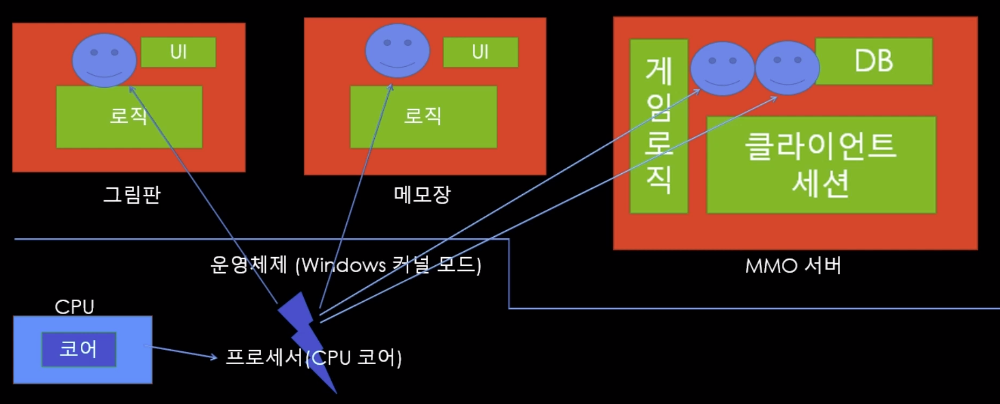
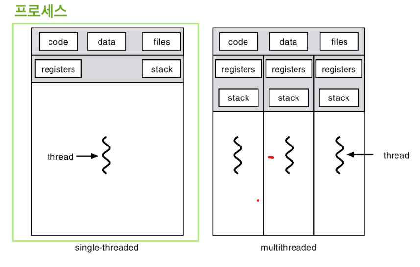
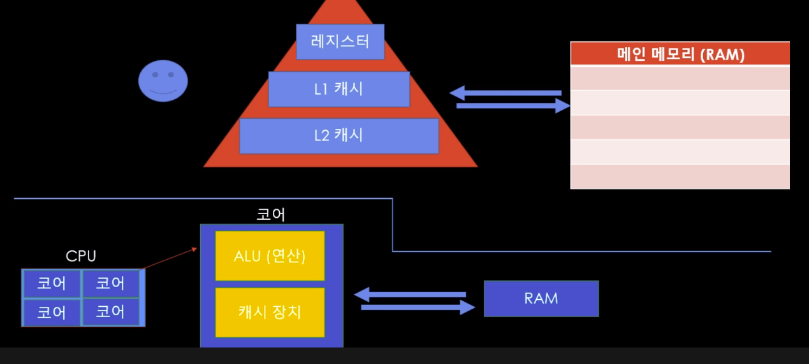

## Server

- 다른 컴퓨터에서 연결이 가능하도록 **대기 상태**로 상시 실행중인 프로그램
  - ex) 영업중인 식당
    - 손님이 올 수 있도록 식당을 열고 대기중인 상태
    - 손님이 오면 식당 메뉴/ 정책에 따라 서비스 제공

1. Web Server (aka. HTTP server)

   - Client가 요청을 보내고 Server가 응답을 보낸다
     - 실시간 상호작용 X (요청&응답)
     - Client와 Server간 질의 /응답 형태
     - 드물게 정보를 요청/갱신
     - 실시간 Interaction 필요X
     - Server에서 Client에게 먼저 접근할 일X
   - Client가 떠나면 Server에서는 Client의 상태를 당분간 잊고 지낸다(Stateless)
   - 웹 서비스를 만드는 데 사용
     - 구글, 아마존, 네이버 등등
     - 처음부터 만드는 경우는 거의 없고 프레임워크를 하나 골라서 사용
       - ASP.NET, Spring, NodeJS, Django, Flask, PHP
   - ex) 테이크아웃 포장 전문 식당

2. Game server(aka. TCP server, Binary Server, Stateful Server)

   - Client와 Server간 실시간 상호작용

     - 요청/갱신 횟수가 많다
     - 실시간 Interaction필요
     - Server가 언제라도 Client에게 접근 가능해야한다
     - Client가 Game에 접속해있을 때, Server가 Client의 상태를 보며 서비스 제공한다(Stateful)

   - Game Server도 Web Server를 이용한다

     - ex) 인증 & 로그인 -> Web Server이용 후 GameServer로 넘어온다

   - 최적의 프레임워크 & 장르에 따라 요구사항이 다르다

     | 고려할 대상              | 의미                      |
     | ------------------------ | ------------------------- |
     | 최대 동시 접속자         |                           |
     | Thread 개수 & 모델       |                           |
     | 게임 로직                | Client의 행동에 따른 운영 |
     | 네트워크                 | Client와 Server간 소통    |
     | DB                       | 데이터 처리               |
     | 게임장르 및 채널링       |                           |
     | 네트워크 모델            |                           |
     | 반응성(FPS, MMORPG, ...) |                           |

   - ex) 일반 식당

##### * 프로그램

- 실행 가능한 명령어의 집합

##### * 프로세스

- 컴퓨터에서 실행되고 있는 프로그램
- 메모리에 적재되어 실행되고 있는 프로그램
  - 실제 실행중인 프로그램을 일컫는다(동적이라고 표현하기도 함)
- 프로세스마다 최소 1개의 스레드 소유(메인 스레드)
- 각 프로세스는 별도의 주소 공간에서 실행되며, 다른 프로세스의 변수나 자료구조에 접근이 불가
  - 다른 프로세스의 자원에 접근하기 위해서는 IPC를 사용
- 프로세스는 각각 독립된 메모리 영역(Code(text), Data, Heap, Stack)을 할당받는다
  - Code: 프로그램의 실제 코드 저장
  - Data: 프로세스 실행 시 정의된 전역변수와 static변수
  - Heap: 프로세스 런타임 중 동적으로 할당되는 변수들 저장(함수 내에서 할당되는 변수 등)
  - Stack: 함수에서 다른 함수를 실행하는 등의 서브루틴들의 정보 저장

##### * 스레드

- 프로세스 내에서 실행되는 여러 흐름의 실행 단위

- 싱글스레드 : 프로그램 1개에 1개의 스레드로 구성하여 작업을 처리

- 멀티스레드 :

- 스레드는 CPU가 실행시켜야 동작한다

  - 1개의 CPU는 1개의 스레드를 실행시킬 수 있다

  - 1개의 CPU가 각 프로그램을 왔다갔다 반복하면서 스레드를 실행시킨다

    - 우리 눈에는 여러개의 프로그램이 동시에 돌아가는 것처럼 보인다
    - CPU가 왔다갔다하면서 스레드를 동작시키는 과정자체가 무겁고 힘든과정

    

- 기아현상 : CPU가 한 쪽 프로그램에 몰려있으면 다른 프로그램은 실행이 원활하지 않다

- 모든 스레드는 Heap영역과 데이터 영역을 공유하지만, 스택영역은 공유하지 않는다

  - 스택을 공유하지 않는 이유
    - 스택은 함수 호출 시 전달되는 인자, 작업 후 되돌아갈 주소값 및 함수 내에서 선언하는 변수 등을 저장하기 위해 사용되는 메모리 공간
    - 스택 메모리 공간이 독립적이라는 것은 독립적인 함수 호출이 가능하다는 것이고 이는 독립적인 실행 흐름이 추가되는 것
    - 스레드의 정의에 따라 독립적인 실행 흐름을 추가하기 위한 최소 조건으로 독립된 스택을 할당
  - PC 레지스터를 공유하지 않는 이유
    - PC값은 스레드가 명령어의 어디까지 수행하였는지를 나타내게 된다
    - 스레드는 CPU를 할당받았다가 스케쥴러에 의해 다시 선점, 명령어가 연속적으로 수행되지 못하고 어느 부분까지 수행했는지 기억해야 한다.
  - Heap, data영역을 공유하기 때문에 IPC없이도 스레드간 통신가능
  - code 영역을 공유하기 때문에 프로세스 내부 스레드들은 프로세스가 가지고 있는 함수 호출가능

  

##### * 멀티스레드

-  프로그램에 여러개의 스레드로 구성하여 작업을 처리
- 장점
  - 스레드들은 각자의 stack, 레지스터 영역을 제외한 모든 메모리를 공유하기 때문에 통신의 부담이 적다
  - 스레드간 데이터를 주고 받는 것이 간단해지고 시스템 자원소모가 감소
  - 프로세스를 생성하여 자원을 할당하는 시스템 콜이 감소하여 자원의 효율적 관리 가능

- 단점
  - 하나의 스레드가 데이터 공간 훼손 시, 모든 스레드가 작동 불가 상태
    - 공유하는 메모리를 소유하기 때문이다

##### * 캐시

- 기억을 하는 장치

- CPU 코어마다 ALU(연산) 캐시 장치가 존재한다

- 중요한 데이터는 RAM(메모리)에 저장해야한다

  - 스레드는 어떤 변수나 값을 캐시에 메모해놓으면서 모아놨다가 RAM에 저장한다

    

- TEMPORAL LOCALITY (시간적)

  - 가장 최근에 사용한 변수가 또 다시 재사용될 확률이 높으므로 메모

- SPACIAL LOCALITY(공간적)

  - 접근한 변수와 인접한 주소에 있는 변수들이 사용될 확률이 높으므로 메모

##### * 네트워크

