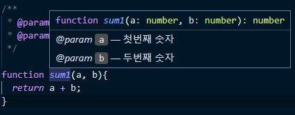

## 타입스크립트

##### * TypeScript?

- 타입스크립트는 자바스크립트에 타입을 부여한 언어  (TypeScript is Typed JavaScript at Any Scale)
  - 자바스크립트의 확장된 언어
    - JavaScript의 기능들을 제공하면서 그 위에 자체 레이어를 추가
  - TypeScript는 JavaSciprt 위에 레이어로서 자리잡고 있다.
- 자바스크립트와 다르게 브라우저에서 실행하기 위해 컴파일(파일을 한번 변환)해줘야 한다
  - 컴파일 : ts 파일을 js 파일로 변환하는 작업


##### * Why?

1. 에러의 사전 방지

   - 변수를 생성하면서 동시에 특정 값에 할당하는 경우, 특정 값의 Type을 해당 변수의 Type으로 사용

     - Type이 무엇이 되어야 하는지 명시 가능한 JavaScript 언어의 확장을 지원

   - 객체의 형태를 명시적으로 나타내기 위해서는 interface로 선언

     ```typescript
     interface User {
       name: string;
       id: number;
     }
     ```

   - 해당 인터페이스에 맞지 않는 객체를 생성하면 TypeScript는 경고를 준다

     ```typescript
     interface User {
       name: string;
       id: number;
     }
     
     // 올바른 동작
     const user: User = {
       name: "Hayes",
       id: 0,
     };
     
     // error
     const user: User = {
       username: "Hayes",
       id: 0,
     };
     
     // error
     const user: User = {
       name: 0,
       id: 0,
     };
     ```

     ```typescript
     function sum(a: number, b: number) {
       return a + b;
     }
     sum('10', '20'); // Error: '10'은 number에 할당될 수 없습니다.
     ```

   - 자바스크립트는 경고를 주지 않는다

     ```javascript
     function sum(a, b) {
       return a + b;
     }
     sum('10', '20'); // 1020

2. 코드 가이드 및 자동 완성(개발 생산성 향상)

   - javaScript는 코드를 작성하는 시점에 변수의 타입을 인지할 수 없다.
     - 개발자가 스스로 결과를 예상하고 타입을 가정한 상태에서 코딩을 하게 된다.
   - visual Studio의 intellisense(자동 완성)이 편해진다.
     - 코드를 작성해 나갈 때 코드 자동완성이나 속성, api, 어떤 값들이 있는지에 대한 것
     - 내부적으로 TypeScript Language Server가 돌아야한다
       - node_modules에서 tsserver.js파일
   
   
   ```typescript
   ex) toLocaleString() : 특정 언어의 표현 방식에 맞게 숫자를 표기하는 API
   // 만약 타입을 지정하지 않는 javaScript라고 할 때 toLocaleString을 쓰다가 오류가 난다면 브라우저에서 실행했을 때만 오류를 확인할 수 있다.
   // 타입스크립트로 작성하면 total에 타입이 지정되어 있기 때문에 해당 타입에 대한 API를 미리 보기로 띄어줄 수 있다. -> API를 일일이 치는 것이 아니라 tab으로 빠르고 정확하게 작성가능
   
   function sum(a: number, b: number): number { // 반환해주는 type까지 명시 가능
     return a + b;
   }
   var total = sum(10, 20);
   total.toLocaleString();
   ```
   
3. 컴파일러가 type을 확인하는 데에 도움

4. 협업을 할 때 읽기 쉬운 코드가 된다

5. 유지보수에 장점


##### * 자바스크립트를 타입스크립트처럼 코딩하는 방법

- js doc & ts-check

  

  ```javascript
  // @ts-check
  
  /**
   * @param {number} a 첫번째 숫자
   * @param {number} b 두번째 숫자
   */
  
  function sum1(a, b){
    return a + b;
  }
  
  sum1(10, 20);
  
  // javaScript는 밑에와 같은 오류를 미리 알려주지 않는다.
  // @ts-check를 사용하면 javaScript에서도 오류를 알려줄 수 있다. 
  sum1(10, "20");
  ```


##### * typeScript complie

- typeScript는 브라우저에서 실행되기 위해서는 컴파일 작업이 필요하다
- ts확장자 파일을 js로 변환해주는 complie 작업을 반복하지 않기 위해서는 webpack이용 

1. node기반으로 사용하는 자바스크립트 라이브러리를 설치

   - tsc(TypeScript complie)이라고 하는  명령어를 수행하기 위해 localSystem level에 설치

   ```
   npm install typescript -g
   ```

2. ts확장자 파일을 js로 변환해주는 complie 작업

   ```
   tsc 파일명.ts
   ```

3. complie 작업 완료 후 js확장자 파일이 생긴다.


##### * typeScript 설정 파일

- 디렉토리에 tsconfig.json파일이 있따면 해당 디렉토리가 TypeScript 프로젝트의 루트가 된다.

- tsconfig.json 파일의 경로를 명시적으로 지정

  ```
  tsc --project 상대경로
  tsc -p 상대경로

- typeScript를 javaScript로 변환할 때의 설정을 정의해놓는 파일
  - complie 작업할 때 부가적인 옵션 부여
- 프로젝트에서 tsc라는 명령어를 치면 TypeScript 설정 파일에 정의된 내용을 기준으로 컴파일 진행

1. [compilerOptions](https://typescript-kr.github.io/pages/compiler-options.html)

   - 생략될 수 있으며 생략하면 copiler의 기본값이 사용된다

   | 옵션                           | 타입      | 기본값                                                 | 설명                                                         |
   | ------------------------------ | --------- | ------------------------------------------------------ | ------------------------------------------------------------ |
   | `allowJs`                      | `boolean` | `false`                                                | js 파일들 ts에서 import해서 쓸 수 있는지 <br />JavaScript 파일의 컴파일을 허용합니다<br />(기존에 존재하는 자바스크립트 프로젝트에 타입스크립트를 점진적으로 적용할 때 사용하면 좋은 속성) |
   | `checkJs`                      | `boolean` | `false`                                                | `.js` 파일에 오류를 보고. `--allowJs`와 함께 사용<br />일반 js 파일에서도 에러체크 여부 |
   | `noImplicitAny`                | `boolean` | `false`                                                | `any` 타입 금지여부<br /> (암시한 표현식과 선언에 오류를 발생) |
   | `target`                       | `string`  | `"ES3"`                                                | TypeScript 파일을 compile 했을 때 빌드 디렉토리에 생성되는 JavaScript의 버전을 의미<br />'es3', 'es5', 'es2015', 'es2016', 'es2017','es2018', 'esnext' |
   | `module`                       | `string`  |                                                        | 모듈 코드 생성 지정<br />무슨 import 문법 쓸건지 "commonjs", "amd", "es2015", "esnext" |
   | `jsx`                          | `string`  | `"Preserve"`                                           | tsx 파일을 jsx로 어떻게 컴파일할 것인지 'preserve', 'react-native', 'react' |
   | `declaration`                  | `boolean` | `false`                                                | 컴파일시 .d.ts 파일도 자동으로 함께생성 (현재쓰는 모든 타입이 정의된 파일) |
   | `outFile`                      | `string`  |                                                        | 모든 ts파일을 js파일 하나로 컴파일해줌 (module이 none, amd, system일 때만 가능) |
   | `outDir`                       | `string`  |                                                        | js파일 아웃풋 경로바꾸기<br />출력 구조를 디렉토리로 리다이렉트 |
   | `rootDir`                      | `string`  | 공통 루트 디렉토리는 input files 리스트에서 처리됩니다 | 루트경로 바꾸기 (js 파일 아웃풋 경로에 영향줌)<br /> `outDir`로 출력 디렉토리 구조를 제어하기 위해서만 사용 |
   | `removeComments`               | `boolean` | `false`                                                | `/*!`로 시작하는 copy-right 헤더 주석을 제외한 모든 주석을 제거 |
   | `strict`                       | `boolean` | `false`                                                | 모든 엄격한 타입 검사 옵션을 활성화합니다. `strict`를 활성화하면 `noImplicitAny`, `noImplicitThis`, `alwaysStrict`, `strictNullChecks` 및 `strictFunctionTypes`이 가능 |
   | `strictNullChecks`             | `boolean` | `false`                                                | 엄격한 null 검사 모드에서는 `null`과 `undefined` 값이 모든 타입의 도메인에 있지 않고 그 자체와 `any`만 할당할 수 있습니다(한 가지 예외사항은 `undefined` 또한 `void`에 할당 가능하다는 것입니다). |
   | `strictFunctionTypes`          | `boolean` | `false`                                                | 함수파라미터 타입체크 강하게                                 |
   | `strictPropertyInitialization` | `boolean` | `false`                                                | class constructor 작성시 타입체크 강하게<br />`strictNullChecks` 활성화 필수 |
   | `noImplicitThis`               | `boolean` | `false`                                                | `any` 타입으로 암시한 `this` 표현식에 오류를 보고            |
   | `alwaysStrict`                 | `boolean` | `false`                                                | 자바스크립트 use strict 모드 켜기                            |
   | `noUnusedLocals`               | `boolean` | `false`                                                | 쓰지않는 지역변수 있으면 에러                                |
   | `noUnusedParameters`           | `boolean` | `false`                                                | 쓰지않는  매개 변수에 대한 오류                              |
   | `noImplicitReturns`            | `boolean` | `false`                                                | 함수의 모든 코드 경로에 반환값이 없을 때 오류를 보고         |
   | `noFallthroughCasesInSwitch`   | `boolean` | `false`                                                | switch문에 fallthrough 케이스에 대한 오류를 보고             |

2. files

   - TypeScript 변환 명령어를 입력할 때 마다 대상 파일의 경로를 지정하지 않고 설정 파일에 미리 정의
   - 컴파일 대상 경로를 정의하는 속성의 우선 순위
     - files > include = exclude

   ```typescript
   {
     "files": ["app.ts", "./utils/math.ts"]
   }

3. include

   - files와 같이 파일을 개별로 지정하지 않고 include 옵션으로 변환할 폴더를 지정할 수 있다

   ```typescript
   {
     "include": ["src/**/*"]
   }
   
   // 와일드 카드 패턴
   * : 해당 디렉토리의 모든 파일 검색
   ? : 해당 디렉토리 안에 파일의 이름 중 한 글자라도 맞으면 해당
   ** : 하위 디렉토리를 재귀적으로 접근(하위 디렉토리의 하위 디렉토리가 존재하는 경우 반복해서 접근)
   ```

4. exclude

   - include와 반대로 변환하지 않을 폴더 경로를 지정
   - 설정하지 않을 시 기본적으로 node_modules, browser_components 같은 폴더를 제외

   ```typescript
   {
     "exclude": ["node_modules"]
   }
   ```

5. extends

   - 특정 TypeScript 설정 파일에서 다른 TypeScript 설정의 내용을 가져와 추가할 수 있는 속성
   - 확장자 파일의 내용을 가져다가 덮어쓰거나 새로 정의할 수 있다

   ```typescript
   // config/base.json
   {
     "compilerOptions": {
       "noImplicitAny": true
     }
   }
   
   // tsconfig.json
   {
     "extends": "./config/base"
   }
   ```

6. lib

   - TypeScript 파일을 JavaScript로 compile할 때 포함될 라이브러리의 목록

   ```typescript
   // ex) async 코드를 complie 할 때 Promise 객체가 필요하므로 아래와 같은 설정이 필요
   // es2015는 프로미스 객체를 타입스크립트에서 인식할 수 있게 필요한 속성
   // dom 관련 속성은 DOM API를 사용하는 경우 필요
   {
     "lib": ["es2015", "dom", "dom.iterable"]
   }


##### * 타입추론(Type Inference)

- 타입스크립트가 코드를 해석해 나가는 동작

- 변수, 속성, 인자의 기본값, 함수의 반환값 등을 설정할 때 타입이 추론된다

- 내부적으로 TypeScript Language Server가 돌아가기 때문에 타입추론이 가능하다.

  - 타입을 추론할 수 있는 것들은 타입스크립트 내부적으로 각각의 타입,api들이 정의되어 있기 때문

- 가장 적절한 타입(Best Common Type)

  - 타입은 보통 몇 개의 표현식(코드)을 바탕으로 타입을 추론하고, 표현식을 이용하여 가장 근접한 타입을 추론하게 된다
  - Union으로 구분해 나간다.

  ```typescript
  // 아래의 arr의 타입을 추론하기 위해서는 배열의 각 item을 살펴봐야 한다.
  // item의 type은 크게 number와 null, 이 때 Best Common Type 알고리즘으로 다른 타입들과 잘 호환되는 타입을 선정한다.
  
  const arr = [0, 1, true]; // arr의 타입은 (number | boolean)[]이 된다
  ```

- 중간에 연산이나 복잡한 코드들에 의한 바뀐 값에 대해서는 타입추론 불가, 추적불가

  - 중간에 값(타입)이 바뀌어도 처음에 선언 된 타입으로 알고 있다.
  - 타입단언 사용하면 해결가능

  ```typescript
  let a;
  a = 5;
  a = 'hello';
  let b = a; // 맨 처음 선언 된 타입을 b에 할당하고 있다
  ```


##### * 타입단언(type assertion)

- `as type`

- 타입 스크립트보다 개발자가 타입을 더 잘 알고 있으니 타입스크립트는 신경X, 개발자가 정의한 타입을 받아들이게 한다

  - as는 코드가 도약하는 시점에 이 값이 어떤 타입일 것이라는 생각을 투영한다
    - 타입의 구체화(타입을 줄여나간다)

  ```typescript
  let a;
  a = 5;
  a = 'hello';
  let b = a as string;
  ```

- DOM API(web Page의 태그정보로 접근, 조작)를 조작할 때 많이 사용된다

  -  document로 접근하는 시점에서 해당 element가 있다는 보장을 해주지 않기 때문에 타입에 대한 값을 보장해줘야 한다
  - TypeScript Langauge Server에서는 해당 HTML타입 or null값을 반환한다

  ```typescript
  // <div>hello</div>
  // querySelector로 접근하는 시점에 document.querySelector가 돌아가는 라인 시점에서 div가 있다는 보장을 해주지 않기 때문에 타입에 대한 값을 보장해줘야 한다
  const div = document.querySelector('div');  
  if (div) { // document.querySelector('div')은 HTMLDivElement 혹은 null 타입을 준다
    div.innerText
  }
  
  // as를 쓰는 시점에서는 코드가 도약하는 시점에 document의 div라는 element가 있을 것이다
  const div1 = document.querySelector('div') as HTMLDivElement;
  div1.innerText


##### * 타입 호환

- TypeScript 코드에서 특정 타입이 다른 타입에 잘 맞는지를 의미
- 더 많은 속성을 가지거나 구조적으로 더 컸을 때 다른 타입과 호환이 된다
- 구조적으로 더 큰 타입에서는 더 작은 타입을 지원할 수 없다
- 구조적 타이핑 : 내부적으로 존재하고 있는 속성과 타입에 대한 정의들에 대해서 비유를 한다


##### * 모듈

- 다른 파일에서 작성한 코드를 import로 불러와서 연결하는 것


##### * Type annotation

- 타입표기

  - 변수명, 함수명, 객체 속성명 뒤에 `: type`를 이용하여 javaScript  코드에 type을 정의하는 방식

- 문자열 : string

  ```typescript
  const str: string = "hello";
  ```

- 숫자 : number

  ```typescript
  const num: number = 5;
  ```

- 진위값 : boolean

  ```typescript
  const bool: boolean = true;
  ```

- 배열 : Array

  ```typescript
  const arr: number[] = [1, 2, 3]; // 배열안에 숫자타입만 들어갈 수 있다
  
  // 제네릭 사용
  const arr1: Array<string> = ["1", "2", "3"]; // 배열안에 문자열 타입만 들어갈 수 있다 
  ```

- 튜플 : [type1, type2]

  - 배열의 길이가 고정되고 각 요소의 타입이 지정되어 있는 배열 형식
  - 정의하지 않은 타입, 인덱스로 접근할 경우 오류발생

  ```typescript
  const arr: [string, number] = ["hello", 10];
  ```

- 객체 : object

  ```typescript
  const obj: object = {};
  
  // object안에 특정 속성과 속성의 값들 까지 정의
  const obj: {name: string, age: number} = {
    name: "dongil",
    age: 27
  }
  ```

  - type을 object로 정의할 때 object 내부의 속성을 가져오면 오류가 발생한다

    - object안에 어떠한 속성이 들어있는 지 보장을 할 수 없다

    ```typescript
    const obj: object = {test: 1, test1:"objTest"}
    console.log(obj.test) // object 타입의 obj에는 test가 들어있는지 없는지 보장X 
    ```

  - object 내부의 속성을 사용하려면 타입을 정의할 때 object 안에 있는 속성들의 타입을 정확하게 기입

    - 객체의 모습(형상, shape)이 어떤 property(속성)으로 구성되어있는지 제대로 타입표기

    ```typescript
    const obj: {test: number, test1: string} = {test: 1, test1:"objTest"}
    console.log(obj.test) // obj에는 test가 들어있는지 알 수 있기에 오류X

- any : any

  - 알지 못하는 타입을 표현
  - 타입의 일부만 알고 전체는 알지 못할 때 유용

  ```typescript
  let notSure: any = 5;
  notSure = "string";
  notSure = true; // 성공
  
  // 여러 다른 타입이 섞인 배열에서 사용가능
  let list: any[] = [1, true, "string"]
  ```

- void : void

  - 어떤 타입도 존재할 수 없음을 나타낸다
  - void는 보통 함수에서 반환값이 없을 때 반환 타입을 표현하기 위해 쓰인다

  - void를 타입으로 사용하면 `null`과 `undefined`만 할당 가능
    - null은 `strictNullChecks`을 사용하지 않아야 할당가능

  ```typescript
  function warnUser(): void {
      console.log("No Return");
  }
  
  let unusable: void = undefined;
  unusable = null; //strictNullChecks을 사용하지 않을 때 가능
  ```

- Union : |

  - 두 가지 이상 타입을 쓸 수 있게 해준다
    - 타입을 여러개 연결하는 방식
    - OR 연산자와 비슷한 의미
  - Union을 사용하는 경우 타입스크립트의 이점을 살릴 수 있다
    - any를 사용하는 경우 자바스크립트로 작성하는 것 처럼 동작을 한다
  - 두 가지 이상의 type을 Union으로 묶었을 때 문제발생
    - Type Guard를 이용하여 타입의 범위를 좁히지 않으면 공통적으로 들어 있는 속성, api들에 대해서만 접근 가능
    - return해서 받는 값도 union type
  - 각 type에서 제공하는 모든 속성, api들에 대해서 접근이 불가
    - Union으로 묶여있는 type들의 공통된 속성, api에 대해서 접근가능
    - type을 검증한 뒤 접근이 가능하다

  ```typescript
  interface Developer {
    name: string;
    skill: string;
  }
  
  interface Person {
    name: string;
    age: number;
  }
  
  function unionTest(test: Developer | Person) {
    test.name; // O
    // test.age; // X, 타입 검사 후 가능
  }
  
  // 호출할 때 Developer type or Person type
  unionTest({ name: "dongil", skill: "ts" })
  unionTest({ name: "dongil", age: 27 })

- Intersection : &

  - 여러 타입을 모두 만족하는 하나의 타입을 의미한다
  - 여러 개의 타입 정의를 하나로 합치는 방식
    - AND 연산자와 비슷한 의미
  - 하나도 겹치지 않는 타입들로 이루어졌을 때 never type이 된다

  ```typescript
  interface Developer {
    name: string;
    skill: string;
  }
  
  interface Person {
    name: string;
    age: number;
  }
  
  function IntersectionTest(test: Developer & Person) {
    test.name;
    test.skill;
    test.age;
  }
  
  // 호출할 때 Developer와 Person 타입이 합쳐진 새로운 타입
  IntersectionTest({ name: "dongil", skill: "ts", age: 27 })
  IntersectionTest({ name: "dongil", skill: "ts"}) // error
  ```

- never

  - 절대 반환하지 않는 반환타입
  - 변수 또는 타입 가드에 의해 아무 타입도 얻지 못하게 좁혀질 때 얻게된다.
  - 어떤 타입도 never에 할당할 수 없다
    - any도 마찬가지이다.

- 이넘(Enums)

  - 특정 값들의 집합을 의미하는 자료형

  - TypeScript에서는 숫자형 , 문자형 이넘을 지원

  - 런타임시에 객체 형태로 존재

    ```typescript
    enum enumTest {
      X, Y, Z // 0, 1, 2
    }
    
    function getX(obj: { X: number }) {
      return obj.X;
    }
    getX(enumTest); // 이넘 E의 X는 숫자이기 때문에 정상 동작
    ```

    - `keyof`를 사용하는 대신 `keyof typeof`를 사용할 것

  - ex) 드롭다운 등의 목록이 필요한 형태에서 enum을 정의해서 쓴다

  - 숫자형 이넘

    - auto-incrementing 존재

      - 이넘을 선언할 때 초기값을 주지 않으면 0부터 차례로 1씩 증가
      - 초기값 설정하면 초기값부터 1씩 증가

    - 디버깅을 할 때 가끔 불명확하게 나올 때가 존재

      ```typescript
      enum Avengers {
        Captain = 0, // 0
        Ironman, // 1
        Hulk, // 2
      }
      
      const myHero = Avengers.Captain; // 0
      ```

    - 리버스 매핑

      - enum의 key로 value를, value로 key를 얻을 수 있다

      ```typescript
      enum Enum {
        A
      }
      let a = Enum.A; // 키로 값을 획득 하기
      let keyName = Enum[a]; // 값으로 키를 획득 하기

  - 문자형 이넘

    - 문자형으로 초기화한 순서부터 전부 특정 문자 또는 다른 enum 값으로 초기화 해야한다.

      - enum에 문자와 숫자를 혼합하여 생성이 가능하다
      - 최대한 같은 타입으로 이루어진 enum 사용하는 것이 좋다

    - 숫자형 이넘과 다르게 auto-incrementing이 없다

    - 디버깅 할 때 항상 명확한 값이 나온다

      ```typescript
      enum Avengers {
        Captain = '캡틴',
        Ironman = '아이언맨',
        Hulk = '헐크',
      }
      
      const myHero = Avengers.Captain; // 캡틴
      ```


##### * 함수

- 3가지 타입 정의 가능

  - 파라미터(매개변수) 타입, 반환 타입, 구조 타입

- 타입스크립트에서는 함수의 인자를 모두 필수값으로 간주

  - 함수의 매개변수를 설정할 때 `undefined` `null`이라도 인자로 넘겨야 한다
  - compile에서 정의된 매개변수 값이 넘어왔는지 확인
    - 정의된 매개변수 값만 받을 수 있고 추가로 인자를 받을 수 없다
  - 정의된 매개변수의 갯수만큼 인자를 넘기지 않아도 되는 자바스크립트의 유연한 특성과 반대
    - 파라미터와 인자의 갯수는 1:1 mapping

- 기존 자바스크립트 함수의 선언 방식에서 매개변수와 함수의 반환 값에  타입을 추가

  - 매개변수에 타입표기
    - 매개변수를 쓰는 소괄호 안에서 변수 옆에 타입표기
  - 함수의 반환 값에 타입표기
    - 소괄호 바깥에서 반환값에 대한 타입표기
    - 함수의 반환 값에 타입을 정하지 않을 때는 `void`라도 사용

  ```typescript
  // 함수의 매개변수 타입
  function sum(a: number, b: number) {
    return a + b;
  }
  
  // 함수의 반환 타입
  function sum(): number {
    return 5;
  }

- optional parameter

  - `?`를 사용해서 정의된 매개변수의 갯수보다 적게 인자를 보낼 수 있다

    ```typescript
    function sum(a: number, b?: number): number {
      return a + b;
    }
    sum(10, 20); // 30
    sum(10, 20, 30); // error, too many parameters
    sum(10); // 10
  
- object type

  - parameter의 type을 object로 정의할 때 object 내부의 속성을 가져오면 오류가 발생한다

    - object안에 어떠한 속성이 들어있는 지 보장을 할 수 없다

    ```typescript
    function simpleTest(index: number, todo: object): void {
      todo.test = true; // object 타입의 todo에는 test가 들어있는지 없는지 보장X 
    }
    ```

  - object 내부의 속성을 사용하려면 타입을 정의할 때 object 안에 있는 속성들의 타입을 정확하게 기입

    - 객체의 모습(형상, shape)이 어떤 property(속성)으로 구성되어있는지 제대로 타입표기

    ```typescript
    function simpleTest(index: number, todo: {test: boolean, test1: number}): void {
      todo.test = true; // todo에는 test가 들어있는지 알 수 있기에 오류X
    }


##### * 인터페이스

- `interface`  `정의할이름`  `{type정의}`

- 상호 간에 정의한 약속 or 규칙

- TypeScript에서 가능한 약속 정의
  1. 객체의 스펙(속성과 속성의 타입)
  2. 함수의 파라미터
  3. 함수의 스펙(파라미터, 반환 타입 등)
  4. 배열과 객체를 접근하는 방식
  5. 클래스

- 인터페이스를 사용하면 타입 추론이 힘들어진다
  
  - 타입을 추론할 수 있는 이유는 타입스크립트 내부적으로 각각의 타입, api들이 정의되어 있기 때문이다
  
- 변수를 정의하는 인터페이스

  - 변수가 정의된 인터페이스로 타입표기가 된다면, 상호 간에 정의된 규칙(interface)을 따라서 할당되어야 한다.

    ```typescript
    interface User {
      name: string;
      age: number;
    }
    
    // 변수에 사용하는 경우
    const seho: User = { name: "dongil", age: 27 };

- 함수의 매개변수에 인터페이스를 사용하는 경우

  - `interface`  `정의할이름`  `{type정의}`

  - 함수는 특정 형식(interface의 형식)을 준수하는 데이터만 매개변수로 받는다.

    - 인자도 특정 형식(interface의 형식)을 준수해야 한다.

    ```typescript
    interface User {
      name: string;
      age: number;
    }
    
    function getUser(user: User): void {
      console.log(user);
    }
    
    const seho: User = { name: "dongil", age: 27 };
    getUser(seho);
    
    const capt = {name: "test"}
    getUser(capt) // 오류발생

- 함수 구조(규칙, 스펙)를 정의하는 인터페이스

  - `interface`  `정의할이름`  `{(매개변수: 타입, ...): 타입}`

  - 함수의 매개변수, 반환타입을 정의할 수 있다.

    ```typescript
    // 함수의 전체 타입에 사용하는 경우
    interface SumFunction { // SumFunction이라고 하는 interface
      (a: number, b: number): number; // 매개변수와, 반환타입 정의
    }
    
    let sum: SumFunction;
    sum = function (num1: number, num2: number): number {
      return num1 + num2;
    };
    ```

- 인덱싱 방식을 정의하는 인터페이스 (배열의 인덱싱에 사용하는 경우)

  - `interface`  `정의할이름`  `{[index: index타입]: 값타입}`

  - 배열의 index에 type을 지정(속성을 부여할 때 타입 지정)

    ```typescript
    // 배열의 인덱싱에 사용하는 경우
    interface TestArray {
      [index: string]: number; // index는 string, 속성값은 number
    }
    
    let arr: TestArray;
    arr["0"] = 5;
    arr["1"] = 10;
    // arr[7] = 1; error
    ```

- 딕셔너리 패턴

  - `interface`  `정의할이름`  `{[key: key타입]: 값타입}`

  - 딕셔너의 key에 type을 지정

    ```typescript
    interface TestDictionary{
      [key: number]: string; // 정규표현식
    }
    
    const obj: TestDictionary = {
      0: "Test",
      1: "Test1",
      // "2": "Test2" error
    }
    ```


- 인터페이스 확장(상속)

  - 기존에 존재하는 interface를 상속받아 확장을 할 수 있다.

  - `interface`  `정의할이름` `extends`  `상속받을 interface`

  - extends 키워드를 이용해 상속을 받는다

    ```typescript
    interface Person {
      name: string;
      age?: number; // optional 선택자 ? 동일하게 적용 가능
    }
    
    interface Developer extends Person {
      language: string;
    }
    
    const preInterface: Person = { name: 'dongil', age: 27}
    const dongil: Developer = {
      name: 'dongil', age: 27, language: 'ts'
    };
    const dongil1: Developer = {
      name: 'dongil', language: 'ts'
    };


##### * 타입별칭(Type Aliases)

- 정의한 타입에 이름(별칭)을 부여하는 방법

  - 타입을 정의할 수 있는 모든 곳에 별칭을 붙일 수 있다

  ```typescript
  type Todo = {
    id: number;
    title: string;
    done: boolean;
  }
  ```

- 특정 type이나 interface를 참조할 수 있는 타입 변수를 의미

  ```typescript
  // string 타입을 사용할 때
  const name: string = 'capt';
  
  // 타입 별칭을 사용할 때
  type MyName = string;
  const name: MyName = 'capt';
  ```

- 타입별칭은 확장(상속)이 불가능하다

  - 좋은 소프트웨어는 언제나 확장이 용이해야 한다
  - 가급적 확장 가능한 인터페이스로 선언하면 좋다


##### * 클래스

- 클래스의 최상단에 맴버변수의 타입을 정의한다
- 변수의 접근범위를 지정할 수 있다
  - private, public, protected, readonly


##### * 제네릭(Generics)

- `<type>`
- 선언(함수, 인터페이스, 클래스 등)할 때 타입을 미리 지정하지 않고 호출할 때 사용할 타입을 정하여 넘겨준다.
- generic value : 호출할 때 generic을 이용하여 선언된 부분에 넘겨줄 값(타입)
- 장점
  1. 호출할 때 넘긴 타입을 타입스크립트가 추정할 수 있다
  2. 함수의 입력값에 대한 타입과 출력 값에 대한 타입이 동일한지 검증할 수 있다
     - any를 쓸 때는 인자로 어떤 타입이 들어갔는지, 어떤 값이 반환되는지 알 수 없다
- 이넘(enum), 네임스페이스(namespace)는 제네릭으로 생성할 수 없다

- 함수에서 사용할 타입을 parameter처럼 값으로 받는다

  - 함수를 호출할 때 함수 안에서 사용할 타입을 넘겨준다
  - 타입을 넘겨줘도 함수 내부의 코드에서 api를 쓰는데 어려움이 발생한다
    - 제네릭에 타입(타입제한)을 줘야 api를 쓰는데 오류가 발생하지 않는다
      - 컴파일러가 모든 타입에서 특정 api를 증명(확인)할 수 없다
    - any를 지정한 것과 비슷하게 동작
    - 함수 코드만 살펴봤을 때는 함수의 인자와 반환값에 대한 타입을 정하지는 않았지만, 어떤 타입이 들어오고 어떤 타입이 나가는지 알 수 있다

  ```typescript
  // 파라미터에 값을 넘겨 어떤 값이 들어와도 그대로 반환 : 함수에서 type을 지정X -> 암묵적 any
  function textFunction(text){
    console.log(text);
    return text;
  }
  textFunction(10)
  textFunction("hello")
  textFunction(true)
  
  // 제네릭 기본 문법 적용 : 함수를 호출할 때 함수 안에서 사용할 타입을 넘겨준다
  function textFunction<T>(text: T): T {
    return text;
  }
  textFunction<number>(10) // 제네릭 값을 number로 넘겼다
  textFunction<string>("hello") // 제네릭 값을 string으로 넘겼다
  textFunction<boolean>(true) // 제네릭 값을 boolean으로 넘겼다
  ```

- interface에 generic 적용

  - 인터페이스를 호출할 때 인터페이스 안에서 사용할  타입을 넘겨준다

  - 한 개의 interface로 generic을 이용해 여러가지 타입을 커버할 수 있다

  - generic이 적용된 interface가 다른 generic이 적용된 interface를 상속받을 때, 제네릭 값은 서로 공유된다.

    ```typescript
    // DetailedDropdown의 generic value가 Dropdown의 generic value까지 결정하게 된다
    interface Dropdown<T> {
      value: T
      title: string;
    }
    interface DetailedDropdown<K> extends Dropdown<K> {
      description: string;
      tag: K;
    }
    
    const items: Dropdown<number> = {
      value: 10,
      title: 'a'
    }
    
    const detailItems: DetailedDropdown<number> = {
      value: 5,
      title: 'a',
      description: 'b',
      tag: 5
    }

  ```typescript
  // 제네릭을 이용한 인터페이스 선언
  interface Dropdown<T> {
    value: T;
    selected: boolean;
  }
  
  // 인터페이스를 쓸 때 generic value를 넘겨준다
  const emails_generic: Dropdown<string>[] = [
    { value: 'naver.com', selected: true },
    { value: 'gmail.com', selected: false },
    { value: 'hanmail.net', selected: false },
  ];
  
  const numberOfProducts_generic: Dropdown<number>[] = [
    { value: 1, selected: true },
    { value: 2, selected: false },
    { value: 3, selected: false },
  ];
  
  // 함수 generic
  function createDropdownItem_generic<T>(item: Dropdown<T>) {
    const option = document.createElement('option');
    option.value = item.value.toString();
    option.innerText = item.value.toString();
    option.selected = item.selected;
    return option;
  }
  
  emails_generic.forEach(function (email) {
    const item = createDropdownItem_generic<string>(email);
    const selectTag = document.querySelector('#email-dropdown');
    selectTag.appendChild(item);
  });
  
  numberOfProducts_generic.forEach(function (product) {
    const item = createDropdownItem_generic<number>(product);
    const selectTag = document.querySelector('#product-dropdown');
    selectTag.appendChild(item);
  });
  ```

- 타입 제한
  - ??


##### * 비동기 코드(Promise)

- `Promise<반환하는 데이터 타입>`

- 비동기적 코드를 실행할 때, promise의 생성자를 실행하게 되면 Promise까지는 추론이 가능하나 그 안의 타입은 알 수 없다
  - 비동기 함수를 실행하는 시점에서 타입스크립트가  Promise안에 들어오는 비동기 코드에 대해서는 알 수 없다
  - 타입을 추론할 수 있는 것들은 타입스크립트 내부적으로 각각의 타입,api들이 정의되어 있기 때문이다
    - TypeScript Lanaguage Server
  - 비동기 처리를 통해서 돌려받을 반환값을 명시해야 promise를 제대로 쓸 수 있다

- Promise가 기본적으로는 generic을 이용해 정의되어 있다.
  - Promise 자체 타입이 generic을 받게끔 내부적으로 구현이 되어있다
