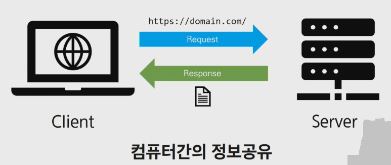

## www(World Wide Web)

- 인터넷에 연결된 컴퓨터를 통해 사람들이 정보를 공유할 수 있는 전세계적인 공간


##  HTTP

- Hyper Text Transfer Protocol

  - HTML 문서와 같은 리소스(자원, 데이터)들을 가져올 수 있도록 해주는 프로토콜(규칙,규약)

  - 웹에서 이루어지는 모든 데이터 교환의 기초

  - 클라이언트 - 서버 프로토콜이기도 함

    

  - 요청(requests)

    - 브라우저인 클라이언트에 의해 전송되는 메시지
      - Client는 URL로 요청을 보낸다

  - 응답(responses)

    - 서버에서 응답으로 전송되는 메시지
      - Server는 요청에 대한 응답을 문서(텍스트)로 보낸다.

    

- 특징

  1. 비연결지향(connectionless)
     - 서버는 요청에 대한 응답(html)을 보낸 후 연결을 끊음
  2. 무상태(stateless)
     - 연결을 끊는 순간 클라이언트와 서버 간의 통신이 끝나며 상태 정보가 유지되지 않는다
       - 상태 정보 : 로그인 상태
     - 클라이언트와 서버가 주고 받는 메세지들(data)은 서로 완전히 독립적임

  3. 클라이언트와 서버의 지속적인 관계를 유지하기 위해 쿠키와 세션이 존재
     - Login이 되어있는 상태에서 다른 Page로 넘어갈 때, 서버에 요청을 보낼 때 마다 우리가 로그인 되어있다는 것을 Cookie와 Session을 통해 매번 알려 Login상태를 유지시킨다


##### * HTTP 메시지

- 요청

  - HTTP request methods
    - 자원에 대한 행위(수행하고자 하는 동작)을 정의
    - 주어진 리소스(자원)에 수행하길 원하는 행동을 나타냄
    - HTTP Method 예시
      - GET(조회), POST(작성), PUT(수정), DELETE(삭제)

  

- 응답

  - HTTP response status codes
    - 특정 HTTP 요청이 성공적으로 완료되었는지 여부를 나타냄
      1. Information responses(1xx)
      2. Successful responses(2xx)
      3. Redirection messages(3xx)
      4. Client error responses(4xx)
      5. Server error responses(5xx)
  - Content-Type entity header
    - 데이터의 media type(MIME type, content type)을 나타내기 위해 사용됨
    - 응답 내에 있는 컨텐츠의 컨텐츠 유형이 실제로 무엇지이 Clinet에게 알려줌

  

##### * Header & Body

- Head(헤드) : HTTP 메시지의 시작 줄과 HTTP 헤더
- Body(본문) : HTTP 메시지의 페이로드
- Header와 Body를 동시에 가지는 요청은 POST 뿐이다

1. General Header

   -  전송되는 컨텐츠에 대한 정보보다는, 요청/응답이 이루어지는 날짜 및 시간등에 대한 일반적인 정보가 포함된다

   ```
   Date : 현재시간 (Sat, 23 Mat 2019 GMT)
   
   Pragma : 캐시제어 (no-cache), HTTP/1.0에서 쓰던 것으로 HTTP/1.1에서는 Cache-Control이 쓰인다.
   
   Cache-Control : 캐시 제어
     - no-store : 캐시를 저장하지 않겠다.
     - no-cache : 모든 캐시를 쓰기 전에 서버에 해당 캐시를 사용해도 되는지 확인하겠다.
     - must-revalidate : 만료된 캐시만 서버에 확인하겠다.
     -  public : 공유 캐시에 저장해도 된다.
     - private : '브라우저' 같은 특정 사용자 환경에만 저장하겠다.
     - max-age : 캐시의 유효시간을 명시하겠다.
   
   Transfer-Encoding : body 내용 자체 압축 방식 지정
     - 'chunked'면 본문의 내용이 동적으로 생성되어 길이를 모르기 때문에 나눠서 보낸		다는 의미다.
     - 본문에 데이터 길이가 나와서 야금야금 브라우저가 해석해서 화면에 뿌려줄 때 이 	기능을 사용한다.
   
   Upgrade : 프로토콜 변경시 사용 ex) HTTP/2.0
   
   Via : 중계(프록시)서버의 이름, 버전, 호스트명
   
   Content-Encoding : 본문의 리소스 압축 방식 (transfer-encoding은 body 자체이므로 다름)
   
   Content-type : 본문의 미디어 타입(MIME) ex) application/json, text/html
   
   Content-Length : 본문의 길이
   
   Content-language : 본문을 이해하는데 가장 적절한 언어 ex) ko
   
     - 한국사이트여도 본문을 이해하는데 영어가 제일 적절하면 영어로 지정된다.
   
   Expires : 자원의 만료 일자
   
   Allow : 사용이 가능한 HTTP 메소드 방식 ex) GET, HEAD, POST
   
   Last-Modified : 최근에 수정된 날짜
   
   ETag : 캐시 업데이트 정보를 위한 임의의 식별 숫자
   
   Connection : 클라이언트와 서버의 연결 방식 설정 
     - HTTP/1.1은 kepp-alive 로 연결 유지하는게 디폴트.
   ```

2. Request Header

   - 웹 브라우저가 웹 서버에 요청하는 것을 텍스트로 변환한 메시지들

   ```
   Request Line : 어떤 웹서버로 접속(Host 부분)해서, 어떠한 방식(HTTP/1.1)으로, 어떠한 메소드(GET)를 통해 무엇을(/doc/test/.html) 요청했는지에 대한 메시지가 담겨있다.
   
   Host : 요청하려는 서버 호스트 이름과 포트번호
   
   User-agent : 클라이언트 프로그램 정보
     - ex) Mozilla/4.0, Windows NT5.1
     - 이 정보를 통해서 서버는 클라이언트 프로그램(브라우저)에 맞는 최적의 데이터를 보내줄 수 있다.
   
   Referer : 바로 직전에 머물렀던 웹 링크 주소(해당 요청을 할 수 있게된 페이지)
   
   Accept : 클라이언트가 처리 가능한 미디어 타입 종류 나열
     - ex) */* - 모든 타입 처리 가능, application/json - json데이터 처리 가능.
   
   Accept-charset : 클라이언트가 지원가능한 문자열 인코딩 방식
   
   Accept-language : 클라이언트가 지원가능한 언어 나열
   
   Accept-encoding : 클라이언트가 해석가능한 압축 방식 지정
     - ex) gzip, deflate
     - 압축이 되어있다면 content-length와 content-encoding으로 압축을 해제한다.
   
   Content-location : 해당 개체의 실제 위치
   
   Content-disposition : 응답 메세지를 브라우저가 어떻게 처리할지 알려줌.
     - ex) inline, attachment; filename='jeong-pro.xlsx'
   
   Content-Security-Policy : 다른 외부 파일을 불러오는 경우 차단할 리소스와 불러올 리소스 명시
     - ex) default-src https -> https로만 파일을 가져옴
     - ex) default-src 'self' -> 자기 도메인에서만 가져옴
     - ex) default-src 'none' -> 외부파일은 가져올 수 없음
   
   If-Modified-Since : 여기에 쓰여진 시간 이후로 변경된 리소스 취득. 페이지가 수정되었으면 최신 페이지로 교체하기 위해 사용된다.
   
   Authorization : 인증 토큰을 서버로 보낼 때 쓰이는 헤더
   
   Origin : 서버로 Post 요청을 보낼 때 요청이 어느 주소에서 시작되었는지 나타내는 값
     - 이 값으로 요청을 보낸 주소와 받는 주소가 다르면 CORS 에러가 난다.
   
   Cookie : 쿠기 값 key-value로 표현된다.
     - ex) attr1=value1; attr2=value2
   ```

3. Response Header

   - 웹 서버가 웹 브라우저에 응답하는 콘텐츠가 들어가 있는 메시지
   - 웹브라우저가 요청한 메시지에 대한 status
     - 성공했는지 여부(202, 400 등), 메시지, 요청한 으답 값들이 body에 담겨 있다

   ```
   Location : 301, 302 상태코드일 떄만 볼 수 있는 헤더로 서버의 응답이 다른 곳에 있다고 알려주면서 해당 위치(URI)를 지정한다.
   Server : 웹서버의 종류
     - ex) nginx
     
   Age : max-age 시간내에서 얼마나 흘렀는지 초 단위로 알려주는 값
   
   Referrer-policy : 서버 referrer 정책을 알려주는 값
     - ex) origin, no-referrer, unsafe-url
   
   WWW-Authenticate : 사용자 인증이 필요한 자원을 요구할 시, 서버가 제공하는 인증 방식
   
   Proxy-Authenticate : 요청한 서버가 프록시 서버인 경우 유저 인증을 위한 값
   ```

4. Entity Header
   - 실제 주고받는 컨텐츠와 관련되 http 본문에 대한 정보가 담겨져 있다


##### * 웹에서의 리소스 식별

- HTTP 요청의 대상을 리소스(resource, 자원)라고 한다
- 리소스는 문서, 사진  또는 기타 어떤 것이든 될 수 있다
- 각 리소스는 리소스 식별을 위해 HTTP 전체에서 사용되는 URI로 식별된다
  - 자원이 어디에 위치하는지, 어떤곳으로 이동하는지에 대한 정보는 URI에 있다

##### * URI

- 통합 자원 식별자
- 인터넷의 자원을 식별하는 유일한 주소 (정보의 자원을 표현)
- 인터넷에서 자원을 식별하거나 이름을 지정하는데 사용되는 간달한 문자열
- 하위 개념
  - URL, URN
  - URL는 크게 URL과 URN으로 나눌 수 있지만, URN을 사용하는 비중이 매우 적다.

- URL
  - 통합 자원 위치 (리소스의 위치)
  - 네트워크 상에 자원이 어디있는지 알려주기 위한 약속
  - 과거에는 실제 자원의 위치를 나타냈지만 현재는 추상화된 의미론적인 구성
    - ex) www.naver.com/index.html/
  - 웹주소, 링크 라고 불린다
- URN
  - 통합 자원 이름
  - URL과 달리 자원의 위치에 영향을 받지않는 유일한 이름 역할

##### * URI의 구조

- https://www.example.com:80/path/to/myfile.html/?key=value#quick-start

1. Schema(protocol)
   - 브라우저가 사용해야 하는 프로토콜
   - http(s), data, file, ftp, malito
   - **https://**

2. Host(Domatin name)
   - 요청을 받는 웹서버의 이름(주소)
   - IP address를 직접 사용할 수도 있지만, 실 사용시 불편하므로 웹에서 그리 자주 사용되지는 않음
     - (google의 IP address : 142.251.42.142)
   - **www.example.com**
3. Port
   - 웹 서버 상의 리소스에 접근하는데 사용되는 기술적인 문(gate)
   - HTTP 프로토콜의 표준 포트
     - HTTP 80
     - HTTPS 443
   - **:80**
4. Path
   - 웹 서버 상의 리소스 경로
   - 초기에는 실제 파일이 위치한 물리적 위치를 나타냈지만, 현재 추상화 형태의 구조로 표현된다.
   - **/path/to/myfile.html** 
5. Query (Identifier)
   - Query String Parameters
   - 웹 서버에 제공되는 추가적인 매개 변수
   - &로 구분되는 key-value 목록
   - **?key=value**
6. Fragment
   - Anchor
   - 자원 안에서 북마크의 한 종류를 나타냄
   - 브라우저에게 해당 문서(HTML)의 특정 부분을 보여주기 위한 방법
   - 브라우저에게 알려주는 요소이기 때문에 fragment identifier(부분 식별자)라고 부르며 '#' 뒤의 부분은 요청이 서버에 보내지지 않는다
   - **#quick-start**


## Cookie & Session

##### * Session : 서버와 클라이언트의 대화성 통신 또는 대화성 통신을 유지하는 정보


##### * Cookie

- Server가 Client의 웹 브라우저에 전송하는 작은 데이터 조각

- 사용자가 웹사이트를 방문할 경우 해당 웹사이트의 서버를 통해 사용자의 컴퓨터에 설치되는 작은 기록 정보 파일

  - 브라우저(Client)는 Cookie를 local에 KEY-VALUE의 데이터 형식으로 저장
  - 이러한 방식으로 Cookie를 저장해 놓았다가, 동일한 Server에 재요청시 저장된 Cookie를 함께 전송

- 쿠키는 소프트웨어가 아니다

  - 프로그램처럼 실행 될수 없다
  - 악성코드를 설치할 수 없지만, 사용자의 행동을 추적하거나 Cookie를 훔쳐서 해당 사용자의 계정 접근권한을 획득 할 수도 있음

  

- Cookie는 요청이 동일한 브라우저에서 들어왔는지 아닌지를 판단할 때 주로 사용

  - 이를 이용해 사용자의 로그인 상태를 유지할 수 있음
  - 상태가 없는(stateless) HTTP 프로토콜에서 상태 정보를 기억 시켜주기 때문이다

- 웹 페이지에 접속하면 요청한 웹 페이지를 받으며 Cookie를 저장하고, Client가 같은 Server에 재요청 시 요청과 함께 쿠키도 함께 전송

  

- 사용 목적

  1. 세션 관리(Session management)
     - 로그인, 아이디 자동 완성, 공지 하루 안보기, 팝업체크, 장바구니 등의 정보관리
  2. 개인화(Personalization)
     - 사용자 선호, 테마 등의 설정
  3. 트래킹(Tracking)
     - 사용자 행동을 기록 및 분석

- 쿠키 확인

  - 개발자도구 -> Network탭
    - 서버는 응답과 함께 Set-Cookie 응답 헤더를 브라우저에게 전송
      - 헤더는 Client에게 Cookie를 저장하라고 전달

  - 서버로 전송되는 모든 요청과 함께, browser는 Cookie HTTP 헤더를 사용해 Server로 이전에 저장했던 모든 Cookie들을 함께 전송


##### * Session

- 무상태 프로토콜인 HTTP인 기반에서 세션을 구현하기 위해 Client는 Session(Session Key , Client id, Session Cookie)을 Cookie에 저장, Server는 Session(Session 상태, Client 상태, Session data)을 저장소에 저장한다

- Cookie안에 session id 저장되는 것
  - ID는 Session을 구별하기 위해 필요하며, Cookie에는 ID만 저장함
  - ID에 대한 value값들은 Server가 가지고 있다

- 사이트와 특정 브라우저 사이의 상태(state)를 유지시키는 것
- Client가 Server에 접속하면 서버가 특정 session id를 발급하고, Client는 발급 받은 session id를 Cookie에 저장
  - Client가 다시 Server에 접속하면 요청과 함께 쿠키(session id가 저장된)를 서버에 전달
  - Cookie는 요청 때마다 Server에 함께 전송되므로 Server에서 session id를 확인해 알맞은 로직을 처리

- 모든 것을 Session으로 사용하려고 하면 사용자가 많을 때 Server에 부하가 걸릴 수 있다
  - 노출되어도 괜찮은 정보는 Cookie를 사용한다


##### * 쿠키 수명(Cookie's lifetime)

- 쿠키의 수명은 두가지 방법으로 정의

1. Session Cookies

   - 유효기간이 존재하지 않는다

   - 현재 Browser(세션)이 종료되면 삭제됨
   - 브라우저가 "현재 세션(current session)"이 종료되면 시기를 정의
   - 일부 브라우저는 다시 시작할 때 세션 복원(session restoring)을 사용해 session cookies가 오래 지속 될수 있도록 함

2. Persistent cookies (or Permanent cookies)

   - Expires 속성에 지정된 날짜 혹은 Max-Age 속성에 지정된 기간이 지나면 삭제
     - 개발자 도구 -> Application -> Expires/Max-Age에서 확인 가능

