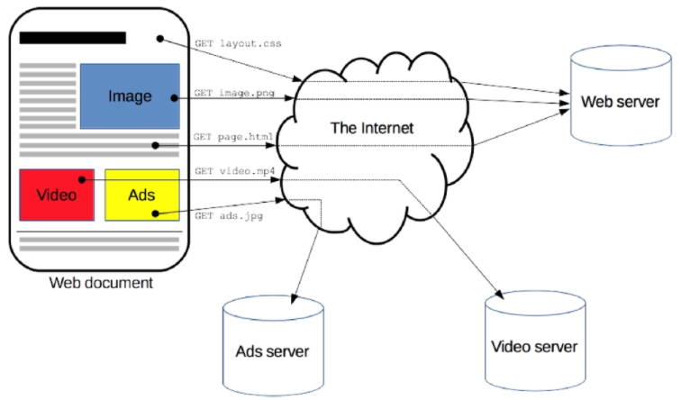
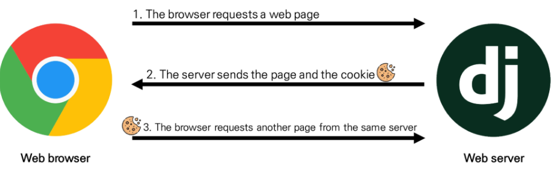

##### * HTTP

- Hyper Text Transfer Protocol

  - HTML 문서와 같은 리소스(자원, 데이터)들을 가져올 수 있도록 해주는 프로토콜(규칙,규약)

  - 웹에서 이루어지는 모든 데이터 교환의 기초

  - 클라이언트 - 서버 프로토콜이기도 함

    

- 특징

  1. 비연결지향(connectionless)
     - 서버는 요청에 대한 응답(html)을 보낸 후 연결을 끊음
  2. 무상태(stateless)
     - 연결을 끊는 순간 클라이언트와 서버 간의 통신이 끝나며 상태 정보가 유지되지 않는다
       - 상태 정보 : 로그인 상태
     - 클라이언트와 서버가 주고 받는 메세지들(data)은 서로 완전히 독립적임

  3. 클라이언트와 서버의 지속적인 관계를 유지하기 위해 쿠키와 세션이 존재
     - Login이 되어있는 상태에서 다른 Page로 넘어갈 때, 서버에 요청을 보낼 때 마다 우리가 로그인 되어있다는 것을 Cookie와 Session을 통해 매번 알려 Login상태를 유지시킨다

##### * Session : 서버와 클라이언트의 대화성 통신 또는 대화성 통신을 유지하는 정보

##### * Cookie

- Server가 Client의 웹 브라우저에 전송하는 작은 데이터 조각
- 사용자가 웹사이트를 방문할 경우 해당 웹사이트의 서버를 통해 사용자의 컴퓨터에 설치되는 작은 기록 정보 파일
  - 브라우저(Client)는 Cookie를 local에 KEY-VALUE의 데이터 형식으로 저장
  - 이러한 방식으로 Cookie를 저장해 놓았다가, 동일한 Server에 재요청시 저장된 Cookie를 함께 전송
- 쿠키는 소프트웨어가 아니다
  - 프로그램처럼 실행 될수 없다
  - 악성코드를 설치할 수 없지만, 사용자의 행동을 추적하거나 Cookie를 훔쳐서 해당 사용자의 계정 접근권한을 획득 할 수도 있음

- HTTP 쿠키는 상태가 있는 Session을 만들어 줌

  ( Session : 서버와 클라이언트의 대화성 통신 또는 대화성 통신을 유지하는 정보)

- Cookie는 요청이 동일한 브라우저에서 들어왔는지 아닌지를 판단할 때 주로 사용

  - 이를 이용해 사용자의 로그인 상태를 유지할 수 있음
  - 상태가 없는(stateless) HTTP 프로토콜에서 상태 정보를 기억 시켜주기 때문이다

- 웹 페이지에 접속하면 요청한 웹 페이지를 받으며 Cookie를 저장하고, Client가 같은 Server에 재요청 시 요청과 함께 쿠키도 함께 전송

  

- 사용 목적
  1. 세션 관리(Session management)
     - 로그인, 아이디 자동 완성, 공지 하루 안보기, 팝업체크, 장바구니 등의 정보관리
  2. 개인화(Personalization)
     - 사용자 선호, 테마 등의 설정
  3. 트래킹(Tracking)
     - 사용자 행동을 기록 및 분석

- 쿠키 확인

  - 개발자도구 -> Network탭
    - 서버는 응답과 함께 Set-Cookie 응답 헤더를 브라우저에게 전송
      - 헤더는 Client에게 Cookie를 저장하라고 전달

  - 서버로 전송되는 모든 요청과 함께, browser는 Cookie HTTP 헤더를 사용해 Server로 이전에 저장했던 모든 Cookie들을 함께 전송

##### * Session

- 무상태 프로토콜인 HTTP인 기반에서 세션을 구현하기 위해 Client는 Session(Session Key , Client id, Session Cookie)을 Cookie에 저장, Server는 Session(Session 상태, Client 상태, Session data)을 저장소에 저장한다

- Cookie안에 session id 저장되는 것
  - ID는 Session을 구별하기 위해 필요하며, Cookie에는 ID만 저장함
  - ID에 대한 value값들은 Server가 가지고 있다

- 사이트와 특정 브라우저 사이의 상태(state)를 유지시키는 것
- Client가 Server에 접속하면 서버가 특정 session id를 발급하고, Client는 발급 받은 session id를 Cookie에 저장
  - Client가 다시 Server에 접속하면 요청과 함께 쿠키(session id가 저장된)를 서버에 전달
  - Cookie는 요청 때마다 Server에 함께 전송되므로 Server에서 session id를 확인해 알맞은 로직을 처리

- 모든 것을 Session으로 사용하려고 하면 사용자가 많을 때 Server에 부하가 걸릴 수 있다
  - 노출되어도 괜찮은 정보는 Cookie를 사용한다

##### * 쿠키 수명(Cookie's lifetime)

- 쿠키의 수명은 두가지 방법으로 정의

1. Session Cookies

   - 유효기간이 존재하지 않는다

   - 현재 Browser(세션)이 종료되면 삭제됨
   - 브라우저가 "현재 세션(current session)"이 종료되면 시기를 정의
   - 일부 브라우저는 다시 시작할 때 세션 복원(session restoring)을 사용해 session cookies가 오래 지속 될수 있도록 함

2. Persistent cookies (or Permanent cookies)

   - Expires 속성에 지정된 날짜 혹은 Max-Age 속성에 지정된 기간이 지나면 삭제
     - 개발자 도구 -> Application -> Expires/Max-Age에서 확인 가능

